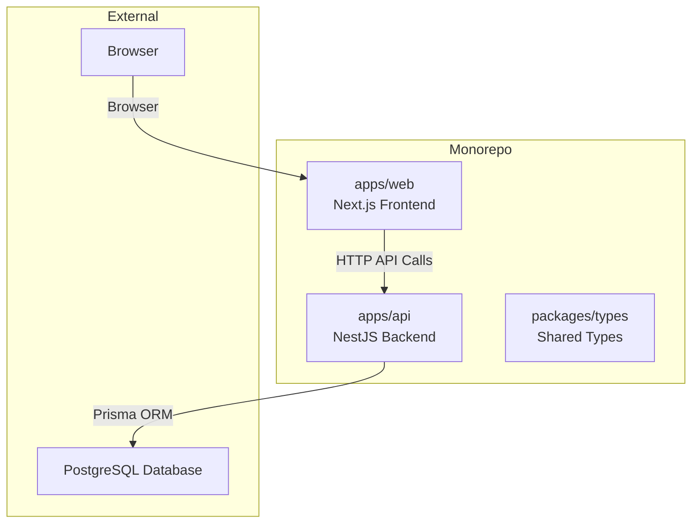
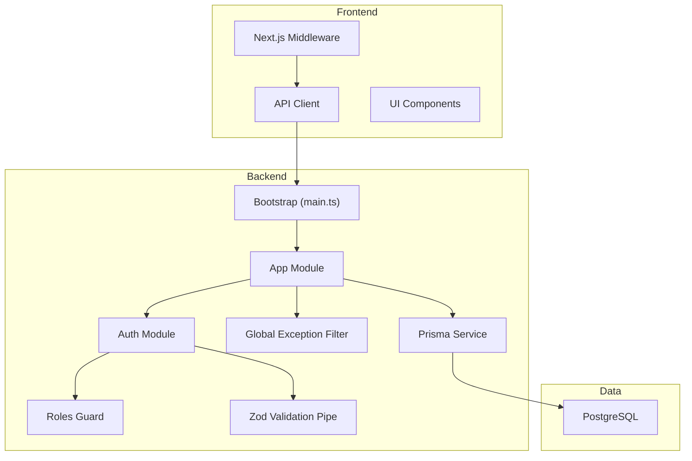
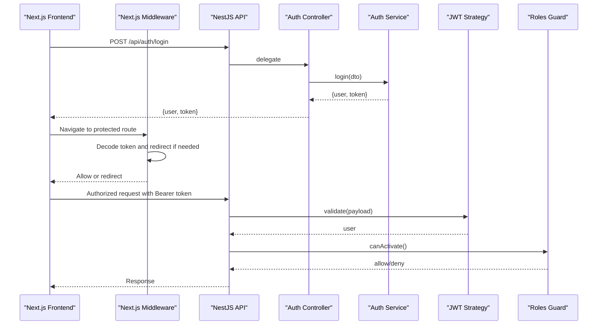
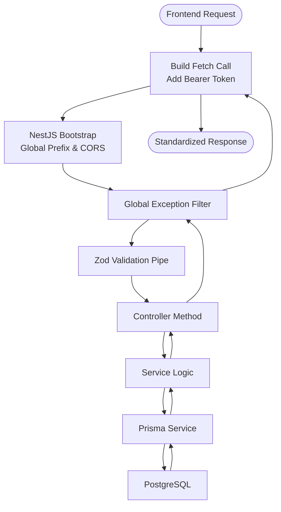
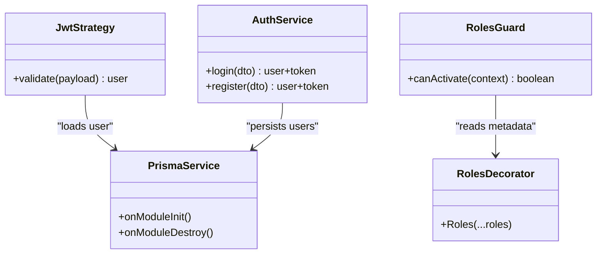
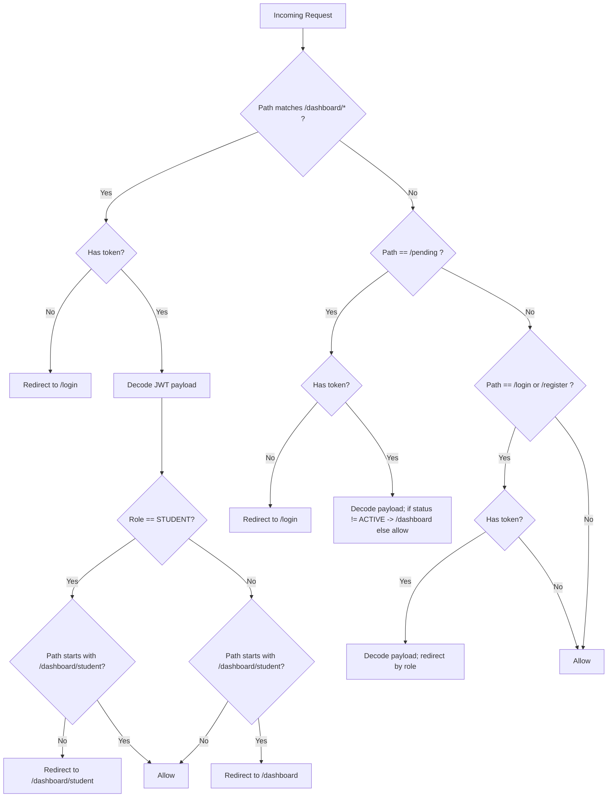
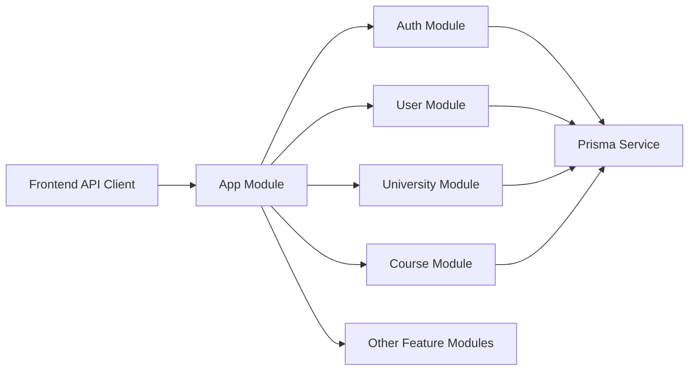

# Architecture Overview

<cite>
**Referenced Files in This Document**
- [apps/api/src/main.ts](file://apps/api/src/main.ts)
- [apps/api/src/app.module.ts](file://apps/api/src/app.module.ts)
- [apps/api/src/modules/auth/auth.module.ts](file://apps/api/src/modules/auth/auth.module.ts)
- [apps/api/src/modules/auth/auth.controller.ts](file://apps/api/src/modules/auth/auth.controller.ts)
- [apps/api/src/modules/auth/auth.service.ts](file://apps/api/src/modules/auth/auth.service.ts)
- [apps/api/src/modules/auth/jwt.strategy.ts](file://apps/api/src/modules/auth/jwt.strategy.ts)
- [apps/api/src/common/guards/roles.guard.ts](file://apps/api/src/common/guards/roles.guard.ts)
- [apps/api/src/common/decorators/roles.decorator.ts](file://apps/api/src/common/decorators/roles.decorator.ts)
- [apps/api/src/common/constants/roles.ts](file://apps/api/src/common/constants/roles.ts)
- [apps/api/src/common/filters/http-exception.filter.ts](file://apps/api/src/common/filters/http-exception.filter.ts)
- [apps/api/src/common/pipes/zod-validation.pipe.ts](file://apps/api/src/common/pipes/zod-validation.pipe.ts)
- [apps/api/src/prisma/prisma.service.ts](file://apps/api/src/prisma/prisma.service.ts)
- [apps/api/prisma/schema.prisma](file://apps/api/prisma/schema.prisma)
- [apps/web/middleware.ts](file://apps/web/middleware.ts)
- [apps/web/lib/api.ts](file://apps/web/lib/api.ts)
- [package.json](file://package.json)
</cite>

## Table of Contents
1. [Introduction](#introduction)
2. [Project Structure](#project-structure)
3. [Core Components](#core-components)
4. [Architecture Overview](#architecture-overview)
5. [Detailed Component Analysis](#detailed-component-analysis)
6. [Dependency Analysis](#dependency-analysis)
7. [Performance Considerations](#performance-considerations)
8. [Troubleshooting Guide](#troubleshooting-guide)
9. [Conclusion](#conclusion)
10. [Appendices](#appendices)

## Introduction
This document describes the system architecture of Yaz Okulu Var Mı?, a monorepo platform connecting students and universities for summer course discovery. The backend is built with NestJS and the frontend with Next.js. The system follows a layered architecture with feature-based modules, robust dependency injection, and a service layer that encapsulates business logic. Security is enforced via JWT authentication, role-based access control (RBAC), and multitenancy aligned to university tenants. The frontend integrates with the backend through a typed API client and enforces route-level protections using Next.js middleware.

## Project Structure
The repository is organized as a monorepo with two primary applications and shared packages:
- apps/api: NestJS backend exposing REST APIs under /api.
- apps/web: Next.js frontend with server-side route protection and client-side state management patterns.
- packages/types: Shared TypeScript types.
- Root package.json coordinates development and build scripts across workspaces.

**Diagram sources**
- [apps/api/src/app.module.ts](file://apps/api/src/app.module.ts#L30-L48)
- [apps/web/lib/api.ts](file://apps/web/lib/api.ts#L7-L8)
- [apps/api/src/prisma/prisma.service.ts](file://apps/api/src/prisma/prisma.service.ts#L8-L32)

**Section sources**
- [package.json](file://package.json#L6-L8)
- [apps/api/src/app.module.ts](file://apps/api/src/app.module.ts#L30-L48)

## Core Components
- Bootstrap and global configuration: Initializes NestJS application, sets global prefix, enables CORS, registers global exception filter, and listens on configured port.
- Application module: Aggregates feature modules and exposes a health check endpoint.
- Authentication module: Provides JWT-based login/register with Passport strategy and Zod validation.
- Guards and decorators: Roles guard and decorator enforce RBAC at controller/method level.
- Prisma service: Singleton client managing database connectivity and logging.
- Frontend API client: Centralized HTTP client handling tokens and unified error handling.
- Next.js middleware: Enforces route-level access control and redirects based on JWT payload.

**Section sources**
- [apps/api/src/main.ts](file://apps/api/src/main.ts#L10-L31)
- [apps/api/src/app.module.ts](file://apps/api/src/app.module.ts#L17-L28)
- [apps/api/src/modules/auth/auth.module.ts](file://apps/api/src/modules/auth/auth.module.ts#L13-L29)
- [apps/api/src/common/guards/roles.guard.ts](file://apps/api/src/common/guards/roles.guard.ts#L20-L55)
- [apps/api/src/common/decorators/roles.decorator.ts](file://apps/api/src/common/decorators/roles.decorator.ts#L9-L15)
- [apps/api/src/prisma/prisma.service.ts](file://apps/api/src/prisma/prisma.service.ts#L8-L32)
- [apps/web/lib/api.ts](file://apps/web/lib/api.ts#L10-L36)
- [apps/web/middleware.ts](file://apps/web/middleware.ts#L25-L102)

## Architecture Overview
The system employs a layered architecture:
- Presentation Layer (Next.js): UI rendering, route protection, and API consumption.
- Application Layer (NestJS): Controllers, guards, pipes, and services implementing business logic.
- Persistence Layer (Prisma + PostgreSQL): Typed queries, indexes, and multitenancy enforcement.

**Diagram sources**
- [apps/api/src/main.ts](file://apps/api/src/main.ts#L10-L31)
- [apps/api/src/app.module.ts](file://apps/api/src/app.module.ts#L30-L48)
- [apps/api/src/modules/auth/auth.module.ts](file://apps/api/src/modules/auth/auth.module.ts#L13-L29)
- [apps/api/src/common/guards/roles.guard.ts](file://apps/api/src/common/guards/roles.guard.ts#L20-L55)
- [apps/api/src/common/pipes/zod-validation.pipe.ts](file://apps/api/src/common/pipes/zod-validation.pipe.ts#L14-L44)
- [apps/api/src/common/filters/http-exception.filter.ts](file://apps/api/src/common/filters/http-exception.filter.ts#L16-L49)
- [apps/api/src/prisma/prisma.service.ts](file://apps/api/src/prisma/prisma.service.ts#L8-L32)
- [apps/web/middleware.ts](file://apps/web/middleware.ts#L25-L102)
- [apps/web/lib/api.ts](file://apps/web/lib/api.ts#L10-L36)

## Detailed Component Analysis

### Authentication and Authorization Pipeline
End-to-end flow from frontend to backend and back:
1. Frontend calls login/register via the API client.
2. Backend validates DTOs with Zod, authenticates against the database, and issues JWT.
3. Frontend stores the token and sends it on subsequent requests.
4. Next.js middleware decodes the token and enforces route-level access control.
5. NestJS Passport strategy validates JWT and attaches user to request.
6. Roles guard checks required roles for protected endpoints.

**Diagram sources**
- [apps/web/lib/api.ts](file://apps/web/lib/api.ts#L40-L59)
- [apps/web/middleware.ts](file://apps/web/middleware.ts#L25-L102)
- [apps/api/src/modules/auth/auth.controller.ts](file://apps/api/src/modules/auth/auth.controller.ts#L12-L27)
- [apps/api/src/modules/auth/auth.service.ts](file://apps/api/src/modules/auth/auth.service.ts#L136-L170)
- [apps/api/src/modules/auth/jwt.strategy.ts](file://apps/api/src/modules/auth/jwt.strategy.ts#L21-L57)
- [apps/api/src/common/guards/roles.guard.ts](file://apps/api/src/common/guards/roles.guard.ts#L20-L55)

**Section sources**
- [apps/web/lib/api.ts](file://apps/web/lib/api.ts#L10-L36)
- [apps/web/middleware.ts](file://apps/web/middleware.ts#L25-L102)
- [apps/api/src/modules/auth/auth.controller.ts](file://apps/api/src/modules/auth/auth.controller.ts#L12-L27)
- [apps/api/src/modules/auth/auth.service.ts](file://apps/api/src/modules/auth/auth.service.ts#L136-L170)
- [apps/api/src/modules/auth/jwt.strategy.ts](file://apps/api/src/modules/auth/jwt.strategy.ts#L21-L57)
- [apps/api/src/common/guards/roles.guard.ts](file://apps/api/src/common/guards/roles.guard.ts#L20-L55)

### Data Flow: Request Through Layers
The request lifecycle from frontend to database and back:
1. Frontend API client constructs requests with Authorization header.
2. NestJS bootstrap applies global prefix and CORS.
3. Global exception filter standardizes error responses.
4. Zod validation pipe enforces DTO schemas.
5. Services encapsulate business logic and coordinate Prisma queries.
6. Prisma service manages connection lifecycle and logs.

**Diagram sources**
- [apps/web/lib/api.ts](file://apps/web/lib/api.ts#L10-L36)
- [apps/api/src/main.ts](file://apps/api/src/main.ts#L14-L23)
- [apps/api/src/common/filters/http-exception.filter.ts](file://apps/api/src/common/filters/http-exception.filter.ts#L16-L49)
- [apps/api/src/common/pipes/zod-validation.pipe.ts](file://apps/api/src/common/pipes/zod-validation.pipe.ts#L14-L44)
- [apps/api/src/prisma/prisma.service.ts](file://apps/api/src/prisma/prisma.service.ts#L8-L32)

**Section sources**
- [apps/web/lib/api.ts](file://apps/web/lib/api.ts#L10-L36)
- [apps/api/src/main.ts](file://apps/api/src/main.ts#L14-L23)
- [apps/api/src/common/filters/http-exception.filter.ts](file://apps/api/src/common/filters/http-exception.filter.ts#L16-L49)
- [apps/api/src/common/pipes/zod-validation.pipe.ts](file://apps/api/src/common/pipes/zod-validation.pipe.ts#L14-L44)
- [apps/api/src/prisma/prisma.service.ts](file://apps/api/src/prisma/prisma.service.ts#L8-L32)

### Security Architecture: JWT, RBAC, and Multitenancy
- JWT authentication: Passport strategy extracts token from Authorization header, verifies signature, and loads user from database. The strategy returns user data attached to the request.
- RBAC: The Roles decorator annotates handlers with required roles; the Roles guard enforces them against request.user.role.
- Multitenancy: The database schema defines a tenant relationship via universityId on User and Course. Business logic enforces row-level access by comparing the requester’s universityId with the target resource.

**Diagram sources**
- [apps/api/src/modules/auth/jwt.strategy.ts](file://apps/api/src/modules/auth/jwt.strategy.ts#L21-L57)
- [apps/api/src/common/guards/roles.guard.ts](file://apps/api/src/common/guards/roles.guard.ts#L20-L55)
- [apps/api/src/common/decorators/roles.decorator.ts](file://apps/api/src/common/decorators/roles.decorator.ts#L9-L15)
- [apps/api/src/modules/auth/auth.service.ts](file://apps/api/src/modules/auth/auth.service.ts#L136-L170)
- [apps/api/src/prisma/prisma.service.ts](file://apps/api/src/prisma/prisma.service.ts#L8-L32)

**Section sources**
- [apps/api/src/modules/auth/jwt.strategy.ts](file://apps/api/src/modules/auth/jwt.strategy.ts#L21-L57)
- [apps/api/src/common/guards/roles.guard.ts](file://apps/api/src/common/guards/roles.guard.ts#L20-L55)
- [apps/api/src/common/decorators/roles.decorator.ts](file://apps/api/src/common/decorators/roles.decorator.ts#L9-L15)
- [apps/api/src/modules/auth/auth.service.ts](file://apps/api/src/modules/auth/auth.service.ts#L136-L170)
- [apps/api/prisma/schema.prisma](file://apps/api/prisma/schema.prisma#L60-L85)

### Middleware Pipeline and Route Protection
Next.js middleware performs route-level checks:
- Requires token for /dashboard routes; otherwise redirects to login.
- Validates JWT payload and enforces role-specific routing (STUDENT vs UNIVERSITY/ADMIN).
- Redirects UNIVERSITY users based on account status (ACTIVE vs PENDING vs REJECTED).
- Prevents authenticated users from accessing login/register pages.

**Diagram sources**
- [apps/web/middleware.ts](file://apps/web/middleware.ts#L25-L102)

**Section sources**
- [apps/web/middleware.ts](file://apps/web/middleware.ts#L25-L102)

### State Management Patterns
- Frontend state is primarily managed client-side with React patterns. Tokens are stored in browser storage and attached to API requests. There is no explicit Redux/Pinia store observed in the provided files; state is handled per-page and component scopes.

[No sources needed since this section summarizes observed patterns without analyzing specific files]

## Dependency Analysis
- NestJS modules depend on shared pipes, guards, and filters registered globally.
- Feature modules (auth, user, university, course, etc.) depend on Prisma service for persistence.
- Frontend depends on the API client for all backend communication.
- Root package.json orchestrates workspace builds and scripts.

**Diagram sources**
- [apps/api/src/app.module.ts](file://apps/api/src/app.module.ts#L30-L48)
- [apps/api/src/prisma/prisma.service.ts](file://apps/api/src/prisma/prisma.service.ts#L8-L32)
- [apps/web/lib/api.ts](file://apps/web/lib/api.ts#L7-L8)

**Section sources**
- [apps/api/src/app.module.ts](file://apps/api/src/app.module.ts#L30-L48)
- [apps/api/src/prisma/prisma.service.ts](file://apps/api/src/prisma/prisma.service.ts#L8-L32)
- [apps/web/lib/api.ts](file://apps/web/lib/api.ts#L7-L8)
- [package.json](file://package.json#L10-L18)

## Performance Considerations
- Database indexing: Prisma schema defines composite and selective indexes to optimize frequent queries (e.g., name/code search, university filtering, status indexing).
- Pagination limits: Service logic caps page sizes to prevent excessive load.
- Asynchronous operations: Parallel queries (e.g., data + count) improve response times.
- Caching: No explicit caching layer is present; consider Redis for hot data (e.g., popular courses, widget configs).
- CDN: Static assets and widget configurations can leverage CDN for reduced latency.

**Section sources**
- [apps/api/prisma/schema.prisma](file://apps/api/prisma/schema.prisma#L116-L122)
- [apps/api/src/modules/course/course.service.ts](file://apps/api/src/modules/course/course.service.ts#L32-L34)

## Troubleshooting Guide
- Standardized error responses: The global exception filter ensures consistent error payloads with status, path, and timestamp.
- Validation errors: Zod validation pipe returns structured errors with field paths and messages.
- Authentication failures: JWT strategy throws unauthorized when user not found; login rejects invalid credentials or REJECTED accounts.
- Access denied: Roles guard throws forbidden when requested role is not present.

**Section sources**
- [apps/api/src/common/filters/http-exception.filter.ts](file://apps/api/src/common/filters/http-exception.filter.ts#L16-L49)
- [apps/api/src/common/pipes/zod-validation.pipe.ts](file://apps/api/src/common/pipes/zod-validation.pipe.ts#L14-L44)
- [apps/api/src/modules/auth/jwt.strategy.ts](file://apps/api/src/modules/auth/jwt.strategy.ts#L38-L56)
- [apps/api/src/modules/auth/auth.service.ts](file://apps/api/src/modules/auth/auth.service.ts#L136-L170)
- [apps/api/src/common/guards/roles.guard.ts](file://apps/api/src/common/guards/roles.guard.ts#L20-L55)

## Conclusion
Yaz Okulu Var Mı? employs a clean, layered architecture with strong separation of concerns. The NestJS backend leverages dependency injection, guards, pipes, and a robust service layer, while the Next.js frontend enforces route-level protections and consumes a centralized API client. Security is reinforced through JWT, RBAC, and multitenancy aligned to university tenants. The system is designed for maintainability and extensibility, with clear boundaries between modules and consistent error handling.

## Appendices
- Deployment and scripts are coordinated via the root package.json workspaces and scripts for development and build tasks across applications.

**Section sources**
- [package.json](file://package.json#L10-L18)