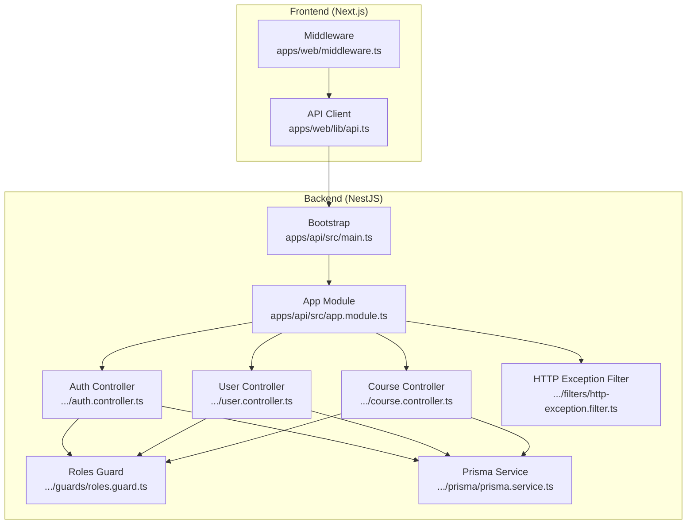
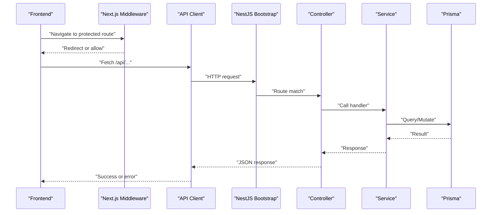
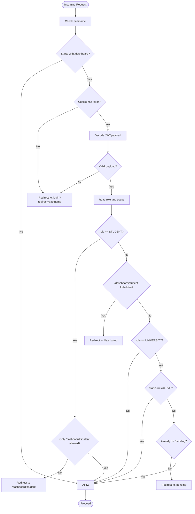
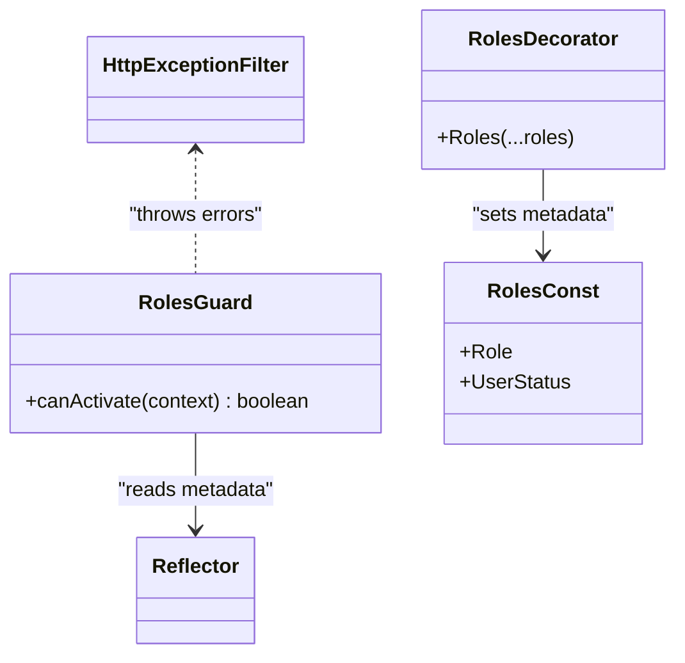
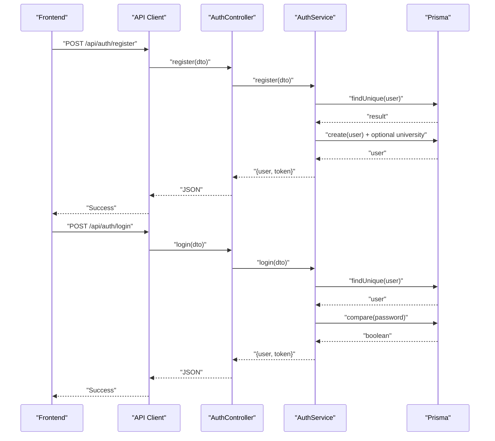
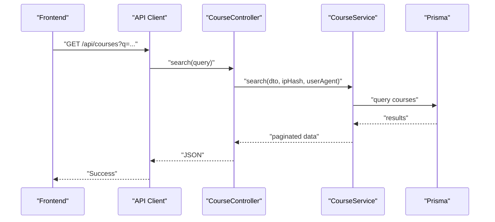
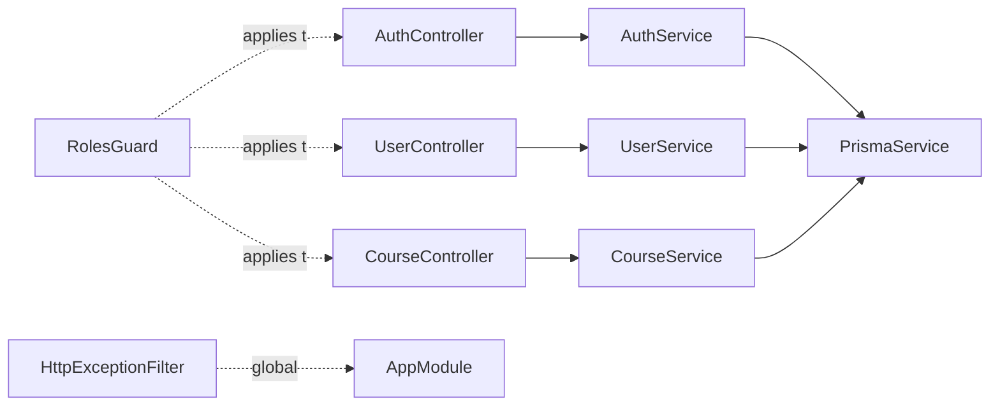

# Data Flow Architecture

<cite>
**Referenced Files in This Document**
- [middleware.ts](file://apps/web/middleware.ts)
- [api.ts](file://apps/web/lib/api.ts)
- [main.ts](file://apps/api/src/main.ts)
- [app.module.ts](file://apps/api/src/app.module.ts)
- [http-exception.filter.ts](file://apps/api/src/common/filters/http-exception.filter.ts)
- [roles.guard.ts](file://apps/api/src/common/guards/roles.guard.ts)
- [roles.decorator.ts](file://apps/api/src/common/decorators/roles.decorator.ts)
- [roles.ts](file://apps/api/src/common/constants/roles.ts)
- [auth.controller.ts](file://apps/api/src/modules/auth/auth.controller.ts)
- [auth.service.ts](file://apps/api/src/modules/auth/auth.service.ts)
- [user.controller.ts](file://apps/api/src/modules/user/user.controller.ts)
- [user.service.ts](file://apps/api/src/modules/user/user.service.ts)
- [course.controller.ts](file://apps/api/src/modules/course/course.controller.ts)
- [prisma.service.ts](file://apps/api/src/prisma/prisma.service.ts)
</cite>

## Table of Contents
1. [Introduction](#introduction)
2. [Project Structure](#project-structure)
3. [Core Components](#core-components)
4. [Architecture Overview](#architecture-overview)
5. [Detailed Component Analysis](#detailed-component-analysis)
6. [Dependency Analysis](#dependency-analysis)
7. [Performance Considerations](#performance-considerations)
8. [Troubleshooting Guide](#troubleshooting-guide)
9. [Conclusion](#conclusion)

## Introduction
This document describes the complete data flow architecture for Yaz Okulu Var Mı?, from frontend requests through Next.js middleware, authentication guards, NestJS controllers and services, to Prisma database access. It explains the request lifecycle including authentication validation, authorization checks, business logic execution, and response generation. It also documents error handling, logging, transaction management, asynchronous processing patterns, caching strategies, and performance optimizations. Finally, it covers integration points between frontend and backend, state synchronization, and real-time data updates.

## Project Structure
The system comprises:
- Frontend (Next.js app) with middleware for route-level access control and an API client module for backend communication.
- Backend (NestJS) with global configuration, guards, filters, feature modules (auth, user, course, etc.), and Prisma integration.

**Diagram sources**
- [middleware.ts](file://apps/web/middleware.ts#L1-L107)
- [api.ts](file://apps/web/lib/api.ts#L1-L378)
- [main.ts](file://apps/api/src/main.ts#L1-L34)
- [app.module.ts](file://apps/api/src/app.module.ts#L1-L49)
- [auth.controller.ts](file://apps/api/src/modules/auth/auth.controller.ts#L1-L28)
- [user.controller.ts](file://apps/api/src/modules/user/user.controller.ts#L1-L40)
- [course.controller.ts](file://apps/api/src/modules/course/course.controller.ts#L1-L148)
- [roles.guard.ts](file://apps/api/src/common/guards/roles.guard.ts#L1-L56)
- [http-exception.filter.ts](file://apps/api/src/common/filters/http-exception.filter.ts#L1-L50)
- [prisma.service.ts](file://apps/api/src/prisma/prisma.service.ts#L1-L33)

**Section sources**
- [middleware.ts](file://apps/web/middleware.ts#L1-L107)
- [api.ts](file://apps/web/lib/api.ts#L1-L378)
- [main.ts](file://apps/api/src/main.ts#L1-L34)
- [app.module.ts](file://apps/api/src/app.module.ts#L1-L49)

## Core Components
- Frontend middleware enforces route-level access control and redirects based on JWT payload claims (role and status).
- API client encapsulates HTTP requests, adds Authorization headers, and centralizes error handling.
- NestJS bootstrap sets global prefix, CORS, and registers a global exception filter.
- Controllers expose endpoints and apply guards for authentication and role-based authorization.
- Services implement business logic and coordinate with Prisma for persistence.
- Prisma service manages a singleton client lifecycle and logs database events.

**Section sources**
- [middleware.ts](file://apps/web/middleware.ts#L25-L102)
- [api.ts](file://apps/web/lib/api.ts#L10-L36)
- [main.ts](file://apps/api/src/main.ts#L10-L31)
- [roles.guard.ts](file://apps/api/src/common/guards/roles.guard.ts#L20-L55)
- [prisma.service.ts](file://apps/api/src/prisma/prisma.service.ts#L8-L33)

## Architecture Overview
The request lifecycle follows a strict pipeline:
1. Frontend sends a request via the API client.
2. Next.js middleware validates presence and validity of the token and enforces role/status-based routing.
3. NestJS bootstrap configures the server, applies global filters, and exposes routes under /api.
4. Route-specific guards validate JWT and roles.
5. Controllers delegate to services for business logic.
6. Services query or mutate data via Prisma.
7. Responses are returned to the client; errors are normalized by the global filter.

**Diagram sources**
- [middleware.ts](file://apps/web/middleware.ts#L25-L102)
- [api.ts](file://apps/web/lib/api.ts#L10-L36)
- [main.ts](file://apps/api/src/main.ts#L10-L31)
- [auth.controller.ts](file://apps/api/src/modules/auth/auth.controller.ts#L12-L27)
- [auth.service.ts](file://apps/api/src/modules/auth/auth.service.ts#L46-L130)
- [prisma.service.ts](file://apps/api/src/prisma/prisma.service.ts#L12-L31)

## Detailed Component Analysis

### Frontend Authentication and Routing
- Middleware decodes JWT payload from cookie, enforces role and status constraints, and redirects accordingly.
- Protected routes include /dashboard and special pages (/pending, /login, /register) with role-aware logic.
- Redirects preserve intended destination for seamless UX.

**Diagram sources**
- [middleware.ts](file://apps/web/middleware.ts#L25-L102)

**Section sources**
- [middleware.ts](file://apps/web/middleware.ts#L11-L102)

### API Client and Token Management
- Centralized fetch wrapper injects Authorization header when present.
- Error responses are parsed and thrown as JavaScript errors for consistent handling.
- Exposes typed modules for auth, course, university, user, student, widget, and admin domains.

Key behaviors:
- Reads token from localStorage in browser context.
- Ensures Content-Type is JSON.
- Normalizes error messages from backend.

**Section sources**
- [api.ts](file://apps/web/lib/api.ts#L10-L36)
- [api.ts](file://apps/web/lib/api.ts#L38-L378)

### NestJS Bootstrap and Global Configuration
- Sets global prefix to /api (excluding root health check).
- Enables CORS for configured frontend origin with credentials.
- Registers a global exception filter to standardize error responses.

**Section sources**
- [main.ts](file://apps/api/src/main.ts#L14-L29)

### Global Exception Filter
- Catches all exceptions and returns a standardized JSON response.
- Logs error details with request metadata.
- Maps known HTTP exceptions to appropriate status codes.

**Section sources**
- [http-exception.filter.ts](file://apps/api/src/common/filters/http-exception.filter.ts#L16-L48)

### Authentication Guards and Authorization
- Roles guard reads required roles from controller/method metadata and compares against request.user.role.
- Throws forbidden errors when roles mismatch.
- Works in tandem with Passport JWT guard applied at controller level.

**Diagram sources**
- [roles.guard.ts](file://apps/api/src/common/guards/roles.guard.ts#L20-L55)
- [roles.decorator.ts](file://apps/api/src/common/decorators/roles.decorator.ts#L9-L15)
- [roles.ts](file://apps/api/src/common/constants/roles.ts#L5-L6)
- [http-exception.filter.ts](file://apps/api/src/common/filters/http-exception.filter.ts#L16-L48)

**Section sources**
- [roles.guard.ts](file://apps/api/src/common/guards/roles.guard.ts#L20-L55)
- [roles.decorator.ts](file://apps/api/src/common/decorators/roles.decorator.ts#L9-L15)
- [roles.ts](file://apps/api/src/common/constants/roles.ts#L5-L6)

### Auth Module: Registration and Login
- Registration:
  - Validates uniqueness of email.
  - Enforces .edu.tr domain for UNIVERSITY role.
  - Determines initial status (PENDING for UNIVERSITY, ACTIVE for others).
  - Hashes password and optionally creates university entity.
  - Generates JWT token and returns user + token.
- Login:
  - Finds user by email, verifies password.
  - Rejects REJECTED users.
  - Generates JWT token and returns user + token.

**Diagram sources**
- [auth.controller.ts](file://apps/api/src/modules/auth/auth.controller.ts#L16-L26)
- [auth.service.ts](file://apps/api/src/modules/auth/auth.service.ts#L46-L130)
- [prisma.service.ts](file://apps/api/src/prisma/prisma.service.ts#L12-L31)

**Section sources**
- [auth.controller.ts](file://apps/api/src/modules/auth/auth.controller.ts#L12-L27)
- [auth.service.ts](file://apps/api/src/modules/auth/auth.service.ts#L46-L170)

### User Module: Profile and Listing
- GET /api/users/me: Requires JWT; returns current user profile with nested university data.
- GET /api/users: Admin-only endpoint; paginated listing of users.

Asynchronous patterns:
- Uses Promise.all for concurrent count and list queries.

**Section sources**
- [user.controller.ts](file://apps/api/src/modules/user/user.controller.ts#L19-L38)
- [user.service.ts](file://apps/api/src/modules/user/user.service.ts#L15-L74)

### Course Module: Search, Comparison, CRUD
- Public search supports natural language parsing and enrichment of filters.
- Public comparison supports up to four course IDs.
- University-only CRUD endpoints for course management.
- Guards enforce JWT and UNIVERSITY role.

**Diagram sources**
- [course.controller.ts](file://apps/api/src/modules/course/course.controller.ts#L49-L75)
- [prisma.service.ts](file://apps/api/src/prisma/prisma.service.ts#L12-L31)

**Section sources**
- [course.controller.ts](file://apps/api/src/modules/course/course.controller.ts#L43-L146)

### Prisma Database Access
- Singleton PrismaClient instance with lifecycle hooks for connect/disconnect.
- Logging enabled for query, info, warn, error levels.
- Used by services to perform reads/writes.

**Section sources**
- [prisma.service.ts](file://apps/api/src/prisma/prisma.service.ts#L8-L33)

## Dependency Analysis
- Controllers depend on Services.
- Services depend on PrismaService.
- Guards and decorators influence runtime policy enforcement.
- Global filter ensures consistent error handling across all routes.
- Middleware depends on JWT payload decoding and cookie storage.

**Diagram sources**
- [auth.controller.ts](file://apps/api/src/modules/auth/auth.controller.ts#L12-L27)
- [user.controller.ts](file://apps/api/src/modules/user/user.controller.ts#L14-L39)
- [course.controller.ts](file://apps/api/src/modules/course/course.controller.ts#L36-L147)
- [roles.guard.ts](file://apps/api/src/common/guards/roles.guard.ts#L20-L55)
- [http-exception.filter.ts](file://apps/api/src/common/filters/http-exception.filter.ts#L16-L48)
- [app.module.ts](file://apps/api/src/app.module.ts#L30-L46)
- [prisma.service.ts](file://apps/api/src/prisma/prisma.service.ts#L8-L33)

**Section sources**
- [app.module.ts](file://apps/api/src/app.module.ts#L30-L46)
- [roles.guard.ts](file://apps/api/src/common/guards/roles.guard.ts#L20-L55)
- [http-exception.filter.ts](file://apps/api/src/common/filters/http-exception.filter.ts#L16-L48)

## Performance Considerations
- Asynchronous processing:
  - Services use Promise.all for concurrent operations (e.g., listing and counting).
  - Natural language parsing enriches filters without blocking the main thread.
- Caching strategies:
  - No explicit caching layer observed in controllers/services; consider implementing in-memory or Redis caching for frequently accessed data (e.g., course lists, university widgets).
- Transaction management:
  - No explicit transactions observed; consider wrapping multi-step writes (e.g., user registration + university creation) in Prisma transactions to maintain consistency.
- Network and serialization:
  - API client normalizes errors and ensures JSON content-type; consider adding retry/backoff and timeout controls.
- Logging:
  - Middleware logs redirection decisions; NestJS filter logs errors; consider structured logs for audit trails and performance metrics.

[No sources needed since this section provides general guidance]

## Troubleshooting Guide
Common scenarios and handling:
- Authentication failures:
  - Middleware redirects unauthenticated users to login; invalid tokens lead to redirect as well.
  - Backend throws unauthorized/forbidden for login/register when credentials are invalid or user is rejected.
- Authorization failures:
  - Roles guard throws forbidden when requested role is not present; ensure @Roles decorator matches user role.
- Global error normalization:
  - All exceptions are caught by the global filter and returned with a consistent JSON shape including status, message, path, and timestamp.
- Database connectivity:
  - Prisma service logs connection lifecycle; verify environment variables and database availability if connection fails.

**Section sources**
- [middleware.ts](file://apps/web/middleware.ts#L32-L72)
- [auth.service.ts](file://apps/api/src/modules/auth/auth.service.ts#L136-L170)
- [roles.guard.ts](file://apps/api/src/common/guards/roles.guard.ts#L40-L51)
- [http-exception.filter.ts](file://apps/api/src/common/filters/http-exception.filter.ts#L20-L48)
- [prisma.service.ts](file://apps/api/src/prisma/prisma.service.ts#L23-L31)

## Conclusion
The system implements a clear separation of concerns: Next.js middleware handles route-level access control, the NestJS backend enforces authentication and authorization, and services encapsulate business logic with Prisma for persistence. Global configuration ensures consistent behavior, while the API client provides a unified interface for frontend-backend communication. Areas for improvement include explicit caching, transactional writes, and enhanced observability/logging for production hardening.