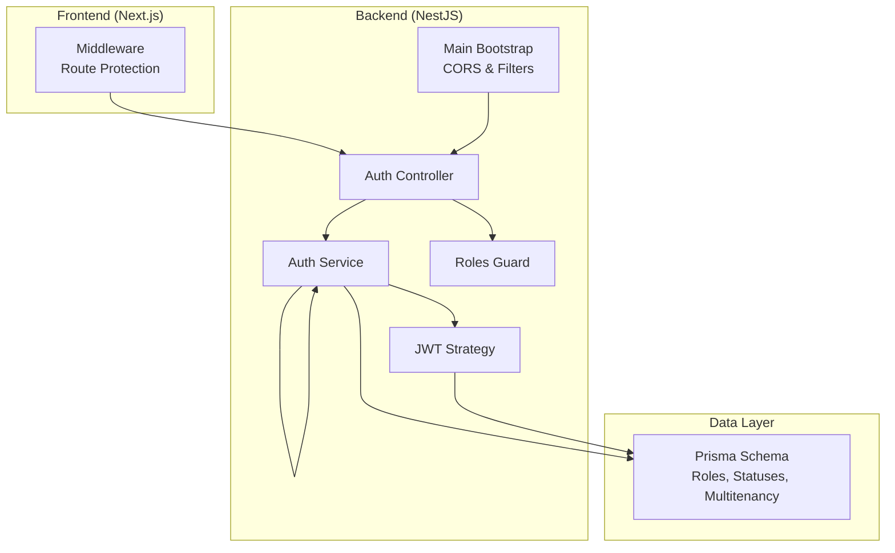
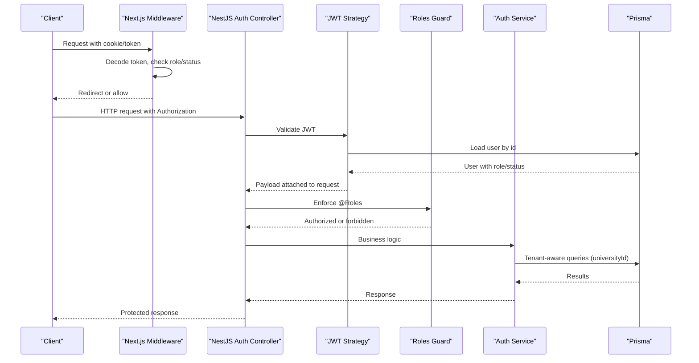
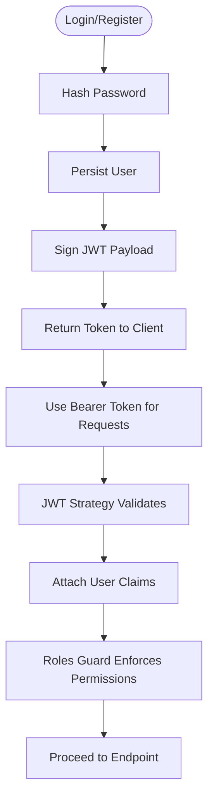
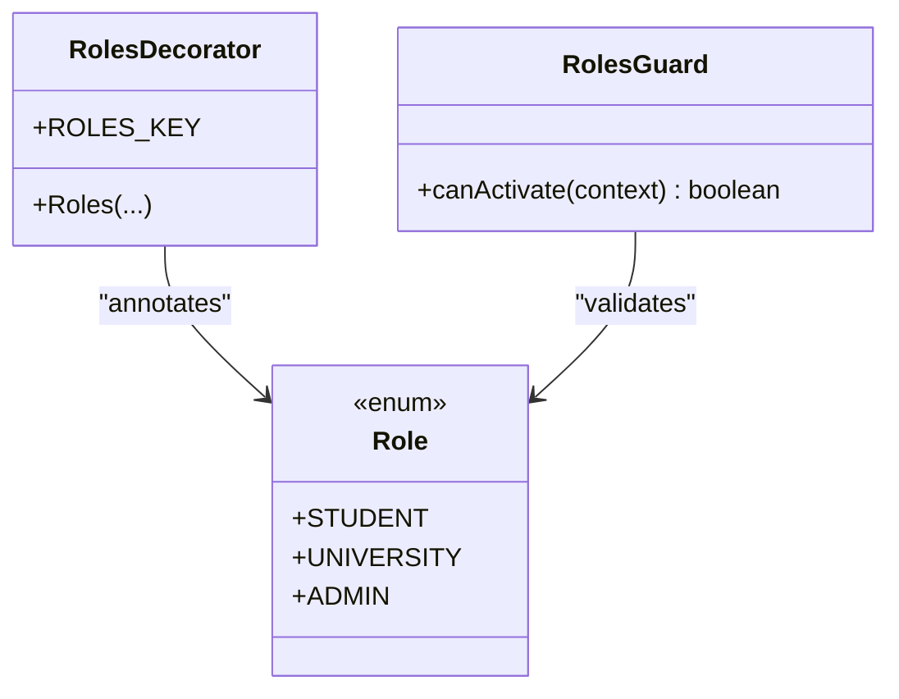
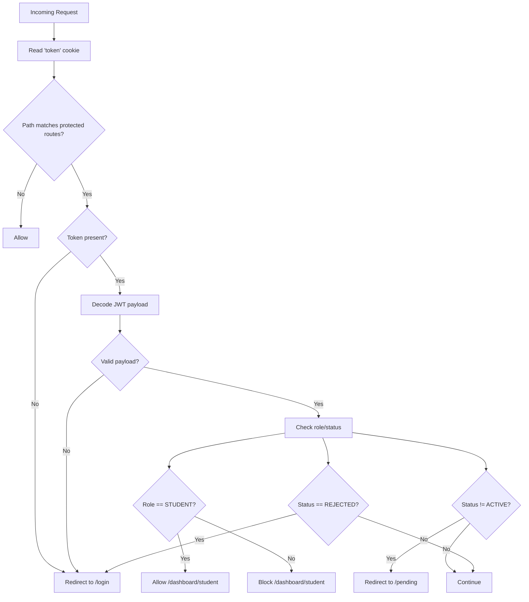
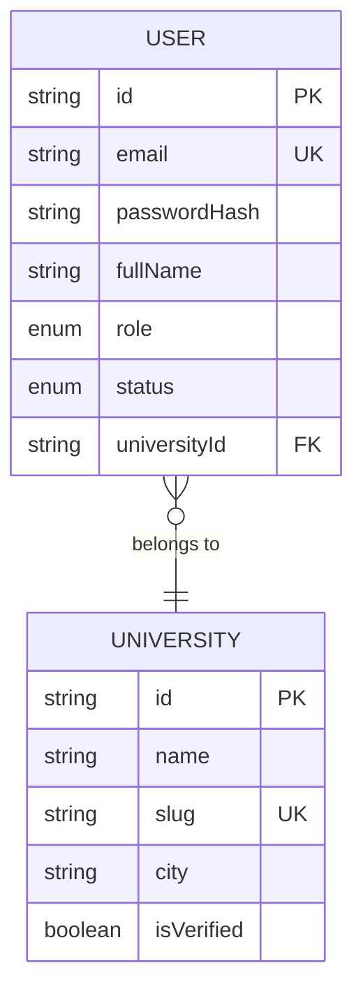
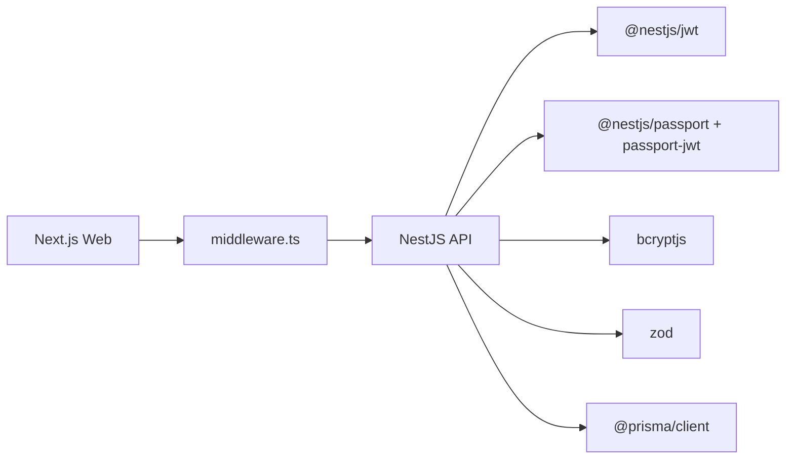

# Security Architecture

<cite>
**Referenced Files in This Document**
- [roles.ts](file://apps/api/src/common/constants/roles.ts)
- [roles.decorator.ts](file://apps/api/src/common/decorators/roles.decorator.ts)
- [roles.guard.ts](file://apps/api/src/common/guards/roles.guard.ts)
- [auth.service.ts](file://apps/api/src/modules/auth/auth.service.ts)
- [jwt.strategy.ts](file://apps/api/src/modules/auth/jwt.strategy.ts)
- [auth.controller.ts](file://apps/api/src/modules/auth/auth.controller.ts)
- [auth.dto.ts](file://apps/api/src/modules/auth/auth.dto.ts)
- [middleware.ts](file://apps/web/middleware.ts)
- [main.ts](file://apps/api/src/main.ts)
- [app.module.ts](file://apps/api/src/app.module.ts)
- [schema.prisma](file://apps/api/prisma/schema.prisma)
- [.env](file://apps/api/.env)
- [.env.local](file://apps/web/.env.local)
- [README.md](file://README.md)
</cite>

## Table of Contents
1. [Introduction](#introduction)
2. [Project Structure](#project-structure)
3. [Core Components](#core-components)
4. [Architecture Overview](#architecture-overview)
5. [Detailed Component Analysis](#detailed-component-analysis)
6. [Dependency Analysis](#dependency-analysis)
7. [Performance Considerations](#performance-considerations)
8. [Troubleshooting Guide](#troubleshooting-guide)
9. [Conclusion](#conclusion)
10. [Appendices](#appendices)

## Introduction
This document describes the security architecture of Yaz Okulu Var Mı?, focusing on authentication and authorization. The system uses JWT-based authentication with bearer tokens, role-based access control (RBAC) across STUDENT, UNIVERSITY, and ADMIN roles, robust input validation, and multitenancy safeguards. It also documents middleware protections, session-like cookie usage, CORS configuration, and audit/logging capabilities.

## Project Structure
Security-relevant modules and files are organized across the backend NestJS application and the frontend Next.js middleware:
- Backend (NestJS):
  - Authentication module with JWT strategy, controller, service, and DTOs
  - RBAC via roles decorator and guard
  - CORS configuration and global exception handling
  - Prisma schema defining roles, statuses, and multitenancy
- Frontend (Next.js):
  - Middleware enforcing route-level access control and redirects based on token, role, and status

**Diagram sources**
- [auth.controller.ts](file://apps/api/src/modules/auth/auth.controller.ts#L1-L28)
- [auth.service.ts](file://apps/api/src/modules/auth/auth.service.ts#L1-L205)
- [jwt.strategy.ts](file://apps/api/src/modules/auth/jwt.strategy.ts#L1-L58)
- [roles.guard.ts](file://apps/api/src/common/guards/roles.guard.ts#L1-L56)
- [main.ts](file://apps/api/src/main.ts#L1-L34)
- [schema.prisma](file://apps/api/prisma/schema.prisma#L1-L183)

**Section sources**
- [auth.controller.ts](file://apps/api/src/modules/auth/auth.controller.ts#L1-L28)
- [auth.service.ts](file://apps/api/src/modules/auth/auth.service.ts#L1-L205)
- [jwt.strategy.ts](file://apps/api/src/modules/auth/jwt.strategy.ts#L1-L58)
- [roles.guard.ts](file://apps/api/src/common/guards/roles.guard.ts#L1-L56)
- [main.ts](file://apps/api/src/main.ts#L1-L34)
- [schema.prisma](file://apps/api/prisma/schema.prisma#L1-L183)

## Core Components
- JWT-based authentication with bearer tokens:
  - Token generation in the authentication service
  - JWT strategy validates tokens and attaches user claims to requests
- Role-based access control (RBAC):
  - Roles decorator defines permitted roles per endpoint
  - Roles guard enforces role checks against request.user
- Input validation:
  - Zod schemas validate registration and login payloads
- Multitenancy:
  - UNIVERSITY users are bound to a university via universityId
  - Prisma schema enforces tenant isolation
- Middleware protection:
  - Next.js middleware decodes tokens and enforces role/status-based routing
- CORS and security headers:
  - Backend enables CORS with credentials for frontend-origin
- Audit logging:
  - ActivityLog model captures administrative and sensitive actions

**Section sources**
- [auth.service.ts](file://apps/api/src/modules/auth/auth.service.ts#L172-L188)
- [jwt.strategy.ts](file://apps/api/src/modules/auth/jwt.strategy.ts#L22-L56)
- [roles.decorator.ts](file://apps/api/src/common/decorators/roles.decorator.ts#L1-L16)
- [roles.guard.ts](file://apps/api/src/common/guards/roles.guard.ts#L24-L54)
- [auth.dto.ts](file://apps/api/src/modules/auth/auth.dto.ts#L9-L45)
- [schema.prisma](file://apps/api/prisma/schema.prisma#L60-L85)
- [middleware.ts](file://apps/web/middleware.ts#L25-L102)
- [main.ts](file://apps/api/src/main.ts#L19-L23)
- [schema.prisma](file://apps/api/prisma/schema.prisma#L140-L154)

## Architecture Overview
End-to-end security flow:
- Clients send Bearer tokens for protected routes
- Next.js middleware enforces route-level access based on token, role, and status
- NestJS AuthGuard (via JWT strategy) validates tokens and injects user claims
- RolesGuard enforces @Roles-declared permissions
- Services apply multitenancy checks using universityId
- Audit logs record sensitive actions

**Diagram sources**
- [middleware.ts](file://apps/web/middleware.ts#L25-L102)
- [auth.controller.ts](file://apps/api/src/modules/auth/auth.controller.ts#L12-L27)
- [jwt.strategy.ts](file://apps/api/src/modules/auth/jwt.strategy.ts#L38-L56)
- [roles.guard.ts](file://apps/api/src/common/guards/roles.guard.ts#L24-L54)
- [auth.service.ts](file://apps/api/src/modules/auth/auth.service.ts#L136-L170)
- [schema.prisma](file://apps/api/prisma/schema.prisma#L60-L85)

## Detailed Component Analysis

### JWT Authentication and Token Management
- Token generation:
  - Payload includes subject, email, role, status, and universityId
  - Secret configured via environment variable
- Token validation:
  - Strategy extracts Bearer token and verifies signature
  - Loads current user from database and attaches to request
- Token lifecycle:
  - No explicit refresh mechanism is present in the backend
  - Frontend middleware decodes token to enforce routing rules

**Diagram sources**
- [auth.service.ts](file://apps/api/src/modules/auth/auth.service.ts#L69-L121)
- [auth.service.ts](file://apps/api/src/modules/auth/auth.service.ts#L172-L188)
- [jwt.strategy.ts](file://apps/api/src/modules/auth/jwt.strategy.ts#L27-L56)

**Section sources**
- [auth.service.ts](file://apps/api/src/modules/auth/auth.service.ts#L172-L188)
- [jwt.strategy.ts](file://apps/api/src/modules/auth/jwt.strategy.ts#L22-L56)
- [.env](file://apps/api/.env#L2-L2)

### Role-Based Access Control (RBAC)
- Roles definition:
  - STUDENT, UNIVERSITY, ADMIN defined in shared constants
- Permission enforcement:
  - @Roles decorator annotates handlers with allowed roles
  - RolesGuard reads metadata and compares with request.user.role
- Behavior:
  - Missing or mismatched roles trigger a forbidden response

**Diagram sources**
- [roles.decorator.ts](file://apps/api/src/common/decorators/roles.decorator.ts#L9-L15)
- [roles.guard.ts](file://apps/api/src/common/guards/roles.guard.ts#L21-L54)
- [roles.ts](file://apps/api/src/common/constants/roles.ts#L1-L6)

**Section sources**
- [roles.ts](file://apps/api/src/common/constants/roles.ts#L1-L6)
- [roles.decorator.ts](file://apps/api/src/common/decorators/roles.decorator.ts#L1-L16)
- [roles.guard.ts](file://apps/api/src/common/guards/roles.guard.ts#L1-L56)

### Middleware Implementation for Route Protection
- Next.js middleware:
  - Reads token from cookie
  - Decodes payload to determine role and status
  - Redirects unauthorized users or restricts access by role/status
  - Protects /dashboard routes and enforces role-specific subpaths
  - Handles pending status and rejected accounts

**Diagram sources**
- [middleware.ts](file://apps/web/middleware.ts#L25-L102)

**Section sources**
- [middleware.ts](file://apps/web/middleware.ts#L1-L107)

### Session Management and Security Headers
- Session-like behavior:
  - Token stored in HTTP-only cookies (frontend fetches and stores token)
  - Middleware decodes token to enforce routing rules
- Security headers and transport:
  - CORS enabled with credentials for frontend origin
  - Environment-controlled frontend URL and backend port
- Rate limiting:
  - Not implemented in the provided code

**Section sources**
- [middleware.ts](file://apps/web/middleware.ts#L28-L43)
- [main.ts](file://apps/api/src/main.ts#L19-L23)
- [.env.local](file://apps/web/.env.local#L1-L3)

### Password Hashing Strategies
- bcrypt hashing:
  - Passwords are hashed with a high-round cost during registration
  - Login compares provided password against stored hash
- Best practices:
  - Use a strong salt per password
  - Keep bcrypt cost high but reasonable for performance

**Section sources**
- [auth.service.ts](file://apps/api/src/modules/auth/auth.service.ts#L69-L70)
- [auth.service.ts](file://apps/api/src/modules/auth/auth.service.ts#L145-L148)

### Input Validation
- Zod schemas:
  - Register schema enforces email, password length, optional fullName, role defaults, and optional university fields
  - Login schema enforces email and non-empty password
- Pipeline:
  - Controllers apply ZodValidationPipe before invoking services

**Section sources**
- [auth.dto.ts](file://apps/api/src/modules/auth/auth.dto.ts#L9-L45)
- [auth.controller.ts](file://apps/api/src/modules/auth/auth.controller.ts#L16-L26)

### CORS Configuration
- Enabled with credentials support for the configured frontend origin
- Ensures cross-origin requests from the frontend can include cookies

**Section sources**
- [main.ts](file://apps/api/src/main.ts#L19-L23)
- [.env.local](file://apps/web/.env.local#L1-L3)

### Rate Limiting Mechanisms
- Not implemented in the provided code
- Recommended approaches:
  - Use a rate-limiting library or external service
  - Apply limits per IP or per user for login/register endpoints

[No sources needed since this section provides general guidance]

### Multitenancy Security Patterns and Data Isolation
- Tenant model:
  - University model acts as tenant with unique identifiers
- User isolation:
  - Users have optional universityId; UNIVERSITY users are bound to a university
- Service-level tenant checks:
  - While not shown in the provided files, the schema supports tenant isolation
  - Services should filter queries by universityId for UNIVERSITY users
- Database-level safeguards:
  - Foreign keys and indexes support tenant-aware queries

**Diagram sources**
- [schema.prisma](file://apps/api/prisma/schema.prisma#L36-L58)
- [schema.prisma](file://apps/api/prisma/schema.prisma#L60-L85)

**Section sources**
- [schema.prisma](file://apps/api/prisma/schema.prisma#L36-L85)

### Audit Logging and Compliance
- ActivityLog model:
  - Tracks user actions, affected entities, and timestamps
  - Supports compliance reporting and forensic analysis
- SearchLog anonymization:
  - IP addresses are hashed to protect privacy

**Section sources**
- [schema.prisma](file://apps/api/prisma/schema.prisma#L140-L154)
- [schema.prisma](file://apps/api/prisma/schema.prisma#L124-L138)

## Dependency Analysis
- Backend dependencies:
  - NestJS JWT and Passport for token handling
  - bcryptjs for password hashing
  - Zod for input validation
  - Prisma for data access and multitenancy
- Frontend dependency:
  - Next.js middleware for route protection

**Diagram sources**
- [auth.service.ts](file://apps/api/src/modules/auth/auth.service.ts#L14-L16)
- [jwt.strategy.ts](file://apps/api/src/modules/auth/jwt.strategy.ts#L7-L10)
- [auth.dto.ts](file://apps/api/src/modules/auth/auth.dto.ts#L5-L5)
- [middleware.ts](file://apps/web/middleware.ts#L8-L9)

**Section sources**
- [auth.service.ts](file://apps/api/src/modules/auth/auth.service.ts#L14-L16)
- [jwt.strategy.ts](file://apps/api/src/modules/auth/jwt.strategy.ts#L7-L10)
- [auth.dto.ts](file://apps/api/src/modules/auth/auth.dto.ts#L5-L5)
- [middleware.ts](file://apps/web/middleware.ts#L8-L9)

## Performance Considerations
- Token verification:
  - JWT strategy performs a single database lookup per request
- Validation overhead:
  - Zod schemas add minimal CPU cost compared to database calls
- Index usage:
  - Prisma schema includes indexes on role, status, universityId, and search fields to optimize tenant and query performance

[No sources needed since this section provides general guidance]

## Troubleshooting Guide
- Unauthorized access attempts:
  - Verify token presence and validity in requests
  - Confirm JWT_SECRET is set and consistent
- Role-based access denied:
  - Ensure @Roles decorator aligns with user role in database
  - Check request.user is populated by JWT strategy
- Middleware redirection loops:
  - Validate cookie storage and token decoding logic
  - Confirm role/status values match expected enums
- CORS errors:
  - Ensure FRONTEND_URL matches the origin sending requests
  - Confirm credentials are included when required

**Section sources**
- [jwt.strategy.ts](file://apps/api/src/modules/auth/jwt.strategy.ts#L38-L56)
- [roles.guard.ts](file://apps/api/src/common/guards/roles.guard.ts#L40-L51)
- [middleware.ts](file://apps/web/middleware.ts#L32-L72)
- [main.ts](file://apps/api/src/main.ts#L19-L23)
- [.env](file://apps/api/.env#L4-L4)

## Conclusion
The system implements a layered security model combining JWT authentication, RBAC, input validation, and multitenancy. The frontend middleware complements backend protections by enforcing route-level access based on token claims. While rate limiting and refresh tokens are not currently implemented, the architecture provides a solid foundation for adding these controls. Adhering to the outlined best practices and mitigations will further strengthen the system’s resilience.

[No sources needed since this section summarizes without analyzing specific files]

## Appendices

### Security Best Practices
- Rotate JWT secrets regularly and store in secure environment variables
- Enforce HTTPS in production to protect tokens and cookies
- Add rate limiting for login/register endpoints
- Implement token refresh strategies (e.g., short-lived access tokens + long-lived refresh tokens)
- Sanitize and validate all inputs beyond Zod schemas
- Monitor and alert on repeated failed authentication attempts
- Regularly review and prune stale tokens and sessions

[No sources needed since this section provides general guidance]

### Potential Vulnerabilities and Mitigations
- Token theft:
  - Use secure, HTTP-only cookies; enable SameSite and Secure flags
- Role escalation:
  - Enforce @Roles at every protected endpoint; avoid implicit trust
- Cross-site request forgery (CSRF):
  - Add CSRF tokens or Origin/CORS policies for state-changing requests
- Information disclosure:
  - Avoid exposing internal error details; use global exception filters
- Denial of service:
  - Apply rate limiting and circuit breakers for authentication endpoints

[No sources needed since this section provides general guidance]