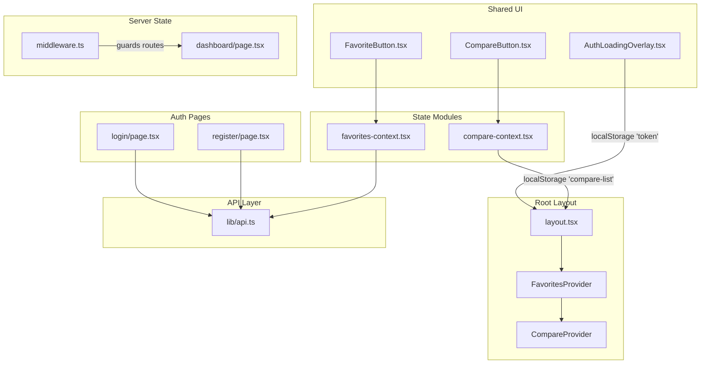
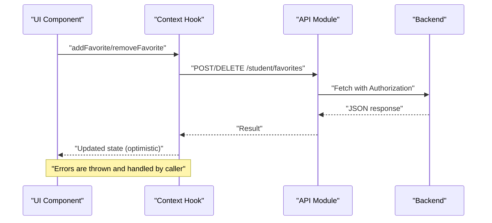
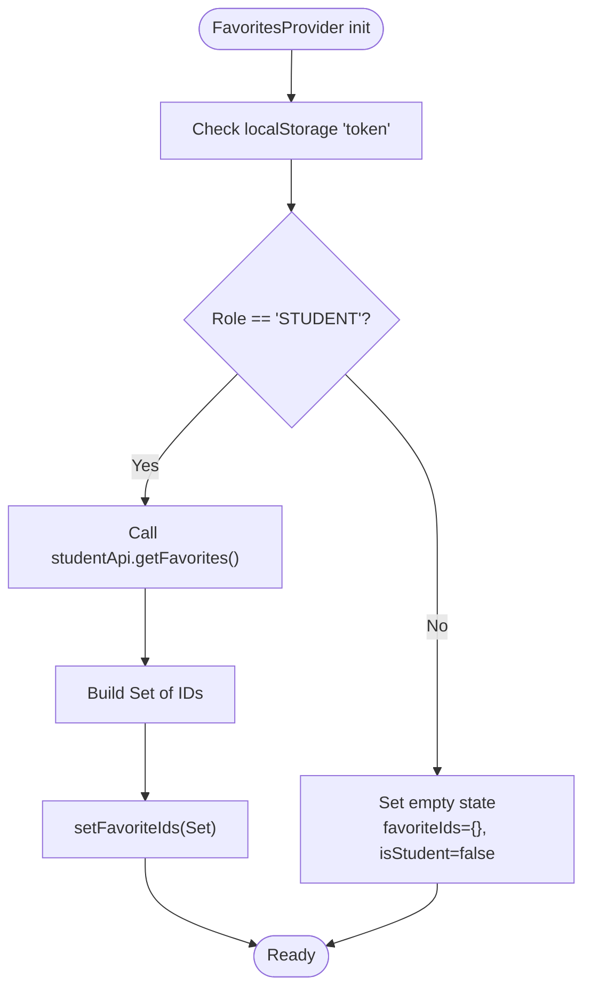
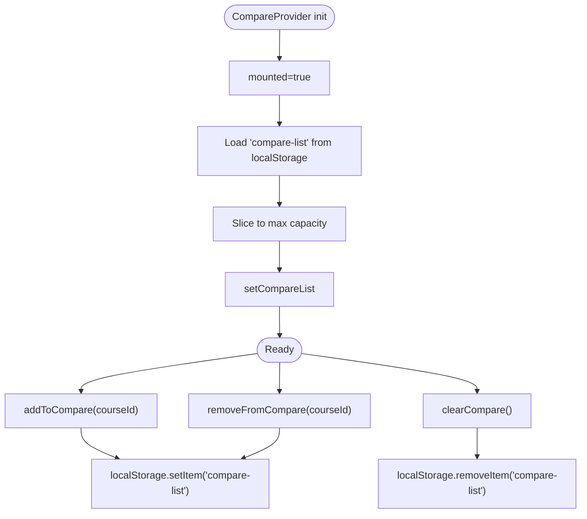
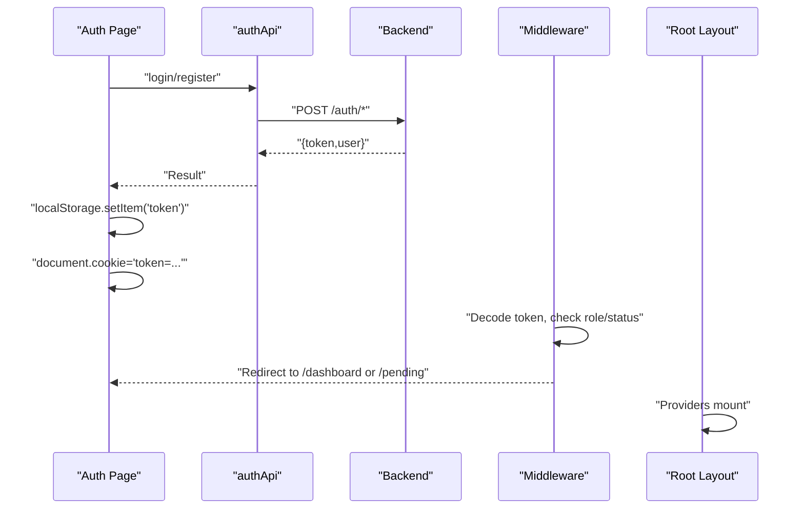
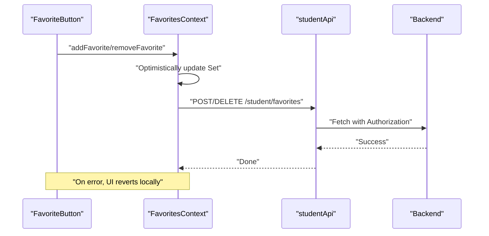
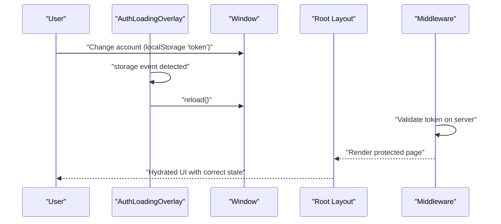
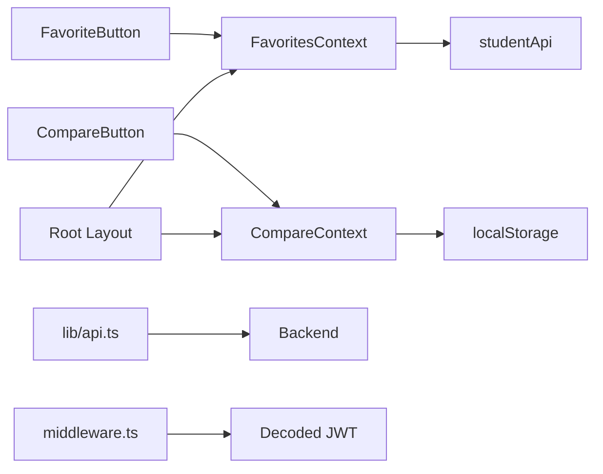

# State Management Architecture

<cite>
**Referenced Files in This Document**
- [favorites-context.tsx](file://apps/web/contexts/favorites-context.tsx)
- [compare-context.tsx](file://apps/web/contexts/compare-context.tsx)
- [api.ts](file://apps/web/lib/api.ts)
- [layout.tsx](file://apps/web/app/layout.tsx)
- [login/page.tsx](file://apps/web/app/(auth)/login/page.tsx)
- [register/page.tsx](file://apps/web/app/(auth)/register/page.tsx)
- [dashboard/page.tsx](file://apps/web/app/dashboard/page.tsx)
- [middleware.ts](file://apps/web/middleware.ts)
- [AuthLoadingOverlay.tsx](file://apps/web/components/layout/AuthLoadingOverlay.tsx)
- [FavoriteButton.tsx](file://apps/web/components/course/FavoriteButton.tsx)
- [CompareButton.tsx](file://apps/web/components/course/CompareButton.tsx)
- [FavoritesTable.tsx](file://apps/web/app/dashboard/student/components/FavoritesTable.tsx)
</cite>

## Table of Contents
1. [Introduction](#introduction)
2. [Project Structure](#project-structure)
3. [Core Components](#core-components)
4. [Architecture Overview](#architecture-overview)
5. [Detailed Component Analysis](#detailed-component-analysis)
6. [Dependency Analysis](#dependency-analysis)
7. [Performance Considerations](#performance-considerations)
8. [Troubleshooting Guide](#troubleshooting-guide)
9. [Conclusion](#conclusion)

## Introduction
This document explains the frontend state management architecture for Yaz Okulu Var Mı?, focusing on React context-based state for favorites, course comparison, and authentication. It details how contexts integrate with server state via Next.js App Router, including server-side rendering considerations, hydration patterns, loading states, error handling, optimistic updates, performance optimizations, persistence, and memory management. It also documents the interaction between frontend state and backend API calls, including caching and synchronization strategies.

## Project Structure
The frontend is a Next.js App Router application. State is centralized via React Context providers at the root layout, while individual pages and components consume context hooks. Authentication state is persisted in localStorage and cookies and validated by middleware and client components.

**Diagram sources**
- [layout.tsx](file://apps/web/app/layout.tsx#L24-L42)
- [favorites-context.tsx](file://apps/web/contexts/favorites-context.tsx#L29-L131)
- [compare-context.tsx](file://apps/web/contexts/compare-context.tsx#L30-L97)
- [login/page.tsx](file://apps/web/app/(auth)/login/page.tsx#L13-L45)
- [register/page.tsx](file://apps/web/app/(auth)/register/page.tsx#L13-L73)
- [FavoriteButton.tsx](file://apps/web/components/course/FavoriteButton.tsx#L17-L57)
- [CompareButton.tsx](file://apps/web/components/course/CompareButton.tsx#L15-L44)
- [AuthLoadingOverlay.tsx](file://apps/web/components/layout/AuthLoadingOverlay.tsx#L6-L23)
- [api.ts](file://apps/web/lib/api.ts#L11-L36)
- [middleware.ts](file://apps/web/middleware.ts#L25-L101)
- [dashboard/page.tsx](file://apps/web/app/dashboard/page.tsx#L31-L77)

**Section sources**
- [layout.tsx](file://apps/web/app/layout.tsx#L24-L42)
- [favorites-context.tsx](file://apps/web/contexts/favorites-context.tsx#L29-L131)
- [compare-context.tsx](file://apps/web/contexts/compare-context.tsx#L30-L97)
- [api.ts](file://apps/web/lib/api.ts#L11-L36)

## Core Components
- FavoritesContext: Centralized state for student favorites, including loading, student role gating, and CRUD-like operations via API.
- CompareContext: Centralized state for course comparison with localStorage persistence and a fixed-capacity list.
- API Client: Unified fetch wrapper handling Authorization headers, error extraction, and endpoint-specific modules for auth, course, university, user, student, widget, and admin.
- Root Layout Providers: Nest FavoritesProvider and CompareProvider at the root to enable cross-page state sharing.
- Auth Pages: Login and register pages persist tokens to localStorage and cookies and redirect based on role.
- Middleware: Guards protected routes and enforces role-based navigation.
- UI Components: FavoriteButton and CompareButton consume contexts and drive optimistic UI updates.

**Section sources**
- [favorites-context.tsx](file://apps/web/contexts/favorites-context.tsx#L17-L140)
- [compare-context.tsx](file://apps/web/contexts/compare-context.tsx#L16-L110)
- [api.ts](file://apps/web/lib/api.ts#L11-L36)
- [layout.tsx](file://apps/web/app/layout.tsx#L24-L42)
- [login/page.tsx](file://apps/web/app/(auth)/login/page.tsx#L13-L45)
- [register/page.tsx](file://apps/web/app/(auth)/register/page.tsx#L13-L73)
- [middleware.ts](file://apps/web/middleware.ts#L25-L101)
- [FavoriteButton.tsx](file://apps/web/components/course/FavoriteButton.tsx#L17-L57)
- [CompareButton.tsx](file://apps/web/components/course/CompareButton.tsx#L15-L44)

## Architecture Overview
The frontend uses React Context for local state and localStorage for persistence. API calls are routed through a single fetch wrapper that injects Authorization headers and normalizes errors. Next.js middleware enforces authentication and role-based routing. The root layout initializes providers so state is available across all pages.

**Diagram sources**
- [favorites-context.tsx](file://apps/web/contexts/favorites-context.tsx#L71-L99)
- [api.ts](file://apps/web/lib/api.ts#L11-L36)

**Section sources**
- [favorites-context.tsx](file://apps/web/contexts/favorites-context.tsx#L71-L99)
- [api.ts](file://apps/web/lib/api.ts#L11-L36)

## Detailed Component Analysis

### Favorites Context
- Purpose: Manage student favorites globally, synchronize state across pages, and gate actions by role.
- Key behaviors:
  - Hydration guard: Provider runs only on the client.
  - Role gating: Only STUDENT users can manage favorites; non-STUDENT sets empty state.
  - Persistence: Uses localStorage token to derive role and hydrate favorites from backend.
  - Optimistic updates: Adds/removes course IDs immediately upon user action; errors revert silently.
  - Refetch: Exposes refetch to reload from backend after external changes.
- Data model: Set of course IDs; derived from student favorites API response.

**Diagram sources**
- [favorites-context.tsx](file://apps/web/contexts/favorites-context.tsx#L34-L65)

**Section sources**
- [favorites-context.tsx](file://apps/web/contexts/favorites-context.tsx#L17-L140)

### Compare Context
- Purpose: Maintain a comparison list with localStorage persistence and a maximum capacity.
- Key behaviors:
  - Hydration guard: Uses a mounted flag to avoid SSR mismatches.
  - Persistence: Reads and writes to localStorage under a fixed key.
  - Capacity: Limits list to a maximum number of items.
  - Optimistic updates: Immediate UI updates on add/remove/clear.
- Data model: Ordered array of up to N course IDs.

**Diagram sources**
- [compare-context.tsx](file://apps/web/contexts/compare-context.tsx#L30-L97)

**Section sources**
- [compare-context.tsx](file://apps/web/contexts/compare-context.tsx#L16-L110)

### API Client and Authentication Integration
- Fetch wrapper:
  - Reads token from localStorage.
  - Injects Authorization header.
  - Normalizes non-OK responses into Error instances with messages.
- Auth endpoints:
  - Login and register persist token to localStorage and cookies.
  - Redirects depend on role after successful auth.
- Middleware:
  - Enforces route protection and redirects based on token payload (role/status).
  - Prevents unauthorized access to protected routes.

**Diagram sources**
- [login/page.tsx](file://apps/web/app/(auth)/login/page.tsx#L21-L44)
- [register/page.tsx](file://apps/web/app/(auth)/register/page.tsx#L33-L73)
- [api.ts](file://apps/web/lib/api.ts#L11-L36)
- [middleware.ts](file://apps/web/middleware.ts#L25-L101)
- [layout.tsx](file://apps/web/app/layout.tsx#L24-L42)

**Section sources**
- [api.ts](file://apps/web/lib/api.ts#L11-L36)
- [login/page.tsx](file://apps/web/app/(auth)/login/page.tsx#L21-L44)
- [register/page.tsx](file://apps/web/app/(auth)/register/page.tsx#L33-L73)
- [middleware.ts](file://apps/web/middleware.ts#L25-L101)
- [layout.tsx](file://apps/web/app/layout.tsx#L24-L42)

### UI Components and Optimistic Updates
- FavoriteButton:
  - Hydration guard to prevent SSR mismatch.
  - Optimistically toggles favorite state; errors are caught and ignored to maintain UX continuity.
  - Calls context methods to sync with backend.
- CompareButton:
  - Uses CompareContext to toggle selection; disabled when capacity reached and item not present.
- FavoritesTable:
  - Supports removing favorites via context or API fallback.
  - Integrates comparison checkbox using CompareContext.

**Diagram sources**
- [FavoriteButton.tsx](file://apps/web/components/course/FavoriteButton.tsx#L39-L57)
- [favorites-context.tsx](file://apps/web/contexts/favorites-context.tsx#L71-L99)
- [api.ts](file://apps/web/lib/api.ts#L226-L235)

**Section sources**
- [FavoriteButton.tsx](file://apps/web/components/course/FavoriteButton.tsx#L17-L91)
- [CompareButton.tsx](file://apps/web/components/course/CompareButton.tsx#L15-L44)
- [FavoritesTable.tsx](file://apps/web/app/dashboard/student/components/FavoritesTable.tsx#L34-L49)
- [favorites-context.tsx](file://apps/web/contexts/favorites-context.tsx#L71-L99)

### Server State Integration and Hydration Patterns
- Root layout mounts providers to ensure state is available across pages.
- AuthLoadingOverlay listens to localStorage changes to refresh the page when the token changes, ensuring hydration alignment.
- Middleware validates tokens server-side and redirects accordingly, preventing inconsistent client-side state from being rendered.

**Diagram sources**
- [AuthLoadingOverlay.tsx](file://apps/web/components/layout/AuthLoadingOverlay.tsx#L6-L23)
- [layout.tsx](file://apps/web/app/layout.tsx#L24-L42)
- [middleware.ts](file://apps/web/middleware.ts#L25-L101)

**Section sources**
- [AuthLoadingOverlay.tsx](file://apps/web/components/layout/AuthLoadingOverlay.tsx#L6-L23)
- [layout.tsx](file://apps/web/app/layout.tsx#L24-L42)
- [middleware.ts](file://apps/web/middleware.ts#L25-L101)

## Dependency Analysis
- Contexts depend on:
  - FavoritesContext depends on studentApi and localStorage.
  - CompareContext depends on localStorage and a fixed storage key.
- UI components depend on:
  - FavoriteButton depends on FavoritesContext and studentApi.
  - CompareButton depends on CompareContext.
- API module centralizes HTTP concerns and error normalization.
- Middleware depends on token decoding and role/status checks.

**Diagram sources**
- [favorites-context.tsx](file://apps/web/contexts/favorites-context.tsx#L15-L140)
- [compare-context.tsx](file://apps/web/contexts/compare-context.tsx#L28-L110)
- [FavoriteButton.tsx](file://apps/web/components/course/FavoriteButton.tsx#L9-L57)
- [CompareButton.tsx](file://apps/web/components/course/CompareButton.tsx#L6-L44)
- [api.ts](file://apps/web/lib/api.ts#L11-L36)
- [middleware.ts](file://apps/web/middleware.ts#L11-L101)
- [layout.tsx](file://apps/web/app/layout.tsx#L24-L42)

**Section sources**
- [favorites-context.tsx](file://apps/web/contexts/favorites-context.tsx#L15-L140)
- [compare-context.tsx](file://apps/web/contexts/compare-context.tsx#L28-L110)
- [api.ts](file://apps/web/lib/api.ts#L11-L36)
- [layout.tsx](file://apps/web/app/layout.tsx#L24-L42)
- [middleware.ts](file://apps/web/middleware.ts#L11-L101)

## Performance Considerations
- Minimize re-renders:
  - Use memoized values in contexts to avoid unnecessary provider updates.
  - Prefer shallow comparisons for primitive state slices.
- Optimize API calls:
  - Batch requests where possible (e.g., initial favorites load).
  - Debounce search queries to reduce network churn.
- Memory management:
  - Limit CompareContext list size to a small constant.
  - Avoid storing large objects in contexts; prefer IDs and separate caches.
- Hydration:
  - Ensure hydration guards for client-only components to prevent SSR mismatches.
- Persistence:
  - Use localStorage sparingly; serialize minimal data structures.
- Rendering:
  - Use skeletons for lists while loading.
  - Defer heavy computations to Web Workers if needed.

[No sources needed since this section provides general guidance]

## Troubleshooting Guide
- Favorites not updating:
  - Verify token role is STUDENT; non-STUDENT users will see empty favorites.
  - Confirm localStorage 'token' presence and validity.
  - Check that add/removeFavorite calls resolve; errors are surfaced as thrown exceptions.
- Compare list not persisting:
  - Ensure localStorage is writable and not blocked by browser settings.
  - Confirm the 'compare-list' key exists and is a valid array.
- Auth loops or redirects:
  - Check middleware logic for role/status conditions.
  - Verify localStorage and cookie 'token' values align with expected payload.
- Hydration warnings:
  - Confirm client-only components render only after mounting.
  - Use AuthLoadingOverlay to refresh on token change.

**Section sources**
- [favorites-context.tsx](file://apps/web/contexts/favorites-context.tsx#L34-L65)
- [compare-context.tsx](file://apps/web/contexts/compare-context.tsx#L38-L56)
- [middleware.ts](file://apps/web/middleware.ts#L25-L101)
- [AuthLoadingOverlay.tsx](file://apps/web/components/layout/AuthLoadingOverlay.tsx#L6-L23)

## Conclusion
The frontend employs a clean, context-driven state architecture with localStorage-backed persistence and a unified API client. React Contexts provide cross-page state for favorites and comparisons, while middleware and auth pages enforce secure, role-aware routing. Optimistic UI updates improve responsiveness, and hydration safeguards ensure consistent rendering. By following the outlined patterns and best practices, the system remains maintainable, performant, and resilient to common frontend state pitfalls.