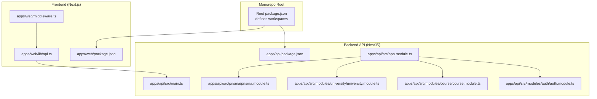
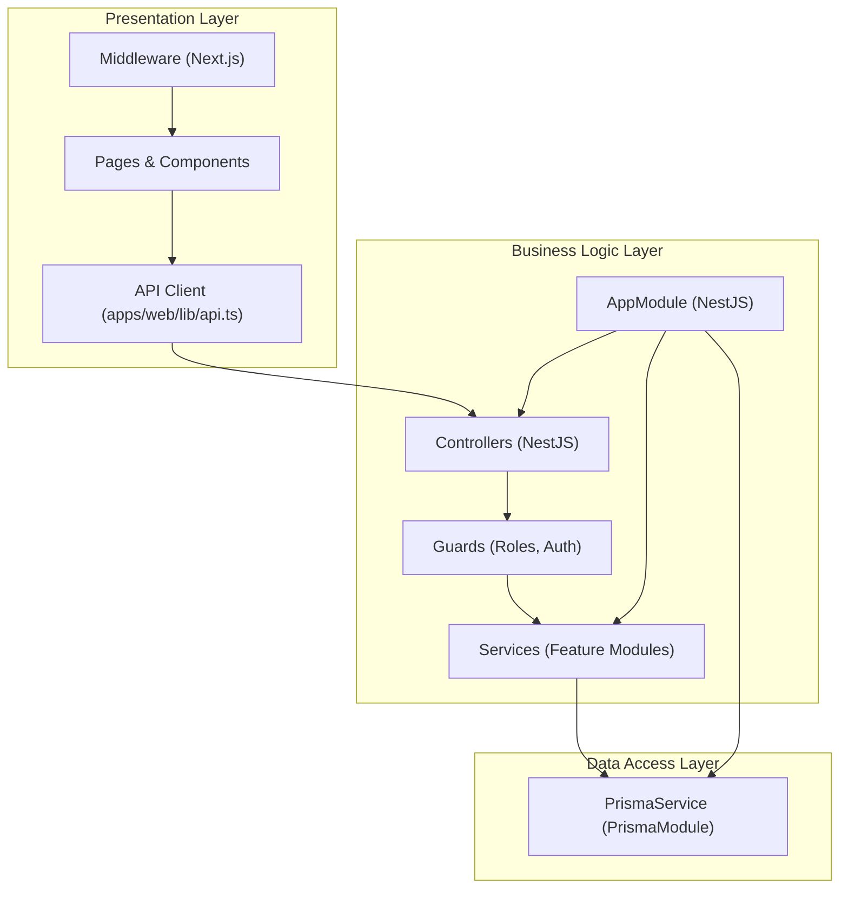
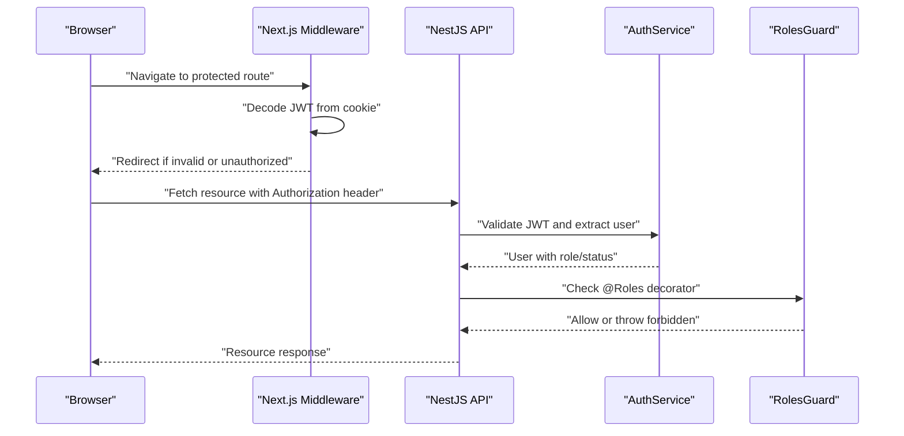
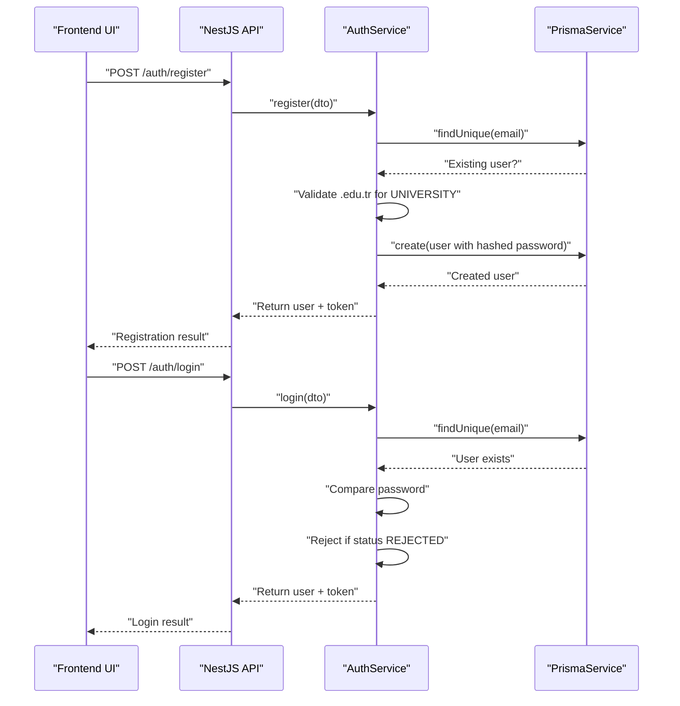
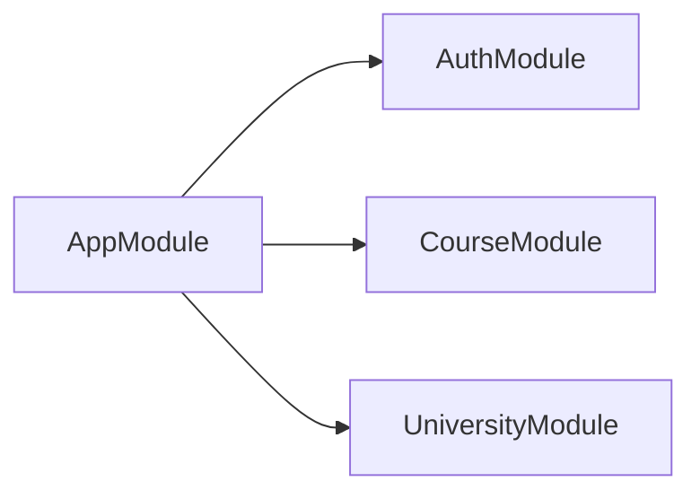
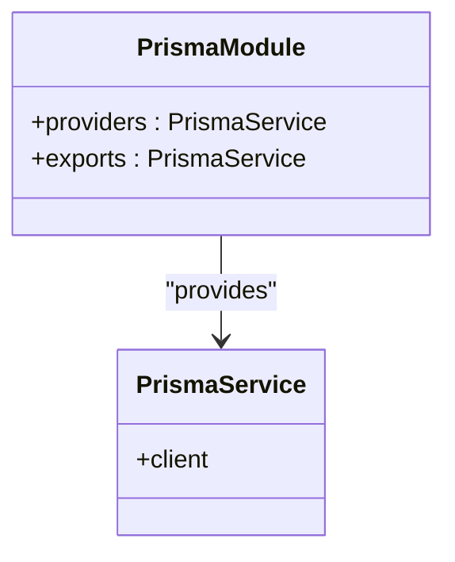
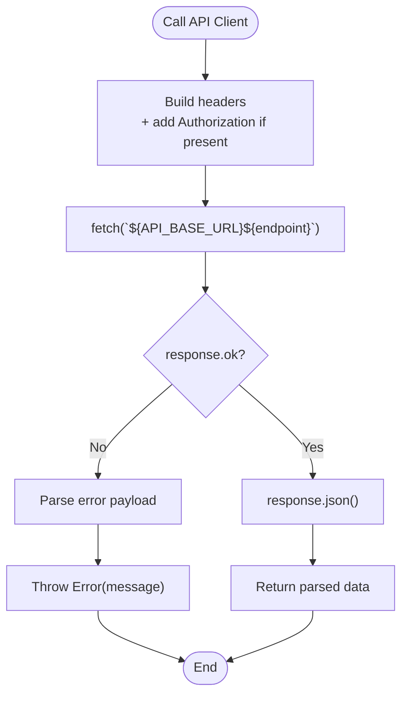
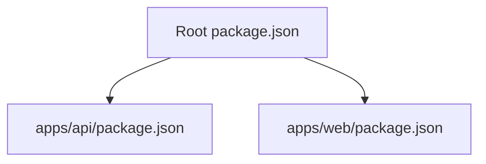

# System Design

<cite>
**Referenced Files in This Document**
- [package.json](file://package.json)
- [apps/api/package.json](file://apps/api/package.json)
- [apps/web/package.json](file://apps/web/package.json)
- [apps/api/src/main.ts](file://apps/api/src/main.ts)
- [apps/api/src/app.module.ts](file://apps/api/src/app.module.ts)
- [apps/api/src/common/guards/roles.guard.ts](file://apps/api/src/common/guards/roles.guard.ts)
- [apps/api/src/common/decorators/roles.decorator.ts](file://apps/api/src/common/decorators/roles.decorator.ts)
- [apps/api/src/common/constants/roles.ts](file://apps/api/src/common/constants/roles.ts)
- [apps/api/src/prisma/prisma.module.ts](file://apps/api/src/prisma/prisma.module.ts)
- [apps/api/src/modules/auth/auth.module.ts](file://apps/api/src/modules/auth/auth.module.ts)
- [apps/api/src/modules/auth/auth.service.ts](file://apps/api/src/modules/auth/auth.service.ts)
- [apps/api/src/modules/course/course.module.ts](file://apps/api/src/modules/course/course.module.ts)
- [apps/api/src/modules/university/university.module.ts](file://apps/api/src/modules/university/university.module.ts)
- [apps/web/middleware.ts](file://apps/web/middleware.ts)
- [apps/web/lib/api.ts](file://apps/web/lib/api.ts)
</cite>

## Table of Contents
1. [Introduction](#introduction)
2. [Project Structure](#project-structure)
3. [Core Components](#core-components)
4. [Architecture Overview](#architecture-overview)
5. [Detailed Component Analysis](#detailed-component-analysis)
6. [Dependency Analysis](#dependency-analysis)
7. [Performance Considerations](#performance-considerations)
8. [Troubleshooting Guide](#troubleshooting-guide)
9. [Conclusion](#conclusion)
10. [Appendices](#appendices)

## Introduction
This document describes the system design of Yaz Okulu Var Mı?, a platform for searching Turkish summer courses. The system follows a monorepo structure using npm workspaces, separating concerns into:
- Backend API built with NestJS
- Frontend application built with Next.js
It applies layered architecture (presentation, business logic, data access), modular design with feature-based modules, dependency injection via NestJS, and a robust middleware pipeline for authentication and role-based access control. Inter-application communication is handled via a typed API client in the frontend and a REST-like API surface in the backend.

## Project Structure
The repository is organized as a monorepo with npm workspaces:
- Root defines workspaces for apps and packages.
- apps/api: NestJS backend API with feature modules, guards, DTOs, and Prisma integration.
- apps/web: Next.js frontend with pages, components, middleware, and a centralized API client.
- packages/types: Shared TypeScript types (not analyzed further here).

**Diagram sources**
- [package.json](file://package.json#L6-L9)
- [apps/api/package.json](file://apps/api/package.json#L1-L59)
- [apps/web/package.json](file://apps/web/package.json#L1-L38)
- [apps/api/src/main.ts](file://apps/api/src/main.ts#L1-L34)
- [apps/api/src/app.module.ts](file://apps/api/src/app.module.ts#L1-L49)
- [apps/api/src/prisma/prisma.module.ts](file://apps/api/src/prisma/prisma.module.ts#L1-L14)
- [apps/api/src/modules/auth/auth.module.ts](file://apps/api/src/modules/auth/auth.module.ts#L1-L30)
- [apps/api/src/modules/course/course.module.ts](file://apps/api/src/modules/course/course.module.ts#L1-L18)
- [apps/api/src/modules/university/university.module.ts](file://apps/api/src/modules/university/university.module.ts#L1-L16)
- [apps/web/middleware.ts](file://apps/web/middleware.ts#L1-L107)
- [apps/web/lib/api.ts](file://apps/web/lib/api.ts#L1-L378)

**Section sources**
- [package.json](file://package.json#L1-L24)
- [apps/api/package.json](file://apps/api/package.json#L1-L59)
- [apps/web/package.json](file://apps/web/package.json#L1-L38)

## Core Components
- Monorepo and Workspaces
  - Root package.json defines workspaces for apps and packages, enabling cross-project scripts and dependency sharing.
  - Scripts at root level delegate to workspace projects for development and build tasks.
- Backend API (NestJS)
  - Entry point initializes the Nest application, sets global prefix, enables CORS, registers a global exception filter, and listens on the configured port.
  - AppModule composes feature modules and exposes a health check endpoint.
  - PrismaModule provides a globally shared PrismaService for database access.
  - Auth module integrates Passport/JWT for authentication and token generation.
  - Feature modules encapsulate domain logic (e.g., Course, University).
- Frontend (Next.js)
  - Middleware enforces route-level access control and redirects based on JWT payload claims (role and status).
  - API client centralizes HTTP requests, token injection, and error handling.

**Section sources**
- [apps/api/src/main.ts](file://apps/api/src/main.ts#L10-L31)
- [apps/api/src/app.module.ts](file://apps/api/src/app.module.ts#L30-L48)
- [apps/api/src/prisma/prisma.module.ts](file://apps/api/src/prisma/prisma.module.ts#L8-L13)
- [apps/api/src/modules/auth/auth.module.ts](file://apps/api/src/modules/auth/auth.module.ts#L13-L29)
- [apps/web/middleware.ts](file://apps/web/middleware.ts#L25-L102)
- [apps/web/lib/api.ts](file://apps/web/lib/api.ts#L10-L36)

## Architecture Overview
The system follows a layered architecture:
- Presentation Layer (Next.js)
  - Pages and components consume the API client to communicate with the backend.
  - Middleware performs initial access checks and redirects.
- Business Logic Layer (NestJS)
  - Feature modules encapsulate domain logic and orchestrate service operations.
  - Guards enforce authorization policies.
- Data Access Layer (Prisma)
  - PrismaService abstracts database operations and is globally available.

**Diagram sources**
- [apps/web/middleware.ts](file://apps/web/middleware.ts#L25-L102)
- [apps/web/lib/api.ts](file://apps/web/lib/api.ts#L10-L36)
- [apps/api/src/app.module.ts](file://apps/api/src/app.module.ts#L30-L48)
- [apps/api/src/common/guards/roles.guard.ts](file://apps/api/src/common/guards/roles.guard.ts#L20-L55)
- [apps/api/src/prisma/prisma.module.ts](file://apps/api/src/prisma/prisma.module.ts#L8-L13)

## Detailed Component Analysis

### Authentication and Authorization Pipeline
The authentication and authorization pipeline spans the frontend middleware and backend guards:
- Frontend middleware decodes the JWT cookie and enforces role/status-based routing.
- Backend uses Passport JWT strategy and a RolesGuard to authorize endpoints decorated with @Roles.

**Diagram sources**
- [apps/web/middleware.ts](file://apps/web/middleware.ts#L11-L23)
- [apps/web/middleware.ts](file://apps/web/middleware.ts#L25-L102)
- [apps/api/src/modules/auth/auth.service.ts](file://apps/api/src/modules/auth/auth.service.ts#L136-L170)
- [apps/api/src/common/guards/roles.guard.ts](file://apps/api/src/common/guards/roles.guard.ts#L24-L54)
- [apps/api/src/common/decorators/roles.decorator.ts](file://apps/api/src/common/decorators/roles.decorator.ts#L11-L15)

**Section sources**
- [apps/web/middleware.ts](file://apps/web/middleware.ts#L25-L102)
- [apps/api/src/common/guards/roles.guard.ts](file://apps/api/src/common/guards/roles.guard.ts#L20-L55)
- [apps/api/src/common/decorators/roles.decorator.ts](file://apps/api/src/common/decorators/roles.decorator.ts#L9-L15)
- [apps/api/src/common/constants/roles.ts](file://apps/api/src/common/constants/roles.ts#L5)

### Registration and Login Flow
The registration and login flows demonstrate layered responsibilities:
- Presentation: Forms submit to the API client.
- Business Logic: AuthService handles uniqueness checks, domain validation, hashing, and token generation.
- Data Access: PrismaService persists user records and university associations.

**Diagram sources**
- [apps/web/lib/api.ts](file://apps/web/lib/api.ts#L40-L59)
- [apps/api/src/modules/auth/auth.service.ts](file://apps/api/src/modules/auth/auth.service.ts#L46-L130)
- [apps/api/src/modules/auth/auth.service.ts](file://apps/api/src/modules/auth/auth.service.ts#L136-L170)
- [apps/api/src/prisma/prisma.module.ts](file://apps/api/src/prisma/prisma.module.ts#L8-L13)

**Section sources**
- [apps/web/lib/api.ts](file://apps/web/lib/api.ts#L40-L59)
- [apps/api/src/modules/auth/auth.service.ts](file://apps/api/src/modules/auth/auth.service.ts#L32-L130)

### Feature-Based Modules and Service Organization
Feature modules encapsulate domain boundaries:
- CourseModule orchestrates course operations and integrates SearchParserService and SearchLogModule.
- UniversityModule exposes controllers for university management and dashboard analytics.
- AuthModule manages authentication and JWT configuration.

**Diagram sources**
- [apps/api/src/app.module.ts](file://apps/api/src/app.module.ts#L30-L45)
- [apps/api/src/modules/auth/auth.module.ts](file://apps/api/src/modules/auth/auth.module.ts#L13-L29)
- [apps/api/src/modules/course/course.module.ts](file://apps/api/src/modules/course/course.module.ts#L11-L17)
- [apps/api/src/modules/university/university.module.ts](file://apps/api/src/modules/university/university.module.ts#L10-L15)

**Section sources**
- [apps/api/src/app.module.ts](file://apps/api/src/app.module.ts#L30-L45)
- [apps/api/src/modules/course/course.module.ts](file://apps/api/src/modules/course/course.module.ts#L1-L18)
- [apps/api/src/modules/university/university.module.ts](file://apps/api/src/modules/university/university.module.ts#L1-L16)

### Data Access and Prisma Integration
PrismaModule provides a globally exported PrismaService, ensuring consistent database access across modules without repeated imports.

**Diagram sources**
- [apps/api/src/prisma/prisma.module.ts](file://apps/api/src/prisma/prisma.module.ts#L8-L13)

**Section sources**
- [apps/api/src/prisma/prisma.module.ts](file://apps/api/src/prisma/prisma.module.ts#L1-L14)

### Frontend API Client and Inter-App Communication
The frontend API client abstracts HTTP communication, injects tokens, and normalizes errors. It is consumed by Next.js pages and components.

**Diagram sources**
- [apps/web/lib/api.ts](file://apps/web/lib/api.ts#L10-L36)

**Section sources**
- [apps/web/lib/api.ts](file://apps/web/lib/api.ts#L1-L378)

## Dependency Analysis
- Workspace Composition
  - Root workspaces include apps and packages, enabling unified scripts and dependency management.
- Backend Dependencies
  - NestJS core, Config, JWT, Passport, Prisma client, and validation libraries.
- Frontend Dependencies
  - Next.js, Radix UI, Recharts, Tailwind-based UI primitives, and Zod.
- Inter-App Communication
  - Frontend communicates with backend via a typed API client that constructs requests against the backend’s global prefix.

**Diagram sources**
- [package.json](file://package.json#L6-L9)
- [apps/api/package.json](file://apps/api/package.json#L20-L39)
- [apps/web/package.json](file://apps/web/package.json#L12-L26)

**Section sources**
- [package.json](file://package.json#L1-L24)
- [apps/api/package.json](file://apps/api/package.json#L1-L59)
- [apps/web/package.json](file://apps/web/package.json#L1-L38)

## Performance Considerations
- Global Prefix and CORS
  - The backend sets a global prefix and enables CORS to support frontend-backend separation.
- Middleware Efficiency
  - Frontend middleware performs lightweight JWT decoding and redirection; keep payloads minimal to avoid overhead.
- Database Access
  - Centralized PrismaService reduces duplication; ensure queries are indexed and avoid N+1 issues.
- Validation
  - Use DTOs and validation pipes to prevent heavy error handling downstream.

[No sources needed since this section provides general guidance]

## Troubleshooting Guide
- Authentication Failures
  - Verify JWT presence and validity in cookies/local storage and Authorization headers.
  - Confirm middleware decoding and backend guard enforcement align with expected role/status.
- Authorization Errors
  - Ensure endpoints are decorated with @Roles and that the RolesGuard is registered globally or per-route.
- Database Connectivity
  - Confirm Prisma client availability and migrations applied.
- Frontend API Calls
  - Check API base URL configuration and error parsing in the API client.

**Section sources**
- [apps/web/middleware.ts](file://apps/web/middleware.ts#L11-L23)
- [apps/api/src/common/guards/roles.guard.ts](file://apps/api/src/common/guards/roles.guard.ts#L24-L54)
- [apps/web/lib/api.ts](file://apps/web/lib/api.ts#L10-L36)

## Conclusion
Yaz Okulu Var Mı? employs a clean monorepo architecture with clear separation between backend and frontend. The NestJS backend uses a layered architecture with feature-based modules, dependency injection, and robust guards for role-based access control. The Next.js frontend enforces route-level access control and communicates with the backend through a centralized API client. Together, these components form a maintainable, scalable system suitable for iterative development and deployment.

[No sources needed since this section summarizes without analyzing specific files]

## Appendices
- Infrastructure Requirements
  - Node.js runtime aligned with engine requirements.
  - Database managed by Prisma; ensure migrations and seeding are executed before startup.
- Service Orchestration
  - Use root scripts to coordinate development and build across workspaces.
- Inter-Application Communication
  - Maintain consistent API endpoints and DTO shapes between frontend and backend.

[No sources needed since this section provides general guidance]