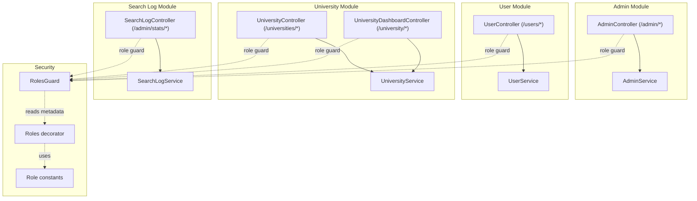
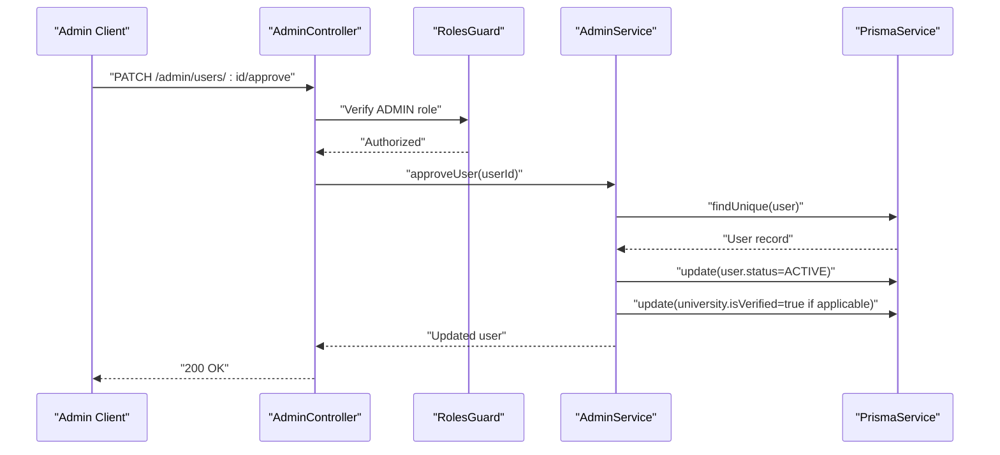
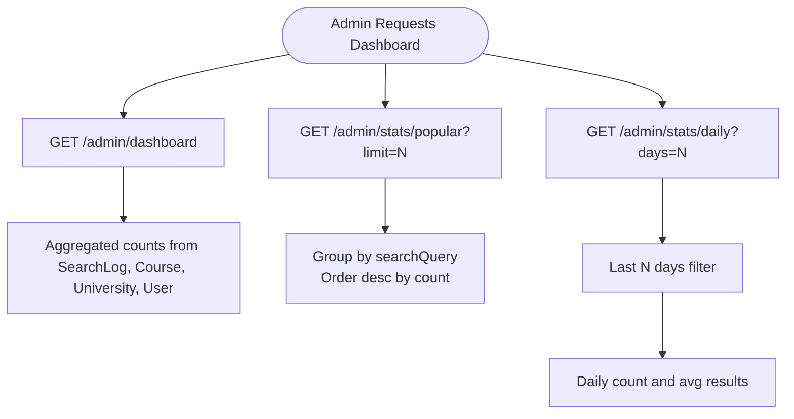
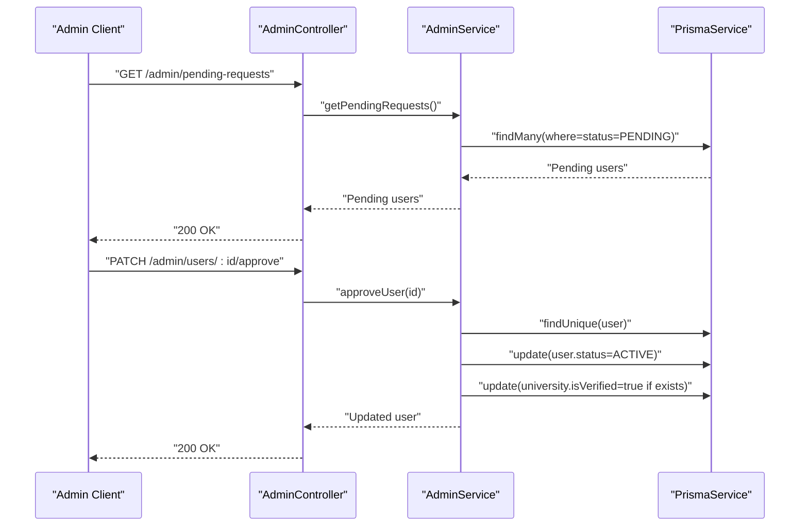
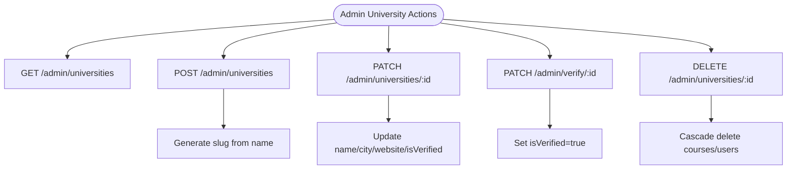
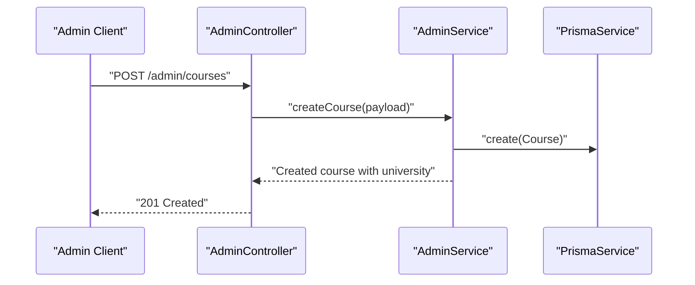
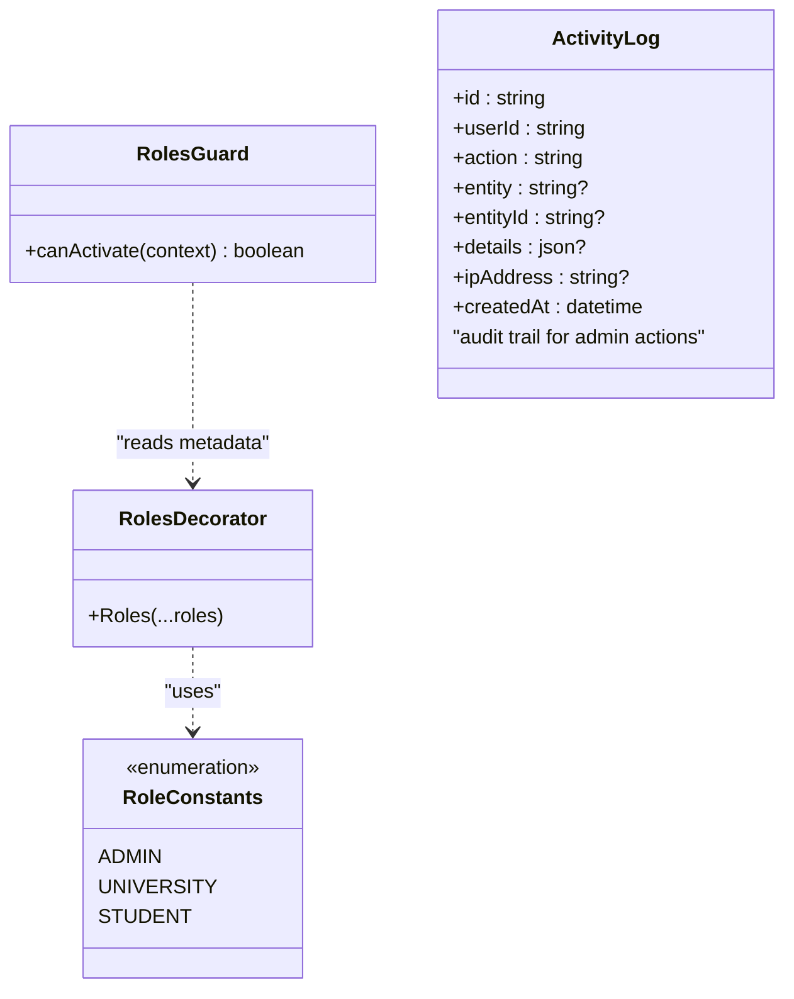
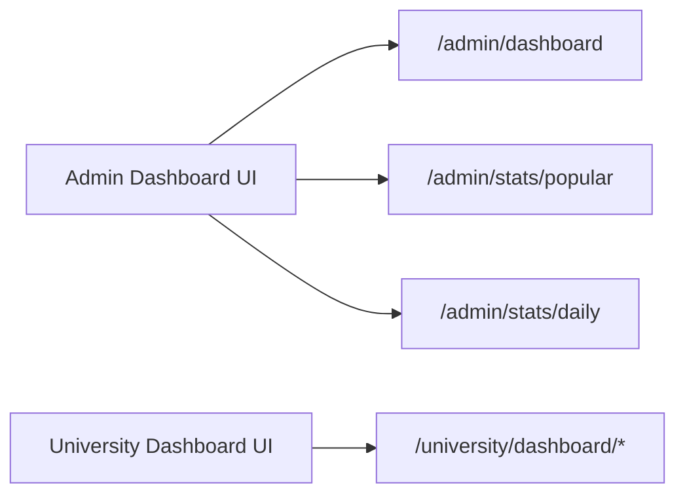
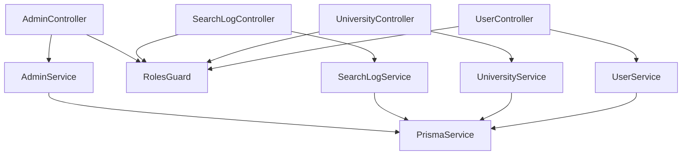
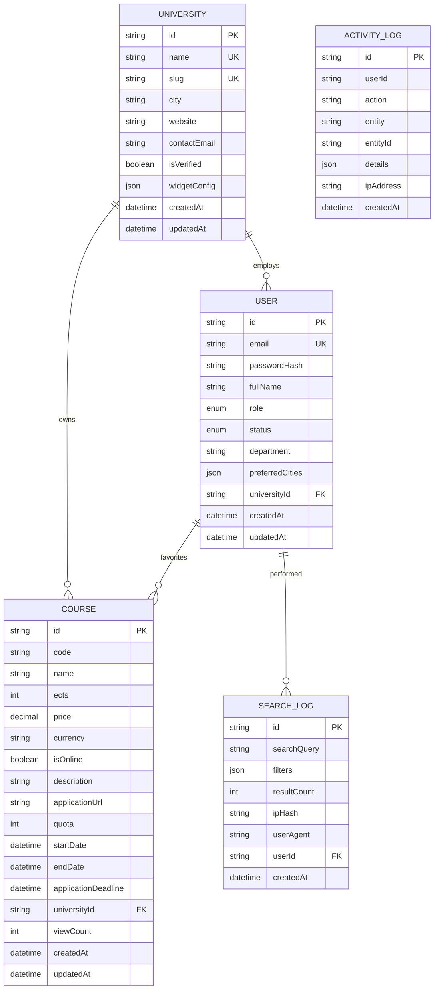

# Administration

<cite>
**Referenced Files in This Document**
- [admin.controller.ts](file://apps/api/src/modules/admin/admin.controller.ts)
- [admin.service.ts](file://apps/api/src/modules/admin/admin.service.ts)
- [admin.module.ts](file://apps/api/src/modules/admin/admin.module.ts)
- [roles.guard.ts](file://apps/api/src/common/guards/roles.guard.ts)
- [roles.decorator.ts](file://apps/api/src/common/decorators/roles.decorator.ts)
- [roles.ts](file://apps/api/src/common/constants/roles.ts)
- [user.controller.ts](file://apps/api/src/modules/user/user.controller.ts)
- [user.service.ts](file://apps/api/src/modules/user/user.service.ts)
- [university.controller.ts](file://apps/api/src/modules/university/university.controller.ts)
- [university.service.ts](file://apps/api/src/modules/university/university.service.ts)
- [university-dashboard.controller.ts](file://apps/api/src/modules/university/university-dashboard.controller.ts)
- [search-log.controller.ts](file://apps/api/src/modules/search-log/search-log.controller.ts)
- [search-log.service.ts](file://apps/api/src/modules/search-log/search-log.service.ts)
- [schema.prisma](file://apps/api/prisma/schema.prisma)
- [auth.service.ts](file://apps/api/src/modules/auth/auth.service.ts)
- [api.ts](file://apps/web/lib/api.ts)
</cite>

## Table of Contents
1. [Introduction](#introduction)
2. [Project Structure](#project-structure)
3. [Core Components](#core-components)
4. [Architecture Overview](#architecture-overview)
5. [Detailed Component Analysis](#detailed-component-analysis)
6. [Dependency Analysis](#dependency-analysis)
7. [Performance Considerations](#performance-considerations)
8. [Troubleshooting Guide](#troubleshooting-guide)
9. [Conclusion](#conclusion)
10. [Appendices](#appendices)

## Introduction
This document provides comprehensive API documentation for administrative endpoints. It covers university approval workflows, user management, system analytics, and content moderation features. Administrative dashboards, reporting capabilities, and system maintenance functions are explained alongside practical examples of admin workflows and oversight procedures. The documentation is grounded in the actual codebase and schema definitions.

## Project Structure
Administrative functionality is implemented via dedicated NestJS modules:
- Admin module: central administrative endpoints for dashboard statistics, pending requests, university and course management
- User module: user listing and profile retrieval (with admin pagination)
- University module: public and administrative university endpoints, verification, and widget configuration
- Search-log module: administrative statistics for platform-wide search analytics
- Guards and decorators: role-based access control for admin-only endpoints

**Diagram sources**
- [admin.controller.ts](file://apps/api/src/modules/admin/admin.controller.ts#L23-L118)
- [admin.service.ts](file://apps/api/src/modules/admin/admin.service.ts#L14-L281)
- [user.controller.ts](file://apps/api/src/modules/user/user.controller.ts#L14-L39)
- [user.service.ts](file://apps/api/src/modules/user/user.service.ts#L10-L47)
- [university.controller.ts](file://apps/api/src/modules/university/university.controller.ts#L38-L113)
- [university-dashboard.controller.ts](file://apps/api/src/modules/university/university-dashboard.controller.ts#L25-L80)
- [search-log.controller.ts](file://apps/api/src/modules/search-log/search-log.controller.ts#L14-L41)
- [search-log.service.ts](file://apps/api/src/modules/search-log/search-log.service.ts#L18-L115)
- [roles.guard.ts](file://apps/api/src/common/guards/roles.guard.ts#L20-L54)
- [roles.decorator.ts](file://apps/api/src/common/decorators/roles.decorator.ts#L9-L15)
- [roles.ts](file://apps/api/src/common/constants/roles.ts#L5-L6)

**Section sources**
- [admin.controller.ts](file://apps/api/src/modules/admin/admin.controller.ts#L23-L118)
- [admin.service.ts](file://apps/api/src/modules/admin/admin.service.ts#L14-L281)
- [user.controller.ts](file://apps/api/src/modules/user/user.controller.ts#L14-L39)
- [user.service.ts](file://apps/api/src/modules/user/user.service.ts#L10-L47)
- [university.controller.ts](file://apps/api/src/modules/university/university.controller.ts#L38-L113)
- [university-dashboard.controller.ts](file://apps/api/src/modules/university/university-dashboard.controller.ts#L25-L80)
- [search-log.controller.ts](file://apps/api/src/modules/search-log/search-log.controller.ts#L14-L41)
- [search-log.service.ts](file://apps/api/src/modules/search-log/search-log.service.ts#L18-L115)
- [roles.guard.ts](file://apps/api/src/common/guards/roles.guard.ts#L20-L54)
- [roles.decorator.ts](file://apps/api/src/common/decorators/roles.decorator.ts#L9-L15)
- [roles.ts](file://apps/api/src/common/constants/roles.ts#L5-L6)

## Core Components
- AdminController: exposes administrative endpoints under /admin, including dashboard stats, popular searches, pending user requests, university management, and course management
- AdminService: implements business logic for user approvals, university CRUD, course management, and statistics aggregation
- RolesGuard and Roles decorator: enforce role-based access control for admin-only endpoints
- SearchLogService: provides administrative statistics for platform-wide search analytics
- UniversityController and UniversityDashboardController: support administrative university listing and verification, plus university-specific analytics

**Section sources**
- [admin.controller.ts](file://apps/api/src/modules/admin/admin.controller.ts#L23-L118)
- [admin.service.ts](file://apps/api/src/modules/admin/admin.service.ts#L14-L281)
- [roles.guard.ts](file://apps/api/src/common/guards/roles.guard.ts#L20-L54)
- [roles.decorator.ts](file://apps/api/src/common/decorators/roles.decorator.ts#L9-L15)
- [search-log.service.ts](file://apps/api/src/modules/search-log/search-log.service.ts#L18-L115)
- [university.controller.ts](file://apps/api/src/modules/university/university.controller.ts#L38-L113)
- [university-dashboard.controller.ts](file://apps/api/src/modules/university/university-dashboard.controller.ts#L25-L80)

## Architecture Overview
Administrative endpoints are protected by JWT authentication and role checks. Controllers delegate to services, which interact with Prisma for data persistence. Audit trails are supported by the ActivityLog model.

**Diagram sources**
- [admin.controller.ts](file://apps/api/src/modules/admin/admin.controller.ts#L48-L56)
- [admin.service.ts](file://apps/api/src/modules/admin/admin.service.ts#L44-L72)
- [roles.guard.ts](file://apps/api/src/common/guards/roles.guard.ts#L24-L54)

**Section sources**
- [admin.controller.ts](file://apps/api/src/modules/admin/admin.controller.ts#L23-L118)
- [admin.service.ts](file://apps/api/src/modules/admin/admin.service.ts#L14-L281)
- [roles.guard.ts](file://apps/api/src/common/guards/roles.guard.ts#L20-L54)

## Detailed Component Analysis

### Administrative Endpoints and Workflows

#### Dashboard and Analytics
- GET /admin/dashboard: returns platform-wide statistics (total courses, universities, verified universities, total users, pending users, total searches, online courses, today’s searches)
- GET /admin/stats/popular?limit=: returns top N popular search queries
- GET /admin/stats/overview: returns total searches, total courses, total verified universities, today’s searches
- GET /admin/stats/popular?limit=: returns top N popular search queries
- GET /admin/stats/daily?days=: returns daily aggregated search counts and average results over the last N days

**Diagram sources**
- [admin.controller.ts](file://apps/api/src/modules/admin/admin.controller.ts#L31-L39)
- [search-log.controller.ts](file://apps/api/src/modules/search-log/search-log.controller.ts#L21-L40)
- [admin.service.ts](file://apps/api/src/modules/admin/admin.service.ts#L214-L249)
- [search-log.service.ts](file://apps/api/src/modules/search-log/search-log.service.ts#L93-L114)

**Section sources**
- [admin.controller.ts](file://apps/api/src/modules/admin/admin.controller.ts#L31-L39)
- [search-log.controller.ts](file://apps/api/src/modules/search-log/search-log.controller.ts#L21-L40)
- [admin.service.ts](file://apps/api/src/modules/admin/admin.service.ts#L214-L249)
- [search-log.service.ts](file://apps/api/src/modules/search-log/search-log.service.ts#L93-L114)

#### User Management
- GET /admin/pending-requests: lists pending user registrations with university info
- PATCH /admin/users/:id/approve: approves a pending user; sets status to ACTIVE and verifies associated university if present
- PATCH /admin/users/:id/reject: rejects a pending user; sets status to REJECTED
- GET /users? (admin): lists all users with pagination

**Diagram sources**
- [admin.controller.ts](file://apps/api/src/modules/admin/admin.controller.ts#L43-L56)
- [admin.service.ts](file://apps/api/src/modules/admin/admin.service.ts#L24-L92)
- [user.controller.ts](file://apps/api/src/modules/user/user.controller.ts#L26-L38)
- [user.service.ts](file://apps/api/src/modules/user/user.service.ts#L45-L47)

**Section sources**
- [admin.controller.ts](file://apps/api/src/modules/admin/admin.controller.ts#L43-L56)
- [admin.service.ts](file://apps/api/src/modules/admin/admin.service.ts#L24-L92)
- [user.controller.ts](file://apps/api/src/modules/user/user.controller.ts#L26-L38)
- [user.service.ts](file://apps/api/src/modules/user/user.service.ts#L45-L47)
- [auth.service.ts](file://apps/api/src/modules/auth/auth.service.ts#L136-L171)

#### University Management
- GET /admin/universities: lists all universities with counts of courses and users
- POST /admin/universities: creates a new university (verified by default)
- PATCH /admin/universities/:id: updates university fields (including isVerified)
- DELETE /admin/universities/:id: deletes a university
- PATCH /admin/verify/:id: verifies a university (admin-only)
- GET /admin/universities (UniversityController): admin-only listing of universities
- GET /universities/slug/:slug and GET /universities/:id: public endpoints for verified universities

**Diagram sources**
- [admin.controller.ts](file://apps/api/src/modules/admin/admin.controller.ts#L60-L83)
- [university.controller.ts](file://apps/api/src/modules/university/university.controller.ts#L60-L99)
- [admin.service.ts](file://apps/api/src/modules/admin/admin.service.ts#L98-L142)
- [university.service.ts](file://apps/api/src/modules/university/university.service.ts#L394-L430)

**Section sources**
- [admin.controller.ts](file://apps/api/src/modules/admin/admin.controller.ts#L60-L83)
- [university.controller.ts](file://apps/api/src/modules/university/university.controller.ts#L60-L99)
- [admin.service.ts](file://apps/api/src/modules/admin/admin.service.ts#L98-L142)
- [university.service.ts](file://apps/api/src/modules/university/university.service.ts#L394-L430)

#### Course Management
- GET /admin/courses?page&limit: lists all courses with pagination and university info
- POST /admin/courses: creates a course for a given university
- DELETE /admin/courses/:id: deletes a course

**Diagram sources**
- [admin.controller.ts](file://apps/api/src/modules/admin/admin.controller.ts#L87-L117)
- [admin.service.ts](file://apps/api/src/modules/admin/admin.service.ts#L172-L198)

**Section sources**
- [admin.controller.ts](file://apps/api/src/modules/admin/admin.controller.ts#L87-L117)
- [admin.service.ts](file://apps/api/src/modules/admin/admin.service.ts#L172-L198)

#### Audit Logging and Security
- Role-based access control: AuthGuard('jwt') followed by RolesGuard ensures only ADMIN users can access admin endpoints
- Activity logging: ActivityLog model captures administrative actions with JSON details and timestamps
- User status enforcement: Login prevents REJECTED users from authenticating

**Diagram sources**
- [roles.guard.ts](file://apps/api/src/common/guards/roles.guard.ts#L20-L54)
- [roles.decorator.ts](file://apps/api/src/common/decorators/roles.decorator.ts#L9-L15)
- [roles.ts](file://apps/api/src/common/constants/roles.ts#L5-L6)
- [schema.prisma](file://apps/api/prisma/schema.prisma#L140-L154)

**Section sources**
- [roles.guard.ts](file://apps/api/src/common/guards/roles.guard.ts#L20-L54)
- [roles.decorator.ts](file://apps/api/src/common/decorators/roles.decorator.ts#L9-L15)
- [roles.ts](file://apps/api/src/common/constants/roles.ts#L5-L6)
- [schema.prisma](file://apps/api/prisma/schema.prisma#L140-L154)
- [auth.service.ts](file://apps/api/src/modules/auth/auth.service.ts#L136-L171)

### Administrative Dashboards and Reporting
- Platform overview: GET /admin/dashboard and GET /admin/stats/overview
- Popular queries: GET /admin/stats/popular and GET /admin/stats/popular
- Daily trends: GET /admin/stats/daily
- University analytics (University role): GET /university/dashboard/*
- Web client bindings: see [api.ts](file://apps/web/lib/api.ts#L309-L351)

**Diagram sources**
- [admin.controller.ts](file://apps/api/src/modules/admin/admin.controller.ts#L31-L39)
- [search-log.controller.ts](file://apps/api/src/modules/search-log/search-log.controller.ts#L21-L40)
- [university-dashboard.controller.ts](file://apps/api/src/modules/university/university-dashboard.controller.ts#L31-L79)
- [api.ts](file://apps/web/lib/api.ts#L309-L351)

**Section sources**
- [admin.controller.ts](file://apps/api/src/modules/admin/admin.controller.ts#L31-L39)
- [search-log.controller.ts](file://apps/api/src/modules/search-log/search-log.controller.ts#L21-L40)
- [university-dashboard.controller.ts](file://apps/api/src/modules/university/university-dashboard.controller.ts#L31-L79)
- [api.ts](file://apps/web/lib/api.ts#L309-L351)

## Dependency Analysis
Administrative endpoints depend on:
- Authentication and authorization: AuthGuard('jwt') and RolesGuard
- Services: AdminService, SearchLogService, UniversityService, UserService
- Prisma models: User, University, Course, SearchLog, ActivityLog

**Diagram sources**
- [admin.controller.ts](file://apps/api/src/modules/admin/admin.controller.ts#L23-L118)
- [admin.service.ts](file://apps/api/src/modules/admin/admin.service.ts#L14-L281)
- [roles.guard.ts](file://apps/api/src/common/guards/roles.guard.ts#L20-L54)
- [search-log.controller.ts](file://apps/api/src/modules/search-log/search-log.controller.ts#L14-L41)
- [search-log.service.ts](file://apps/api/src/modules/search-log/search-log.service.ts#L18-L115)
- [university.controller.ts](file://apps/api/src/modules/university/university.controller.ts#L38-L113)
- [university.service.ts](file://apps/api/src/modules/university/university.service.ts#L394-L430)
- [user.controller.ts](file://apps/api/src/modules/user/user.controller.ts#L14-L39)
- [user.service.ts](file://apps/api/src/modules/user/user.service.ts#L10-L47)

**Section sources**
- [admin.controller.ts](file://apps/api/src/modules/admin/admin.controller.ts#L23-L118)
- [admin.service.ts](file://apps/api/src/modules/admin/admin.service.ts#L14-L281)
- [roles.guard.ts](file://apps/api/src/common/guards/roles.guard.ts#L20-L54)
- [search-log.controller.ts](file://apps/api/src/modules/search-log/search-log.controller.ts#L14-L41)
- [search-log.service.ts](file://apps/api/src/modules/search-log/search-log.service.ts#L18-L115)
- [university.controller.ts](file://apps/api/src/modules/university/university.controller.ts#L38-L113)
- [university.service.ts](file://apps/api/src/modules/university/university.service.ts#L394-L430)
- [user.controller.ts](file://apps/api/src/modules/user/user.controller.ts#L14-L39)
- [user.service.ts](file://apps/api/src/modules/user/user.service.ts#L10-L47)

## Performance Considerations
- Pagination: Admin endpoints for courses and users support pagination to avoid large payloads
- Indexes: Schema includes strategic indexes for frequent queries (e.g., User.status, University.isVerified, SearchLog indices)
- Aggregation: Statistics rely on grouped queries and counts to minimize joins
- Asynchronous operations: Parallel queries are used for dashboard metrics

[No sources needed since this section provides general guidance]

## Troubleshooting Guide
- Authorization failures: Ensure the request includes a valid JWT and the user has ADMIN role
- Not found errors: Operations on non-existent entities (user, university, course) raise NotFoundException
- Login blocked for rejected users: REJECTED users cannot authenticate per login logic
- Audit visibility: Use ActivityLog to track administrative actions

**Section sources**
- [roles.guard.ts](file://apps/api/src/common/guards/roles.guard.ts#L40-L51)
- [admin.service.ts](file://apps/api/src/modules/admin/admin.service.ts#L50-L52)
- [admin.service.ts](file://apps/api/src/modules/admin/admin.service.ts#L126-L139)
- [admin.service.ts](file://apps/api/src/modules/admin/admin.service.ts#L202-L204)
- [auth.service.ts](file://apps/api/src/modules/auth/auth.service.ts#L150-L153)
- [schema.prisma](file://apps/api/prisma/schema.prisma#L140-L154)

## Conclusion
The administrative subsystem provides comprehensive controls for managing users, universities, and courses, along with robust analytics and audit capabilities. Role-based protection and clear workflows enable secure oversight and efficient operations.

[No sources needed since this section summarizes without analyzing specific files]

## Appendices

### API Reference Summary

- Admin
  - GET /admin/dashboard
  - GET /admin/stats/popular?limit=N
  - GET /admin/pending-requests
  - PATCH /admin/users/:id/approve
  - PATCH /admin/users/:id/reject
  - GET /admin/universities
  - POST /admin/universities
  - PATCH /admin/universities/:id
  - DELETE /admin/universities/:id
  - GET /admin/courses?page&limit
  - POST /admin/courses
  - DELETE /admin/courses/:id

- Search Analytics (Admin)
  - GET /admin/stats/overview
  - GET /admin/stats/popular?limit=N
  - GET /admin/stats/daily?days=N

- University (Admin)
  - GET /admin/universities
  - PATCH /admin/verify/:id

- User (Admin)
  - GET /users?page&limit

**Section sources**
- [admin.controller.ts](file://apps/api/src/modules/admin/admin.controller.ts#L31-L117)
- [search-log.controller.ts](file://apps/api/src/modules/search-log/search-log.controller.ts#L21-L40)
- [university.controller.ts](file://apps/api/src/modules/university/university.controller.ts#L60-L99)
- [user.controller.ts](file://apps/api/src/modules/user/user.controller.ts#L26-L38)

### Data Models Overview

**Diagram sources**
- [schema.prisma](file://apps/api/prisma/schema.prisma#L36-L138)
- [schema.prisma](file://apps/api/prisma/schema.prisma#L140-L154)