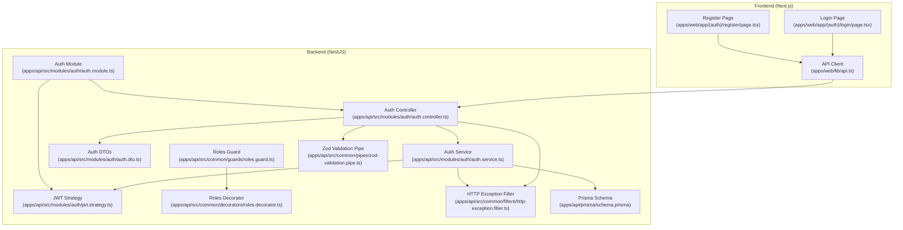
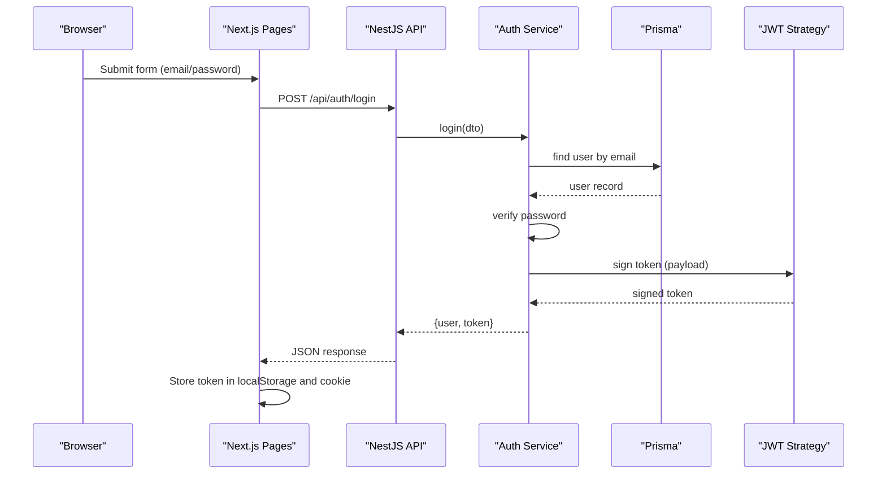
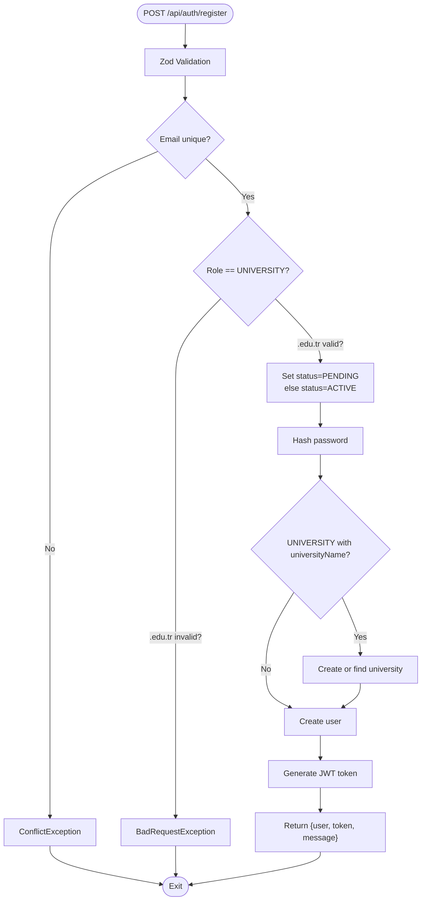
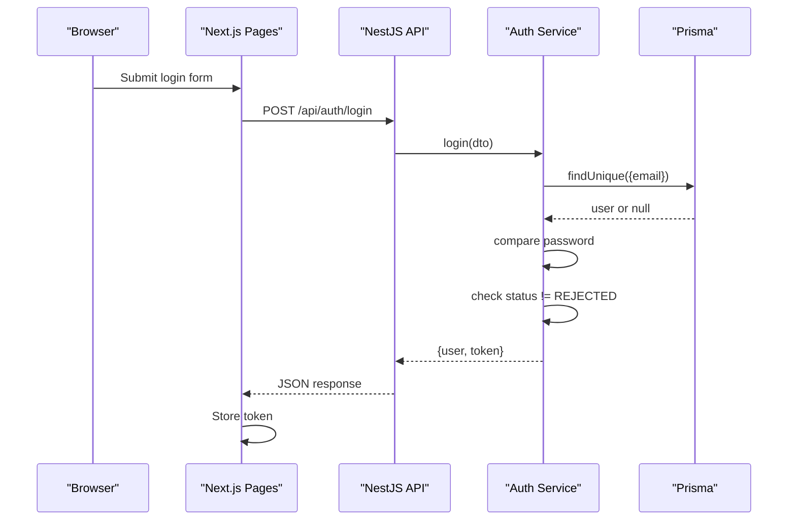
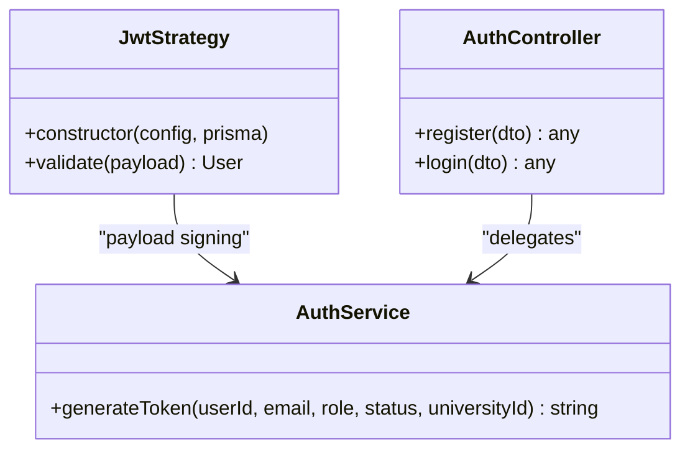
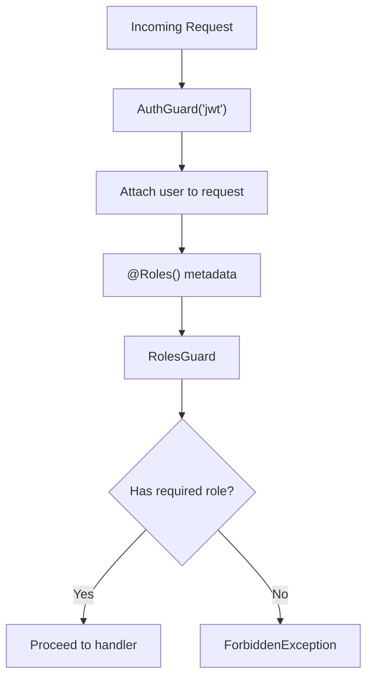
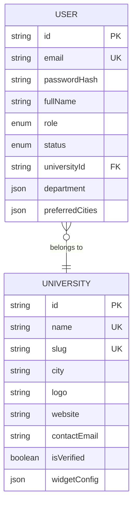
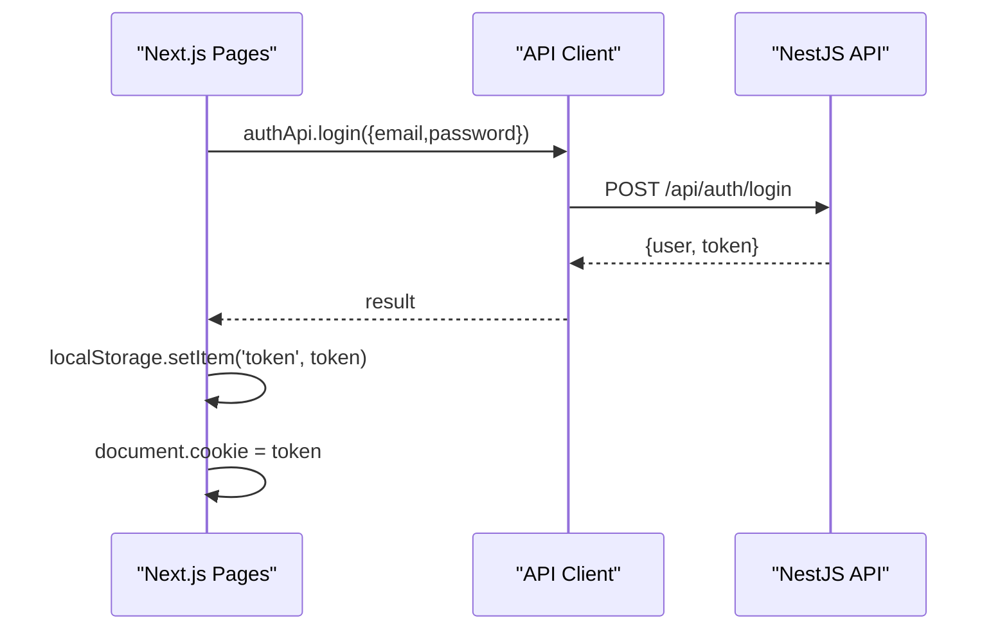
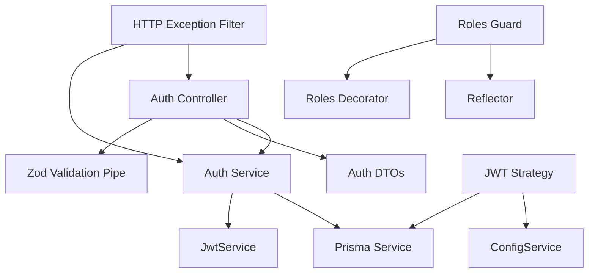

# Authentication System

<cite>
**Referenced Files in This Document**
- [auth.controller.ts](file://apps/api/src/modules/auth/auth.controller.ts)
- [auth.service.ts](file://apps/api/src/modules/auth/auth.service.ts)
- [auth.dto.ts](file://apps/api/src/modules/auth/auth.dto.ts)
- [jwt.strategy.ts](file://apps/api/src/modules/auth/jwt.strategy.ts)
- [auth.module.ts](file://apps/api/src/modules/auth/auth.module.ts)
- [roles.decorator.ts](file://apps/api/src/common/decorators/roles.decorator.ts)
- [roles.guard.ts](file://apps/api/src/common/guards/roles.guard.ts)
- [zod-validation.pipe.ts](file://apps/api/src/common/pipes/zod-validation.pipe.ts)
- [http-exception.filter.ts](file://apps/api/src/common/filters/http-exception.filter.ts)
- [roles.ts](file://apps/api/src/common/constants/roles.ts)
- [schema.prisma](file://apps/api/prisma/schema.prisma)
- [.env](file://apps/api/.env)
- [login.page.tsx](file://apps/web/app/(auth)/login/page.tsx)
- [register.page.tsx](file://apps/web/app/(auth)/register/page.tsx)
- [api.ts](file://apps/web/lib/api.ts)
</cite>

## Table of Contents
1. [Introduction](#introduction)
2. [Project Structure](#project-structure)
3. [Core Components](#core-components)
4. [Architecture Overview](#architecture-overview)
5. [Detailed Component Analysis](#detailed-component-analysis)
6. [Dependency Analysis](#dependency-analysis)
7. [Performance Considerations](#performance-considerations)
8. [Troubleshooting Guide](#troubleshooting-guide)
9. [Conclusion](#conclusion)

## Introduction
This document provides comprehensive API documentation for the authentication system endpoints. It covers the registration and login endpoints, including request/response schemas, validation rules, and error handling. It explains JWT token generation, refresh mechanisms, and expiration handling. It also documents role-based access control implementation, permission decorators, and route protection strategies. Practical examples of authentication flows, token usage patterns, and security best practices are included, along with the JWT strategy implementation, payload structure, and claims management.

## Project Structure
The authentication system spans both the backend NestJS API and the Next.js frontend:
- Backend: Auth module with controller, service, DTOs, JWT strategy, and validation/filter utilities
- Frontend: Login and registration pages that integrate with the backend API
- Database: Prisma schema defines user roles and statuses used by the authentication logic

**Diagram sources**
- [auth.controller.ts](file://apps/api/src/modules/auth/auth.controller.ts#L1-L28)
- [auth.service.ts](file://apps/api/src/modules/auth/auth.service.ts#L1-L205)
- [auth.dto.ts](file://apps/api/src/modules/auth/auth.dto.ts#L1-L46)
- [jwt.strategy.ts](file://apps/api/src/modules/auth/jwt.strategy.ts#L1-L58)
- [auth.module.ts](file://apps/api/src/modules/auth/auth.module.ts#L1-L30)
- [roles.guard.ts](file://apps/api/src/common/guards/roles.guard.ts#L1-L56)
- [roles.decorator.ts](file://apps/api/src/common/decorators/roles.decorator.ts#L1-L16)
- [zod-validation.pipe.ts](file://apps/api/src/common/pipes/zod-validation.pipe.ts#L1-L45)
- [http-exception.filter.ts](file://apps/api/src/common/filters/http-exception.filter.ts#L1-L50)
- [schema.prisma](file://apps/api/prisma/schema.prisma#L1-L183)
- [login.page.tsx](file://apps/web/app/(auth)/login/page.tsx#L1-L135)
- [register.page.tsx](file://apps/web/app/(auth)/register/page.tsx#L1-L239)
- [api.ts](file://apps/web/lib/api.ts#L1-L378)

**Section sources**
- [auth.controller.ts](file://apps/api/src/modules/auth/auth.controller.ts#L1-L28)
- [auth.service.ts](file://apps/api/src/modules/auth/auth.service.ts#L1-L205)
- [auth.dto.ts](file://apps/api/src/modules/auth/auth.dto.ts#L1-L46)
- [jwt.strategy.ts](file://apps/api/src/modules/auth/jwt.strategy.ts#L1-L58)
- [auth.module.ts](file://apps/api/src/modules/auth/auth.module.ts#L1-L30)
- [roles.decorator.ts](file://apps/api/src/common/decorators/roles.decorator.ts#L1-L16)
- [roles.guard.ts](file://apps/api/src/common/guards/roles.guard.ts#L1-L56)
- [zod-validation.pipe.ts](file://apps/api/src/common/pipes/zod-validation.pipe.ts#L1-L45)
- [http-exception.filter.ts](file://apps/api/src/common/filters/http-exception.filter.ts#L1-L50)
- [schema.prisma](file://apps/api/prisma/schema.prisma#L1-L183)
- [login.page.tsx](file://apps/web/app/(auth)/login/page.tsx#L1-L135)
- [register.page.tsx](file://apps/web/app/(auth)/register/page.tsx#L1-L239)
- [api.ts](file://apps/web/lib/api.ts#L1-L378)

## Core Components
- Auth Controller: Exposes POST /api/auth/register and POST /api/auth/login endpoints with Zod validation pipes
- Auth Service: Implements registration and login logic, handles password hashing, role-based status assignment, and JWT token generation
- Auth DTOs: Define strict request schemas validated by Zod
- JWT Strategy: Validates JWT tokens from Authorization headers and attaches user info to requests
- Roles Decorator and Guard: Enforce role-based access control on protected routes
- Validation and Exception Filters: Provide robust input validation and standardized error responses

**Section sources**
- [auth.controller.ts](file://apps/api/src/modules/auth/auth.controller.ts#L1-L28)
- [auth.service.ts](file://apps/api/src/modules/auth/auth.service.ts#L1-L205)
- [auth.dto.ts](file://apps/api/src/modules/auth/auth.dto.ts#L1-L46)
- [jwt.strategy.ts](file://apps/api/src/modules/auth/jwt.strategy.ts#L1-L58)
- [roles.decorator.ts](file://apps/api/src/common/decorators/roles.decorator.ts#L1-L16)
- [roles.guard.ts](file://apps/api/src/common/guards/roles.guard.ts#L1-L56)
- [zod-validation.pipe.ts](file://apps/api/src/common/pipes/zod-validation.pipe.ts#L1-L45)
- [http-exception.filter.ts](file://apps/api/src/common/filters/http-exception.filter.ts#L1-L50)

## Architecture Overview
The authentication system follows a layered architecture:
- Presentation Layer: Next.js pages handle user input and call the API client
- API Layer: NestJS controller validates requests via Zod, delegates to service, and returns structured responses
- Domain Layer: Service manages business logic, interacts with Prisma, and generates JWT tokens
- Security Layer: Passport JWT strategy validates tokens; Roles decorator and guard enforce RBAC

**Diagram sources**
- [login.page.tsx](file://apps/web/app/(auth)/login/page.tsx#L21-L45)
- [api.ts](file://apps/web/lib/api.ts#L54-L58)
- [auth.controller.ts](file://apps/api/src/modules/auth/auth.controller.ts#L22-L26)
- [auth.service.ts](file://apps/api/src/modules/auth/auth.service.ts#L136-L170)
- [jwt.strategy.ts](file://apps/api/src/modules/auth/jwt.strategy.ts#L38-L56)

## Detailed Component Analysis

### Registration Endpoint
- Endpoint: POST /api/auth/register
- Purpose: Creates a new user account with role-specific behavior
- Validation: Zod schema ensures email format, password length, optional/full name, role selection, and university fields for UNIVERSITY role
- Business Logic:
  - Checks email uniqueness
  - Validates .edu.tr domain for UNIVERSITY role
  - Assigns status: PENDING for UNIVERSITY, ACTIVE for others
  - Hashes password and optionally creates university association
  - Generates JWT token and returns user info and message
- Response: Includes user profile, token, and role-specific message
- Error Handling: Throws conflict for duplicate emails, bad request for invalid .edu.tr, and internal server errors otherwise

**Diagram sources**
- [auth.controller.ts](file://apps/api/src/modules/auth/auth.controller.ts#L16-L20)
- [auth.service.ts](file://apps/api/src/modules/auth/auth.service.ts#L46-L130)
- [auth.dto.ts](file://apps/api/src/modules/auth/auth.dto.ts#L9-L30)
- [zod-validation.pipe.ts](file://apps/api/src/common/pipes/zod-validation.pipe.ts#L20-L43)

**Section sources**
- [auth.controller.ts](file://apps/api/src/modules/auth/auth.controller.ts#L16-L20)
- [auth.service.ts](file://apps/api/src/modules/auth/auth.service.ts#L46-L130)
- [auth.dto.ts](file://apps/api/src/modules/auth/auth.dto.ts#L9-L30)
- [zod-validation.pipe.ts](file://apps/api/src/common/pipes/zod-validation.pipe.ts#L20-L43)

### Login Endpoint
- Endpoint: POST /api/auth/login
- Purpose: Authenticates existing users and issues JWT tokens
- Validation: Zod schema ensures email format and non-empty password
- Business Logic:
  - Finds user by email
  - Compares hashed password
  - Rejects users with REJECTED status
  - Generates JWT token and returns user info and token
- Response: Returns user profile and token
- Error Handling: Throws unauthorized for invalid credentials or forbidden for rejected users

**Diagram sources**
- [login.page.tsx](file://apps/web/app/(auth)/login/page.tsx#L21-L45)
- [api.ts](file://apps/web/lib/api.ts#L54-L58)
- [auth.controller.ts](file://apps/api/src/modules/auth/auth.controller.ts#L22-L26)
- [auth.service.ts](file://apps/api/src/modules/auth/auth.service.ts#L136-L170)

**Section sources**
- [auth.controller.ts](file://apps/api/src/modules/auth/auth.controller.ts#L22-L26)
- [auth.service.ts](file://apps/api/src/modules/auth/auth.service.ts#L136-L170)
- [auth.dto.ts](file://apps/api/src/modules/auth/auth.dto.ts#L36-L43)
- [zod-validation.pipe.ts](file://apps/api/src/common/pipes/zod-validation.pipe.ts#L20-L43)

### JWT Strategy and Token Payload
- Strategy: Uses passport-jwt to extract Bearer token from Authorization header and validate it against configured secret
- Payload Claims: sub (user ID), email, role, status, universityId
- Validation: Fetches user from database and attaches user object to request; throws unauthorized if user not found
- Expiration: Enabled; tokens expire after configured duration

**Diagram sources**
- [jwt.strategy.ts](file://apps/api/src/modules/auth/jwt.strategy.ts#L22-L56)
- [auth.service.ts](file://apps/api/src/modules/auth/auth.service.ts#L172-L188)
- [auth.controller.ts](file://apps/api/src/modules/auth/auth.controller.ts#L16-L26)

**Section sources**
- [jwt.strategy.ts](file://apps/api/src/modules/auth/jwt.strategy.ts#L22-L56)
- [auth.service.ts](file://apps/api/src/modules/auth/auth.service.ts#L172-L188)
- [auth.module.ts](file://apps/api/src/modules/auth/auth.module.ts#L16-L23)
- [.env](file://apps/api/.env#L2)

### Role-Based Access Control (RBAC)
- Decorator: @Roles(Role...) sets metadata for allowed roles
- Guard: RolesGuard checks request.user.role against required roles; denies access with forbidden if mismatch
- Integration: Used alongside AuthGuard('jwt') to require both authentication and role authorization

**Diagram sources**
- [roles.decorator.ts](file://apps/api/src/common/decorators/roles.decorator.ts#L9-L15)
- [roles.guard.ts](file://apps/api/src/common/guards/roles.guard.ts#L24-L54)

**Section sources**
- [roles.decorator.ts](file://apps/api/src/common/decorators/roles.decorator.ts#L9-L15)
- [roles.guard.ts](file://apps/api/src/common/guards/roles.guard.ts#L24-L54)
- [roles.ts](file://apps/api/src/common/constants/roles.ts#L5)

### Data Models and Validation
- User Model: Defines email uniqueness, password hash storage, role, status, and optional university relationship
- Enums: Role (STUDENT, UNIVERSITY, ADMIN), UserStatus (PENDING, APPROVED, REJECTED, ACTIVE)
- Validation: Zod schemas ensure input correctness and enforce role-specific constraints

**Diagram sources**
- [schema.prisma](file://apps/api/prisma/schema.prisma#L61-L85)
- [schema.prisma](file://apps/api/prisma/schema.prisma#L36-L58)

**Section sources**
- [schema.prisma](file://apps/api/prisma/schema.prisma#L18-L31)
- [schema.prisma](file://apps/api/prisma/schema.prisma#L61-L85)
- [auth.dto.ts](file://apps/api/src/modules/auth/auth.dto.ts#L9-L30)

### Frontend Authentication Integration
- Login Page: Submits credentials, stores token in localStorage and cookie, redirects based on role
- Register Page: Handles role selection, performs basic frontend validation, submits to backend, and stores token
- API Client: Adds Authorization header automatically when token exists

**Diagram sources**
- [login.page.tsx](file://apps/web/app/(auth)/login/page.tsx#L21-L45)
- [api.ts](file://apps/web/lib/api.ts#L54-L58)

**Section sources**
- [login.page.tsx](file://apps/web/app/(auth)/login/page.tsx#L21-L45)
- [register.page.tsx](file://apps/web/app/(auth)/register/page.tsx#L33-L73)
- [api.ts](file://apps/web/lib/api.ts#L11-L36)

## Dependency Analysis
The authentication system exhibits clear separation of concerns:
- Controller depends on Service and DTOs
- Service depends on Prisma and JwtService
- JWT Strategy depends on ConfigService and Prisma
- Roles Guard depends on Reflector and Roles Decorator
- Validation Pipe and Exception Filter provide cross-cutting concerns

**Diagram sources**
- [auth.controller.ts](file://apps/api/src/modules/auth/auth.controller.ts#L6-L10)
- [auth.service.ts](file://apps/api/src/modules/auth/auth.service.ts#L14-L18)
- [jwt.strategy.ts](file://apps/api/src/modules/auth/jwt.strategy.ts#L8-L10)
- [roles.guard.ts](file://apps/api/src/common/guards/roles.guard.ts#L16-L18)
- [roles.decorator.ts](file://apps/api/src/common/decorators/roles.decorator.ts#L7)
- [http-exception.filter.ts](file://apps/api/src/common/filters/http-exception.filter.ts#L16-L18)

**Section sources**
- [auth.controller.ts](file://apps/api/src/modules/auth/auth.controller.ts#L6-L10)
- [auth.service.ts](file://apps/api/src/modules/auth/auth.service.ts#L14-L18)
- [jwt.strategy.ts](file://apps/api/src/modules/auth/jwt.strategy.ts#L8-L10)
- [roles.guard.ts](file://apps/api/src/common/guards/roles.guard.ts#L16-L18)
- [roles.decorator.ts](file://apps/api/src/common/decorators/roles.decorator.ts#L7)
- [http-exception.filter.ts](file://apps/api/src/common/filters/http-exception.filter.ts#L16-L18)

## Performance Considerations
- Password hashing cost: bcrypt with moderate rounds balances security and performance
- Index usage: Prisma schema includes strategic indexes on role, status, and universityId for efficient queries
- Token expiration: Short to medium-term expiration reduces long-lived token risks
- Validation overhead: Zod validation occurs before database access, minimizing unnecessary database calls

## Troubleshooting Guide
Common issues and resolutions:
- Duplicate email during registration: Ensure email uniqueness; backend throws conflict
- Invalid .edu.tr domain for UNIVERSITY role: Verify institutional email format
- Invalid credentials on login: Confirm email and password match stored hash
- Rejected user attempts: Users with REJECTED status are denied access
- Missing or invalid JWT: Ensure Authorization header includes valid Bearer token
- Role-based access denied: Verify user role matches required roles

**Section sources**
- [auth.service.ts](file://apps/api/src/modules/auth/auth.service.ts#L48-L53)
- [auth.service.ts](file://apps/api/src/modules/auth/auth.service.ts#L58-L63)
- [auth.service.ts](file://apps/api/src/modules/auth/auth.service.ts#L141-L148)
- [auth.service.ts](file://apps/api/src/modules/auth/auth.service.ts#L150-L153)
- [jwt.strategy.ts](file://apps/api/src/modules/auth/jwt.strategy.ts#L38-L56)
- [roles.guard.ts](file://apps/api/src/common/guards/roles.guard.ts#L40-L51)

## Conclusion
The authentication system provides secure, role-aware user management with robust validation and clear error handling. JWT-based session tokens enable stateless authentication, while decorators and guards enforce fine-grained access control. The frontend integrates seamlessly with the backend through a centralized API client, ensuring consistent token handling and user redirection based on role and status.