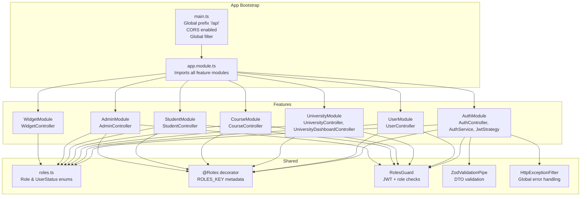
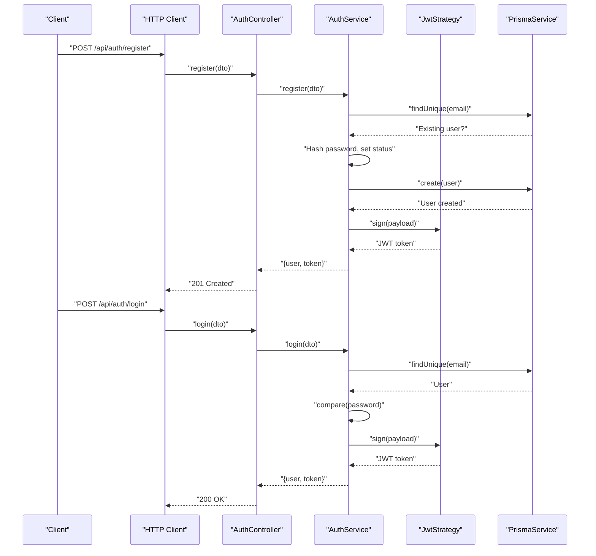
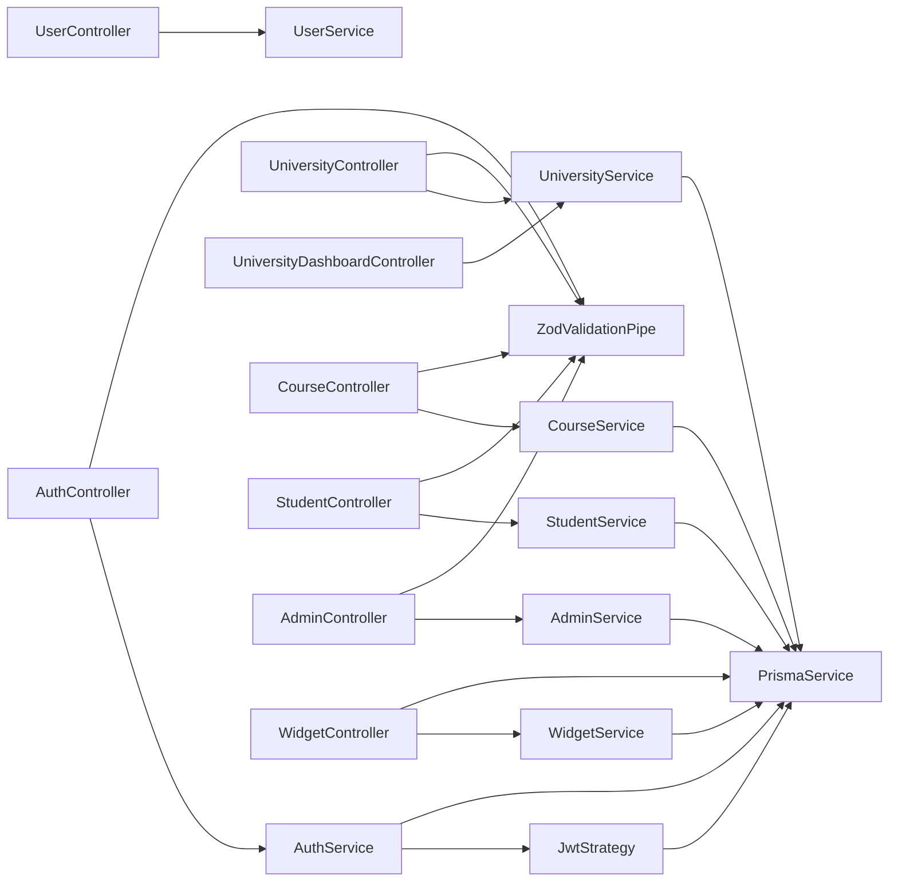
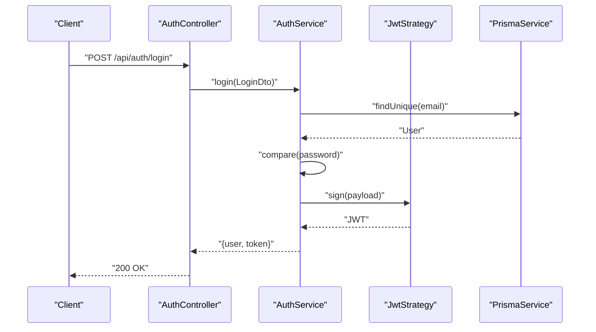
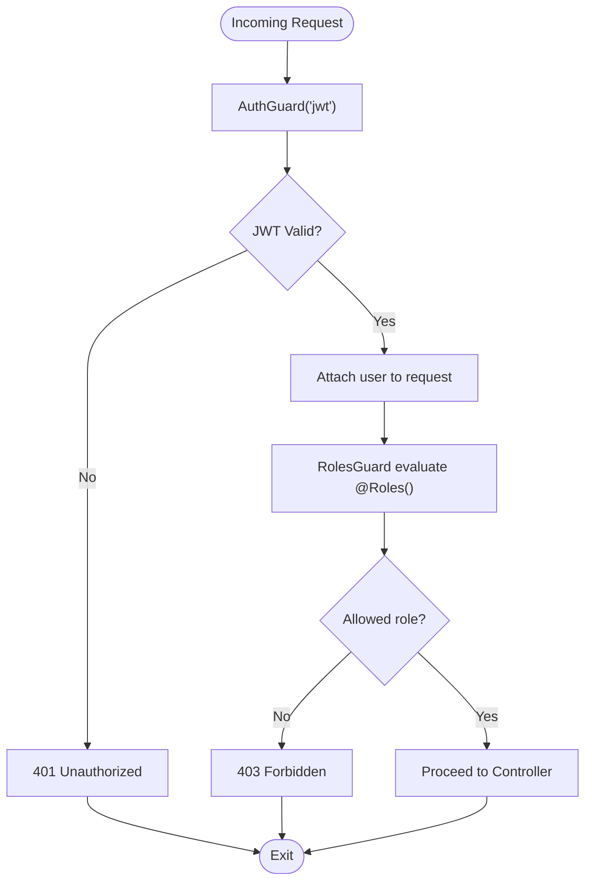

# Backend API Documentation

<cite>
**Referenced Files in This Document**
- [main.ts](file://apps/api/src/main.ts)
- [app.module.ts](file://apps/api/src/app.module.ts)
- [roles.ts](file://apps/api/src/common/constants/roles.ts)
- [roles.decorator.ts](file://apps/api/src/common/decorators/roles.decorator.ts)
- [roles.guard.ts](file://apps/api/src/common/guards/roles.guard.ts)
- [http-exception.filter.ts](file://apps/api/src/common/filters/http-exception.filter.ts)
- [zod-validation.pipe.ts](file://apps/api/src/common/pipes/zod-validation.pipe.ts)
- [auth.controller.ts](file://apps/api/src/modules/auth/auth.controller.ts)
- [auth.service.ts](file://apps/api/src/modules/auth/auth.service.ts)
- [auth.dto.ts](file://apps/api/src/modules/auth/auth.dto.ts)
- [jwt.strategy.ts](file://apps/api/src/modules/auth/jwt.strategy.ts)
- [user.controller.ts](file://apps/api/src/modules/user/user.controller.ts)
- [university.controller.ts](file://apps/api/src/modules/university/university.controller.ts)
- [university-dashboard.controller.ts](file://apps/api/src/modules/university/university-dashboard.controller.ts)
- [course.controller.ts](file://apps/api/src/modules/course/course.controller.ts)
- [student.controller.ts](file://apps/api/src/modules/student/student.controller.ts)
- [admin.controller.ts](file://apps/api/src/modules/admin/admin.controller.ts)
- [widget.controller.ts](file://apps/api/src/modules/widget/widget.controller.ts)
</cite>

## Table of Contents
1. [Introduction](#introduction)
2. [Project Structure](#project-structure)
3. [Core Components](#core-components)
4. [Architecture Overview](#architecture-overview)
5. [Detailed Component Analysis](#detailed-component-analysis)
6. [Dependency Analysis](#dependency-analysis)
7. [Performance Considerations](#performance-considerations)
8. [Troubleshooting Guide](#troubleshooting-guide)
9. [Conclusion](#conclusion)
10. [Appendices](#appendices)

## Introduction
This document provides comprehensive API documentation for the NestJS backend REST API. It organizes endpoints by role (Public, University, Student, Admin), describes HTTP methods, URL patterns, authentication requirements, and request/response schemas. It also covers authentication flow, JWT token management, role-based access control, error handling patterns, and common use cases.

## Project Structure
The backend is a NestJS application with modular feature groups and shared cross-cutting concerns:
- Application bootstrap sets global prefix, CORS, and registers global exception handling.
- Feature modules: auth, user, university, course, student, admin, widget, and search-log.
- Shared utilities: roles constants, decorators, guards, Zod validation pipe, and HTTP exception filter.

**Diagram sources**
- [main.ts](file://apps/api/src/main.ts#L10-L31)
- [app.module.ts](file://apps/api/src/app.module.ts#L30-L48)

**Section sources**
- [main.ts](file://apps/api/src/main.ts#L10-L31)
- [app.module.ts](file://apps/api/src/app.module.ts#L30-L48)

## Core Components
- Authentication and Authorization
  - JWT strategy extracts token from Authorization header and validates it against the configured secret.
  - Guards enforce JWT validation and role-based access control.
  - DTOs define strict request schemas validated by Zod.
  - Global exception filter standardizes error responses.

- Role Management
  - Roles are defined via shared constants and enforced by the RolesGuard.
  - The @Roles decorator annotates controllers/methods with allowed roles.

- Validation Pipeline
  - ZodValidationPipe converts Zod schemas to validation errors for malformed requests.

- Error Handling
  - HttpExceptionFilter ensures consistent error responses across the API.

**Section sources**
- [jwt.strategy.ts](file://apps/api/src/modules/auth/jwt.strategy.ts#L22-L57)
- [roles.guard.ts](file://apps/api/src/common/guards/roles.guard.ts#L21-L55)
- [roles.decorator.ts](file://apps/api/src/common/decorators/roles.decorator.ts#L9-L15)
- [roles.ts](file://apps/api/src/common/constants/roles.ts#L5)
- [zod-validation.pipe.ts](file://apps/api/src/common/pipes/zod-validation.pipe.ts)
- [http-exception.filter.ts](file://apps/api/src/common/filters/http-exception.filter.ts)

## Architecture Overview
The API follows a layered architecture:
- Controllers handle HTTP requests and delegate to services.
- Services encapsulate business logic and coordinate with Prisma.
- Guards and decorators enforce authentication and authorization.
- Pipes validate incoming DTOs.
- Filters normalize error responses.

**Diagram sources**
- [auth.controller.ts](file://apps/api/src/modules/auth/auth.controller.ts#L16-L26)
- [auth.service.ts](file://apps/api/src/modules/auth/auth.service.ts#L46-L130)
- [jwt.strategy.ts](file://apps/api/src/modules/auth/jwt.strategy.ts#L38-L56)

## Detailed Component Analysis

### Authentication Flow
- Endpoints
  - POST /api/auth/register
    - Authentication: Not required
    - Request: RegisterDto (email, password, optional fullName, role, optional university info)
    - Response: { user, token, message }
    - Validation: Zod schema enforces field constraints
    - Notes: UNIVERSITY role requires .edu.tr email; status is PENDING; STUDENT status is ACTIVE
  - POST /api/auth/login
    - Authentication: Not required
    - Request: LoginDto (email, password)
    - Response: { user, token }
    - Validation: Zod schema enforces field constraints
    - Notes: REJECTED users cannot log in

- JWT Token Management
  - Payload includes: sub, email, role, status, universityId
  - Secret is loaded from environment; strategy extracts token from Authorization header
  - validate() fetches user from database and attaches to request.user

- Role-Based Access Control
  - Guards: AuthGuard('jwt') + RolesGuard
  - @Roles decorator defines allowed roles per endpoint/controller
  - Unauthorized/Forbidden exceptions are thrown when missing or insufficient permissions

**Section sources**
- [auth.controller.ts](file://apps/api/src/modules/auth/auth.controller.ts#L16-L26)
- [auth.service.ts](file://apps/api/src/modules/auth/auth.service.ts#L46-L170)
- [auth.dto.ts](file://apps/api/src/modules/auth/auth.dto.ts#L9-L45)
- [jwt.strategy.ts](file://apps/api/src/modules/auth/jwt.strategy.ts#L22-L57)
- [roles.guard.ts](file://apps/api/src/common/guards/roles.guard.ts#L24-L54)
- [roles.decorator.ts](file://apps/api/src/common/decorators/roles.decorator.ts#L15)

### User Management
- Endpoints
  - GET /api/users/me
    - Authentication: JWT required
    - Response: Current user profile
  - GET /api/users?page&limit
    - Authentication: ADMIN required
    - Response: Paginated list of users

- Notes
  - Protected by AuthGuard('jwt') and RolesGuard
  - Admin-only pagination parameters

**Section sources**
- [user.controller.ts](file://apps/api/src/modules/user/user.controller.ts#L19-L38)

### University Operations
- Endpoints
  - GET /api/universities
    - Authentication: Public
    - Response: List of verified universities
  - GET /api/universities/slug/:slug
    - Authentication: Public
    - Response: University by slug
  - GET /api/universities/:id
    - Authentication: Public
    - Response: University by ID
  - GET /api/admin/universities
    - Authentication: ADMIN required
    - Response: All universities
  - POST /api/universities
    - Authentication: ADMIN required
    - Response: Created university
  - PATCH /api/universities/:id
    - Authentication: UNIVERSITY or ADMIN required
    - Response: Updated university
    - Notes: UNIVERSITY can only update their own university
  - PATCH /api/admin/verify/:id
    - Authentication: ADMIN required
    - Response: Verified university
  - PATCH /api/universities/:id/widget
    - Authentication: UNIVERSITY required
    - Response: Updated widget configuration

- University Dashboard
  - GET /api/university/dashboard/overview
    - Authentication: UNIVERSITY required
    - Response: Dashboard overview metrics
  - GET /api/university/dashboard/popular-courses?limit
    - Authentication: UNIVERSITY required
    - Response: Popular courses
  - GET /api/university/dashboard/time-series?days
    - Authentication: UNIVERSITY required
    - Response: Time series analytics
  - GET /api/university/dashboard/course-stats
    - Authentication: UNIVERSITY required
    - Response: Course status statistics

**Section sources**
- [university.controller.ts](file://apps/api/src/modules/university/university.controller.ts#L42-L112)
- [university-dashboard.controller.ts](file://apps/api/src/modules/university/university-dashboard.controller.ts#L31-L79)

### Course Management
- Endpoints
  - GET /api/courses?q&city&isOnline&minEcts&maxEcts&minPrice&maxPrice
    - Authentication: Public
    - Response: Courses matching filters
    - Notes: Natural language parsing enriches filters; SearchLog recorded
  - GET /api/courses/compare?ids
    - Authentication: Public
    - Response: Comparison of up to four courses
  - GET /api/courses/:id
    - Authentication: Public
    - Response: Course details
  - GET /api/university/courses
    - Authentication: UNIVERSITY required
    - Response: Courses for the logged-in university
  - POST /api/university/courses
    - Authentication: UNIVERSITY required
    - Response: Created course
  - PATCH /api/university/courses/:id
    - Authentication: UNIVERSITY required
    - Response: Updated course
  - DELETE /api/university/courses/:id
    - Authentication: UNIVERSITY required
    - Response: Deletion result

**Section sources**
- [course.controller.ts](file://apps/api/src/modules/course/course.controller.ts#L49-L146)

### Student Features
- Endpoints
  - GET /api/student/profile
    - Authentication: STUDENT required
    - Response: Student profile
  - GET /api/student/stats
    - Authentication: STUDENT required
    - Response: Student analytics
  - GET /api/student/favorites
    - Authentication: STUDENT required
    - Response: Favorite courses
  - POST /api/student/favorites
    - Authentication: STUDENT required
    - Response: Added favorite
  - DELETE /api/student/favorites/:courseId
    - Authentication: STUDENT required
    - Response: Removed favorite
  - GET /api/student/search-history
    - Authentication: STUDENT required
    - Response: Search history
  - GET /api/student/interactions
    - Authentication: STUDENT required
    - Response: Interactions
  - GET /api/student/recommendations
    - Authentication: STUDENT required
    - Response: Recommendations
  - POST /api/student/interactions
    - Authentication: STUDENT required
    - Response: Recorded interaction

**Section sources**
- [student.controller.ts](file://apps/api/src/modules/student/student.controller.ts#L37-L99)

### Administration Functions
- Endpoints
  - GET /api/admin/dashboard
    - Authentication: ADMIN required
    - Response: Admin dashboard stats
  - GET /api/admin/stats/popular?limit
    - Authentication: ADMIN required
    - Response: Popular searches
  - GET /api/admin/pending-requests
    - Authentication: ADMIN required
    - Response: Pending user requests
  - PATCH /api/admin/users/:id/approve
    - Authentication: ADMIN required
    - Response: Approved user
  - PATCH /api/admin/users/:id/reject
    - Authentication: ADMIN required
    - Response: Rejected user
  - GET /api/admin/universities
    - Authentication: ADMIN required
    - Response: Universities
  - POST /api/admin/universities
    - Authentication: ADMIN required
    - Response: Created university
  - PATCH /api/admin/universities/:id
    - Authentication: ADMIN required
    - Response: Updated university
  - DELETE /api/admin/universities/:id
    - Authentication: ADMIN required
    - Response: Deleted university
  - GET /api/admin/courses?page&limit
    - Authentication: ADMIN required
    - Response: Courses
  - POST /api/admin/courses
    - Authentication: ADMIN required
    - Response: Created course
  - DELETE /api/admin/courses/:id
    - Authentication: ADMIN required
    - Response: Deleted course

**Section sources**
- [admin.controller.ts](file://apps/api/src/modules/admin/admin.controller.ts#L31-L117)

### Widget API
- Endpoints
  - GET /api/widget/:univId
    - Authentication: Public
    - Response: University course data for widget
  - GET /api/widget/embed.js
    - Authentication: Public
    - Response: JavaScript embed script

**Section sources**
- [widget.controller.ts](file://apps/api/src/modules/widget/widget.controller.ts#L15-L28)

### Health Check
- GET /
  - Authentication: Not required
  - Response: Service health status

**Section sources**
- [app.module.ts](file://apps/api/src/app.module.ts#L17-L28)

## Dependency Analysis

**Diagram sources**
- [auth.controller.ts](file://apps/api/src/modules/auth/auth.controller.ts#L16-L26)
- [user.controller.ts](file://apps/api/src/modules/user/user.controller.ts#L19-L38)
- [university.controller.ts](file://apps/api/src/modules/university/university.controller.ts#L42-L112)
- [university-dashboard.controller.ts](file://apps/api/src/modules/university/university-dashboard.controller.ts#L31-L79)
- [course.controller.ts](file://apps/api/src/modules/course/course.controller.ts#L49-L146)
- [student.controller.ts](file://apps/api/src/modules/student/student.controller.ts#L37-L99)
- [admin.controller.ts](file://apps/api/src/modules/admin/admin.controller.ts#L31-L117)
- [widget.controller.ts](file://apps/api/src/modules/widget/widget.controller.ts#L15-L28)

**Section sources**
- [auth.service.ts](file://apps/api/src/modules/auth/auth.service.ts#L36-L39)
- [jwt.strategy.ts](file://apps/api/src/modules/auth/jwt.strategy.ts#L23-L26)

## Performance Considerations
- Global prefix and CORS are configured at startup to avoid per-request overhead.
- Validation occurs via ZodValidationPipe to fail fast on invalid inputs.
- Pagination parameters are parsed and sanitized; defaults prevent excessive loads.
- Widget endpoint caches embed script for a short period to reduce repeated computation.

[No sources needed since this section provides general guidance]

## Troubleshooting Guide
- Common Status Codes
  - 200 OK: Successful GET/PUT/PATCH/DELETE
  - 201 Created: Successful POST (e.g., register)
  - 400 Bad Request: Validation errors or malformed parameters
  - 401 Unauthorized: Missing/invalid/expired JWT
  - 403 Forbidden: Insufficient role or unauthorized access
  - 404 Not Found: Resource not found
  - 409 Conflict: Duplicate resource (e.g., email taken)
  - 422 Unprocessable Entity: Validation failures (handled by Zod)
  - 500 Internal Server Error: Unexpected server errors (handled by global filter)

- Error Handling Patterns
  - ZodValidationPipe throws validation errors mapped to 400/422.
  - HttpExceptionFilter standardizes error responses with message and status.
  - Guards throw 401/403 for missing auth or insufficient roles.

- Typical Scenarios
  - Registration flow: Submit RegisterDto; receive user and token; UNIVERSITY emails require .edu.tr.
  - Login flow: Submit LoginDto; receive user and token; REJECTED users blocked.
  - University dashboard: UNIVERSITY user must have associated universityId; otherwise 403.
  - Course management: UNIVERSITY users can CRUD courses for their own university only.

**Section sources**
- [http-exception.filter.ts](file://apps/api/src/common/filters/http-exception.filter.ts)
- [roles.guard.ts](file://apps/api/src/common/guards/roles.guard.ts#L47-L51)
- [auth.service.ts](file://apps/api/src/modules/auth/auth.service.ts#L51-L53)
- [university-dashboard.controller.ts](file://apps/api/src/modules/university/university-dashboard.controller.ts#L34-L36)
- [course.controller.ts](file://apps/api/src/modules/course/course.controller.ts#L100-L106)

## Conclusion
This API provides a robust, role-aware REST interface with clear separation of concerns, strong validation, and standardized error handling. Authentication relies on JWT with a dual-guard enforcement model, while role-based access control ensures appropriate permissions across all functional areas.

[No sources needed since this section summarizes without analyzing specific files]

## Appendices

### Authentication Flow Details

**Diagram sources**
- [auth.controller.ts](file://apps/api/src/modules/auth/auth.controller.ts#L22-L26)
- [auth.service.ts](file://apps/api/src/modules/auth/auth.service.ts#L136-L170)
- [jwt.strategy.ts](file://apps/api/src/modules/auth/jwt.strategy.ts#L38-L56)

### Role-Based Access Control Flow

**Diagram sources**
- [roles.guard.ts](file://apps/api/src/common/guards/roles.guard.ts#L24-L54)
- [roles.decorator.ts](file://apps/api/src/common/decorators/roles.decorator.ts#L15)