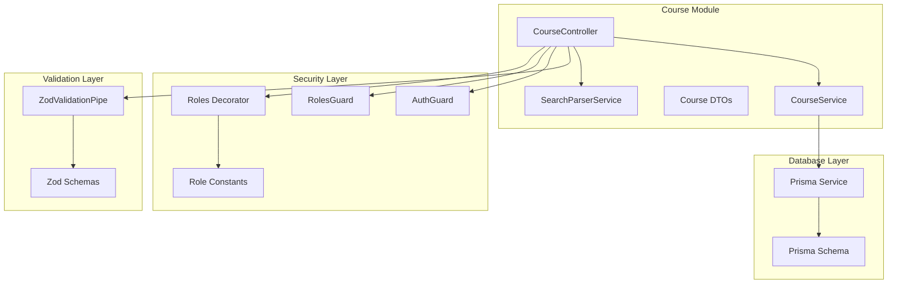
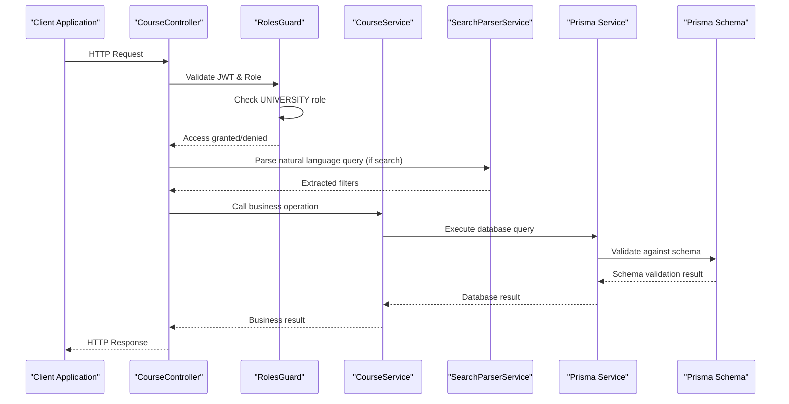
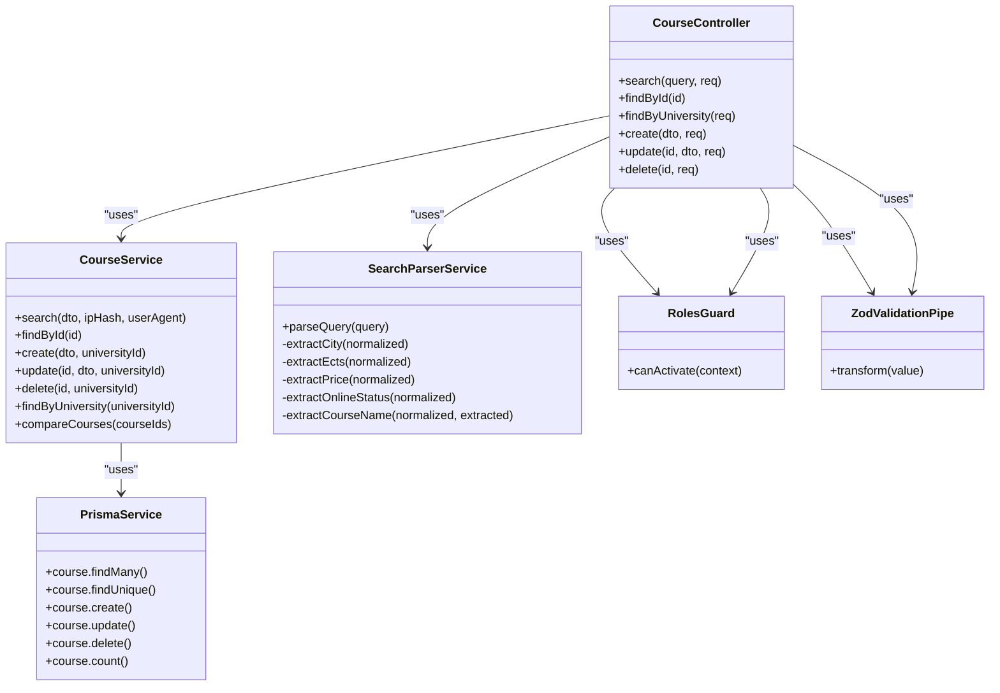

# Course CRUD Operations

<cite>
**Referenced Files in This Document**
- [course.controller.ts](file://apps/api/src/modules/course/course.controller.ts)
- [course.service.ts](file://apps/api/src/modules/course/course.service.ts)
- [course.dto.ts](file://apps/api/src/modules/course/course.dto.ts)
- [roles.guard.ts](file://apps/api/src/common/guards/roles.guard.ts)
- [roles.decorator.ts](file://apps/api/src/common/decorators/roles.decorator.ts)
- [roles.ts](file://apps/api/src/common/constants/roles.ts)
- [auth.service.ts](file://apps/api/src/modules/auth/auth.service.ts)
- [auth.dto.ts](file://apps/api/src/modules/auth/auth.dto.ts)
- [zod-validation.pipe.ts](file://apps/api/src/common/pipes/zod-validation.pipe.ts)
- [schema.prisma](file://apps/api/prisma/schema.prisma)
- [search-parser.service.ts](file://apps/api/src/modules/course/search-parser.service.ts)
- [http-exception.filter.ts](file://apps/api/src/common/filters/http-exception.filter.ts)
</cite>

## Table of Contents
1. [Introduction](#introduction)
2. [Project Structure](#project-structure)
3. [Core Components](#core-components)
4. [Architecture Overview](#architecture-overview)
5. [Detailed Component Analysis](#detailed-component-analysis)
6. [Dependency Analysis](#dependency-analysis)
7. [Performance Considerations](#performance-considerations)
8. [Troubleshooting Guide](#troubleshooting-guide)
9. [Conclusion](#conclusion)

## Introduction
This document provides comprehensive API documentation for course CRUD operations in the application. It covers all HTTP endpoints for course search, details, creation, updates, and deletion, including detailed request/response schemas, validation rules using Zod, authentication requirements with JWT tokens, and role-based access control for university users. Practical examples of course creation workflows, update operations, and proper error handling scenarios are included.

## Project Structure
The course CRUD functionality is implemented within the NestJS application under the `apps/api/src/modules/course` directory. The structure follows a clean architecture pattern with separate concerns for controllers, services, DTOs, and validation pipes.



**Diagram sources**
- [course.controller.ts](file://apps/api/src/modules/course/course.controller.ts#L36-L148)
- [course.service.ts](file://apps/api/src/modules/course/course.service.ts#L18-L310)
- [roles.guard.ts](file://apps/api/src/common/guards/roles.guard.ts#L20-L56)

**Section sources**
- [course.controller.ts](file://apps/api/src/modules/course/course.controller.ts#L1-L148)
- [course.service.ts](file://apps/api/src/modules/course/course.service.ts#L1-L310)

## Core Components
The course CRUD system consists of several key components working together:

### Authentication and Authorization
- **JWT Authentication**: Uses NestJS Passport with JWT strategy for secure access
- **Role-Based Access Control**: University users require UNIVERSITY role for course management operations
- **Multitenancy**: Each university user can only access their own university's courses

### Validation System
- **Zod Validation**: Comprehensive schema validation for all request/response data
- **Custom Validation Pipe**: Provides detailed error messages with field-specific validation feedback

### Data Management
- **Prisma ORM**: Type-safe database operations with PostgreSQL backend
- **Search Engine**: Intelligent Turkish natural language parsing for course search
- **Index Optimization**: Database indexes for optimal query performance

**Section sources**
- [auth.service.ts](file://apps/api/src/modules/auth/auth.service.ts#L20-L205)
- [roles.guard.ts](file://apps/api/src/common/guards/roles.guard.ts#L20-L56)
- [zod-validation.pipe.ts](file://apps/api/src/common/pipes/zod-validation.pipe.ts#L14-L45)

## Architecture Overview
The course CRUD operations follow a layered architecture pattern with clear separation of concerns:



**Diagram sources**
- [course.controller.ts](file://apps/api/src/modules/course/course.controller.ts#L49-L75)
- [course.service.ts](file://apps/api/src/modules/course/course.service.ts#L31-L133)
- [search-parser.service.ts](file://apps/api/src/modules/course/search-parser.service.ts#L116-L144)

## Detailed Component Analysis

### Course Controller Endpoints

#### GET /api/courses - Course Search
Public endpoint for course search with advanced filtering capabilities.

**Request Parameters:**
- `q`: Search text (course name or code)
- `city`: City filter
- `universityId`: University filter
- `isOnline`: Online/offline filter ('true'/'false')
- `minEcts/maxEcts`: Credit range filter
- `minPrice/maxPrice`: Price range filter
- `page`: Page number (default: 1)
- `limit`: Results per page (default: 20, max: 100)
- `sortBy`: Sort field (name, price, ects, createdAt)
- `sortOrder`: Sort order (asc, desc)

**Response Schema:**
```typescript
{
  data: Course[],
  meta: {
    total: number,
    page: number,
    limit: number,
    totalPages: number
  }
}
```

**Section sources**
- [course.controller.ts](file://apps/api/src/modules/course/course.controller.ts#L49-L75)
- [course.dto.ts](file://apps/api/src/modules/course/course.dto.ts#L68-L84)

#### GET /api/courses/:id - Course Details
Public endpoint for retrieving individual course details.

**Response Schema:**
```typescript
{
  id: string,
  code: string,
  name: string,
  ects: number,
  price: number,
  currency: string,
  isOnline: boolean,
  description: string,
  applicationUrl: string,
  quota: number,
  startDate: string,
  endDate: string,
  applicationDeadline: string,
  university: {
    id: string,
    name: string,
    slug: string,
    city: string,
    logo: string,
    website: string
  }
}
```

**Section sources**
- [course.controller.ts](file://apps/api/src/modules/course/course.controller.ts#L91-L94)
- [course.service.ts](file://apps/api/src/modules/course/course.service.ts#L136-L151)

#### POST /api/university/courses - Create Course
University user endpoint for creating new courses.

**Authentication Required:** JWT token with UNIVERSITY role
**Authorization:** Must be affiliated with a university

**Request Body Schema (CreateCourseDto):**
```typescript
{
  code: string (2-20 chars),
  name: string (2-200 chars),
  ects: number (1-30),
  price?: number (>=0),
  currency?: string (default: 'TRY'),
  isOnline?: boolean (default: false),
  description?: string (max 5000 chars),
  applicationUrl?: string (valid URL or empty),
  quota?: number (>=1 or null),
  startDate?: string (ISO datetime),
  endDate?: string (ISO datetime),
  applicationDeadline?: string (ISO datetime)
}
```

**Response Schema:**
Same as course details response

**Section sources**
- [course.controller.ts](file://apps/api/src/modules/course/course.controller.ts#L109-L118)
- [course.dto.ts](file://apps/api/src/modules/course/course.dto.ts#L9-L43)

#### PATCH /api/university/courses/:id - Update Course
University user endpoint for updating existing courses.

**Authentication Required:** JWT token with UNIVERSITY role
**Authorization:** Must be affiliated with the course's university

**Request Body Schema (UpdateCourseDto):**
```typescript
{
  code?: string (2-20 chars),
  name?: string (2-200 chars),
  ects?: number (1-30),
  price?: number (>=0) or null,
  currency?: string,
  isOnline?: boolean,
  description?: string (max 5000 chars) or empty,
  applicationUrl?: string (valid URL or empty),
  quota?: number (>=1) or null,
  startDate?: string (ISO datetime) or null,
  endDate?: string (ISO datetime) or null,
  applicationDeadline?: string (ISO datetime) or null
}
```

**Response Schema:**
Same as course details response

**Section sources**
- [course.controller.ts](file://apps/api/src/modules/course/course.controller.ts#L121-L134)
- [course.dto.ts](file://apps/api/src/modules/course/course.dto.ts#L49-L62)

#### DELETE /api/university/courses/:id - Delete Course
University user endpoint for deleting courses.

**Authentication Required:** JWT token with UNIVERSITY role
**Authorization:** Must be affiliated with the course's university

**Response Schema:**
```typescript
{
  message: string
}
```

**Section sources**
- [course.controller.ts](file://apps/api/src/modules/course/course.controller.ts#L137-L146)
- [course.service.ts](file://apps/api/src/modules/course/course.service.ts#L207-L221)

### Validation Rules with Zod

#### Create Course Validation
- **code**: Required, 2-20 characters, unique per university
- **name**: Required, 2-200 characters
- **ects**: Required, integer, 1-30
- **price**: Optional, number >= 0
- **currency**: Optional, defaults to 'TRY'
- **isOnline**: Optional, boolean, defaults to false
- **description**: Optional, max 5000 characters
- **applicationUrl**: Optional, valid URL or empty string
- **quota**: Optional, integer >= 1 or null
- **startDate/endDate/applicationDeadline**: Optional, ISO datetime strings

#### Update Course Validation
- All fields optional with same constraints as create operation
- Null values explicitly allowed for selective updates

#### Search Validation
- **q**: Optional search text
- **city**: Optional city name
- **universityId**: Optional university identifier
- **isOnline**: Optional enum 'true'/'false'
- **minEcts/maxEcts**: Optional numeric strings
- **minPrice/maxPrice**: Optional numeric strings
- **page**: Optional numeric string, default '1'
- **limit**: Optional numeric string, default '20', max 100
- **sortBy**: Optional enum, default 'name'
- **sortOrder**: Optional enum, default 'asc'

**Section sources**
- [course.dto.ts](file://apps/api/src/modules/course/course.dto.ts#L9-L84)
- [zod-validation.pipe.ts](file://apps/api/src/common/pipes/zod-validation.pipe.ts#L20-L43)

### Authentication and Authorization Flow

#### JWT Token Structure
```typescript
{
  sub: string,        // User ID
  email: string,      // User email
  role: Role,         // User role (STUDENT, UNIVERSITY, ADMIN)
  status: UserStatus, // Account status (PENDING, APPROVED, REJECTED, ACTIVE)
  universityId: string|null // University affiliation (for UNIVERSITY role)
}
```

#### Role-Based Access Control
- **UNIVERSITY users**: Can create, update, delete their own university's courses
- **STUDENT users**: Can only search and view courses (no modifications)
- **ADMIN users**: Full access to all operations

#### Multitenancy Implementation
Each university operates as a separate tenant. Course operations enforce that users can only access courses belonging to their university.

**Section sources**
- [auth.service.ts](file://apps/api/src/modules/auth/auth.service.ts#L21-L27)
- [roles.guard.ts](file://apps/api/src/common/guards/roles.guard.ts#L24-L54)
- [course.service.ts](file://apps/api/src/modules/course/course.service.ts#L187-L190)

### Search Engine and Natural Language Processing

#### Intelligent Search Features
The system includes a sophisticated search parser that understands Turkish natural language queries:

**Supported Query Patterns:**
- "İzmir'de online matematik" → Filters: city=İzmir, isOnline=true, q=matematik
- "3-6 kredi 1000-2000 TL" → Filters: minEcts=3, maxEcts=6, minPrice=1000, maxPrice=2000
- "6 AKTS üstü" → Filters: minEcts=6, minPrice=0 (implicit)
- "Yüz yüze kurs" → Filters: isOnline=false

**Section sources**
- [search-parser.service.ts](file://apps/api/src/modules/course/search-parser.service.ts#L116-L144)
- [course.controller.ts](file://apps/api/src/modules/course/course.controller.ts#L54-L67)

## Dependency Analysis



**Diagram sources**
- [course.controller.ts](file://apps/api/src/modules/course/course.controller.ts#L38-L41)
- [course.service.ts](file://apps/api/src/modules/course/course.service.ts#L22-L25)
- [search-parser.service.ts](file://apps/api/src/modules/course/search-parser.service.ts#L106-L109)

**Section sources**
- [course.controller.ts](file://apps/api/src/modules/course/course.controller.ts#L10-L34)
- [course.service.ts](file://apps/api/src/modules/course/course.service.ts#L13-L25)

## Performance Considerations

### Database Indexing Strategy
The Prisma schema includes strategic indexes for optimal query performance:

- **Course model indexes**: name, code, universityId, isOnline, composite (name, code, universityId)
- **University model indexes**: city, isVerified
- **SearchLog model indexes**: createdAt, searchQuery, userId

### Query Optimization
- **Pagination limits**: Maximum 100 results per page to prevent heavy queries
- **Smart search filters**: Dynamic WHERE clause construction based on provided filters
- **Selective field loading**: Only required fields are included in responses
- **Concurrent operations**: Search count and data retrieval executed concurrently

### Caching Opportunities
Consider implementing Redis caching for:
- Popular course queries
- Frequently accessed course details
- University course listings

**Section sources**
- [schema.prisma](file://apps/api/prisma/schema.prisma#L116-L122)
- [course.service.ts](file://apps/api/src/modules/course/course.service.ts#L32-L101)

## Troubleshooting Guide

### Common Error Scenarios

#### Authentication Errors
- **401 Unauthorized**: Missing or invalid JWT token
- **403 Forbidden**: Insufficient permissions or unaffiliated user
- **401 Unauthorized**: Invalid credentials during login

#### Validation Errors
- **400 Bad Request**: Zod validation failures with detailed field-specific errors
- **400 Bad Request**: Course not found (404 mapped to 400 in validation context)

#### Business Logic Errors
- **403 Forbidden**: Attempting to modify courses from other universities
- **404 Not Found**: Course does not exist
- **400 Bad Request**: Invalid comparison parameters (less than 2 or more than 4 courses)

### Error Response Format
All errors follow a standardized format:
```typescript
{
  success: false,
  statusCode: number,
  timestamp: string,
  path: string,
  message: string | object
}
```

### Debugging Tips
1. **Enable logging**: Check application logs for detailed error traces
2. **Validate JWT**: Ensure token contains correct universityId for university operations
3. **Test validation**: Use the Zod schemas to validate request data before sending
4. **Monitor database**: Check query performance and index usage

**Section sources**
- [http-exception.filter.ts](file://apps/api/src/common/filters/http-exception.filter.ts#L20-L48)
- [roles.guard.ts](file://apps/api/src/common/guards/roles.guard.ts#L40-L51)
- [course.service.ts](file://apps/api/src/modules/course/course.service.ts#L187-L190)

## Conclusion

The course CRUD system provides a robust, secure, and scalable solution for managing educational courses with comprehensive validation, authentication, and authorization mechanisms. The implementation follows modern NestJS architecture patterns with clear separation of concerns, extensive validation using Zod, and intelligent search capabilities with Turkish natural language processing.

Key strengths of the implementation include:
- **Security**: JWT-based authentication with role-based access control and multitenancy
- **Validation**: Comprehensive Zod schema validation with detailed error reporting
- **Performance**: Optimized database queries with strategic indexing
- **Usability**: Intelligent search parsing and flexible filtering options
- **Maintainability**: Clean architecture with clear component boundaries

The system is production-ready with proper error handling, logging, and follows industry best practices for API design and security.