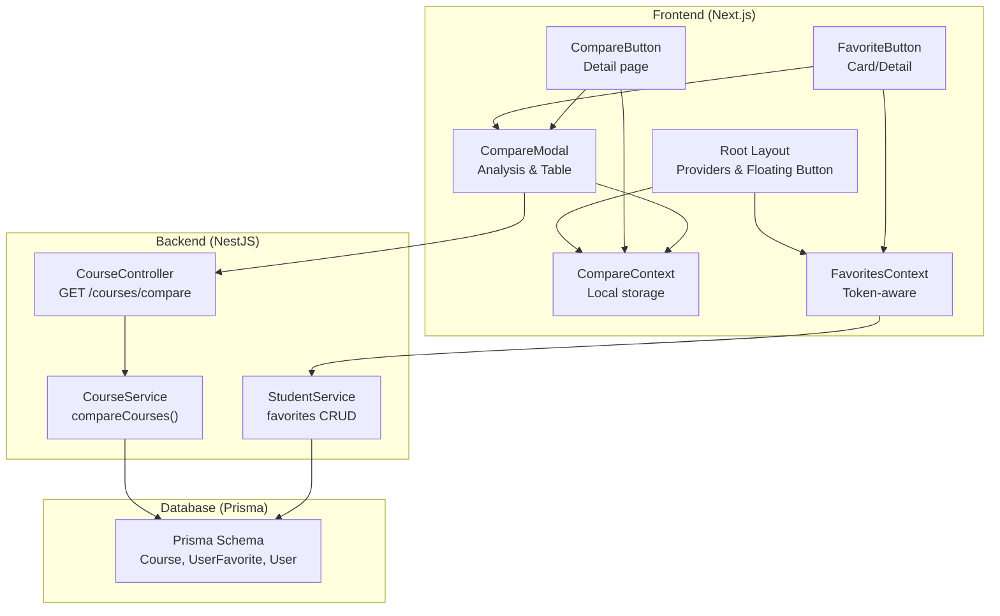
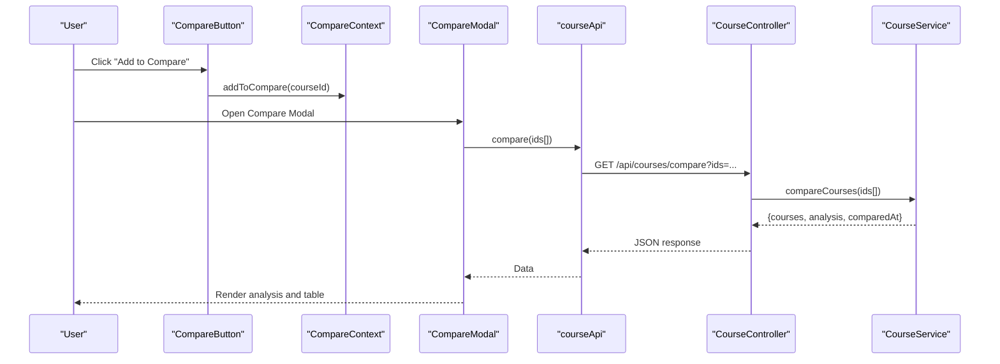
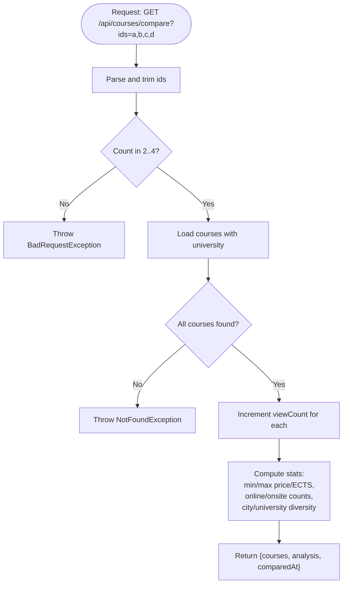
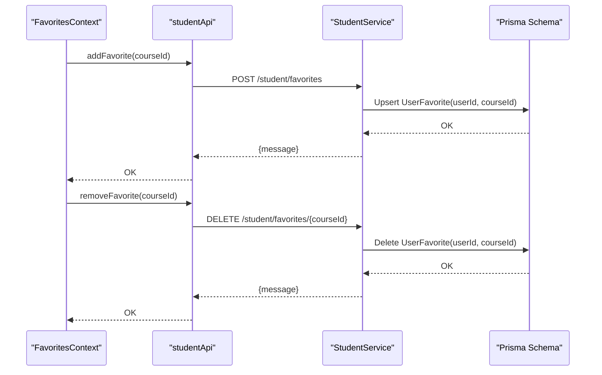
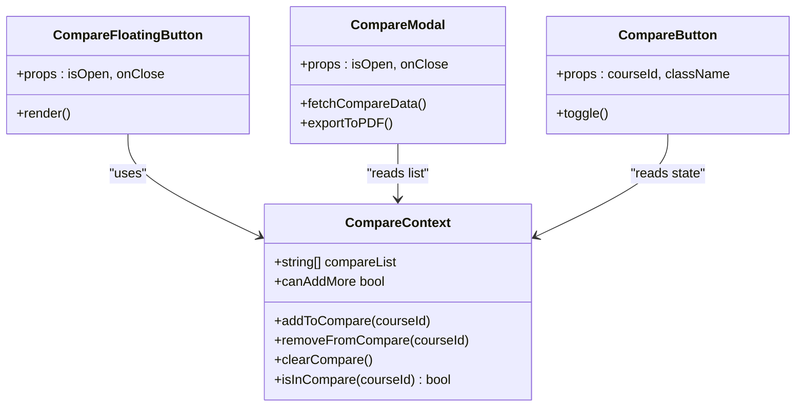
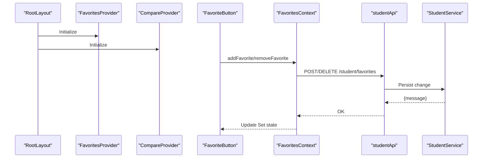
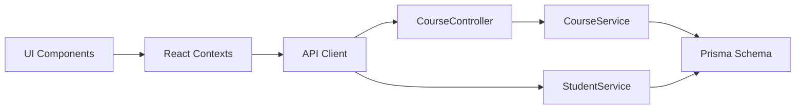

# Course Comparison and Favorites

<cite>
**Referenced Files in This Document**
- [course.controller.ts](file://apps/api/src/modules/course/course.controller.ts)
- [course.service.ts](file://apps/api/src/modules/course/course.service.ts)
- [student.service.ts](file://apps/api/src/modules/student/student.service.ts)
- [compare-context.tsx](file://apps/web/contexts/compare-context.tsx)
- [favorites-context.tsx](file://apps/web/contexts/favorites-context.tsx)
- [CompareFloatingButton.tsx](file://apps/web/components/compare/CompareFloatingButton.tsx)
- [CompareModal.tsx](file://apps/web/components/compare/CompareModal.tsx)
- [CompareButton.tsx](file://apps/web/components/course/CompareButton.tsx)
- [FavoriteButton.tsx](file://apps/web/components/course/FavoriteButton.tsx)
- [api.ts](file://apps/web/lib/api.ts)
- [layout.tsx](file://apps/web/app/layout.tsx)
- [middleware.ts](file://apps/web/middleware.ts)
- [schema.prisma](file://apps/api/prisma/schema.prisma)
</cite>

## Table of Contents
1. [Introduction](#introduction)
2. [Project Structure](#project-structure)
3. [Core Components](#core-components)
4. [Architecture Overview](#architecture-overview)
5. [Detailed Component Analysis](#detailed-component-analysis)
6. [Dependency Analysis](#dependency-analysis)
7. [Performance Considerations](#performance-considerations)
8. [Troubleshooting Guide](#troubleshooting-guide)
9. [Conclusion](#conclusion)

## Introduction
This document explains the course comparison and favorites management features of the application. It covers:
- The GET /api/courses/compare endpoint for comparing 2–4 courses
- The favorites system for students, including persistence and personalization
- Frontend integration via React contexts and components (floating comparison button, modal, and favorites toggle)
- Backend services managing user interactions, favorites persistence, and comparison calculations
- Practical workflows and patterns for comparison and favorites management

## Project Structure
The comparison and favorites features span both the frontend (Next.js) and backend (NestJS) layers:
- Frontend providers and components manage local state, user interactions, and UI flows
- Backend controllers and services implement business logic, validation, and persistence
- Shared API clients encapsulate HTTP communication and error handling

**Diagram sources**
- [layout.tsx](file://apps/web/app/layout.tsx#L24-L43)
- [compare-context.tsx](file://apps/web/contexts/compare-context.tsx#L30-L97)
- [favorites-context.tsx](file://apps/web/contexts/favorites-context.tsx#L29-L131)
- [CompareButton.tsx](file://apps/web/components/course/CompareButton.tsx#L15-L44)
- [FavoriteButton.tsx](file://apps/web/components/course/FavoriteButton.tsx#L17-L91)
- [CompareModal.tsx](file://apps/web/components/compare/CompareModal.tsx#L317-L427)
- [course.controller.ts](file://apps/api/src/modules/course/course.controller.ts#L77-L88)
- [course.service.ts](file://apps/api/src/modules/course/course.service.ts#L235-L308)
- [student.service.ts](file://apps/api/src/modules/student/student.service.ts#L102-L167)
- [schema.prisma](file://apps/api/prisma/schema.prisma#L87-L122)

**Section sources**
- [layout.tsx](file://apps/web/app/layout.tsx#L24-L43)
- [course.controller.ts](file://apps/api/src/modules/course/course.controller.ts#L77-L88)
- [course.service.ts](file://apps/api/src/modules/course/course.service.ts#L235-L308)
- [student.service.ts](file://apps/api/src/modules/student/student.service.ts#L102-L167)
- [schema.prisma](file://apps/api/prisma/schema.prisma#L87-L122)

## Core Components
- CompareContext: Centralized state for the comparison list with localStorage persistence and limits
- FavoritesContext: Student-centric favorites with token parsing, server sync, and optimistic updates
- CompareFloatingButton: Fixed-position button that appears when items are in the comparison list
- CompareModal: Full-screen modal that fetches and displays comparison analysis and a feature table
- CompareButton: Checkbox to add/remove a course from the comparison list on detail pages
- FavoriteButton: Toggle button to add/remove favorites with loading states and UX feedback
- API client: Unified HTTP client with token injection and centralized error handling
- Backend controller/service: Validation, fetching, analytics computation, and view count increments
- Student service: Favorites CRUD, recommendation engine, and interaction logging

**Section sources**
- [compare-context.tsx](file://apps/web/contexts/compare-context.tsx#L30-L97)
- [favorites-context.tsx](file://apps/web/contexts/favorites-context.tsx#L29-L131)
- [CompareFloatingButton.tsx](file://apps/web/components/compare/CompareFloatingButton.tsx#L13-L45)
- [CompareModal.tsx](file://apps/web/components/compare/CompareModal.tsx#L317-L427)
- [CompareButton.tsx](file://apps/web/components/course/CompareButton.tsx#L15-L44)
- [FavoriteButton.tsx](file://apps/web/components/course/FavoriteButton.tsx#L17-L91)
- [api.ts](file://apps/web/lib/api.ts#L11-L36)
- [course.controller.ts](file://apps/api/src/modules/course/course.controller.ts#L77-L88)
- [course.service.ts](file://apps/api/src/modules/course/course.service.ts#L235-L308)
- [student.service.ts](file://apps/api/src/modules/student/student.service.ts#L102-L167)

## Architecture Overview
The comparison and favorites features follow a layered architecture:
- UI layer: React components and contexts manage user actions and state
- API layer: Next.js API client encapsulates HTTP requests and responses
- Business logic: NestJS controllers and services implement validation, persistence, and analytics
- Data layer: Prisma schema defines entities and relationships

**Diagram sources**
- [CompareButton.tsx](file://apps/web/components/course/CompareButton.tsx#L27-L34)
- [compare-context.tsx](file://apps/web/contexts/compare-context.tsx#L58-L64)
- [CompareModal.tsx](file://apps/web/components/compare/CompareModal.tsx#L323-L337)
- [api.ts](file://apps/web/lib/api.ts#L71-L76)
- [course.controller.ts](file://apps/api/src/modules/course/course.controller.ts#L77-L88)
- [course.service.ts](file://apps/api/src/modules/course/course.service.ts#L235-L308)

## Detailed Component Analysis

### Backend: Course Comparison Endpoint
The GET /api/courses/compare endpoint validates input, retrieves courses, increments view counts, and computes statistics.

Key behaviors:
- Validates that ids parameter exists and parses a comma-separated list
- Enforces minimum/maximum course count (2–4)
- Fetches courses with university details and sorts by price ascending
- Increments viewCount for each compared course
- Computes analysis metrics (min/max price, min/max ECTS, online/onsite split, city/university diversity)

**Diagram sources**
- [course.controller.ts](file://apps/api/src/modules/course/course.controller.ts#L77-L88)
- [course.service.ts](file://apps/api/src/modules/course/course.service.ts#L235-L308)

**Section sources**
- [course.controller.ts](file://apps/api/src/modules/course/course.controller.ts#L77-L88)
- [course.service.ts](file://apps/api/src/modules/course/course.service.ts#L235-L308)

### Backend: Favorites Management
The favorites system is student-centric:
- Favorites retrieval lists courses with university metadata
- Adding a favorite checks existence and creates a UserFavorite record
- Removing a favorite deletes the UserFavorite record
- Interaction recording increments course viewCount and logs user actions

**Diagram sources**
- [favorites-context.tsx](file://apps/web/contexts/favorites-context.tsx#L71-L99)
- [api.ts](file://apps/web/lib/api.ts#L226-L235)
- [student.service.ts](file://apps/api/src/modules/student/student.service.ts#L121-L167)
- [schema.prisma](file://apps/api/prisma/schema.prisma#L156-L168)

**Section sources**
- [favorites-context.tsx](file://apps/web/contexts/favorites-context.tsx#L29-L131)
- [api.ts](file://apps/web/lib/api.ts#L212-L235)
- [student.service.ts](file://apps/api/src/modules/student/student.service.ts#L102-L167)
- [schema.prisma](file://apps/api/prisma/schema.prisma#L156-L168)

### Frontend: Comparison State and UI
- CompareContext manages a list of up to four course IDs, persists to localStorage, and exposes helpers
- CompareFloatingButton shows a fixed action button when items are present
- CompareModal fetches comparison data, renders analysis cards and a comparison table, and supports PDF export
- CompareButton toggles inclusion in the comparison list on course detail pages

**Diagram sources**
- [compare-context.tsx](file://apps/web/contexts/compare-context.tsx#L30-L97)
- [CompareFloatingButton.tsx](file://apps/web/components/compare/CompareFloatingButton.tsx#L13-L45)
- [CompareModal.tsx](file://apps/web/components/compare/CompareModal.tsx#L317-L427)
- [CompareButton.tsx](file://apps/web/components/course/CompareButton.tsx#L15-L44)

**Section sources**
- [compare-context.tsx](file://apps/web/contexts/compare-context.tsx#L30-L97)
- [CompareFloatingButton.tsx](file://apps/web/components/compare/CompareFloatingButton.tsx#L13-L45)
- [CompareModal.tsx](file://apps/web/components/compare/CompareModal.tsx#L317-L427)
- [CompareButton.tsx](file://apps/web/components/course/CompareButton.tsx#L15-L44)

### Frontend: Favorites Toggle and Personalization
- FavoritesContext initializes from localStorage token, detects STUDENT role, and synchronizes favorites
- FavoriteButton optimistically updates UI and surfaces errors via toast notifications
- Middleware ensures protected routes and redirects based on role/status

**Diagram sources**
- [layout.tsx](file://apps/web/app/layout.tsx#L29-L37)
- [favorites-context.tsx](file://apps/web/contexts/favorites-context.tsx#L29-L131)
- [FavoriteButton.tsx](file://apps/web/components/course/FavoriteButton.tsx#L39-L57)
- [api.ts](file://apps/web/lib/api.ts#L226-L235)
- [student.service.ts](file://apps/api/src/modules/student/student.service.ts#L121-L167)

**Section sources**
- [layout.tsx](file://apps/web/app/layout.tsx#L29-L37)
- [favorites-context.tsx](file://apps/web/contexts/favorites-context.tsx#L29-L131)
- [FavoriteButton.tsx](file://apps/web/components/course/FavoriteButton.tsx#L39-L57)
- [middleware.ts](file://apps/web/middleware.ts#L25-L101)

## Dependency Analysis
- Frontend depends on:
  - API client for HTTP communication
  - Contexts for cross-component state
  - UI components for rendering and user interaction
- Backend depends on:
  - Prisma schema for data modeling and queries
  - Services for business logic and persistence
- Cross-cutting concerns:
  - Token parsing and role checks in contexts and middleware
  - Error handling centralized in the API client

**Diagram sources**
- [api.ts](file://apps/web/lib/api.ts#L11-L36)
- [course.controller.ts](file://apps/api/src/modules/course/course.controller.ts#L77-L88)
- [course.service.ts](file://apps/api/src/modules/course/course.service.ts#L235-L308)
- [student.service.ts](file://apps/api/src/modules/student/student.service.ts#L102-L167)
- [schema.prisma](file://apps/api/prisma/schema.prisma#L87-L122)

**Section sources**
- [api.ts](file://apps/web/lib/api.ts#L11-L36)
- [course.controller.ts](file://apps/api/src/modules/course/course.controller.ts#L77-L88)
- [course.service.ts](file://apps/api/src/modules/course/course.service.ts#L235-L308)
- [student.service.ts](file://apps/api/src/modules/student/student.service.ts#L102-L167)
- [schema.prisma](file://apps/api/prisma/schema.prisma#L87-L122)

## Performance Considerations
- Comparison endpoint:
  - Uses in-filter and single sort to minimize overhead
  - Aggregates statistics client-side after fetching
- Favorites:
  - Optimistic UI updates reduce perceived latency
  - Token parsing avoids unnecessary network calls for non-students
- UI:
  - Local storage persistence prevents re-computation on reload
  - Modal lazy-loading of comparison data reduces initial payload

## Troubleshooting Guide
Common issues and resolutions:
- Comparison endpoint errors:
  - Missing ids parameter: ensure ids are provided and comma-separated
  - Invalid course IDs: verify course existence and visibility
  - Too few/too many courses: adhere to 2–4 limit
- Favorites errors:
  - Non-STUDENT role: favorites require a STUDENT token
  - Duplicate favorite: adding an existing favorite raises conflict
  - Network failures: API client throws descriptive errors; retry or check connectivity
- UI state:
  - Hydration mismatches: components guard against SSR-only rendering
  - Local storage corruption: provider gracefully handles invalid entries

**Section sources**
- [course.controller.ts](file://apps/api/src/modules/course/course.controller.ts#L80-L87)
- [course.service.ts](file://apps/api/src/modules/course/course.service.ts#L239-L261)
- [student.service.ts](file://apps/api/src/modules/student/student.service.ts#L131-L139)
- [favorites-context.tsx](file://apps/web/contexts/favorites-context.tsx#L44-L64)
- [api.ts](file://apps/web/lib/api.ts#L28-L36)

## Conclusion
The course comparison and favorites features combine robust backend services with intuitive frontend components:
- The comparison endpoint provides fast, client-friendly analytics for 2–4 courses
- The favorites system offers seamless student personalization with optimistic UI updates
- React contexts and components deliver a cohesive user experience across pages
Together, these features support informed decision-making and enhance user engagement.