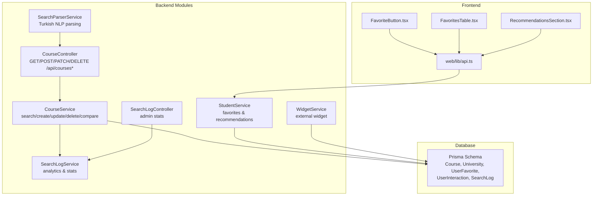
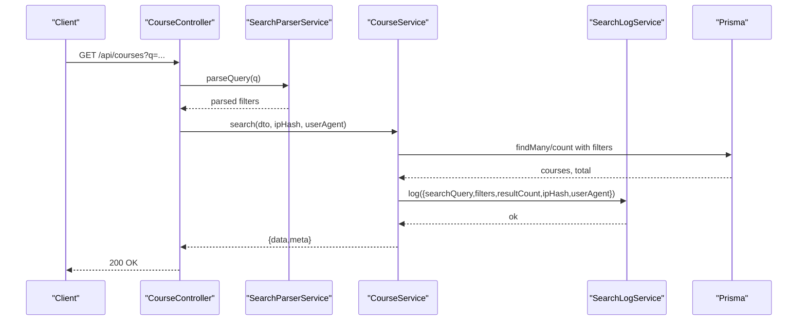
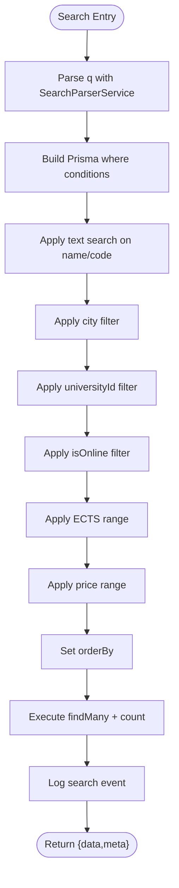
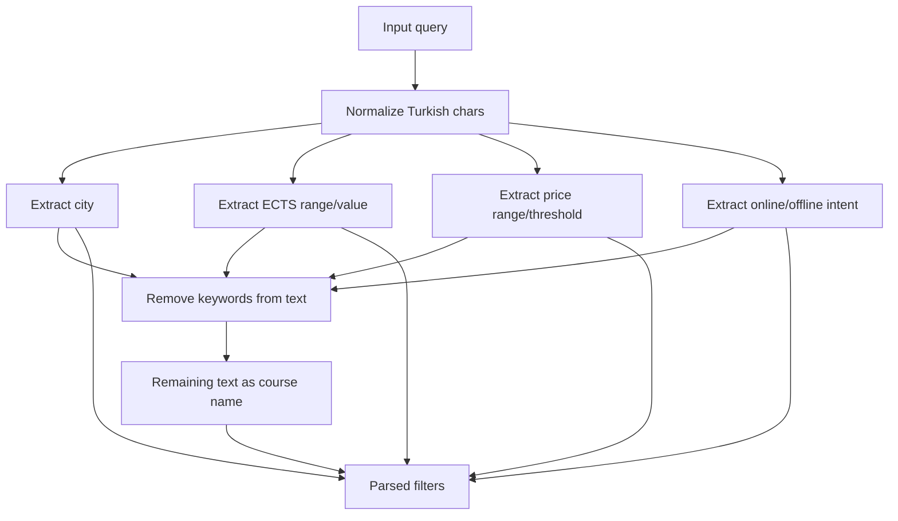
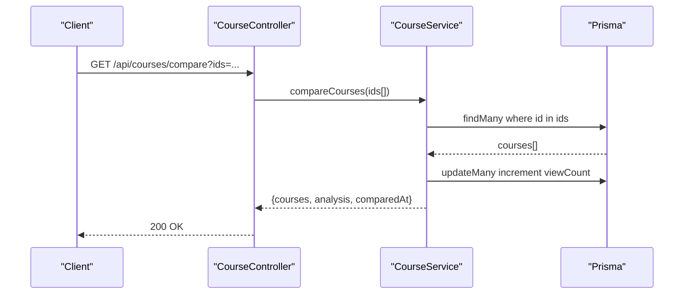
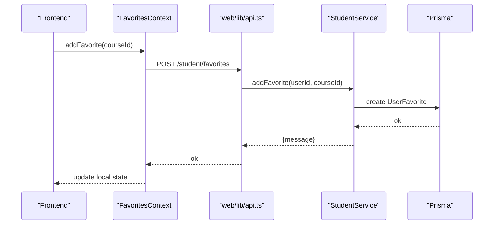
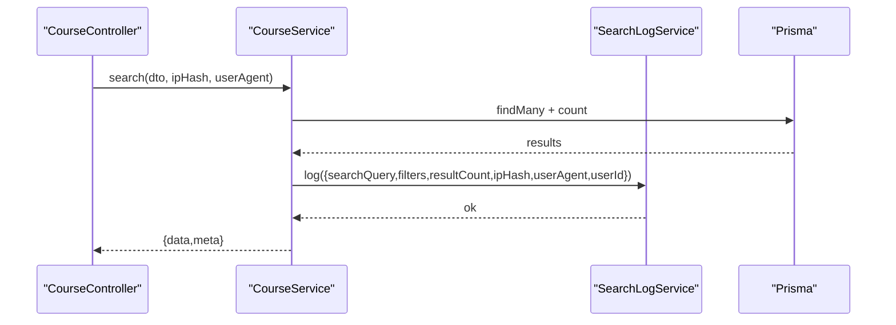
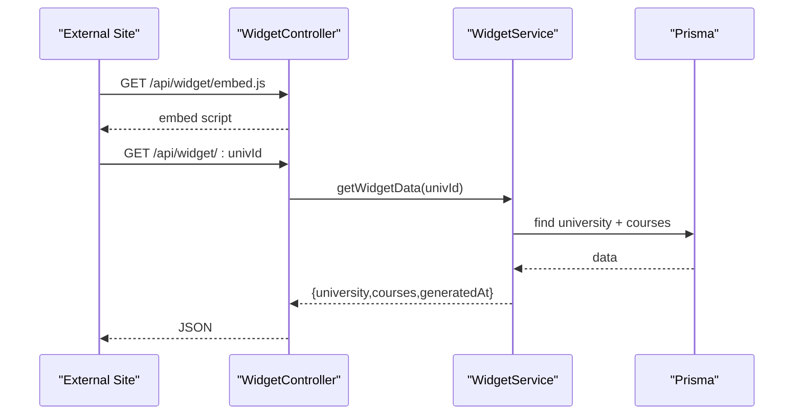
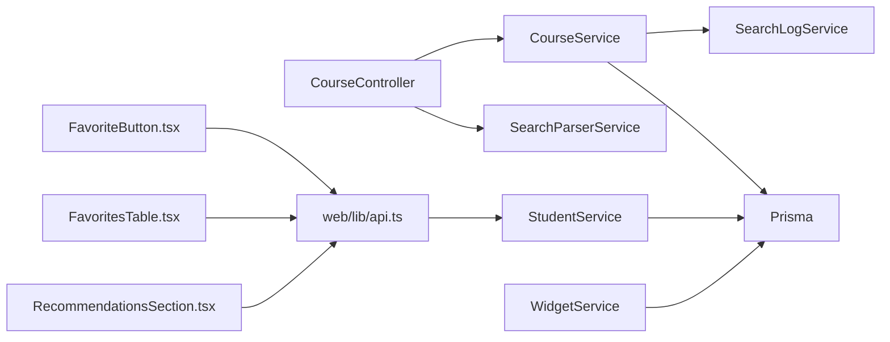
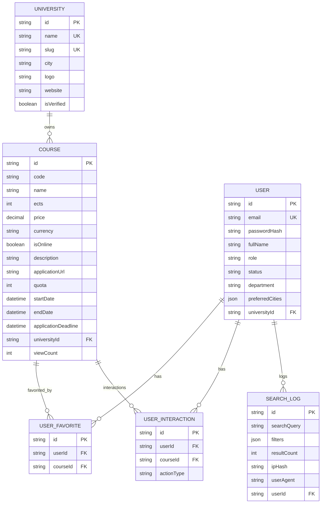

# Course Management

<cite>
**Referenced Files in This Document**
- [course.controller.ts](file://apps/api/src/modules/course/course.controller.ts)
- [course.service.ts](file://apps/api/src/modules/course/course.service.ts)
- [course.dto.ts](file://apps/api/src/modules/course/course.dto.ts)
- [search-parser.service.ts](file://apps/api/src/modules/course/search-parser.service.ts)
- [search-log.service.ts](file://apps/api/src/modules/search-log/search-log.service.ts)
- [search-log.controller.ts](file://apps/api/src/modules/search-log/search-log.controller.ts)
- [student.service.ts](file://apps/api/src/modules/student/student.service.ts)
- [schema.prisma](file://apps/api/prisma/schema.prisma)
- [FavoritesTable.tsx](file://apps/web/app/dashboard/student/components/FavoritesTable.tsx)
- [favorites-context.tsx](file://apps/web/contexts/favorites-context.tsx)
- [FavoriteButton.tsx](file://apps/web/components/course/FavoriteButton.tsx)
- [RecommendationsSection.tsx](file://apps/web/app/dashboard/student/components/RecommendationsSection.tsx)
- [api.ts](file://apps/web/lib/api.ts)
- [widget.service.ts](file://apps/api/src/modules/widget/widget.service.ts)
- [widget.controller.ts](file://apps/api/src/modules/widget/widget.controller.ts)
</cite>

## Table of Contents
1. [Introduction](#introduction)
2. [Project Structure](#project-structure)
3. [Core Components](#core-components)
4. [Architecture Overview](#architecture-overview)
5. [Detailed Component Analysis](#detailed-component-analysis)
6. [Dependency Analysis](#dependency-analysis)
7. [Performance Considerations](#performance-considerations)
8. [Troubleshooting Guide](#troubleshooting-guide)
9. [Conclusion](#conclusion)
10. [Appendices](#appendices)

## Introduction
This document provides comprehensive API documentation for course management endpoints, covering:
- Course CRUD operations for universities
- Public course search with advanced filters and discovery features
- Natural language processing for Turkish search queries
- Course comparison capabilities
- Favorite management for students
- Analytics and search logging integration
- Practical examples of search workflows, advanced filtering, and recommendation systems

## Project Structure
The course management system spans backend NestJS modules and frontend Next.js components:
- Backend: course, search-log, student, widget modules under apps/api
- Frontend: student dashboard and course UI components under apps/web
- Data modeling: Prisma schema defines Course, University, UserFavorite, UserInteraction, and SearchLog entities

**Diagram sources**
- [course.controller.ts](file://apps/api/src/modules/course/course.controller.ts#L36-L147)
- [course.service.ts](file://apps/api/src/modules/course/course.service.ts#L18-L309)
- [search-parser.service.ts](file://apps/api/src/modules/course/search-parser.service.ts#L105-L282)
- [search-log.service.ts](file://apps/api/src/modules/search-log/search-log.service.ts#L18-L115)
- [search-log.controller.ts](file://apps/api/src/modules/search-log/search-log.controller.ts#L14-L41)
- [student.service.ts](file://apps/api/src/modules/student/student.service.ts#L15-L291)
- [widget.service.ts](file://apps/api/src/modules/widget/widget.service.ts#L8-L107)
- [schema.prisma](file://apps/api/prisma/schema.prisma#L87-L182)
- [FavoriteButton.tsx](file://apps/web/components/course/FavoriteButton.tsx#L1-L91)
- [FavoritesTable.tsx](file://apps/web/app/dashboard/student/components/FavoritesTable.tsx#L1-L140)
- [RecommendationsSection.tsx](file://apps/web/app/dashboard/student/components/RecommendationsSection.tsx#L1-L82)
- [api.ts](file://apps/web/lib/api.ts#L214-L267)

**Section sources**
- [course.controller.ts](file://apps/api/src/modules/course/course.controller.ts#L36-L147)
- [course.service.ts](file://apps/api/src/modules/course/course.service.ts#L18-L309)
- [schema.prisma](file://apps/api/prisma/schema.prisma#L87-L182)

## Core Components
- CourseController: Exposes public and university-protected endpoints for course search, detail retrieval, CRUD operations, and comparison.
- CourseService: Implements search logic, pagination, dynamic filters, multitenancy checks, and comparison analytics.
- SearchParserService: Parses Turkish natural language queries into structured filters (city, online status, ECTS, price).
- SearchLogService/SearchLogController: Logs search events and exposes admin analytics.
- StudentService: Manages favorites, interactions, recommendations, and personal statistics.
- Prisma Schema: Defines Course, University, UserFavorite, UserInteraction, and SearchLog models with appropriate indexes.

**Section sources**
- [course.controller.ts](file://apps/api/src/modules/course/course.controller.ts#L36-L147)
- [course.service.ts](file://apps/api/src/modules/course/course.service.ts#L18-L309)
- [search-parser.service.ts](file://apps/api/src/modules/course/search-parser.service.ts#L105-L282)
- [search-log.service.ts](file://apps/api/src/modules/search-log/search-log.service.ts#L18-L115)
- [search-log.controller.ts](file://apps/api/src/modules/search-log/search-log.controller.ts#L14-L41)
- [student.service.ts](file://apps/api/src/modules/student/student.service.ts#L15-L291)
- [schema.prisma](file://apps/api/prisma/schema.prisma#L87-L182)

## Architecture Overview
The system follows a layered architecture:
- Controllers handle HTTP requests and delegate to services
- Services encapsulate business logic and coordinate with Prisma
- SearchParserService enriches natural language queries
- Analytics are captured via SearchLogService
- Frontend integrates with backend APIs for favorites and recommendations

**Diagram sources**
- [course.controller.ts](file://apps/api/src/modules/course/course.controller.ts#L49-L75)
- [search-parser.service.ts](file://apps/api/src/modules/course/search-parser.service.ts#L116-L144)
- [course.service.ts](file://apps/api/src/modules/course/course.service.ts#L31-L133)
- [search-log.service.ts](file://apps/api/src/modules/search-log/search-log.service.ts#L24-L35)

## Detailed Component Analysis

### Course Endpoints
- Public search: GET /api/courses
  - Supports query text, city, universityId, online/onsite, ECTS range, price range, pagination, sorting
  - Enriches query with natural language parsing when present
- Course detail: GET /api/courses/:id
- University dashboard: GET /api/university/courses
- Create course: POST /api/university/courses
- Update course: PATCH /api/university/courses/:id
- Delete course: DELETE /api/university/courses/:id
- Course comparison: GET /api/courses/compare?ids=...

Authorization:
- University endpoints require JWT + RolesGuard with UNIVERSITY role
- Search and detail are public

Validation:
- Zod schemas enforce field constraints for creation and updates

**Section sources**
- [course.controller.ts](file://apps/api/src/modules/course/course.controller.ts#L49-L146)
- [course.dto.ts](file://apps/api/src/modules/course/course.dto.ts#L9-L83)
- [course.service.ts](file://apps/api/src/modules/course/course.service.ts#L157-L221)

### Search and Discovery Features
- Dynamic filters: city, universityId, isOnline, min/max ECTS, min/max price, sortBy, sortOrder, pagination
- Text search: case-insensitive substring match on course name and code
- Sorting: name, price, ects, createdAt with asc/desc
- Pagination: page and limit with enforced cap
- Verification gating: only courses from verified universities are returned

**Diagram sources**
- [course.controller.ts](file://apps/api/src/modules/course/course.controller.ts#L49-L75)
- [course.service.ts](file://apps/api/src/modules/course/course.service.ts#L31-L133)
- [search-parser.service.ts](file://apps/api/src/modules/course/search-parser.service.ts#L116-L144)

**Section sources**
- [course.service.ts](file://apps/api/src/modules/course/course.service.ts#L31-L133)

### Natural Language Processing for Search
The SearchParserService extracts structured filters from Turkish queries:
- City detection from 81 Turkish provinces (with word-boundary-aware matching)
- ECTS range or single value extraction
- Price range or thresholds (TL/lira/₺)
- Online vs. onsite intent
- Course name extraction by removing extracted keywords and stop words

Normalization:
- Turkish characters mapped to ASCII base equivalents for case-insensitive matching

**Diagram sources**
- [search-parser.service.ts](file://apps/api/src/modules/course/search-parser.service.ts#L116-L282)

**Section sources**
- [search-parser.service.ts](file://apps/api/src/modules/course/search-parser.service.ts#L19-L282)

### Course Comparison
Endpoint: GET /api/courses/compare?ids=...
- Validates 2–4 course IDs
- Fetches courses with university metadata
- Increments viewCount for each compared course
- Computes comparative analytics:
  - Cheapest/most expensive course
  - Highest/lowest ECTS
  - Online vs. onsite counts
  - Average/min/max price and ECTS
  - Unique cities and universities
- Returns courses, analysis, and timestamp

**Diagram sources**
- [course.controller.ts](file://apps/api/src/modules/course/course.controller.ts#L77-L88)
- [course.service.ts](file://apps/api/src/modules/course/course.service.ts#L235-L308)

**Section sources**
- [course.controller.ts](file://apps/api/src/modules/course/course.controller.ts#L77-L88)
- [course.service.ts](file://apps/api/src/modules/course/course.service.ts#L235-L308)

### Favorite Management
Frontend components:
- FavoriteButton: Adds/removes favorites; integrates with FavoritesContext
- FavoritesTable: Lists favorites with actions to remove, compare, and view details
- Context: Maintains synchronized favorite IDs across the app

Backend endpoints (student):
- GET /student/favorites
- POST /student/favorites (body: { courseId })
- DELETE /student/favorites/:courseId
- GET /student/search-history
- GET /student/interactions
- GET /student/recommendations

Recommendations:
- StudentService.getRecommendations builds suggestions based on recent interactions and shared city/ECTS proximity

**Diagram sources**
- [FavoriteButton.tsx](file://apps/web/components/course/FavoriteButton.tsx#L39-L57)
- [favorites-context.tsx](file://apps/web/contexts/favorites-context.tsx#L71-L99)
- [FavoritesTable.tsx](file://apps/web/app/dashboard/student/components/FavoritesTable.tsx#L34-L49)
- [api.ts](file://apps/web/lib/api.ts#L226-L235)
- [student.service.ts](file://apps/api/src/modules/student/student.service.ts#L121-L147)

**Section sources**
- [FavoriteButton.tsx](file://apps/web/components/course/FavoriteButton.tsx#L1-L91)
- [favorites-context.tsx](file://apps/web/contexts/favorites-context.tsx#L71-L104)
- [FavoritesTable.tsx](file://apps/web/app/dashboard/student/components/FavoritesTable.tsx#L28-L49)
- [api.ts](file://apps/web/lib/api.ts#L214-L267)
- [student.service.ts](file://apps/api/src/modules/student/student.service.ts#L102-L194)
- [student.service.ts](file://apps/api/src/modules/student/student.service.ts#L222-L290)

### Analytics and Search Logging
Search events are logged with:
- searchQuery, applied filters, resultCount, anonymized IP hash, userAgent, optional userId
- Admin endpoints expose:
  - Overview stats (total searches, courses, universities, today’s searches)
  - Popular searches (top queries)
  - Daily stats (time-series aggregation)

**Diagram sources**
- [course.controller.ts](file://apps/api/src/modules/course/course.controller.ts#L49-L75)
- [course.service.ts](file://apps/api/src/modules/course/course.service.ts#L104-L122)
- [search-log.service.ts](file://apps/api/src/modules/search-log/search-log.service.ts#L24-L90)
- [search-log.controller.ts](file://apps/api/src/modules/search-log/search-log.controller.ts#L20-L40)

**Section sources**
- [course.service.ts](file://apps/api/src/modules/course/course.service.ts#L104-L122)
- [search-log.service.ts](file://apps/api/src/modules/search-log/search-log.service.ts#L24-L115)
- [search-log.controller.ts](file://apps/api/src/modules/search-log/search-log.controller.ts#L14-L41)

### External Widget Integration
University courses can be embedded on external websites:
- GET /api/widget/:univId (by ID or slug) returns university and course data
- GET /api/widget/embed.js returns a client-side script to render widgets

**Diagram sources**
- [widget.controller.ts](file://apps/api/src/modules/widget/widget.controller.ts#L11-L29)
- [widget.service.ts](file://apps/api/src/modules/widget/widget.service.ts#L18-L67)

**Section sources**
- [widget.controller.ts](file://apps/api/src/modules/widget/widget.controller.ts#L11-L29)
- [widget.service.ts](file://apps/api/src/modules/widget/widget.service.ts#L18-L67)

## Dependency Analysis
- CourseController depends on CourseService and SearchParserService
- CourseService depends on PrismaService and SearchLogService
- StudentService depends on PrismaService for favorites, interactions, recommendations
- Frontend components depend on web/lib/api.ts for HTTP calls
- Prisma schema defines relations and indexes impacting performance and multitenancy

**Diagram sources**
- [course.controller.ts](file://apps/api/src/modules/course/course.controller.ts#L36-L41)
- [course.service.ts](file://apps/api/src/modules/course/course.service.ts#L22-L25)
- [search-parser.service.ts](file://apps/api/src/modules/course/search-parser.service.ts#L105-L106)
- [search-log.service.ts](file://apps/api/src/modules/search-log/search-log.service.ts#L18-L22)
- [student.service.ts](file://apps/api/src/modules/student/student.service.ts#L15-L19)
- [widget.service.ts](file://apps/api/src/modules/widget/widget.service.ts#L8-L12)
- [FavoriteButton.tsx](file://apps/web/components/course/FavoriteButton.tsx#L1-L91)
- [FavoritesTable.tsx](file://apps/web/app/dashboard/student/components/FavoritesTable.tsx#L1-L140)
- [RecommendationsSection.tsx](file://apps/web/app/dashboard/student/components/RecommendationsSection.tsx#L1-L82)
- [api.ts](file://apps/web/lib/api.ts#L214-L267)

**Section sources**
- [course.controller.ts](file://apps/api/src/modules/course/course.controller.ts#L36-L41)
- [course.service.ts](file://apps/api/src/modules/course/course.service.ts#L22-L25)
- [student.service.ts](file://apps/api/src/modules/student/student.service.ts#L15-L19)
- [widget.service.ts](file://apps/api/src/modules/widget/widget.service.ts#L8-L12)
- [api.ts](file://apps/web/lib/api.ts#L214-L267)

## Performance Considerations
- Indexes in Prisma schema support frequent queries:
  - Course: name, code, universityId, isOnline, composite (name/code/universityId)
  - University: city, isVerified
  - SearchLog: createdAt, searchQuery, userId
- Course search enforces a maximum page size to limit result set
- Comparison increments viewCount in bulk to reduce write amplification
- Recommendation logic limits auxiliary queries and falls back to popular courses when no interactions exist

[No sources needed since this section provides general guidance]

## Troubleshooting Guide
Common issues and resolutions:
- Unauthorized access to university endpoints:
  - Ensure JWT bearer token with UNIVERSITY role is provided
- Course not found during update/delete:
  - Verify course exists and belongs to the requesting university (multitenancy check)
- Invalid or missing university association:
  - University endpoints require a valid universityId on the user profile
- Search parser returns empty filters:
  - Confirm query contains recognizable Turkish keywords or phrases
- Favorites conflicts:
  - Adding an already favorited course raises conflict; remove first if needed

**Section sources**
- [course.controller.ts](file://apps/api/src/modules/course/course.controller.ts#L96-L146)
- [course.service.ts](file://apps/api/src/modules/course/course.service.ts#L181-L221)
- [student.service.ts](file://apps/api/src/modules/student/student.service.ts#L121-L147)

## Conclusion
The course management system provides a robust, multitenant solution for course discovery, administration, and analytics. It leverages natural language processing for intuitive search, maintains strong data integrity with Prisma, and offers rich integrations for recommendations, favorites, and external widgets.

[No sources needed since this section summarizes without analyzing specific files]

## Appendices

### API Reference: Course Endpoints
- GET /api/courses
  - Query parameters: q, city, universityId, isOnline, minEcts, maxEcts, minPrice, maxPrice, page, limit, sortBy, sortOrder
  - Response: { data: Course[], meta: { total, page, limit, totalPages } }
- GET /api/courses/:id
  - Response: Course with university details
- GET /api/courses/compare?ids=
  - Response: { courses: Course[], analysis: object, comparedAt: string }
- GET /api/university/courses
  - Response: Course[]
- POST /api/university/courses
  - Body: CreateCourseDto
  - Response: Course
- PATCH /api/university/courses/:id
  - Body: UpdateCourseDto
  - Response: Course
- DELETE /api/university/courses/:id
  - Response: { message }

**Section sources**
- [course.controller.ts](file://apps/api/src/modules/course/course.controller.ts#L49-L146)
- [course.dto.ts](file://apps/api/src/modules/course/course.dto.ts#L9-L83)

### Data Models: Course and Related Entities

**Diagram sources**
- [schema.prisma](file://apps/api/prisma/schema.prisma#L36-L182)

### Practical Examples

- Example: Advanced search with natural language
  - Request: GET /api/courses?q="İzmir'de online 6 AKTS matematik"
  - Behavior: Parser extracts city=İzmir, isOnline=true, minEcts=maxEcts=6, q="matematik"; merges with manual filters if provided
  - Response: Paginated course list filtered by verified universities

- Example: Course comparison
  - Request: GET /api/courses/compare?ids=A,B,C,D
  - Behavior: Validates IDs, fetches courses, increments viewCount, computes analytics
  - Response: Courses ordered by price with summary statistics

- Example: Recommendation system
  - Request: GET /student/recommendations
  - Behavior: If interactions exist, recommends courses from the same city within ECTS bounds; otherwise returns popular courses

**Section sources**
- [course.controller.ts](file://apps/api/src/modules/course/course.controller.ts#L49-L75)
- [search-parser.service.ts](file://apps/api/src/modules/course/search-parser.service.ts#L116-L144)
- [course.service.ts](file://apps/api/src/modules/course/course.service.ts#L235-L308)
- [student.service.ts](file://apps/api/src/modules/student/student.service.ts#L222-L290)