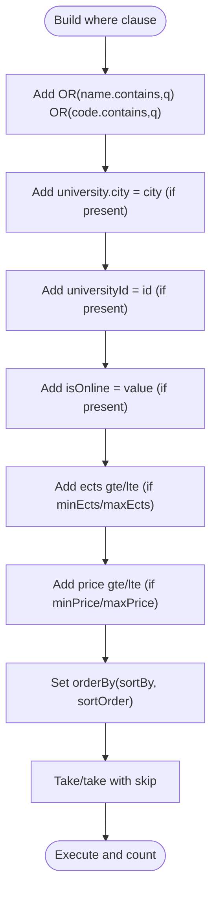

# Course Search and Discovery

<cite>
**Referenced Files in This Document**
- [search-parser.service.ts](file://apps/api/src/modules/course/search-parser.service.ts)
- [course.controller.ts](file://apps/api/src/modules/course/course.controller.ts)
- [course.service.ts](file://apps/api/src/modules/course/course.service.ts)
- [course.dto.ts](file://apps/api/src/modules/course/course.dto.ts)
- [search-log.service.ts](file://apps/api/src/modules/search-log/search-log.service.ts)
- [search-log.controller.ts](file://apps/api/src/modules/search-log/search-log.controller.ts)
- [search-bar.tsx](file://apps/web/components/layout/search-bar.tsx)
- [search-filters.tsx](file://apps/web/components/layout/search-filters.tsx)
- [search-history/page.tsx](file://apps/web/app/dashboard/student/search-history/page.tsx)
- [api.ts](file://apps/web/lib/api.ts)
- [schema.prisma](file://apps/api/prisma/schema.prisma)
- [main.ts](file://apps/api/src/main.ts)
- [app.module.ts](file://apps/api/src/app.module.ts)
- [search-parser.service.spec.ts](file://apps/api/src/modules/course/search-parser.service.spec.ts)
</cite>

## Table of Contents
1. [Introduction](#introduction)
2. [Project Structure](#project-structure)
3. [Core Components](#core-components)
4. [Architecture Overview](#architecture-overview)
5. [Detailed Component Analysis](#detailed-component-analysis)
6. [Dependency Analysis](#dependency-analysis)
7. [Performance Considerations](#performance-considerations)
8. [Troubleshooting Guide](#troubleshooting-guide)
9. [Conclusion](#conclusion)
10. [Appendices](#appendices)

## Introduction
This document explains the course search and discovery system, focusing on the natural language processing (NLP) pipeline that parses Turkish search queries into structured filters, the search algorithm, and the integration between manual query parameters and automatic parsing. It also covers precedence rules, fallback mechanisms, examples of complex queries, filter combinations, result ranking, and the search logging/analytics integration.

## Project Structure
The search system spans both the API (NestJS) and the Web (Next.js) layers:
- API layer handles query parsing, search execution, and analytics logging.
- Web layer provides the UI for free-text search, manual filters, and search history.

**Diagram sources**
- [search-bar.tsx](file://apps/web/components/layout/search-bar.tsx#L1-L94)
- [search-filters.tsx](file://apps/web/components/layout/search-filters.tsx#L1-L248)
- [search-history/page.tsx](file://apps/web/app/dashboard/student/search-history/page.tsx#L1-L123)
- [api.ts](file://apps/web/lib/api.ts#L1-L378)
- [course.controller.ts](file://apps/api/src/modules/course/course.controller.ts#L1-L148)
- [search-parser.service.ts](file://apps/api/src/modules/course/search-parser.service.ts#L1-L283)
- [course.service.ts](file://apps/api/src/modules/course/course.service.ts#L1-L310)
- [search-log.service.ts](file://apps/api/src/modules/search-log/search-log.service.ts#L1-L116)
- [search-log.controller.ts](file://apps/api/src/modules/search-log/search-log.controller.ts#L1-L42)
- [course.dto.ts](file://apps/api/src/modules/course/course.dto.ts#L1-L84)
- [schema.prisma](file://apps/api/prisma/schema.prisma#L1-L183)

**Section sources**
- [main.ts](file://apps/api/src/main.ts#L1-L34)
- [app.module.ts](file://apps/api/src/app.module.ts#L1-L49)

## Core Components
- Natural Language Parser: Extracts city, online/offline, credit (AKTS), price filters, and course name from Turkish text.
- Search Controller: Merges manual query parameters with parsed filters, applies precedence rules, and delegates to the service.
- Course Service: Builds dynamic Prisma queries, applies filters, paginates, sorts, and logs search analytics.
- Search Log Service: Persists search events and provides analytics endpoints for administrators.
- Web UI: Provides live search, manual filters, and search history.

**Section sources**
- [search-parser.service.ts](file://apps/api/src/modules/course/search-parser.service.ts#L1-L283)
- [course.controller.ts](file://apps/api/src/modules/course/course.controller.ts#L1-L148)
- [course.service.ts](file://apps/api/src/modules/course/course.service.ts#L1-L310)
- [search-log.service.ts](file://apps/api/src/modules/search-log/search-log.service.ts#L1-L116)
- [search-bar.tsx](file://apps/web/components/layout/search-bar.tsx#L1-L94)
- [search-filters.tsx](file://apps/web/components/layout/search-filters.tsx#L1-L248)
- [search-history/page.tsx](file://apps/web/app/dashboard/student/search-history/page.tsx#L1-L123)

## Architecture Overview
The search flow integrates UI-driven parameters with NLP parsing and database-backed filtering.

**Diagram sources**
- [course.controller.ts](file://apps/api/src/modules/course/course.controller.ts#L49-L75)
- [search-parser.service.ts](file://apps/api/src/modules/course/search-parser.service.ts#L116-L144)
- [course.service.ts](file://apps/api/src/modules/course/course.service.ts#L31-L133)
- [search-log.service.ts](file://apps/api/src/modules/search-log/search-log.service.ts#L25-L35)
- [schema.prisma](file://apps/api/prisma/schema.prisma#L124-L138)

## Detailed Component Analysis

### Natural Language Processing Pipeline (Turkish)
The parser converts Turkish natural language into structured filters. It:
- Normalizes Turkish characters and case.
- Detects city names among 81 Turkish provinces.
- Extracts AKTS credit ranges or single values.
- Extracts price ranges, “below X TL”, and “above X TL” expressions.
- Detects online vs. face-to-face keywords.
- Extracts the remaining course name after removing parsed tokens.

**Diagram sources**
- [search-parser.service.ts](file://apps/api/src/modules/course/search-parser.service.ts#L116-L144)
- [search-parser.service.ts](file://apps/api/src/modules/course/search-parser.service.ts#L147-L281)

Key behaviors:
- City detection uses word-boundary-aware regex against a canonical list.
- Credit detection supports “X-Y kredi/ects” and “Z kredi/ects”.
- Price detection supports “TL below/above” and “X–Y TL” patterns.
- Online/offline detection uses keyword sets; explicit offline overrides online.
- Course name extraction removes detected tokens and stop words.

**Section sources**
- [search-parser.service.ts](file://apps/api/src/modules/course/search-parser.service.ts#L1-L283)
- [search-parser.service.spec.ts](file://apps/api/src/modules/course/search-parser.service.spec.ts#L1-L70)

### Search Algorithm and Precedence Rules
The controller merges manual query parameters with parsed filters:
- Manual parameters take precedence over parsed values.
- Only missing fields are filled by the parser.
- Online filter is normalized to string “true”/“false” before merging.

**Diagram sources**
- [course.controller.ts](file://apps/api/src/modules/course/course.controller.ts#L50-L75)

Precedence and fallback:
- Manual city/isOnline/minEcts/maxEcts/minPrice/maxPrice override parser results.
- If q yields a non-empty course name, it replaces DTO.q.
- If q is empty or invalid, parsing returns an empty object; manual params alone are used.

**Section sources**
- [course.controller.ts](file://apps/api/src/modules/course/course.controller.ts#L50-L75)
- [course.dto.ts](file://apps/api/src/modules/course/course.dto.ts#L66-L84)

### Filtering and Ranking
The service constructs a Prisma query dynamically:
- Text search matches course name or code (case-insensitive).
- City filter targets the associated university’s city.
- Online/offline filter is applied directly.
- AKTS and price ranges use gte/lte conditions.
- Sorting is configurable via sortBy and sortOrder; defaults to name ascending.
- Pagination is enforced with a maximum limit.

**Diagram sources**
- [course.service.ts](file://apps/api/src/modules/course/course.service.ts#L31-L101)

**Section sources**
- [course.service.ts](file://apps/api/src/modules/course/course.service.ts#L1-L310)
- [course.dto.ts](file://apps/api/src/modules/course/course.dto.ts#L66-L84)

### Search Logging and Analytics
Each search triggers a log entry with:
- searchQuery (original query text)
- filters (JSON of applied filters)
- resultCount (total matched)
- ipHash (anonymous IP)
- userAgent (browser/device info)

Admin endpoints expose:
- Overview statistics
- Popular searches
- Daily search statistics

**Diagram sources**
- [course.service.ts](file://apps/api/src/modules/course/course.service.ts#L104-L122)
- [search-log.service.ts](file://apps/api/src/modules/search-log/search-log.service.ts#L25-L35)
- [schema.prisma](file://apps/api/prisma/schema.prisma#L124-L138)

Admin analytics:
- Overview: total searches, courses, universities, today’s searches.
- Popular searches: grouped by query with counts.
- Daily stats: grouped by date with counts and average results.

**Section sources**
- [search-log.service.ts](file://apps/api/src/modules/search-log/search-log.service.ts#L37-L114)
- [search-log.controller.ts](file://apps/api/src/modules/search-log/search-log.controller.ts#L1-L42)

### Web UI Integration
- Live search bar debounces input and navigates to the search page with q appended.
- Manual filters (city, online/offline, AKTS range, price range) update URL parameters.
- Search history page reconstructs URLs from stored logs for quick re-execution.

**Diagram sources**
- [search-bar.tsx](file://apps/web/components/layout/search-bar.tsx#L31-L46)
- [search-filters.tsx](file://apps/web/components/layout/search-filters.tsx#L40-L72)
- [search-history/page.tsx](file://apps/web/app/dashboard/student/search-history/page.tsx#L23-L34)

**Section sources**
- [search-bar.tsx](file://apps/web/components/layout/search-bar.tsx#L1-L94)
- [search-filters.tsx](file://apps/web/components/layout/search-filters.tsx#L1-L248)
- [search-history/page.tsx](file://apps/web/app/dashboard/student/search-history/page.tsx#L1-L123)
- [api.ts](file://apps/web/lib/api.ts#L63-L76)

## Dependency Analysis
- CourseController depends on SearchParserService and CourseService.
- CourseService depends on PrismaService and SearchLogService.
- SearchLogController depends on SearchLogService.
- Web components depend on the API client to call backend endpoints.

**Diagram sources**
- [course.controller.ts](file://apps/api/src/modules/course/course.controller.ts#L36-L41)
- [course.service.ts](file://apps/api/src/modules/course/course.service.ts#L18-L25)
- [search-log.controller.ts](file://apps/api/src/modules/search-log/search-log.controller.ts#L7-L18)
- [schema.prisma](file://apps/api/prisma/schema.prisma#L124-L138)

**Section sources**
- [app.module.ts](file://apps/api/src/app.module.ts#L30-L45)

## Performance Considerations
- Indexing: The schema defines indexes on name, code, universityId, isOnline, and composite fields to optimize common search patterns.
- Pagination: Service enforces a maximum page size to cap resource usage.
- Case-insensitive text search leverages database-native insensitive matching.
- Logging is performed asynchronously and failures are caught to avoid impacting search results.

[No sources needed since this section provides general guidance]

## Troubleshooting Guide
Common issues and resolutions:
- Empty or whitespace-only query: Parser returns an empty object; ensure manual filters are set.
- Conflicting online/offline terms: Offline keywords override online; ensure query intent is clear.
- Unexpected city matches: Ensure city spelling aligns with canonical list keys.
- Price/credit ranges: Use supported formats (“X–Y kredi/TL”, “Z TL altı/üstü”) for reliable parsing.
- Search logs not appearing: Verify SearchLogService creation succeeds and database connectivity is healthy.

**Section sources**
- [search-parser.service.ts](file://apps/api/src/modules/course/search-parser.service.ts#L116-L144)
- [course.service.ts](file://apps/api/src/modules/course/course.service.ts#L104-L122)
- [search-parser.service.spec.ts](file://apps/api/src/modules/course/search-parser.service.spec.ts#L1-L70)

## Conclusion
The system combines a robust Turkish NLP parser with flexible manual filters and a high-performance search engine. Manual parameters consistently take precedence, while the parser enriches queries with structured filters. Comprehensive logging enables academic and product analytics, and the UI provides a smooth search experience with live updates and history.

[No sources needed since this section summarizes without analyzing specific files]

## Appendices

### Example Queries and Combinations
- “Online matematik” → isOnline=true, q=matematik
- “İzmir’de 3-6 kredi 2000 TL üstü fizik” → city=İzmir, minEcts=3, maxEcts=6, minPrice=2000, q=fizik
- “Yüz yüze programlama İstanbul” → isOnline=false, city=İstanbul, q=programlama
- “1500–2500 TL kredi” → minPrice=1500, maxPrice=2500, q=kredi

[No sources needed since this section provides illustrative examples]