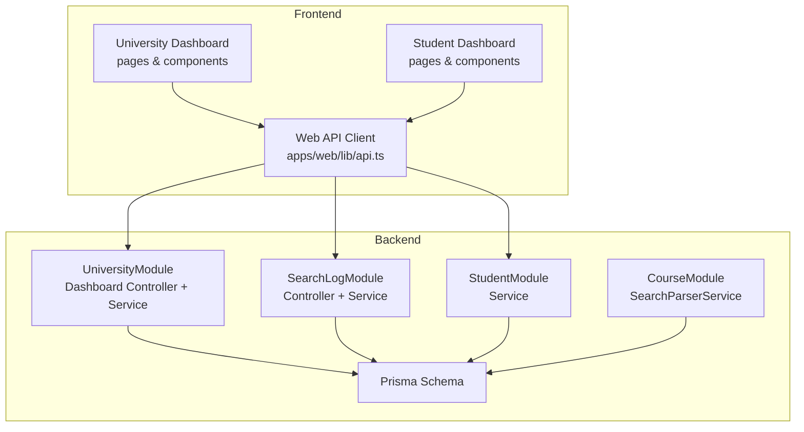
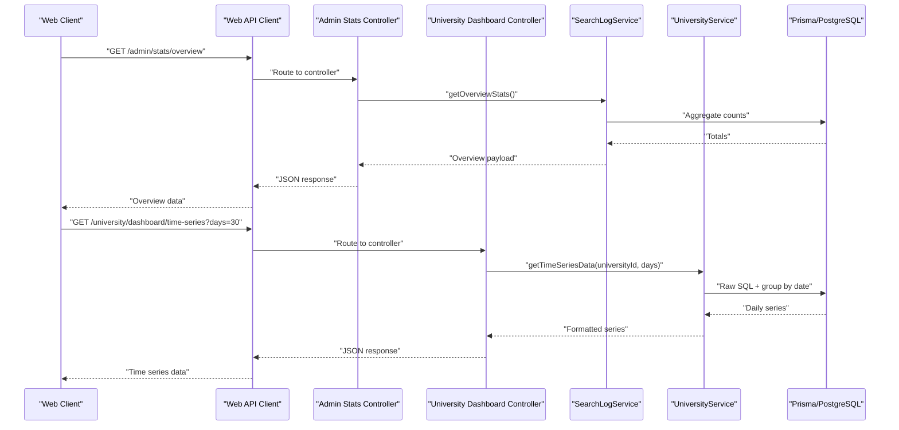
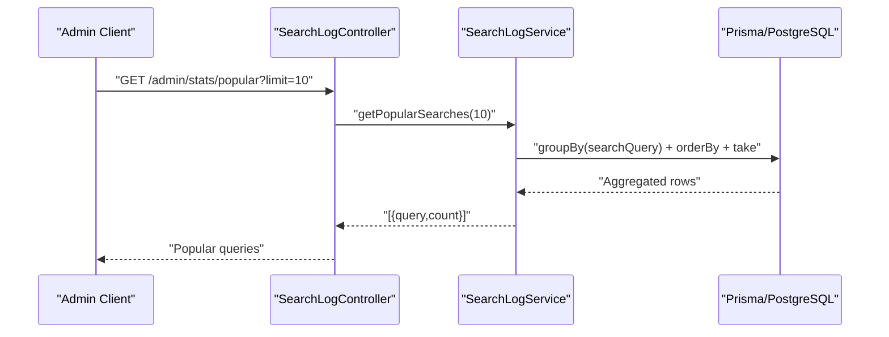
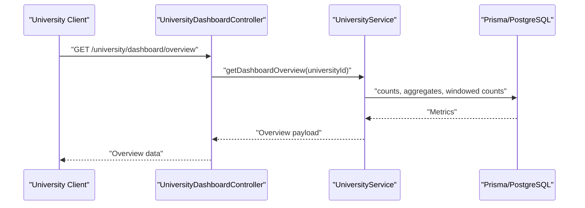
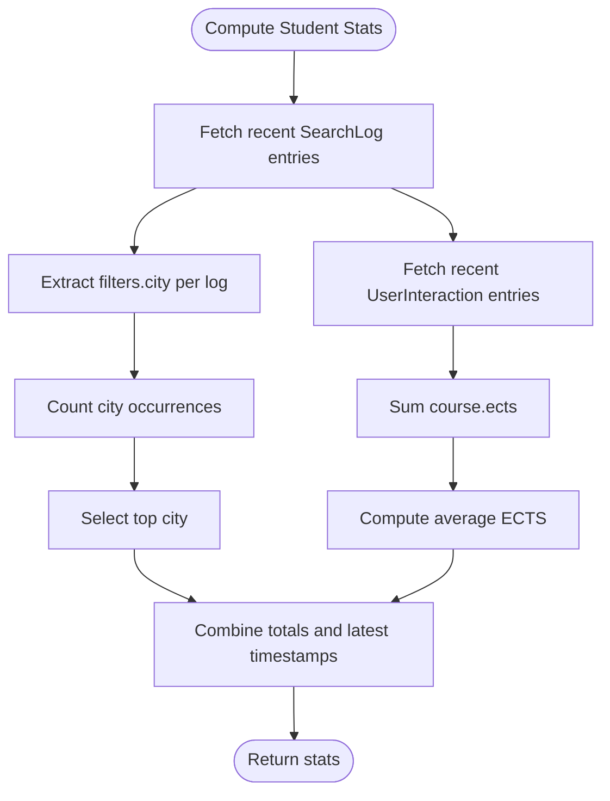
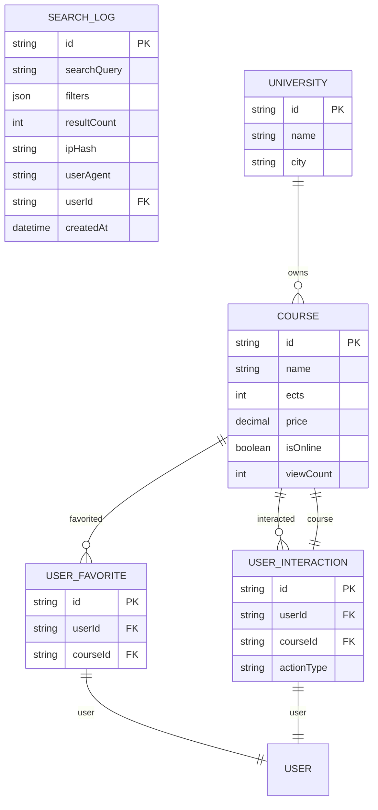
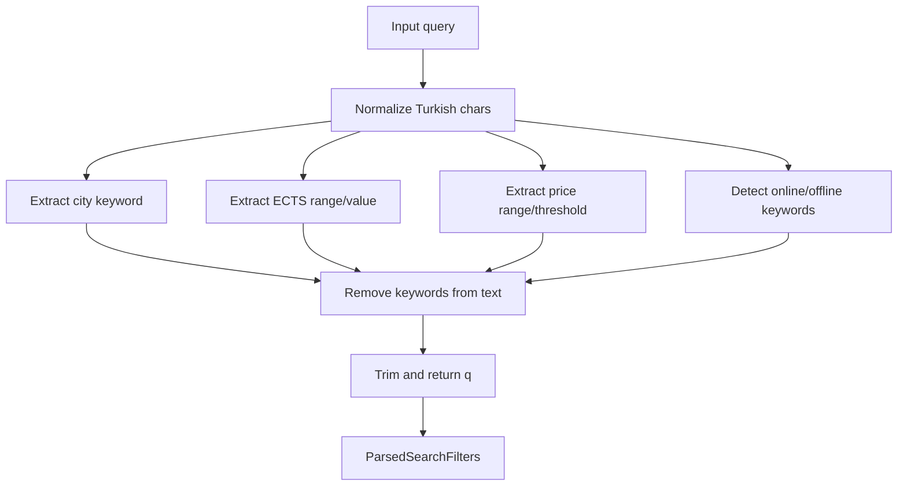
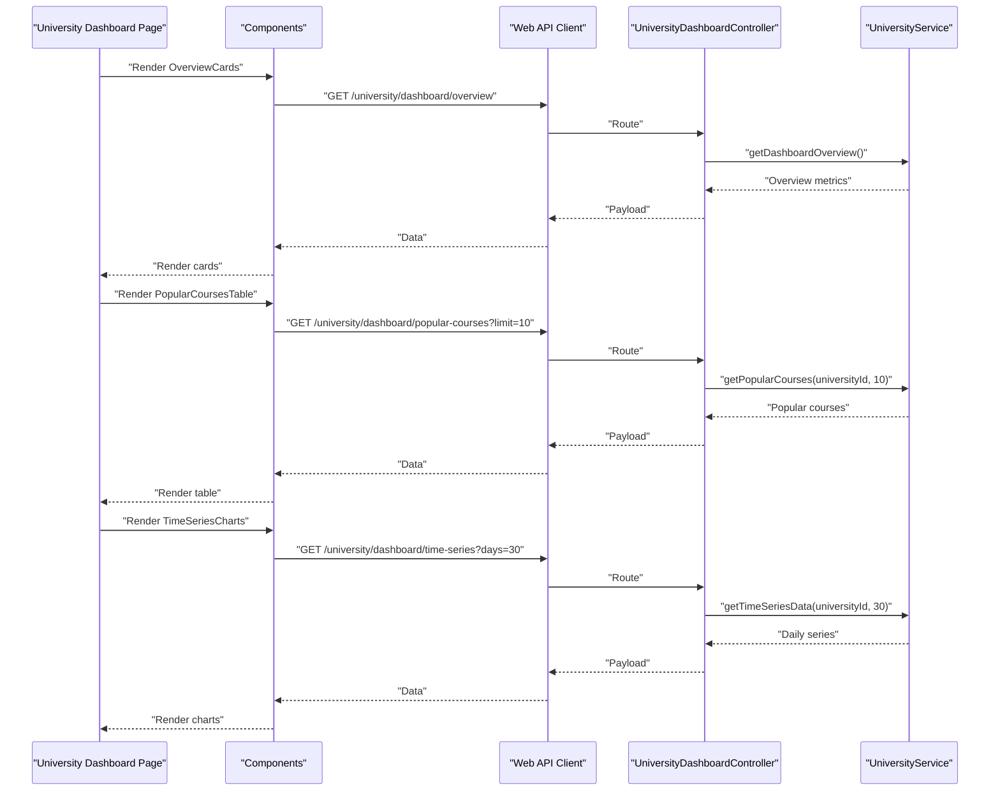
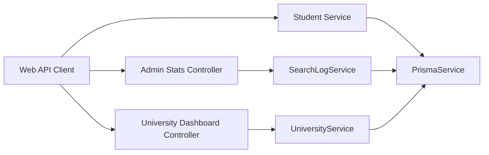

# Search and Analytics

<cite>
**Referenced Files in This Document**
- [search-log.controller.ts](file://apps/api/src/modules/search-log/search-log.controller.ts)
- [search-log.service.ts](file://apps/api/src/modules/search-log/search-log.service.ts)
- [search-log.module.ts](file://apps/api/src/modules/search-log/search-log.module.ts)
- [university-dashboard.controller.ts](file://apps/api/src/modules/university/university-dashboard.controller.ts)
- [university.service.ts](file://apps/api/src/modules/university/university.service.ts)
- [student.service.ts](file://apps/api/src/modules/student/student.service.ts)
- [search-parser.service.ts](file://apps/api/src/modules/course/search-parser.service.ts)
- [schema.prisma](file://apps/api/prisma/schema.prisma)
- [api.ts](file://apps/web/lib/api.ts)
- [PersonalAnalytics.tsx](file://apps/web/app/dashboard/student/components/PersonalAnalytics.tsx)
- [PopularCoursesTable.tsx](file://apps/web/app/dashboard/university/components/PopularCoursesTable.tsx)
- [TimeSeriesCharts.tsx](file://apps/web/app/dashboard/university/components/TimeSeriesCharts.tsx)
- [OverviewCards.tsx](file://apps/web/app/dashboard/university/components/OverviewCards.tsx)
</cite>

## Table of Contents
1. [Introduction](#introduction)
2. [Project Structure](#project-structure)
3. [Core Components](#core-components)
4. [Architecture Overview](#architecture-overview)
5. [Detailed Component Analysis](#detailed-component-analysis)
6. [Dependency Analysis](#dependency-analysis)
7. [Performance Considerations](#performance-considerations)
8. [Troubleshooting Guide](#troubleshooting-guide)
9. [Conclusion](#conclusion)
10. [Appendices](#appendices)

## Introduction
This document provides comprehensive API documentation for search log and analytics endpoints. It covers:
- Search log management and ingestion
- Analytics processing for administrators and universities
- Popular course tracking and user behavior analysis
- Data aggregation patterns, performance metrics, and usage analytics
- Practical analytics workflows and reporting scenarios

Endpoints documented here enable:
- Admin-level overview, popular queries, and daily search statistics
- University-level dashboards: overview cards, popular courses, time series trends, and course health
- Student-level personal analytics derived from search history and interactions

## Project Structure
The analytics and search log system spans backend NestJS modules and frontend Next.js pages/components:
- Backend modules: search-log, university, student, course (parser), prisma schema
- Frontend: dashboard pages and reusable components for analytics visualization

**Diagram sources**
- [search-log.controller.ts](file://apps/api/src/modules/search-log/search-log.controller.ts#L14-L41)
- [search-log.service.ts](file://apps/api/src/modules/search-log/search-log.service.ts#L18-L115)
- [university-dashboard.controller.ts](file://apps/api/src/modules/university/university-dashboard.controller.ts#L25-L80)
- [university.service.ts](file://apps/api/src/modules/university/university.service.ts#L162-L397)
- [student.service.ts](file://apps/api/src/modules/student/student.service.ts#L48-L100)
- [search-parser.service.ts](file://apps/api/src/modules/course/search-parser.service.ts#L106-L144)
- [schema.prisma](file://apps/api/prisma/schema.prisma#L124-L138)
- [api.ts](file://apps/web/lib/api.ts#L120-L166)

**Section sources**
- [search-log.controller.ts](file://apps/api/src/modules/search-log/search-log.controller.ts#L1-L42)
- [university-dashboard.controller.ts](file://apps/api/src/modules/university/university-dashboard.controller.ts#L1-L81)
- [student.service.ts](file://apps/api/src/modules/student/student.service.ts#L1-L292)
- [search-parser.service.ts](file://apps/api/src/modules/course/search-parser.service.ts#L1-L283)
- [schema.prisma](file://apps/api/prisma/schema.prisma#L124-L138)
- [api.ts](file://apps/web/lib/api.ts#L120-L166)

## Core Components
- SearchLogModule: Provides admin endpoints for overview, popular searches, and daily stats; persists search events with filters and metadata.
- UniversityModule: Provides university-specific analytics: overview cards, popular courses, time series, and course health.
- StudentModule: Provides personal analytics derived from search history and interactions.
- CourseModule: Provides natural language parsing to extract filters from free-text queries.
- Prisma Schema: Defines SearchLog, Course, UserFavorite, UserInteraction models and indexes supporting analytics.

Key responsibilities:
- Admin analytics: total searches, platform totals, daily aggregates, and popular queries
- University analytics: counts, trends, conversions, and health indicators
- Student analytics: personal preferences and engagement metrics
- Parsing: extracting city, ECTS, price, and online/offline intent from queries

**Section sources**
- [search-log.controller.ts](file://apps/api/src/modules/search-log/search-log.controller.ts#L14-L41)
- [search-log.service.ts](file://apps/api/src/modules/search-log/search-log.service.ts#L18-L115)
- [university-dashboard.controller.ts](file://apps/api/src/modules/university/university-dashboard.controller.ts#L25-L80)
- [university.service.ts](file://apps/api/src/modules/university/university.service.ts#L162-L397)
- [student.service.ts](file://apps/api/src/modules/student/student.service.ts#L48-L100)
- [search-parser.service.ts](file://apps/api/src/modules/course/search-parser.service.ts#L106-L144)
- [schema.prisma](file://apps/api/prisma/schema.prisma#L124-L138)

## Architecture Overview
The analytics pipeline integrates frontend requests, backend controllers/services, and database aggregations.

**Diagram sources**
- [search-log.controller.ts](file://apps/api/src/modules/search-log/search-log.controller.ts#L21-L24)
- [search-log.service.ts](file://apps/api/src/modules/search-log/search-log.service.ts#L93-L114)
- [university-dashboard.controller.ts](file://apps/api/src/modules/university/university-dashboard.controller.ts#L56-L69)
- [university.service.ts](file://apps/api/src/modules/university/university.service.ts#L332-L397)
- [api.ts](file://apps/web/lib/api.ts#L147-L152)

## Detailed Component Analysis

### Admin Search Analytics Endpoints
- Endpoint: GET /api/admin/stats/overview
  - Returns total searches, total courses, total universities, and today’s search volume.
  - Uses concurrent counting for performance.
- Endpoint: GET /api/admin/stats/popular?limit=N
  - Groups by searchQuery and returns top N queries by frequency.
- Endpoint: GET /api/admin/stats/daily?days=N
  - Aggregates daily counts and average results over N days.

**Diagram sources**
- [search-log.controller.ts](file://apps/api/src/modules/search-log/search-log.controller.ts#L27-L32)
- [search-log.service.ts](file://apps/api/src/modules/search-log/search-log.service.ts#L46-L59)

**Section sources**
- [search-log.controller.ts](file://apps/api/src/modules/search-log/search-log.controller.ts#L20-L40)
- [search-log.service.ts](file://apps/api/src/modules/search-log/search-log.service.ts#L37-L114)

### University Dashboard Analytics
- Endpoint: GET /university/dashboard/overview
  - Computes total courses, new courses last month, total and recent views, favorites, and application clicks; includes percentage changes.
- Endpoint: GET /university/dashboard/popular-courses?limit=N
  - Returns popular courses with viewCount, favoriteCount, applicationClicks, and conversion rate.
- Endpoint: GET /university/dashboard/time-series?days=N
  - Returns daily series for views, favorites, and applications using raw SQL grouped by date.
- Endpoint: GET /university/dashboard/course-stats
  - Computes course health stats (with/without URLs, dates, online/onsite) and a health score.

**Diagram sources**
- [university-dashboard.controller.ts](file://apps/api/src/modules/university/university-dashboard.controller.ts#L31-L38)
- [university.service.ts](file://apps/api/src/modules/university/university.service.ts#L162-L278)

**Section sources**
- [university-dashboard.controller.ts](file://apps/api/src/modules/university/university-dashboard.controller.ts#L31-L79)
- [university.service.ts](file://apps/api/src/modules/university/university.service.ts#L162-L397)

### Student Personal Analytics
- Endpoint: GET /student/stats
  - Returns total searches, favorites, interactions, top searched city, average ECTS interest, and last search date.
- Data sources: SearchLog (filters.city) and UserInteraction (course.ects).

**Diagram sources**
- [student.service.ts](file://apps/api/src/modules/student/student.service.ts#L48-L100)

**Section sources**
- [student.service.ts](file://apps/api/src/modules/student/student.service.ts#L48-L100)

### Search Event Logging and Schema
- SearchLog model captures:
  - searchQuery, filters (JSON), resultCount, ipHash, userAgent, optional userId
  - Indexes on createdAt, searchQuery, userId support analytics queries
- SearchLogService.log persists new search events with provided input.

**Diagram sources**
- [schema.prisma](file://apps/api/prisma/schema.prisma#L124-L138)
- [schema.prisma](file://apps/api/prisma/schema.prisma#L87-L122)
- [schema.prisma](file://apps/api/prisma/schema.prisma#L156-L168)
- [schema.prisma](file://apps/api/prisma/schema.prisma#L170-L182)
- [schema.prisma](file://apps/api/prisma/schema.prisma#L35-L58)

**Section sources**
- [search-log.service.ts](file://apps/api/src/modules/search-log/search-log.service.ts#L24-L35)
- [schema.prisma](file://apps/api/prisma/schema.prisma#L124-L138)

### Natural Language Search Parsing
- SearchParserService converts Turkish natural language queries into structured filters:
  - city extraction from 81 Turkish cities
  - ECTS range or single value
  - price range or thresholds (under/over)
  - online/offline intent
  - remaining course name text
- Used to enrich SearchLog.filters for richer analytics.

**Diagram sources**
- [search-parser.service.ts](file://apps/api/src/modules/course/search-parser.service.ts#L116-L144)
- [search-parser.service.ts](file://apps/api/src/modules/course/search-parser.service.ts#L164-L281)

**Section sources**
- [search-parser.service.ts](file://apps/api/src/modules/course/search-parser.service.ts#L1-L283)

### Frontend Analytics Workflows
- University Dashboard:
  - Overview cards: total courses, views, favorites, application clicks with recent changes
  - Popular courses table: viewCount, favoriteCount, applicationClicks, conversionRate
  - Time series charts: daily views, favorites, applications
- Student Dashboard:
  - Personal analytics: top searched city and average ECTS interest

**Diagram sources**
- [api.ts](file://apps/web/lib/api.ts#L120-L166)
- [university-dashboard.controller.ts](file://apps/api/src/modules/university/university-dashboard.controller.ts#L31-L79)
- [university.service.ts](file://apps/api/src/modules/university/university.service.ts#L162-L397)
- [OverviewCards.tsx](file://apps/web/app/dashboard/university/components/OverviewCards.tsx#L37-L47)
- [PopularCoursesTable.tsx](file://apps/web/app/dashboard/university/components/PopularCoursesTable.tsx#L42-L52)
- [TimeSeriesCharts.tsx](file://apps/web/app/dashboard/university/components/TimeSeriesCharts.tsx#L33-L43)

**Section sources**
- [api.ts](file://apps/web/lib/api.ts#L120-L166)
- [OverviewCards.tsx](file://apps/web/app/dashboard/university/components/OverviewCards.tsx#L37-L131)
- [PopularCoursesTable.tsx](file://apps/web/app/dashboard/university/components/PopularCoursesTable.tsx#L42-L140)
- [TimeSeriesCharts.tsx](file://apps/web/app/dashboard/university/components/TimeSeriesCharts.tsx#L33-L115)
- [PersonalAnalytics.tsx](file://apps/web/app/dashboard/student/components/PersonalAnalytics.tsx#L16-L45)

## Dependency Analysis
- Controllers depend on services for business logic.
- Services depend on Prisma for data access and aggregation.
- Frontend components depend on the Web API client for data fetching.
- SearchLogService depends on Prisma indexes for efficient grouping and filtering.
- UniversityService uses raw SQL for time series to optimize aggregation.

**Diagram sources**
- [search-log.controller.ts](file://apps/api/src/modules/search-log/search-log.controller.ts#L14-L18)
- [university-dashboard.controller.ts](file://apps/api/src/modules/university/university-dashboard.controller.ts#L25-L29)
- [student.service.ts](file://apps/api/src/modules/student/student.service.ts#L19)
- [search-log.service.ts](file://apps/api/src/modules/search-log/search-log.service.ts#L22)
- [university.service.ts](file://apps/api/src/modules/university/university.service.ts#L20)
- [api.ts](file://apps/web/lib/api.ts#L120-L166)

**Section sources**
- [search-log.controller.ts](file://apps/api/src/modules/search-log/search-log.controller.ts#L14-L18)
- [university-dashboard.controller.ts](file://apps/api/src/modules/university/university-dashboard.controller.ts#L25-L29)
- [student.service.ts](file://apps/api/src/modules/student/student.service.ts#L19)
- [search-log.service.ts](file://apps/api/src/modules/search-log/search-log.service.ts#L22)
- [university.service.ts](file://apps/api/src/modules/university/university.service.ts#L20)
- [api.ts](file://apps/web/lib/api.ts#L120-L166)

## Performance Considerations
- Indexes on SearchLog (createdAt, searchQuery, userId) support fast grouping and filtering for popular queries and daily stats.
- Concurrent aggregations in admin overview reduce round-trips.
- Time series queries use raw SQL with GROUP BY date to minimize ORM overhead.
- Frontend components pre-fetch and format data for charts; pagination and limits (popular courses, daily series) keep payloads small.

[No sources needed since this section provides general guidance]

## Troubleshooting Guide
- Authentication and roles:
  - Admin endpoints require JWT + ADMIN role.
  - University endpoints require JWT + UNIVERSITY role.
- Missing universityId:
  - University endpoints throw forbidden if universityId is missing from the JWT.
- Empty or partial analytics:
  - Ensure SearchLog entries exist and filters contain city/ECTS/price keys for accurate parsing and analytics.
- Time series gaps:
  - Daily series are generated for N days; missing dates indicate zero activity on those days.

**Section sources**
- [search-log.controller.ts](file://apps/api/src/modules/search-log/search-log.controller.ts#L14-L18)
- [university-dashboard.controller.ts](file://apps/api/src/modules/university/university-dashboard.controller.ts#L32-L37)
- [university.service.ts](file://apps/api/src/modules/university/university.service.ts#L332-L397)

## Conclusion
The system provides a robust foundation for search analytics and user behavior insights:
- Admins gain platform-wide visibility via overview, popular queries, and daily trends.
- Universities obtain actionable dashboards for course performance, engagement, and health.
- Students benefit from personalized analytics derived from their own search and interaction history.
- The design leverages indexing, concurrent aggregations, and raw SQL to maintain performance at scale.

[No sources needed since this section summarizes without analyzing specific files]

## Appendices

### API Definitions

- Admin Analytics
  - GET /api/admin/stats/overview
    - Query params: none
    - Response: totalSearches, totalCourses, totalUniversities, todaySearches
  - GET /api/admin/stats/popular?limit=N
    - Query params: limit (optional, default 10)
    - Response: array of { query, count }
  - GET /api/admin/stats/daily?days=N
    - Query params: days (optional, default 30)
    - Response: array of { date, searchCount, avgResults }

- University Dashboard
  - GET /university/dashboard/overview
    - Response: overview metrics including counts and percentage changes
  - GET /university/dashboard/popular-courses?limit=N
    - Response: array of courses with viewCount, favoriteCount, applicationClicks, conversionRate
  - GET /university/dashboard/time-series?days=N
    - Response: { dailyViews, dailyFavorites, dailyApplications }
  - GET /university/dashboard/course-stats
    - Response: health stats and healthScore

- Student Analytics
  - GET /student/stats
    - Response: totalSearches, totalFavorites, totalInteractions, topSearchedCity, avgEctsInterest, lastSearchDate

**Section sources**
- [search-log.controller.ts](file://apps/api/src/modules/search-log/search-log.controller.ts#L21-L40)
- [university-dashboard.controller.ts](file://apps/api/src/modules/university/university-dashboard.controller.ts#L31-L79)
- [api.ts](file://apps/web/lib/api.ts#L120-L166)