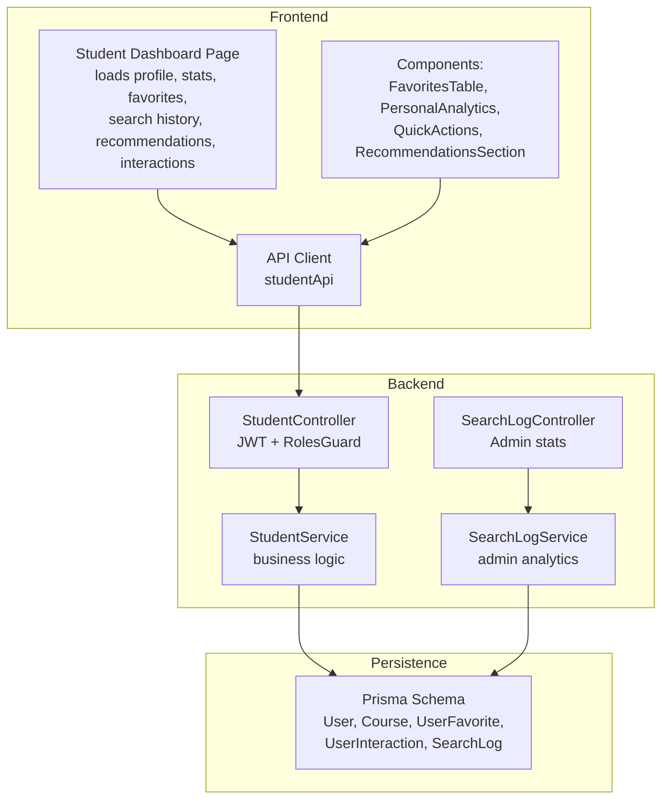
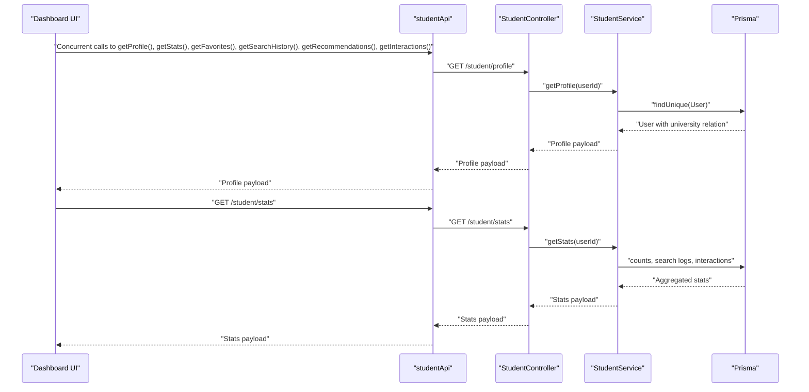
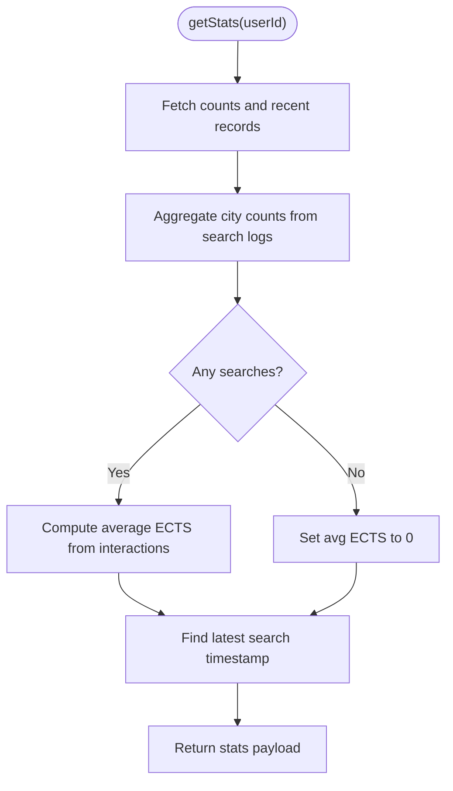
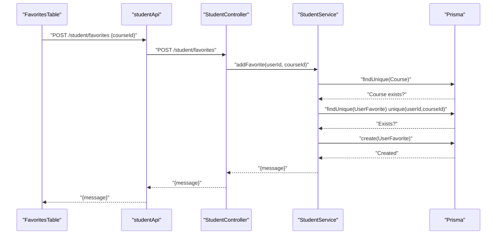
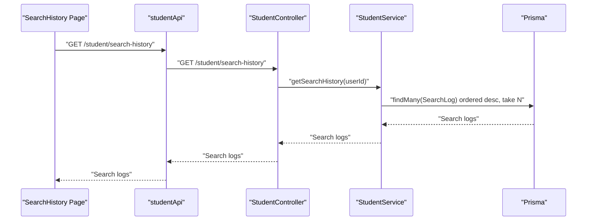
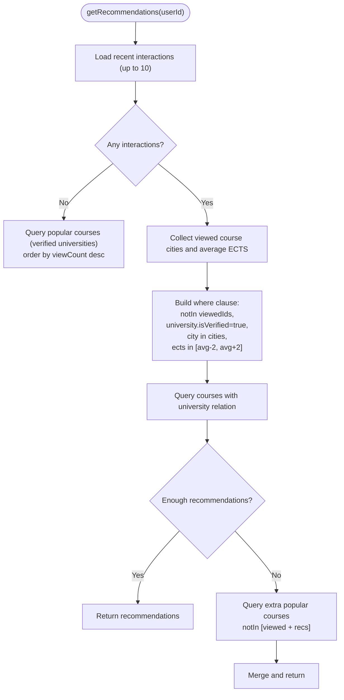
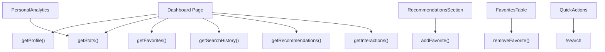
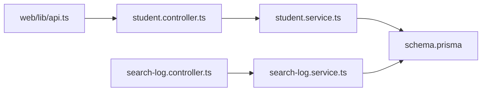

# Student Features

<cite>
**Referenced Files in This Document**
- [student.controller.ts](file://apps/api/src/modules/student/student.controller.ts)
- [student.service.ts](file://apps/api/src/modules/student/student.service.ts)
- [student.dto.ts](file://apps/api/src/modules/student/student.dto.ts)
- [search-log.controller.ts](file://apps/api/src/modules/search-log/search-log.controller.ts)
- [search-log.service.ts](file://apps/api/src/modules/search-log/search-log.service.ts)
- [api.ts](file://apps/web/lib/api.ts)
- [page.tsx](file://apps/web/app/dashboard/student/page.tsx)
- [FavoritesTable.tsx](file://apps/web/app/dashboard/student/components/FavoritesTable.tsx)
- [PersonalAnalytics.tsx](file://apps/web/app/dashboard/student/components/PersonalAnalytics.tsx)
- [QuickActions.tsx](file://apps/web/app/dashboard/student/components/QuickActions.tsx)
- [RecommendationsSection.tsx](file://apps/web/app/dashboard/student/components/RecommendationsSection.tsx)
- [search-history/page.tsx](file://apps/web/app/dashboard/student/search-history/page.tsx)
- [schema.prisma](file://apps/api/prisma/schema.prisma)
- [20260216062824_add_student_features/migration.sql](file://apps/api/prisma/migrations/20260216062824_add_student_features/migration.sql)
- [20260216072732_add_userfavorite_courseid_index/migration.sql](file://apps/api/prisma/migrations/20260216072732_add_userfavorite_courseid_index/migration.sql)
</cite>

## Table of Contents
1. [Introduction](#introduction)
2. [Project Structure](#project-structure)
3. [Core Components](#core-components)
4. [Architecture Overview](#architecture-overview)
5. [Detailed Component Analysis](#detailed-component-analysis)
6. [Dependency Analysis](#dependency-analysis)
7. [Performance Considerations](#performance-considerations)
8. [Troubleshooting Guide](#troubleshooting-guide)
9. [Conclusion](#conclusion)
10. [Appendices](#appendices)

## Introduction
This document provides comprehensive API documentation for student-specific endpoints powering the student dashboard. It covers dashboard data retrieval, favorites management, search history, and personalized recommendations. It also explains analytics schemas, course interaction tracking, preference management, recommendation algorithms, personalization logic, and data aggregation patterns. Practical workflows and personalization scenarios are included to help developers and product teams implement and extend the features effectively.

## Project Structure
The student feature spans backend NestJS modules and frontend Next.js pages and components:
- Backend: Student controller and service expose REST endpoints protected by JWT and role guards.
- Frontend: A dashboard page orchestrates multiple asynchronous data loads and renders analytics, favorites, recommendations, and search history.
- Persistence: Prisma models define the data schema for users, courses, favorites, interactions, and search logs.

**Diagram sources**
- [page.tsx](file://apps/web/app/dashboard/student/page.tsx#L33-L55)
- [api.ts](file://apps/web/lib/api.ts#L191-L284)
- [student.controller.ts](file://apps/api/src/modules/student/student.controller.ts#L31-L100)
- [student.service.ts](file://apps/api/src/modules/student/student.service.ts#L16-L292)
- [search-log.controller.ts](file://apps/api/src/modules/search-log/search-log.controller.ts#L14-L41)
- [search-log.service.ts](file://apps/api/src/modules/search-log/search-log.service.ts#L18-L116)
- [schema.prisma](file://apps/api/prisma/schema.prisma#L36-L182)

**Section sources**
- [student.controller.ts](file://apps/api/src/modules/student/student.controller.ts#L31-L100)
- [student.service.ts](file://apps/api/src/modules/student/student.service.ts#L16-L292)
- [api.ts](file://apps/web/lib/api.ts#L191-L284)
- [page.tsx](file://apps/web/app/dashboard/student/page.tsx#L21-L189)
- [schema.prisma](file://apps/api/prisma/schema.prisma#L36-L182)

## Core Components
- StudentController: Exposes student dashboard endpoints with role guard for STUDENT.
- StudentService: Implements analytics, favorites CRUD, search history, interactions, and recommendations.
- API Client (studentApi): Defines typed frontend calls to student endpoints.
- Frontend Dashboard: Orchestrates concurrent data loading and renders analytics, favorites, recommendations, and search history.
- Prisma Schema: Defines models and indexes for user preferences, favorites, interactions, and search logs.

Key responsibilities:
- Profile retrieval with university relationship.
- Statistics aggregation from search logs and interactions.
- Favorites CRUD with uniqueness constraints.
- Search history pagination.
- Interactions logging with action types.
- Recommendation engine using viewing patterns and university city/ECTS similarity.

**Section sources**
- [student.controller.ts](file://apps/api/src/modules/student/student.controller.ts#L31-L100)
- [student.service.ts](file://apps/api/src/modules/student/student.service.ts#L21-L292)
- [api.ts](file://apps/web/lib/api.ts#L191-L284)
- [page.tsx](file://apps/web/app/dashboard/student/page.tsx#L33-L55)
- [schema.prisma](file://apps/api/prisma/schema.prisma#L60-L182)

## Architecture Overview
The student dashboard follows a layered architecture:
- Presentation layer: Next.js page and components render UI and manage state.
- API layer: NestJS controller validates requests and delegates to service.
- Business logic: StudentService encapsulates analytics, favorites, interactions, and recommendations.
- Data access: Prisma ORM maps to PostgreSQL with appropriate indexes.

**Diagram sources**
- [page.tsx](file://apps/web/app/dashboard/student/page.tsx#L33-L55)
- [api.ts](file://apps/web/lib/api.ts#L191-L284)
- [student.controller.ts](file://apps/api/src/modules/student/student.controller.ts#L37-L86)
- [student.service.ts](file://apps/api/src/modules/student/student.service.ts#L21-L100)
- [schema.prisma](file://apps/api/prisma/schema.prisma#L60-L182)

## Detailed Component Analysis

### Student Endpoints
- GET /student/profile
  - Returns user profile with optional university relation.
  - Response shape includes identifiers, personal info, department, preferred cities, and university metadata.
- GET /student/stats
  - Aggregates total searches, favorites, interactions, top searched city, average ECTS interest, and last search date.
- GET /student/favorites
  - Returns favorite courses with university metadata, ordered by creation time.
- POST /student/favorites
  - Adds a course to favorites; validates course existence and uniqueness.
- DELETE /student/favorites/:courseId
  - Removes a favorite by composite unique key.
- GET /student/search-history
  - Returns recent search logs for the user.
- GET /student/interactions
  - Returns recent course interactions with course and university metadata.
- POST /student/interactions
  - Records a user interaction (VIEW, FAVORITE, APPLY) and increments course view count for VIEW.
- GET /student/recommendations
  - Returns personalized course recommendations based on recent interactions and popularity fallback.

Security and validation:
- All endpoints are protected by JWT and RolesGuard restricted to STUDENT.
- DTOs enforce courseId presence and actionType enum for interactions.

**Section sources**
- [student.controller.ts](file://apps/api/src/modules/student/student.controller.ts#L37-L100)
- [student.dto.ts](file://apps/api/src/modules/student/student.dto.ts#L6-L17)
- [student.service.ts](file://apps/api/src/modules/student/student.service.ts#L21-L292)
- [api.ts](file://apps/web/lib/api.ts#L191-L284)

### Analytics and Data Aggregation
- Top searched city: Derived from filters stored in search logs.
- Average ECTS interest: Computed from interactions’ associated course ECTS.
- Last search date: Most recent search log timestamp.
- Interaction types: VIEW, FAVORITE, APPLY; VIEW also updates course view count.

**Diagram sources**
- [student.service.ts](file://apps/api/src/modules/student/student.service.ts#L48-L100)

**Section sources**
- [student.service.ts](file://apps/api/src/modules/student/student.service.ts#L48-L100)

### Favorites Management
- Retrieve favorites with course and university relations.
- Add favorite with duplicate prevention via unique constraint.
- Remove favorite by unique composite key.

**Diagram sources**
- [FavoritesTable.tsx](file://apps/web/app/dashboard/student/components/FavoritesTable.tsx#L34-L49)
- [api.ts](file://apps/web/lib/api.ts#L226-L235)
- [student.controller.ts](file://apps/api/src/modules/student/student.controller.ts#L55-L68)
- [student.service.ts](file://apps/api/src/modules/student/student.service.ts#L121-L147)
- [schema.prisma](file://apps/api/prisma/schema.prisma#L156-L168)

**Section sources**
- [student.service.ts](file://apps/api/src/modules/student/student.service.ts#L102-L167)
- [FavoritesTable.tsx](file://apps/web/app/dashboard/student/components/FavoritesTable.tsx#L28-L49)

### Search History
- Endpoint: GET /student/search-history
- Pagination: Defaults to recent entries; frontend can adjust limits.
- UI: Dedicated page renders formatted search queries, applied filters, result counts, timestamps, and a “repeat search” link.

**Diagram sources**
- [search-history/page.tsx](file://apps/web/app/dashboard/student/search-history/page.tsx#L36-L46)
- [api.ts](file://apps/web/lib/api.ts#L237-L246)
- [student.controller.ts](file://apps/api/src/modules/student/student.controller.ts#L70-L74)
- [student.service.ts](file://apps/api/src/modules/student/student.service.ts#L169-L176)
- [schema.prisma](file://apps/api/prisma/schema.prisma#L124-L138)

**Section sources**
- [search-history/page.tsx](file://apps/web/app/dashboard/student/search-history/page.tsx#L36-L46)
- [student.service.ts](file://apps/api/src/modules/student/student.service.ts#L169-L176)

### Interactions and Recommendations
- Interactions endpoint: GET /student/interactions returns recent actions with course metadata.
- Interaction recording: POST /student/interactions supports VIEW, FAVORITE, APPLY. VIEW also increments course view count.
- Recommendations: GET /student/recommendations
  - If no interactions: returns popular courses by view count among verified universities.
  - Else: selects courses from the same cities as viewed courses and within ECTS bounds around the average ECTS of interactions. If insufficient results, fills with additional popular courses.

**Diagram sources**
- [student.service.ts](file://apps/api/src/modules/student/student.service.ts#L222-L290)

**Section sources**
- [student.controller.ts](file://apps/api/src/modules/student/student.controller.ts#L76-L99)
- [student.service.ts](file://apps/api/src/modules/student/student.service.ts#L178-L221)
- [student.service.ts](file://apps/api/src/modules/student/student.service.ts#L222-L290)

### Frontend Dashboard Components
- Dashboard page orchestrates concurrent data fetching and error handling.
- PersonalAnalytics displays top searched city and average ECTS interest.
- QuickActions provides shortcuts to search, favorites, and comparison.
- RecommendationsSection renders recommended courses with add-to-favorites and compare actions.
- FavoritesTable lists favorites, supports removal and compare selection.

**Diagram sources**
- [page.tsx](file://apps/web/app/dashboard/student/page.tsx#L33-L55)
- [PersonalAnalytics.tsx](file://apps/web/app/dashboard/student/components/PersonalAnalytics.tsx#L16-L45)
- [QuickActions.tsx](file://apps/web/app/dashboard/student/components/QuickActions.tsx#L9-L36)
- [RecommendationsSection.tsx](file://apps/web/app/dashboard/student/components/RecommendationsSection.tsx#L39-L54)
- [FavoritesTable.tsx](file://apps/web/app/dashboard/student/components/FavoritesTable.tsx#L34-L49)
- [api.ts](file://apps/web/lib/api.ts#L191-L284)

**Section sources**
- [page.tsx](file://apps/web/app/dashboard/student/page.tsx#L21-L189)
- [PersonalAnalytics.tsx](file://apps/web/app/dashboard/student/components/PersonalAnalytics.tsx#L16-L45)
- [QuickActions.tsx](file://apps/web/app/dashboard/student/components/QuickActions.tsx#L9-L36)
- [RecommendationsSection.tsx](file://apps/web/app/dashboard/student/components/RecommendationsSection.tsx#L30-L54)
- [FavoritesTable.tsx](file://apps/web/app/dashboard/student/components/FavoritesTable.tsx#L28-L49)

## Dependency Analysis
- Controller depends on StudentService for business logic.
- StudentService depends on PrismaService for data access.
- Frontend API client depends on environment-provided base URL and local storage tokens.
- Admin search analytics endpoints are separate and protected for ADMIN role.

**Diagram sources**
- [api.ts](file://apps/web/lib/api.ts#L7-L8)
- [student.controller.ts](file://apps/api/src/modules/student/student.controller.ts#L31-L100)
- [student.service.ts](file://apps/api/src/modules/student/student.service.ts#L16-L292)
- [schema.prisma](file://apps/api/prisma/schema.prisma#L36-L182)
- [search-log.controller.ts](file://apps/api/src/modules/search-log/search-log.controller.ts#L14-L41)
- [search-log.service.ts](file://apps/api/src/modules/search-log/search-log.service.ts#L18-L116)

**Section sources**
- [student.controller.ts](file://apps/api/src/modules/student/student.controller.ts#L31-L100)
- [student.service.ts](file://apps/api/src/modules/student/student.service.ts#L16-L292)
- [search-log.controller.ts](file://apps/api/src/modules/search-log/search-log.controller.ts#L14-L41)
- [search-log.service.ts](file://apps/api/src/modules/search-log/search-log.service.ts#L18-L116)
- [schema.prisma](file://apps/api/prisma/schema.prisma#L36-L182)

## Performance Considerations
- Indexes: Favorited courses and interactions are indexed by userId and composite keys to speed up lookups and prevent duplicates.
- Aggregation: Stats computation uses batched queries and minimal scans.
- Recommendations: Uses targeted filters (city and ECTS range) and falls back to popularity to avoid expensive joins.
- Frontend: Concurrent data fetching reduces perceived latency.

[No sources needed since this section provides general guidance]

## Troubleshooting Guide
Common issues and resolutions:
- Authentication errors: Ensure Authorization header with a valid JWT token is present in frontend requests.
- Role restrictions: STUDENT role required; ADMIN endpoints will fail for students.
- Not found errors: Adding/removing favorites or recording interactions requires valid courseId.
- Duplicate favorites: Attempting to add an already favorited course throws a conflict error.
- Empty recommendations: With no interactions, recommendations fall back to popular courses.

**Section sources**
- [student.controller.ts](file://apps/api/src/modules/student/student.controller.ts#L31-L34)
- [student.service.ts](file://apps/api/src/modules/student/student.service.ts#L127-L139)
- [student.service.ts](file://apps/api/src/modules/student/student.service.ts#L205-L207)

## Conclusion
The student dashboard integrates secure, role-protected endpoints with robust analytics and personalization. Favorites, interactions, and recommendations are tightly coupled with user preferences and behavior, enabling a tailored experience. The frontend efficiently orchestrates data loading and rendering, while the backend ensures correctness and scalability through Prisma indexing and targeted queries.

[No sources needed since this section summarizes without analyzing specific files]

## Appendices

### API Reference: Student Endpoints
- GET /student/profile
  - Description: Retrieve student profile with optional university relation.
  - Security: JWT + STUDENT.
  - Response: Profile object including identifiers, personal info, department, preferred cities, and university metadata.
- GET /student/stats
  - Description: Aggregate dashboard statistics.
  - Security: JWT + STUDENT.
  - Response: { totalSearches, totalFavorites, totalInteractions, topSearchedCity, avgEctsInterest, lastSearchDate }.
- GET /student/favorites
  - Description: List favorite courses with university metadata.
  - Security: JWT + STUDENT.
  - Response: Array of course objects with university relation.
- POST /student/favorites
  - Description: Add a course to favorites.
  - Security: JWT + STUDENT.
  - Request: { courseId }.
  - Response: { message }.
- DELETE /student/favorites/:courseId
  - Description: Remove a favorite.
  - Security: JWT + STUDENT.
  - Response: { message }.
- GET /student/search-history
  - Description: Retrieve recent search logs.
  - Security: JWT + STUDENT.
  - Response: Array of search log objects.
- GET /student/interactions
  - Description: Retrieve recent course interactions.
  - Security: JWT + STUDENT.
  - Response: Array of interaction objects with course and university metadata.
- POST /student/interactions
  - Description: Record an interaction (VIEW, FAVORITE, APPLY).
  - Security: JWT + STUDENT.
  - Request: { courseId, actionType }.
  - Response: { message }.
- GET /student/recommendations
  - Description: Get personalized course recommendations.
  - Security: JWT + STUDENT.
  - Response: Array of course objects with university relation.

**Section sources**
- [student.controller.ts](file://apps/api/src/modules/student/student.controller.ts#L37-L86)
- [student.dto.ts](file://apps/api/src/modules/student/student.dto.ts#L6-L17)
- [api.ts](file://apps/web/lib/api.ts#L191-L284)

### Data Models and Schemas
- User
  - Fields: id, email, passwordHash, fullName, role, status, department, preferredCities, universityId.
  - Relations: favorites, interactions.
- Course
  - Fields: id, code, name, ects, price, currency, isOnline, description, applicationUrl, quota, startDate, endDate, applicationDeadline, universityId, viewCount.
  - Relations: favoritedBy, interactions.
- UserFavorite
  - Fields: id, userId, courseId, createdAt.
  - Unique: (userId, courseId).
- UserInteraction
  - Fields: id, userId, courseId, actionType, createdAt.
- SearchLog
  - Fields: id, searchQuery, filters, resultCount, ipHash, userAgent, userId, createdAt.

Indexes and constraints:
- UserFavorite: unique(userId, courseId), index(userId), index(courseId).
- UserInteraction: index(userId), index(userId, actionType).
- SearchLog: index(userId), index(searchQuery), index(createdAt).

**Section sources**
- [schema.prisma](file://apps/api/prisma/schema.prisma#L60-L182)
- [20260216062824_add_student_features/migration.sql](file://apps/api/prisma/migrations/20260216062824_add_student_features/migration.sql#L11-L58)
- [20260216072732_add_userfavorite_courseid_index/migration.sql](file://apps/api/prisma/migrations/20260216072732_add_userfavorite_courseid_index/migration.sql#L1-L3)

### Practical Workflows and Scenarios
- Dashboard load
  - Concurrently fetch profile, stats, favorites, search history, recommendations, and interactions.
- Add to favorites
  - Call POST /student/favorites with courseId; refresh favorites list.
- Remove from favorites
  - Call DELETE /student/favorites/:courseId; update UI immediately.
- Record interaction
  - Call POST /student/interactions with courseId and actionType; optionally increment view count for VIEW.
- View recommendations
  - On first visit, receive popular courses; after interacting with courses, receive city- and ECTS-aligned recommendations.
- Search history reuse
  - Click “repeat search” to rebuild URL with previous filters and query.

**Section sources**
- [page.tsx](file://apps/web/app/dashboard/student/page.tsx#L33-L55)
- [FavoritesTable.tsx](file://apps/web/app/dashboard/student/components/FavoritesTable.tsx#L34-L49)
- [RecommendationsSection.tsx](file://apps/web/app/dashboard/student/components/RecommendationsSection.tsx#L39-L54)
- [search-history/page.tsx](file://apps/web/app/dashboard/student/search-history/page.tsx#L23-L34)