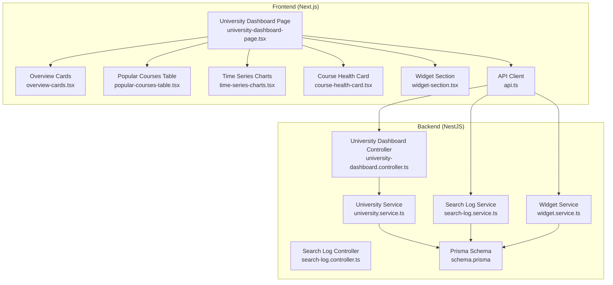
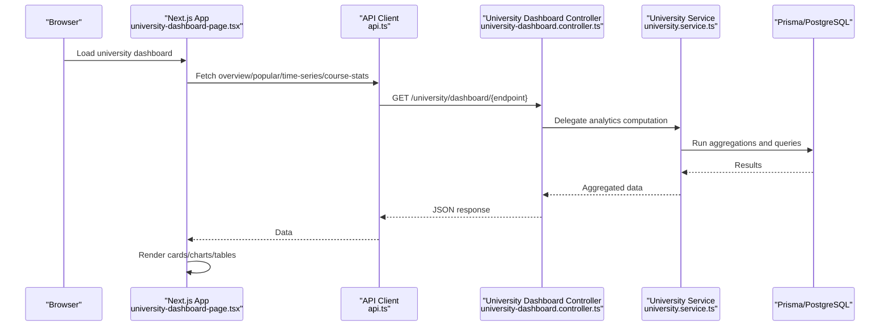
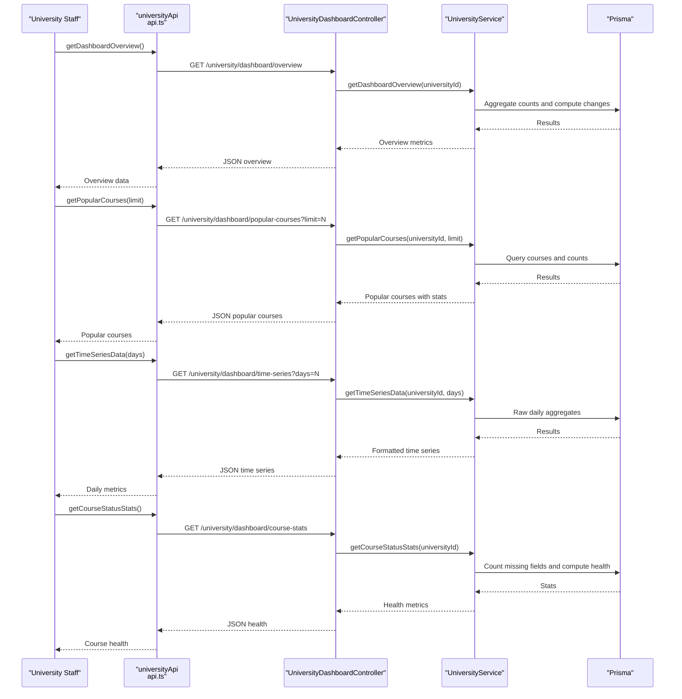
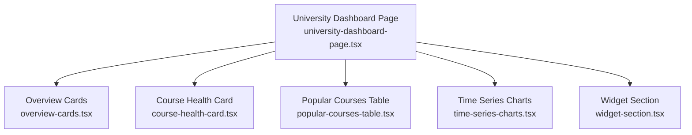
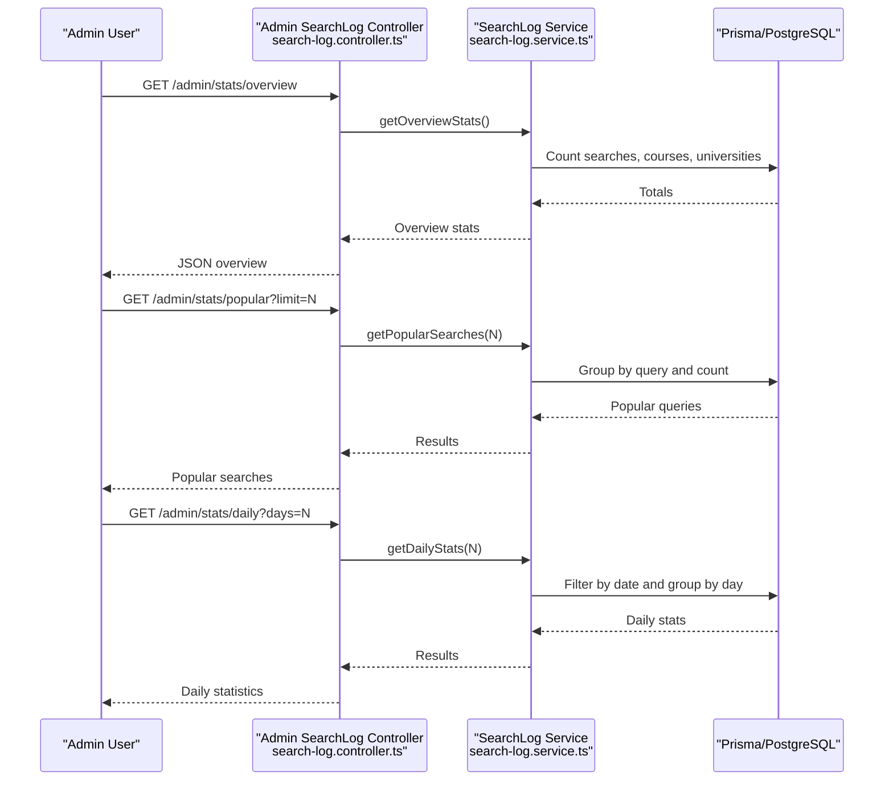
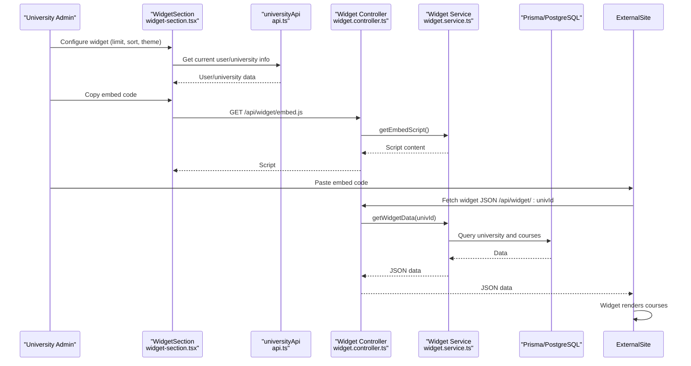
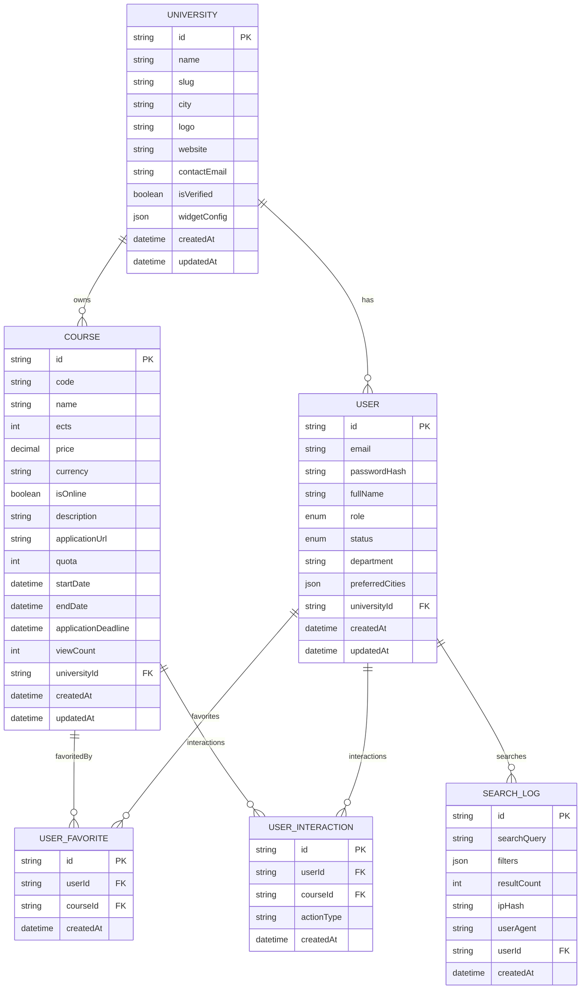
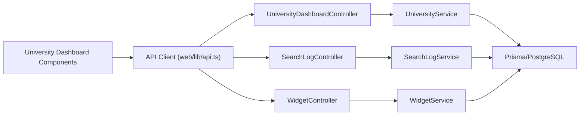

# Analytics and Dashboard

<cite>
**Referenced Files in This Document**
- [university-dashboard.controller.ts](file://apps/api/src/modules/university/university-dashboard.controller.ts)
- [university.service.ts](file://apps/api/src/modules/university/university.service.ts)
- [search-log.service.ts](file://apps/api/src/modules/search-log/search-log.service.ts)
- [search-log.controller.ts](file://apps/api/src/modules/search-log/search-log.controller.ts)
- [widget.service.ts](file://apps/api/src/modules/widget/widget.service.ts)
- [schema.prisma](file://apps/api/prisma/schema.prisma)
- [api.ts](file://apps/web/lib/api.ts)
- [university-dashboard-page.tsx](file://apps/web/app/dashboard/university/page.tsx)
- [overview-cards.tsx](file://apps/web/app/dashboard/university/components/OverviewCards.tsx)
- [popular-courses-table.tsx](file://apps/web/app/dashboard/university/components/PopularCoursesTable.tsx)
- [time-series-charts.tsx](file://apps/web/app/dashboard/university/components/TimeSeriesCharts.tsx)
- [course-health-card.tsx](file://apps/web/app/dashboard/university/components/CourseHealthCard.tsx)
- [widget-section.tsx](file://apps/web/app/dashboard/university/components/WidgetSection.tsx)
</cite>

## Table of Contents
1. [Introduction](#introduction)
2. [Project Structure](#project-structure)
3. [Core Components](#core-components)
4. [Architecture Overview](#architecture-overview)
5. [Detailed Component Analysis](#detailed-component-analysis)
6. [Dependency Analysis](#dependency-analysis)
7. [Performance Considerations](#performance-considerations)
8. [Troubleshooting Guide](#troubleshooting-guide)
9. [Conclusion](#conclusion)

## Introduction
This document explains the analytics and dashboard functionality designed for university accounts. It covers how university staff can access usage statistics, course performance metrics, and student engagement data. It also documents integrations with search log analytics, popular course tracking, and user behavior analysis. Additionally, it describes dashboard layouts, widget embedding for external websites, and reporting features available to university administrators.

## Project Structure
The analytics and dashboard system spans both the backend API and the frontend Next.js application:
- Backend (NestJS):
  - University analytics endpoints under the university module
  - Search log analytics for administrative insights
  - Widget service for external site integration
  - Prisma schema defining the data model and relationships
- Frontend (Next.js):
  - University dashboard page and reusable components
  - API client module encapsulating HTTP requests and authentication

**Diagram sources**
- [university-dashboard-page.tsx](file://apps/web/app/dashboard/university/page.tsx#L27-L93)
- [overview-cards.tsx](file://apps/web/app/dashboard/university/components/OverviewCards.tsx#L37-L131)
- [popular-courses-table.tsx](file://apps/web/app/dashboard/university/components/PopularCoursesTable.tsx#L42-L140)
- [time-series-charts.tsx](file://apps/web/app/dashboard/university/components/TimeSeriesCharts.tsx#L33-L115)
- [course-health-card.tsx](file://apps/web/app/dashboard/university/components/CourseHealthCard.tsx#L29-L131)
- [widget-section.tsx](file://apps/web/app/dashboard/university/components/WidgetSection.tsx#L26-L218)
- [api.ts](file://apps/web/lib/api.ts#L100-L165)
- [university-dashboard.controller.ts](file://apps/api/src/modules/university/university-dashboard.controller.ts#L25-L80)
- [university.service.ts](file://apps/api/src/modules/university/university.service.ts#L163-L430)
- [search-log.service.ts](file://apps/api/src/modules/search-log/search-log.service.ts#L19-L115)
- [search-log.controller.ts](file://apps/api/src/modules/search-log/search-log.controller.ts#L14-L41)
- [widget.service.ts](file://apps/api/src/modules/widget/widget.service.ts#L8-L107)
- [schema.prisma](file://apps/api/prisma/schema.prisma#L36-L182)

**Section sources**
- [university-dashboard-page.tsx](file://apps/web/app/dashboard/university/page.tsx#L1-L94)
- [api.ts](file://apps/web/lib/api.ts#L1-L378)
- [university-dashboard.controller.ts](file://apps/api/src/modules/university/university-dashboard.controller.ts#L1-L81)
- [university.service.ts](file://apps/api/src/modules/university/university.service.ts#L1-L451)
- [search-log.service.ts](file://apps/api/src/modules/search-log/search-log.service.ts#L1-L116)
- [widget.service.ts](file://apps/api/src/modules/widget/widget.service.ts#L1-L108)
- [schema.prisma](file://apps/api/prisma/schema.prisma#L1-L183)

## Core Components
- University Dashboard Controller: Exposes analytics endpoints protected by JWT and UNIVERSITY role guard. Endpoints include overview metrics, popular courses, time series data, and course health statistics.
- University Service: Implements analytics queries against the Prisma schema, aggregating counts, trends, and computed metrics such as conversion rates and health scores.
- Search Log Service: Provides administrative analytics on search queries, including popularity, daily statistics, and overview metrics.
- Widget Service: Supplies university course data for external website embedding via JSON endpoints and an embed script.
- Frontend Dashboard Components: Render analytics cards, charts, and tables; manage widget configuration and embedding code generation.

**Section sources**
- [university-dashboard.controller.ts](file://apps/api/src/modules/university/university-dashboard.controller.ts#L25-L80)
- [university.service.ts](file://apps/api/src/modules/university/university.service.ts#L163-L430)
- [search-log.service.ts](file://apps/api/src/modules/search-log/search-log.service.ts#L19-L115)
- [widget.service.ts](file://apps/api/src/modules/widget/widget.service.ts#L8-L107)
- [overview-cards.tsx](file://apps/web/app/dashboard/university/components/OverviewCards.tsx#L37-L131)
- [popular-courses-table.tsx](file://apps/web/app/dashboard/university/components/PopularCoursesTable.tsx#L42-L140)
- [time-series-charts.tsx](file://apps/web/app/dashboard/university/components/TimeSeriesCharts.tsx#L33-L115)
- [course-health-card.tsx](file://apps/web/app/dashboard/university/components/CourseHealthCard.tsx#L29-L131)
- [widget-section.tsx](file://apps/web/app/dashboard/university/components/WidgetSection.tsx#L26-L218)

## Architecture Overview
University analytics are computed server-side and rendered client-side. Authentication is handled via JWT tokens stored in local storage. The frontend calls university-specific analytics endpoints, while administrative search analytics are exposed separately.

**Diagram sources**
- [university-dashboard-page.tsx](file://apps/web/app/dashboard/university/page.tsx#L27-L93)
- [api.ts](file://apps/web/lib/api.ts#L114-L165)
- [university-dashboard.controller.ts](file://apps/api/src/modules/university/university-dashboard.controller.ts#L31-L80)
- [university.service.ts](file://apps/api/src/modules/university/university.service.ts#L163-L430)

## Detailed Component Analysis

### University Analytics Endpoints
University staff can access four primary analytics endpoints:
- Dashboard overview: total courses, new courses in the last month, total and recent views, favorites, and application clicks with percentage changes.
- Popular courses: top courses by view count with favorite counts, application clicks, and conversion rate.
- Time series: daily views, favorites, and applications for the last N days.
- Course health: counts of courses with application URLs, date ranges, online/onsite distribution, and a health score.

**Diagram sources**
- [api.ts](file://apps/web/lib/api.ts#L114-L165)
- [university-dashboard.controller.ts](file://apps/api/src/modules/university/university-dashboard.controller.ts#L31-L80)
- [university.service.ts](file://apps/api/src/modules/university/university.service.ts#L163-L430)

**Section sources**
- [university-dashboard.controller.ts](file://apps/api/src/modules/university/university-dashboard.controller.ts#L31-L80)
- [university.service.ts](file://apps/api/src/modules/university/university.service.ts#L163-L430)
- [api.ts](file://apps/web/lib/api.ts#L114-L165)

### Frontend Dashboard Layouts
The university dashboard organizes analytics into distinct sections:
- Overview cards: total courses, views, favorites, and application clicks with recent changes.
- Popular courses table: view count, favorites, application clicks, and conversion rate per course.
- Time series charts: line chart for views and bar chart for favorites vs applications.
- Course health card: health score and indicators for missing application URLs and dates.
- Widget section: configuration for embedding courses on external websites.

**Diagram sources**
- [university-dashboard-page.tsx](file://apps/web/app/dashboard/university/page.tsx#L59-L93)
- [overview-cards.tsx](file://apps/web/app/dashboard/university/components/OverviewCards.tsx#L37-L131)
- [popular-courses-table.tsx](file://apps/web/app/dashboard/university/components/PopularCoursesTable.tsx#L42-L140)
- [time-series-charts.tsx](file://apps/web/app/dashboard/university/components/TimeSeriesCharts.tsx#L33-L115)
- [course-health-card.tsx](file://apps/web/app/dashboard/university/components/CourseHealthCard.tsx#L29-L131)
- [widget-section.tsx](file://apps/web/app/dashboard/university/components/WidgetSection.tsx#L26-L218)

**Section sources**
- [university-dashboard-page.tsx](file://apps/web/app/dashboard/university/page.tsx#L27-L93)
- [overview-cards.tsx](file://apps/web/app/dashboard/university/components/OverviewCards.tsx#L37-L131)
- [popular-courses-table.tsx](file://apps/web/app/dashboard/university/components/PopularCoursesTable.tsx#L42-L140)
- [time-series-charts.tsx](file://apps/web/app/dashboard/university/components/TimeSeriesCharts.tsx#L33-L115)
- [course-health-card.tsx](file://apps/web/app/dashboard/university/components/CourseHealthCard.tsx#L29-L131)
- [widget-section.tsx](file://apps/web/app/dashboard/university/components/WidgetSection.tsx#L26-L218)

### Search Log Analytics Integration
Search log analytics provide administrative insights into platform-wide search behavior:
- Total search count, total courses, total universities, and today’s searches for overview.
- Popular searches grouped by query.
- Daily statistics including search count and average results per day.

**Diagram sources**
- [search-log.controller.ts](file://apps/api/src/modules/search-log/search-log.controller.ts#L14-L41)
- [search-log.service.ts](file://apps/api/src/modules/search-log/search-log.service.ts#L37-L115)

**Section sources**
- [search-log.controller.ts](file://apps/api/src/modules/search-log/search-log.controller.ts#L14-L41)
- [search-log.service.ts](file://apps/api/src/modules/search-log/search-log.service.ts#L37-L115)

### Widget Embedding for External Websites
University administrators can configure and embed course listings on external websites:
- Widget configuration allows customization of display limits, sorting, and theme.
- Embed code generation produces a script tag and a container element with attributes for university slug, limit, sort, and theme.
- Public JSON endpoint returns university and course data for the widget.
- Public embed script dynamically loads and renders the widget content.

**Diagram sources**
- [widget-section.tsx](file://apps/web/app/dashboard/university/components/WidgetSection.tsx#L26-L218)
- [api.ts](file://apps/web/lib/api.ts#L108-L112)
- [widget.service.ts](file://apps/api/src/modules/widget/widget.service.ts#L14-L107)
- [schema.prisma](file://apps/api/prisma/schema.prisma#L36-L122)

**Section sources**
- [widget-section.tsx](file://apps/web/app/dashboard/university/components/WidgetSection.tsx#L26-L218)
- [widget.service.ts](file://apps/api/src/modules/widget/widget.service.ts#L14-L107)
- [api.ts](file://apps/web/lib/api.ts#L286-L290)

### Data Model and Relationships
The analytics rely on the following entities and relationships:
- University: tenant with widget configuration and courses.
- Course: belongs to a university, tracks view count, and links to user interactions and favorites.
- UserInteraction: records actions such as VIEW, FAVORITE, and APPLY.
- UserFavorite: tracks user favorites per course.
- SearchLog: captures search queries, filters, and metadata for analytics.

**Diagram sources**
- [schema.prisma](file://apps/api/prisma/schema.prisma#L36-L182)

**Section sources**
- [schema.prisma](file://apps/api/prisma/schema.prisma#L36-L182)

## Dependency Analysis
- Controllers depend on services for business logic.
- Services depend on Prisma for data access and aggregation.
- Frontend components depend on the API client for secure, authenticated requests.
- Widget service depends on Prisma to expose public JSON and embed script.

**Diagram sources**
- [university-dashboard.controller.ts](file://apps/api/src/modules/university/university-dashboard.controller.ts#L25-L80)
- [university.service.ts](file://apps/api/src/modules/university/university.service.ts#L16-L20)
- [search-log.controller.ts](file://apps/api/src/modules/search-log/search-log.controller.ts#L14-L41)
- [search-log.service.ts](file://apps/api/src/modules/search-log/search-log.service.ts#L19-L22)
- [widget.service.ts](file://apps/api/src/modules/widget/widget.service.ts#L8-L12)
- [api.ts](file://apps/web/lib/api.ts#L100-L165)

**Section sources**
- [university-dashboard.controller.ts](file://apps/api/src/modules/university/university-dashboard.controller.ts#L25-L80)
- [university.service.ts](file://apps/api/src/modules/university/university.service.ts#L16-L20)
- [search-log.controller.ts](file://apps/api/src/modules/search-log/search-log.controller.ts#L14-L41)
- [search-log.service.ts](file://apps/api/src/modules/search-log/search-log.service.ts#L19-L22)
- [widget.service.ts](file://apps/api/src/modules/widget/widget.service.ts#L8-L12)
- [api.ts](file://apps/web/lib/api.ts#L100-L165)

## Performance Considerations
- Indexes on frequently queried fields (e.g., universityId, actionType, createdAt) improve query performance for analytics.
- Aggregation queries for time series and counts should leverage database-level grouping and summing to minimize payload sizes.
- Caching strategies can be considered for stable overview metrics and popular courses lists to reduce load.
- Widget JSON responses should be compact and include only necessary fields to optimize rendering on external sites.

[No sources needed since this section provides general guidance]

## Troubleshooting Guide
- Unauthorized access: Endpoints are protected by JWT and UNIVERSITY role guard. Verify token presence and role in local storage and ensure the user belongs to the correct university.
- Missing university context: Dashboard endpoints require a valid universityId on the authenticated user; otherwise, a forbidden error is returned.
- Widget not rendering: Confirm the embed script is loaded and the university slug is correct. Check the public JSON endpoint for the expected data shape.
- Search analytics visibility: Administrative endpoints are restricted to ADMIN role; ensure appropriate credentials are used.

**Section sources**
- [university-dashboard.controller.ts](file://apps/api/src/modules/university/university-dashboard.controller.ts#L32-L38)
- [university.service.ts](file://apps/api/src/modules/university/university.service.ts#L163-L176)
- [widget.service.ts](file://apps/api/src/modules/widget/widget.service.ts#L69-L107)
- [search-log.controller.ts](file://apps/api/src/modules/search-log/search-log.controller.ts#L14-L16)

## Conclusion
The university analytics and dashboard system provides a comprehensive view of course performance and user engagement, with robust integrations for search analytics and external website embedding. University staff can monitor key metrics, identify popular courses, track trends over time, and maintain course completeness through health indicators. Administrators gain platform-wide insights via search log analytics. The modular architecture ensures clear separation of concerns, while the frontend components deliver an intuitive, data-driven interface.