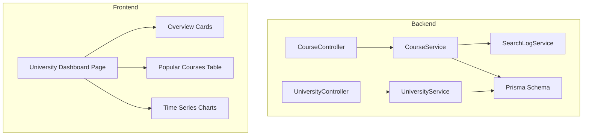
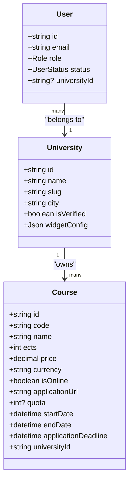
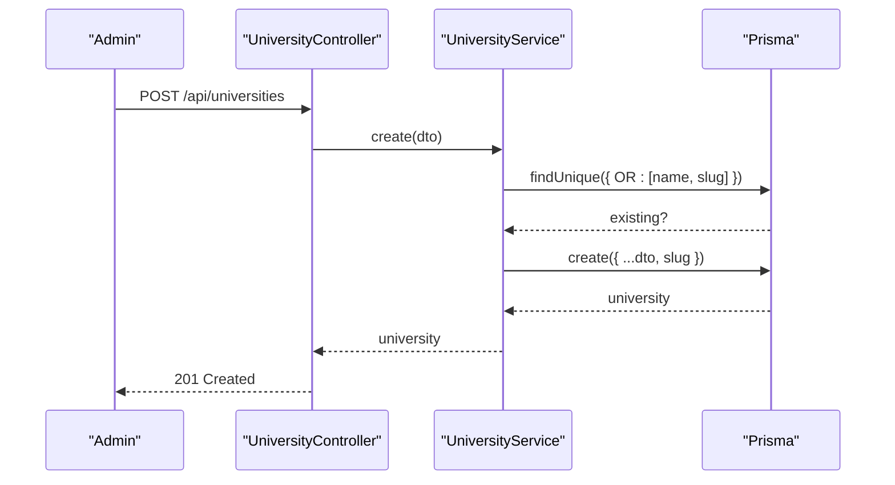
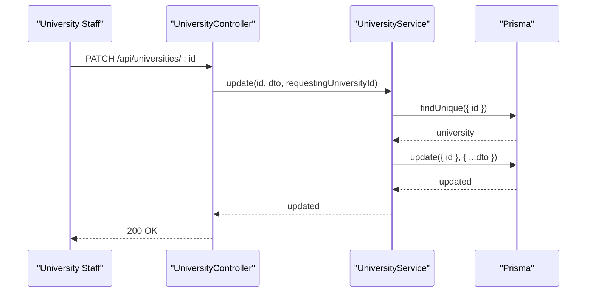
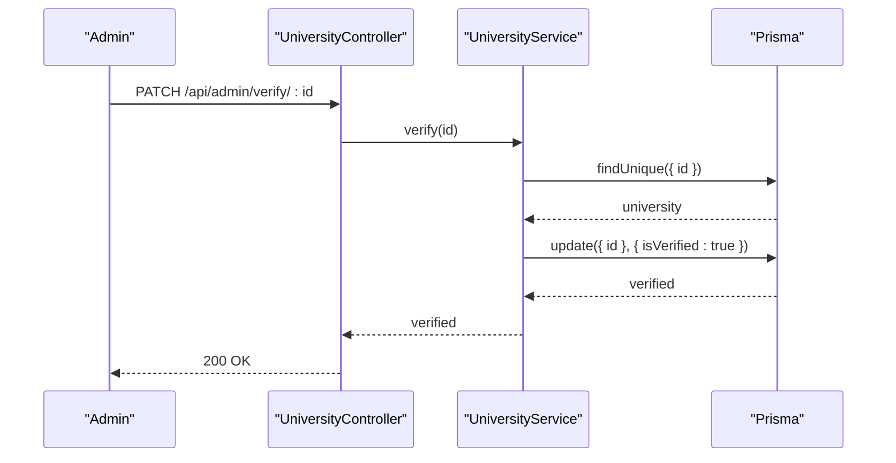
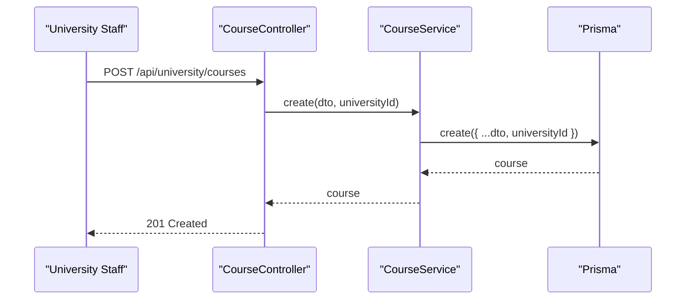
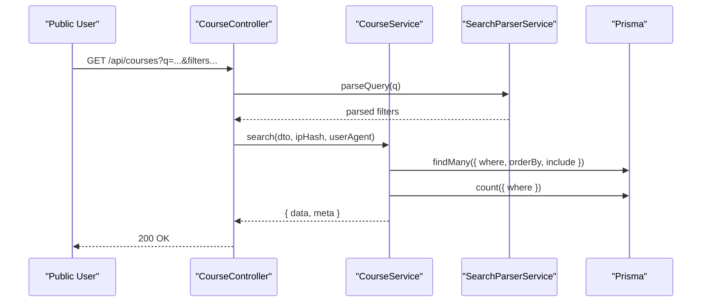
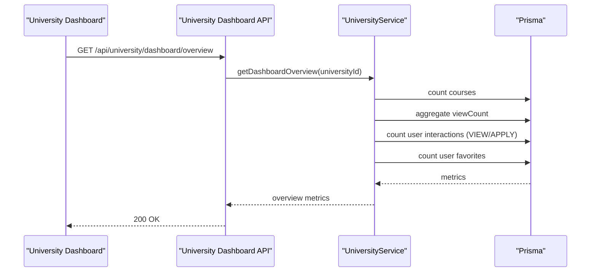
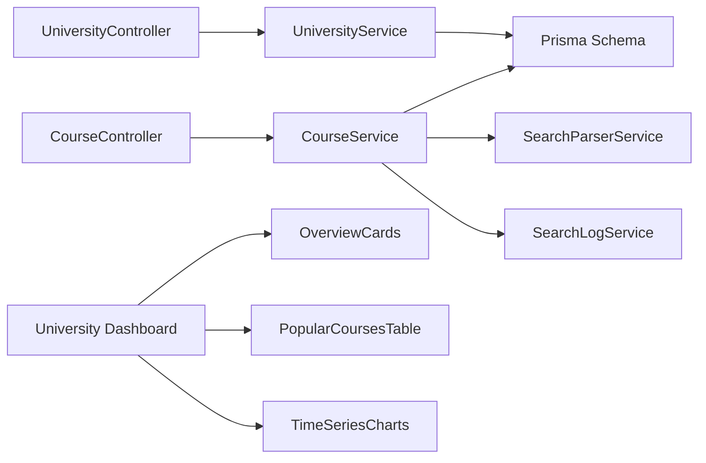

# Course Management Integration

<cite>
**Referenced Files in This Document**
- [university.service.ts](file://apps/api/src/modules/university/university.service.ts)
- [university.controller.ts](file://apps/api/src/modules/university/university.controller.ts)
- [university.dto.ts](file://apps/api/src/modules/university/university.dto.ts)
- [university-dashboard.controller.ts](file://apps/api/src/modules/university/university-dashboard.controller.ts)
- [course.service.ts](file://apps/api/src/modules/course/course.service.ts)
- [course.controller.ts](file://apps/api/src/modules/course/course.controller.ts)
- [course.dto.ts](file://apps/api/src/modules/course/course.dto.ts)
- [search-parser.service.ts](file://apps/api/src/modules/course/search-parser.service.ts)
- [schema.prisma](file://apps/api/prisma/schema.prisma)
- [roles.ts](file://apps/api/src/common/constants/roles.ts)
- [search-log.service.ts](file://apps/api/src/modules/search-log/search-log.service.ts)
- [search-log.controller.ts](file://apps/api/src/modules/search-log/search-log.controller.ts)
- [university.dashboard.page.tsx](file://apps/web/app/dashboard/university/page.tsx)
- [overview.cards.tsx](file://apps/web/app/dashboard/university/components/OverviewCards.tsx)
- [popular.courses.table.tsx](file://apps/web/app/dashboard/university/components/PopularCoursesTable.tsx)
- [time.series.charts.tsx](file://apps/web/app/dashboard/university/components/TimeSeriesCharts.tsx)
</cite>

## Table of Contents
1. [Introduction](#introduction)
2. [Project Structure](#project-structure)
3. [Core Components](#core-components)
4. [Architecture Overview](#architecture-overview)
5. [Detailed Component Analysis](#detailed-component-analysis)
6. [Dependency Analysis](#dependency-analysis)
7. [Performance Considerations](#performance-considerations)
8. [Troubleshooting Guide](#troubleshooting-guide)
9. [Conclusion](#conclusion)

## Introduction
This document explains the integration between university management and course operations in the system. It focuses on how universities can create, update, and manage courses via the university service layer, the relationship between university and course entities, data validation rules, and analytics dashboards. It also covers course creation workflows for university staff, approval processes, and integration with the broader course management system.

## Project Structure
The integration spans backend NestJS modules and frontend Next.js pages:
- Backend modules: university, course, search-log
- Database schema: Prisma models define entities and relationships
- Frontend dashboard: university analytics and widgets

**Diagram sources**
- [university.controller.ts](file://apps/api/src/modules/university/university.controller.ts#L38-L114)
- [university.service.ts](file://apps/api/src/modules/university/university.service.ts#L17-L451)
- [course.controller.ts](file://apps/api/src/modules/course/course.controller.ts#L36-L148)
- [course.service.ts](file://apps/api/src/modules/course/course.service.ts#L18-L310)
- [search-log.service.ts](file://apps/api/src/modules/search-log/search-log.service.ts#L19-L116)
- [schema.prisma](file://apps/api/prisma/schema.prisma#L35-L122)
- [university.dashboard.page.tsx](file://apps/web/app/dashboard/university/page.tsx#L27-L94)

**Section sources**
- [university.controller.ts](file://apps/api/src/modules/university/university.controller.ts#L38-L114)
- [course.controller.ts](file://apps/api/src/modules/course/course.controller.ts#L36-L148)
- [schema.prisma](file://apps/api/prisma/schema.prisma#L35-L122)

## Core Components
- University module: manages university entities, verification, widget configuration, and analytics dashboards.
- Course module: handles course lifecycle (create/update/delete), public search with filtering, and comparison.
- Search parsing: natural language processing for Turkish queries to extract filters.
- Analytics: dashboard metrics for course performance and trends.
- Database schema: defines entities, relationships, and indexes.

Key responsibilities:
- UniversityService: create/update university, verify, widget config, analytics queries.
- CourseService: search/filter courses, create/update/delete course, compare courses.
- SearchParserService: parse Turkish queries into structured filters.
- Frontend dashboard components: render analytics cards, popular courses, and time series charts.

**Section sources**
- [university.service.ts](file://apps/api/src/modules/university/university.service.ts#L17-L451)
- [course.service.ts](file://apps/api/src/modules/course/course.service.ts#L18-L310)
- [search-parser.service.ts](file://apps/api/src/modules/course/search-parser.service.ts#L105-L283)
- [schema.prisma](file://apps/api/prisma/schema.prisma#L35-L122)

## Architecture Overview
The system follows a multitenancy pattern where each university acts as a tenant. University staff can manage only their own courses, while admins can verify universities and access global statistics.

**Diagram sources**
- [schema.prisma](file://apps/api/prisma/schema.prisma#L35-L122)
- [roles.ts](file://apps/api/src/common/constants/roles.ts#L5-L6)

## Detailed Component Analysis

### University Module: Creation, Updates, Verification, and Analytics
University staff can create universities (admin-only), update university info (university/admin), verify universities (admin), and configure widgets (university). The service enforces multitenancy and provides analytics dashboards.

**Diagram sources**
- [university.controller.ts](file://apps/api/src/modules/university/university.controller.ts#L68-L76)
- [university.service.ts](file://apps/api/src/modules/university/university.service.ts#L26-L44)

**Diagram sources**
- [university.controller.ts](file://apps/api/src/modules/university/university.controller.ts#L78-L91)
- [university.service.ts](file://apps/api/src/modules/university/university.service.ts#L110-L128)

**Diagram sources**
- [university.controller.ts](file://apps/api/src/modules/university/university.controller.ts#L93-L99)
- [university.service.ts](file://apps/api/src/modules/university/university.service.ts#L131-L144)

University analytics dashboard endpoints:
- Overview metrics: total courses, new last month, views, favorites, application clicks, and percentage changes.
- Popular courses: top courses by view count with conversion rate.
- Time series: daily views, favorites, and applications over N days.
- Course health: counts for application URLs, date presence, and online/onsite distribution.

**Section sources**
- [university.service.ts](file://apps/api/src/modules/university/university.service.ts#L163-L430)
- [university-dashboard.controller.ts](file://apps/api/src/modules/university/university-dashboard.controller.ts#L31-L79)

### Course Module: Creation, Filtering, and Comparison
University staff can create, update, and delete courses within their university. The course search supports advanced filtering and natural language parsing.

**Diagram sources**
- [course.controller.ts](file://apps/api/src/modules/course/course.controller.ts#L108-L118)
- [course.service.ts](file://apps/api/src/modules/course/course.service.ts#L157-L175)

**Diagram sources**
- [course.controller.ts](file://apps/api/src/modules/course/course.controller.ts#L49-L75)
- [course.service.ts](file://apps/api/src/modules/course/course.service.ts#L31-L133)
- [search-parser.service.ts](file://apps/api/src/modules/course/search-parser.service.ts#L116-L144)

Course comparison workflow:
- Validates 2-4 course IDs.
- Fetches courses with university metadata.
- Increments view counts.
- Computes statistics: cheapest/most expensive, highest/lowest ECTS, online/onsite counts, average price/ECTS, city/university diversity.

**Section sources**
- [course.service.ts](file://apps/api/src/modules/course/course.service.ts#L235-L308)
- [course.controller.ts](file://apps/api/src/modules/course/course.controller.ts#L77-L88)

### Data Validation and Business Rules
- University DTOs enforce minimum/maximum lengths, URL/email formats, and optional fields.
- Course DTOs validate course codes, names, ECTS bounds, price ranges, optional dates, and URLs.
- Search DTOs define pagination, sorting, and filter parameters.

**Section sources**
- [university.dto.ts](file://apps/api/src/modules/university/university.dto.ts#L9-L21)
- [course.dto.ts](file://apps/api/src/modules/course/course.dto.ts#L9-L43)
- [course.dto.ts](file://apps/api/src/modules/course/course.dto.ts#L68-L81)

### Frontend Dashboard Integration
The university dashboard aggregates analytics from backend endpoints:
- Overview cards fetch total courses, views, favorites, and application metrics.
- Popular courses table lists top-performing courses with conversion rates.
- Time series charts visualize daily trends for views, favorites, and applications.

**Diagram sources**
- [university-dashboard.controller.ts](file://apps/api/src/modules/university/university-dashboard.controller.ts#L31-L38)
- [university.service.ts](file://apps/api/src/modules/university/university.service.ts#L163-L278)

**Section sources**
- [university.dashboard.page.tsx](file://apps/web/app/dashboard/university/page.tsx#L27-L94)
- [overview.cards.tsx](file://apps/web/app/dashboard/university/components/OverviewCards.tsx#L37-L131)
- [popular.courses.table.tsx](file://apps/web/app/dashboard/university/components/PopularCoursesTable.tsx#L42-L141)
- [time.series.charts.tsx](file://apps/web/app/dashboard/university/components/TimeSeriesCharts.tsx#L33-L116)

## Dependency Analysis
- UniversityService depends on PrismaService and provides analytics queries.
- CourseService depends on PrismaService and SearchLogService; integrates SearchParserService for natural language queries.
- Controllers apply role guards (UNIVERSITY/ADMIN) and validation pipes (Zod).
- Frontend components call university dashboard endpoints and render analytics.

**Diagram sources**
- [university.controller.ts](file://apps/api/src/modules/university/university.controller.ts#L38-L114)
- [course.controller.ts](file://apps/api/src/modules/course/course.controller.ts#L36-L148)
- [university-dashboard.controller.ts](file://apps/api/src/modules/university/university-dashboard.controller.ts#L25-L81)
- [search-parser.service.ts](file://apps/api/src/modules/course/search-parser.service.ts#L105-L283)
- [search-log.service.ts](file://apps/api/src/modules/search-log/search-log.service.ts#L19-L116)
- [schema.prisma](file://apps/api/prisma/schema.prisma#L35-L122)

**Section sources**
- [university.controller.ts](file://apps/api/src/modules/university/university.controller.ts#L38-L114)
- [course.controller.ts](file://apps/api/src/modules/course/course.controller.ts#L36-L148)
- [university-dashboard.controller.ts](file://apps/api/src/modules/university/university-dashboard.controller.ts#L25-L81)

## Performance Considerations
- Database indexes support frequent queries: university city, verification flag, course name/code, universityId, online flag, and composite indexes for search.
- Pagination limits prevent excessive result sets during search.
- Aggregation queries compute analytics efficiently using database-side aggregation.
- Natural language parsing enriches filters without impacting search performance significantly.

[No sources needed since this section provides general guidance]

## Troubleshooting Guide
Common issues and resolutions:
- Unauthorized access: ensure JWT bearer token and correct role (UNIVERSITY/ADMIN).
- Multitenancy violations: verify that university staff operate only within their own universityId.
- Missing university association: university endpoints require a valid universityId in the JWT claims.
- Validation errors: review DTO constraints for university and course creation/update requests.
- Analytics data gaps: confirm that user interactions (views, favorites, applies) are recorded and recent activity exists.

**Section sources**
- [university.controller.ts](file://apps/api/src/modules/university/university.controller.ts#L78-L91)
- [course.controller.ts](file://apps/api/src/modules/course/course.controller.ts#L108-L118)
- [university-dashboard.controller.ts](file://apps/api/src/modules/university/university-dashboard.controller.ts#L31-L38)

## Conclusion
The integration provides a robust foundation for university-managed course operations with strong multitenancy, comprehensive validation, and insightful analytics. University staff can efficiently manage course catalogs, while admins oversee verification and platform-wide insights. The modular design enables scalable enhancements and maintains clear separation of concerns across university and course domains.