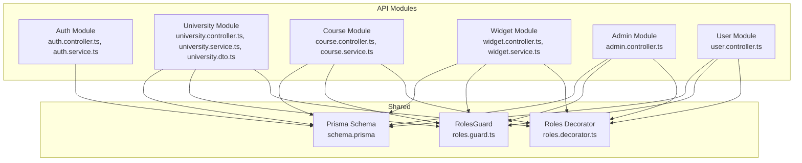
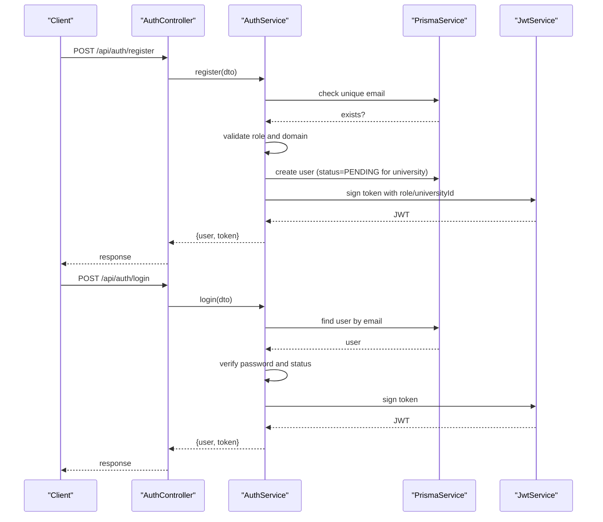
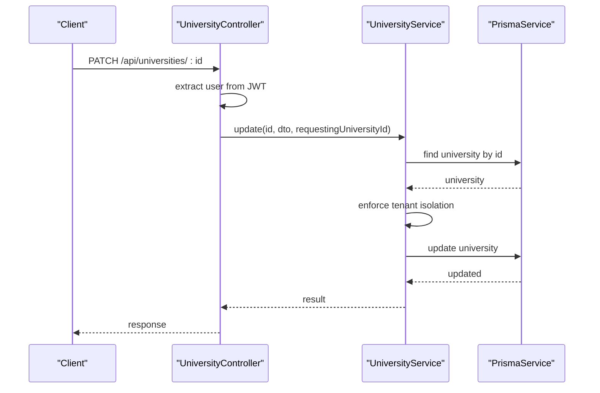
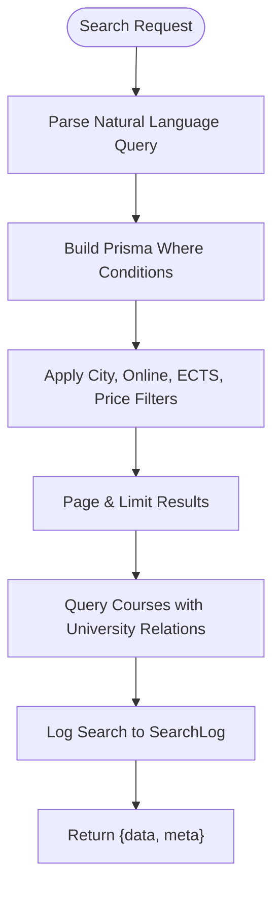
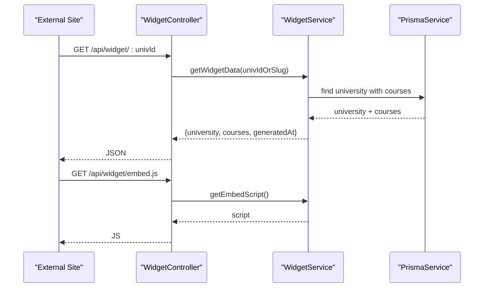
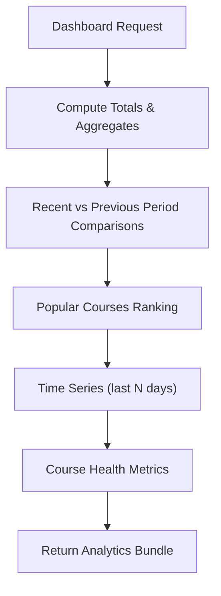
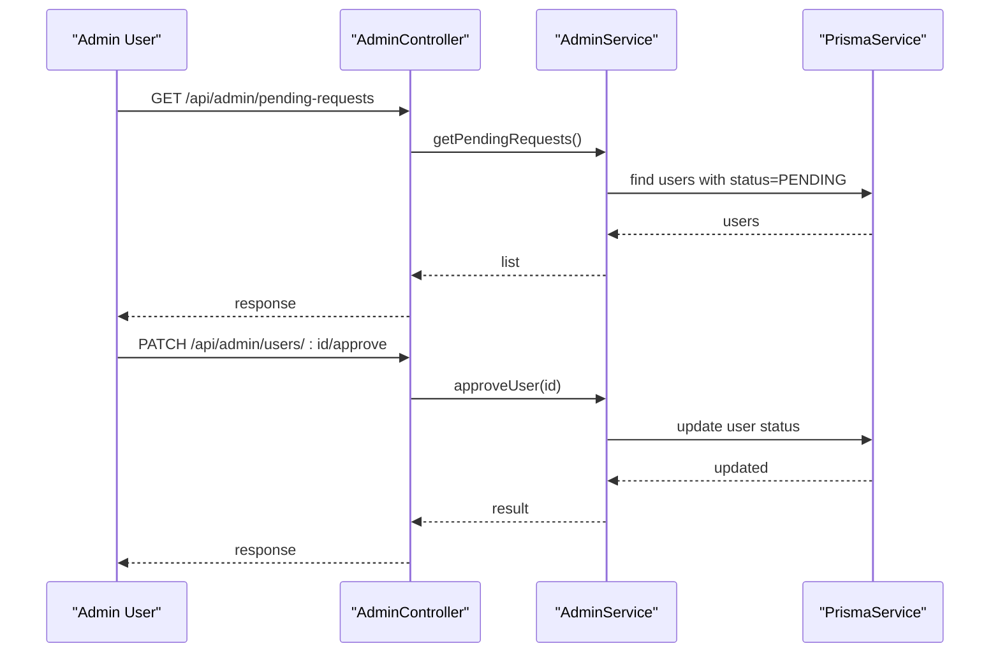
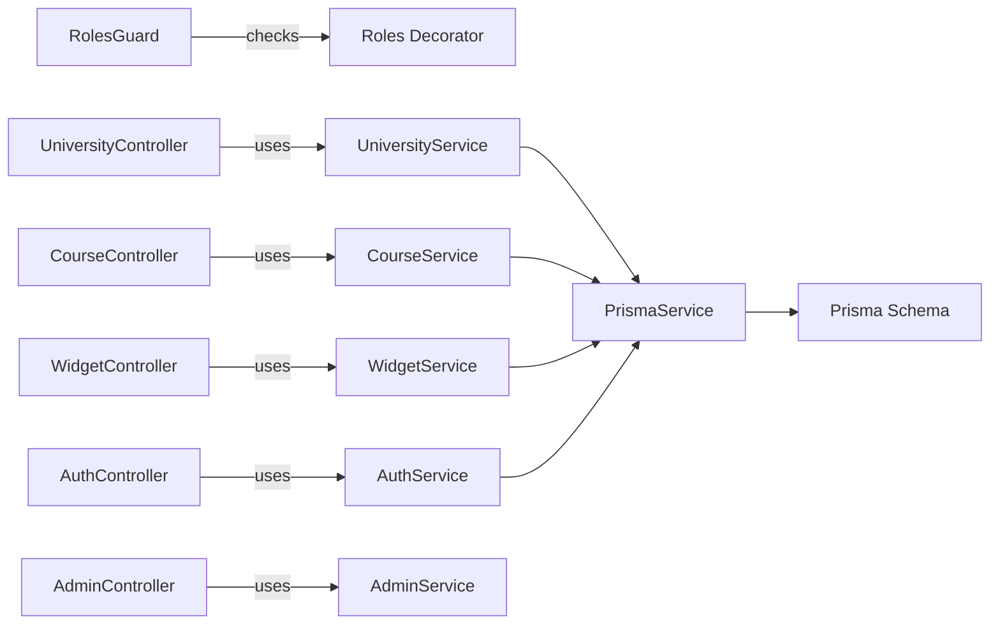
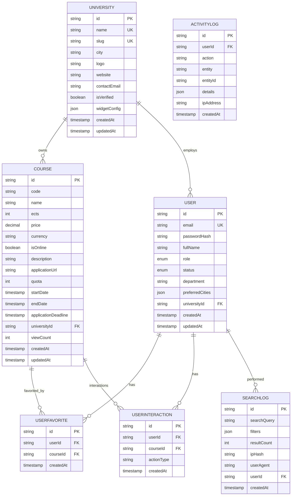

# University Management

<cite>
**Referenced Files in This Document**
- [university.controller.ts](file://apps/api/src/modules/university/university.controller.ts)
- [university.dto.ts](file://apps/api/src/modules/university/university.dto.ts)
- [university.service.ts](file://apps/api/src/modules/university/university.service.ts)
- [course.controller.ts](file://apps/api/src/modules/course/course.controller.ts)
- [course.service.ts](file://apps/api/src/modules/course/course.service.ts)
- [widget.controller.ts](file://apps/api/src/modules/widget/widget.controller.ts)
- [widget.service.ts](file://apps/api/src/modules/widget/widget.service.ts)
- [admin.controller.ts](file://apps/api/src/modules/admin/admin.controller.ts)
- [auth.controller.ts](file://apps/api/src/modules/auth/auth.controller.ts)
- [auth.service.ts](file://apps/api/src/modules/auth/auth.service.ts)
- [roles.guard.ts](file://apps/api/src/common/guards/roles.guard.ts)
- [roles.decorator.ts](file://apps/api/src/common/decorators/roles.decorator.ts)
- [roles.ts](file://apps/api/src/common/constants/roles.ts)
- [schema.prisma](file://apps/api/prisma/schema.prisma)
</cite>

## Table of Contents
1. [Introduction](#introduction)
2. [Project Structure](#project-structure)
3. [Core Components](#core-components)
4. [Architecture Overview](#architecture-overview)
5. [Detailed Component Analysis](#detailed-component-analysis)
6. [Dependency Analysis](#dependency-analysis)
7. [Performance Considerations](#performance-considerations)
8. [Troubleshooting Guide](#troubleshooting-guide)
9. [Conclusion](#conclusion)
10. [Appendices](#appendices)

## Introduction
This document provides comprehensive API documentation for the university management system. It covers:
- University profile management and verification workflows
- Course CRUD operations with search and analytics
- Widget configuration and external embedding
- Analytics endpoints for university dashboards
- Multitenancy implementation and data isolation
- Authentication and authorization flows
- Practical administrative and staff workflows

The system is built with NestJS and Prisma, using PostgreSQL as the datastore. It implements role-based access control (RBAC), JWT authentication, and tenant isolation via university-scoped resources.

## Project Structure
The API module organizes functionality by domain:
- Authentication and authorization
- University management (profile, verification, widget config)
- Course management (CRUD, search, comparison)
- Widget integration for external embedding
- Administrative dashboards and management
- Shared security guards and decorators
- Prisma schema defining models, relations, and indexes

**Diagram sources**
- [university.controller.ts](file://apps/api/src/modules/university/university.controller.ts#L1-L114)
- [course.controller.ts](file://apps/api/src/modules/course/course.controller.ts#L1-L148)
- [widget.controller.ts](file://apps/api/src/modules/widget/widget.controller.ts#L1-L30)
- [admin.controller.ts](file://apps/api/src/modules/admin/admin.controller.ts#L1-L119)
- [auth.controller.ts](file://apps/api/src/modules/auth/auth.controller.ts#L1-L28)
- [roles.guard.ts](file://apps/api/src/common/guards/roles.guard.ts#L1-L56)
- [roles.decorator.ts](file://apps/api/src/common/decorators/roles.decorator.ts#L1-L16)
- [schema.prisma](file://apps/api/prisma/schema.prisma#L1-L183)

**Section sources**
- [university.controller.ts](file://apps/api/src/modules/university/university.controller.ts#L1-L114)
- [course.controller.ts](file://apps/api/src/modules/course/course.controller.ts#L1-L148)
- [widget.controller.ts](file://apps/api/src/modules/widget/widget.controller.ts#L1-L30)
- [admin.controller.ts](file://apps/api/src/modules/admin/admin.controller.ts#L1-L119)
- [auth.controller.ts](file://apps/api/src/modules/auth/auth.controller.ts#L1-L28)
- [roles.guard.ts](file://apps/api/src/common/guards/roles.guard.ts#L1-L56)
- [roles.decorator.ts](file://apps/api/src/common/decorators/roles.decorator.ts#L1-L16)
- [schema.prisma](file://apps/api/prisma/schema.prisma#L1-L183)

## Core Components
- Authentication and Authorization
  - Registration validates domain for university staff and sets initial status
  - Login generates JWT tokens with role and university association
  - Guards enforce role-based access per endpoint
- University Management
  - CRUD endpoints for universities with multitenancy checks
  - Verification workflow for administrators
  - Widget configuration with color and theme
- Course Management
  - Public search with natural language parsing and filters
  - University-scoped CRUD operations
  - Course comparison and analytics
- Widget Integration
  - Public JSON endpoint for university course data
  - Embed script for third-party websites
- Administration
  - Dashboard statistics and popular searches
  - Pending user approvals and university management
  - Global course administration

**Section sources**
- [auth.service.ts](file://apps/api/src/modules/auth/auth.service.ts#L1-L205)
- [roles.guard.ts](file://apps/api/src/common/guards/roles.guard.ts#L1-L56)
- [university.controller.ts](file://apps/api/src/modules/university/university.controller.ts#L1-L114)
- [university.service.ts](file://apps/api/src/modules/university/university.service.ts#L1-L451)
- [course.controller.ts](file://apps/api/src/modules/course/course.controller.ts#L1-L148)
- [course.service.ts](file://apps/api/src/modules/course/course.service.ts#L1-L310)
- [widget.controller.ts](file://apps/api/src/modules/widget/widget.controller.ts#L1-L30)
- [widget.service.ts](file://apps/api/src/modules/widget/widget.service.ts#L1-L108)
- [admin.controller.ts](file://apps/api/src/modules/admin/admin.controller.ts#L1-L119)

## Architecture Overview
The system follows layered architecture with clear separation of concerns:
- Controllers handle HTTP requests and apply guards and decorators
- Services encapsulate business logic and enforce multitenancy
- Prisma provides type-safe database access with indexes and relations
- Guards and decorators centralize authorization logic

**Diagram sources**
- [auth.controller.ts](file://apps/api/src/modules/auth/auth.controller.ts#L1-L28)
- [auth.service.ts](file://apps/api/src/modules/auth/auth.service.ts#L1-L205)

**Section sources**
- [auth.controller.ts](file://apps/api/src/modules/auth/auth.controller.ts#L1-L28)
- [auth.service.ts](file://apps/api/src/modules/auth/auth.service.ts#L1-L205)
- [roles.guard.ts](file://apps/api/src/common/guards/roles.guard.ts#L1-L56)
- [roles.decorator.ts](file://apps/api/src/common/decorators/roles.decorator.ts#L1-L16)

## Detailed Component Analysis

### University Management Endpoints
- Public endpoints
  - List verified universities
  - Retrieve university by slug or ID
- Protected endpoints
  - Admin-only: create, update, delete universities
  - Admin-only: verify university accounts
  - University/Admin: update university profile
  - University-only: update widget configuration

**Diagram sources**
- [university.controller.ts](file://apps/api/src/modules/university/university.controller.ts#L78-L91)
- [university.service.ts](file://apps/api/src/modules/university/university.service.ts#L110-L128)

Key validation and schemas:
- CreateUniversitySchema: name, city, optional logo/website/contactEmail
- UpdateUniversitySchema: optional fields with nullable support
- WidgetConfigSchema: primaryColor hex and theme enum

**Section sources**
- [university.controller.ts](file://apps/api/src/modules/university/university.controller.ts#L1-L114)
- [university.dto.ts](file://apps/api/src/modules/university/university.dto.ts#L1-L48)
- [university.service.ts](file://apps/api/src/modules/university/university.service.ts#L1-L451)

### Course Management Endpoints
- Public search with filters and natural language parsing
- Public course comparison (2-4 courses)
- University-scoped CRUD operations
- Dashboard listing of university courses

**Diagram sources**
- [course.controller.ts](file://apps/api/src/modules/course/course.controller.ts#L49-L75)
- [course.service.ts](file://apps/api/src/modules/course/course.service.ts#L31-L133)

University-scoped operations:
- Create/update/delete enforce tenant isolation using universityId
- Comparison validates counts and computes statistics

**Section sources**
- [course.controller.ts](file://apps/api/src/modules/course/course.controller.ts#L1-L148)
- [course.service.ts](file://apps/api/src/modules/course/course.service.ts#L1-L310)

### Widget Configuration and Embedding
- Public JSON endpoint for university course data
- Embed script dynamically loads and renders course cards
- Widget configuration supports primary color and theme

**Diagram sources**
- [widget.controller.ts](file://apps/api/src/modules/widget/widget.controller.ts#L15-L28)
- [widget.service.ts](file://apps/api/src/modules/widget/widget.service.ts#L18-L67)
- [widget.service.ts](file://apps/api/src/modules/widget/widget.service.ts#L70-L105)

**Section sources**
- [widget.controller.ts](file://apps/api/src/modules/widget/widget.controller.ts#L1-L30)
- [widget.service.ts](file://apps/api/src/modules/widget/widget.service.ts#L1-L108)

### Analytics Endpoints
University dashboard analytics include:
- Overview cards: total courses, new last month, views, favorites, application clicks
- Popular courses ranking with conversion metrics
- Time series data for views, favorites, and applications
- Course health status (application URL, date completeness)

**Diagram sources**
- [university.service.ts](file://apps/api/src/modules/university/university.service.ts#L163-L278)
- [university.service.ts](file://apps/api/src/modules/university/university.service.ts#L281-L330)
- [university.service.ts](file://apps/api/src/modules/university/university.service.ts#L333-L397)
- [university.service.ts](file://apps/api/src/modules/university/university.service.ts#L399-L430)

**Section sources**
- [university.service.ts](file://apps/api/src/modules/university/university.service.ts#L158-L451)

### Administrative Workflows
- Dashboard statistics and popular searches
- Pending user requests approval/rejection
- University management (create, update, delete)
- Course management (list, create, delete)

**Diagram sources**
- [admin.controller.ts](file://apps/api/src/modules/admin/admin.controller.ts#L43-L56)

**Section sources**
- [admin.controller.ts](file://apps/api/src/modules/admin/admin.controller.ts#L1-L119)

## Dependency Analysis
The system relies on:
- NestJS guards and decorators for authorization
- Zod validation pipes for DTO schemas
- Prisma models with explicit indexes and relations
- JWT strategy for authentication

**Diagram sources**
- [roles.guard.ts](file://apps/api/src/common/guards/roles.guard.ts#L1-L56)
- [roles.decorator.ts](file://apps/api/src/common/decorators/roles.decorator.ts#L1-L16)
- [auth.controller.ts](file://apps/api/src/modules/auth/auth.controller.ts#L1-L28)
- [auth.service.ts](file://apps/api/src/modules/auth/auth.service.ts#L1-L205)
- [university.controller.ts](file://apps/api/src/modules/university/university.controller.ts#L1-L114)
- [university.service.ts](file://apps/api/src/modules/university/university.service.ts#L1-L451)
- [course.controller.ts](file://apps/api/src/modules/course/course.controller.ts#L1-L148)
- [course.service.ts](file://apps/api/src/modules/course/course.service.ts#L1-L310)
- [widget.controller.ts](file://apps/api/src/modules/widget/widget.controller.ts#L1-L30)
- [widget.service.ts](file://apps/api/src/modules/widget/widget.service.ts#L1-L108)
- [admin.controller.ts](file://apps/api/src/modules/admin/admin.controller.ts#L1-L119)
- [schema.prisma](file://apps/api/prisma/schema.prisma#L1-L183)

**Section sources**
- [roles.guard.ts](file://apps/api/src/common/guards/roles.guard.ts#L1-L56)
- [roles.decorator.ts](file://apps/api/src/common/decorators/roles.decorator.ts#L1-L16)
- [schema.prisma](file://apps/api/prisma/schema.prisma#L1-L183)

## Performance Considerations
- Indexes on frequently queried columns (city, isVerified, universityId, name/code) improve search and filtering performance
- Pagination limits prevent excessive result sets
- Aggregation queries compute analytics efficiently using raw SQL fragments
- Logging is performed asynchronously to avoid impacting search latency

[No sources needed since this section provides general guidance]

## Troubleshooting Guide
Common issues and resolutions:
- Authentication failures
  - Invalid credentials or rejected status
  - Ensure correct email/password and check user status
- Authorization errors
  - Missing or insufficient roles
  - Verify JWT payload includes correct role and universityId
- Multitenancy violations
  - Attempting to modify another university’s data
  - Confirm requestingUniversityId matches resource owner
- Resource not found
  - Universities, courses, or widgets may not be verified or may not exist
  - Validate IDs/slugs and verification status

**Section sources**
- [auth.service.ts](file://apps/api/src/modules/auth/auth.service.ts#L136-L170)
- [roles.guard.ts](file://apps/api/src/common/guards/roles.guard.ts#L24-L54)
- [university.service.ts](file://apps/api/src/modules/university/university.service.ts#L110-L128)
- [widget.service.ts](file://apps/api/src/modules/widget/widget.service.ts#L48-L54)

## Conclusion
The university management system provides a robust, secure, and scalable foundation for managing university profiles, courses, and analytics. Its multitenancy model ensures data isolation, while comprehensive authorization and validation layers protect system integrity. The widget system enables seamless external integrations, and the admin suite streamlines oversight and operations.

[No sources needed since this section summarizes without analyzing specific files]

## Appendices

### API Reference Summary

- Authentication
  - POST /api/auth/register
  - POST /api/auth/login

- University
  - GET /api/universities
  - GET /api/universities/slug/:slug
  - GET /api/universities/:id
  - GET /api/admin/universities (Admin)
  - POST /api/universities (Admin)
  - PATCH /api/universities/:id (University/Admin)
  - PATCH /api/admin/verify/:id (Admin)
  - PATCH /api/universities/:id/widget (University)

- Course
  - GET /api/courses
  - GET /api/courses/compare
  - GET /api/courses/:id
  - GET /api/university/courses (University)
  - POST /api/university/courses (University)
  - PATCH /api/university/courses/:id (University)
  - DELETE /api/university/courses/:id (University)

- Widget
  - GET /api/widget/:univId
  - GET /api/widget/embed.js

- Admin
  - GET /api/admin/dashboard
  - GET /api/admin/stats/popular
  - GET /api/admin/pending-requests
  - PATCH /api/admin/users/:id/approve
  - PATCH /api/admin/users/:id/reject
  - GET /api/admin/universities
  - POST /api/admin/universities
  - PATCH /api/admin/universities/:id
  - DELETE /api/admin/universities/:id
  - GET /api/admin/courses
  - POST /api/admin/courses
  - DELETE /api/admin/courses/:id

**Section sources**
- [auth.controller.ts](file://apps/api/src/modules/auth/auth.controller.ts#L1-L28)
- [university.controller.ts](file://apps/api/src/modules/university/university.controller.ts#L1-L114)
- [course.controller.ts](file://apps/api/src/modules/course/course.controller.ts#L1-L148)
- [widget.controller.ts](file://apps/api/src/modules/widget/widget.controller.ts#L1-L30)
- [admin.controller.ts](file://apps/api/src/modules/admin/admin.controller.ts#L1-L119)

### Data Models Overview

**Diagram sources**
- [schema.prisma](file://apps/api/prisma/schema.prisma#L36-L183)