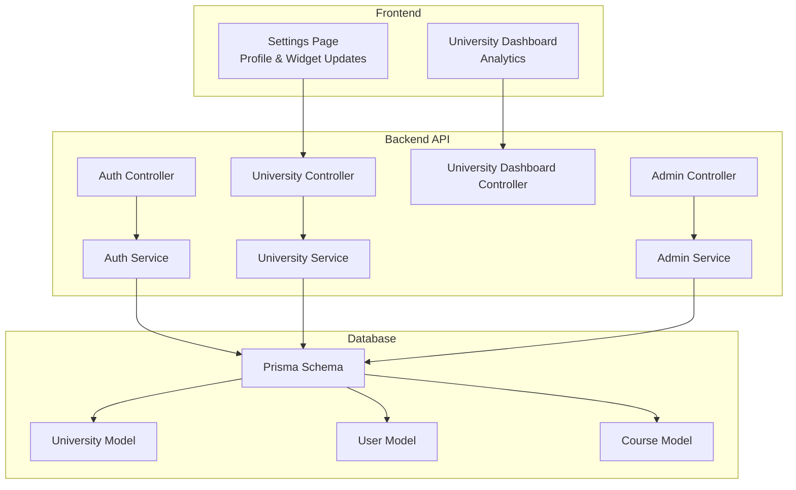
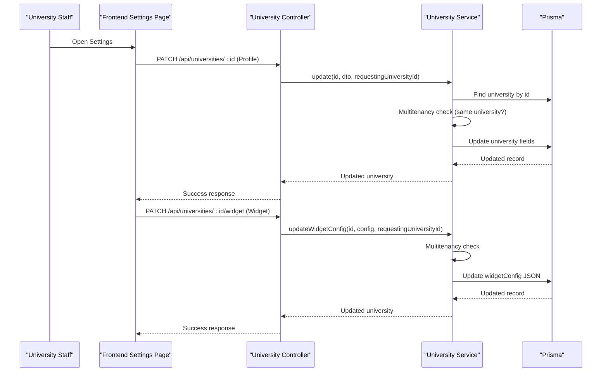
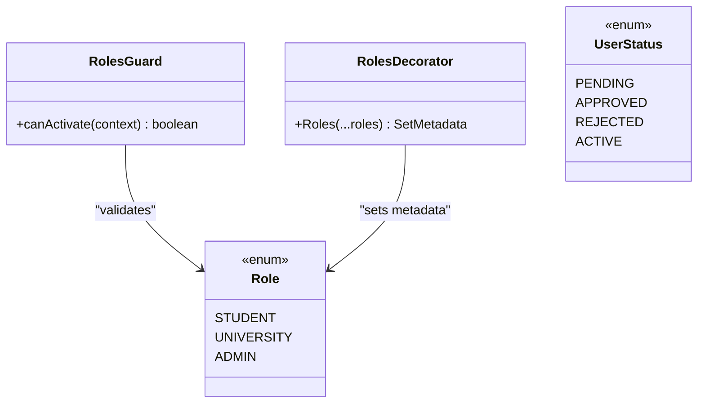
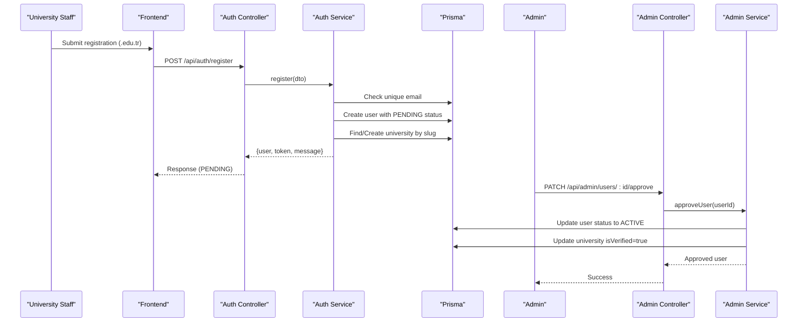
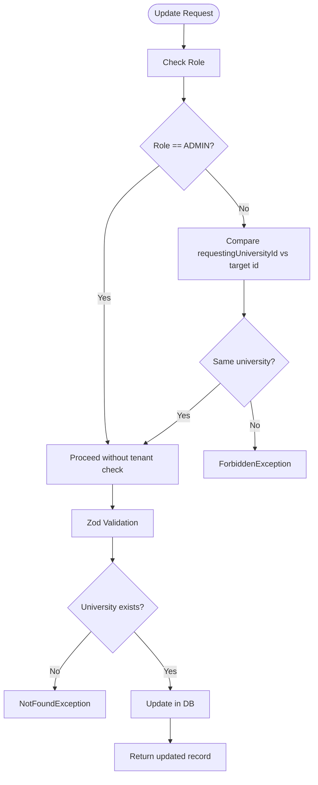
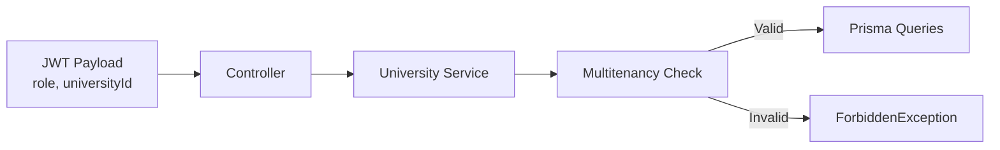
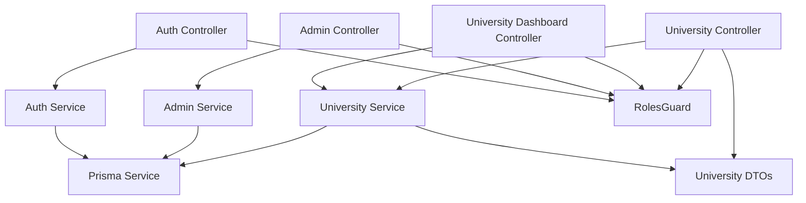

# University Profile Management

<cite>
**Referenced Files in This Document**
- [university.controller.ts](file://apps/api/src/modules/university/university.controller.ts)
- [university.service.ts](file://apps/api/src/modules/university/university.service.ts)
- [university.dto.ts](file://apps/api/src/modules/university/university.dto.ts)
- [university-dashboard.controller.ts](file://apps/api/src/modules/university/university-dashboard.controller.ts)
- [auth.service.ts](file://apps/api/src/modules/auth/auth.service.ts)
- [auth.controller.ts](file://apps/api/src/modules/auth/auth.controller.ts)
- [admin.controller.ts](file://apps/api/src/modules/admin/admin.controller.ts)
- [admin.service.ts](file://apps/api/src/modules/admin/admin.service.ts)
- [roles.guard.ts](file://apps/api/src/common/guards/roles.guard.ts)
- [roles.decorator.ts](file://apps/api/src/common/decorators/roles.decorator.ts)
- [roles.ts](file://apps/api/src/common/constants/roles.ts)
- [schema.prisma](file://apps/api/prisma/schema.prisma)
- [api.ts](file://apps/web/lib/api.ts)
- [settings.page.tsx](file://apps/web/app/dashboard/settings/page.tsx)
- [university.dashboard.page.tsx](file://apps/web/app/dashboard/university/page.tsx)
</cite>

## Table of Contents
1. [Introduction](#introduction)
2. [Project Structure](#project-structure)
3. [Core Components](#core-components)
4. [Architecture Overview](#architecture-overview)
5. [Detailed Component Analysis](#detailed-component-analysis)
6. [Dependency Analysis](#dependency-analysis)
7. [Performance Considerations](#performance-considerations)
8. [Troubleshooting Guide](#troubleshooting-guide)
9. [Conclusion](#conclusion)

## Introduction
This document describes the complete university profile management functionality, including creation, updates, verification workflows, role-based access control, registration process, validation schemas, data integrity constraints, and multitenancy implementation. It covers both backend APIs and frontend integrations, providing practical examples for university staff and administrative approval processes.

## Project Structure
The university profile management spans three main areas:
- Backend NestJS modules: Authentication, University, Admin, and shared guards/decorators/constants
- Database schema with Prisma defining University, User, and Course models and indexes
- Frontend Next.js pages integrating with university-specific APIs

**Diagram sources**
- [university.controller.ts](file://apps/api/src/modules/university/university.controller.ts#L1-L114)
- [university-dashboard.controller.ts](file://apps/api/src/modules/university/university-dashboard.controller.ts#L1-L81)
- [auth.controller.ts](file://apps/api/src/modules/auth/auth.controller.ts#L1-L28)
- [admin.controller.ts](file://apps/api/src/modules/admin/admin.controller.ts#L1-L119)
- [auth.service.ts](file://apps/api/src/modules/auth/auth.service.ts#L1-L205)
- [university.service.ts](file://apps/api/src/modules/university/university.service.ts#L1-L451)
- [admin.service.ts](file://apps/api/src/modules/admin/admin.service.ts#L1-L281)
- [schema.prisma](file://apps/api/prisma/schema.prisma#L1-L183)

**Section sources**
- [university.controller.ts](file://apps/api/src/modules/university/university.controller.ts#L1-L114)
- [university-dashboard.controller.ts](file://apps/api/src/modules/university/university-dashboard.controller.ts#L1-L81)
- [auth.controller.ts](file://apps/api/src/modules/auth/auth.controller.ts#L1-L28)
- [admin.controller.ts](file://apps/api/src/modules/admin/admin.controller.ts#L1-L119)
- [schema.prisma](file://apps/api/prisma/schema.prisma#L1-L183)

## Core Components
- University Controller: Exposes endpoints for listing verified universities, retrieving by ID/slug, creating (ADMIN only), updating (UNIVERSITY/ADMIN), verifying (ADMIN), and updating widget configuration (UNIVERSITY).
- University Service: Implements business logic including multitenancy checks, validation via Zod schemas, slug generation, and dashboard analytics queries.
- Validation Schemas: Zod schemas for create, update, and widget configuration DTOs ensuring data integrity.
- Role-Based Access Control: Guards and decorators enforcing JWT authentication and role permissions.
- Authentication Service: Handles user registration (including UNIVERSITY role with .edu.tr validation and PENDING status), login, and token generation.
- Admin Module: Provides ADMIN-only endpoints for managing universities, approving users, and viewing statistics.
- Frontend Integration: Next.js pages for settings and dashboard integrate with university-specific APIs.

**Section sources**
- [university.controller.ts](file://apps/api/src/modules/university/university.controller.ts#L1-L114)
- [university.service.ts](file://apps/api/src/modules/university/university.service.ts#L1-L451)
- [university.dto.ts](file://apps/api/src/modules/university/university.dto.ts#L1-L48)
- [roles.guard.ts](file://apps/api/src/common/guards/roles.guard.ts#L1-L56)
- [roles.decorator.ts](file://apps/api/src/common/decorators/roles.decorator.ts#L1-L16)
- [auth.service.ts](file://apps/api/src/modules/auth/auth.service.ts#L1-L205)
- [admin.controller.ts](file://apps/api/src/modules/admin/admin.controller.ts#L1-L119)
- [admin.service.ts](file://apps/api/src/modules/admin/admin.service.ts#L1-L281)
- [api.ts](file://apps/web/lib/api.ts#L1-L200)
- [settings.page.tsx](file://apps/web/app/dashboard/settings/page.tsx#L1-L123)
- [university.dashboard.page.tsx](file://apps/web/app/dashboard/university/page.tsx#L1-L94)

## Architecture Overview
The system follows a layered architecture:
- Controllers handle HTTP requests and apply guards/decorators for authentication and authorization.
- Services encapsulate business logic, enforce multitenancy, and interact with Prisma.
- DTOs define validation schemas using Zod.
- Database schema defines models and indexes for performance and integrity.
- Frontend pages consume university-specific APIs and display analytics and settings.

**Diagram sources**
- [university.controller.ts](file://apps/api/src/modules/university/university.controller.ts#L78-L112)
- [university.service.ts](file://apps/api/src/modules/university/university.service.ts#L110-L156)
- [schema.prisma](file://apps/api/prisma/schema.prisma#L36-L58)

## Detailed Component Analysis

### Role-Based Access Control (RBAC)
- Guards and Decorators:
  - RolesGuard validates JWT user role against controller/method-declared roles.
  - Roles decorator sets metadata for required roles per endpoint.
- Roles:
  - Role enum includes STUDENT, UNIVERSITY, ADMIN.
  - UserStatus enum includes PENDING, APPROVED, REJECTED, ACTIVE.
- Application:
  - University endpoints require either UNIVERSITY or ADMIN role.
  - Widget configuration requires UNIVERSITY role.
  - Admin endpoints require ADMIN role.

**Diagram sources**
- [roles.guard.ts](file://apps/api/src/common/guards/roles.guard.ts#L1-L56)
- [roles.decorator.ts](file://apps/api/src/common/decorators/roles.decorator.ts#L1-L16)
- [roles.ts](file://apps/api/src/common/constants/roles.ts#L1-L6)
- [schema.prisma](file://apps/api/prisma/schema.prisma#L18-L31)

**Section sources**
- [roles.guard.ts](file://apps/api/src/common/guards/roles.guard.ts#L1-L56)
- [roles.decorator.ts](file://apps/api/src/common/decorators/roles.decorator.ts#L1-L16)
- [roles.ts](file://apps/api/src/common/constants/roles.ts#L1-L6)
- [schema.prisma](file://apps/api/prisma/schema.prisma#L18-L31)

### University Registration and Verification Workflow
- Registration:
  - UNIVERSITY role requires .edu.tr email; status set to PENDING.
  - STUDENT role status set to ACTIVE.
  - On registration, UNIVERSITY users may auto-create or link to an existing university with slug generation.
- Verification:
  - Admin approves users, setting status to ACTIVE and marking associated university as verified.
  - Admin can also directly verify universities.

**Diagram sources**
- [auth.controller.ts](file://apps/api/src/modules/auth/auth.controller.ts#L1-L28)
- [auth.service.ts](file://apps/api/src/modules/auth/auth.service.ts#L46-L130)
- [admin.controller.ts](file://apps/api/src/modules/admin/admin.controller.ts#L48-L78)
- [admin.service.ts](file://apps/api/src/modules/admin/admin.service.ts#L44-L92)
- [schema.prisma](file://apps/api/prisma/schema.prisma#L61-L85)

**Section sources**
- [auth.service.ts](file://apps/api/src/modules/auth/auth.service.ts#L46-L130)
- [admin.service.ts](file://apps/api/src/modules/admin/admin.service.ts#L44-L92)
- [schema.prisma](file://apps/api/prisma/schema.prisma#L61-L85)

### University Profile CRUD Operations
- Create:
  - ADMIN creates universities; slug generated from name.
  - Validation ensures uniqueness of name and slug.
- Update:
  - UNIVERSITY or ADMIN can update; multitenancy enforced (UNIVERSITY cannot edit others).
  - Zod validation applied to update DTO.
- Verify:
  - ADMIN marks university as verified.
- Widget Configuration:
  - UNIVERSITY updates widgetConfig JSON; multitenancy enforced.

**Diagram sources**
- [university.controller.ts](file://apps/api/src/modules/university/university.controller.ts#L78-L91)
- [university.service.ts](file://apps/api/src/modules/university/university.service.ts#L110-L128)
- [university.dto.ts](file://apps/api/src/modules/university/university.dto.ts#L27-L33)

**Section sources**
- [university.controller.ts](file://apps/api/src/modules/university/university.controller.ts#L68-L112)
- [university.service.ts](file://apps/api/src/modules/university/university.service.ts#L26-L156)
- [university.dto.ts](file://apps/api/src/modules/university/university.dto.ts#L9-L47)

### Validation Schemas and Data Integrity
- CreateUniversitySchema:
  - name: min 3, max 200
  - city: min 2, max 100
  - logo, website, contactEmail: optional URLs or empty
- UpdateUniversitySchema:
  - Optional fields; URLs nullable; contactEmail literal '' allowed
- WidgetConfigSchema:
  - primaryColor: hex regex; theme: enum light/dark
- Database Constraints:
  - University.name and slug unique
  - Indexes on University.city, University.isVerified
  - User.universityId relation to University
  - Course.universityId relation to University with cascade

**Section sources**
- [university.dto.ts](file://apps/api/src/modules/university/university.dto.ts#L9-L47)
- [schema.prisma](file://apps/api/prisma/schema.prisma#L36-L58)
- [schema.prisma](file://apps/api/prisma/schema.prisma#L61-L85)
- [schema.prisma](file://apps/api/prisma/schema.prisma#L88-L122)

### Multitenancy Implementation
- JWT Payload includes universityId for UNIVERSITY users.
- Controllers extract user role and universityId from request context.
- Services enforce multitenancy by comparing requestingUniversityId with target id.
- Database relations ensure referential integrity between User, University, and Course.

**Diagram sources**
- [auth.service.ts](file://apps/api/src/modules/auth/auth.service.ts#L21-L27)
- [university.controller.ts](file://apps/api/src/modules/university/university.controller.ts#L87-L90)
- [university.service.ts](file://apps/api/src/modules/university/university.service.ts#L110-L114)
- [schema.prisma](file://apps/api/prisma/schema.prisma#L71-L73)

**Section sources**
- [auth.service.ts](file://apps/api/src/modules/auth/auth.service.ts#L21-L27)
- [university.controller.ts](file://apps/api/src/modules/university/university.controller.ts#L87-L90)
- [university.service.ts](file://apps/api/src/modules/university/university.service.ts#L110-L114)
- [schema.prisma](file://apps/api/prisma/schema.prisma#L71-L73)

### Practical Workflows

#### University Staff Profile Update Scenario
- Load current profile and widget config from frontend.
- Modify website/contactEmail/logo fields.
- Send PATCH request to update university profile.
- Send PATCH request to update widgetConfig (primaryColor/theme).
- Receive success feedback and updated data.

**Section sources**
- [settings.page.tsx](file://apps/web/app/dashboard/settings/page.tsx#L53-L123)
- [api.ts](file://apps/web/lib/api.ts#L100-L165)
- [university.controller.ts](file://apps/api/src/modules/university/university.controller.ts#L78-L112)

#### Administrative Approval Process
- Admin views pending requests.
- Approves user (status ACTIVE) and verifies associated university.
- Alternatively, admin can directly create/update/delete universities.

**Section sources**
- [admin.controller.ts](file://apps/api/src/modules/admin/admin.controller.ts#L43-L83)
- [admin.service.ts](file://apps/api/src/modules/admin/admin.service.ts#L24-L92)
- [auth.service.ts](file://apps/api/src/modules/auth/auth.service.ts#L46-L130)

#### University Dashboard Analytics
- UNIVERSITY users access analytics endpoints protected by JWT + UNIVERSITY guard.
- Endpoints include overview cards, popular courses, time series, and course health.

**Section sources**
- [university-dashboard.controller.ts](file://apps/api/src/modules/university/university-dashboard.controller.ts#L25-L81)
- [university.service.ts](file://apps/api/src/modules/university/university.service.ts#L163-L430)
- [university.dashboard.page.tsx](file://apps/web/app/dashboard/university/page.tsx#L27-L94)

## Dependency Analysis
- Controllers depend on Services for business logic.
- Services depend on Prisma for data access.
- Guards and decorators enforce RBAC at controller level.
- DTOs provide validation schemas consumed by controllers and services.

**Diagram sources**
- [university.controller.ts](file://apps/api/src/modules/university/university.controller.ts#L1-L114)
- [university-dashboard.controller.ts](file://apps/api/src/modules/university/university-dashboard.controller.ts#L1-L81)
- [auth.controller.ts](file://apps/api/src/modules/auth/auth.controller.ts#L1-L28)
- [admin.controller.ts](file://apps/api/src/modules/admin/admin.controller.ts#L1-L119)
- [university.service.ts](file://apps/api/src/modules/university/university.service.ts#L1-L451)
- [admin.service.ts](file://apps/api/src/modules/admin/admin.service.ts#L1-L281)
- [auth.service.ts](file://apps/api/src/modules/auth/auth.service.ts#L1-L205)
- [roles.guard.ts](file://apps/api/src/common/guards/roles.guard.ts#L1-L56)
- [university.dto.ts](file://apps/api/src/modules/university/university.dto.ts#L1-L48)

**Section sources**
- [university.controller.ts](file://apps/api/src/modules/university/university.controller.ts#L1-L114)
- [university-dashboard.controller.ts](file://apps/api/src/modules/university/university-dashboard.controller.ts#L1-L81)
- [auth.controller.ts](file://apps/api/src/modules/auth/auth.controller.ts#L1-L28)
- [admin.controller.ts](file://apps/api/src/modules/admin/admin.controller.ts#L1-L119)
- [university.service.ts](file://apps/api/src/modules/university/university.service.ts#L1-L451)
- [admin.service.ts](file://apps/api/src/modules/admin/admin.service.ts#L1-L281)
- [auth.service.ts](file://apps/api/src/modules/auth/auth.service.ts#L1-L205)
- [roles.guard.ts](file://apps/api/src/common/guards/roles.guard.ts#L1-L56)
- [university.dto.ts](file://apps/api/src/modules/university/university.dto.ts#L1-L48)

## Performance Considerations
- Database Indexes:
  - University: city, isVerified for filtering and verification queries.
  - User: role, status, universityId for role-based and tenant queries.
  - Course: name, code, universityId, isOnline for search and filtering.
- Aggregation Queries:
  - Dashboard analytics use aggregation and raw SQL queries; ensure proper indexing for performance.
- Pagination:
  - Admin course listing supports pagination parameters to limit result size.

[No sources needed since this section provides general guidance]

## Troubleshooting Guide
- Authentication Failures:
  - UnauthorizedException for invalid credentials; ForbiddenException for rejected accounts.
- Authorization Failures:
  - ForbiddenException when roles mismatch or missing JWT; RolesGuard validates required roles.
- Resource Not Found:
  - NotFoundException for non-existent universities or courses.
- Validation Errors:
  - ZodValidationPipe triggers validation errors for DTO mismatches.
- Multitenancy Violations:
  - ForbiddenException when UNIVERSITY tries to update another university’s data.

**Section sources**
- [auth.service.ts](file://apps/api/src/modules/auth/auth.service.ts#L136-L170)
- [roles.guard.ts](file://apps/api/src/common/guards/roles.guard.ts#L44-L51)
- [university.service.ts](file://apps/api/src/modules/university/university.service.ts#L117-L118)
- [university.controller.ts](file://apps/api/src/modules/university/university.controller.ts#L87-L90)

## Conclusion
The university profile management system integrates robust role-based access control, comprehensive validation schemas, and multitenancy to ensure secure and isolated data handling. The registration and verification workflows support both automated university creation and administrative oversight. Frontend pages provide intuitive interfaces for profile updates and analytics dashboards tailored for university users.