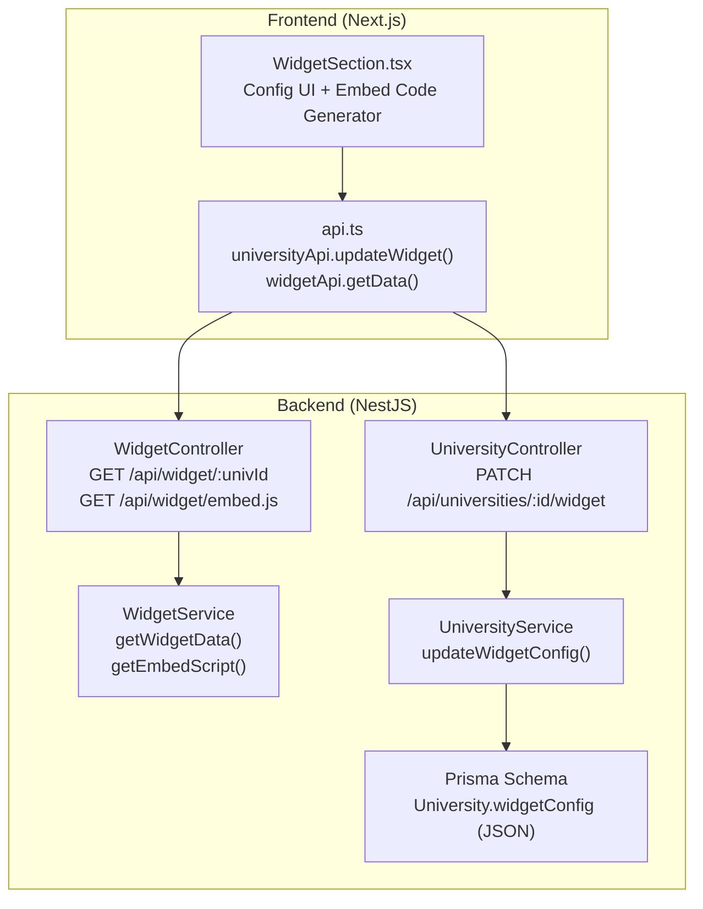
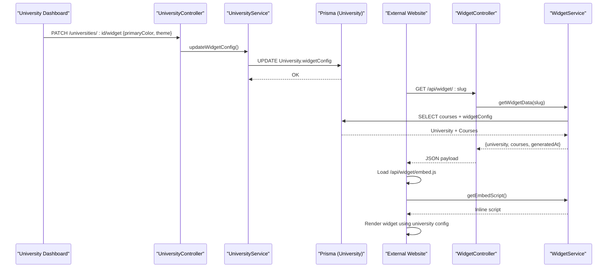
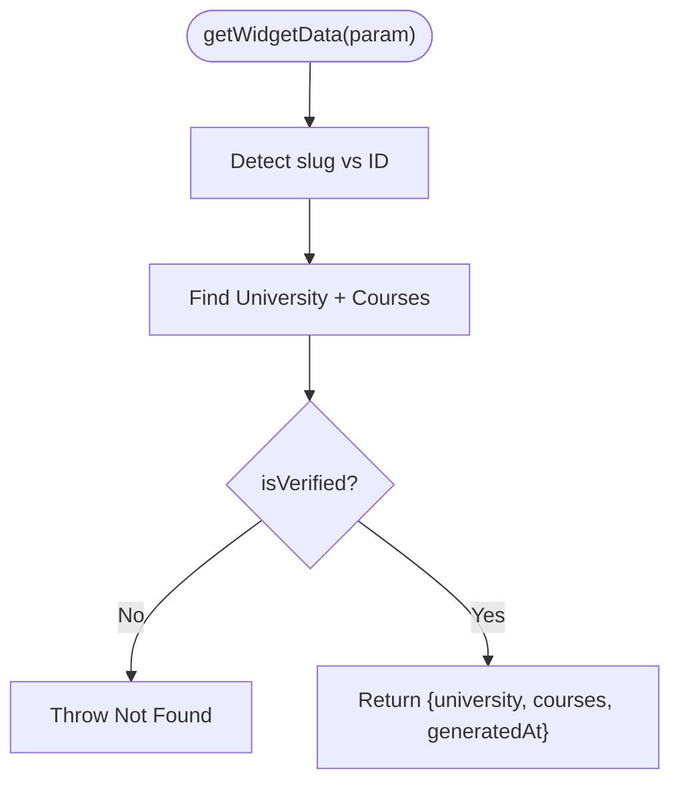

# Widget System Configuration

<cite>
**Referenced Files in This Document**
- [widget.controller.ts](file://apps/api/src/modules/widget/widget.controller.ts)
- [widget.service.ts](file://apps/api/src/modules/widget/widget.service.ts)
- [widget.module.ts](file://apps/api/src/modules/widget/widget.module.ts)
- [university.controller.ts](file://apps/api/src/modules/university/university.controller.ts)
- [university.service.ts](file://apps/api/src/modules/university/university.service.ts)
- [university.dto.ts](file://apps/api/src/modules/university/university.dto.ts)
- [schema.prisma](file://apps/api/prisma/schema.prisma)
- [WidgetSection.tsx](file://apps/web/app/dashboard/university/components/WidgetSection.tsx)
- [api.ts](file://apps/web/lib/api.ts)
- [.env.example (API)](file://apps/api/.env.example)
- [.env.local (Web)](file://apps/web/.env.local)
- [.env.example (Web)](file://apps/web/.env.example)
</cite>

## Table of Contents
1. [Introduction](#introduction)
2. [Project Structure](#project-structure)
3. [Core Components](#core-components)
4. [Architecture Overview](#architecture-overview)
5. [Detailed Component Analysis](#detailed-component-analysis)
6. [Dependency Analysis](#dependency-analysis)
7. [Performance Considerations](#performance-considerations)
8. [Troubleshooting Guide](#troubleshooting-guide)
9. [Conclusion](#conclusion)
10. [Appendices](#appendices)

## Introduction
This document explains the widget system configuration for university management, focusing on how universities can customize the appearance and functionality of embedded widgets on their websites. It covers:
- Widget configuration endpoints and validation rules
- Custom branding options (primary color) and theme management
- The relationship between university profiles and widget settings
- Practical workflows for customization, branding, and integration
- Frontend embedding patterns and backend delivery mechanisms

## Project Structure
The widget system spans both backend and frontend:
- Backend NestJS modules expose public endpoints for widget data and an embed script.
- PostgreSQL stores university profiles and a native JSON field for widget configuration.
- Frontend Next.js dashboards provide configuration UIs and generate embed codes.



**Diagram sources**
- [widget.controller.ts](file://apps/api/src/modules/widget/widget.controller.ts#L11-L29)
- [widget.service.ts](file://apps/api/src/modules/widget/widget.service.ts#L9-L108)
- [university.controller.ts](file://apps/api/src/modules/university/university.controller.ts#L101-L112)
- [university.service.ts](file://apps/api/src/modules/university/university.service.ts#L146-L156)
- [schema.prisma](file://apps/api/prisma/schema.prisma#L46-L47)
- [WidgetSection.tsx](file://apps/web/app/dashboard/university/components/WidgetSection.tsx#L26-L75)
- [api.ts](file://apps/web/lib/api.ts#L108-L112)

**Section sources**
- [widget.controller.ts](file://apps/api/src/modules/widget/widget.controller.ts#L1-L30)
- [widget.service.ts](file://apps/api/src/modules/widget/widget.service.ts#L1-L108)
- [university.controller.ts](file://apps/api/src/modules/university/university.controller.ts#L1-L114)
- [university.service.ts](file://apps/api/src/modules/university/university.service.ts#L146-L156)
- [schema.prisma](file://apps/api/prisma/schema.prisma#L36-L58)
- [WidgetSection.tsx](file://apps/web/app/dashboard/university/components/WidgetSection.tsx#L1-L219)
- [api.ts](file://apps/web/lib/api.ts#L108-L112)

## Core Components
- WidgetController: Exposes two public endpoints:
  - GET /api/widget/:univId returns university course data for the widget.
  - GET /api/widget/embed.js serves a lightweight embed script that renders the widget on external pages.
- WidgetService: Implements data retrieval and dynamic embed script generation.
- UniversityController: Provides PATCH /api/universities/:id/widget to update widget configuration per university.
- UniversityService: Persists widget configuration into the University.widgetConfig JSON field.
- Prisma Schema: Defines University with widgetConfig as native JSON with defaults.
- Frontend WidgetSection: Generates embed code and preview for university dashboards.
- Frontend API Client: Wraps university and widget endpoints for the dashboard.

Key customization options:
- Primary brand color via hex code.
- Theme selection (light/dark).

**Section sources**
- [widget.controller.ts](file://apps/api/src/modules/widget/widget.controller.ts#L11-L29)
- [widget.service.ts](file://apps/api/src/modules/widget/widget.service.ts#L14-L67)
- [university.controller.ts](file://apps/api/src/modules/university/university.controller.ts#L101-L112)
- [university.service.ts](file://apps/api/src/modules/university/university.service.ts#L146-L156)
- [university.dto.ts](file://apps/api/src/modules/university/university.dto.ts#L39-L45)
- [schema.prisma](file://apps/api/prisma/schema.prisma#L46-L47)
- [WidgetSection.tsx](file://apps/web/app/dashboard/university/components/WidgetSection.tsx#L52-L63)
- [api.ts](file://apps/web/lib/api.ts#L108-L112)

## Architecture Overview
The widget system follows a headless approach:
- Universities configure widget preferences in their dashboard.
- The backend persists preferences in the University profile.
- External websites embed a small script that requests course data from the headless endpoint.
- The script renders a styled course list based on the university’s configuration and user-provided attributes.



**Diagram sources**
- [university.controller.ts](file://apps/api/src/modules/university/university.controller.ts#L101-L112)
- [university.service.ts](file://apps/api/src/modules/university/university.service.ts#L146-L156)
- [schema.prisma](file://apps/api/prisma/schema.prisma#L46-L47)
- [widget.controller.ts](file://apps/api/src/modules/widget/widget.controller.ts#L24-L28)
- [widget.service.ts](file://apps/api/src/modules/widget/widget.service.ts#L18-L67)
- [WidgetSection.tsx](file://apps/web/app/dashboard/university/components/WidgetSection.tsx#L52-L63)

## Detailed Component Analysis

### WidgetController
- Responsibilities:
  - Serve the embed script endpoint.
  - Serve the headless widget data endpoint.
- Access:
  - Public endpoints with CORS enabled for third-party embedding.

**Section sources**
- [widget.controller.ts](file://apps/api/src/modules/widget/widget.controller.ts#L11-L29)

### WidgetService
- getWidgetData(param):
  - Resolves university by ID or slug.
  - Requires verification status for public access.
  - Returns university metadata, courses, and a generation timestamp.
- getEmbedScript():
  - Dynamically generates a script that:
    - Queries the headless endpoint with optional limit and sort parameters.
    - Reads data-theme attribute to switch light/dark mode.
    - Renders a styled course list with optional application links.



**Diagram sources**
- [widget.service.ts](file://apps/api/src/modules/widget/widget.service.ts#L18-L67)

**Section sources**
- [widget.service.ts](file://apps/api/src/modules/widget/widget.service.ts#L14-L67)

### UniversityController (Widget Config)
- Endpoint: PATCH /api/universities/:id/widget
- Guards: JWT + Roles (UNIVERSITY)
- Validation: Zod schema for widget configuration
- Behavior: Delegates to service to persist JSON config

**Section sources**
- [university.controller.ts](file://apps/api/src/modules/university/university.controller.ts#L101-L112)
- [university.dto.ts](file://apps/api/src/modules/university/university.dto.ts#L39-L45)

### UniversityService (Widget Config Persistence)
- updateWidgetConfig(id, config, requestingUniversityId):
  - Enforces multitenancy (same universityId).
  - Updates University.widgetConfig with raw JSON.

**Section sources**
- [university.service.ts](file://apps/api/src/modules/university/university.service.ts#L146-L156)

### Prisma Schema (University.widgetConfig)
- Native JSON column with default values for primaryColor and theme.
- Enables flexible extension of widget configuration without schema migrations.

**Section sources**
- [schema.prisma](file://apps/api/prisma/schema.prisma#L46-L47)

### Frontend WidgetSection (Embed Code Generation)
- Generates embed code with attributes:
  - data-university (slug)
  - data-limit
  - data-sort
  - data-theme
- Provides a live preview and copy-to-clipboard functionality.
- Also exposes the direct JSON endpoint for manual inspection.

**Section sources**
- [WidgetSection.tsx](file://apps/web/app/dashboard/university/components/WidgetSection.tsx#L52-L75)

### Frontend API Client (Integration)
- universityApi.updateWidget: PATCH university widget config.
- widgetApi.getData: GET headless widget JSON for preview/testing.

**Section sources**
- [api.ts](file://apps/web/lib/api.ts#L108-L112)
- [api.ts](file://apps/web/lib/api.ts#L288-L290)

## Dependency Analysis
- Backend coupling:
  - WidgetController depends on WidgetService.
  - UniversityController depends on UniversityService.
  - Both services depend on PrismaService for persistence.
- Frontend coupling:
  - WidgetSection depends on api.ts universityApi.updateWidget and widgetApi.getData.
  - api.ts wraps fetch with auth headers and error handling.
- Environment dependencies:
  - API_URL and NEXT_PUBLIC_API_URL define base URLs for cross-origin requests.

```mermaid
classDiagram
class WidgetController {
+getEmbedScript()
+getWidgetData(univId)
}
class WidgetService {
+getWidgetData(param)
+getEmbedScript()
}
class UniversityController {
+updateWidgetConfig(id, dto)
}
class UniversityService {
+updateWidgetConfig(id, config, requestingUniversityId)
}
class PrismaService
class WidgetSection
class APIClient
WidgetController --> WidgetService : "uses"
UniversityController --> UniversityService : "uses"
WidgetService --> PrismaService : "persists"
UniversityService --> PrismaService : "persists"
WidgetSection --> APIClient : "calls"
APIClient --> UniversityController : "PATCH /widget"
APIClient --> WidgetController : "GET /widget/ : id"
```

**Diagram sources**
- [widget.controller.ts](file://apps/api/src/modules/widget/widget.controller.ts#L11-L29)
- [widget.service.ts](file://apps/api/src/modules/widget/widget.service.ts#L9-L12)
- [university.controller.ts](file://apps/api/src/modules/university/university.controller.ts#L101-L112)
- [university.service.ts](file://apps/api/src/modules/university/university.service.ts#L14-L20)
- [WidgetSection.tsx](file://apps/web/app/dashboard/university/components/WidgetSection.tsx#L26-L75)
- [api.ts](file://apps/web/lib/api.ts#L108-L112)

**Section sources**
- [widget.controller.ts](file://apps/api/src/modules/widget/widget.controller.ts#L11-L29)
- [university.controller.ts](file://apps/api/src/modules/university/university.controller.ts#L101-L112)
- [university.service.ts](file://apps/api/src/modules/university/university.service.ts#L146-L156)
- [schema.prisma](file://apps/api/prisma/schema.prisma#L46-L47)
- [WidgetSection.tsx](file://apps/web/app/dashboard/university/components/WidgetSection.tsx#L52-L75)
- [api.ts](file://apps/web/lib/api.ts#L108-L112)

## Performance Considerations
- Caching:
  - Embed script endpoint sets a short cache header to reduce repeated downloads.
- Data shaping:
  - WidgetService limits fields returned for courses to minimize payload size.
- Sorting and filtering:
  - Frontend allows limiting and sorting via query parameters; backend supports passing these parameters to the headless endpoint.
- Network:
  - Using a single embed script reduces multiple network calls and simplifies maintenance.

**Section sources**
- [widget.controller.ts](file://apps/api/src/modules/widget/widget.controller.ts#L16-L22)
- [widget.service.ts](file://apps/api/src/modules/widget/widget.service.ts#L30-L44)

## Troubleshooting Guide
Common issues and resolutions:
- Widget does not render on external site:
  - Verify the embed script is loaded and the container has the required attributes (data-university, optional data-limit, data-sort, data-theme).
  - Confirm the university is verified; unverified entries are rejected by the widget data endpoint.
- Incorrect colors or theme:
  - Ensure primaryColor matches the expected hex format and theme is either light or dark.
  - Re-save widget configuration via the dashboard and re-copy the embed code.
- CORS errors:
  - Confirm FRONTEND_URL is configured and the embed script is served from the same origin or with appropriate CORS headers.
- Endpoint not found:
  - Ensure the university slug is correct and reachable; the headless endpoint accepts either ID or slug.

**Section sources**
- [widget.service.ts](file://apps/api/src/modules/widget/widget.service.ts#L48-L54)
- [university.dto.ts](file://apps/api/src/modules/university/university.dto.ts#L40-L44)
- [.env.example (API)](file://apps/api/.env.example#L15-L16)

## Conclusion
The widget system enables universities to tailor the appearance and behavior of course listings embedded on their websites. Through a simple JSON configuration stored in the University profile and a lightweight embed script, institutions can deliver branded, theme-aware widgets that dynamically pull course data. The provided frontend tools streamline configuration, preview, and integration, while backend validations and multitenancy safeguards maintain data integrity.

## Appendices

### Widget Configuration Schema and Validation
- Fields:
  - primaryColor: Optional hex color string.
  - theme: Optional enum with values light or dark.
- Validation ensures:
  - Hex color format compliance.
  - Theme enum membership.

**Section sources**
- [university.dto.ts](file://apps/api/src/modules/university/university.dto.ts#L39-L45)

### Environment Variables
- API server:
  - FRONTEND_URL: Controls CORS for the embed script and widget endpoints.
- Frontend:
  - NEXT_PUBLIC_API_URL: Base URL for client-side API calls (/api suffix is appended internally).
  - API_URL: Base URL for server-side requests without /api.

**Section sources**
- [.env.example (API)](file://apps/api/.env.example#L15-L16)
- [.env.local (Web)](file://apps/web/.env.local#L1-L3)
- [.env.example (Web)](file://apps/web/.env.example#L6-L12)

### Practical Workflows

#### Configure Branding and Theme
- Navigate to the university dashboard widget section.
- Set primaryColor and theme.
- Save configuration; the backend persists JSON in University.widgetConfig.
- Copy the generated embed code and paste it into the university website.

**Section sources**
- [WidgetSection.tsx](file://apps/web/app/dashboard/university/components/WidgetSection.tsx#L52-L63)
- [university.controller.ts](file://apps/api/src/modules/university/university.controller.ts#L101-L112)
- [university.service.ts](file://apps/api/src/modules/university/university.service.ts#L146-L156)

#### Preview and Test Headless Endpoint
- Use the dashboard to view the direct JSON endpoint URL.
- Open the URL in a browser to inspect the payload for the selected university.

**Section sources**
- [WidgetSection.tsx](file://apps/web/app/dashboard/university/components/WidgetSection.tsx#L72-L74)
- [api.ts](file://apps/web/lib/api.ts#L288-L290)

#### Embed Script Attributes Reference
- data-university: University slug.
- data-limit: Maximum number of courses to display.
- data-sort: Sorting criteria (e.g., popular, price, date).
- data-theme: Rendering theme (light or dark).

**Section sources**
- [WidgetSection.tsx](file://apps/web/app/dashboard/university/components/WidgetSection.tsx#L52-L63)
- [widget.service.ts](file://apps/api/src/modules/widget/widget.service.ts#L70-L106)