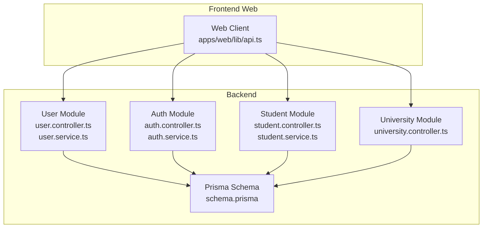
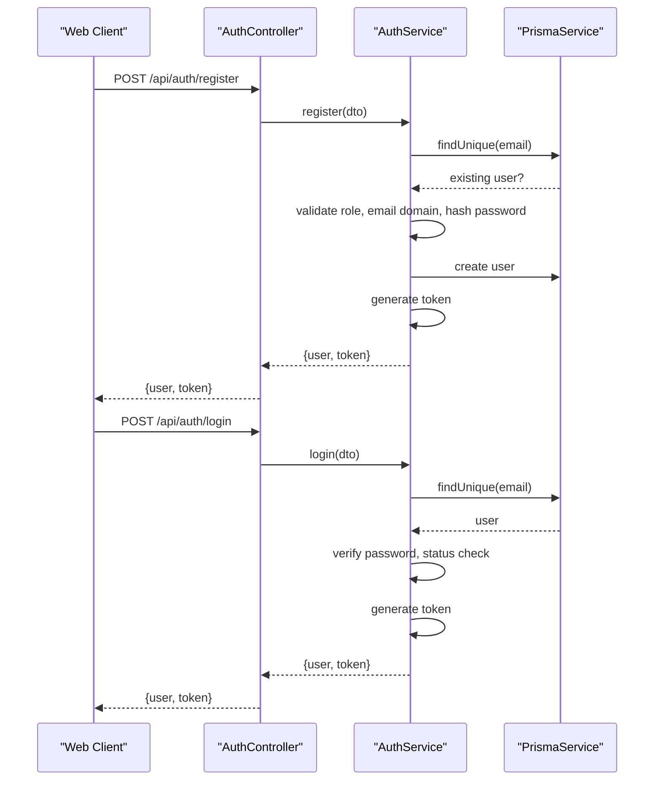
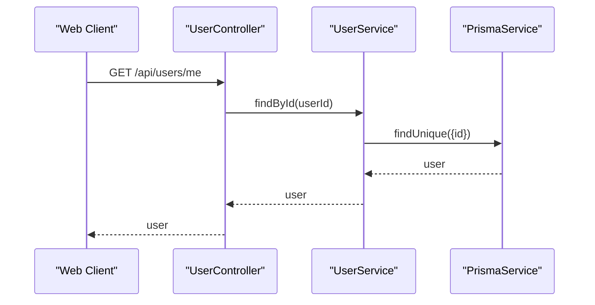
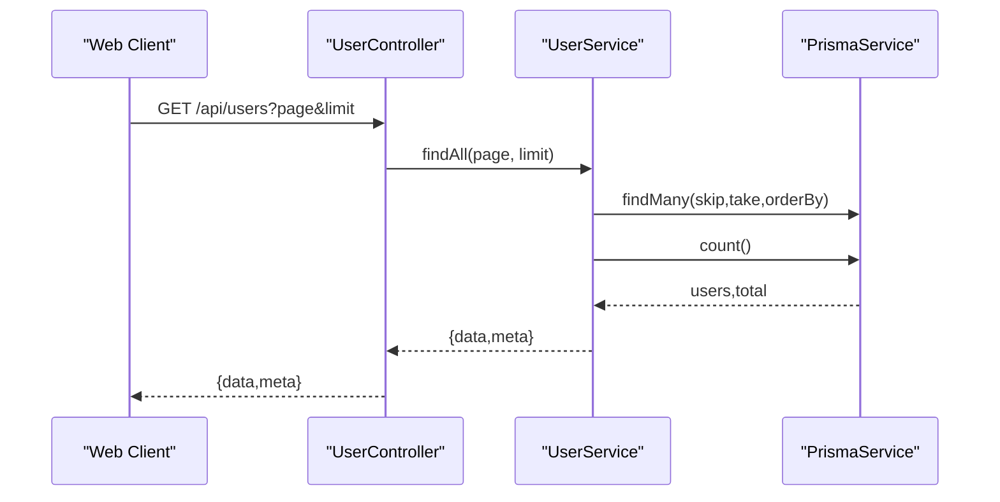
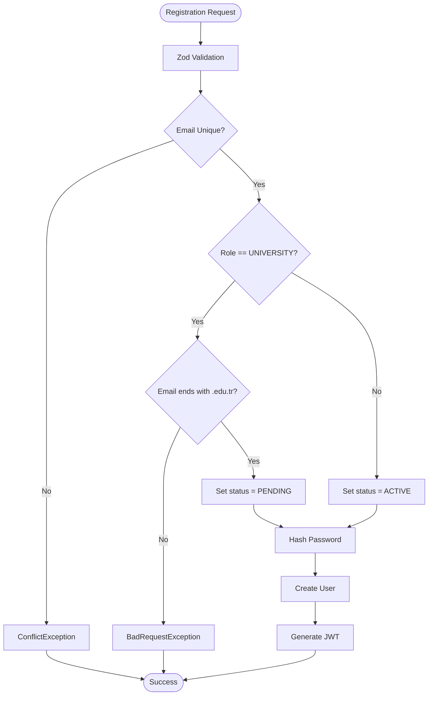
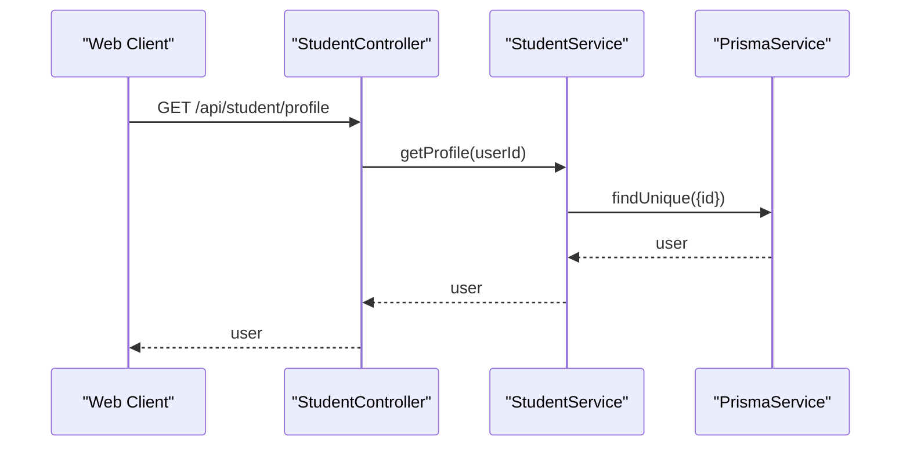
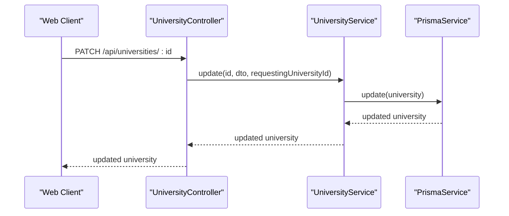
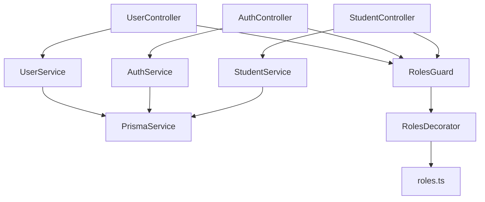

# User Management

<cite>
**Referenced Files in This Document**
- [user.controller.ts](file://apps/api/src/modules/user/user.controller.ts)
- [user.service.ts](file://apps/api/src/modules/user/user.service.ts)
- [user.module.ts](file://apps/api/src/modules/user/user.module.ts)
- [auth.controller.ts](file://apps/api/src/modules/auth/auth.controller.ts)
- [auth.service.ts](file://apps/api/src/modules/auth/auth.service.ts)
- [auth.dto.ts](file://apps/api/src/modules/auth/auth.dto.ts)
- [roles.guard.ts](file://apps/api/src/common/guards/roles.guard.ts)
- [roles.decorator.ts](file://apps/api/src/common/decorators/roles.decorator.ts)
- [roles.ts](file://apps/api/src/common/constants/roles.ts)
- [student.controller.ts](file://apps/api/src/modules/student/student.controller.ts)
- [student.service.ts](file://apps/api/src/modules/student/student.service.ts)
- [university.controller.ts](file://apps/api/src/modules/university/university.controller.ts)
- [schema.prisma](file://apps/api/prisma/schema.prisma)
- [api.ts](file://apps/web/lib/api.ts)
</cite>

## Table of Contents
1. [Introduction](#introduction)
2. [Project Structure](#project-structure)
3. [Core Components](#core-components)
4. [Architecture Overview](#architecture-overview)
5. [Detailed Component Analysis](#detailed-component-analysis)
6. [Dependency Analysis](#dependency-analysis)
7. [Performance Considerations](#performance-considerations)
8. [Troubleshooting Guide](#troubleshooting-guide)
9. [Conclusion](#conclusion)
10. [Appendices](#appendices)

## Introduction
This document provides comprehensive API documentation for user management endpoints. It covers profile retrieval, administrative listing, authentication and authorization requirements, data models, validation rules, and practical usage scenarios. It also explains the current state of user-related operations and highlights areas where additional endpoints (such as profile updates and preferences management) are not present in the current codebase.

## Project Structure
The user management functionality spans the backend NestJS modules and the frontend web client:
- Backend modules:
  - User module: exposes profile retrieval and admin listing endpoints.
  - Auth module: handles registration and login with JWT issuance.
  - Student module: provides student-specific dashboard endpoints (used by the web client).
  - University module: provides university profile and widget configuration endpoints (used by the web client).
- Frontend web client:
  - Uses typed API helpers to call backend endpoints and manage user-related data.

**Diagram sources**
- [user.controller.ts](file://apps/api/src/modules/user/user.controller.ts#L1-L39)
- [user.service.ts](file://apps/api/src/modules/user/user.service.ts#L1-L76)
- [auth.controller.ts](file://apps/api/src/modules/auth/auth.controller.ts#L1-L28)
- [auth.service.ts](file://apps/api/src/modules/auth/auth.service.ts#L1-L205)
- [student.controller.ts](file://apps/api/src/modules/student/student.controller.ts#L1-L101)
- [student.service.ts](file://apps/api/src/modules/student/student.service.ts#L1-L292)
- [university.controller.ts](file://apps/api/src/modules/university/university.controller.ts#L79-L113)
- [schema.prisma](file://apps/api/prisma/schema.prisma#L60-L85)
- [api.ts](file://apps/web/lib/api.ts#L309-L351)

**Section sources**
- [user.controller.ts](file://apps/api/src/modules/user/user.controller.ts#L1-L39)
- [user.service.ts](file://apps/api/src/modules/user/user.service.ts#L1-L76)
- [auth.controller.ts](file://apps/api/src/modules/auth/auth.controller.ts#L1-L28)
- [auth.service.ts](file://apps/api/src/modules/auth/auth.service.ts#L1-L205)
- [student.controller.ts](file://apps/api/src/modules/student/student.controller.ts#L1-L101)
- [student.service.ts](file://apps/api/src/modules/student/student.service.ts#L1-L292)
- [university.controller.ts](file://apps/api/src/modules/university/university.controller.ts#L79-L113)
- [schema.prisma](file://apps/api/prisma/schema.prisma#L60-L85)
- [api.ts](file://apps/web/lib/api.ts#L309-L351)

## Core Components
- User Controller
  - Exposes GET /api/users/me for retrieving the authenticated user’s profile.
  - Exposes GET /api/users for admin-only listing of users with pagination.
- User Service
  - Implements findById to fetch a user by ID with related university data.
  - Implements findAll for paginated admin listing of users.
- Authentication and Authorization
  - Auth controller provides registration and login endpoints with Zod validation.
  - Auth service manages user creation, password hashing, role/status assignment, and JWT generation.
  - Roles guard and decorator enforce role-based access control.
- Student Dashboard
  - Student controller and service expose profile, stats, favorites, search history, interactions, and recommendations.
- University Profile and Widget
  - University controller exposes PATCH endpoints for updating university profile and widget configuration.

**Section sources**
- [user.controller.ts](file://apps/api/src/modules/user/user.controller.ts#L14-L39)
- [user.service.ts](file://apps/api/src/modules/user/user.service.ts#L15-L74)
- [auth.controller.ts](file://apps/api/src/modules/auth/auth.controller.ts#L12-L27)
- [auth.service.ts](file://apps/api/src/modules/auth/auth.service.ts#L46-L130)
- [roles.guard.ts](file://apps/api/src/common/guards/roles.guard.ts#L20-L54)
- [roles.decorator.ts](file://apps/api/src/common/decorators/roles.decorator.ts#L9-L15)
- [student.controller.ts](file://apps/api/src/modules/student/student.controller.ts#L31-L100)
- [student.service.ts](file://apps/api/src/modules/student/student.service.ts#L21-L100)
- [university.controller.ts](file://apps/api/src/modules/university/university.controller.ts#L79-L113)

## Architecture Overview
The system follows a layered architecture:
- Controllers handle HTTP requests and apply guards and decorators for authentication and authorization.
- Services encapsulate business logic and interact with Prisma for data persistence.
- Guards and decorators enforce role-based access control.
- DTOs define request schemas validated by Zod pipes.

**Diagram sources**
- [auth.controller.ts](file://apps/api/src/modules/auth/auth.controller.ts#L12-L27)
- [auth.service.ts](file://apps/api/src/modules/auth/auth.service.ts#L46-L170)
- [roles.guard.ts](file://apps/api/src/common/guards/roles.guard.ts#L24-L54)

## Detailed Component Analysis

### User Profile Retrieval (GET /api/users/me)
- Purpose: Return the authenticated user’s profile.
- Authentication: Requires a valid JWT bearer token.
- Authorization: No role restriction; accessible to all authenticated users.
- Response: Includes user fields and related university data when applicable.
- Validation: None at controller level; relies on JWT guard.

**Diagram sources**
- [user.controller.ts](file://apps/api/src/modules/user/user.controller.ts#L19-L24)
- [user.service.ts](file://apps/api/src/modules/user/user.service.ts#L15-L42)

**Section sources**
- [user.controller.ts](file://apps/api/src/modules/user/user.controller.ts#L19-L24)
- [user.service.ts](file://apps/api/src/modules/user/user.service.ts#L15-L42)

### Admin User Listing (GET /api/users)
- Purpose: Retrieve a paginated list of all users.
- Authentication: Requires a valid JWT bearer token.
- Authorization: Role-based; only ADMIN users can access.
- Pagination: Accepts page and limit query parameters with defaults.
- Response: Returns data array and metadata (total, page, limit, totalPages).

**Diagram sources**
- [user.controller.ts](file://apps/api/src/modules/user/user.controller.ts#L26-L38)
- [user.service.ts](file://apps/api/src/modules/user/user.service.ts#L44-L74)

**Section sources**
- [user.controller.ts](file://apps/api/src/modules/user/user.controller.ts#L26-L38)
- [user.service.ts](file://apps/api/src/modules/user/user.service.ts#L44-L74)

### Authentication and Authorization
- Registration
  - Validates input via Zod schema.
  - Ensures email uniqueness.
  - Enforces .edu.tr domain for UNIVERSITY role.
  - Assigns status based on role (PENDING for UNIVERSITY, ACTIVE otherwise).
  - Hashes password and creates user.
  - Generates JWT token.
- Login
  - Finds user by email.
  - Compares hashed password.
  - Blocks REJECTED users.
  - Generates JWT token.
- Role-Based Access Control
  - Roles guard checks user role against required roles.
  - Roles decorator sets required roles per endpoint.

**Diagram sources**
- [auth.controller.ts](file://apps/api/src/modules/auth/auth.controller.ts#L16-L20)
- [auth.service.ts](file://apps/api/src/modules/auth/auth.service.ts#L46-L130)
- [auth.dto.ts](file://apps/api/src/modules/auth/auth.dto.ts#L9-L30)
- [roles.guard.ts](file://apps/api/src/common/guards/roles.guard.ts#L24-L54)

**Section sources**
- [auth.controller.ts](file://apps/api/src/modules/auth/auth.controller.ts#L16-L26)
- [auth.service.ts](file://apps/api/src/modules/auth/auth.service.ts#L46-L170)
- [auth.dto.ts](file://apps/api/src/modules/auth/auth.dto.ts#L9-L45)
- [roles.guard.ts](file://apps/api/src/common/guards/roles.guard.ts#L24-L54)
- [roles.decorator.ts](file://apps/api/src/common/decorators/roles.decorator.ts#L9-L15)
- [roles.ts](file://apps/api/src/common/constants/roles.ts#L5)

### Student Dashboard (Related to User Preferences)
- The student module exposes endpoints that work with user preferences and interactions:
  - Profile retrieval with department and preferredCities.
  - Stats computation using search logs and interactions.
  - Favorites management (add/remove).
  - Interactions recording (VIEW, FAVORITE, APPLY).
  - Recommendations based on user interactions.
- These endpoints demonstrate how user preferences and activity influence downstream features.

**Diagram sources**
- [student.controller.ts](file://apps/api/src/modules/student/student.controller.ts#L37-L41)
- [student.service.ts](file://apps/api/src/modules/student/student.service.ts#L21-L45)

**Section sources**
- [student.controller.ts](file://apps/api/src/modules/student/student.controller.ts#L37-L100)
- [student.service.ts](file://apps/api/src/modules/student/student.service.ts#L21-L100)

### University Profile and Widget Configuration
- The university module provides PATCH endpoints for:
  - Updating university profile (website, contact email, logo).
  - Updating widget configuration (primary color, theme).
- These endpoints are guarded by JWT and roles (UNIVERSITY or ADMIN).

**Diagram sources**
- [university.controller.ts](file://apps/api/src/modules/university/university.controller.ts#L79-L91)

**Section sources**
- [university.controller.ts](file://apps/api/src/modules/university/university.controller.ts#L79-L113)

## Dependency Analysis
- Controllers depend on services for business logic.
- Services depend on Prisma for data access.
- Guards and decorators enforce access control at runtime.
- DTOs and Zod pipes validate request payloads.

**Diagram sources**
- [user.controller.ts](file://apps/api/src/modules/user/user.controller.ts#L14-L39)
- [user.service.ts](file://apps/api/src/modules/user/user.service.ts#L13)
- [auth.controller.ts](file://apps/api/src/modules/auth/auth.controller.ts#L12-L27)
- [auth.service.ts](file://apps/api/src/modules/auth/auth.service.ts#L36-L39)
- [student.controller.ts](file://apps/api/src/modules/student/student.controller.ts#L31-L100)
- [student.service.ts](file://apps/api/src/modules/student/student.service.ts#L19)
- [roles.guard.ts](file://apps/api/src/common/guards/roles.guard.ts#L21-L54)
- [roles.decorator.ts](file://apps/api/src/common/decorators/roles.decorator.ts#L9-L15)
- [roles.ts](file://apps/api/src/common/constants/roles.ts#L5)

**Section sources**
- [user.controller.ts](file://apps/api/src/modules/user/user.controller.ts#L14-L39)
- [user.service.ts](file://apps/api/src/modules/user/user.service.ts#L13)
- [auth.controller.ts](file://apps/api/src/modules/auth/auth.controller.ts#L12-L27)
- [auth.service.ts](file://apps/api/src/modules/auth/auth.service.ts#L36-L39)
- [student.controller.ts](file://apps/api/src/modules/student/student.controller.ts#L31-L100)
- [student.service.ts](file://apps/api/src/modules/student/student.service.ts#L19)
- [roles.guard.ts](file://apps/api/src/common/guards/roles.guard.ts#L21-L54)
- [roles.decorator.ts](file://apps/api/src/common/decorators/roles.decorator.ts#L9-L15)
- [roles.ts](file://apps/api/src/common/constants/roles.ts#L5)

## Performance Considerations
- Pagination: The admin listing endpoint supports pagination to avoid large payloads.
- Indexes: Prisma schema defines indexes on frequently queried fields (role, status, universityId).
- Asynchronous operations: Services use Promise.all for concurrent counts and queries.
- Token-based auth: Avoids repeated database lookups for session validation.

[No sources needed since this section provides general guidance]

## Troubleshooting Guide
Common errors and their likely causes:
- 401 Unauthorized
  - Missing or invalid JWT token.
  - Causes: Not sending Authorization header, expired token, malformed token.
- 403 Forbidden
  - Insufficient permissions for protected routes.
  - Causes: Missing ADMIN role for admin endpoints; missing JWT user context.
- 404 Not Found
  - User not found by ID.
  - Causes: Invalid user ID or user deleted.
- 409 Conflict
  - Duplicate email during registration.
  - Causes: Email already exists in the database.
- 400 Bad Request
  - Validation failures or invalid domain for UNIVERSITY role.
  - Causes: Zod validation errors; non-.edu.tr email for UNIVERSITY role.

Mitigation steps:
- Verify JWT presence and correctness.
- Confirm user role matches required roles.
- Validate request payloads against DTO schemas.
- Check database constraints and indexes.

**Section sources**
- [roles.guard.ts](file://apps/api/src/common/guards/roles.guard.ts#L40-L51)
- [user.service.ts](file://apps/api/src/modules/user/user.service.ts#L37-L41)
- [auth.service.ts](file://apps/api/src/modules/auth/auth.service.ts#L48-L64)
- [auth.dto.ts](file://apps/api/src/modules/auth/auth.dto.ts#L9-L45)

## Conclusion
The current backend provides robust authentication and user profile retrieval, along with admin-only user listing. Student and university modules complement user data with preferences and university-specific configurations. Profile update and preferences management endpoints are not present in the current codebase; extending the user module with PATCH endpoints would enable full CRUD capabilities for user profiles.

[No sources needed since this section summarizes without analyzing specific files]

## Appendices

### API Reference

- GET /api/users/me
  - Description: Retrieve the authenticated user’s profile.
  - Authentication: Required (JWT).
  - Authorization: None (any authenticated user).
  - Query parameters: None.
  - Response: User object with selected fields and optional university relation.
  - Example response keys: id, email, fullName, role, status, universityId, university.*, createdAt.

- GET /api/users
  - Description: List all users (admin-only).
  - Authentication: Required (JWT).
  - Authorization: ADMIN.
  - Query parameters:
    - page: integer, default 1.
    - limit: integer, default 20.
  - Response: { data: User[], meta: { total, page, limit, totalPages } }.

- POST /api/auth/register
  - Description: Register a new user.
  - Authentication: Not required.
  - Authorization: Not applicable.
  - Request body: RegisterDto (Zod validated).
    - Fields: email, password, fullName (optional), role (STUDENT|UNIVERSITY|ADMIN, default STUDENT), universityId (optional), universityName (optional), city (optional).
  - Response: { user, token, message }.

- POST /api/auth/login
  - Description: Authenticate user and issue JWT.
  - Authentication: Not required.
  - Authorization: Not applicable.
  - Request body: LoginDto (Zod validated).
    - Fields: email, password.
  - Response: { user, token }.

- Notes on Additional Operations
  - Profile updates and preferences management are not implemented in the user module.
  - University profile and widget configuration updates are available via university endpoints.

**Section sources**
- [user.controller.ts](file://apps/api/src/modules/user/user.controller.ts#L19-L38)
- [user.service.ts](file://apps/api/src/modules/user/user.service.ts#L15-L74)
- [auth.controller.ts](file://apps/api/src/modules/auth/auth.controller.ts#L16-L26)
- [auth.dto.ts](file://apps/api/src/modules/auth/auth.dto.ts#L9-L45)
- [university.controller.ts](file://apps/api/src/modules/university/university.controller.ts#L79-L113)

### Data Models and Field Definitions

- User Model (selected fields)
  - id: string (UUID)
  - email: string (unique)
  - passwordHash: string
  - fullName: string?
  - role: Role (STUDENT|UNIVERSITY|ADMIN)
  - status: UserStatus (PENDING|APPROVED|REJECTED|ACTIVE)
  - department: string?
  - preferredCities: JSON array of strings?
  - universityId: string? (relation to University)
  - createdAt, updatedAt: datetime

- University Model (selected fields)
  - id: string (UUID)
  - name: string (unique)
  - slug: string (unique)
  - city: string
  - logo: string?
  - website: string?
  - contactEmail: string?
  - isVerified: boolean
  - widgetConfig: JSON (primaryColor, theme)
  - createdAt, updatedAt: datetime

- Enums
  - Role: STUDENT, UNIVERSITY, ADMIN
  - UserStatus: PENDING, APPROVED, REJECTED, ACTIVE

**Section sources**
- [schema.prisma](file://apps/api/prisma/schema.prisma#L60-L85)
- [schema.prisma](file://apps/api/prisma/schema.prisma#L36-L58)
- [roles.ts](file://apps/api/src/common/constants/roles.ts#L5)

### Business Rules
- Role-based access:
  - ADMIN can list all users.
  - STUDENT can access student dashboard endpoints.
  - UNIVERSITY can update university profile and widget config.
- Registration rules:
  - UNIVERSITY role requires .edu.tr email.
  - UNIVERSITY registration sets status to PENDING; others to ACTIVE.
- Login rules:
  - REJECTED users cannot log in.
- Multitenancy:
  - UNIVERSITY users are associated with a university via universityId.

**Section sources**
- [roles.guard.ts](file://apps/api/src/common/guards/roles.guard.ts#L24-L54)
- [auth.service.ts](file://apps/api/src/modules/auth/auth.service.ts#L57-L68)
- [auth.service.ts](file://apps/api/src/modules/auth/auth.service.ts#L150-L153)
- [schema.prisma](file://apps/api/prisma/schema.prisma#L71-L73)

### Practical Scenarios

- Scenario 1: Student retrieves personal profile
  - Call GET /api/student/profile as STUDENT.
  - Response includes fullName, email, department, preferredCities, and university info if linked.

- Scenario 2: Admin lists users with pagination
  - Call GET /api/users?page=1&limit=20 as ADMIN.
  - Response includes data and metadata for pagination.

- Scenario 3: University profile update
  - Call PATCH /api/universities/:id with fields like website, contactEmail, logo as UNIVERSITY or ADMIN.
  - Response includes updated university data.

- Scenario 4: Widget configuration update
  - Call PATCH /api/universities/:id/widget with primaryColor and theme as UNIVERSITY.
  - Response confirms updated configuration.

**Section sources**
- [student.controller.ts](file://apps/api/src/modules/student/student.controller.ts#L37-L41)
- [user.controller.ts](file://apps/api/src/modules/user/user.controller.ts#L26-L38)
- [university.controller.ts](file://apps/api/src/modules/university/university.controller.ts#L79-L113)