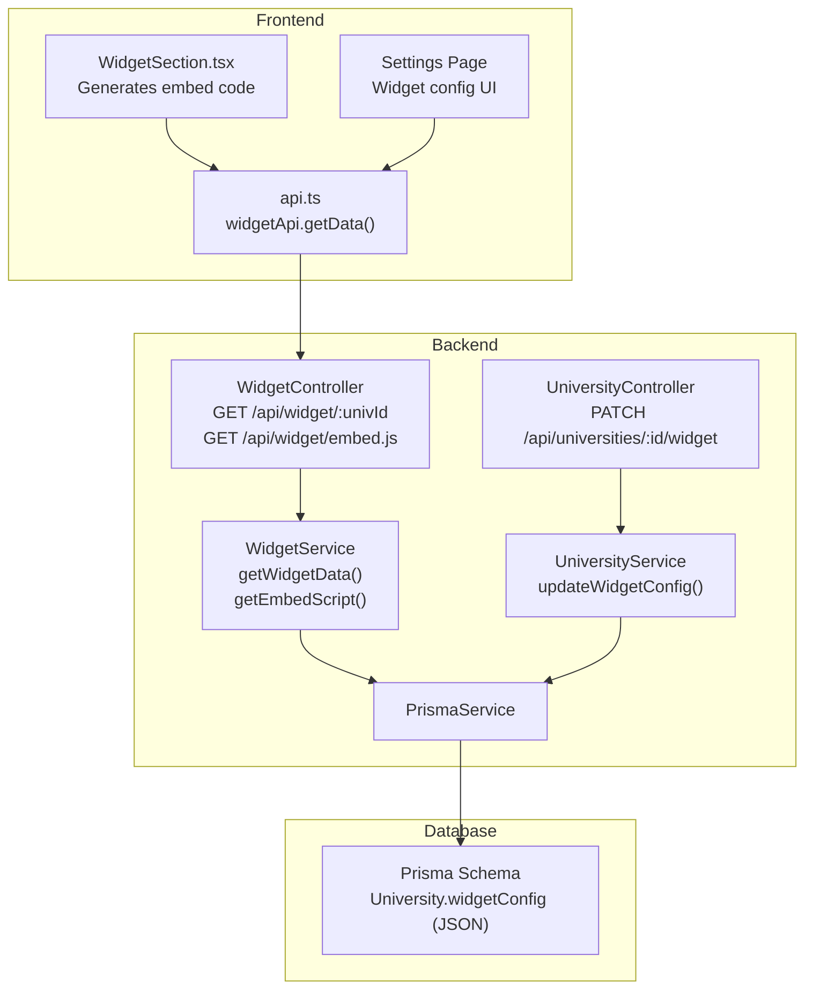
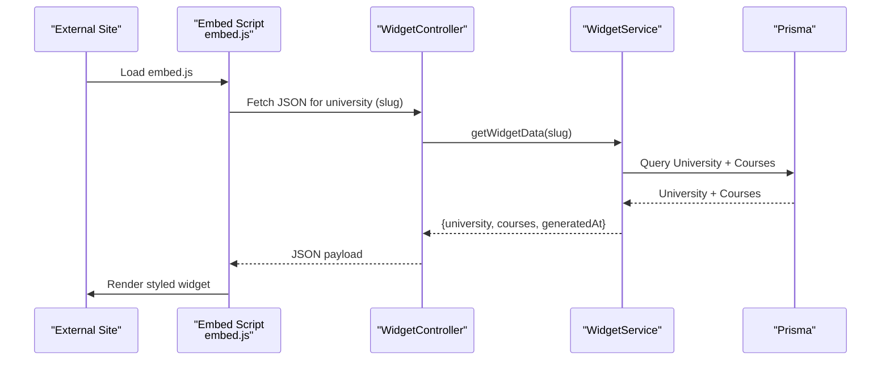
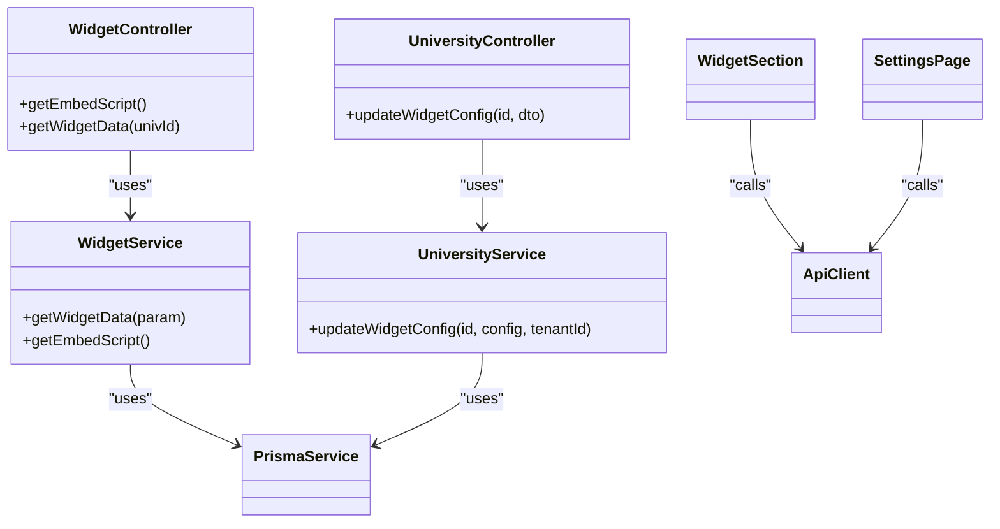
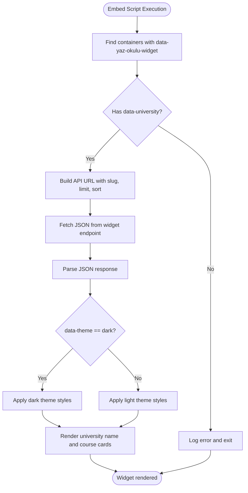

# Widget System

<cite>
**Referenced Files in This Document**
- [widget.controller.ts](file://apps/api/src/modules/widget/widget.controller.ts)
- [widget.service.ts](file://apps/api/src/modules/widget/widget.service.ts)
- [widget.module.ts](file://apps/api/src/modules/widget/widget.module.ts)
- [university.controller.ts](file://apps/api/src/modules/university/university.controller.ts)
- [university.service.ts](file://apps/api/src/modules/university/university.service.ts)
- [university.dto.ts](file://apps/api/src/modules/university/university.dto.ts)
- [schema.prisma](file://apps/api/prisma/schema.prisma)
- [WidgetSection.tsx](file://apps/web/app/dashboard/university/components/WidgetSection.tsx)
- [api.ts](file://apps/web/lib/api.ts)
- [settings.page.tsx](file://apps/web/app/dashboard/settings/page.tsx)
</cite>

## Table of Contents
1. [Introduction](#introduction)
2. [Project Structure](#project-structure)
3. [Core Components](#core-components)
4. [Architecture Overview](#architecture-overview)
5. [Detailed Component Analysis](#detailed-component-analysis)
6. [Dependency Analysis](#dependency-analysis)
7. [Performance Considerations](#performance-considerations)
8. [Troubleshooting Guide](#troubleshooting-guide)
9. [Conclusion](#conclusion)
10. [Appendices](#appendices)

## Introduction
This document provides comprehensive API documentation for the widget system that powers external site integrations. It covers:
- Widget configuration and customization
- Theme management and branding options
- Embedding capabilities and headless JSON endpoints
- Widget rendering logic and customization workflows
- University branding features exposed via the widget
- Integration patterns and deployment options
- Practical examples for configuration and branding scenarios

The widget system exposes two primary mechanisms:
- A headless JSON endpoint returning university course data for embedding
- A client-side embed script that renders the widget inside any external site

## Project Structure
The widget system spans backend NestJS modules and frontend integration components:
- Backend: Widget module (controller/service) and University module (configuration updates)
- Frontend: Next.js dashboard components that generate embed code and manage widget settings
- Database: Prisma schema defines the University model with a native JSON field for widget configuration

**Diagram sources**
- [widget.controller.ts](file://apps/api/src/modules/widget/widget.controller.ts#L11-L29)
- [widget.service.ts](file://apps/api/src/modules/widget/widget.service.ts#L9-L107)
- [university.controller.ts](file://apps/api/src/modules/university/university.controller.ts#L101-L112)
- [university.service.ts](file://apps/api/src/modules/university/university.service.ts#L146-L156)
- [WidgetSection.tsx](file://apps/web/app/dashboard/university/components/WidgetSection.tsx#L26-L84)
- [api.ts](file://apps/web/lib/api.ts#L288-L290)
- [schema.prisma](file://apps/api/prisma/schema.prisma#L36-L58)

**Section sources**
- [widget.controller.ts](file://apps/api/src/modules/widget/widget.controller.ts#L1-L30)
- [widget.service.ts](file://apps/api/src/modules/widget/widget.service.ts#L1-L108)
- [university.controller.ts](file://apps/api/src/modules/university/university.controller.ts#L1-L114)
- [university.service.ts](file://apps/api/src/modules/university/university.service.ts#L146-L156)
- [schema.prisma](file://apps/api/prisma/schema.prisma#L36-L58)
- [WidgetSection.tsx](file://apps/web/app/dashboard/university/components/WidgetSection.tsx#L1-L219)
- [api.ts](file://apps/web/lib/api.ts#L288-L290)

## Core Components
- WidgetController: Exposes public endpoints for JSON data and the embed script.
- WidgetService: Implements data retrieval and embed script generation.
- UniversityController: Provides endpoint to update widget configuration for universities.
- UniversityService: Handles persistence of widget configuration into the University model.
- Prisma Schema: Defines University with a native JSON field for widgetConfig.
- Frontend WidgetSection: Generates embed code and presents customization UI.
- API Client: Provides typed methods for widget data retrieval.

Key responsibilities:
- WidgetController delegates to WidgetService for data and script generation.
- UniversityController delegates to UniversityService for updating widgetConfig.
- Frontend components orchestrate user-driven customization and embed code generation.

**Section sources**
- [widget.controller.ts](file://apps/api/src/modules/widget/widget.controller.ts#L11-L29)
- [widget.service.ts](file://apps/api/src/modules/widget/widget.service.ts#L18-L67)
- [university.controller.ts](file://apps/api/src/modules/university/university.controller.ts#L101-L112)
- [university.service.ts](file://apps/api/src/modules/university/university.service.ts#L146-L156)
- [schema.prisma](file://apps/api/prisma/schema.prisma#L46-L47)
- [WidgetSection.tsx](file://apps/web/app/dashboard/university/components/WidgetSection.tsx#L52-L74)
- [api.ts](file://apps/web/lib/api.ts#L288-L290)

## Architecture Overview
The widget system supports two integration modes:
- Headless JSON endpoint for custom integrations
- Client-side embed script for quick placement on external sites

**Diagram sources**
- [widget.controller.ts](file://apps/api/src/modules/widget/widget.controller.ts#L16-L28)
- [widget.service.ts](file://apps/api/src/modules/widget/widget.service.ts#L18-L67)
- [schema.prisma](file://apps/api/prisma/schema.prisma#L36-L58)

## Detailed Component Analysis

### WidgetController
- Endpoints:
  - GET /api/widget/:univId: Returns JSON data for a university’s courses.
  - GET /api/widget/embed.js: Serves the embed script for client-side rendering.
- Access: Public endpoints suitable for embedding on external domains.

Behavior highlights:
- Validates university existence and verification status.
- Returns university metadata and course listings with standardized fields.

**Section sources**
- [widget.controller.ts](file://apps/api/src/modules/widget/widget.controller.ts#L15-L28)

### WidgetService
- getWidgetData(param):
  - Accepts university ID or slug.
  - Selects university metadata and course fields.
  - Ensures the university is verified; otherwise throws a not-found error.
  - Adds a generatedAt timestamp for cache-aware clients.
- getEmbedScript():
  - Builds a self-executing script that discovers containers with a specific data attribute.
  - Fetches JSON from the widget endpoint using optional query parameters.
  - Renders a styled widget with light/dark theme support and optional apply links.

Rendering logic:
- Reads data attributes from the container element to configure the widget.
- Applies theme-dependent colors for background, text, and borders.
- Iterates over courses to render titles, codes, credits, pricing, and optional apply buttons.

**Section sources**
- [widget.service.ts](file://apps/api/src/modules/widget/widget.service.ts#L18-L67)
- [widget.service.ts](file://apps/api/src/modules/widget/widget.service.ts#L70-L106)

### UniversityController and UniversityService (Widget Configuration)
- Endpoint:
  - PATCH /api/universities/:id/widget: Updates widget configuration for a university.
- Validation:
  - Uses Zod schema to validate widgetConfig fields (primaryColor, theme).
- Authorization:
  - Requires UNIVERSITY role; prevents cross-tenant updates.
- Persistence:
  - Stores configuration as native JSON in University.widgetConfig.

Widget configuration schema:
- primaryColor: Optional hex color string.
- theme: Optional enum with values "light" or "dark".

Note: The current embed script does not consume University.widgetConfig; it applies theme via data attributes on the container element. Future enhancements could integrate University.widgetConfig for brand alignment.

**Section sources**
- [university.controller.ts](file://apps/api/src/modules/university/university.controller.ts#L101-L112)
- [university.service.ts](file://apps/api/src/modules/university/university.service.ts#L146-L156)
- [university.dto.ts](file://apps/api/src/modules/university/university.dto.ts#L39-L45)
- [schema.prisma](file://apps/api/prisma/schema.prisma#L46-L47)

### Frontend Integration (Next.js)
- WidgetSection:
  - Generates embed code with data attributes for university slug, limit, sort, and theme.
  - Provides live preview of the generated API endpoint URL.
  - Copies embed code to clipboard with user feedback.
- Settings Page:
  - Presents widget configuration UI (primary color and theme).
  - Saves configuration via universityApi.updateWidget.

Integration patterns:
- Headless mode: Use widgetApi.getData to fetch JSON and render your own UI.
- Embed mode: Place the generated embed code on any page to auto-render the widget.

**Section sources**
- [WidgetSection.tsx](file://apps/web/app/dashboard/university/components/WidgetSection.tsx#L52-L74)
- [WidgetSection.tsx](file://apps/web/app/dashboard/university/components/WidgetSection.tsx#L164-L212)
- [settings.page.tsx](file://apps/web/app/dashboard/settings/page.tsx#L115-L121)
- [api.ts](file://apps/web/lib/api.ts#L288-L290)

## Dependency Analysis
The widget system exhibits clear separation of concerns:
- WidgetController depends on WidgetService for data and script generation.
- WidgetService depends on PrismaService for database queries.
- UniversityController depends on UniversityService for configuration updates.
- Frontend components depend on the API client for data retrieval and updates.

**Diagram sources**
- [widget.controller.ts](file://apps/api/src/modules/widget/widget.controller.ts#L11-L29)
- [widget.service.ts](file://apps/api/src/modules/widget/widget.service.ts#L9-L12)
- [university.controller.ts](file://apps/api/src/modules/university/university.controller.ts#L101-L112)
- [university.service.ts](file://apps/api/src/modules/university/university.service.ts#L146-L156)
- [WidgetSection.tsx](file://apps/web/app/dashboard/university/components/WidgetSection.tsx#L26-L50)
- [settings.page.tsx](file://apps/web/app/dashboard/settings/page.tsx#L28-L86)
- [api.ts](file://apps/web/lib/api.ts#L288-L290)

**Section sources**
- [widget.controller.ts](file://apps/api/src/modules/widget/widget.controller.ts#L11-L29)
- [widget.service.ts](file://apps/api/src/modules/widget/widget.service.ts#L9-L12)
- [university.controller.ts](file://apps/api/src/modules/university/university.controller.ts#L101-L112)
- [university.service.ts](file://apps/api/src/modules/university/university.service.ts#L146-L156)
- [WidgetSection.tsx](file://apps/web/app/dashboard/university/components/WidgetSection.tsx#L26-L50)
- [api.ts](file://apps/web/lib/api.ts#L288-L290)

## Performance Considerations
- Caching:
  - The embed script endpoint sets a cache header suitable for CDN caching.
  - Consider adding cache headers for the JSON endpoint to reduce repeated loads.
- Query optimization:
  - The widget data query selects only necessary fields and orders courses by name.
  - Ensure appropriate indexes exist for slug lookups and verified university filtering.
- Rendering:
  - The embed script performs a single fetch per container; avoid placing multiple containers on the same page to minimize requests.
- Theme rendering:
  - Theme selection occurs on the client; ensure minimal DOM manipulation for large course lists.

[No sources needed since this section provides general guidance]

## Troubleshooting Guide
Common issues and resolutions:
- University not found or not verified:
  - The widget data endpoint returns a not-found error if the university does not exist or is not verified.
  - Verify the university slug and ensure the account is approved.
- Missing required data attribute:
  - The embed script requires a data-university attribute; missing it logs an error and aborts rendering.
  - Ensure the generated embed code is placed correctly on the page.
- Network errors:
  - The embed script displays an error message if fetching JSON fails.
  - Check network connectivity and API availability.
- Unauthorized configuration updates:
  - Updating widget configuration requires UNIVERSITY role and tenant ownership.
  - Confirm the user’s role and that they belong to the target university.

**Section sources**
- [widget.service.ts](file://apps/api/src/modules/widget/widget.service.ts#L48-L54)
- [widget.service.ts](file://apps/api/src/modules/widget/widget.service.ts#L81-L82)
- [university.service.ts](file://apps/api/src/modules/university/university.service.ts#L148-L150)

## Conclusion
The widget system offers a flexible, extensible solution for integrating university course data into external websites. It supports both headless and embedded integration patterns, enabling universities to customize appearance and branding while maintaining centralized control over their data. The current embed script focuses on theme-based styling; future enhancements could leverage University.widgetConfig for deeper brand alignment.

[No sources needed since this section summarizes without analyzing specific files]

## Appendices

### API Definitions

- Widget JSON Endpoint
  - Method: GET
  - Path: /api/widget/{universityIdOrSlug}
  - Description: Returns university metadata and course listings for embedding.
  - Response shape:
    - university: { name, logo, website }
    - courses: array of course objects with fields such as id, code, name, ects, price, currency, isOnline, applicationUrl, startDate, endDate
    - generatedAt: ISO timestamp

- Embed Script Endpoint
  - Method: GET
  - Path: /api/widget/embed.js
  - Description: Serves the client-side script that discovers containers and renders the widget.

- University Widget Configuration Endpoint
  - Method: PATCH
  - Path: /api/universities/{id}/widget
  - Description: Updates widget configuration for a university.
  - Request body schema:
    - primaryColor: Optional hex color string
    - theme: Optional enum "light" or "dark"

**Section sources**
- [widget.controller.ts](file://apps/api/src/modules/widget/widget.controller.ts#L25-L28)
- [widget.controller.ts](file://apps/api/src/modules/widget/widget.controller.ts#L16-L22)
- [university.controller.ts](file://apps/api/src/modules/university/university.controller.ts#L101-L112)
- [university.dto.ts](file://apps/api/src/modules/university/university.dto.ts#L39-L45)

### Widget Rendering Logic

**Diagram sources**
- [widget.service.ts](file://apps/api/src/modules/widget/widget.service.ts#L70-L106)

### University Branding Features
- University metadata included in widget payload:
  - name, logo, website
- Frontend customization options:
  - Theme selection (light/dark)
  - Primary color setting (stored in University.widgetConfig but not consumed by embed script)
- Embed customization attributes:
  - data-university (required)
  - data-limit
  - data-sort
  - data-theme

**Section sources**
- [widget.service.ts](file://apps/api/src/modules/widget/widget.service.ts#L58-L66)
- [WidgetSection.tsx](file://apps/web/app/dashboard/university/components/WidgetSection.tsx#L52-L63)
- [university.dto.ts](file://apps/api/src/modules/university/university.dto.ts#L39-L45)
- [schema.prisma](file://apps/api/prisma/schema.prisma#L46-L47)

### Integration Patterns and Examples

- Headless Integration
  - Use widgetApi.getData to fetch JSON and render your own UI.
  - Example scenario: Display a responsive grid of courses with custom styling.

- Embedded Integration
  - Place the generated embed code on the page.
  - Example scenario: Add a “Summer School” course list to a university landing page.

- Customization Workflows
  - Configure theme and primary color in the settings UI.
  - Adjust limit and sort options in the widget section.
  - Copy embed code and paste into the target page.

**Section sources**
- [api.ts](file://apps/web/lib/api.ts#L288-L290)
- [WidgetSection.tsx](file://apps/web/app/dashboard/university/components/WidgetSection.tsx#L52-L74)
- [settings.page.tsx](file://apps/web/app/dashboard/settings/page.tsx#L115-L121)

### Deployment Options
- Host the embed script on your CDN for global availability.
- Ensure the JSON endpoint is accessible from external domains (CORS considerations are implied by public access).
- For high traffic, consider caching strategies and rate limiting at the gateway level.

[No sources needed since this section provides general guidance]