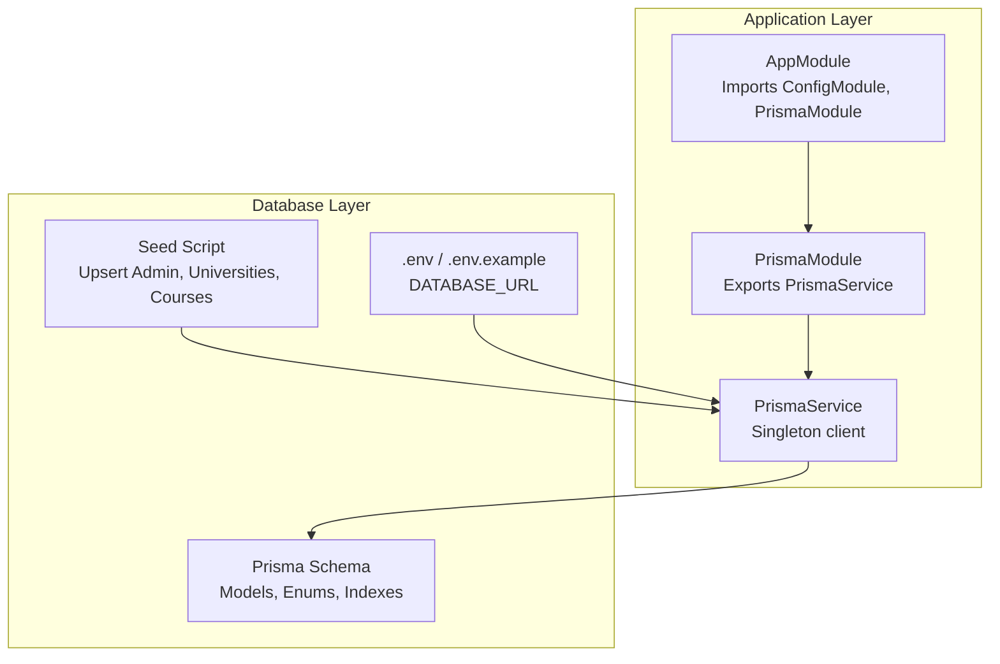
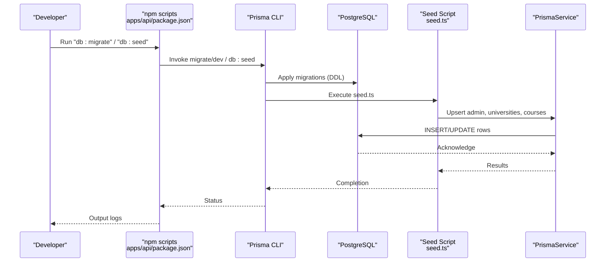
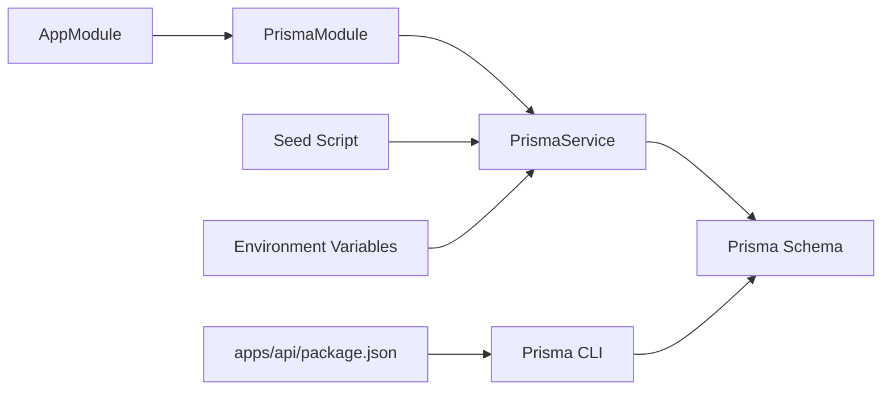

# Data Management and Operations

<cite>
**Referenced Files in This Document**
- [schema.prisma](file://apps/api/prisma/schema.prisma)
- [seed.ts](file://apps/api/prisma/seed.ts)
- [prisma.service.ts](file://apps/api/src/prisma/prisma.service.ts)
- [prisma.module.ts](file://apps/api/src/prisma/prisma.module.ts)
- [package.json](file://apps/api/package.json)
- [root package.json](file://package.json)
- [.env](file://apps/api/.env)
- [.env.example](file://apps/api/.env.example)
- [app.module.ts](file://apps/api/src/app.module.ts)
- [roles.ts](file://apps/api/src/common/constants/roles.ts)
- [migration_lock.toml](file://apps/api/prisma/migrations/migration_lock.toml)
</cite>

## Table of Contents
1. [Introduction](#introduction)
2. [Project Structure](#project-structure)
3. [Core Components](#core-components)
4. [Architecture Overview](#architecture-overview)
5. [Detailed Component Analysis](#detailed-component-analysis)
6. [Dependency Analysis](#dependency-analysis)
7. [Performance Considerations](#performance-considerations)
8. [Troubleshooting Guide](#troubleshooting-guide)
9. [Conclusion](#conclusion)
10. [Appendices](#appendices)

## Introduction
This document explains database data management operations for the project, focusing on seeding, migrations, and maintenance procedures. It covers how seed data is set up and validated, how migrations are created and executed, and how to manage concurrent migrations safely. It also outlines backup and restore strategies, data integrity checks, performance monitoring, cleanup best practices, index optimization, and maintenance tasks. The guide references the actual Prisma schema, seed script, and supporting infrastructure in the repository.

## Project Structure
The database layer is implemented with Prisma ORM in the NestJS backend application. Key elements include:
- Prisma schema defining models, enums, relations, and indexes
- Seed script for initial development data
- Prisma service and module for connection lifecycle and DI
- Environment configuration for database connectivity
- Root and app-level npm scripts orchestrating Prisma operations

**Diagram sources**
- [app.module.ts](file://apps/api/src/app.module.ts#L30-L45)
- [prisma.module.ts](file://apps/api/src/prisma/prisma.module.ts#L8-L12)
- [prisma.service.ts](file://apps/api/src/prisma/prisma.service.ts#L8-L21)
- [schema.prisma](file://apps/api/prisma/schema.prisma#L1-L183)
- [seed.ts](file://apps/api/prisma/seed.ts#L11-L106)
- [.env](file://apps/api/.env#L1-L6)

**Section sources**
- [app.module.ts](file://apps/api/src/app.module.ts#L30-L45)
- [prisma.module.ts](file://apps/api/src/prisma/prisma.module.ts#L8-L12)
- [prisma.service.ts](file://apps/api/src/prisma/prisma.service.ts#L8-L21)
- [schema.prisma](file://apps/api/prisma/schema.prisma#L1-L183)
- [seed.ts](file://apps/api/prisma/seed.ts#L11-L106)
- [.env](file://apps/api/.env#L1-L6)

## Core Components
- Prisma schema defines the data model, enums, relations, and indexes used by the application.
- Seed script initializes development data (admin user, verified universities, authorized university staff, and sample courses).
- Prisma service encapsulates the Prisma client lifecycle and logging.
- Scripts in package.json orchestrate Prisma operations (generate, migrate, push, seed, studio).

Key responsibilities:
- Data modeling and integrity via Prisma schema
- Initial dataset provisioning via seed
- Database connectivity and lifecycle via Prisma service
- Operation orchestration via npm scripts

**Section sources**
- [schema.prisma](file://apps/api/prisma/schema.prisma#L1-L183)
- [seed.ts](file://apps/api/prisma/seed.ts#L11-L106)
- [prisma.service.ts](file://apps/api/src/prisma/prisma.service.ts#L8-L21)
- [package.json](file://apps/api/package.json#L6-L18)

## Architecture Overview
The database operations pipeline integrates Prisma ORM with NestJS dependency injection and environment-driven configuration.

**Diagram sources**
- [package.json](file://apps/api/package.json#L6-L18)
- [seed.ts](file://apps/api/prisma/seed.ts#L11-L106)
- [prisma.service.ts](file://apps/api/src/prisma/prisma.service.ts#L23-L31)
- [.env](file://apps/api/.env#L1-L6)

## Detailed Component Analysis

### Seed Data Setup and Validation
Purpose:
- Populate development database with baseline data for admin, universities, authorized users, and sample courses.

Process:
- Hash passwords for secure storage
- Upsert admin user with administrative privileges
- Upsert three verified universities with slugs and metadata
- Upsert a university staff member linked to a specific university
- Create multiple courses per university with standardized attributes

Validation steps:
- Verify unique constraints (email, university slug)
- Confirm relation integrity (universityId on users and courses)
- Ensure enum defaults (Role, UserStatus) are applied consistently
- Confirm indexes exist for efficient lookups (e.g., city, isVerified, name, code)

Operational commands:
- Run seed via npm script or direct ts-node invocation

Best practices:
- Keep seed deterministic and idempotent using upserts
- Use environment variables for secrets and URLs
- Disconnect Prisma client after seeding to free resources

**Section sources**
- [seed.ts](file://apps/api/prisma/seed.ts#L11-L106)
- [schema.prisma](file://apps/api/prisma/schema.prisma#L16-L183)
- [package.json](file://apps/api/package.json#L14-L15)

### Migration Management System
Purpose:
- Manage schema evolution through Prisma migrations with safe, reproducible changes.

Lifecycle:
- Creation: Modify Prisma schema and generate migrations
- Execution: Apply migrations to the target database
- Rollback: Revert migrations when necessary (limited support in dev workflow)

Concurrency control:
- A migration lock file prevents concurrent migration runs
- The lock file records the provider and should be tracked in version control

Provider and environment:
- Provider configured as PostgreSQL
- DATABASE_URL sourced from environment variables

Scripts:
- Migrate: runs Prisma migrate dev
- Push: applies schema changes without migration history (development only)
- Studio: opens Prisma Studio for data inspection

**Section sources**
- [schema.prisma](file://apps/api/prisma/schema.prisma#L7-L10)
- [migration_lock.toml](file://apps/api/prisma/migrations/migration_lock.toml#L1-L3)
- [package.json](file://apps/api/package.json#L11-L13)
- [.env](file://apps/api/.env#L1-L1)
- [.env.example](file://apps/api/.env.example#L6-L7)

### Database Connectivity and Lifecycle
Purpose:
- Centralize database connection management and logging across the application.

Implementation:
- PrismaService extends PrismaClient and connects on module initialization
- Logs queries, info, warnings, and errors
- Disconnects gracefully on module destruction

Integration:
- PrismaModule exports PrismaService globally
- AppModule imports PrismaModule to enable DI across all feature modules

**Section sources**
- [prisma.service.ts](file://apps/api/src/prisma/prisma.service.ts#L8-L31)
- [prisma.module.ts](file://apps/api/src/prisma/prisma.module.ts#L8-L12)
- [app.module.ts](file://apps/api/src/app.module.ts#L30-L35)

### Data Integrity and Indexing
Data integrity:
- Unique constraints on email and university slug
- Enum-backed fields for roles and statuses
- Relation constraints with cascading deletes where appropriate

Indexing strategy:
- Single-column indexes on frequently filtered fields (city, isVerified, role, status, universityId)
- Composite indexes for common search patterns (name, code, universityId)
- JSON fields for flexible configuration and analytics

Enums:
- Role and UserStatus enums defined in schema and exported for use across the app

**Section sources**
- [schema.prisma](file://apps/api/prisma/schema.prisma#L16-L183)
- [roles.ts](file://apps/api/src/common/constants/roles.ts#L1-L5)

### Backup and Restore Procedures
Backup:
- Use database-native tools (e.g., logical backups) to capture the current state
- Include schema and data; consider compression and encryption for sensitive data

Restore:
- Stop application writes
- Restore database from backup
- Re-run migrations to align schema with application version
- Optionally re-run seed for development environments

Note: The repository does not define automated backup/restore scripts; implement platform-specific procedures aligned with your deployment environment.

[No sources needed since this section provides general guidance]

### Data Validation During Seeding
Recommended checks:
- Confirm admin user exists with expected role and status
- Verify universities are marked as verified and have unique slugs
- Ensure university staff members are linked to correct universities
- Validate course counts and attributes per university

Logging:
- Seed script logs progress and errors; review for failures
- PrismaService logs queries and errors; monitor for constraint violations

**Section sources**
- [seed.ts](file://apps/api/prisma/seed.ts#L11-L106)
- [prisma.service.ts](file://apps/api/src/prisma/prisma.service.ts#L14-L19)

### Migration Lock and Concurrent Migration Handling
Mechanism:
- A lock file indicates the provider and prevents concurrent migration runs
- Add the lock file to version control to coordinate team workflows

Behavior:
- Prisma migrate dev checks the lock file before applying migrations
- If locked, abort to avoid race conditions

Best practices:
- Treat the lock file as part of schema changes
- Communicate migration windows among team members
- Avoid manual edits to the lock file outside of Prisma’s control

**Section sources**
- [migration_lock.toml](file://apps/api/prisma/migrations/migration_lock.toml#L1-L3)

### Maintenance Tasks and Best Practices
Cleanup:
- Remove stale indexes if unused; monitor slow queries
- Archive old logs and analytics data periodically

Index optimization:
- Review composite indexes against query patterns
- Drop redundant single-column indexes if covered by composite ones

Performance monitoring:
- Enable query logging via PrismaService
- Use database EXPLAIN/EXPLAIN ANALYZE for slow queries
- Monitor index usage statistics

Routine maintenance:
- Regularly apply schema updates via migrations
- Validate seed data after schema changes
- Keep DATABASE_URL and credentials secure

**Section sources**
- [prisma.service.ts](file://apps/api/src/prisma/prisma.service.ts#L14-L19)
- [schema.prisma](file://apps/api/prisma/schema.prisma#L116-L122)

## Dependency Analysis
Relationships between components:
- AppModule imports PrismaModule, enabling global access to PrismaService
- PrismaService depends on Prisma Client and environment configuration
- Seed script depends on Prisma Client and bcrypt for secure hashing
- Package scripts orchestrate Prisma CLI commands

**Diagram sources**
- [app.module.ts](file://apps/api/src/app.module.ts#L30-L45)
- [prisma.module.ts](file://apps/api/src/prisma/prisma.module.ts#L8-L12)
- [prisma.service.ts](file://apps/api/src/prisma/prisma.service.ts#L8-L21)
- [schema.prisma](file://apps/api/prisma/schema.prisma#L1-L183)
- [seed.ts](file://apps/api/prisma/seed.ts#L6-L9)
- [package.json](file://apps/api/package.json#L6-L18)
- [.env](file://apps/api/.env#L1-L6)

**Section sources**
- [app.module.ts](file://apps/api/src/app.module.ts#L30-L45)
- [prisma.module.ts](file://apps/api/src/prisma/prisma.module.ts#L8-L12)
- [prisma.service.ts](file://apps/api/src/prisma/prisma.service.ts#L8-L21)
- [schema.prisma](file://apps/api/prisma/schema.prisma#L1-L183)
- [seed.ts](file://apps/api/prisma/seed.ts#L6-L9)
- [package.json](file://apps/api/package.json#L6-L18)
- [.env](file://apps/api/.env#L1-L6)

## Performance Considerations
- Use indexes strategically based on query patterns (single and composite)
- Monitor slow queries and adjust indexes accordingly
- Keep seed data minimal for development to reduce load
- Log and analyze queries via PrismaService to identify bottlenecks

[No sources needed since this section provides general guidance]

## Troubleshooting Guide
Common issues and resolutions:
- Connection failures: verify DATABASE_URL in environment variables
- Migration conflicts: check migration lock file and provider settings
- Seed errors: review bcrypt hashing and unique constraints
- Slow queries: analyze with EXPLAIN and add missing indexes

Logs and diagnostics:
- PrismaService emits query, info, warn, and error logs
- Seed script prints progress and error messages

**Section sources**
- [.env](file://apps/api/.env#L1-L6)
- [.env.example](file://apps/api/.env.example#L6-L7)
- [migration_lock.toml](file://apps/api/prisma/migrations/migration_lock.toml#L1-L3)
- [prisma.service.ts](file://apps/api/src/prisma/prisma.service.ts#L14-L19)
- [seed.ts](file://apps/api/prisma/seed.ts#L110-L113)

## Conclusion
The project’s database operations are centered on Prisma ORM with a clear separation of concerns: schema definition, seed provisioning, and connection management. Migrations are controlled via Prisma CLI and a migration lock file to prevent concurrency issues. By following the recommended practices—secure credential management, careful indexing, routine maintenance, and robust logging—you can maintain a reliable and performant data layer.

[No sources needed since this section summarizes without analyzing specific files]

## Appendices

### Appendix A: Operational Commands
- Generate Prisma client: run the generate script
- Create and apply migrations: run the migrate script
- Apply schema without history (development): run the push script
- Seed development data: run the seed script
- Inspect data: run the studio script

**Section sources**
- [package.json](file://apps/api/package.json#L11-L16)
- [root package.json](file://package.json#L10-L18)

### Appendix B: Environment Configuration
- DATABASE_URL: connection string for PostgreSQL
- JWT_SECRET: application secret (not database-related but commonly misconfigured)
- PORT and FRONTEND_URL: application settings
- REDIS_URL: cache connection (not database-related)

**Section sources**
- [.env](file://apps/api/.env#L1-L6)
- [.env.example](file://apps/api/.env.example#L6-L19)