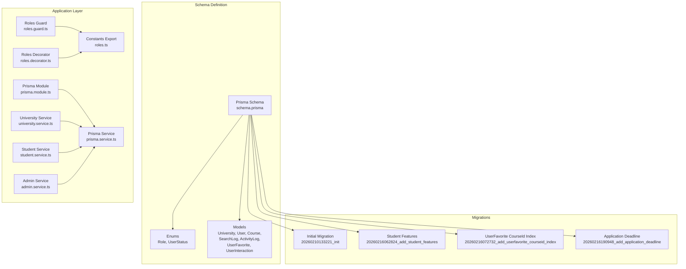
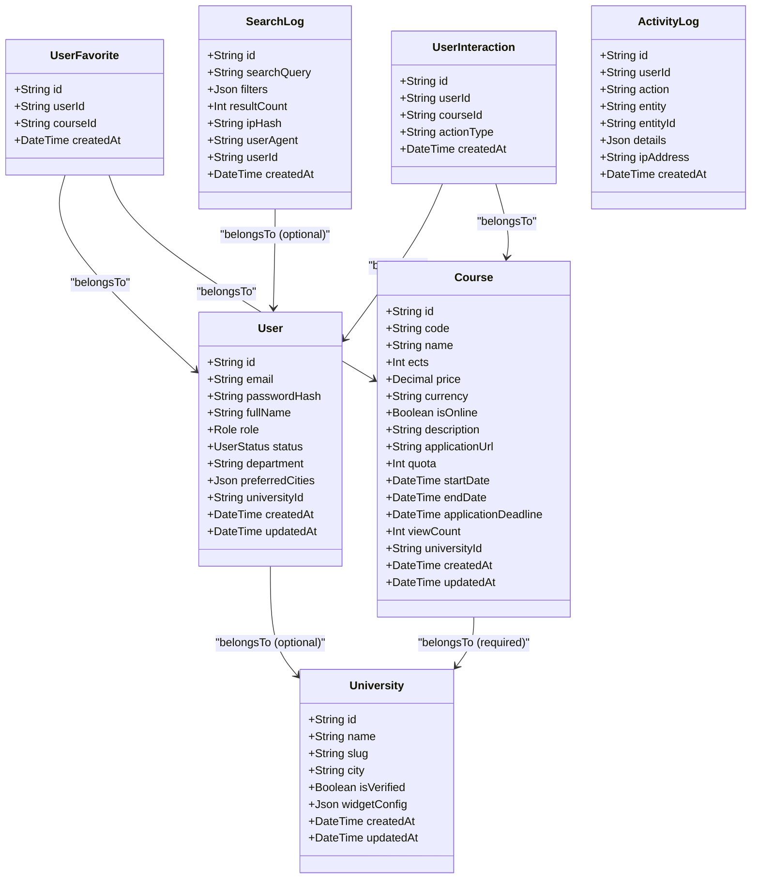
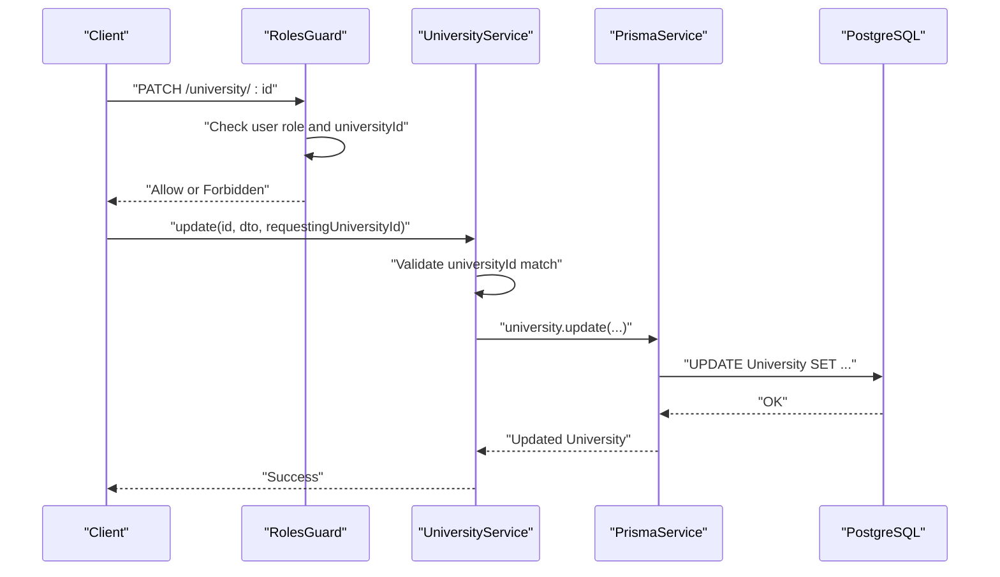
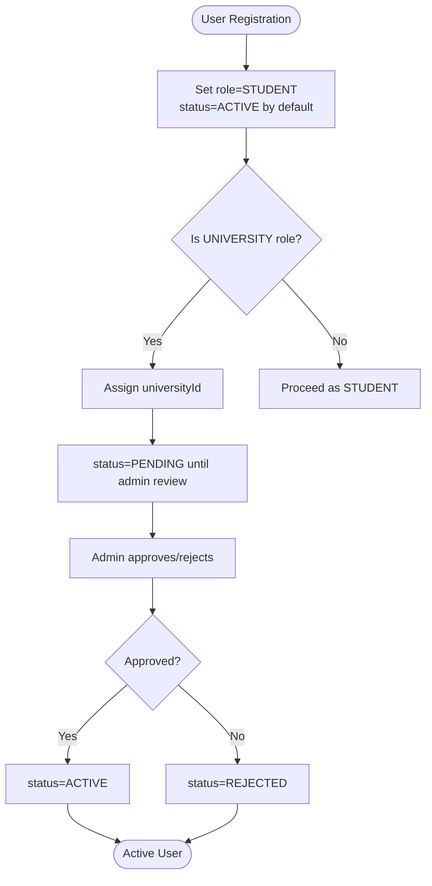
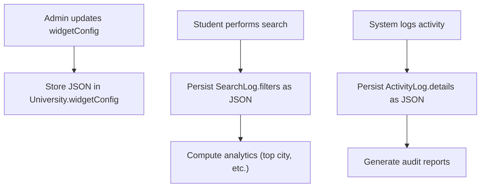
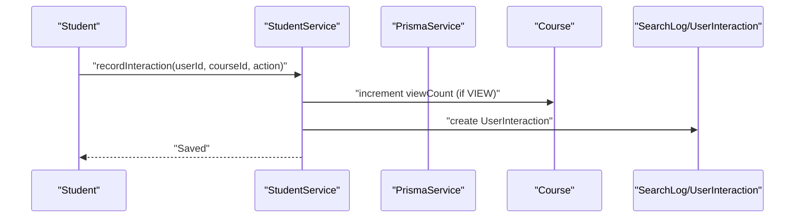
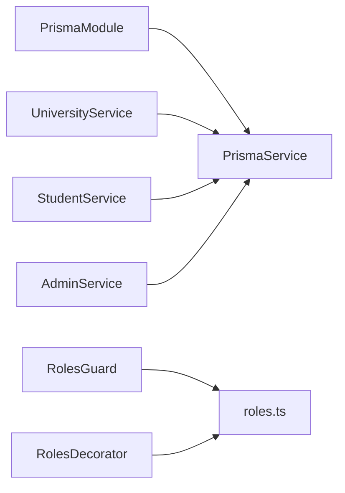

# Database Overview and Design

<cite>
**Referenced Files in This Document**
- [schema.prisma](file://apps/api/prisma/schema.prisma)
- [init migration](file://apps/api/prisma/migrations/20260210133221_init/migration.sql)
- [add_student_features migration](file://apps/api/prisma/migrations/20260216062824_add_student_features/migration.sql)
- [add_userfavorite_courseid_index migration](file://apps/api/prisma/migrations/20260216072732_add_userfavorite_courseid_index/migration.sql)
- [add_application_deadline migration](file://apps/api/prisma/migrations/20260216190948_add_application_deadline/migration.sql)
- [roles.ts](file://apps/api/src/common/constants/roles.ts)
- [roles.decorator.ts](file://apps/api/src/common/decorators/roles.decorator.ts)
- [roles.guard.ts](file://apps/api/src/common/guards/roles.guard.ts)
- [prisma.module.ts](file://apps/api/src/prisma/prisma.module.ts)
- [prisma.service.ts](file://apps/api/src/prisma/prisma.service.ts)
- [seed.ts](file://apps/api/prisma/seed.ts)
- [university.service.ts](file://apps/api/src/modules/university/university.service.ts)
- [student.service.ts](file://apps/api/src/modules/student/student.service.ts)
- [admin.service.ts](file://apps/api/src/modules/admin/admin.service.ts)
</cite>

## Table of Contents
1. [Introduction](#introduction)
2. [Project Structure](#project-structure)
3. [Core Components](#core-components)
4. [Architecture Overview](#architecture-overview)
5. [Detailed Component Analysis](#detailed-component-analysis)
6. [Dependency Analysis](#dependency-analysis)
7. [Performance Considerations](#performance-considerations)
8. [Troubleshooting Guide](#troubleshooting-guide)
9. [Conclusion](#conclusion)

## Introduction
This document explains the database design and multitenancy architecture of the application. The system uses a shared-nothing multitenancy model where each University acts as a tenant. Data isolation is enforced through universityId foreign keys on entities that belong to a university. The schema supports three primary user types (student, university staff, admin) with explicit roles and statuses. PostgreSQL native JSON fields are used for flexible configurations and analytics. The design emphasizes performance through strategic indexing and efficient query patterns.

## Project Structure
The database schema is defined using Prisma ORM with a PostgreSQL datasource. Migrations capture the evolving schema over time. Application services integrate with the database to enforce business rules and multitenancy.

**Diagram sources**
- [schema.prisma](file://apps/api/prisma/schema.prisma#L1-L183)
- [init migration](file://apps/api/prisma/migrations/20260210133221_init/migration.sql#L1-L146)
- [add_student_features migration](file://apps/api/prisma/migrations/20260216062824_add_student_features/migration.sql#L1-L58)
- [add_userfavorite_courseid_index migration](file://apps/api/prisma/migrations/20260216072732_add_userfavorite_courseid_index/migration.sql#L1-L3)
- [add_application_deadline migration](file://apps/api/prisma/migrations/20260216190948_add_application_deadline/migration.sql#L1-L3)
- [roles.guard.ts](file://apps/api/src/common/guards/roles.guard.ts#L1-L56)
- [roles.decorator.ts](file://apps/api/src/common/decorators/roles.decorator.ts#L1-L16)
- [roles.ts](file://apps/api/src/common/constants/roles.ts#L1-L6)
- [prisma.module.ts](file://apps/api/src/prisma/prisma.module.ts#L1-L14)
- [prisma.service.ts](file://apps/api/src/prisma/prisma.service.ts#L1-L33)
- [university.service.ts](file://apps/api/src/modules/university/university.service.ts#L1-L451)
- [student.service.ts](file://apps/api/src/modules/student/student.service.ts#L1-L292)
- [admin.service.ts](file://apps/api/src/modules/admin/admin.service.ts#L1-L281)

**Section sources**
- [schema.prisma](file://apps/api/prisma/schema.prisma#L1-L183)
- [init migration](file://apps/api/prisma/migrations/20260210133221_init/migration.sql#L1-L146)
- [add_student_features migration](file://apps/api/prisma/migrations/20260216062824_add_student_features/migration.sql#L1-L58)
- [add_userfavorite_courseid_index migration](file://apps/api/prisma/migrations/20260216072732_add_userfavorite_courseid_index/migration.sql#L1-L3)
- [add_application_deadline migration](file://apps/api/prisma/migrations/20260216190948_add_application_deadline/migration.sql#L1-L3)
- [prisma.module.ts](file://apps/api/src/prisma/prisma.module.ts#L1-L14)
- [prisma.service.ts](file://apps/api/src/prisma/prisma.service.ts#L1-L33)

## Core Components
- Multitenancy with University as tenant unit:
  - Entities that belong to a university include Course, UserFavorite, and UserInteraction. They reference University via universityId.
  - Data isolation is enforced by filtering queries by the requesting user’s universityId.
- Enum types:
  - Role: STUDENT, UNIVERSITY, ADMIN
  - UserStatus: PENDING, APPROVED, REJECTED, ACTIVE
- Flexible configurations:
  - University.widgetConfig is a PostgreSQL JSON field with defaults.
  - SearchLog.filters and ActivityLog.details are JSON fields for analytics and audit trails.
- Analytics and audit:
  - SearchLog captures search queries, filters, and user agent/IP.
  - ActivityLog records actions performed by users with JSON details.

**Section sources**
- [schema.prisma](file://apps/api/prisma/schema.prisma#L16-L31)
- [schema.prisma](file://apps/api/prisma/schema.prisma#L36-L58)
- [schema.prisma](file://apps/api/prisma/schema.prisma#L60-L85)
- [schema.prisma](file://apps/api/prisma/schema.prisma#L87-L122)
- [schema.prisma](file://apps/api/prisma/schema.prisma#L124-L154)
- [init migration](file://apps/api/prisma/migrations/20260210133221_init/migration.sql#L1-L146)
- [add_student_features migration](file://apps/api/prisma/migrations/20260216062824_add_student_features/migration.sql#L1-L58)

## Architecture Overview
The database architecture follows a multitenant SaaS pattern with University as the tenant. All user-facing entities are scoped to a university except for global administrative entities. The application enforces tenant boundaries at runtime using role-based guards and service-layer checks.

**Diagram sources**
- [schema.prisma](file://apps/api/prisma/schema.prisma#L36-L58)
- [schema.prisma](file://apps/api/prisma/schema.prisma#L60-L85)
- [schema.prisma](file://apps/api/prisma/schema.prisma#L87-L122)
- [schema.prisma](file://apps/api/prisma/schema.prisma#L124-L154)
- [schema.prisma](file://apps/api/prisma/schema.prisma#L156-L168)
- [schema.prisma](file://apps/api/prisma/schema.prisma#L170-L182)

## Detailed Component Analysis

### Multitenancy and Data Isolation
- Tenant unit: University
- Isolation mechanism:
  - Course.universityId is required and cascades deletes on university deletion.
  - User.universityId is optional and references University; used to scope university staff to their university.
  - UserFavorite and UserInteraction are scoped via joins through Course.universityId.
- Enforcement in services:
  - UniversityService.update and updateWidgetConfig validate that the requester’s universityId equals the target id.
  - AdminService operates globally without tenant checks.
  - StudentService restricts all queries to the requesting user’s data.

**Diagram sources**
- [roles.guard.ts](file://apps/api/src/common/guards/roles.guard.ts#L24-L54)
- [university.service.ts](file://apps/api/src/modules/university/university.service.ts#L110-L128)
- [schema.prisma](file://apps/api/prisma/schema.prisma#L104-L105)

**Section sources**
- [schema.prisma](file://apps/api/prisma/schema.prisma#L71-L73)
- [schema.prisma](file://apps/api/prisma/schema.prisma#L104-L105)
- [university.service.ts](file://apps/api/src/modules/university/university.service.ts#L110-L128)
- [student.service.ts](file://apps/api/src/modules/student/student.service.ts#L21-L45)

### Enum Types: Role and UserStatus
- Role:
  - STUDENT: Default role for learners.
  - UNIVERSITY: Staff members authorized by a university.
  - ADMIN: Platform administrators.
- UserStatus:
  - PENDING: Initial state awaiting admin approval.
  - APPROVED: Admin-approved but not necessarily active.
  - REJECTED: Rejected by admin.
  - ACTIVE: Fully active user.
- Business significance:
  - Role determines access control and allowed operations.
  - UserStatus governs account lifecycle and visibility (e.g., pending approvals).

**Diagram sources**
- [schema.prisma](file://apps/api/prisma/schema.prisma#L66-L67)
- [schema.prisma](file://apps/api/prisma/schema.prisma#L19-L23)
- [schema.prisma](file://apps/api/prisma/schema.prisma#L25-L31)
- [roles.ts](file://apps/api/src/common/constants/roles.ts#L5-L6)
- [seed.ts](file://apps/api/prisma/seed.ts#L16-L26)

**Section sources**
- [schema.prisma](file://apps/api/prisma/schema.prisma#L18-L31)
- [roles.ts](file://apps/api/src/common/constants/roles.ts#L5-L6)
- [seed.ts](file://apps/api/prisma/seed.ts#L16-L26)

### PostgreSQL Native JSON Fields
- University.widgetConfig: JSON with defaults for theme and color customization.
- SearchLog.filters: JSON for storing applied filters (e.g., city, ects).
- ActivityLog.details: JSON for capturing change details during audits.
- Usage patterns:
  - Updates to widgetConfig are stored as JSON.
  - Aggregations and analytics parse filters to compute insights (e.g., top searched city).
  - Audit trail stores structured details for compliance.

**Diagram sources**
- [schema.prisma](file://apps/api/prisma/schema.prisma#L46-L47)
- [schema.prisma](file://apps/api/prisma/schema.prisma#L128)
- [schema.prisma](file://apps/api/prisma/schema.prisma#L147)
- [university.service.ts](file://apps/api/src/modules/university/university.service.ts#L146-L156)
- [student.service.ts](file://apps/api/src/modules/student/student.service.ts#L67-L77)

**Section sources**
- [schema.prisma](file://apps/api/prisma/schema.prisma#L46-L47)
- [schema.prisma](file://apps/api/prisma/schema.prisma#L128)
- [schema.prisma](file://apps/api/prisma/schema.prisma#L147)
- [university.service.ts](file://apps/api/src/modules/university/university.service.ts#L146-L156)
- [student.service.ts](file://apps/api/src/modules/student/student.service.ts#L67-L77)

### Entity Relationships and Business Users
- Students:
  - Profile includes preferredCities JSON and department.
  - Interacts with courses (view, favorite, apply) tracked via UserInteraction and UserFavorite.
  - Dashboard analytics computed from SearchLog and UserInteraction.
- University staff:
  - Authorized by a university (UNIVERSITY role with universityId).
  - Manage courses and view university-specific dashboards.
- Admin:
  - Full access to manage users, universities, and courses.
  - Approves pending users and verifies universities.

**Diagram sources**
- [student.service.ts](file://apps/api/src/modules/student/student.service.ts#L196-L220)
- [schema.prisma](file://apps/api/prisma/schema.prisma#L177-L178)

**Section sources**
- [student.service.ts](file://apps/api/src/modules/student/student.service.ts#L21-L45)
- [student.service.ts](file://apps/api/src/modules/student/student.service.ts#L102-L119)
- [student.service.ts](file://apps/api/src/modules/student/student.service.ts#L196-L220)
- [university.service.ts](file://apps/api/src/modules/university/university.service.ts#L163-L278)
- [admin.service.ts](file://apps/api/src/modules/admin/admin.service.ts#L23-L92)

## Dependency Analysis
- Prisma module and service:
  - PrismaModule exports a singleton PrismaService.
  - PrismaService extends PrismaClient and manages connection lifecycle.
- Guards and decorators:
  - RolesGuard reads metadata set by Roles decorator to enforce role-based access.
  - Roles decorator sets metadata for endpoint-level role requirements.
- Services depend on PrismaService for database operations and enforce tenant boundaries.

**Diagram sources**
- [prisma.module.ts](file://apps/api/src/prisma/prisma.module.ts#L8-L13)
- [prisma.service.ts](file://apps/api/src/prisma/prisma.service.ts#L8-L32)
- [roles.guard.ts](file://apps/api/src/common/guards/roles.guard.ts#L20-L54)
- [roles.decorator.ts](file://apps/api/src/common/decorators/roles.decorator.ts#L15-L16)
- [roles.ts](file://apps/api/src/common/constants/roles.ts#L5-L6)
- [university.service.ts](file://apps/api/src/modules/university/university.service.ts#L17-L20)
- [student.service.ts](file://apps/api/src/modules/student/student.service.ts#L15-L19)
- [admin.service.ts](file://apps/api/src/modules/admin/admin.service.ts#L13-L17)

**Section sources**
- [prisma.module.ts](file://apps/api/src/prisma/prisma.module.ts#L8-L13)
- [prisma.service.ts](file://apps/api/src/prisma/prisma.service.ts#L8-L32)
- [roles.guard.ts](file://apps/api/src/common/guards/roles.guard.ts#L20-L54)
- [roles.decorator.ts](file://apps/api/src/common/decorators/roles.decorator.ts#L15-L16)
- [roles.ts](file://apps/api/src/common/constants/roles.ts#L5-L6)

## Performance Considerations
- Indexing strategy:
  - University: unique name/slug, city, isVerified.
  - User: unique email, role, status, universityId.
  - Course: name, code, universityId, isOnline, composite (name, code, universityId).
  - SearchLog: createdAt, searchQuery, userId.
  - ActivityLog: userId, action, createdAt.
  - UserFavorite: unique (userId, courseId), userId, courseId.
  - UserInteraction: userId, (userId, actionType).
- Query optimization patterns:
  - Use selective filters (universityId) to leverage indexes.
  - Prefer composite indexes for frequent multi-column filters (e.g., name/code/universityId).
  - Use aggregation and grouping for analytics (e.g., popular searches, dashboard metrics).
  - Use raw SQL for complex time-series aggregations to minimize ORM overhead.
- JSON fields:
  - Store flexible configurations and filters as JSON to reduce schema churn.
  - Parse JSON selectively in queries for analytics to avoid scanning entire documents.

**Section sources**
- [init migration](file://apps/api/prisma/migrations/20260210133221_init/migration.sql#L87-L139)
- [add_student_features migration](file://apps/api/prisma/migrations/20260216062824_add_student_features/migration.sql#L32-L42)
- [add_userfavorite_courseid_index migration](file://apps/api/prisma/migrations/20260216072732_add_userfavorite_courseid_index/migration.sql#L1-L2)
- [university.service.ts](file://apps/api/src/modules/university/university.service.ts#L333-L397)
- [student.service.ts](file://apps/api/src/modules/student/student.service.ts#L47-L100)

## Troubleshooting Guide
- Role and status mismatches:
  - Ensure user role and status align with intended access. Use Roles guard and decorators to enforce permissions.
- Tenant boundary violations:
  - Verify universityId checks in UniversityService and prevent cross-tenant edits.
- JSON parsing errors:
  - Validate JSON shapes for widgetConfig, filters, and details. Use defaults and defensive parsing.
- Index-related slow queries:
  - Confirm filters include indexed columns (e.g., universityId, role, status).
  - Review composite indexes for multi-column filters.

**Section sources**
- [roles.guard.ts](file://apps/api/src/common/guards/roles.guard.ts#L24-L54)
- [roles.decorator.ts](file://apps/api/src/common/decorators/roles.decorator.ts#L15-L16)
- [university.service.ts](file://apps/api/src/modules/university/university.service.ts#L110-L128)
- [schema.prisma](file://apps/api/prisma/schema.prisma#L46-L47)
- [init migration](file://apps/api/prisma/migrations/20260210133221_init/migration.sql#L87-L139)

## Conclusion
The database design centers on a robust multitenant architecture with University as the tenant unit, enforced by universityId foreign keys and service-layer checks. Role and UserStatus enums define clear user categories and lifecycle states. PostgreSQL native JSON fields enable flexible configurations and analytics while maintaining schema stability. Strategic indexing and query patterns support performance across analytics, user dashboards, and administrative reporting.