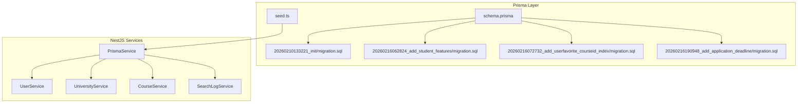
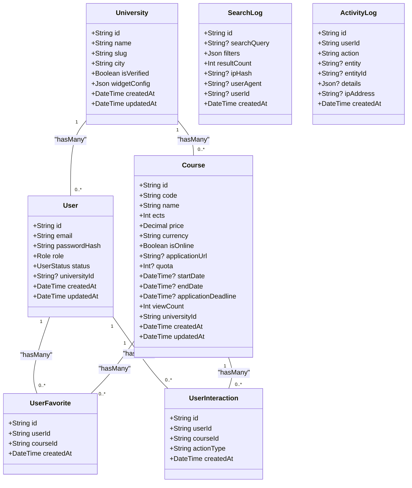
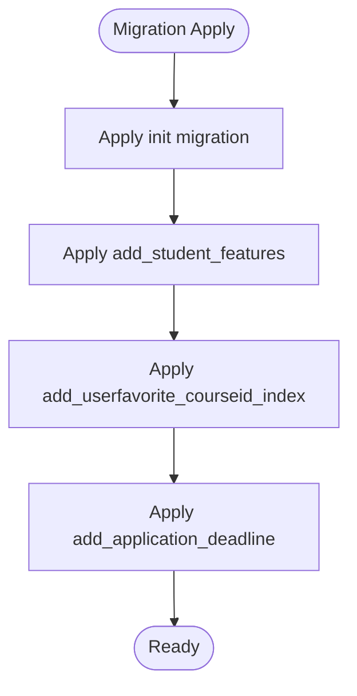
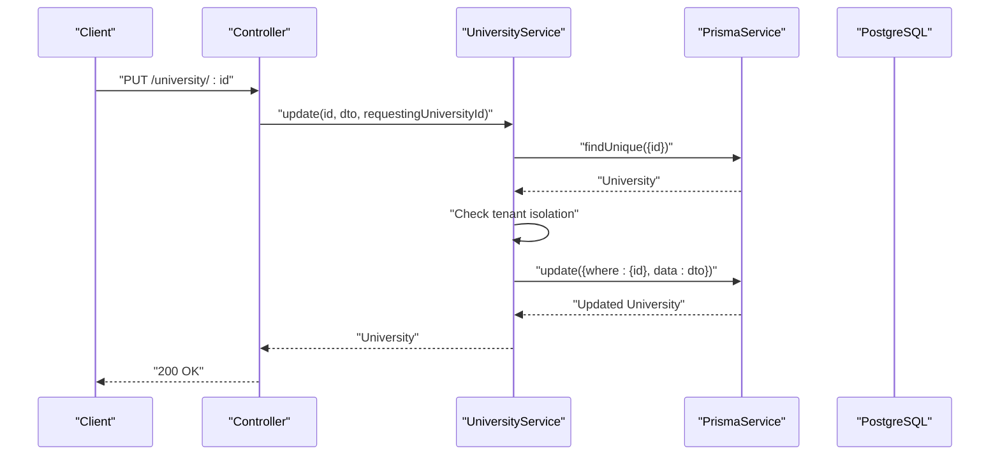
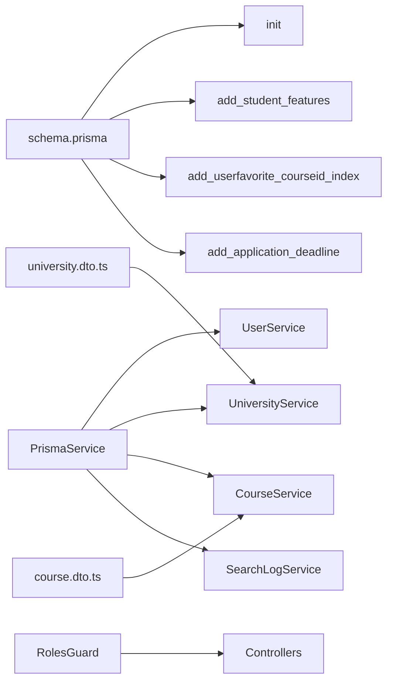

# Database Schema and ORM

<cite>
**Referenced Files in This Document**
- [schema.prisma](file://apps/api/prisma/schema.prisma)
- [migration.sql (init)](file://apps/api/prisma/migrations/20260210133221_init/migration.sql)
- [migration.sql (add_student_features)](file://apps/api/prisma/migrations/20260216062824_add_student_features/migration.sql)
- [migration.sql (add_userfavorite_courseid_index)](file://apps/api/prisma/migrations/20260216072732_add_userfavorite_courseid_index/migration.sql)
- [migration.sql (add_application_deadline)](file://apps/api/prisma/migrations/20260216190948_add_application_deadline/migration.sql)
- [seed.ts](file://apps/api/prisma/seed.ts)
- [prisma.service.ts](file://apps/api/src/prisma/prisma.service.ts)
- [user.service.ts](file://apps/api/src/modules/user/user.service.ts)
- [university.service.ts](file://apps/api/src/modules/university/university.service.ts)
- [course.service.ts](file://apps/api/src/modules/course/course.service.ts)
- [search-log.service.ts](file://apps/api/src/modules/search-log/search-log.service.ts)
- [university.dto.ts](file://apps/api/src/modules/university/university.dto.ts)
- [course.dto.ts](file://apps/api/src/modules/course/course.dto.ts)
- [roles.guard.ts](file://apps/api/src/common/guards/roles.guard.ts)
- [roles.ts](file://apps/api/src/common/constants/roles.ts)
</cite>

## Table of Contents
1. [Introduction](#introduction)
2. [Project Structure](#project-structure)
3. [Core Components](#core-components)
4. [Architecture Overview](#architecture-overview)
5. [Detailed Component Analysis](#detailed-component-analysis)
6. [Dependency Analysis](#dependency-analysis)
7. [Performance Considerations](#performance-considerations)
8. [Troubleshooting Guide](#troubleshooting-guide)
9. [Conclusion](#conclusion)
10. [Appendices](#appendices)

## Introduction
This document provides comprehensive data model documentation for the PostgreSQL database schema used by the application. It covers entity definitions, relationships, indexes, constraints, multitenancy via university isolation, enum types (Role, UserStatus), and JSON field usage for flexible configurations. It also documents the Prisma ORM configuration, service-layer implementation, migration management, validation rules, business logic constraints, performance optimization strategies, seed data setup, data integrity measures, and backup procedures.

## Project Structure
The database schema is defined with Prisma and applied to PostgreSQL via migrations. The NestJS application integrates Prisma through a dedicated service module and applies business logic in domain services. Validation is enforced via Zod schemas in DTOs. Guards enforce role-based access control.

**Diagram sources**
- [schema.prisma](file://apps/api/prisma/schema.prisma#L1-L183)
- [migration.sql (init)](file://apps/api/prisma/migrations/20260210133221_init/migration.sql#L1-L146)
- [migration.sql (add_student_features)](file://apps/api/prisma/migrations/20260216062824_add_student_features/migration.sql#L1-L58)
- [migration.sql (add_userfavorite_courseid_index)](file://apps/api/prisma/migrations/20260216072732_add_userfavorite_courseid_index/migration.sql#L1-L3)
- [migration.sql (add_application_deadline)](file://apps/api/prisma/migrations/20260216190948_add_application_deadline/migration.sql#L1-L3)
- [seed.ts](file://apps/api/prisma/seed.ts#L1-L117)
- [prisma.service.ts](file://apps/api/src/prisma/prisma.service.ts#L1-L33)
- [user.service.ts](file://apps/api/src/modules/user/user.service.ts#L1-L76)
- [university.service.ts](file://apps/api/src/modules/university/university.service.ts#L1-L451)
- [course.service.ts](file://apps/api/src/modules/course/course.service.ts#L1-L310)
- [search-log.service.ts](file://apps/api/src/modules/search-log/search-log.service.ts#L1-L116)

**Section sources**
- [schema.prisma](file://apps/api/prisma/schema.prisma#L1-L183)
- [prisma.service.ts](file://apps/api/src/prisma/prisma.service.ts#L1-L33)

## Core Components
This section documents the core entities and their attributes, constraints, and indexes.

- University
  - Fields: id, name (unique), slug (unique), city, logo, website, contactEmail, isVerified, widgetConfig (JSON), createdAt, updatedAt
  - Indexes: city, isVerified; Unique: name, slug
  - Relationships: 1:N with User and Course
  - Notes: widgetConfig defaults to a JSON object with primaryColor and theme

- User
  - Fields: id, email (unique), passwordHash, fullName, role (default STUDENT), status (default ACTIVE), department, preferredCities (JSON), universityId (optional), createdAt, updatedAt
  - Indexes: role, status, universityId; Unique: email
  - Relationships: N:1 with University; 1:N with UserFavorite and UserInteraction
  - Notes: Multitenancy linkage via universityId for UNIVERSITY role

- Course
  - Fields: id, code, name, ects, price (Decimal), currency (default TRY), isOnline (default false), description, applicationUrl, quota, startDate, endDate, applicationDeadline, universityId (required), viewCount (default 0), createdAt, updatedAt
  - Indexes: name, code, universityId, isOnline, composite (name, code, universityId)
  - Relationships: N:1 with University; 1:N with UserFavorite and UserInteraction
  - Constraints: onDelete CASCADE for universityId relation

- SearchLog
  - Fields: id, searchQuery, filters (JSON), resultCount, ipHash, userAgent, userId (optional), createdAt
  - Indexes: createdAt, searchQuery, userId
  - Notes: Used for analytics and academic insights

- ActivityLog
  - Fields: id, userId, action, entity, entityId, details (JSON), ipAddress, createdAt
  - Indexes: userId, action, createdAt
  - Notes: Audit trail for administrative actions

- UserFavorite
  - Fields: id, userId, courseId, createdAt
  - Indexes: userId, courseId; Unique: (userId, courseId)

- UserInteraction
  - Fields: id, userId, courseId, actionType, createdAt
  - Indexes: userId, composite (userId, actionType)

**Section sources**
- [schema.prisma](file://apps/api/prisma/schema.prisma#L36-L58)
- [schema.prisma](file://apps/api/prisma/schema.prisma#L61-L85)
- [schema.prisma](file://apps/api/prisma/schema.prisma#L88-L122)
- [schema.prisma](file://apps/api/prisma/schema.prisma#L125-L138)
- [schema.prisma](file://apps/api/prisma/schema.prisma#L141-L154)
- [schema.prisma](file://apps/api/prisma/schema.prisma#L157-L168)
- [schema.prisma](file://apps/api/prisma/schema.prisma#L171-L182)

## Architecture Overview
The system uses a multitenant architecture where each University acts as a tenant. Users with UNIVERSITY role are bound to a specific University via universityId. Business logic in services enforces tenant isolation and validates inputs using Zod schemas. Prisma manages database connectivity and migrations.

**Diagram sources**
- [schema.prisma](file://apps/api/prisma/schema.prisma#L36-L58)
- [schema.prisma](file://apps/api/prisma/schema.prisma#L61-L85)
- [schema.prisma](file://apps/api/prisma/schema.prisma#L88-L122)
- [schema.prisma](file://apps/api/prisma/schema.prisma#L125-L138)
- [schema.prisma](file://apps/api/prisma/schema.prisma#L141-L154)
- [schema.prisma](file://apps/api/prisma/schema.prisma#L157-L168)
- [schema.prisma](file://apps/api/prisma/schema.prisma#L171-L182)

## Detailed Component Analysis

### Prisma ORM Configuration
- Datasource: PostgreSQL, URL loaded from environment variable
- Generator: Prisma Client for TypeScript
- Enums: Role (STUDENT, UNIVERSITY, ADMIN), UserStatus (PENDING, APPROVED, REJECTED, ACTIVE)
- Native JSON support: widgetConfig (University), filters/searchQuery (SearchLog), details (ActivityLog), preferredCities (User)
- Decimal precision: Course.price stored as DECIMAL(10,2)

**Section sources**
- [schema.prisma](file://apps/api/prisma/schema.prisma#L7-L14)
- [schema.prisma](file://apps/api/prisma/schema.prisma#L18-L31)
- [schema.prisma](file://apps/api/prisma/schema.prisma#L47)
- [schema.prisma](file://apps/api/prisma/schema.prisma#L93-L94)

### Migration Management
- Initial schema: Creates enums, tables, indexes, and foreign keys
- Student features: Adds viewCount, JSON fields, UserFavorite, UserInteraction, and related indexes/constraints
- Additional indexes: CourseId index on UserFavorite
- Application deadline: Adds applicationDeadline to Course

**Diagram sources**
- [migration.sql (init)](file://apps/api/prisma/migrations/20260210133221_init/migration.sql#L1-L146)
- [migration.sql (add_student_features)](file://apps/api/prisma/migrations/20260216062824_add_student_features/migration.sql#L1-L58)
- [migration.sql (add_userfavorite_courseid_index)](file://apps/api/prisma/migrations/20260216072732_add_userfavorite_courseid_index/migration.sql#L1-L3)
- [migration.sql (add_application_deadline)](file://apps/api/prisma/migrations/20260216190948_add_application_deadline/migration.sql#L1-L3)

**Section sources**
- [migration.sql (init)](file://apps/api/prisma/migrations/20260210133221_init/migration.sql#L1-L146)
- [migration.sql (add_student_features)](file://apps/api/prisma/migrations/20260216062824_add_student_features/migration.sql#L1-L58)
- [migration.sql (add_userfavorite_courseid_index)](file://apps/api/prisma/migrations/20260216072732_add_userfavorite_courseid_index/migration.sql#L1-L3)
- [migration.sql (add_application_deadline)](file://apps/api/prisma/migrations/20260216190948_add_application_deadline/migration.sql#L1-L3)

### Seed Data Setup
- Seeds an admin user with hashed password
- Creates three verified universities with slugs derived from names
- Creates university authorities linked to universities
- Seeds multiple courses per university with standardized descriptions and TRY currency

**Section sources**
- [seed.ts](file://apps/api/prisma/seed.ts#L11-L107)

### Service Layer Implementation and Multitenancy
- PrismaService: Singleton client with logging and lifecycle hooks
- UserService: Fetches user by ID with nested university data; lists users with pagination
- UniversityService: Creates, updates, verifies universities; enforces tenant isolation; computes dashboard analytics; handles widget configuration updates
- CourseService: Implements smart search with filters, pagination, and analytics logging; enforces tenant isolation on updates/deletes; supports course comparison and viewCount increments
- SearchLogService: Logs searches, computes popular queries, daily stats, and overview statistics

**Diagram sources**
- [university.service.ts](file://apps/api/src/modules/university/university.service.ts#L110-L128)
- [prisma.service.ts](file://apps/api/src/prisma/prisma.service.ts#L1-L33)

**Section sources**
- [prisma.service.ts](file://apps/api/src/prisma/prisma.service.ts#L1-L33)
- [user.service.ts](file://apps/api/src/modules/user/user.service.ts#L16-L74)
- [university.service.ts](file://apps/api/src/modules/university/university.service.ts#L26-L128)
- [course.service.ts](file://apps/api/src/modules/course/course.service.ts#L157-L221)
- [search-log.service.ts](file://apps/api/src/modules/search-log/search-log.service.ts#L25-L35)

### Data Validation Rules and Business Logic Constraints
- Role-based access control enforced by RolesGuard using JWT-provided role
- Zod schemas define strict validation for:
  - CreateUniversityDto: name, city, optional URLs and emails
  - UpdateUniversityDto: optional fields with nullable unions
  - WidgetConfigDto: hex color and theme enum
  - CreateCourseDto: code/name length, ects integer range, optional/nullable price/quota/date fields, datetime strings
  - UpdateCourseDto: similar optional constraints
  - SearchCoursesDto: filters, pagination, sorting options
- Service-level checks:
  - Tenant isolation: universityId equality for updates/deletes
  - Slug uniqueness and generation
  - Conflict detection for university name/slug
  - Search logging with non-blocking error handling

**Section sources**
- [roles.guard.ts](file://apps/api/src/common/guards/roles.guard.ts#L24-L54)
- [university.dto.ts](file://apps/api/src/modules/university/university.dto.ts#L9-L21)
- [university.dto.ts](file://apps/api/src/modules/university/university.dto.ts#L27-L33)
- [university.dto.ts](file://apps/api/src/modules/university/university.dto.ts#L39-L45)
- [course.dto.ts](file://apps/api/src/modules/course/course.dto.ts#L9-L43)
- [course.dto.ts](file://apps/api/src/modules/course/course.dto.ts#L49-L62)
- [course.dto.ts](file://apps/api/src/modules/course/course.dto.ts#L68-L81)
- [university.service.ts](file://apps/api/src/modules/university/university.service.ts#L30-L36)
- [university.service.ts](file://apps/api/src/modules/university/university.service.ts#L110-L114)
- [course.service.ts](file://apps/api/src/modules/course/course.service.ts#L187-L190)
- [course.service.ts](file://apps/api/src/modules/course/course.service.ts#L207-L215)

### Data Integrity Measures
- Unique constraints: University.name, University.slug, User.email, UserFavorite(userId, courseId)
- Indexes: Optimized for frequent queries (by city, isVerified, role, status, universityId, name/code, online flag, composite search)
- Foreign keys: CASCADE deletes for Course when University is deleted; SET NULL for User.universityId on delete
- JSON fields: Native PostgreSQL JSONB support for flexible configurations and analytics
- Audit trail: ActivityLog captures administrative actions with details JSON

**Section sources**
- [schema.prisma](file://apps/api/prisma/schema.prisma#L88-L91)
- [schema.prisma](file://apps/api/prisma/schema.prisma#L100)
- [schema.prisma](file://apps/api/prisma/schema.prisma#L165-L167)
- [migration.sql (init)](file://apps/api/prisma/migrations/20260210133221_init/migration.sql#L88-L109)
- [migration.sql (init)](file://apps/api/prisma/migrations/20260210133221_init/migration.sql#L142-L145)
- [schema.prisma](file://apps/api/prisma/schema.prisma#L141-L154)

### Performance Optimization Strategies
- Composite indexes for search-heavy queries (Course.name, code, universityId)
- Dedicated indexes for filtering (isOnline, city, isVerified)
- Pagination limits (max 100 per page) to prevent heavy queries
- Aggregation queries for dashboard analytics (counts, sums, groupings)
- JSON fields for low-cardinality analytics and widget customization
- Precomputed metrics (Course.viewCount) to reduce runtime joins

**Section sources**
- [schema.prisma](file://apps/api/prisma/schema.prisma#L117-L121)
- [schema.prisma](file://apps/api/prisma/schema.prisma#L56-L57)
- [schema.prisma](file://apps/api/prisma/schema.prisma#L82-L84)
- [course.service.ts](file://apps/api/src/modules/course/course.service.ts#L32-L33)
- [course.service.ts](file://apps/api/src/modules/course/course.service.ts#L263-L266)

## Dependency Analysis
The application follows a layered architecture:
- Prisma schema defines models and relations
- PrismaService provides a singleton client
- Domain services encapsulate business logic and enforce tenant isolation
- Guards and DTOs handle authorization and validation
- Migrations evolve the schema safely

**Diagram sources**
- [schema.prisma](file://apps/api/prisma/schema.prisma#L1-L183)
- [prisma.service.ts](file://apps/api/src/prisma/prisma.service.ts#L1-L33)
- [user.service.ts](file://apps/api/src/modules/user/user.service.ts#L1-L76)
- [university.service.ts](file://apps/api/src/modules/university/university.service.ts#L1-L451)
- [course.service.ts](file://apps/api/src/modules/course/course.service.ts#L1-L310)
- [search-log.service.ts](file://apps/api/src/modules/search-log/search-log.service.ts#L1-L116)
- [roles.guard.ts](file://apps/api/src/common/guards/roles.guard.ts#L1-L56)
- [university.dto.ts](file://apps/api/src/modules/university/university.dto.ts#L1-L48)
- [course.dto.ts](file://apps/api/src/modules/course/course.dto.ts#L1-L84)

**Section sources**
- [roles.ts](file://apps/api/src/common/constants/roles.ts#L1-L6)

## Performance Considerations
- Prefer filtered queries with indexed columns (universityId, city, isVerified, role, status)
- Limit result sets and use pagination
- Use composite indexes for multi-column filters (e.g., name/code/universityId)
- Avoid selecting unnecessary fields; leverage Prisma select for projections
- Aggregate analytics queries with appropriate grouping and ordering
- Monitor slow queries via Prisma logs configured in PrismaService

[No sources needed since this section provides general guidance]

## Troubleshooting Guide
- Connection issues: Verify DATABASE_URL environment variable; check PrismaService logs during initialization
- Tenant isolation failures: Ensure requestingUniversityId matches resource universityId before updates/deletes
- Validation errors: Confirm DTO inputs match Zod schemas; check guard permissions for protected routes
- Search analytics: If SearchLog entries fail, service logs warnings but does not block search results
- Seed failures: Review bcrypt hashing and unique constraints; ensure university slugs are unique

**Section sources**
- [prisma.service.ts](file://apps/api/src/prisma/prisma.service.ts#L23-L31)
- [university.service.ts](file://apps/api/src/modules/university/university.service.ts#L110-L114)
- [course.service.ts](file://apps/api/src/modules/course/course.service.ts#L187-L190)
- [search-log.service.ts](file://apps/api/src/modules/search-log/search-log.service.ts#L119-L122)
- [seed.ts](file://apps/api/prisma/seed.ts#L15-L26)

## Conclusion
The database schema and service layer implement a robust, multitenant architecture with strong validation, auditability, and performance-conscious indexing. Prisma’s native JSON support enables flexible configurations, while migrations ensure safe evolution. The service layer enforces tenant isolation and provides analytics-ready structures for future enhancements.

[No sources needed since this section summarizes without analyzing specific files]

## Appendices

### Appendix A: Enum Types
- Role: STUDENT, UNIVERSITY, ADMIN
- UserStatus: PENDING, APPROVED, REJECTED, ACTIVE

**Section sources**
- [schema.prisma](file://apps/api/prisma/schema.prisma#L19-L31)
- [roles.ts](file://apps/api/src/common/constants/roles.ts#L5)

### Appendix B: Backup Procedures
- Use standard PostgreSQL backup tools (e.g., pg_dump/pg_restore) for production databases
- For development, commit migrations and seed data; maintain a local dev.db for quick resets
- Store DATABASE_URL securely in environment variables; avoid committing secrets to version control

[No sources needed since this section provides general guidance]