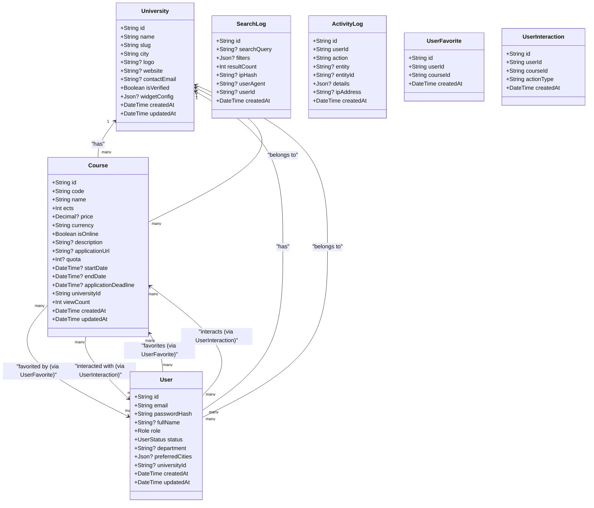

# Entity Models and Relationships

<cite>
**Referenced Files in This Document**
- [schema.prisma](file://apps/api/prisma/schema.prisma)
- [seed.ts](file://apps/api/prisma/seed.ts)
- [roles.ts](file://apps/api/src/common/constants/roles.ts)
- [auth.dto.ts](file://apps/api/src/modules/auth/auth.dto.ts)
- [course.dto.ts](file://apps/api/src/modules/course/course.dto.ts)
- [student.dto.ts](file://apps/api/src/modules/student/student.dto.ts)
- [university.dto.ts](file://apps/api/src/modules/university/university.dto.ts)
- [user.controller.ts](file://apps/api/src/modules/user/user.controller.ts)
- [course.controller.ts](file://apps/api/src/modules/course/course.controller.ts)
- [student.controller.ts](file://apps/api/src/modules/student/student.controller.ts)
- [university.controller.ts](file://apps/api/src/modules/university/university.controller.ts)
- [user.service.ts](file://apps/api/src/modules/user/user.service.ts)
- [course.service.ts](file://apps/api/src/modules/course/course.service.ts)
- [student.service.ts](file://apps/api/src/modules/student/student.service.ts)
- [search-log.service.ts](file://apps/api/src/modules/search-log/search-log.service.ts)
</cite>

## Table of Contents
1. [Introduction](#introduction)
2. [Project Structure](#project-structure)
3. [Core Components](#core-components)
4. [Architecture Overview](#architecture-overview)
5. [Detailed Component Analysis](#detailed-component-analysis)
6. [Dependency Analysis](#dependency-analysis)
7. [Performance Considerations](#performance-considerations)
8. [Troubleshooting Guide](#troubleshooting-guide)
9. [Conclusion](#conclusion)

## Introduction
This document describes the database entity models and their relationships for the application. It focuses on the User, University, Course, SearchLog, ActivityLog, UserFavorite, and UserInteraction models. It explains field-level characteristics, constraints, defaults, validations, and business logic constraints. Special emphasis is placed on:
- The User model’s polymorphic role support and multitenancy via universityId
- The Course model’s comprehensive attributes for summer school management (pricing, scheduling, enrollment)
- The junction tables UserFavorite and UserInteraction for many-to-many relationships
- Validation rules enforced at the DTO level and service/business logic level

## Project Structure
The database schema is defined with Prisma and supplemented by NestJS modules for controllers, services, DTOs, and guards. The schema enforces constraints and indexes, while DTOs and services implement validation and business rules.

**Diagram sources**
- [schema.prisma](file://apps/api/prisma/schema.prisma#L36-L182)
- [user.controller.ts](file://apps/api/src/modules/user/user.controller.ts#L14-L39)
- [course.controller.ts](file://apps/api/src/modules/course/course.controller.ts#L36-L147)
- [student.controller.ts](file://apps/api/src/modules/student/student.controller.ts#L31-L100)
- [university.controller.ts](file://apps/api/src/modules/university/university.controller.ts#L38-L113)
- [user.service.ts](file://apps/api/src/modules/user/user.service.ts#L10-L75)
- [course.service.ts](file://apps/api/src/modules/course/course.service.ts#L18-L309)
- [student.service.ts](file://apps/api/src/modules/student/student.service.ts#L15-L291)
- [search-log.service.ts](file://apps/api/src/modules/search-log/search-log.service.ts#L18-L115)

**Section sources**
- [schema.prisma](file://apps/api/prisma/schema.prisma#L1-L183)
- [user.controller.ts](file://apps/api/src/modules/user/user.controller.ts#L1-L40)
- [course.controller.ts](file://apps/api/src/modules/course/course.controller.ts#L1-L148)
- [student.controller.ts](file://apps/api/src/modules/student/student.controller.ts#L1-L101)
- [university.controller.ts](file://apps/api/src/modules/university/university.controller.ts#L1-L114)

## Core Components
This section documents each model with fields, data types, constraints, defaults, and relationships. Business logic constraints and validations are also described.

- University
  - Purpose: Tenant unit for multitenancy; stores university metadata and widget configuration.
  - Fields and constraints:
    - id: String, primary key, cuid()
    - name: String, unique
    - slug: String, unique
    - city: String (indexed for filtering)
    - logo: String?
    - website: String?
    - contactEmail: String?
    - isVerified: Boolean, default false
    - widgetConfig: Json?, default theme and color
    - createdAt/updatedAt: DateTime, auto-generated
    - Indexes: city, isVerified
  - Relationships:
    - One-to-many with User (users)
    - One-to-many with Course (courses)

- User
  - Purpose: Single table for all roles (STUDENT, UNIVERSITY, ADMIN). Supports multitenancy via universityId.
  - Fields and constraints:
    - id: String, primary key, cuid()
    - email: String, unique
    - passwordHash: String
    - fullName: String?
    - role: Role enum, default STUDENT
    - status: UserStatus enum, default ACTIVE
    - department: String?
    - preferredCities: Json?
    - universityId: String? (foreign key to University)
    - createdAt/updatedAt: DateTime, auto-generated
    - Indexes: role, status, universityId
  - Relationships:
    - Many-to-one with University (university)
    - One-to-many with UserFavorite (favorites)
    - One-to-many with UserInteraction (interactions)
  - Polymorphic roles and multitenancy:
    - role determines access control
    - UNIVERSITY role requires universityId for tenant isolation

- Course
  - Purpose: Summer school course management with pricing, scheduling, and enrollment fields.
  - Fields and constraints:
    - id: String, primary key, cuid()
    - code: String
    - name: String
    - ects: Int
    - price: Decimal(10,2)?
    - currency: String, default "TRY"
    - isOnline: Boolean, default false
    - description: String?
    - applicationUrl: String?
    - quota: Int?
    - startDate/endDate/applicationDeadline: DateTime?
    - universityId: String (required; foreign key to University)
    - viewCount: Int, default 0
    - createdAt/updatedAt: DateTime, auto-generated
    - Indexes: name, code, universityId, isOnline, composite (name, code, universityId)
  - Relationships:
    - Many-to-one with University (university)
    - Many-to-many via UserFavorite (favoritedBy)
    - Many-to-many via UserInteraction (interactions)

- SearchLog
  - Purpose: Analytics and academic research logging of search queries and filters.
  - Fields and constraints:
    - id: String, primary key, cuid()
    - searchQuery: String?
    - filters: Json?
    - resultCount: Int
    - ipHash: String? (SHA-256 truncated)
    - userAgent: String?
    - userId: String? (student user who performed the search)
    - createdAt: DateTime, default now()
    - Indexes: createdAt, searchQuery, userId

- ActivityLog
  - Purpose: Audit trail for actions performed by users (e.g., course create/update/verify).
  - Fields and constraints:
    - id: String, primary key, cuid()
    - userId: String
    - action: String
    - entity: String?
    - entityId: String?
    - details: Json?
    - ipAddress: String?
    - createdAt: DateTime, default now()
    - Indexes: userId, action, createdAt

- UserFavorite (junction)
  - Purpose: Tracks student favorites for courses.
  - Fields and constraints:
    - id: String, primary key, cuid()
    - userId: String
    - courseId: String
    - createdAt: DateTime, default now()
    - Unique constraint: (userId, courseId)
    - Indexes: userId, courseId
  - Relationships:
    - Many-to-one with User (user)
    - Many-to-one with Course (course)

- UserInteraction (junction)
  - Purpose: Tracks student interactions (view, favorite, apply) with courses.
  - Fields and constraints:
    - id: String, primary key, cuid()
    - userId: String
    - courseId: String
    - actionType: String (enumeration: VIEW, FAVORITE, APPLY)
    - createdAt: DateTime, default now()
    - Indexes: userId, (userId, actionType)
  - Relationships:
    - Many-to-one with User (user)
    - Many-to-one with Course (course)

Validation and defaults
- Role and UserStatus enums are defined in Prisma and re-exported for use.
- Validation rules are enforced via Zod schemas in DTOs and service logic.
- Defaults are defined in the Prisma schema (e.g., role, status, currency, isOnline, viewCount).

**Section sources**
- [schema.prisma](file://apps/api/prisma/schema.prisma#L16-L182)
- [roles.ts](file://apps/api/src/common/constants/roles.ts#L1-L6)

## Architecture Overview
The system uses a multitenant architecture with a single User table supporting multiple roles. Controllers delegate to services that enforce business rules and interact with Prisma. Search queries are logged for analytics. Many-to-many relationships are modeled via explicit junction tables.

**Diagram sources**
- [schema.prisma](file://apps/api/prisma/schema.prisma#L36-L182)

**Section sources**
- [schema.prisma](file://apps/api/prisma/schema.prisma#L36-L182)

## Detailed Component Analysis

### User Model
- Polymorphic roles and multitenancy:
  - role supports STUDENT, UNIVERSITY, ADMIN
  - UNIVERSITY role requires universityId for tenant isolation
  - Indexes on role, status, and universityId optimize role-based and tenant-based queries
- Field-level documentation:
  - email: unique; validated by DTO and service logic
  - passwordHash: bcrypt hash stored; never exposed
  - fullName, department, preferredCities: optional profile fields
  - status: lifecycle state managed via UserStatus enum
- Validation rules:
  - Registration DTO enforces email, password length, role default, and optional university fields
  - UNIVERSITY role registration requires universityId or universityName/city
- Business logic constraints:
  - Controllers restrict access via RolesGuard
  - Services implement tenant-aware retrieval and listing

**Diagram sources**
- [auth.dto.ts](file://apps/api/src/modules/auth/auth.dto.ts#L9-L30)
- [user.controller.ts](file://apps/api/src/modules/user/user.controller.ts#L19-L24)

**Section sources**
- [schema.prisma](file://apps/api/prisma/schema.prisma#L60-L85)
- [auth.dto.ts](file://apps/api/src/modules/auth/auth.dto.ts#L9-L30)
- [user.controller.ts](file://apps/api/src/modules/user/user.controller.ts#L14-L39)
- [user.service.ts](file://apps/api/src/modules/user/user.service.ts#L15-L75)

### University Model
- Purpose: Tenant container with metadata and widget configuration.
- Key constraints:
  - name and slug are unique
  - widgetConfig defaults to a JSON theme object
  - Indexes on city and isVerified optimize filtering and verification workflows
- Validation:
  - DTOs enforce name, city, and optional URLs/email
  - Widget config DTO validates hex color and theme

**Diagram sources**
- [university.dto.ts](file://apps/api/src/modules/university/university.dto.ts#L9-L47)
- [university.controller.ts](file://apps/api/src/modules/university/university.controller.ts#L78-L91)

**Section sources**
- [schema.prisma](file://apps/api/prisma/schema.prisma#L35-L58)
- [university.dto.ts](file://apps/api/src/modules/university/university.dto.ts#L9-L47)
- [university.controller.ts](file://apps/api/src/modules/university/university.controller.ts#L38-L113)

### Course Model
- Comprehensive attributes for summer school management:
  - Pricing: price (Decimal), currency (default TRY)
  - Scheduling: startDate, endDate, applicationDeadline
  - Enrollment: quota, applicationUrl
  - Metadata: code, name, ects, isOnline, description
  - Analytics: viewCount
- Indexes:
  - name, code, universityId, isOnline, and composite index for efficient search and filtering
- Validation and defaults:
  - DTOs enforce min/max lengths, numeric ranges, optional nullable fields, and URL/email formats
  - Service converts string dates to Date objects and handles nulls
- Business logic constraints:
  - Multitenancy: UNIVERSITY users can only manage their own university’s courses
  - Search filters verified universities and applies dynamic where conditions
  - Comparison logic validates counts and computes statistics

**Diagram sources**
- [course.controller.ts](file://apps/api/src/modules/course/course.controller.ts#L49-L75)
- [course.service.ts](file://apps/api/src/modules/course/course.service.ts#L31-L133)
- [search-log.service.ts](file://apps/api/src/modules/search-log/search-log.service.ts#L24-L35)

**Section sources**
- [schema.prisma](file://apps/api/prisma/schema.prisma#L87-L122)
- [course.dto.ts](file://apps/api/src/modules/course/course.dto.ts#L9-L83)
- [course.controller.ts](file://apps/api/src/modules/course/course.controller.ts#L36-L147)
- [course.service.ts](file://apps/api/src/modules/course/course.service.ts#L18-L309)
- [seed.ts](file://apps/api/prisma/seed.ts#L84-L103)

### SearchLog and ActivityLog Models
- SearchLog:
  - Captures search queries, applied filters, result counts, anonymized IP, and user agent
  - Used for analytics: popular searches, daily stats, overview metrics
- ActivityLog:
  - Records administrative and operational actions (audit trail)
  - Stores entity, entityId, and details as JSON for flexibility

**Diagram sources**
- [course.service.ts](file://apps/api/src/modules/course/course.service.ts#L31-L133)
- [search-log.service.ts](file://apps/api/src/modules/search-log/search-log.service.ts#L24-L115)
- [schema.prisma](file://apps/api/prisma/schema.prisma#L124-L154)

**Section sources**
- [schema.prisma](file://apps/api/prisma/schema.prisma#L124-L154)
- [search-log.service.ts](file://apps/api/src/modules/search-log/search-log.service.ts#L18-L115)
- [course.service.ts](file://apps/api/src/modules/course/course.service.ts#L104-L122)

### UserFavorite and UserInteraction Junction Tables
- UserFavorite:
  - Unique constraint on (userId, courseId) prevents duplicates
  - Indexes on userId and courseId enable fast lookup
- UserInteraction:
  - actionType enum ensures consistent interaction types (VIEW, FAVORITE, APPLY)
  - Index on (userId, actionType) optimizes filtered queries
- Business logic:
  - Students can add/remove favorites and record interactions
  - VIEW increments course viewCount; interactions power recommendations

**Diagram sources**
- [student.controller.ts](file://apps/api/src/modules/student/student.controller.ts#L55-L99)
- [student.service.ts](file://apps/api/src/modules/student/student.service.ts#L121-L220)
- [schema.prisma](file://apps/api/prisma/schema.prisma#L156-L182)

**Section sources**
- [schema.prisma](file://apps/api/prisma/schema.prisma#L156-L182)
- [student.dto.ts](file://apps/api/src/modules/student/student.dto.ts#L6-L17)
- [student.controller.ts](file://apps/api/src/modules/student/student.controller.ts#L31-L100)
- [student.service.ts](file://apps/api/src/modules/student/student.service.ts#L102-L220)

## Dependency Analysis
- Controllers depend on services for business logic and on DTOs for validation.
- Services depend on Prisma for data access and on each other for cross-cutting concerns (e.g., SearchLogService).
- Models define relationships and constraints; junction tables enforce many-to-many semantics.

**Diagram sources**
- [user.controller.ts](file://apps/api/src/modules/user/user.controller.ts#L14-L39)
- [course.controller.ts](file://apps/api/src/modules/course/course.controller.ts#L36-L147)
- [student.controller.ts](file://apps/api/src/modules/student/student.controller.ts#L31-L100)
- [university.controller.ts](file://apps/api/src/modules/university/university.controller.ts#L38-L113)
- [user.service.ts](file://apps/api/src/modules/user/user.service.ts#L10-L75)
- [course.service.ts](file://apps/api/src/modules/course/course.service.ts#L18-L309)
- [student.service.ts](file://apps/api/src/modules/student/student.service.ts#L15-L291)
- [search-log.service.ts](file://apps/api/src/modules/search-log/search-log.service.ts#L18-L115)

**Section sources**
- [user.controller.ts](file://apps/api/src/modules/user/user.controller.ts#L1-L40)
- [course.controller.ts](file://apps/api/src/modules/course/course.controller.ts#L1-L148)
- [student.controller.ts](file://apps/api/src/modules/student/student.controller.ts#L1-L101)
- [university.controller.ts](file://apps/api/src/modules/university/university.controller.ts#L1-L114)
- [user.service.ts](file://apps/api/src/modules/user/user.service.ts#L1-L76)
- [course.service.ts](file://apps/api/src/modules/course/course.service.ts#L1-L310)
- [student.service.ts](file://apps/api/src/modules/student/student.service.ts#L1-L292)
- [search-log.service.ts](file://apps/api/src/modules/search-log/search-log.service.ts#L1-L116)

## Performance Considerations
- Indexes:
  - University: city, isVerified
  - User: role, status, universityId
  - Course: name, code, universityId, isOnline, composite (name, code, universityId)
  - SearchLog: createdAt, searchQuery, userId
  - ActivityLog: userId, action, createdAt
  - UserFavorite: unique (userId, courseId), indices on userId and courseId
  - UserInteraction: indices on userId and (userId, actionType)
- Pagination and limits:
  - Course search enforces a maximum page size to prevent heavy queries
- JSON fields:
  - widgetConfig, preferredCities, filters use native JSON for flexible storage and indexing where supported

[No sources needed since this section provides general guidance]

## Troubleshooting Guide
- Common errors and causes:
  - Unauthorized or forbidden access when role or tenant mismatch occurs (e.g., updating another university’s course)
  - Not found errors when entities do not exist (course, favorite, interaction)
  - Conflict errors when adding duplicate favorites
  - Validation errors from DTOs (e.g., invalid email, password length, enum values)
- Mitigation steps:
  - Verify JWT token and role claims
  - Ensure universityId matches the requesting user for tenant-scoped operations
  - Confirm DTO inputs satisfy Zod constraints before sending requests
  - Use service methods that encapsulate Prisma queries and error handling

**Section sources**
- [course.service.ts](file://apps/api/src/modules/course/course.service.ts#L181-L221)
- [student.service.ts](file://apps/api/src/modules/student/student.service.ts#L131-L167)
- [auth.dto.ts](file://apps/api/src/modules/auth/auth.dto.ts#L9-L30)
- [course.dto.ts](file://apps/api/src/modules/course/course.dto.ts#L9-L83)
- [student.dto.ts](file://apps/api/src/modules/student/student.dto.ts#L6-L17)

## Conclusion
The database schema and associated services implement a robust, multitenant system with clear separation of concerns. The User model’s polymorphic design and universityId-based tenant isolation ensure secure, role-appropriate access. The Course model captures all essential attributes for summer school management, while SearchLog and ActivityLog provide strong analytics and audit capabilities. The junction tables UserFavorite and UserInteraction enable rich student engagement features with appropriate constraints and indexes for performance.