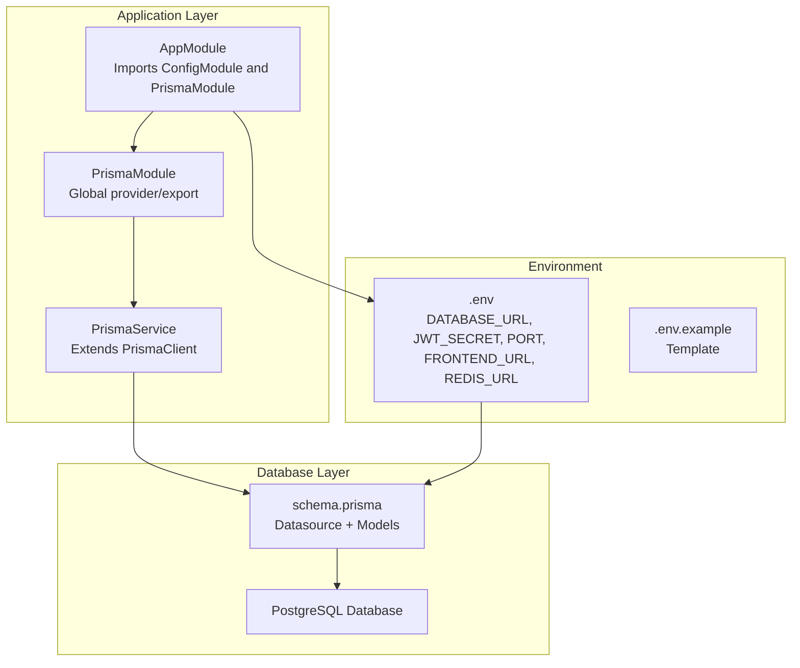
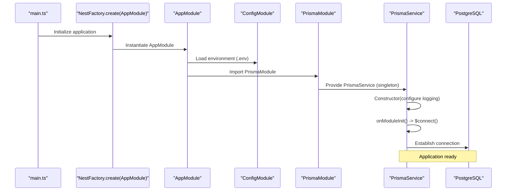
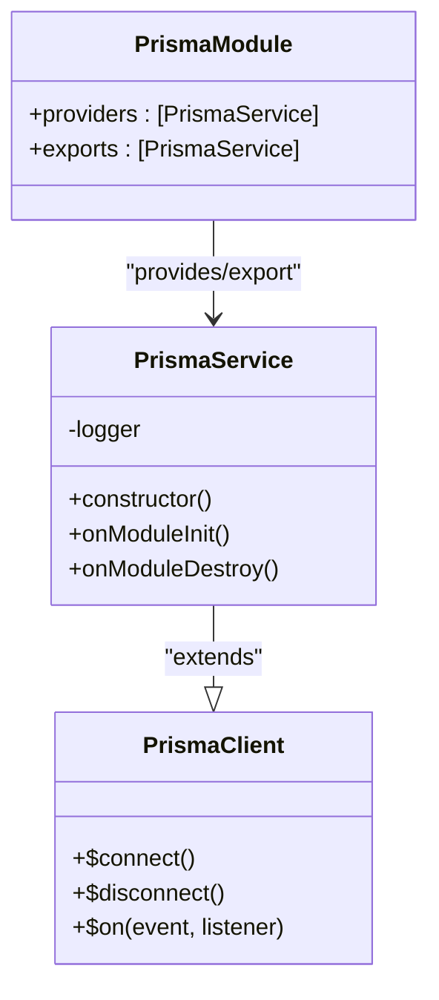
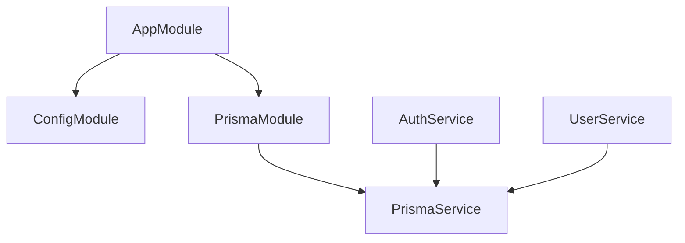

# Prisma ORM Configuration

<cite>
**Referenced Files in This Document**
- [schema.prisma](file://apps/api/prisma/schema.prisma)
- [prisma.module.ts](file://apps/api/src/prisma/prisma.module.ts)
- [prisma.service.ts](file://apps/api/src/prisma/prisma.service.ts)
- [app.module.ts](file://apps/api/src/app.module.ts)
- [main.ts](file://apps/api/src/main.ts)
- [.env](file://apps/api/.env)
- [.env.example](file://apps/api/.env.example)
- [auth.service.ts](file://apps/api/src/modules/auth/auth.service.ts)
- [user.service.ts](file://apps/api/src/modules/user/user.service.ts)
- [seed.ts](file://apps/api/prisma/seed.ts)
- [package.json](file://apps/api/package.json)
- [nest-cli.json](file://apps/api/nest-cli.json)
- [deploy-server.sh](file://scripts/deploy-server.sh)
- [DEPLOYMENT.md](file://DEPLOYMENT.md)
</cite>

## Table of Contents
1. [Introduction](#introduction)
2. [Project Structure](#project-structure)
3. [Core Components](#core-components)
4. [Architecture Overview](#architecture-overview)
5. [Detailed Component Analysis](#detailed-component-analysis)
6. [Dependency Analysis](#dependency-analysis)
7. [Performance Considerations](#performance-considerations)
8. [Troubleshooting Guide](#troubleshooting-guide)
9. [Conclusion](#conclusion)

## Introduction
This document explains the Prisma ORM configuration and implementation within the backend NestJS application. It covers PrismaClient setup, connection lifecycle management, the PrismaModule dependency injection pattern, database schema definition, environment variable handling, and practical service-layer usage. It also documents configuration patterns for development and production environments, including connection string handling and Prisma client initialization approaches.

## Project Structure
The Prisma integration is organized around a dedicated module that exposes a globally available PrismaService singleton. The application module imports this module, enabling dependency injection across all feature modules. Environment variables are loaded via NestJS ConfigModule and consumed by Prisma through the schema's datasource configuration.

**Diagram sources**
- [app.module.ts](file://apps/api/src/app.module.ts#L30-L48)
- [prisma.module.ts](file://apps/api/src/prisma/prisma.module.ts#L8-L13)
- [prisma.service.ts](file://apps/api/src/prisma/prisma.service.ts#L9-L32)
- [schema.prisma](file://apps/api/prisma/schema.prisma#L7-L10)
- [.env](file://apps/api/.env#L1-L6)
- [.env.example](file://apps/api/.env.example#L6-L19)

**Section sources**
- [app.module.ts](file://apps/api/src/app.module.ts#L30-L48)
- [prisma.module.ts](file://apps/api/src/prisma/prisma.module.ts#L8-L13)
- [prisma.service.ts](file://apps/api/src/prisma/prisma.service.ts#L9-L32)
- [schema.prisma](file://apps/api/prisma/schema.prisma#L7-L10)
- [.env](file://apps/api/.env#L1-L6)
- [.env.example](file://apps/api/.env.example#L6-L19)

## Core Components
- PrismaModule: Declares PrismaService as a globally available provider and exporter, eliminating the need for per-module imports.
- PrismaService: Extends PrismaClient, configures logging, and manages connection lifecycle via NestJS lifecycle hooks.
- AppModule: Imports ConfigModule (global) and PrismaModule, establishing environment loading and database connectivity at startup.
- Environment Variables: DATABASE_URL and related runtime values are loaded from .env and referenced in schema.prisma.

Key implementation references:
- PrismaModule provider/export: [prisma.module.ts](file://apps/api/src/prisma/prisma.module.ts#L8-L13)
- PrismaService singleton and lifecycle: [prisma.service.ts](file://apps/api/src/prisma/prisma.service.ts#L9-L32)
- AppModule imports and global config: [app.module.ts](file://apps/api/src/app.module.ts#L30-L48)
- Datasource URL from environment: [schema.prisma](file://apps/api/prisma/schema.prisma#L7-L10)
- Environment variables: [app.module.ts](file://apps/api/src/app.module.ts#L32-L33), [.env](file://apps/api/.env#L1-L6), [.env.example](file://apps/api/.env.example#L6-L19)

**Section sources**
- [prisma.module.ts](file://apps/api/src/prisma/prisma.module.ts#L8-L13)
- [prisma.service.ts](file://apps/api/src/prisma/prisma.service.ts#L9-L32)
- [app.module.ts](file://apps/api/src/app.module.ts#L30-L48)
- [schema.prisma](file://apps/api/prisma/schema.prisma#L7-L10)
- [.env](file://apps/api/.env#L1-L6)
- [.env.example](file://apps/api/.env.example#L6-L19)

## Architecture Overview
The Prisma integration follows a clean dependency injection pattern:
- AppModule loads environment variables globally.
- PrismaModule provides a single PrismaService instance.
- Services depend on PrismaService for database operations.
- PrismaService connects to the database during NestJS module initialization and disconnects on shutdown.

**Diagram sources**
- [main.ts](file://apps/api/src/main.ts#L10-L31)
- [app.module.ts](file://apps/api/src/app.module.ts#L30-L48)
- [prisma.module.ts](file://apps/api/src/prisma/prisma.module.ts#L8-L13)
- [prisma.service.ts](file://apps/api/src/prisma/prisma.service.ts#L23-L31)
- [schema.prisma](file://apps/api/prisma/schema.prisma#L7-L10)

## Detailed Component Analysis

### PrismaModule and PrismaService
PrismaModule is declared as global and exports PrismaService, making it injectable across all modules without additional imports. PrismaService extends PrismaClient and implements NestJS lifecycle hooks to manage connection establishment and teardown.

**Diagram sources**
- [prisma.service.ts](file://apps/api/src/prisma/prisma.service.ts#L9-L32)
- [prisma.module.ts](file://apps/api/src/prisma/prisma.module.ts#L8-L13)

Implementation highlights:
- Logging configuration in PrismaService constructor: [prisma.service.ts](file://apps/api/src/prisma/prisma.service.ts#L12-L21)
- Connection lifecycle hooks: [prisma.service.ts](file://apps/api/src/prisma/prisma.service.ts#L23-L31)
- Global module declaration: [prisma.module.ts](file://apps/api/src/prisma/prisma.module.ts#L8-L13)

**Section sources**
- [prisma.module.ts](file://apps/api/src/prisma/prisma.module.ts#L8-L13)
- [prisma.service.ts](file://apps/api/src/prisma/prisma.service.ts#L9-L32)

### Database Schema and Datasource
The schema defines a PostgreSQL datasource and includes models for University, User, Course, SearchLog, ActivityLog, UserFavorite, and UserInteraction. Indexes and relations are defined to optimize queries and maintain referential integrity.

Key schema elements:
- Datasource provider and URL from environment: [schema.prisma](file://apps/api/prisma/schema.prisma#L7-L10)
- Enum definitions (Role, UserStatus): [schema.prisma](file://apps/api/prisma/schema.prisma#L18-L31)
- Model definitions and indexes: [schema.prisma](file://apps/api/prisma/schema.prisma#L36-L182)

**Section sources**
- [schema.prisma](file://apps/api/prisma/schema.prisma#L7-L10)
- [schema.prisma](file://apps/api/prisma/schema.prisma#L18-L31)
- [schema.prisma](file://apps/api/prisma/schema.prisma#L36-L182)

### Environment Variable Management
Environment variables are loaded globally by AppModule via ConfigModule and consumed by Prisma through the schema. The .env file provides defaults, while .env.example documents required keys.

- Global environment loading: [app.module.ts](file://apps/api/src/app.module.ts#L32-L33)
- DATABASE_URL usage in schema: [schema.prisma](file://apps/api/prisma/schema.prisma#L9-L9)
- Example environment template: [.env.example](file://apps/api/.env.example#L6-L19)
- Runtime environment variables: [.env](file://apps/api/.env#L1-L6)

**Section sources**
- [app.module.ts](file://apps/api/src/app.module.ts#L32-L33)
- [schema.prisma](file://apps/api/prisma/schema.prisma#L9-L9)
- [.env.example](file://apps/api/.env.example#L6-L19)
- [.env](file://apps/api/.env#L1-L6)

### Service Layer Implementation Patterns
Services demonstrate typical Prisma usage patterns:
- Dependency injection of PrismaService
- CRUD operations with selective field projection
- Error handling via NestJS exceptions

Examples:
- AuthService uses PrismaService for user registration and login: [auth.service.ts](file://apps/api/src/modules/auth/auth.service.ts#L36-L130)
- UserService retrieves user profiles and paginated lists: [user.service.ts](file://apps/api/src/modules/user/user.service.ts#L13-L75)

Transaction handling:
- No explicit transactions are shown in the referenced services. For multi-step writes requiring atomicity, wrap operations in PrismaClient transaction blocks within a service method.

Connection pooling:
- PrismaClient manages connection pooling internally. Configure pool settings via PrismaService constructor options if needed.

**Section sources**
- [auth.service.ts](file://apps/api/src/modules/auth/auth.service.ts#L36-L130)
- [user.service.ts](file://apps/api/src/modules/user/user.service.ts#L13-L75)
- [prisma.service.ts](file://apps/api/src/prisma/prisma.service.ts#L12-L21)

### Configuration for Different Environments
Development:
- Local .env with DATABASE_URL pointing to a local PostgreSQL instance: [.env](file://apps/api/.env#L1-L1)
- Example template for environment variables: [.env.example](file://apps/api/.env.example#L6-L19)

Production:
- Deployment script demonstrates Prisma generation, migration deployment, and seeding during server setup: [deploy-server.sh](file://scripts/deploy-server.sh#L40-L43)
- Deployment guide outlines environment variable configuration for production: [DEPLOYMENT.md](file://DEPLOYMENT.md#L84-L91)

Connection string handling:
- DATABASE_URL is read from environment and applied in schema: [schema.prisma](file://apps/api/prisma/schema.prisma#L9-L9)
- Frontend URL and port are used in main.ts for CORS and listening: [main.ts](file://apps/api/src/main.ts#L20-L29)

**Section sources**
- [.env](file://apps/api/.env#L1-L1)
- [.env.example](file://apps/api/.env.example#L6-L19)
- [deploy-server.sh](file://scripts/deploy-server.sh#L40-L43)
- [DEPLOYMENT.md](file://DEPLOYMENT.md#L84-L91)
- [schema.prisma](file://apps/api/prisma/schema.prisma#L9-L9)
- [main.ts](file://apps/api/src/main.ts#L20-L29)

### Prisma Client Initialization Patterns
Initialization occurs automatically when PrismaService is instantiated by NestJS DI. The constructor configures logging, and lifecycle hooks establish and tear down connections.

- Constructor configuration: [prisma.service.ts](file://apps/api/src/prisma/prisma.service.ts#L12-L21)
- Connection on init: [prisma.service.ts](file://apps/api/src/prisma/prisma.service.ts#L23-L26)
- Disconnection on destroy: [prisma.service.ts](file://apps/api/src/prisma/prisma.service.ts#L28-L31)

**Section sources**
- [prisma.service.ts](file://apps/api/src/prisma/prisma.service.ts#L12-L31)

### Seed Data Setup
The seed script initializes development data including an admin user, verified universities, university authorities, and sample courses. It uses PrismaClient directly for upsert/create operations and ensures proper disconnection.

- Seed script entry points and operations: [seed.ts](file://apps/api/prisma/seed.ts#L11-L117)

**Section sources**
- [seed.ts](file://apps/api/prisma/seed.ts#L11-L117)

## Dependency Analysis
The dependency graph shows how AppModule orchestrates environment loading and Prisma integration, while services consume PrismaService for database operations.

**Diagram sources**
- [app.module.ts](file://apps/api/src/app.module.ts#L30-L48)
- [prisma.module.ts](file://apps/api/src/prisma/prisma.module.ts#L8-L13)
- [prisma.service.ts](file://apps/api/src/prisma/prisma.service.ts#L9-L32)
- [auth.service.ts](file://apps/api/src/modules/auth/auth.service.ts#L36-L39)
- [user.service.ts](file://apps/api/src/modules/user/user.service.ts#L13-L13)

**Section sources**
- [app.module.ts](file://apps/api/src/app.module.ts#L30-L48)
- [prisma.module.ts](file://apps/api/src/prisma/prisma.module.ts#L8-L13)
- [prisma.service.ts](file://apps/api/src/prisma/prisma.service.ts#L9-L32)
- [auth.service.ts](file://apps/api/src/modules/auth/auth.service.ts#L36-L39)
- [user.service.ts](file://apps/api/src/modules/user/user.service.ts#L13-L13)

## Performance Considerations
- Use selective field projections in queries to minimize payload sizes (as seen in services).
- Leverage schema-defined indexes for frequent filters (e.g., role, status, universityId).
- Keep PrismaClient as a singleton (handled by PrismaService) to benefit from internal connection pooling.
- Avoid N+1 queries by using relation selection and batch operations where appropriate.

[No sources needed since this section provides general guidance]

## Troubleshooting Guide
Common issues and resolutions:
- Environment variable loading errors: Ensure .env exists and ConfigModule is imported globally in AppModule.
- Database connection failures: Verify DATABASE_URL correctness and PostgreSQL availability.
- Migration or seeding errors: Use the deployment script steps to regenerate Prisma client and apply migrations.

References:
- Environment loading: [app.module.ts](file://apps/api/src/app.module.ts#L32-L33)
- Deployment steps: [deploy-server.sh](file://scripts/deploy-server.sh#L40-L43)
- Package scripts for Prisma operations: [package.json](file://apps/api/package.json#L11-L16)

**Section sources**
- [app.module.ts](file://apps/api/src/app.module.ts#L32-L33)
- [deploy-server.sh](file://scripts/deploy-server.sh#L40-L43)
- [package.json](file://apps/api/package.json#L11-L16)

## Conclusion
The Prisma integration in this NestJS application follows a robust, scalable pattern:
- A global PrismaModule provides a singleton PrismaService.
- Lifecycle hooks manage connection establishment and teardown.
- Environment variables are cleanly separated and consumed via NestJS ConfigModule.
- Services encapsulate database operations with clear error handling.
- Production deployment leverages automated Prisma client generation, migration deployment, and seeding.

This setup supports both development and production environments while maintaining clean separation of concerns and efficient database access patterns.