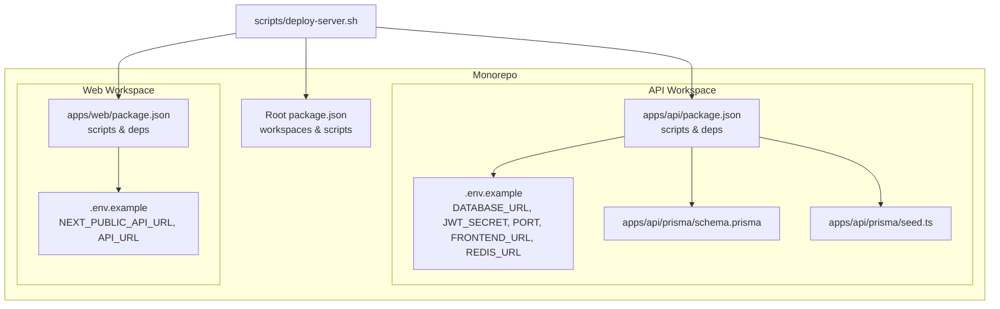
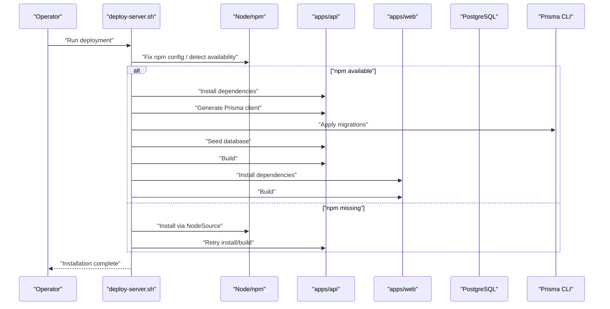
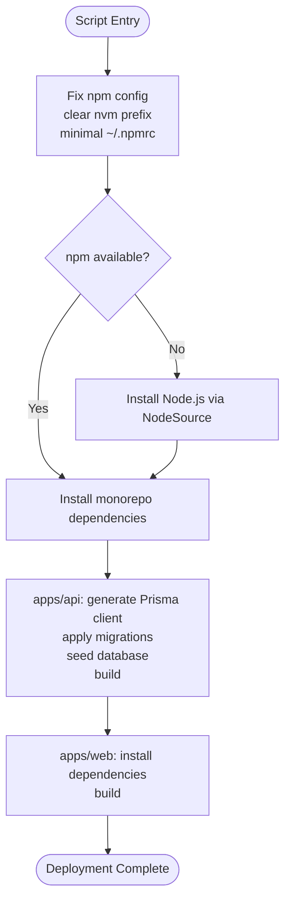
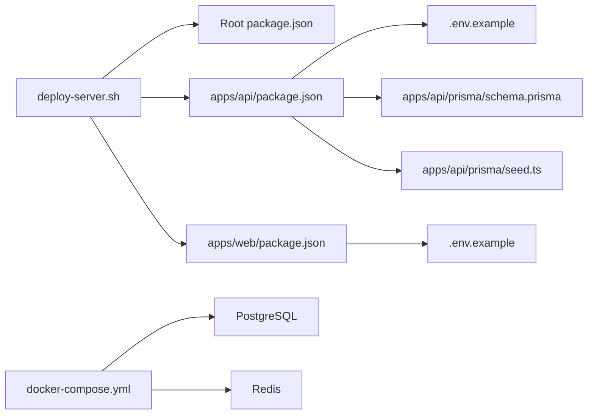

# Deployment Scripts

<cite>
**Referenced Files in This Document**
- [scripts/deploy-server.sh](file://scripts/deploy-server.sh)
- [DEPLOYMENT.md](file://DEPLOYMENT.md)
- [docker-compose.yml](file://docker-compose.yml)
- [apps/api/.env.example](file://apps/api/.env.example)
- [apps/web/.env.example](file://apps/web/.env.example)
- [package.json](file://package.json)
- [apps/api/package.json](file://apps/api/package.json)
- [apps/web/package.json](file://apps/web/package.json)
- [apps/api/prisma/schema.prisma](file://apps/api/prisma/schema.prisma)
- [apps/api/prisma/seed.ts](file://apps/api/prisma/seed.ts)
</cite>

## Table of Contents
1. [Introduction](#introduction)
2. [Project Structure](#project-structure)
3. [Core Components](#core-components)
4. [Architecture Overview](#architecture-overview)
5. [Detailed Component Analysis](#detailed-component-analysis)
6. [Dependency Analysis](#dependency-analysis)
7. [Performance Considerations](#performance-considerations)
8. [Troubleshooting Guide](#troubleshooting-guide)
9. [Conclusion](#conclusion)
10. [Appendices](#appendices)

## Introduction
This document explains the automated deployment script used for Yaz Okulu Var Mı?, focusing on its functionality, deployment workflow, environment preparation, and rollback procedures. It also documents command-line arguments, configuration options, environment-specific settings, step-by-step deployment instructions, pre-deployment checks, post-deployment verification, error handling mechanisms, CI/CD integration, automated testing during deployment, and monitoring setup. The goal is to make deployment repeatable, reliable, and accessible to both technical and non-technical operators.

## Project Structure
The deployment spans a monorepo with two workspaces:
- Backend API built with NestJS and Prisma ORM
- Frontend built with Next.js

Key deployment-relevant files:
- scripts/deploy-server.sh: Automated deployment script for production-like environments
- DEPLOYMENT.md: Step-by-step manual deployment guide and troubleshooting
- docker-compose.yml: Local development stack with PostgreSQL and Redis
- Environment files under apps/api and apps/web
- Root and workspace package.json files define workspaces and scripts
- Prisma schema and seed script for database initialization

**Diagram sources**
- [scripts/deploy-server.sh](file://scripts/deploy-server.sh#L1-L70)
- [DEPLOYMENT.md](file://DEPLOYMENT.md#L1-L267)
- [docker-compose.yml](file://docker-compose.yml#L1-L34)
- [apps/api/.env.example](file://apps/api/.env.example#L1-L20)
- [apps/web/.env.example](file://apps/web/.env.example#L1-L13)
- [package.json](file://package.json#L1-L24)
- [apps/api/package.json](file://apps/api/package.json#L1-L59)
- [apps/web/package.json](file://apps/web/package.json#L1-L38)
- [apps/api/prisma/schema.prisma](file://apps/api/prisma/schema.prisma#L1-L183)
- [apps/api/prisma/seed.ts](file://apps/api/prisma/seed.ts#L1-L117)

**Section sources**
- [scripts/deploy-server.sh](file://scripts/deploy-server.sh#L1-L70)
- [DEPLOYMENT.md](file://DEPLOYMENT.md#L1-L267)
- [docker-compose.yml](file://docker-compose.yml#L1-L34)
- [apps/api/.env.example](file://apps/api/.env.example#L1-L20)
- [apps/web/.env.example](file://apps/web/.env.example#L1-L13)
- [package.json](file://package.json#L1-L24)
- [apps/api/package.json](file://apps/api/package.json#L1-L59)
- [apps/web/package.json](file://apps/web/package.json#L1-L38)
- [apps/api/prisma/schema.prisma](file://apps/api/prisma/schema.prisma#L1-L183)
- [apps/api/prisma/seed.ts](file://apps/api/prisma/seed.ts#L1-L117)

## Core Components
- Automated deployment script: Orchestrates environment fixes, installs dependencies, runs Prisma generation and migrations, seeds the database, builds both workspaces, and verifies tool versions.
- Manual deployment guide: Provides prerequisites, environment setup, backend/frontend installation steps, PM2 process management, optional Nginx reverse proxy, and troubleshooting.
- Development stack: Docker Compose defines local PostgreSQL and Redis services for development.
- Environment configuration: Separate .env.example files for API and Web with required variables.
- Workspaces and scripts: Root and workspace package.json files define workspaces and scripts for building, seeding, and testing.

Key responsibilities:
- Prepare Node/npm environment and resolve nvm/npm conflicts
- Install monorepo dependencies
- Generate Prisma client and apply migrations
- Seed database with initial data
- Build API and Web applications
- Verify installed versions

**Section sources**
- [scripts/deploy-server.sh](file://scripts/deploy-server.sh#L1-L70)
- [DEPLOYMENT.md](file://DEPLOYMENT.md#L1-L267)
- [docker-compose.yml](file://docker-compose.yml#L1-L34)
- [apps/api/.env.example](file://apps/api/.env.example#L1-L20)
- [apps/web/.env.example](file://apps/web/.env.example#L1-L13)
- [package.json](file://package.json#L1-L24)
- [apps/api/package.json](file://apps/api/package.json#L1-L59)
- [apps/web/package.json](file://apps/web/package.json#L1-L38)

## Architecture Overview
The deployment pipeline integrates the automated script with environment preparation, database initialization, and application builds. The diagram below maps the actual components and their interactions.

**Diagram sources**
- [scripts/deploy-server.sh](file://scripts/deploy-server.sh#L1-L70)
- [apps/api/package.json](file://apps/api/package.json#L1-L59)
- [apps/web/package.json](file://apps/web/package.json#L1-L38)
- [apps/api/prisma/schema.prisma](file://apps/api/prisma/schema.prisma#L1-L183)
- [apps/api/prisma/seed.ts](file://apps/api/prisma/seed.ts#L1-L117)

## Detailed Component Analysis

### Automated Deployment Script
The script automates the entire deployment process with robust error handling and fallbacks for common environment issues.

- Purpose: Automate installation, Prisma setup, seeding, and building for both API and Web workspaces.
- Environment preparation: Fixes npm configuration conflicts caused by nvm and cleans up problematic npm prefixes.
- Fallback mechanism: If npm is unavailable, installs Node.js via NodeSource and retries installation.
- Workflow:
  1. Fix npm configuration
  2. Optional NodeSource installation
  3. Install monorepo dependencies
  4. API workspace:
     - Generate Prisma client
     - Apply migrations
     - Seed database (with graceful fallback)
     - Build
  5. Web workspace:
     - Install dependencies
     - Build
- Command-line usage: Make the script executable and run it from the project root.

**Diagram sources**
- [scripts/deploy-server.sh](file://scripts/deploy-server.sh#L1-L70)

**Section sources**
- [scripts/deploy-server.sh](file://scripts/deploy-server.sh#L1-L70)

### Manual Deployment Guide
The manual guide complements the automated script and provides detailed steps for environment preparation, backend and frontend setup, process management with PM2, and optional Nginx reverse proxy.

- Prerequisites: Ubuntu 22.04 LTS, Node.js 18+, PostgreSQL 16, Git
- Server preparation: System updates and required packages
- Node.js installation via nvm
- PostgreSQL setup: service installation and database/user creation
- Project setup: repository cloning and monorepo dependency installation
- Backend (API):
  - Create .env from .env.example with DATABASE_URL, JWT_SECRET, PORT, FRONTEND_URL
  - Prisma client generation and migrations
  - Seed database
  - Build and local test run
- Frontend (Web):
  - Create .env.local from .env.example with NEXT_PUBLIC_API_URL and API_URL
  - Build and local test run
- PM2 process management: Start API and Web processes, enable startup, and save configuration
- Optional Nginx reverse proxy: Route /api to backend and root to frontend
- Troubleshooting: Addresses common issues like missing migrations, npm config errors, missing seed script, Prisma Decimal errors, and double /api routes

**Section sources**
- [DEPLOYMENT.md](file://DEPLOYMENT.md#L1-L267)

### Environment Configuration
Environment variables are defined per workspace and validated during deployment.

- API environment variables:
  - DATABASE_URL: PostgreSQL connection string
  - JWT_SECRET: Secret key for JWT signing
  - PORT: API server port
  - FRONTEND_URL: CORS origin for frontend
  - REDIS_URL: Optional cache connection
- Web environment variables:
  - NEXT_PUBLIC_API_URL: Public API base URL for client-side requests (/api suffix)
  - API_URL: Internal API base URL for server-side requests (no /api suffix)
- Example files:
  - apps/api/.env.example
  - apps/web/.env.example

**Section sources**
- [apps/api/.env.example](file://apps/api/.env.example#L1-L20)
- [apps/web/.env.example](file://apps/web/.env.example#L1-L13)

### Database Initialization and Schema
Prisma manages database schema and seed data.

- Schema definition:
  - Data source configured via DATABASE_URL
  - Models for University, User, Course, SearchLog, ActivityLog, UserFavorite, UserInteraction
  - Indexes and relations optimized for filtering and performance
- Seed script:
  - Creates admin user
  - Upserts sample universities
  - Upserts university staff
  - Creates sample courses with pricing and metadata
  - Uses number type for Decimal fields in seed data

**Section sources**
- [apps/api/prisma/schema.prisma](file://apps/api/prisma/schema.prisma#L1-L183)
- [apps/api/prisma/seed.ts](file://apps/api/prisma/seed.ts#L1-L117)

### Development Stack (Docker Compose)
Local development uses Docker Compose to provision PostgreSQL and Redis.

- Services:
  - postgres: PostgreSQL 16 with persistent volumes
  - redis: Redis 7 with persistent volumes
- Ports:
  - PostgreSQL: 5432
  - Redis: 6379
- Volumes:
  - Named volumes for persistence

**Section sources**
- [docker-compose.yml](file://docker-compose.yml#L1-L34)

### Workspaces and Scripts
Root and workspace package.json files define the monorepo structure and scripts.

- Root:
  - workspaces: apps/*
  - scripts: dev:api, dev:web, build:api, build:web, db:generate, db:migrate, db:push, db:seed
  - engines: Node >= 18
- API workspace:
  - scripts: build, dev, start, start:prod, db:generate, db:migrate, db:push, db:seed, seed, db:studio, test, test:watch
  - dependencies: NestJS, Prisma client, Passport, JWT, RxJS, Zod, etc.
  - devDependencies: Nest CLI, Prisma, Jest, TypeScript, ts-node
  - prisma.seed: ts-node prisma/seed.ts
- Web workspace:
  - scripts: dev, build, start, lint
  - dependencies: Next.js, Radix UI, Tailwind, Zod, Recharts, etc.
  - devDependencies: TypeScript, PostCSS, Tailwind CSS, etc.

**Section sources**
- [package.json](file://package.json#L1-L24)
- [apps/api/package.json](file://apps/api/package.json#L1-L59)
- [apps/web/package.json](file://apps/web/package.json#L1-L38)

## Dependency Analysis
The deployment depends on the following relationships:
- scripts/deploy-server.sh depends on Node/npm availability and executes workspace scripts
- apps/api depends on DATABASE_URL and Prisma CLI for schema generation and migrations
- apps/web depends on NEXT_PUBLIC_API_URL and API_URL for routing API calls
- docker-compose.yml provides local PostgreSQL and Redis for development

**Diagram sources**
- [scripts/deploy-server.sh](file://scripts/deploy-server.sh#L1-L70)
- [package.json](file://package.json#L1-L24)
- [apps/api/package.json](file://apps/api/package.json#L1-L59)
- [apps/web/package.json](file://apps/web/package.json#L1-L38)
- [apps/api/.env.example](file://apps/api/.env.example#L1-L20)
- [apps/web/.env.example](file://apps/web/.env.example#L1-L13)
- [apps/api/prisma/schema.prisma](file://apps/api/prisma/schema.prisma#L1-L183)
- [apps/api/prisma/seed.ts](file://apps/api/prisma/seed.ts#L1-L117)
- [docker-compose.yml](file://docker-compose.yml#L1-L34)

**Section sources**
- [scripts/deploy-server.sh](file://scripts/deploy-server.sh#L1-L70)
- [package.json](file://package.json#L1-L24)
- [apps/api/package.json](file://apps/api/package.json#L1-L59)
- [apps/web/package.json](file://apps/web/package.json#L1-L38)
- [apps/api/.env.example](file://apps/api/.env.example#L1-L20)
- [apps/web/.env.example](file://apps/web/.env.example#L1-L13)
- [apps/api/prisma/schema.prisma](file://apps/api/prisma/schema.prisma#L1-L183)
- [apps/api/prisma/seed.ts](file://apps/api/prisma/seed.ts#L1-L117)
- [docker-compose.yml](file://docker-compose.yml#L1-L34)

## Performance Considerations
- Use NodeSource installation when nvm causes npm configuration conflicts to avoid repeated environment troubleshooting.
- Prefer monorepo root installation to reduce redundant dependency resolution overhead.
- Keep Prisma client updated after schema changes to minimize runtime overhead.
- Use production builds for both API and Web to optimize runtime performance.
- Persist PostgreSQL and Redis data via named volumes in Docker Compose for faster rebuilds and continuity.

[No sources needed since this section provides general guidance]

## Troubleshooting Guide
Common deployment failures and resolutions:

- npm configuration conflicts ("call config.load() before reading values"):
  - Clear nvm prefix and minimal ~/.npmrc
  - Retry installation from monorepo root
- Missing migrations:
  - Ensure migrations are committed and not ignored by .gitignore
- Missing seed script:
  - Use correct command from apps/api directory or root workspace command
- Prisma Decimal errors:
  - Ensure seed data uses number type for Decimal fields
- Double /api route leading to 404:
  - Correct NEXT_PUBLIC_API_URL and API_URL to avoid duplicate /api prefix
- Node/npm not available:
  - Install Node.js via NodeSource and retry

**Section sources**
- [DEPLOYMENT.md](file://DEPLOYMENT.md#L189-L258)
- [scripts/deploy-server.sh](file://scripts/deploy-server.sh#L13-L31)

## Conclusion
The deployment pipeline combines an automated script with a comprehensive manual guide to ensure reliable deployments. By preparing the environment, generating Prisma clients, applying migrations, seeding the database, and building both workspaces, the system achieves predictable outcomes. The manual guide and troubleshooting section provide operational resilience, while Docker Compose supports efficient local development. Integrating PM2 and optional Nginx completes the production setup for scalable delivery.

[No sources needed since this section summarizes without analyzing specific files]

## Appendices

### Step-by-Step Deployment Instructions
- Prepare server: Update system, install Git and curl, set up Node.js via nvm
- Install PostgreSQL and create database/user
- Clone repository and install monorepo dependencies
- Configure API .env and run Prisma generate/migrate/seed
- Build API and run locally for verification
- Configure Web .env.local and build
- Run locally for verification
- Set up PM2 to manage processes and enable startup
- Optionally configure Nginx reverse proxy
- Use the automated script for repeatable deployments

**Section sources**
- [DEPLOYMENT.md](file://DEPLOYMENT.md#L14-L156)

### Rollback Procedures
- Stop PM2 processes and revert to previous build artifacts if necessary
- Re-run Prisma migrations to a known-good migration if schema changes cause issues
- Restore database from backups taken before deployment
- Re-deploy using the automated script with a clean state

[No sources needed since this section provides general guidance]

### CI/CD Integration
- Trigger the automated script on successful tests and code approval
- Cache Node modules and Prisma client to speed up builds
- Store secrets (DATABASE_URL, JWT_SECRET) in CI/CD secret stores
- Run database migrations as part of the pipeline before deploying

[No sources needed since this section provides general guidance]

### Monitoring Setup
- Monitor API and Web process health via PM2 logs and metrics
- Enable database and Redis health checks in Docker Compose
- Add application-level logging and alerting for critical errors

[No sources needed since this section provides general guidance]