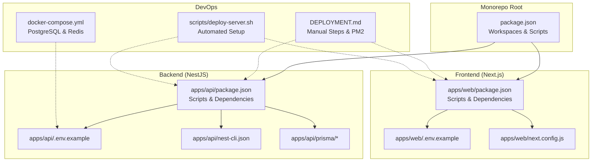
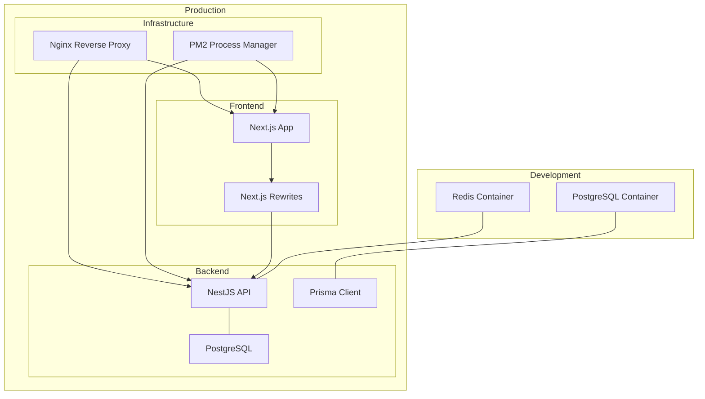
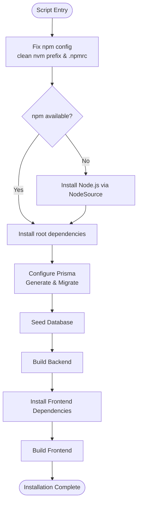
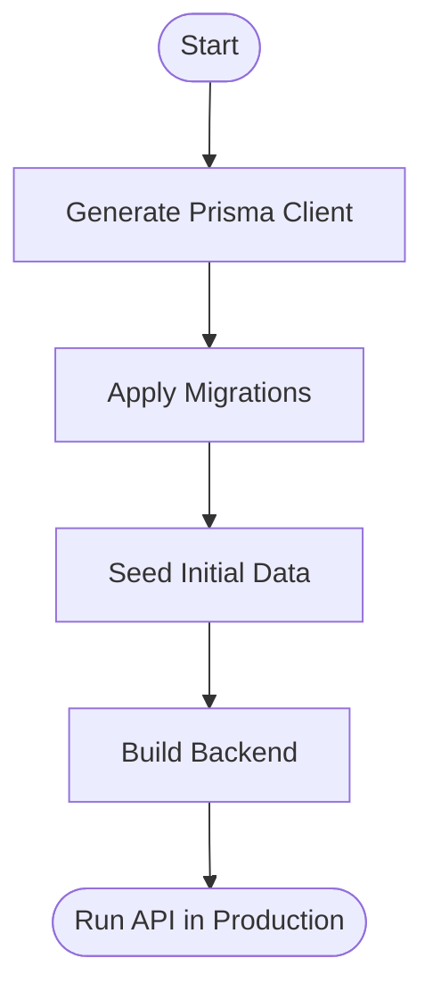
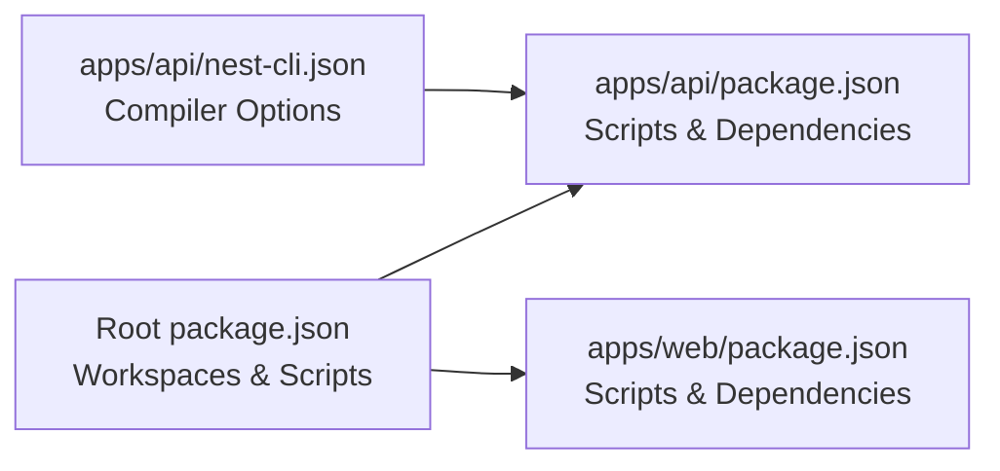
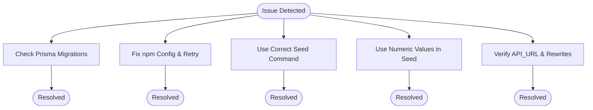

# Deployment and DevOps

<cite>
**Referenced Files in This Document**
- [DEPLOYMENT.md](file://DEPLOYMENT.md)
- [docker-compose.yml](file://docker-compose.yml)
- [scripts/deploy-server.sh](file://scripts/deploy-server.sh)
- [apps/api/.env.example](file://apps/api/.env.example)
- [apps/web/.env.example](file://apps/web/.env.example)
- [package.json](file://package.json)
- [apps/api/package.json](file://apps/api/package.json)
- [apps/web/package.json](file://apps/web/package.json)
- [apps/api/nest-cli.json](file://apps/api/nest-cli.json)
- [apps/web/next.config.js](file://apps/web/next.config.js)
</cite>

## Table of Contents
1. [Introduction](#introduction)
2. [Project Structure](#project-structure)
3. [Core Components](#core-components)
4. [Architecture Overview](#architecture-overview)
5. [Detailed Component Analysis](#detailed-component-analysis)
6. [Dependency Analysis](#dependency-analysis)
7. [Performance Considerations](#performance-considerations)
8. [Troubleshooting Guide](#troubleshooting-guide)
9. [Conclusion](#conclusion)
10. [Appendices](#appendices)

## Introduction
This document provides comprehensive deployment and DevOps guidance for Yaz Okulu Var Mı?. It covers development environment orchestration with Docker Compose, production deployment strategies, service management, automated deployment scripts, environment configuration management, database migration procedures, CI/CD setup recommendations, monitoring and logging, maintenance procedures, deployment targets (Vercel for frontend, backend hosting platforms), backup and disaster recovery, performance monitoring, scaling considerations, and troubleshooting.

## Project Structure
The project is a monorepo with two primary workspaces:
- Backend API built with NestJS and Prisma ORM
- Frontend built with Next.js

Key deployment-related files and their roles:
- Development orchestration: docker-compose.yml defines PostgreSQL and Redis services
- Production deployment: DEPLOYMENT.md documents manual steps and PM2-based process management
- Automation: scripts/deploy-server.sh encapsulates installation and setup logic
- Environment configuration: .env.example files define required variables for backend and frontend
- Build and workspace scripts: root and app-level package.json files define scripts for building, seeding, and running

**Diagram sources**
- [package.json](file://package.json#L6-L19)
- [apps/api/package.json](file://apps/api/package.json#L6-L19)
- [apps/web/package.json](file://apps/web/package.json#L6-L11)
- [apps/api/.env.example](file://apps/api/.env.example#L6-L19)
- [apps/web/.env.example](file://apps/web/.env.example#L8-L12)
- [apps/api/nest-cli.json](file://apps/api/nest-cli.json#L1-L8)
- [apps/web/next.config.js](file://apps/web/next.config.js#L14-L22)
- [docker-compose.yml](file://docker-compose.yml#L6-L29)
- [DEPLOYMENT.md](file://DEPLOYMENT.md#L57-L136)
- [scripts/deploy-server.sh](file://scripts/deploy-server.sh#L33-L53)

**Section sources**
- [package.json](file://package.json#L6-L19)
- [apps/api/package.json](file://apps/api/package.json#L6-L19)
- [apps/web/package.json](file://apps/web/package.json#L6-L11)
- [apps/api/.env.example](file://apps/api/.env.example#L6-L19)
- [apps/web/.env.example](file://apps/web/.env.example#L8-L12)
- [apps/api/nest-cli.json](file://apps/api/nest-cli.json#L1-L8)
- [apps/web/next.config.js](file://apps/web/next.config.js#L14-L22)
- [docker-compose.yml](file://docker-compose.yml#L6-L29)
- [DEPLOYMENT.md](file://DEPLOYMENT.md#L57-L136)
- [scripts/deploy-server.sh](file://scripts/deploy-server.sh#L33-L53)

## Core Components
- Backend API (NestJS)
  - Uses Prisma for database operations and migrations
  - Exposes REST endpoints and supports authentication via JWT
  - Environment variables include database URL, JWT secret, port, frontend URL, and Redis URL
- Frontend (Next.js)
  - Client-side and server-side API routing handled via rewrites
  - Environment variables include NEXT_PUBLIC_API_URL and API_URL
- Development Orchestration
  - Docker Compose provisions PostgreSQL and Redis for local development
- Automated Deployment
  - A shell script automates installation, Prisma generation and migration, seeding, and builds for both apps
- Production Process Management
  - Manual steps describe PM2-based process management and optional Nginx reverse proxy

**Section sources**
- [apps/api/package.json](file://apps/api/package.json#L20-L58)
- [apps/api/.env.example](file://apps/api/.env.example#L6-L19)
- [apps/web/.env.example](file://apps/web/.env.example#L8-L12)
- [apps/web/next.config.js](file://apps/web/next.config.js#L14-L22)
- [docker-compose.yml](file://docker-compose.yml#L6-L29)
- [scripts/deploy-server.sh](file://scripts/deploy-server.sh#L33-L53)
- [DEPLOYMENT.md](file://DEPLOYMENT.md#L139-L156)

## Architecture Overview
The deployment architecture consists of:
- Development stack: PostgreSQL and Redis orchestrated via Docker Compose
- Production stack: Backend API and Next.js frontend deployed independently, optionally behind Nginx
- Process management: PM2 for continuous operation
- Database lifecycle: Prisma migrations and seeding during deployment

**Diagram sources**
- [docker-compose.yml](file://docker-compose.yml#L6-L29)
- [apps/api/.env.example](file://apps/api/.env.example#L6-L19)
- [apps/web/next.config.js](file://apps/web/next.config.js#L14-L22)
- [DEPLOYMENT.md](file://DEPLOYMENT.md#L139-L156)

## Detailed Component Analysis

### Docker Compose Configuration (Development)
- Purpose: Provide PostgreSQL and Redis containers for local development
- Services:
  - postgres: runs PostgreSQL 16, exposes port 5432, persists data via named volume
  - redis: runs Redis 7, exposes port 6379, persists data via named volume
- Environment variables and defaults are suitable for local development
- Volume persistence ensures data survives container recreation

Operational notes:
- Use docker-compose up to start services
- Access PostgreSQL locally at localhost:5432 with credentials defined in the compose file
- Access Redis locally at localhost:6379

**Section sources**
- [docker-compose.yml](file://docker-compose.yml#L6-L29)

### Automated Deployment Script
- Purpose: Automate installation, Prisma setup, seeding, and builds for both backend and frontend
- Key steps:
  - Fix npm configuration issues (nvm prefix cleanup, minimal .npmrc)
  - Install dependencies at the monorepo root
  - Configure and migrate Prisma in the backend, seed data, and build
  - Install and build the frontend
- Error handling:
  - Falls back to NodeSource installation if npm is unavailable
  - Attempts db:seed or seed with graceful fallback

**Diagram sources**
- [scripts/deploy-server.sh](file://scripts/deploy-server.sh#L13-L53)

**Section sources**
- [scripts/deploy-server.sh](file://scripts/deploy-server.sh#L1-L70)

### Environment Configuration Management
- Backend (.env.example):
  - DATABASE_URL: connection string for PostgreSQL
  - JWT_SECRET: signing key for JWT tokens
  - PORT: server port
  - FRONTEND_URL: CORS origin for frontend
  - REDIS_URL: cache endpoint (future use)
- Frontend (.env.example):
  - NEXT_PUBLIC_API_URL: client-side API base URL (must include /api suffix)
  - API_URL: server-side API base URL (without /api suffix)
- Next.js rewrites:
  - Rewrites /api/:path* to the backend base URL derived from environment variables

Best practices:
- Never commit secrets; keep .env and .env.local out of version control
- Use distinct JWT_SECRET per environment
- Ensure NEXT_PUBLIC_API_URL ends with /api for client-side routing consistency

**Section sources**
- [apps/api/.env.example](file://apps/api/.env.example#L6-L19)
- [apps/web/.env.example](file://apps/web/.env.example#L8-L12)
- [apps/web/next.config.js](file://apps/web/next.config.js#L14-L22)

### Database Migration Procedures
- Prisma client generation and migrations:
  - Generate Prisma client after schema updates
  - Apply migrations to the database
- Seeding:
  - Seed initial data (admin, universities, courses) after migrations
- Production considerations:
  - Ensure migrations are committed and applied before starting services
  - Use migrate deploy in production environments

**Diagram sources**
- [apps/api/package.json](file://apps/api/package.json#L11-L14)
- [DEPLOYMENT.md](file://DEPLOYMENT.md#L94-L102)

**Section sources**
- [apps/api/package.json](file://apps/api/package.json#L11-L14)
- [DEPLOYMENT.md](file://DEPLOYMENT.md#L94-L102)

### CI/CD Pipeline Setup (Recommendations)
- Recommended tools: GitHub Actions, GitLab CI, or similar
- Typical stages:
  - Install dependencies (root monorepo)
  - Lint and test
  - Build backend and frontend
  - Push images to registry (optional)
  - Deploy to target environments (staging/production)
- Secrets management:
  - Store DATABASE_URL, JWT_SECRET, and other secrets in CI/CD provider’s secret storage
  - Reference secrets in workflow files
- Environment-specific configuration:
  - Use separate .env files per environment or inject via CI/CD variables
- Artifact retention:
  - Archive build artifacts for frontend and backend for reproducible deployments

[No sources needed since this section provides general guidance]

### Monitoring and Logging
- Application logs:
  - PM2 logs can be viewed and rotated using PM2 commands
- Infrastructure logs:
  - Review Docker Compose logs for PostgreSQL and Redis
- Metrics:
  - Add Prometheus metrics endpoints in the backend
  - Use Grafana dashboards for visualization
- Alerting:
  - Configure alerts for high error rates, slow response times, and resource saturation

[No sources needed since this section provides general guidance]

### Maintenance Procedures
- Regular tasks:
  - Update dependencies periodically
  - Review and prune unused Docker volumes
  - Rotate JWT_SECRET and redeploy
- Backup and disaster recovery:
  - Schedule regular PostgreSQL backups
  - Store backups offsite or in cloud storage
  - Document restore procedures and test them periodically

[No sources needed since this section provides general guidance]

### Deployment Targets
- Frontend (Vercel):
  - Configure environment variables in Vercel dashboard
  - Set NEXT_PUBLIC_API_URL to the production backend base URL
  - Trigger deployments via Git integration
- Backend (Railway/Render or similar):
  - Use platform’s Node.js buildpack/runtime
  - Set DATABASE_URL and JWT_SECRET
  - Configure health checks and auto-scaling policies
- Optional Nginx:
  - Route /api to backend and / to frontend
  - Enable SSL termination and caching

[No sources needed since this section provides general guidance]

## Dependency Analysis
- Workspace scripts:
  - Root package.json defines workspace-aware scripts for building and database operations
- Backend dependencies:
  - NestJS, Prisma, and related modules
- Frontend dependencies:
  - Next.js, Radix UI, Tailwind, and related UI libraries
- Nest CLI configuration:
  - Compiler options and source root configuration

**Diagram sources**
- [package.json](file://package.json#L6-L19)
- [apps/api/package.json](file://apps/api/package.json#L6-L19)
- [apps/web/package.json](file://apps/web/package.json#L6-L11)
- [apps/api/nest-cli.json](file://apps/api/nest-cli.json#L5-L7)

**Section sources**
- [package.json](file://package.json#L6-L19)
- [apps/api/package.json](file://apps/api/package.json#L6-L19)
- [apps/web/package.json](file://apps/web/package.json#L6-L11)
- [apps/api/nest-cli.json](file://apps/api/nest-cli.json#L5-L7)

## Performance Considerations
- Database:
  - Use connection pooling and appropriate indexes
  - Monitor query performance and slow queries
- Caching:
  - Redis can cache frequent search results
- CDN and asset optimization:
  - Serve frontend assets via CDN
- Scaling:
  - Horizontal scaling for Next.js and NestJS
  - Use load balancers and auto-scaling groups
- Observability:
  - Instrument APIs with tracing and metrics

[No sources needed since this section provides general guidance]

## Troubleshooting Guide
Common issues and resolutions:
- “No migration found”:
  - Ensure migrations are committed and included in the repository
- “npm: call config.load() before reading values”:
  - Clean nvm prefix, reset .npmrc, and rerun installation
  - Fallback to NodeSource installation
- “Missing script: seed”:
  - Use the correct seed command from the backend workspace
- Prisma Decimal errors:
  - Ensure seed uses numeric values instead of Decimal types
- API 404 with double /api:
  - Verify NEXT_PUBLIC_API_URL and API_URL values and Next.js rewrites

**Diagram sources**
- [DEPLOYMENT.md](file://DEPLOYMENT.md#L189-L258)
- [scripts/deploy-server.sh](file://scripts/deploy-server.sh#L13-L31)

**Section sources**
- [DEPLOYMENT.md](file://DEPLOYMENT.md#L189-L258)
- [scripts/deploy-server.sh](file://scripts/deploy-server.sh#L13-L31)

## Conclusion
This guide consolidates development, production, automation, configuration, and operational practices for Yaz Okulu Var Mı?. By leveraging Docker Compose for development, the automated deployment script for production, and robust environment variable management, teams can reliably deploy and operate the platform. Extending CI/CD, monitoring, and disaster recovery practices will further strengthen reliability and maintainability.

## Appendices
- Appendix A: PM2 Process Management
  - Start backend and frontend with PM2
  - Configure startup and auto-save
- Appendix B: Nginx Reverse Proxy
  - Example configuration to route /api to backend and / to frontend
- Appendix C: Backup and Disaster Recovery
  - Schedule PostgreSQL backups
  - Document restore procedures and periodic testing

[No sources needed since this section provides general guidance]