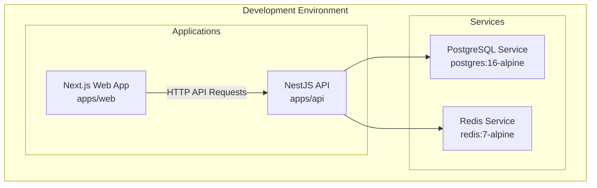
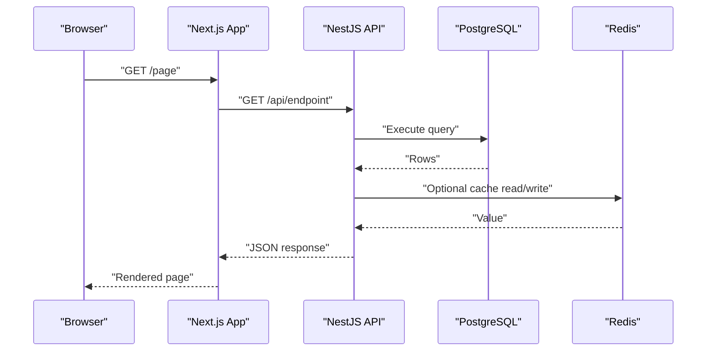
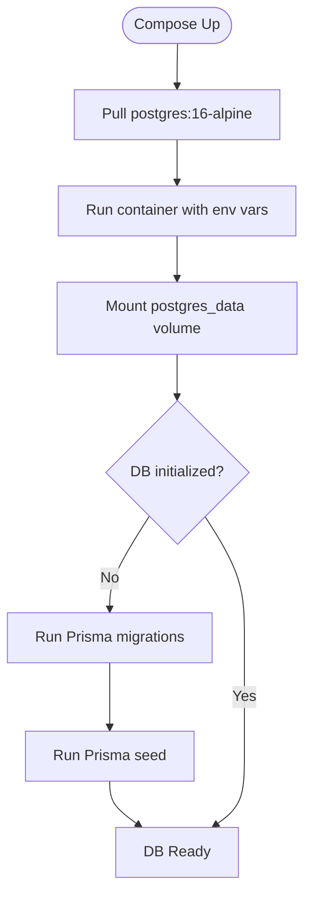
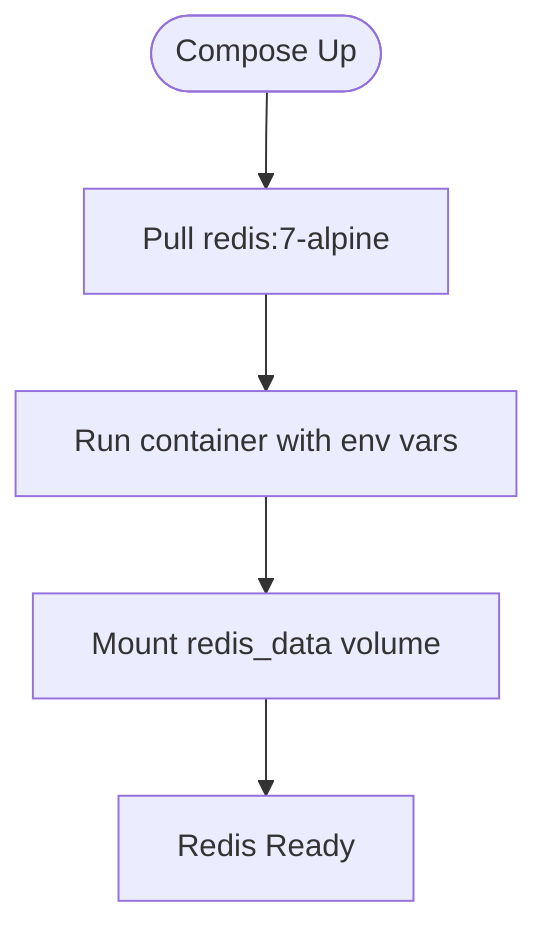
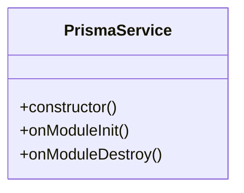
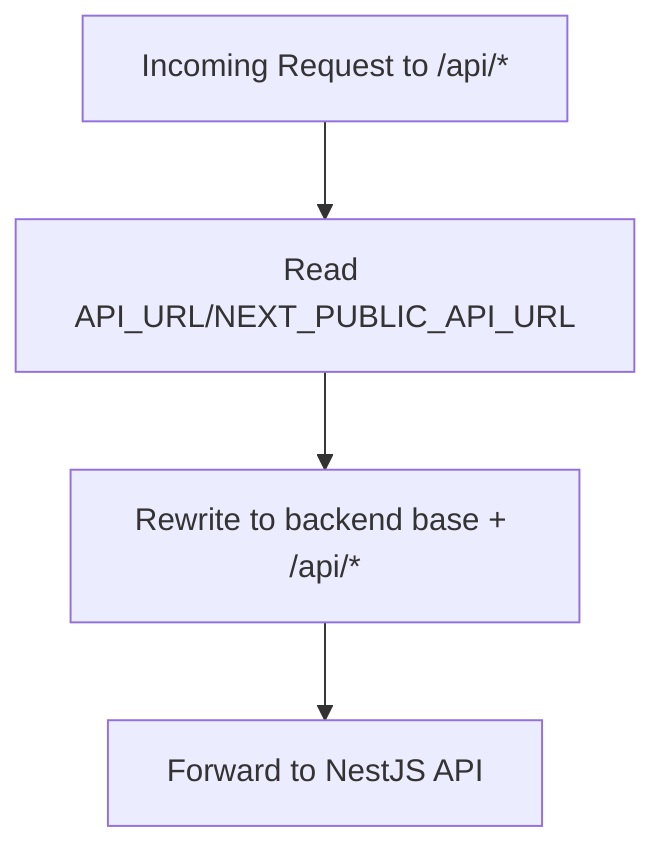
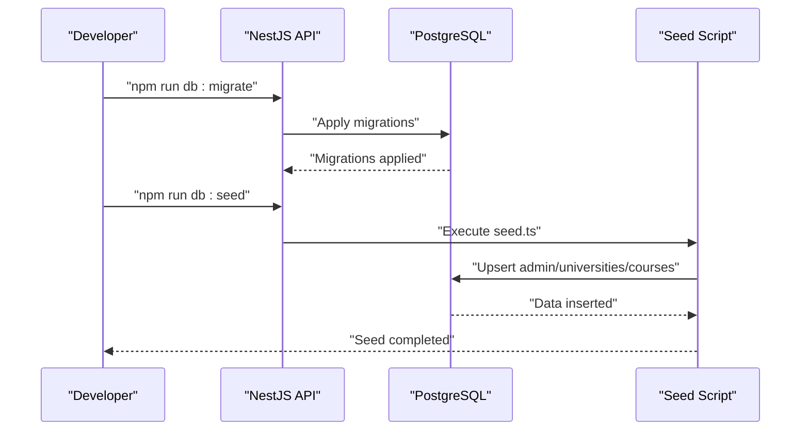
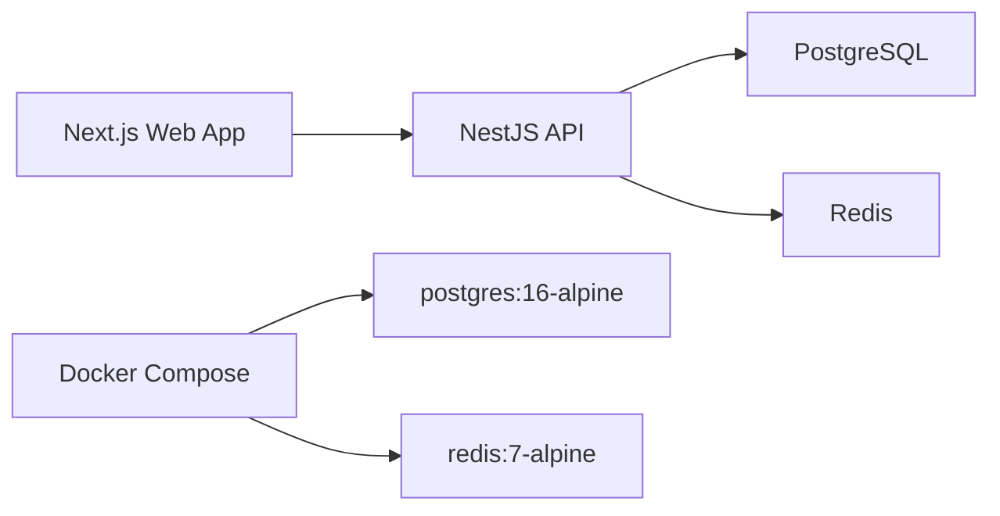

# Docker Configuration

<cite>
**Referenced Files in This Document**
- [docker-compose.yml](file://docker-compose.yml)
- [.env](file://apps/api/.env)
- [.env.example](file://apps/api/.env.example)
- [schema.prisma](file://apps/api/prisma/schema.prisma)
- [prisma.service.ts](file://apps/api/src/prisma/prisma.service.ts)
- [seed.ts](file://apps/api/prisma/seed.ts)
- [.env.local](file://apps/web/.env.local)
- [.env.example](file://apps/web/.env.example)
- [next.config.js](file://apps/web/next.config.js)
- [package.json](file://apps/api/package.json)
- [package.json](file://apps/web/package.json)
</cite>

## Table of Contents
1. [Introduction](#introduction)
2. [Project Structure](#project-structure)
3. [Core Components](#core-components)
4. [Architecture Overview](#architecture-overview)
5. [Detailed Component Analysis](#detailed-component-analysis)
6. [Dependency Analysis](#dependency-analysis)
7. [Performance Considerations](#performance-considerations)
8. [Troubleshooting Guide](#troubleshooting-guide)
9. [Conclusion](#conclusion)
10. [Appendices](#appendices)

## Introduction
This document explains the Docker configuration for the Yaz Okulu Var Mı? development environment. It focuses on orchestrating PostgreSQL and Redis services via Docker Compose, configuring environment variables for the backend and frontend, and detailing database initialization and data persistence strategies. It also covers service dependencies, health considerations, performance tips for local development, and customization approaches for different environments.

## Project Structure
The development stack consists of:
- PostgreSQL database service for relational data
- Redis cache service for caching hot queries
- Backend NestJS API configured to connect to PostgreSQL and Redis
- Frontend Next.js application configured to proxy API requests to the backend

**Diagram sources**
- [docker-compose.yml](file://docker-compose.yml#L6-L29)
- [prisma.service.ts](file://apps/api/src/prisma/prisma.service.ts#L8-L21)

**Section sources**
- [docker-compose.yml](file://docker-compose.yml#L1-L34)
- [package.json](file://apps/api/package.json#L6-L18)
- [package.json](file://apps/web/package.json#L6-L11)

## Core Components
- PostgreSQL service
  - Image: postgres:16-alpine
  - Container name: yov-postgres
  - Ports: 5432:5432
  - Volumes: postgres_data mounted to /var/lib/postgresql/data
  - Environment: POSTGRES_USER, POSTGRES_PASSWORD, POSTGRES_DB
- Redis service
  - Image: redis:7-alpine
  - Container name: yov-redis
  - Ports: 6379:6379
  - Volumes: redis_data mounted to /data
- Backend API environment variables
  - DATABASE_URL pointing to localhost:5432
  - JWT_SECRET for authentication
  - PORT for the API server
  - FRONTEND_URL for CORS
  - REDIS_URL for caching
- Frontend environment variables
  - NEXT_PUBLIC_API_URL for client-side API routing
  - API_URL for server-side API routing

**Section sources**
- [docker-compose.yml](file://docker-compose.yml#L8-L29)
- [.env](file://apps/api/.env#L1-L6)
- [.env.example](file://apps/api/.env.example#L6-L19)
- [.env.local](file://apps/web/.env.local#L1-L3)
- [.env.example](file://apps/web/.env.example#L6-L12)

## Architecture Overview
The development architecture connects the frontend Next.js application to the backend NestJS API, which persists data in PostgreSQL and optionally caches hot queries in Redis. Docker Compose provisions both services and exposes them on standard ports for local development.

**Diagram sources**
- [docker-compose.yml](file://docker-compose.yml#L8-L29)
- [prisma.service.ts](file://apps/api/src/prisma/prisma.service.ts#L8-L21)
- [next.config.js](file://apps/web/next.config.js#L14-L22)

## Detailed Component Analysis

### PostgreSQL Service
- Purpose: Relational data storage for application entities (Universities, Courses, Users, etc.).
- Configuration highlights:
  - Uses official postgres:16-alpine image.
  - Exposes port 5432 for local connections.
  - Persists data under the named volume postgres_data.
  - Environment variables define credentials and database name.
- Data persistence:
  - Volume mount ensures data survives container recreation.
- Initialization:
  - Prisma schema defines the full model and indexes.
  - Migration and seeding are handled by Prisma CLI commands in the backend package scripts.

**Diagram sources**
- [docker-compose.yml](file://docker-compose.yml#L8-L19)
- [schema.prisma](file://apps/api/prisma/schema.prisma#L7-L10)
- [package.json](file://apps/api/package.json#L11-L16)

**Section sources**
- [docker-compose.yml](file://docker-compose.yml#L8-L19)
- [schema.prisma](file://apps/api/prisma/schema.prisma#L7-L10)
- [package.json](file://apps/api/package.json#L11-L16)

### Redis Service
- Purpose: Caching layer for frequently accessed data (e.g., popular searches).
- Configuration highlights:
  - Uses official redis:7-alpine image.
  - Exposes port 6379 for local connections.
  - Persists data under the named volume redis_data.
- Integration:
  - Backend reads REDIS_URL from environment variables.
  - Redis is optional for development; the backend can operate without it.

**Diagram sources**
- [docker-compose.yml](file://docker-compose.yml#L21-L29)

**Section sources**
- [docker-compose.yml](file://docker-compose.yml#L21-L29)
- [.env](file://apps/api/.env#L5-L5)

### Backend NestJS API
- Database connectivity:
  - Reads DATABASE_URL from environment variables.
  - Uses Prisma Client configured via PrismaService.
- Environment variables:
  - DATABASE_URL, JWT_SECRET, PORT, FRONTEND_URL, REDIS_URL.
- Prisma integration:
  - Prisma schema defines models and indexes.
  - Prisma service initializes and disconnects on module lifecycle events.
- Scripts:
  - Provides commands for generating Prisma client, applying migrations, seeding, and opening Studio.

**Diagram sources**
- [prisma.service.ts](file://apps/api/src/prisma/prisma.service.ts#L8-L32)

**Section sources**
- [.env](file://apps/api/.env#L1-L6)
- [.env.example](file://apps/api/.env.example#L6-L19)
- [prisma.service.ts](file://apps/api/src/prisma/prisma.service.ts#L8-L32)
- [schema.prisma](file://apps/api/prisma/schema.prisma#L7-L10)
- [package.json](file://apps/api/package.json#L11-L16)

### Frontend Next.js Application
- API routing:
  - Rewrites /api/* to the backend base URL using API_URL or NEXT_PUBLIC_API_URL.
- Environment variables:
  - NEXT_PUBLIC_API_URL and API_URL configured for local development.
- Proxy behavior:
  - Ensures requests avoid CORS issues during local development.

**Diagram sources**
- [next.config.js](file://apps/web/next.config.js#L14-L22)
- [.env.local](file://apps/web/.env.local#L1-L3)

**Section sources**
- [.env.local](file://apps/web/.env.local#L1-L3)
- [.env.example](file://apps/web/.env.example#L6-L12)
- [next.config.js](file://apps/web/next.config.js#L14-L22)

### Database Initialization and Seeding
- Prisma schema defines the data model and indexes.
- Migration and seeding are orchestrated via package scripts:
  - db:migrate applies migrations to the database.
  - db:seed runs the seed script to populate initial data.
- Seed script creates:
  - An admin user
  - Example universities
  - University staff accounts
  - Sample courses across universities

**Diagram sources**
- [package.json](file://apps/api/package.json#L11-L16)
- [schema.prisma](file://apps/api/prisma/schema.prisma#L36-L122)
- [seed.ts](file://apps/api/prisma/seed.ts#L11-L106)

**Section sources**
- [schema.prisma](file://apps/api/prisma/schema.prisma#L36-L122)
- [seed.ts](file://apps/api/prisma/seed.ts#L11-L106)
- [package.json](file://apps/api/package.json#L11-L16)

## Dependency Analysis
- Service dependencies:
  - Backend depends on PostgreSQL availability.
  - Backend optionally depends on Redis availability.
  - Frontend depends on backend being reachable at the configured API URL.
- Port mappings:
  - PostgreSQL: 5432/tcp
  - Redis: 6379/tcp
  - Backend: configurable via PORT (default 4000)
  - Frontend: Next.js default 3000
- Volume management:
  - postgres_data persists PostgreSQL data.
  - redis_data persists Redis data.

**Diagram sources**
- [docker-compose.yml](file://docker-compose.yml#L8-L29)

**Section sources**
- [docker-compose.yml](file://docker-compose.yml#L16-L29)
- [package.json](file://apps/api/package.json#L12-L12)
- [package.json](file://apps/web/package.json#L7-L7)

## Performance Considerations
- Local development tips:
  - Keep PostgreSQL and Redis containers running persistently with restart policies.
  - Use named volumes to avoid data loss across container rebuilds.
  - Prefer incremental migrations and targeted seeds to reduce downtime.
- Caching:
  - Enable Redis only when needed to reduce complexity in local setups.
  - Monitor cache hit rates and tune TTLs for hot keys.
- Network:
  - Use localhost bindings for services to avoid unnecessary NAT overhead.
  - Ensure frontend and backend ports do not conflict with other local processes.

[No sources needed since this section provides general guidance]

## Troubleshooting Guide
- Cannot connect to PostgreSQL:
  - Verify the service is healthy and the port is exposed.
  - Confirm DATABASE_URL matches the host/port and credentials.
  - Check that migrations have been applied.
- Cannot connect to Redis:
  - Verify the service is healthy and the port is exposed.
  - Confirm REDIS_URL matches the host/port.
- CORS errors in development:
  - Ensure NEXT_PUBLIC_API_URL and API_URL point to the backend base URL.
  - Confirm Next.js rewrites are active.
- Database initialization failures:
  - Run migrations and seed again after fixing credentials or schema issues.
  - Check Prisma logs during startup for connection errors.

**Section sources**
- [docker-compose.yml](file://docker-compose.yml#L12-L19)
- [docker-compose.yml](file://docker-compose.yml#L25-L29)
- [.env](file://apps/api/.env#L1-L6)
- [.env.local](file://apps/web/.env.local#L1-L3)
- [prisma.service.ts](file://apps/api/src/prisma/prisma.service.ts#L23-L30)
- [package.json](file://apps/api/package.json#L11-L16)

## Conclusion
The Docker Compose setup provides a reproducible development environment with PostgreSQL and Redis. Together with environment variables and Prisma-based initialization, it enables rapid iteration on the backend and frontend while maintaining data persistence and predictable service dependencies.

[No sources needed since this section summarizes without analyzing specific files]

## Appendices

### Environment Variable Reference
- Backend (apps/api):
  - DATABASE_URL: Connection string to PostgreSQL
  - JWT_SECRET: Secret for signing tokens
  - PORT: API server port
  - FRONTEND_URL: Allowed origin for CORS
  - REDIS_URL: Connection string to Redis
- Frontend (apps/web):
  - NEXT_PUBLIC_API_URL: Public API base URL for client-side requests
  - API_URL: Server-side API base URL (without /api suffix)

**Section sources**
- [.env.example](file://apps/api/.env.example#L6-L19)
- [.env.local](file://apps/web/.env.local#L1-L3)
- [.env.example](file://apps/web/.env.example#L6-L12)

### Customization Examples
- Change database credentials:
  - Update POSTGRES_USER, POSTGRES_PASSWORD, POSTGRES_DB in Compose.
  - Update DATABASE_URL accordingly in backend environment.
- Switch backend port:
  - Modify PORT in backend environment and ensure frontend API URLs reflect the change.
- Enable Redis caching:
  - Ensure REDIS_URL is set and Redis service is healthy.
  - Implement cache layers in backend services as needed.

**Section sources**
- [docker-compose.yml](file://docker-compose.yml#L12-L15)
- [.env](file://apps/api/.env#L1-L6)
- [.env.local](file://apps/web/.env.local#L1-L3)

### Scaling Considerations
- Horizontal scaling:
  - Scale the backend API pods behind a load balancer.
  - Ensure shared state remains externalized (PostgreSQL and Redis).
- Read replicas:
  - Consider adding a PostgreSQL replica for reporting workloads.
- Caching:
  - Use Redis clustering for high-throughput scenarios.
- Observability:
  - Add health checks and metrics collection for services.

[No sources needed since this section provides general guidance]