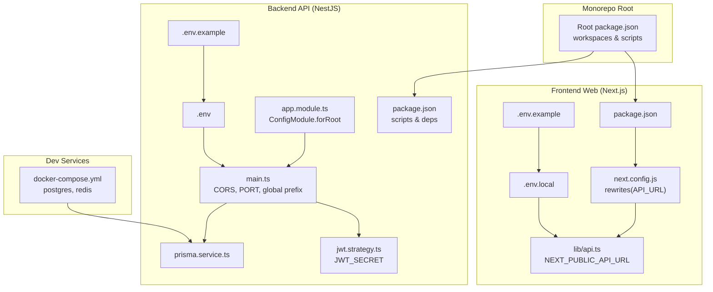
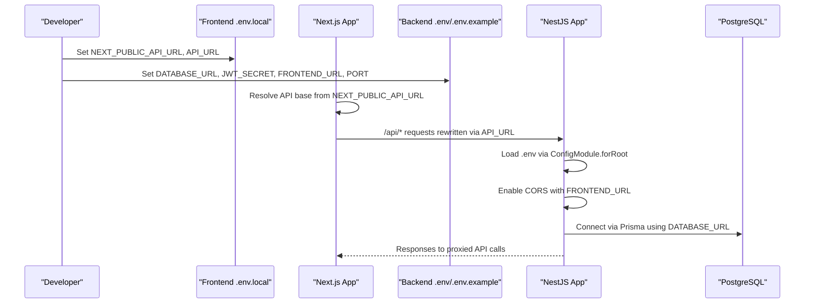
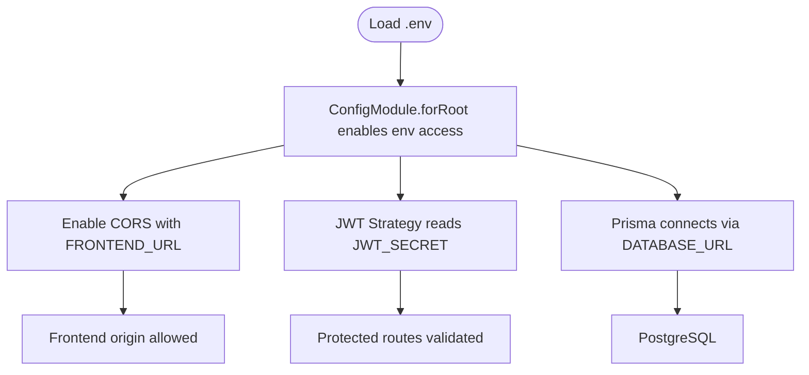
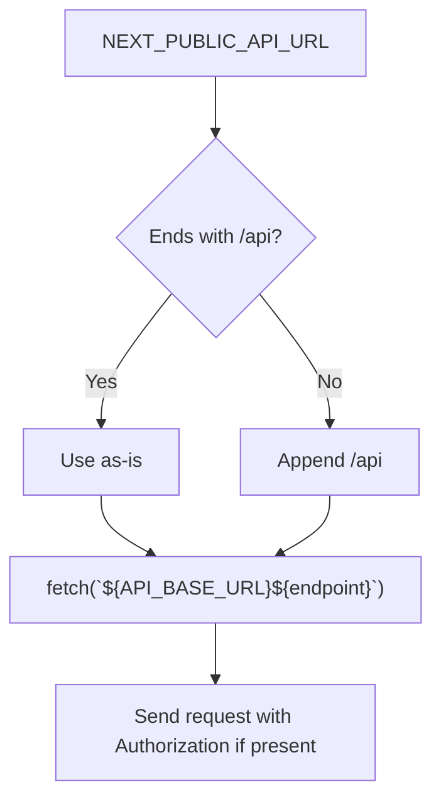
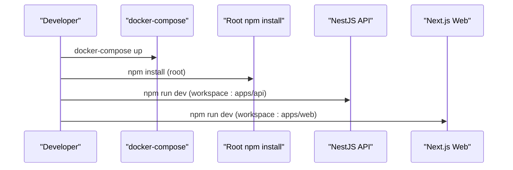
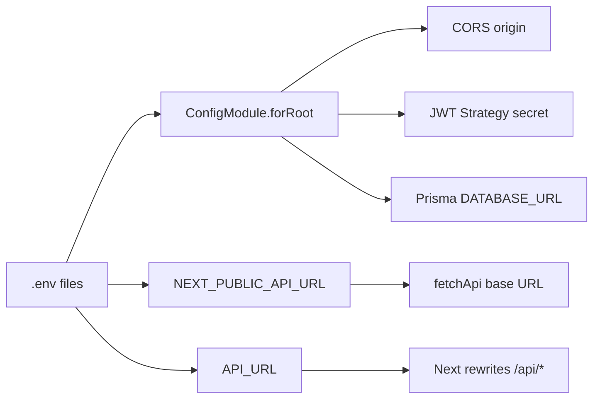

# Environment Configuration

<cite>
**Referenced Files in This Document**
- [apps/api/.env.example](file://apps/api/.env.example)
- [apps/api/.env](file://apps/api/.env)
- [apps/api/src/app.module.ts](file://apps/api/src/app.module.ts)
- [apps/api/src/main.ts](file://apps/api/src/main.ts)
- [apps/api/src/modules/auth/jwt.strategy.ts](file://apps/api/src/modules/auth/jwt.strategy.ts)
- [apps/api/src/prisma/prisma.service.ts](file://apps/api/src/prisma/prisma.service.ts)
- [apps/api/package.json](file://apps/api/package.json)
- [apps/web/.env.example](file://apps/web/.env.example)
- [apps/web/.env.local](file://apps/web/.env.local)
- [apps/web/lib/api.ts](file://apps/web/lib/api.ts)
- [apps/web/next.config.js](file://apps/web/next.config.js)
- [apps/web/package.json](file://apps/web/package.json)
- [docker-compose.yml](file://docker-compose.yml)
- [DEPLOYMENT.md](file://DEPLOYMENT.md)
- [scripts/deploy-server.sh](file://scripts/deploy-server.sh)
- [package.json](file://package.json)
</cite>

## Table of Contents
1. [Introduction](#introduction)
2. [Project Structure](#project-structure)
3. [Core Components](#core-components)
4. [Architecture Overview](#architecture-overview)
5. [Detailed Component Analysis](#detailed-component-analysis)
6. [Dependency Analysis](#dependency-analysis)
7. [Performance Considerations](#performance-considerations)
8. [Troubleshooting Guide](#troubleshooting-guide)
9. [Conclusion](#conclusion)
10. [Appendices](#appendices)

## Introduction
This document explains how environment variables are structured and used across the backend (NestJS API) and frontend (Next.js Web) applications in Yaz Okulu Var Mı?. It covers database connections, authentication settings, API endpoints, service configurations, differences between development, staging, and production environments, secret management, configuration validation, the .env.example template usage, local development setup, security best practices, environment-specific examples, troubleshooting, and migration procedures between environments.

## Project Structure
The project is a monorepo with two primary applications:
- Backend API: NestJS application using @nestjs/config for environment loading, Prisma for database, and Passport-JWT for authentication.
- Frontend Web: Next.js application that proxies API requests via Next’s rewrites and reads environment variables for API base URLs.

**Diagram sources**
- [package.json](file://package.json#L6-L18)
- [apps/api/.env.example](file://apps/api/.env.example#L1-L20)
- [apps/api/.env](file://apps/api/.env#L1-L6)
- [apps/api/src/main.ts](file://apps/api/src/main.ts#L10-L31)
- [apps/api/src/app.module.ts](file://apps/api/src/app.module.ts#L30-L45)
- [apps/api/src/prisma/prisma.service.ts](file://apps/api/src/prisma/prisma.service.ts#L8-L32)
- [apps/api/src/modules/auth/jwt.strategy.ts](file://apps/api/src/modules/auth/jwt.strategy.ts#L22-L32)
- [apps/web/.env.example](file://apps/web/.env.example#L1-L13)
- [apps/web/.env.local](file://apps/web/.env.local#L1-L3)
- [apps/web/lib/api.ts](file://apps/web/lib/api.ts#L7-L8)
- [apps/web/next.config.js](file://apps/web/next.config.js#L14-L22)
- [docker-compose.yml](file://docker-compose.yml#L6-L34)

**Section sources**
- [package.json](file://package.json#L6-L18)
- [apps/api/.env.example](file://apps/api/.env.example#L1-L20)
- [apps/api/.env](file://apps/api/.env#L1-L6)
- [apps/web/.env.example](file://apps/web/.env.example#L1-L13)
- [apps/web/.env.local](file://apps/web/.env.local#L1-L3)
- [apps/api/src/app.module.ts](file://apps/api/src/app.module.ts#L30-L45)
- [apps/api/src/main.ts](file://apps/api/src/main.ts#L10-L31)
- [apps/api/src/prisma/prisma.service.ts](file://apps/api/src/prisma/prisma.service.ts#L8-L32)
- [apps/api/src/modules/auth/jwt.strategy.ts](file://apps/api/src/modules/auth/jwt.strategy.ts#L22-L32)
- [apps/web/lib/api.ts](file://apps/web/lib/api.ts#L7-L8)
- [apps/web/next.config.js](file://apps/web/next.config.js#L14-L22)
- [docker-compose.yml](file://docker-compose.yml#L6-L34)

## Core Components
- Backend environment variables:
  - Database connection via DATABASE_URL for Prisma.
  - JWT signing secret via JWT_SECRET.
  - Server port via PORT.
  - Frontend origin for CORS via FRONTEND_URL.
  - Optional Redis cache via REDIS_URL.
- Frontend environment variables:
  - NEXT_PUBLIC_API_URL for client-side API base (must end with /api).
  - API_URL for server-side API base (without /api).
- Development services:
  - Docker Compose defines postgres and redis containers with exposed ports and volumes.

**Section sources**
- [apps/api/.env.example](file://apps/api/.env.example#L6-L19)
- [apps/api/.env](file://apps/api/.env#L1-L6)
- [apps/web/.env.example](file://apps/web/.env.example#L6-L12)
- [apps/web/.env.local](file://apps/web/.env.local#L1-L3)
- [docker-compose.yml](file://docker-compose.yml#L8-L29)

## Architecture Overview
Environment-driven configuration flows through NestJS ConfigModule and Next.js runtime. The backend loads .env globally, applies CORS from FRONTEND_URL, and uses JWT_SECRET for token validation. The frontend resolves API base URLs from NEXT_PUBLIC_API_URL and API_URL, and Next rewrites proxy requests to the backend.

**Diagram sources**
- [apps/web/.env.local](file://apps/web/.env.local#L1-L3)
- [apps/web/lib/api.ts](file://apps/web/lib/api.ts#L7-L8)
- [apps/web/next.config.js](file://apps/web/next.config.js#L14-L22)
- [apps/api/.env](file://apps/api/.env#L1-L6)
- [apps/api/src/app.module.ts](file://apps/api/src/app.module.ts#L30-L36)
- [apps/api/src/main.ts](file://apps/api/src/main.ts#L14-L23)
- [apps/api/src/prisma/prisma.service.ts](file://apps/api/src/prisma/prisma.service.ts#L12-L21)

## Detailed Component Analysis

### Backend Environment Variables
- DATABASE_URL: Used by Prisma to connect to PostgreSQL. The Docker Compose service exposes a Postgres container with matching credentials and database name.
- JWT_SECRET: Used by Passport-JWT strategy to sign and verify tokens. The strategy reads this value from ConfigService.
- PORT: Server port for the NestJS application.
- FRONTEND_URL: Origin for CORS configuration so the frontend can call the backend.
- REDIS_URL: Placeholder for caching; currently defined in templates but not actively used in runtime code.

**Diagram sources**
- [apps/api/src/app.module.ts](file://apps/api/src/app.module.ts#L30-L36)
- [apps/api/src/main.ts](file://apps/api/src/main.ts#L14-L23)
- [apps/api/src/modules/auth/jwt.strategy.ts](file://apps/api/src/modules/auth/jwt.strategy.ts#L22-L32)
- [apps/api/src/prisma/prisma.service.ts](file://apps/api/src/prisma/prisma.service.ts#L12-L21)
- [apps/api/.env](file://apps/api/.env#L1-L6)

**Section sources**
- [apps/api/.env.example](file://apps/api/.env.example#L6-L19)
- [apps/api/.env](file://apps/api/.env#L1-L6)
- [apps/api/src/app.module.ts](file://apps/api/src/app.module.ts#L30-L36)
- [apps/api/src/main.ts](file://apps/api/src/main.ts#L14-L23)
- [apps/api/src/modules/auth/jwt.strategy.ts](file://apps/api/src/modules/auth/jwt.strategy.ts#L22-L32)
- [apps/api/src/prisma/prisma.service.ts](file://apps/api/src/prisma/prisma.service.ts#L12-L21)

### Frontend Environment Variables
- NEXT_PUBLIC_API_URL: Client-side base URL for API calls. The frontend normalizes it to ensure it ends with /api.
- API_URL: Server-side base URL used by Next rewrites to proxy /api/* to the backend without appending /api again.

**Diagram sources**
- [apps/web/lib/api.ts](file://apps/web/lib/api.ts#L7-L36)
- [apps/web/next.config.js](file://apps/web/next.config.js#L14-L22)

**Section sources**
- [apps/web/.env.example](file://apps/web/.env.example#L6-L12)
- [apps/web/.env.local](file://apps/web/.env.local#L1-L3)
- [apps/web/lib/api.ts](file://apps/web/lib/api.ts#L7-L36)
- [apps/web/next.config.js](file://apps/web/next.config.js#L14-L22)

### Development, Staging, and Production Environments
- Development:
  - Local .env files define localhost URLs for both frontend and backend.
  - Docker Compose runs Postgres and Redis locally for quick iteration.
- Staging:
  - Use staging DNS or IP for FRONTEND_URL and API_URL.
  - Store secrets in secure secret managers; avoid committing secrets to repositories.
- Production:
  - Use strong JWT_SECRET and robust database credentials.
  - Configure reverse proxy (e.g., Nginx) to route /api and root traffic to backend and frontend respectively.
  - Run services under process managers (e.g., PM2) and ensure proper logging and monitoring.

**Section sources**
- [apps/api/.env.example](file://apps/api/.env.example#L6-L19)
- [apps/web/.env.example](file://apps/web/.env.example#L6-L12)
- [docker-compose.yml](file://docker-compose.yml#L8-L29)
- [DEPLOYMENT.md](file://DEPLOYMENT.md#L159-L185)

### Secret Management Practices
- Never commit secrets to version control. Keep .env files out of .gitignore and ensure they remain local.
- Rotate JWT_SECRET regularly and invalidate sessions after rotation.
- Use OS-level secret stores or CI/CD secret managers for staging and production deployments.
- Restrict access to deployment servers and databases.

[No sources needed since this section provides general guidance]

### Configuration Validation
- Backend:
  - ConfigModule.forRoot makes environment variables globally available.
  - Validate required keys during bootstrap (e.g., FRONTEND_URL presence for CORS).
- Frontend:
  - NEXT_PUBLIC_API_URL must end with /api; otherwise the client normalizes it.
  - API_URL must not include /api; Next rewrites append it.

**Section sources**
- [apps/api/src/app.module.ts](file://apps/api/src/app.module.ts#L30-L36)
- [apps/api/src/main.ts](file://apps/api/src/main.ts#L14-L23)
- [apps/web/lib/api.ts](file://apps/web/lib/api.ts#L7-L8)
- [apps/web/next.config.js](file://apps/web/next.config.js#L14-L22)

### .env.example Template Usage
- Backend:
  - Copy .env.example to .env and fill in DATABASE_URL, JWT_SECRET, PORT, FRONTEND_URL, REDIS_URL.
- Frontend:
  - Copy .env.example to .env.local and set NEXT_PUBLIC_API_URL and API_URL.

**Section sources**
- [apps/api/.env.example](file://apps/api/.env.example#L1-L4)
- [apps/web/.env.example](file://apps/web/.env.example#L1-L4)

### Local Development Setup
- Start services with Docker Compose to provision Postgres and Redis.
- Install dependencies at the monorepo root.
- Run backend and frontend in watch mode using root scripts or workspace commands.

**Diagram sources**
- [docker-compose.yml](file://docker-compose.yml#L6-L34)
- [package.json](file://package.json#L10-L18)
- [apps/api/package.json](file://apps/api/package.json#L6-L18)
- [apps/web/package.json](file://apps/web/package.json#L6-L11)

**Section sources**
- [docker-compose.yml](file://docker-compose.yml#L6-L34)
- [package.json](file://package.json#L10-L18)
- [apps/api/package.json](file://apps/api/package.json#L6-L18)
- [apps/web/package.json](file://apps/web/package.json#L6-L11)

### Security Best Practices for Sensitive Data
- Use strong random secrets for JWT_SECRET.
- Limit database user privileges and rotate passwords.
- Enforce HTTPS in production and secure cookies.
- Sanitize logs to avoid leaking secrets.
- Use mTLS or network policies to restrict inter-service access.

[No sources needed since this section provides general guidance]

### Examples of Environment-Specific Configurations
- Development:
  - BACKEND: DATABASE_URL pointing to local Postgres, FRONTEND_URL=http://localhost:3000, PORT=4000.
  - FRONTEND: NEXT_PUBLIC_API_URL=http://localhost:4000/api, API_URL=http://localhost:4000.
- Production:
  - BACKEND: DATABASE_URL to managed Postgres, JWT_SECRET rotated, FRONTEND_URL to domain, PORT behind reverse proxy.
  - FRONTEND: NEXT_PUBLIC_API_URL to backend domain with /api, API_URL to backend without /api.

**Section sources**
- [apps/api/.env.example](file://apps/api/.env.example#L6-L19)
- [apps/web/.env.example](file://apps/web/.env.example#L6-L12)
- [DEPLOYMENT.md](file://DEPLOYMENT.md#L84-L91)
- [DEPLOYMENT.md](file://DEPLOYMENT.md#L123-L127)

### Migration Procedures Between Environments
- Database:
  - Generate Prisma client and apply migrations in each environment.
  - Seed initial data after migrations where applicable.
- Secrets:
  - Inject secrets via environment variables or secret managers per environment.
- Reverse Proxy:
  - Configure Nginx to route /api to backend and root to frontend in production.

**Section sources**
- [apps/api/package.json](file://apps/api/package.json#L11-L16)
- [DEPLOYMENT.md](file://DEPLOYMENT.md#L94-L102)
- [DEPLOYMENT.md](file://DEPLOYMENT.md#L159-L185)

## Dependency Analysis
Environment variables propagate through configuration layers and runtime components. The backend depends on ConfigModule for environment access, Prisma for database connectivity, and Passport-JWT for authentication. The frontend depends on NEXT_PUBLIC_API_URL and API_URL for routing and rewrites.

**Diagram sources**
- [apps/api/src/app.module.ts](file://apps/api/src/app.module.ts#L30-L36)
- [apps/api/src/main.ts](file://apps/api/src/main.ts#L14-L23)
- [apps/api/src/modules/auth/jwt.strategy.ts](file://apps/api/src/modules/auth/jwt.strategy.ts#L22-L32)
- [apps/api/src/prisma/prisma.service.ts](file://apps/api/src/prisma/prisma.service.ts#L12-L21)
- [apps/web/lib/api.ts](file://apps/web/lib/api.ts#L7-L8)
- [apps/web/next.config.js](file://apps/web/next.config.js#L14-L22)

**Section sources**
- [apps/api/src/app.module.ts](file://apps/api/src/app.module.ts#L30-L36)
- [apps/api/src/main.ts](file://apps/api/src/main.ts#L14-L23)
- [apps/api/src/modules/auth/jwt.strategy.ts](file://apps/api/src/modules/auth/jwt.strategy.ts#L22-L32)
- [apps/api/src/prisma/prisma.service.ts](file://apps/api/src/prisma/prisma.service.ts#L12-L21)
- [apps/web/lib/api.ts](file://apps/web/lib/api.ts#L7-L8)
- [apps/web/next.config.js](file://apps/web/next.config.js#L14-L22)

## Performance Considerations
- Keep CORS origins minimal and precise to reduce preflight overhead.
- Use connection pooling and Prisma client lifecycle hooks appropriately.
- Avoid excessive logging of sensitive data; sanitize logs in production.

[No sources needed since this section provides general guidance]

## Troubleshooting Guide
Common issues and resolutions:
- Double /api in URL:
  - Ensure NEXT_PUBLIC_API_URL ends with /api and API_URL does not include /api; Next rewrites append /api automatically.
- npm config load errors:
  - Use the provided deploy script to reset nvm prefix and .npmrc, then retry installation.
- Missing migration files:
  - Ensure migrations are committed and not ignored by .gitignore before applying.
- Seed script not found:
  - Use the correct workspace command for seeding.

**Section sources**
- [apps/web/lib/api.ts](file://apps/web/lib/api.ts#L7-L8)
- [apps/web/next.config.js](file://apps/web/next.config.js#L14-L22)
- [scripts/deploy-server.sh](file://scripts/deploy-server.sh#L13-L23)
- [DEPLOYMENT.md](file://DEPLOYMENT.md#L189-L248)

## Conclusion
Environment configuration in Yaz Okulu Var Mı? is centralized around .env files for both backend and frontend, with Docker Compose supporting local development. The backend uses @nestjs/config and Passport-JWT for secure authentication, while the frontend proxies API calls via Next rewrites. Following the outlined practices ensures secure, maintainable, and scalable deployments across development, staging, and production environments.

[No sources needed since this section summarizes without analyzing specific files]

## Appendices
- Root scripts orchestrate workspace builds and database tasks.
- Deployment guide outlines manual steps and a deploy script for automated setups.

**Section sources**
- [package.json](file://package.json#L10-L18)
- [DEPLOYMENT.md](file://DEPLOYMENT.md#L1-L267)
- [scripts/deploy-server.sh](file://scripts/deploy-server.sh#L1-L70)