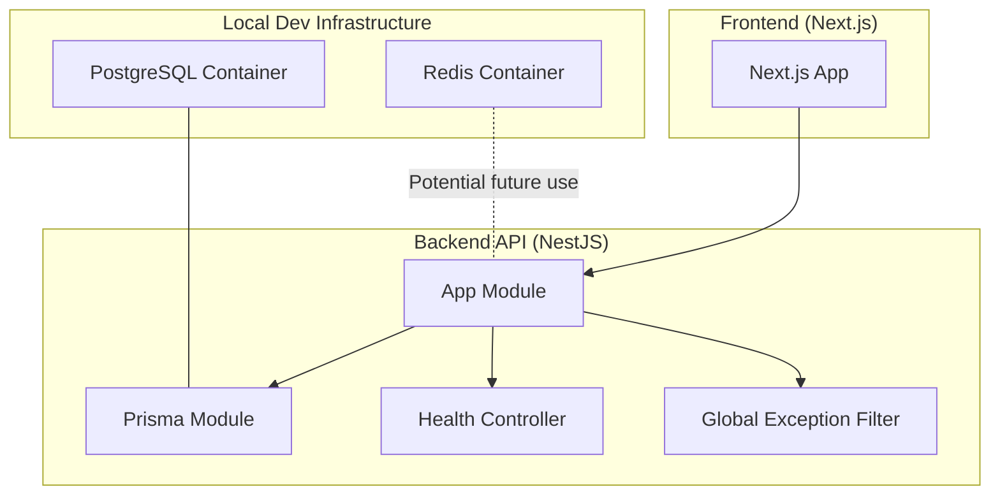
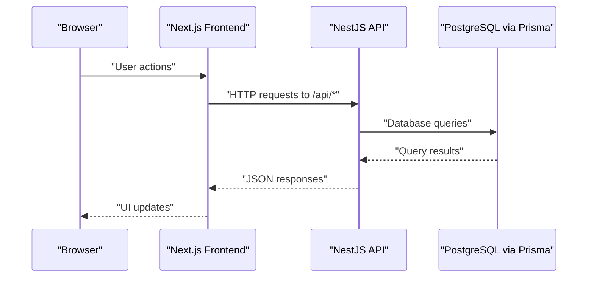
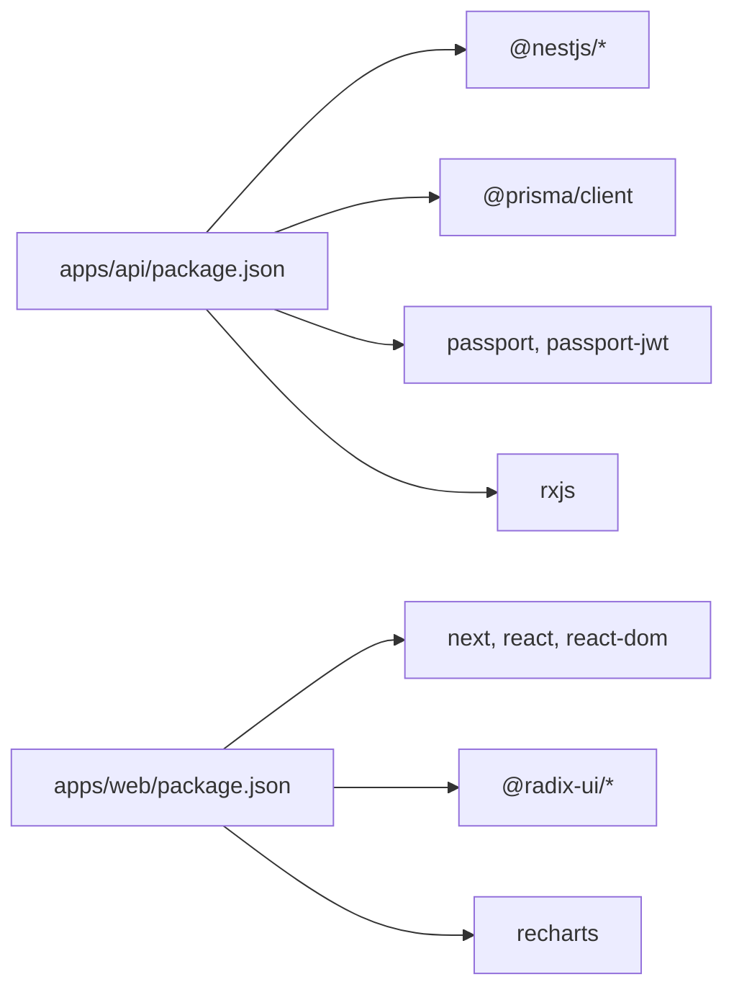

# Monitoring and Maintenance

<cite>
**Referenced Files in This Document**
- [docker-compose.yml](file://docker-compose.yml)
- [DEPLOYMENT.md](file://DEPLOYMENT.md)
- [scripts/deploy-server.sh](file://scripts/deploy-server.sh)
- [apps/api/package.json](file://apps/api/package.json)
- [apps/web/package.json](file://apps/web/package.json)
- [apps/api/src/app.module.ts](file://apps/api/src/app.module.ts)
- [apps/api/src/main.ts](file://apps/api/src/main.ts)
- [apps/api/src/common/filters/http-exception.filter.ts](file://apps/api/src/common/filters/http-exception.filter.ts)
- [apps/api/src/prisma/prisma.module.ts](file://apps/api/src/prisma/prisma.module.ts)
- [apps/api/src/prisma/prisma.service.ts](file://apps/api/src/prisma/prisma.service.ts)
- [apps/api/prisma/schema.prisma](file://apps/api/prisma/schema.prisma)
- [apps/api/src/modules/search-log/search-log.service.ts](file://apps/api/src/modules/search-log/search-log.service.ts)
- [apps/api/.env.example](file://apps/api/.env.example)
- [apps/web/.env.example](file://apps/web/.env.example)
</cite>

## Table of Contents
1. [Introduction](#introduction)
2. [Project Structure](#project-structure)
3. [Core Components](#core-components)
4. [Architecture Overview](#architecture-overview)
5. [Detailed Component Analysis](#detailed-component-analysis)
6. [Dependency Analysis](#dependency-analysis)
7. [Performance Considerations](#performance-considerations)
8. [Troubleshooting Guide](#troubleshooting-guide)
9. [Conclusion](#conclusion)
10. [Appendices](#appendices)

## Introduction
This document provides comprehensive monitoring and maintenance guidance for Yaz Okulu Var Mı?. It covers application health checks, performance monitoring setup, log aggregation strategies, and alerting mechanisms. It also documents database maintenance procedures, cache management, backup strategies, and disaster recovery planning. Additionally, it outlines monitoring tools integration, metrics collection, performance profiling, capacity planning, maintenance schedules, update procedures, security patches, system optimization techniques, and troubleshooting guides for common operational issues.

## Project Structure
The project is a monorepo with two primary applications:
- Backend API built with NestJS
- Frontend web application built with Next.js

Supporting infrastructure includes Docker Compose for local development with PostgreSQL and Redis.

**Diagram sources**
- [docker-compose.yml](file://docker-compose.yml#L6-L29)
- [apps/api/src/app.module.ts](file://apps/api/src/app.module.ts#L17-L28)
- [apps/api/src/prisma/prisma.module.ts](file://apps/api/src/prisma/prisma.module.ts#L5-L13)
- [apps/api/src/common/filters/http-exception.filter.ts](file://apps/api/src/common/filters/http-exception.filter.ts#L16-L48)

**Section sources**
- [docker-compose.yml](file://docker-compose.yml#L1-L34)
- [apps/api/src/app.module.ts](file://apps/api/src/app.module.ts#L17-L28)
- [apps/api/src/prisma/prisma.module.ts](file://apps/api/src/prisma/prisma.module.ts#L5-L13)

## Core Components
- Health endpoint: GET / returns service status and timestamp.
- Global exception filter: Centralized error handling with structured JSON responses and logging.
- Prisma integration: Singleton client with logging configured for query/info/warn/error events.
- Environment configuration: Separate .env.example files for backend and frontend with database, JWT, port, CORS, and Redis URL placeholders.

Key operational capabilities:
- Application health check via root endpoint.
- Structured error reporting and logging for diagnostics.
- Database connectivity managed centrally through Prisma.
- Modular NestJS architecture enabling scalable feature development.

**Section sources**
- [apps/api/src/app.module.ts](file://apps/api/src/app.module.ts#L17-L28)
- [apps/api/src/common/filters/http-exception.filter.ts](file://apps/api/src/common/filters/http-exception.filter.ts#L16-L48)
- [apps/api/src/prisma/prisma.service.ts](file://apps/api/src/prisma/prisma.service.ts#L8-L32)
- [apps/api/.env.example](file://apps/api/.env.example#L6-L19)
- [apps/web/.env.example](file://apps/web/.env.example#L6-L12)

## Architecture Overview
The system comprises:
- Frontend Next.js application communicating with the backend API.
- Backend NestJS API exposing REST endpoints under /api with a global prefix and CORS enabled.
- Database layer powered by Prisma and PostgreSQL.
- Optional Redis cache for frequently accessed data.

**Diagram sources**
- [apps/api/src/main.ts](file://apps/api/src/main.ts#L14-L23)
- [apps/api/src/prisma/prisma.service.ts](file://apps/api/src/prisma/prisma.service.ts#L12-L21)
- [apps/api/prisma/schema.prisma](file://apps/api/prisma/schema.prisma#L7-L14)

## Detailed Component Analysis

### Health Endpoint
- Location: Root controller in AppModule.
- Behavior: Returns a simple JSON status payload indicating service availability and timestamp.
- Purpose: Primary health check for load balancers, orchestrators, and monitoring systems.

Operational notes:
- Excluded from global prefix to ensure readiness probing works without /api.
- Can be extended to include deeper checks (database connectivity, cache health).

**Section sources**
- [apps/api/src/app.module.ts](file://apps/api/src/app.module.ts#L17-L28)

### Global Exception Filter
- Purpose: Intercepts unhandled exceptions and returns standardized JSON responses.
- Logging: Emits structured error logs with method, URL, and status code.
- Output: Includes success flag, status code, timestamp, path, and message.

Best practices:
- Ensure production environments capture structured logs for correlation.
- Avoid leaking sensitive internal details; keep messages generic while preserving stack traces for diagnostics.

**Section sources**
- [apps/api/src/common/filters/http-exception.filter.ts](file://apps/api/src/common/filters/http-exception.filter.ts#L16-L48)

### Prisma Service and Database Layer
- Singleton client: Ensures single connection lifecycle across the application.
- Logging: Configured to emit query, info, warn, and error events to stdout.
- Schema: Defines models, enums, relations, and indexes optimized for search, filtering, and analytics.

Maintenance implications:
- Indexes support frequent queries (name/code/universityId, isOnline, createdAt).
- JSON fields enable flexible analytics and audit trails.

**Section sources**
- [apps/api/src/prisma/prisma.service.ts](file://apps/api/src/prisma/prisma.service.ts#L8-L32)
- [apps/api/prisma/schema.prisma](file://apps/api/prisma/schema.prisma#L16-L182)

### Search Log Analytics
- Functionality: Logs search queries, filters, result counts, anonymized IPs, and user agents.
- Metrics: Provides total search counts, popular searches, daily statistics, and overview stats.
- Use cases: Platform analytics, academic reporting, and performance tuning.

Operational guidance:
- Monitor growth of SearchLog to size storage and retention policies accordingly.
- Use daily stats for dashboards and trend analysis.

**Section sources**
- [apps/api/src/modules/search-log/search-log.service.ts](file://apps/api/src/modules/search-log/search-log.service.ts#L18-L115)

### Environment Configuration
- Backend (.env.example): DATABASE_URL, JWT_SECRET, PORT, FRONTEND_URL, REDIS_URL.
- Frontend (.env.example): NEXT_PUBLIC_API_URL (with /api suffix), API_URL (without /api).

Security and operational tips:
- Replace placeholder secrets with strong random values in production.
- Keep FRONTEND_URL aligned with deployed origins for CORS.
- Use REDIS_URL for caching when implementing Redis-based cache.

**Section sources**
- [apps/api/.env.example](file://apps/api/.env.example#L6-L19)
- [apps/web/.env.example](file://apps/web/.env.example#L6-L12)

## Dependency Analysis
Runtime and deployment dependencies:
- Backend: NestJS core, Prisma client, Passport/JWT for auth, Express platform.
- Frontend: Next.js, React, TailwindCSS, Radix UI, Recharts.
- Local dev: Docker Compose with PostgreSQL and Redis images.

**Diagram sources**
- [apps/api/package.json](file://apps/api/package.json#L20-L39)
- [apps/web/package.json](file://apps/web/package.json#L12-L26)

**Section sources**
- [apps/api/package.json](file://apps/api/package.json#L20-L39)
- [apps/web/package.json](file://apps/web/package.json#L12-L26)

## Performance Considerations
- Database indexes: Composite indexes on name/code/universityId and selective filters improve search performance.
- JSON fields: Native JSON usage enables flexible analytics but requires careful querying to avoid unnecessary scans.
- Caching: Redis is available for hot-path caching; implement cache keys for search results and frequently accessed metadata.
- Logging overhead: Adjust Prisma log levels in production to reduce noise (e.g., disable query logs).
- Frontend optimization: Leverage Next.js static generation, ISR, and CDN for assets.

[No sources needed since this section provides general guidance]

## Troubleshooting Guide
Common operational issues and resolutions:

- No migration found
  - Verify migrations are committed and tracked; ensure prisma/migrations are not ignored.
  - Apply migrations using the documented commands.

- npm configuration errors
  - Clear nvm prefix conflicts and minimal .npmrc.
  - Alternative: Install Node via NodeSource if nvm causes issues.
  - Use the provided deploy script to automate fixes and installation steps.

- Missing seed script
  - Run the correct seed command from the API directory or workspace root.

- Prisma Decimal type issues
  - Ensure seed uses numeric values instead of Decimal types.

- API 404 with double /api
  - Confirm frontend NEXT_PUBLIC_API_URL ends with /api and server-side API_URL does not include /api.

- Port conflicts or CORS issues
  - Set PORT appropriately and ensure FRONTEND_URL matches the origin.

- Database connectivity
  - Validate DATABASE_URL and credentials; confirm PostgreSQL is reachable.

- Redis connectivity
  - Configure REDIS_URL for caching features.

**Section sources**
- [DEPLOYMENT.md](file://DEPLOYMENT.md#L189-L258)
- [scripts/deploy-server.sh](file://scripts/deploy-server.sh#L13-L31)
- [apps/api/.env.example](file://apps/api/.env.example#L6-L19)
- [apps/web/.env.example](file://apps/web/.env.example#L6-L12)

## Conclusion
This guide consolidates monitoring and maintenance practices for Yaz Okulu Var Mı?, focusing on health checks, centralized error handling, database operations, and operational procedures. By leveraging the health endpoint, structured logging, Prisma’s indexing strategy, and the provided deployment scripts, teams can maintain reliability, performance, and resilience. Extend caching with Redis, implement robust alerting on top of collected logs, and follow the update and backup procedures outlined below to sustain long-term operations.

[No sources needed since this section summarizes without analyzing specific files]

## Appendices

### Monitoring Tools Integration
- Centralized logging: Ship application logs to a log aggregator (e.g., ELK, Loki, Cloud logging).
- Metrics: Export Prometheus metrics from the API for latency, throughput, and error rates.
- Tracing: Add distributed tracing (e.g., OpenTelemetry) to track requests across frontend and backend.
- Dashboards: Visualize database query performance, cache hit ratios, and search analytics.

[No sources needed since this section provides general guidance]

### Metrics Collection
- Application: HTTP request duration, error rate, response size, and route-level breakdowns.
- Database: Slow query logs, index usage, row scans, and connection pool saturation.
- Cache: Hit ratio, evictions, memory usage, and latency.
- Frontend: Largest Contentful Paint (LCP), First Input Delay (FID), and Cumulative Layout Shift (CLS).

[No sources needed since this section provides general guidance]

### Performance Profiling
- Backend: Use NestJS profiling tools and Node.js profiler to identify hotspots.
- Database: Enable slow query log and analyze query plans; add missing indexes as needed.
- Frontend: Audit Next.js performance, optimize bundles, and lazy-load components.

[No sources needed since this section provides general guidance]

### Capacity Planning
- Forecast growth in SearchLog volume and adjust retention and archival policies.
- Scale database and cache based on concurrent users and query patterns.
- Plan horizontal scaling for the API and consider read replicas for analytics-heavy queries.

[No sources needed since this section provides general guidance]

### Maintenance Schedules
- Daily: Review application and database logs for anomalies.
- Weekly: Validate backups, prune old logs, and rotate secrets.
- Monthly: Reassess indexes, update dependencies, and review performance trends.
- Quarterly: Disaster recovery drills and capacity planning reviews.

[No sources needed since this section provides general guidance]

### Update Procedures
- Backend: Build, test, and deploy with PM2; ensure migrations are applied before restart.
- Frontend: Build and deploy static assets; verify API URL configurations.
- Shared: Coordinate downtime windows, communicate with stakeholders, and roll back quickly if needed.

**Section sources**
- [DEPLOYMENT.md](file://DEPLOYMENT.md#L139-L155)

### Security Patches
- Pin dependency versions and monitor advisory feeds.
- Rotate JWT_SECRET and other secrets regularly; enforce environment variable protection.
- Harden database connections and restrict network exposure.

[No sources needed since this section provides general guidance]

### System Optimization Techniques
- Database: Use composite indexes, avoid SELECT *, and batch writes.
- Cache: Implement TTL, cache warming, and cache invalidation strategies.
- Frontend: Optimize images, leverage CDN, and minimize JavaScript payloads.

[No sources needed since this section provides general guidance]

### Database Maintenance Procedures
- Index maintenance: Periodically rebuild fragmented indexes; monitor index bloat.
- Vacuum/analyze: Schedule regular maintenance on PostgreSQL; tune autovacuum thresholds.
- Schema changes: Use Prisma migrations; test in staging before applying to production.

**Section sources**
- [apps/api/prisma/schema.prisma](file://apps/api/prisma/schema.prisma#L116-L122)

### Cache Management
- Redis: Configure persistence, monitor memory usage, and set eviction policies.
- Cache keys: Use structured keys for search results and metadata; invalidate on data changes.
- Warm-up: Preload popular queries during low-traffic periods.

**Section sources**
- [docker-compose.yml](file://docker-compose.yml#L21-L29)
- [apps/api/.env.example](file://apps/api/.env.example#L18-L19)

### Backup Strategies
- Database: Schedule logical backups (e.g., pg_dump) and test restore procedures.
- Volume snapshots: Back up PostgreSQL and Redis persistent volumes.
- Offsite storage: Encrypt and transfer backups to secure offsite locations.

[No sources needed since this section provides general guidance]

### Disaster Recovery Planning
- Recovery time objective (RTO) and recovery point objective (RPO) targets.
- Multi-region deployments: Replicate PostgreSQL and Redis across zones.
- Playbooks: Document step-by-step restoration procedures for database, cache, and application tiers.

[No sources needed since this section provides general guidance]