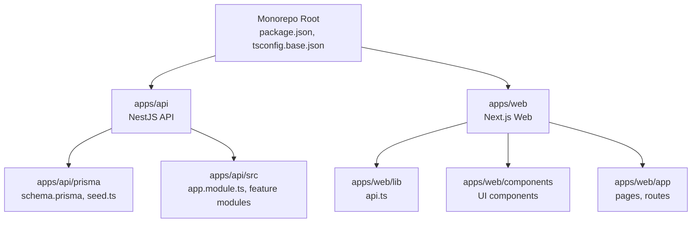
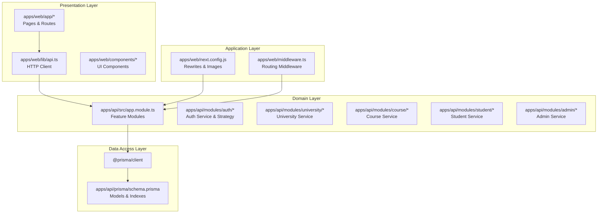
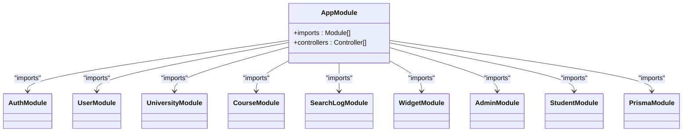
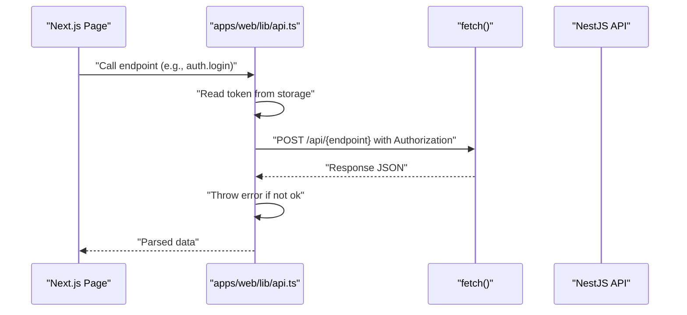
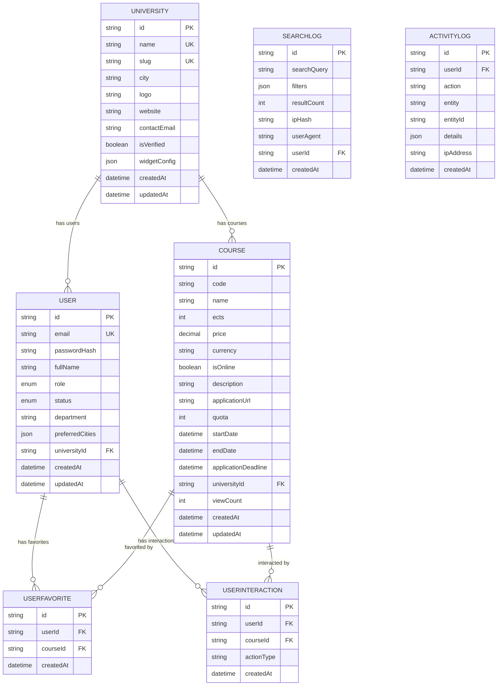
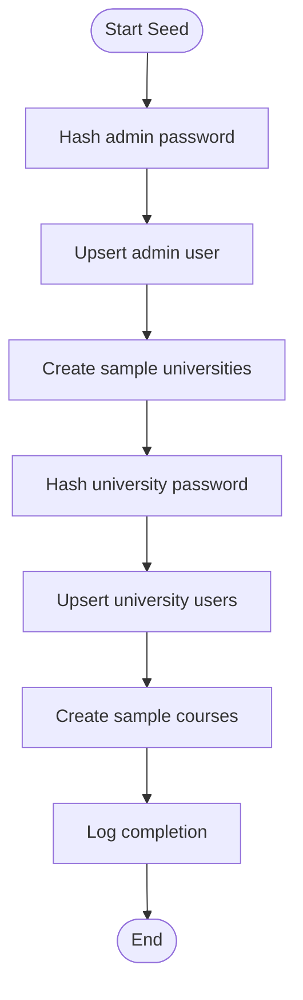
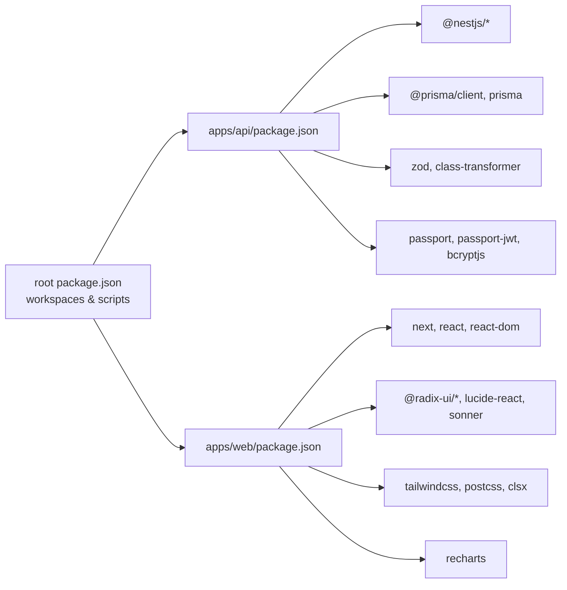

# Development Guidelines

<cite>
**Referenced Files in This Document**
- [package.json](file://package.json)
- [tsconfig.base.json](file://tsconfig.base.json)
- [apps/api/package.json](file://apps/api/package.json)
- [apps/web/package.json](file://apps/web/package.json)
- [apps/api/tsconfig.json](file://apps/api/tsconfig.json)
- [apps/web/tsconfig.json](file://apps/web/tsconfig.json)
- [apps/api/nest-cli.json](file://apps/api/nest-cli.json)
- [apps/api/jest.config.js](file://apps/api/jest.config.js)
- [apps/web/next.config.js](file://apps/web/next.config.js)
- [apps/web/tailwind.config.ts](file://apps/web/tailwind.config.ts)
- [apps/api/prisma/schema.prisma](file://apps/api/prisma/schema.prisma)
- [apps/api/prisma/seed.ts](file://apps/api/prisma/seed.ts)
- [apps/api/src/app.module.ts](file://apps/api/src/app.module.ts)
- [apps/web/lib/api.ts](file://apps/web/lib/api.ts)
- [DEPLOYMENT.md](file://DEPLOYMENT.md)
</cite>

## Table of Contents
1. [Introduction](#introduction)
2. [Project Structure](#project-structure)
3. [Core Components](#core-components)
4. [Architecture Overview](#architecture-overview)
5. [Detailed Component Analysis](#detailed-component-analysis)
6. [Dependency Analysis](#dependency-analysis)
7. [Performance Considerations](#performance-considerations)
8. [Troubleshooting Guide](#troubleshooting-guide)
9. [Conclusion](#conclusion)
10. [Appendices](#appendices)

## Introduction
This document provides comprehensive development guidelines for contributing to Yaz Okulu Var Mı?. It covers code organization standards, file structure conventions, naming patterns, import organization, TypeScript configuration, linting and formatting standards, development workflow, branching and code review processes, testing requirements, commit message conventions, issue templates, pull request guidelines, local development setup, debugging procedures, performance optimization practices, and AI development assistance configuration with Cursor rules and collaborative development practices.

## Project Structure
The project is a monorepo organized with two main applications:
- apps/api: NestJS backend API with Prisma ORM, JWT authentication, and feature modules.
- apps/web: Next.js frontend application with TypeScript, Tailwind CSS, and Radix UI components.

Key conventions observed:
- Workspace scripts in the root package.json orchestrate development and build tasks for both apps.
- Shared TypeScript compiler options are centralized in tsconfig.base.json.
- Each app maintains its own tsconfig.json, nest-cli.json, and app-specific configuration files.
- Prisma schema defines the database model and indexes; seed.ts generates initial data.

**Diagram sources**
- [package.json](file://package.json#L1-L24)
- [tsconfig.base.json](file://tsconfig.base.json#L1-L18)
- [apps/api/prisma/schema.prisma](file://apps/api/prisma/schema.prisma#L1-L183)
- [apps/api/src/app.module.ts](file://apps/api/src/app.module.ts#L1-L49)
- [apps/web/lib/api.ts](file://apps/web/lib/api.ts#L1-L378)

**Section sources**
- [package.json](file://package.json#L1-L24)
- [tsconfig.base.json](file://tsconfig.base.json#L1-L18)

## Core Components
This section documents the core building blocks of the system and their responsibilities.

- Backend (apps/api):
  - NestJS AppModule aggregates feature modules (auth, user, university, course, search-log, widget, admin, student).
  - Prisma module integrates database connectivity and client generation.
  - Feature modules encapsulate controllers, services, DTOs, and domain logic.
  - Authentication uses JWT strategy and role-based guards.
  - Validation is enforced via Zod pipes.

- Frontend (apps/web):
  - API client abstraction centralizes HTTP requests, token injection, and error handling.
  - Pages and route handlers implement Next.js app directory conventions.
  - UI components leverage Radix UI primitives and Tailwind CSS utilities.
  - Tailwind content paths define scanning scope for utility classes.

- Database (Prisma):
  - Multi-tenant design with University as tenant and relations to User and Course.
  - Indexes optimized for common queries (name, code, universityId, filters).
  - JSON fields store flexible configurations and analytics.

**Section sources**
- [apps/api/src/app.module.ts](file://apps/api/src/app.module.ts#L1-L49)
- [apps/api/prisma/schema.prisma](file://apps/api/prisma/schema.prisma#L1-L183)
- [apps/web/lib/api.ts](file://apps/web/lib/api.ts#L1-L378)
- [apps/web/tailwind.config.ts](file://apps/web/tailwind.config.ts#L1-L60)

## Architecture Overview
The system follows a layered architecture:
- Presentation Layer: Next.js pages and components.
- Application Layer: Next.js API routes and client-side services.
- Domain Layer: NestJS feature modules and services.
- Data Access Layer: Prisma client and PostgreSQL.

**Diagram sources**
- [apps/web/lib/api.ts](file://apps/web/lib/api.ts#L1-L378)
- [apps/web/next.config.js](file://apps/web/next.config.js#L1-L26)
- [apps/api/src/app.module.ts](file://apps/api/src/app.module.ts#L1-L49)
- [apps/api/prisma/schema.prisma](file://apps/api/prisma/schema.prisma#L1-L183)

## Detailed Component Analysis

### Backend API Module Composition
The backend AppModule composes all feature modules and exposes a health check endpoint.

**Diagram sources**
- [apps/api/src/app.module.ts](file://apps/api/src/app.module.ts#L1-L49)

**Section sources**
- [apps/api/src/app.module.ts](file://apps/api/src/app.module.ts#L1-L49)

### API Client Flow (Frontend)
The frontend API client encapsulates request construction, token handling, and error propagation.

**Diagram sources**
- [apps/web/lib/api.ts](file://apps/web/lib/api.ts#L1-L378)

**Section sources**
- [apps/web/lib/api.ts](file://apps/web/lib/api.ts#L1-L378)

### Database Schema and Indexes
The Prisma schema defines entities, enums, relations, and indexes for performance.

**Diagram sources**
- [apps/api/prisma/schema.prisma](file://apps/api/prisma/schema.prisma#L1-L183)

**Section sources**
- [apps/api/prisma/schema.prisma](file://apps/api/prisma/schema.prisma#L1-L183)

### Seed Data Workflow
The seed script creates admin, universities, authorized users, and sample courses.

**Diagram sources**
- [apps/api/prisma/seed.ts](file://apps/api/prisma/seed.ts#L1-L117)

**Section sources**
- [apps/api/prisma/seed.ts](file://apps/api/prisma/seed.ts#L1-L117)

## Dependency Analysis
This section analyzes internal and external dependencies across the monorepo.

- Root workspace:
  - Workspaces define apps/api and apps/web.
  - Scripts delegate to nested workspaces for dev/build/db tasks.

- Backend dependencies:
  - NestJS core, Prisma client, Passport/JWT, RxJS, Zod, bcrypt.
  - Dev dependencies include Nest CLI, Jest, ts-jest, ts-node, Prisma.

- Frontend dependencies:
  - Next.js, React, Radix UI, Tailwind CSS, Recharts, Sonner, Zod.
  - Dev dependencies include PostCSS, Tailwind, TypeScript.

- Configuration dependencies:
  - tsconfig.base.json shared options.
  - nest-cli.json sets sourceRoot and outDir deletion policy.
  - jest.config.js configures ts-jest transform and coverage collection.

**Diagram sources**
- [package.json](file://package.json#L1-L24)
- [apps/api/package.json](file://apps/api/package.json#L1-L59)
- [apps/web/package.json](file://apps/web/package.json#L1-L38)

**Section sources**
- [package.json](file://package.json#L1-L24)
- [apps/api/package.json](file://apps/api/package.json#L1-L59)
- [apps/web/package.json](file://apps/web/package.json#L1-L38)

## Performance Considerations
Optimization practices derived from the codebase and configuration:

- Database:
  - Composite indexes on frequently queried fields (e.g., name, code, universityId).
  - Dedicated indexes for filters (online, verification status).
  - JSON fields for flexible configurations reduce normalization overhead.

- Backend:
  - Strict TypeScript settings improve type safety and catch errors early.
  - Incremental builds and source maps balance debugging and performance.
  - Decorators and metadata enable advanced NestJS features with minimal runtime cost.

- Frontend:
  - Tailwind content scanning scoped to relevant directories reduces build size.
  - Next.js image optimization configured for remote patterns.
  - Rewrites proxy API traffic to avoid CORS issues and simplify routing.

- CI/CD:
  - PM2 process manager ensures production stability.
  - Nginx reverse proxy recommended for scalable deployments.

**Section sources**
- [apps/api/prisma/schema.prisma](file://apps/api/prisma/schema.prisma#L115-L122)
- [apps/api/tsconfig.json](file://apps/api/tsconfig.json#L2-L24)
- [apps/web/tailwind.config.ts](file://apps/web/tailwind.config.ts#L5-L9)
- [apps/web/next.config.js](file://apps/web/next.config.js#L1-L26)
- [DEPLOYMENT.md](file://DEPLOYMENT.md#L139-L185)

## Troubleshooting Guide
Common issues and resolutions:

- Prisma migrations:
  - Ensure migrations are committed and tracked; missing migration errors indicate untracked files or incomplete commits.

- Environment configuration:
  - Verify .env and .env.local values match expected URLs and secrets.
  - Confirm NEXT_PUBLIC_API_URL ends with /api for client-side routing.

- Node/npm compatibility:
  - Resolve npm configuration issues by cleaning nvm prefix and resetting .npmrc.
  - Use NodeSource installation if nvm causes conflicts.

- Deployment script:
  - Use the provided deployment script to automate setup and avoid manual errors.

- Seed data:
  - Use the correct seed command from the API workspace.
  - Ensure Decimal handling aligns with current seed implementation.

**Section sources**
- [DEPLOYMENT.md](file://DEPLOYMENT.md#L189-L244)

## Conclusion
These guidelines consolidate the project’s conventions, architecture, and operational practices. Following these standards ensures consistent code quality, predictable development workflows, and reliable deployments across the monorepo.

## Appendices

### Code Organization Standards
- File naming:
  - Feature modules use kebab-case for directories and PascalCase for controllers/services.
  - DTOs and services follow the same naming pattern as their feature modules.
- Directory structure:
  - apps/api/src/modules/<feature> contains controller, service, dto, and spec files.
  - apps/web/app and apps/web/components mirror feature boundaries.
- Import organization:
  - NestJS uses path aliases (@/*) defined in tsconfig.json.
  - Next.js uses relative imports and path aliases (@/*) defined in tsconfig.json.

**Section sources**
- [apps/api/tsconfig.json](file://apps/api/tsconfig.json#L18-L20)
- [apps/web/tsconfig.json](file://apps/web/tsconfig.json#L17-L19)

### TypeScript Configuration
- Shared options:
  - Target ES2021, strict mode enabled, skipLibCheck, declaration maps, and source maps.
- Backend overrides:
  - Path aliases mapped to src/.
  - Experimental decorators and metadata enabled.
- Frontend overrides:
  - Bundler module resolution, isolated modules, JSX preserve, and Next plugin enabled.

**Section sources**
- [tsconfig.base.json](file://tsconfig.base.json#L1-L18)
- [apps/api/tsconfig.json](file://apps/api/tsconfig.json#L1-L25)
- [apps/web/tsconfig.json](file://apps/web/tsconfig.json#L1-L24)

### Linting and Formatting Standards
- No explicit ESLint or Prettier configuration files were found in the repository snapshot.
- Recommended approach:
  - Add a shared ESLint configuration extending recommended presets for TypeScript and Next.js.
  - Configure Prettier for consistent formatting.
  - Integrate lint-staged and Husky for pre-commit checks.

[No sources needed since this section provides general guidance]

### Development Workflow
- Local setup:
  - Install dependencies at root level to wire workspaces.
  - Run dev servers for both API and Web concurrently using root scripts.
  - Initialize Prisma client and apply migrations.
  - Seed development data using the seed script.
- Branching strategy:
  - Feature branches per task; prefix with feature/, fix/, chore/.
- Code review:
  - Pull requests require at least one reviewer; address comments before merging.
- Testing:
  - Backend tests use Jest with ts-jest; run via npm test.
  - Frontend tests rely on Next.js testing utilities; integrate unit tests for components and hooks.

**Section sources**
- [package.json](file://package.json#L10-L18)
- [apps/api/package.json](file://apps/api/package.json#L17-L18)
- [apps/api/jest.config.js](file://apps/api/jest.config.js#L1-L13)

### Commit Message Conventions
- Type prefixes:
  - feat:, fix:, docs:, style:, refactor:, perf:, test:, chore:, build:, ci:
- Subject line should be concise; include scope when relevant.
- Reference issue numbers in footers if applicable.

[No sources needed since this section provides general guidance]

### Issue Templates and Pull Request Guidelines
- Issue templates:
  - Use bug report and feature request templates to standardize submissions.
- Pull request checklist:
  - Describe changes, link related issues, update tests, and document breaking changes.
  - Ensure builds pass and no linter errors remain.

[No sources needed since this section provides general guidance]

### Local Development Setup
- Prerequisites:
  - Node.js >= 18; PostgreSQL for database.
- Steps:
  - Clone repo, install root dependencies, configure .env and .env.local.
  - Generate Prisma client, apply migrations, seed data.
  - Start API and Web servers concurrently.

**Section sources**
- [package.json](file://package.json#L20-L22)
- [DEPLOYMENT.md](file://DEPLOYMENT.md#L57-L109)

### Debugging Procedures
- Backend:
  - Use NestJS watch mode for live reload during development.
  - Inspect Prisma client generation and logs.
- Frontend:
  - Enable browser devtools; verify API rewrites and token presence.
  - Check network tab for 4xx/5xx responses and error payloads.

**Section sources**
- [apps/api/package.json](file://apps/api/package.json#L8-L9)
- [apps/web/next.config.js](file://apps/web/next.config.js#L14-L22)

### Performance Optimization Practices
- Database:
  - Maintain and monitor index usage; add composite indexes for frequent queries.
- Backend:
  - Keep strict TypeScript settings; avoid unnecessary decorators.
- Frontend:
  - Scope Tailwind content scanning; leverage Next.js image optimization.
- Deployment:
  - Use PM2 for process management; consider Nginx reverse proxy.

**Section sources**
- [apps/api/prisma/schema.prisma](file://apps/api/prisma/schema.prisma#L115-L122)
- [apps/web/tailwind.config.ts](file://apps/web/tailwind.config.ts#L5-L9)
- [DEPLOYMENT.md](file://DEPLOYMENT.md#L139-L185)

### AI Development Assistance with Cursor Rules
- Cursor configuration:
  - Place Cursor rules in .cursorrules at repository root.
  - Define project-specific rules for TypeScript, NestJS, Next.js, and Prisma.
- Collaborative practices:
  - Share Cursor rules across contributors for consistent AI-assisted editing.
  - Encourage AI to follow existing naming, import, and module composition patterns.

[No sources needed since this section provides general guidance]