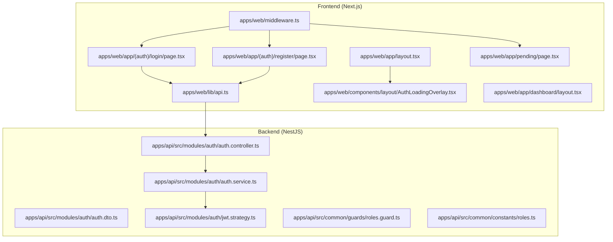
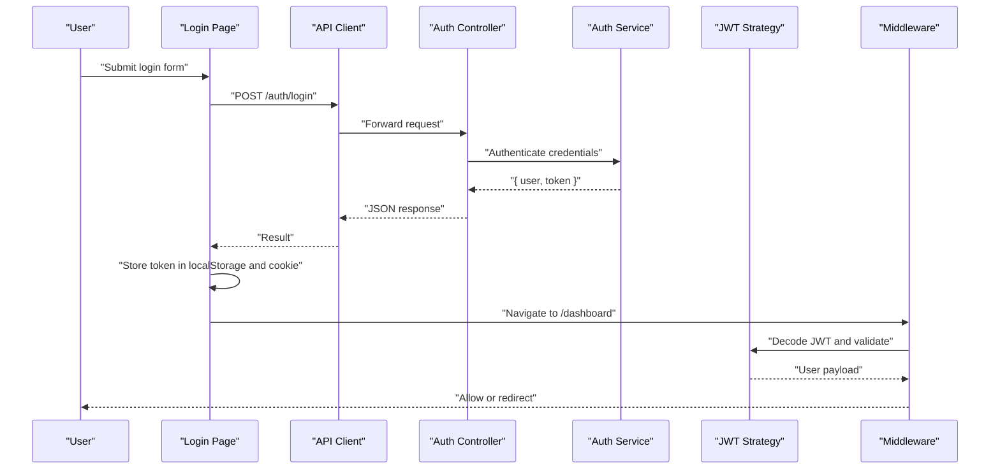
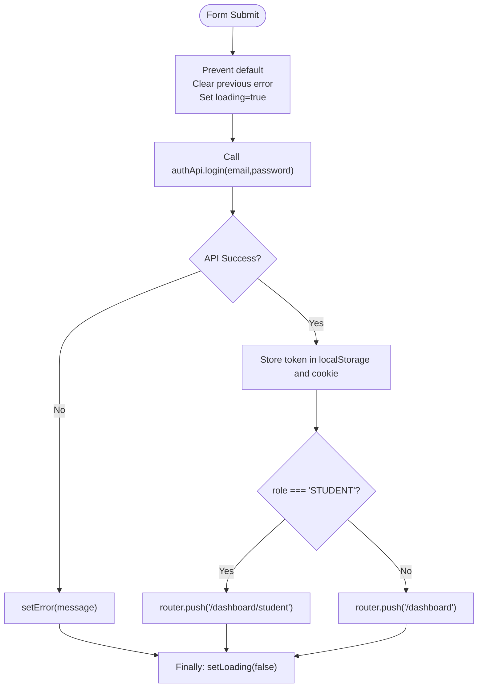
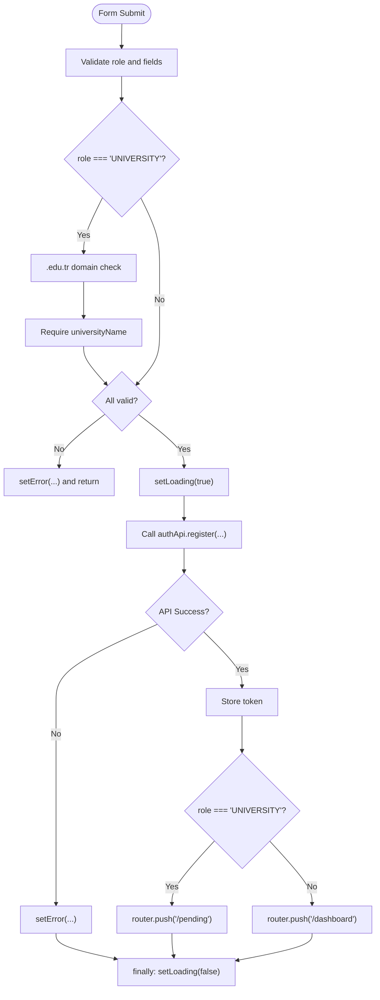
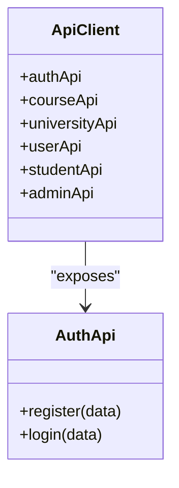
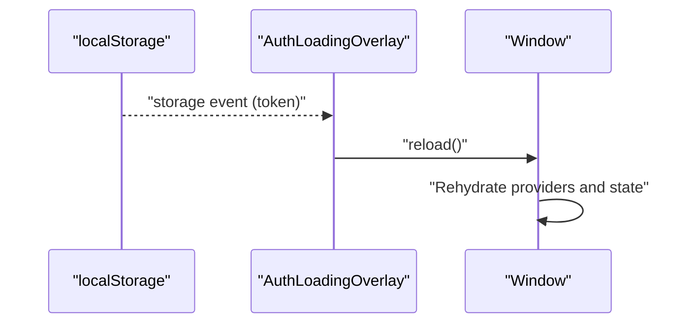
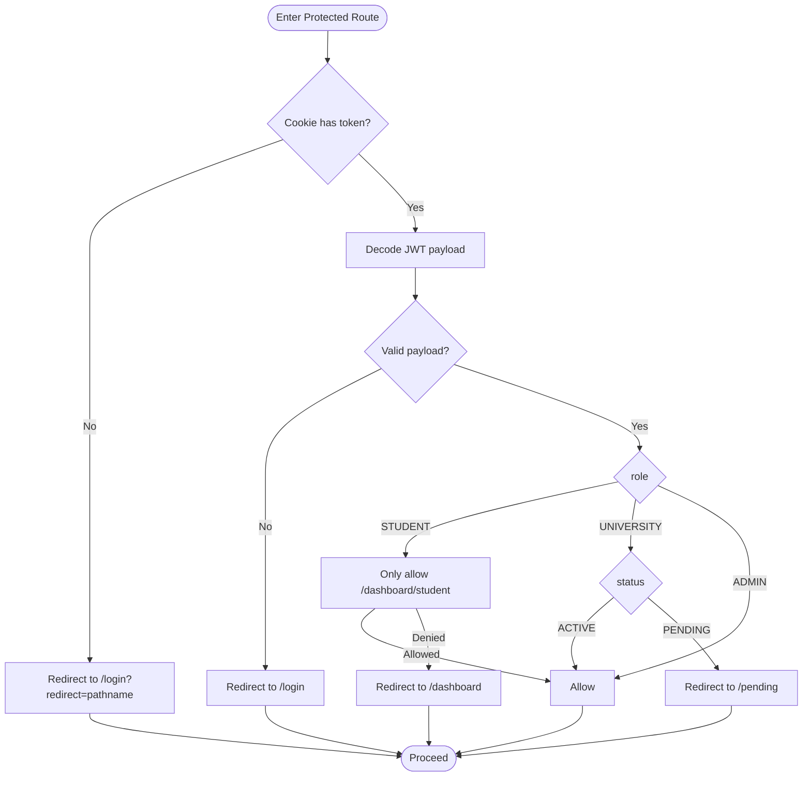
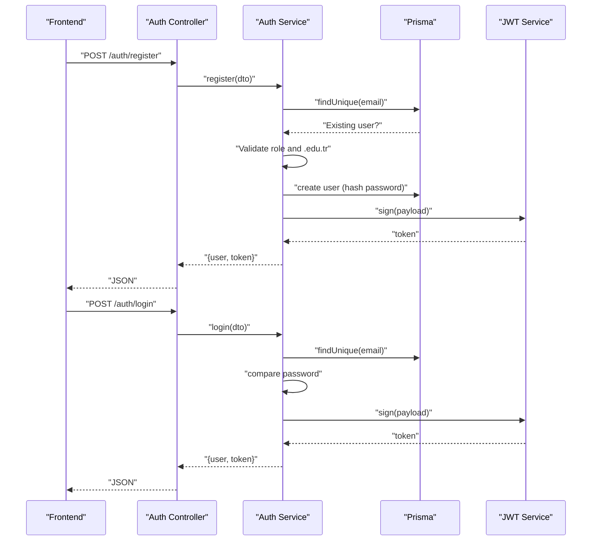
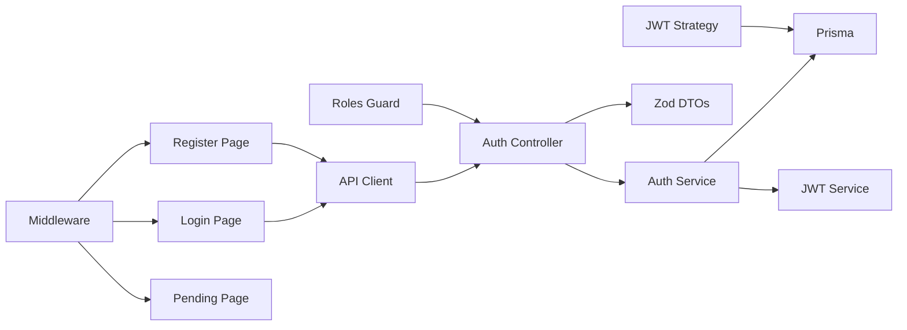

# Authentication Pages

<cite>
**Referenced Files in This Document**
- [apps/web/app/(auth)/login/page.tsx](file://apps/web/app/(auth)/login/page.tsx)
- [apps/web/app/(auth)/register/page.tsx](file://apps/web/app/(auth)/register/page.tsx)
- [apps/web/lib/api.ts](file://apps/web/lib/api.ts)
- [apps/web/middleware.ts](file://apps/web/middleware.ts)
- [apps/web/components/layout/AuthLoadingOverlay.tsx](file://apps/web/components/layout/AuthLoadingOverlay.tsx)
- [apps/web/app/layout.tsx](file://apps/web/app/layout.tsx)
- [apps/web/app/pending/page.tsx](file://apps/web/app/pending/page.tsx)
- [apps/web/app/dashboard/layout.tsx](file://apps/web/app/dashboard/layout.tsx)
- [apps/api/src/modules/auth/auth.controller.ts](file://apps/api/src/modules/auth/auth.controller.ts)
- [apps/api/src/modules/auth/auth.service.ts](file://apps/api/src/modules/auth/auth.service.ts)
- [apps/api/src/modules/auth/auth.dto.ts](file://apps/api/src/modules/auth/auth.dto.ts)
- [apps/api/src/modules/auth/jwt.strategy.ts](file://apps/api/src/modules/auth/jwt.strategy.ts)
- [apps/api/src/common/guards/roles.guard.ts](file://apps/api/src/common/guards/roles.guard.ts)
- [apps/api/src/common/constants/roles.ts](file://apps/api/src/common/constants/roles.ts)
- [apps/web/.env.local](file://apps/web/.env.local)
- [apps/api/.env](file://apps/api/.env)
</cite>

## Table of Contents
1. [Introduction](#introduction)
2. [Project Structure](#project-structure)
3. [Core Components](#core-components)
4. [Architecture Overview](#architecture-overview)
5. [Detailed Component Analysis](#detailed-component-analysis)
6. [Dependency Analysis](#dependency-analysis)
7. [Performance Considerations](#performance-considerations)
8. [Troubleshooting Guide](#troubleshooting-guide)
9. [Conclusion](#conclusion)

## Introduction
This document explains the authentication pages and user registration system. It covers the login and registration UI implementations, form validation, error handling, authentication state management, loading overlays, redirects, and API integration. It also documents the backend authentication flow, token handling, session management, user roles and statuses, and route protection via middleware and guards.

## Project Structure
The authentication system spans the Next.js frontend and NestJS backend:
- Frontend pages for login and registration
- Shared API client module for HTTP requests and token injection
- Middleware for route protection and redirects
- Backend auth controller, service, DTOs, and JWT strategy
- Role-based guards and constants

**Diagram sources**
- [apps/web/app/(auth)/login/page.tsx](file://apps/web/app/(auth)/login/page.tsx#L1-L135)
- [apps/web/app/(auth)/register/page.tsx](file://apps/web/app/(auth)/register/page.tsx#L1-L239)
- [apps/web/lib/api.ts](file://apps/web/lib/api.ts#L1-L378)
- [apps/web/middleware.ts](file://apps/web/middleware.ts#L1-L107)
- [apps/web/components/layout/AuthLoadingOverlay.tsx](file://apps/web/components/layout/AuthLoadingOverlay.tsx#L1-L37)
- [apps/web/app/layout.tsx](file://apps/web/app/layout.tsx#L1-L44)
- [apps/web/app/pending/page.tsx](file://apps/web/app/pending/page.tsx#L1-L64)
- [apps/web/app/dashboard/layout.tsx](file://apps/web/app/dashboard/layout.tsx#L1-L71)
- [apps/api/src/modules/auth/auth.controller.ts](file://apps/api/src/modules/auth/auth.controller.ts#L1-L28)
- [apps/api/src/modules/auth/auth.service.ts](file://apps/api/src/modules/auth/auth.service.ts#L1-L205)
- [apps/api/src/modules/auth/auth.dto.ts](file://apps/api/src/modules/auth/auth.dto.ts#L1-L46)
- [apps/api/src/modules/auth/jwt.strategy.ts](file://apps/api/src/modules/auth/jwt.strategy.ts#L1-L58)
- [apps/api/src/common/guards/roles.guard.ts](file://apps/api/src/common/guards/roles.guard.ts#L1-L56)
- [apps/api/src/common/constants/roles.ts](file://apps/api/src/common/constants/roles.ts#L1-L6)

**Section sources**
- [apps/web/app/(auth)/login/page.tsx](file://apps/web/app/(auth)/login/page.tsx#L1-L135)
- [apps/web/app/(auth)/register/page.tsx](file://apps/web/app/(auth)/register/page.tsx#L1-L239)
- [apps/web/lib/api.ts](file://apps/web/lib/api.ts#L1-L378)
- [apps/web/middleware.ts](file://apps/web/middleware.ts#L1-L107)
- [apps/web/components/layout/AuthLoadingOverlay.tsx](file://apps/web/components/layout/AuthLoadingOverlay.tsx#L1-L37)
- [apps/web/app/layout.tsx](file://apps/web/app/layout.tsx#L1-L44)
- [apps/web/app/pending/page.tsx](file://apps/web/app/pending/page.tsx#L1-L64)
- [apps/web/app/dashboard/layout.tsx](file://apps/web/app/dashboard/layout.tsx#L1-L71)
- [apps/api/src/modules/auth/auth.controller.ts](file://apps/api/src/modules/auth/auth.controller.ts#L1-L28)
- [apps/api/src/modules/auth/auth.service.ts](file://apps/api/src/modules/auth/auth.service.ts#L1-L205)
- [apps/api/src/modules/auth/auth.dto.ts](file://apps/api/src/modules/auth/auth.dto.ts#L1-L46)
- [apps/api/src/modules/auth/jwt.strategy.ts](file://apps/api/src/modules/auth/jwt.strategy.ts#L1-L58)
- [apps/api/src/common/guards/roles.guard.ts](file://apps/api/src/common/guards/roles.guard.ts#L1-L56)
- [apps/api/src/common/constants/roles.ts](file://apps/api/src/common/constants/roles.ts#L1-L6)

## Core Components
- Login Page: Handles email/password login, local state, error display, loading state, and redirects based on role.
- Registration Page: Supports student and university-authority registration, frontend validation, and redirects to appropriate dashboards.
- API Client: Centralized fetch wrapper that injects Authorization headers and handles errors.
- Middleware: Route protection and redirects for protected routes, pending users, and login/register gating.
- Auth Loading Overlay: Reactive overlay that reloads the app when tokens change in storage.
- Backend Auth Controller/Service: Implements registration and login, validates DTOs, manages user roles/statuses, and generates JWT tokens.
- JWT Strategy and Guards: Validates tokens and enforces role-based access control.

**Section sources**
- [apps/web/app/(auth)/login/page.tsx](file://apps/web/app/(auth)/login/page.tsx#L13-L45)
- [apps/web/app/(auth)/register/page.tsx](file://apps/web/app/(auth)/register/page.tsx#L13-L73)
- [apps/web/lib/api.ts](file://apps/web/lib/api.ts#L10-L36)
- [apps/web/middleware.ts](file://apps/web/middleware.ts#L25-L101)
- [apps/web/components/layout/AuthLoadingOverlay.tsx](file://apps/web/components/layout/AuthLoadingOverlay.tsx#L6-L23)
- [apps/api/src/modules/auth/auth.controller.ts](file://apps/api/src/modules/auth/auth.controller.ts#L12-L27)
- [apps/api/src/modules/auth/auth.service.ts](file://apps/api/src/modules/auth/auth.service.ts#L46-L170)
- [apps/api/src/modules/auth/jwt.strategy.ts](file://apps/api/src/modules/auth/jwt.strategy.ts#L22-L56)
- [apps/api/src/common/guards/roles.guard.ts](file://apps/api/src/common/guards/roles.guard.ts#L21-L54)

## Architecture Overview
The authentication architecture integrates frontend pages, API client, middleware, and backend services.

**Diagram sources**
- [apps/web/app/(auth)/login/page.tsx](file://apps/web/app/(auth)/login/page.tsx#L21-L44)
- [apps/web/lib/api.ts](file://apps/web/lib/api.ts#L54-L58)
- [apps/api/src/modules/auth/auth.controller.ts](file://apps/api/src/modules/auth/auth.controller.ts#L22-L26)
- [apps/api/src/modules/auth/auth.service.ts](file://apps/api/src/modules/auth/auth.service.ts#L136-L170)
- [apps/api/src/modules/auth/jwt.strategy.ts](file://apps/api/src/modules/auth/jwt.strategy.ts#L38-L56)
- [apps/web/middleware.ts](file://apps/web/middleware.ts#L32-L72)

## Detailed Component Analysis

### Login Page Implementation
- State management: email, password, showPassword, error, loading.
- Validation: controlled form submission; prevents default and sets loading.
- API integration: calls authApi.login with typed payload.
- Token handling: stores token in localStorage and cookie; extracts role to decide redirect.
- Redirects: STUDENT -> /dashboard/student; others -> /dashboard.
- Error handling: catches exceptions and displays user-friendly messages.
- UX: loading button state and password visibility toggle.

**Diagram sources**
- [apps/web/app/(auth)/login/page.tsx](file://apps/web/app/(auth)/login/page.tsx#L21-L44)

**Section sources**
- [apps/web/app/(auth)/login/page.tsx](file://apps/web/app/(auth)/login/page.tsx#L13-L45)

### Registration Page Implementation
- State management: form data with role, university-specific fields, error, loading.
- Frontend validation: .edu.tr check for UNIVERSITY, required universityName, minimum length checks.
- API integration: calls authApi.register with optional fields depending on role.
- Token handling: stores token similarly to login.
- Redirects: UNIVERSITY -> /pending; STUDENT -> /dashboard.
- Error handling: displays validation and API errors.

**Diagram sources**
- [apps/web/app/(auth)/register/page.tsx](file://apps/web/app/(auth)/register/page.tsx#L33-L73)

**Section sources**
- [apps/web/app/(auth)/register/page.tsx](file://apps/web/app/(auth)/register/page.tsx#L13-L73)

### API Integration and Token Handling
- Base URL resolution: NEXT_PUBLIC_API_URL with normalized trailing slash.
- Fetch wrapper: adds Authorization header when token exists; parses JSON and throws on non-OK responses.
- Auth endpoints: register and login with typed responses.
- Other APIs: course, university, user, student, admin endpoints for broader app usage.

**Diagram sources**
- [apps/web/lib/api.ts](file://apps/web/lib/api.ts#L7-L36)
- [apps/web/lib/api.ts](file://apps/web/lib/api.ts#L40-L59)

**Section sources**
- [apps/web/lib/api.ts](file://apps/web/lib/api.ts#L7-L36)
- [apps/web/lib/api.ts](file://apps/web/lib/api.ts#L40-L59)

### Authentication State Management and Loading Overlays
- Token persistence: stored in localStorage and cookie for immediate availability.
- AuthLoadingOverlay: listens to storage events for token changes and reloads to reinitialize app state.
- Root layout composes providers and overlay globally.

**Diagram sources**
- [apps/web/components/layout/AuthLoadingOverlay.tsx](file://apps/web/components/layout/AuthLoadingOverlay.tsx#L9-L23)
- [apps/web/app/layout.tsx](file://apps/web/app/layout.tsx#L39-L39)

**Section sources**
- [apps/web/components/layout/AuthLoadingOverlay.tsx](file://apps/web/components/layout/AuthLoadingOverlay.tsx#L6-L36)
- [apps/web/app/layout.tsx](file://apps/web/app/layout.tsx#L29-L41)

### Redirect Mechanisms and Route Protection
- Middleware protects /dashboard routes:
  - No token -> redirect to /login with redirect param.
  - Invalid/expired token -> redirect to /login.
  - Role-based routing: STUDENT only to /dashboard/student; others to /dashboard.
  - UNIVERSITY with non-ACTIVE status -> enforce /pending.
  - REJECTED users -> redirect to /login.
- /pending: only accessible to PENDING users; ACTIVE users redirected to /dashboard.
- /login and /register: logged-in ACTIVE users redirected appropriately.

**Diagram sources**
- [apps/web/middleware.ts](file://apps/web/middleware.ts#L25-L101)

**Section sources**
- [apps/web/middleware.ts](file://apps/web/middleware.ts#L25-L101)

### Backend Authentication Flow
- Controller: exposes /auth/register and /auth/login with Zod validation pipes.
- Service:
  - Registration: uniqueness check, .edu.tr validation for UNIVERSITY, status assignment (PENDING vs ACTIVE), hashing password, optional university creation, token generation.
  - Login: finds user, compares password, rejects REJECTED users, generates token.
  - Token payload includes sub, email, role, status, universityId.
- DTOs: strict validation for register and login payloads.
- JWT Strategy: extracts Bearer token, verifies signature, loads user from database, attaches to request.
- Guards: enforce role-based access using reflected @Roles metadata.

**Diagram sources**
- [apps/api/src/modules/auth/auth.controller.ts](file://apps/api/src/modules/auth/auth.controller.ts#L16-L26)
- [apps/api/src/modules/auth/auth.service.ts](file://apps/api/src/modules/auth/auth.service.ts#L46-L170)
- [apps/api/src/modules/auth/auth.dto.ts](file://apps/api/src/modules/auth/auth.dto.ts#L9-L43)
- [apps/api/src/modules/auth/jwt.strategy.ts](file://apps/api/src/modules/auth/jwt.strategy.ts#L38-L56)

**Section sources**
- [apps/api/src/modules/auth/auth.controller.ts](file://apps/api/src/modules/auth/auth.controller.ts#L12-L27)
- [apps/api/src/modules/auth/auth.service.ts](file://apps/api/src/modules/auth/auth.service.ts#L46-L170)
- [apps/api/src/modules/auth/auth.dto.ts](file://apps/api/src/modules/auth/auth.dto.ts#L9-L43)
- [apps/api/src/modules/auth/jwt.strategy.ts](file://apps/api/src/modules/auth/jwt.strategy.ts#L22-L56)
- [apps/api/src/common/guards/roles.guard.ts](file://apps/api/src/common/guards/roles.guard.ts#L21-L54)
- [apps/api/src/common/constants/roles.ts](file://apps/api/src/common/constants/roles.ts#L5-L5)

### User Experience Patterns During Authentication Transitions
- Loading states: buttons disabled while requests are in flight.
- Immediate redirects after successful auth based on role and status.
- Pending flow for UNIVERSITY users awaiting admin approval.
- AuthLoadingOverlay ensures smooth transitions when switching accounts or refreshing after token changes.

**Section sources**
- [apps/web/app/(auth)/login/page.tsx](file://apps/web/app/(auth)/login/page.tsx#L116-L122)
- [apps/web/app/(auth)/register/page.tsx](file://apps/web/app/(auth)/register/page.tsx#L220-L226)
- [apps/web/app/pending/page.tsx](file://apps/web/app/pending/page.tsx#L10-L17)
- [apps/web/components/layout/AuthLoadingOverlay.tsx](file://apps/web/components/layout/AuthLoadingOverlay.tsx#L6-L36)

## Dependency Analysis
- Frontend depends on:
  - API client for HTTP communication and token injection.
  - Middleware for runtime route protection.
  - AuthLoadingOverlay for reactive state refresh.
- Backend depends on:
  - Zod DTOs for validation.
  - Prisma for persistence.
  - JWT service for token signing.
  - Passport JWT strategy for request validation.
  - Roles guard for authorization enforcement.

**Diagram sources**
- [apps/web/app/(auth)/login/page.tsx](file://apps/web/app/(auth)/login/page.tsx#L11-L11)
- [apps/web/app/(auth)/register/page.tsx](file://apps/web/app/(auth)/register/page.tsx#L11-L11)
- [apps/web/lib/api.ts](file://apps/web/lib/api.ts#L40-L59)
- [apps/api/src/modules/auth/auth.controller.ts](file://apps/api/src/modules/auth/auth.controller.ts#L8-L8)
- [apps/api/src/modules/auth/auth.service.ts](file://apps/api/src/modules/auth/auth.service.ts#L14-L16)
- [apps/api/src/modules/auth/jwt.strategy.ts](file://apps/api/src/modules/auth/jwt.strategy.ts#L9-L9)
- [apps/api/src/common/guards/roles.guard.ts](file://apps/api/src/common/guards/roles.guard.ts#L16-L18)
- [apps/web/middleware.ts](file://apps/web/middleware.ts#L29-L29)
- [apps/web/app/pending/page.tsx](file://apps/web/app/pending/page.tsx#L14-L15)

**Section sources**
- [apps/web/lib/api.ts](file://apps/web/lib/api.ts#L10-L36)
- [apps/api/src/modules/auth/auth.service.ts](file://apps/api/src/modules/auth/auth.service.ts#L36-L39)
- [apps/api/src/modules/auth/jwt.strategy.ts](file://apps/api/src/modules/auth/jwt.strategy.ts#L23-L31)
- [apps/api/src/common/guards/roles.guard.ts](file://apps/api/src/common/guards/roles.guard.ts#L24-L38)
- [apps/web/middleware.ts](file://apps/web/middleware.ts#L29-L46)

## Performance Considerations
- Minimize unnecessary re-renders by using controlled inputs and avoiding excessive state updates.
- Debounce or batch UI updates during rapid state changes.
- Keep token validation lightweight; rely on backend JWT verification.
- Use middleware to prevent redundant client-side checks by short-circuiting unauthorized access early.

## Troubleshooting Guide
- Login fails with invalid credentials:
  - Verify email and password match backend expectations and that user is not REJECTED.
- Registration blocked for UNIVERSITY:
  - Ensure .edu.tr domain is used and universityName is provided.
- Redirect loops or incorrect redirects:
  - Confirm token presence and validity; check role and status claims.
- Pending page shown unexpectedly:
  - UNIVERSITY users with non-ACTIVE status are intentionally redirected here until admin approval.
- Token changes not reflected:
  - AuthLoadingOverlay triggers a reload on storage events; ensure localStorage and cookies are being updated correctly.

**Section sources**
- [apps/api/src/modules/auth/auth.service.ts](file://apps/api/src/modules/auth/auth.service.ts#L141-L153)
- [apps/api/src/modules/auth/auth.service.ts](file://apps/api/src/modules/auth/auth.service.ts#L58-L64)
- [apps/web/middleware.ts](file://apps/web/middleware.ts#L61-L71)
- [apps/web/components/layout/AuthLoadingOverlay.tsx](file://apps/web/components/layout/AuthLoadingOverlay.tsx#L9-L18)

## Conclusion
The authentication system combines robust frontend pages with a secure backend. Frontend pages manage state, validation, and redirects; the API client centralizes HTTP logic and token handling; middleware and guards enforce route protection and role-based access. UNIVERSITY registrations follow a pending workflow, while STUDENT registrations proceed directly to the dashboard. The AuthLoadingOverlay ensures seamless transitions during token changes, and the backend’s JWT strategy and guards provide strong security guarantees.