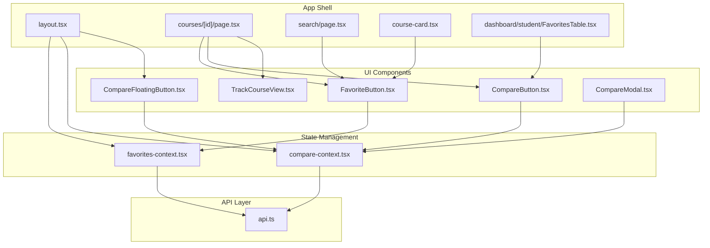
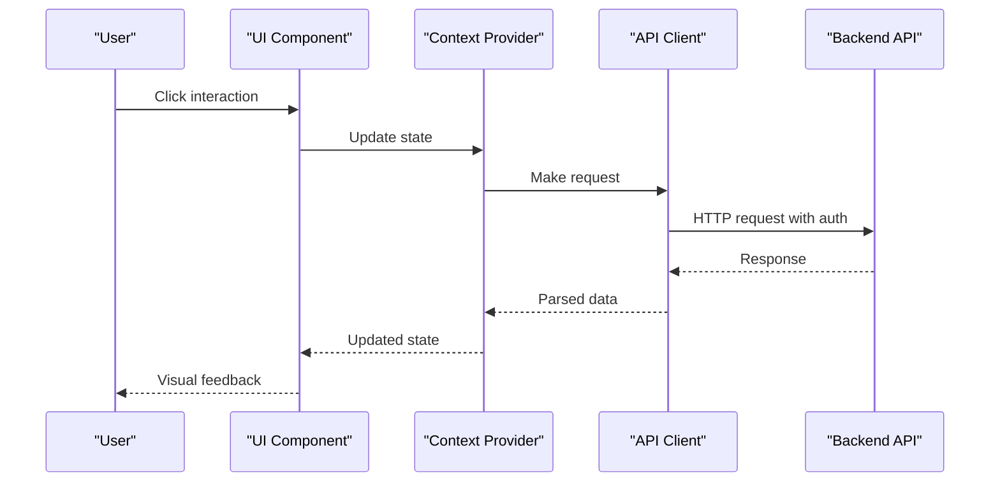
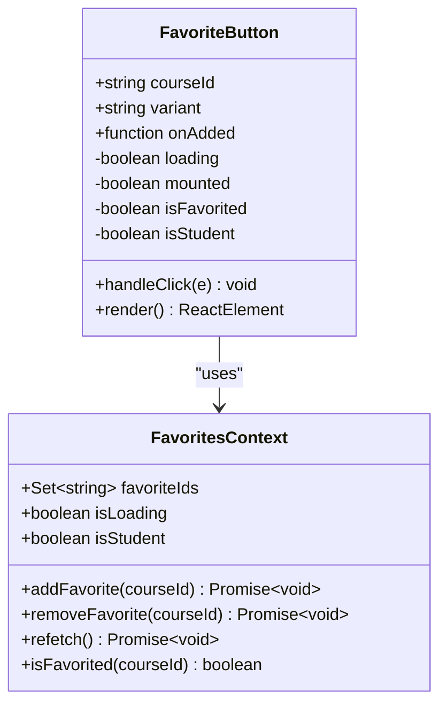
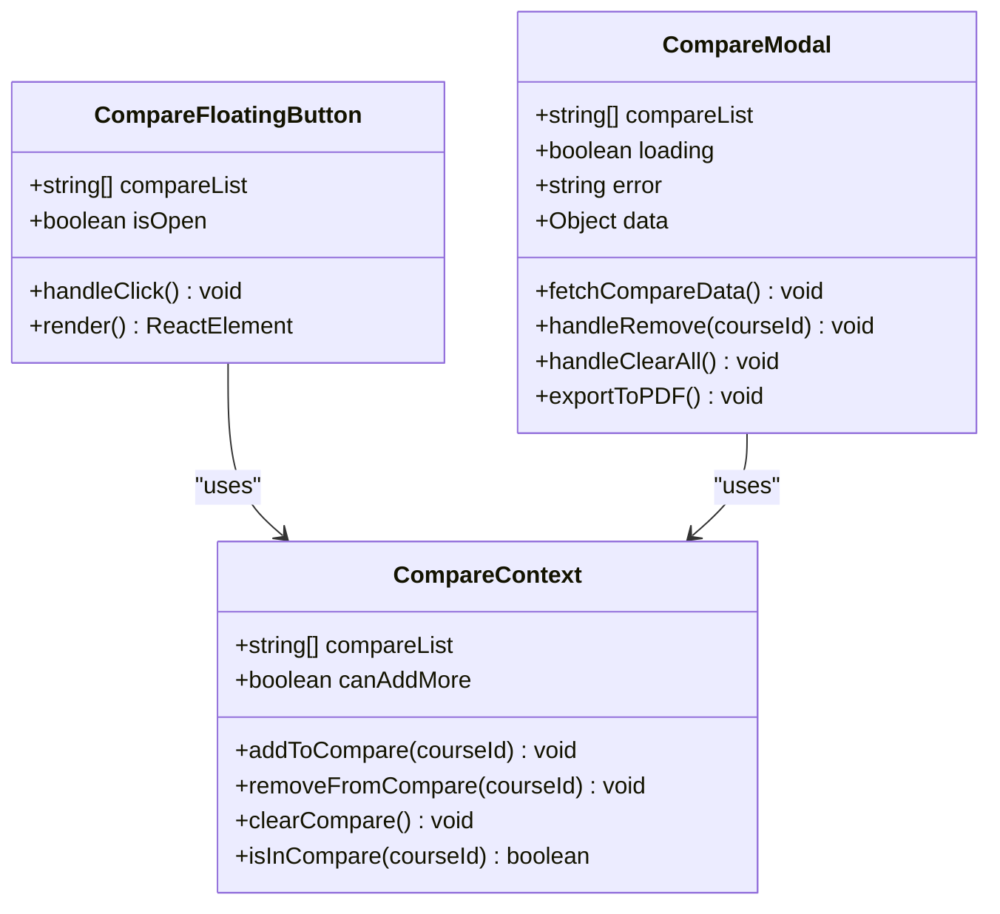
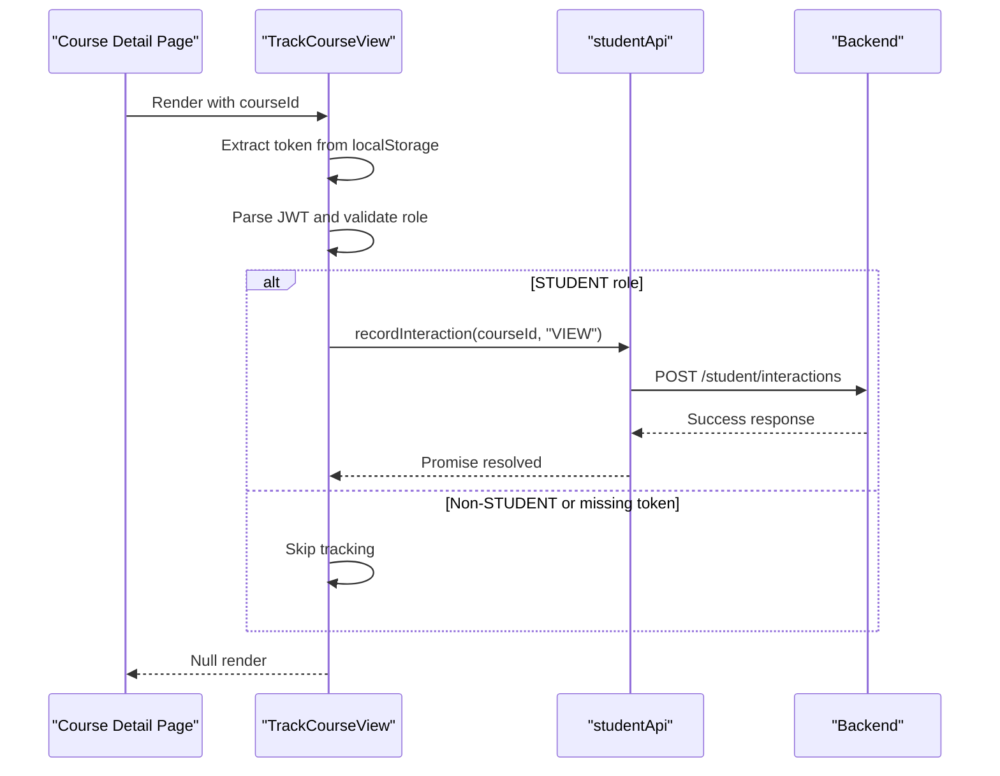
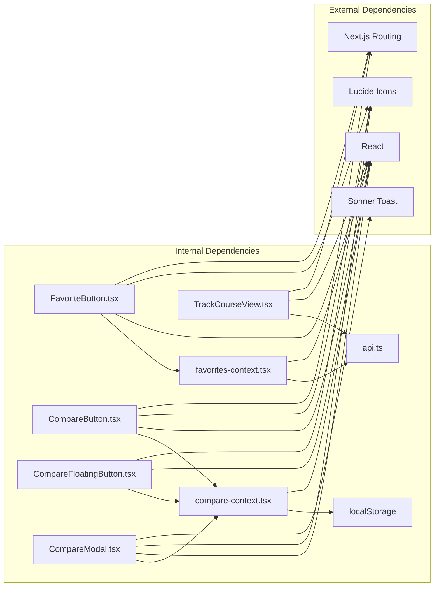

# Course Interaction Components

<cite>
**Referenced Files in This Document**
- [FavoriteButton.tsx](file://apps/web/components/course/FavoriteButton.tsx)
- [CompareButton.tsx](file://apps/web/components/course/CompareButton.tsx)
- [TrackCourseView.tsx](file://apps/web/components/course/TrackCourseView.tsx)
- [CompareFloatingButton.tsx](file://apps/web/components/compare/CompareFloatingButton.tsx)
- [CompareModal.tsx](file://apps/web/components/compare/CompareModal.tsx)
- [favorites-context.tsx](file://apps/web/contexts/favorites-context.tsx)
- [compare-context.tsx](file://apps/web/contexts/compare-context.tsx)
- [api.ts](file://apps/web/lib/api.ts)
- [layout.tsx](file://apps/web/app/layout.tsx)
- [page.tsx](file://apps/web/app/(public)/courses/[id]/page.tsx)
- [course-card.tsx](file://apps/web/components/layout/course-card.tsx)
- [page.tsx](file://apps/web/app/(public)/search/page.tsx)
- [FavoritesTable.tsx](file://apps/web/app/dashboard/student/components/FavoritesTable.tsx)
</cite>

## Table of Contents
1. [Introduction](#introduction)
2. [Project Structure](#project-structure)
3. [Core Components](#core-components)
4. [Architecture Overview](#architecture-overview)
5. [Detailed Component Analysis](#detailed-component-analysis)
6. [Dependency Analysis](#dependency-analysis)
7. [Performance Considerations](#performance-considerations)
8. [Troubleshooting Guide](#troubleshooting-guide)
9. [Conclusion](#conclusion)

## Introduction
This document provides comprehensive documentation for course interaction components and user engagement features. It covers the favorite button component with state management, API integration, and visual feedback; the course comparison system including the floating comparison button, comparison modal, and batch selection functionality; and the course view tracking component for analytics and user behavior monitoring. The documentation explains component composition patterns, event handling, data synchronization, user experience patterns, accessibility features, performance optimization, backend API integration, error handling, and loading states.

## Project Structure
The course interaction features are implemented as React components integrated into the Next.js application. The components are organized under:
- `apps/web/components/course/`: Individual interaction components (favorite, compare, track)
- `apps/web/components/compare/`: Comparison-related components (floating button, modal)
- `apps/web/contexts/`: Centralized state management for favorites and comparison
- `apps/web/lib/api.ts`: Unified API client for backend communication
- `apps/web/app/layout.tsx`: Root layout that wraps the application with providers
- Page-level integrations in `apps/web/app/(public)/courses/[id]/page.tsx`, `apps/web/app/(public)/search/page.tsx`, and dashboard components

**Diagram sources**
- [layout.tsx](file://apps/web/app/layout.tsx#L24-L42)
- [FavoriteButton.tsx](file://apps/web/components/course/FavoriteButton.tsx#L17-L91)
- [CompareButton.tsx](file://apps/web/components/course/CompareButton.tsx#L15-L44)
- [TrackCourseView.tsx](file://apps/web/components/course/TrackCourseView.tsx#L14-L33)
- [CompareFloatingButton.tsx](file://apps/web/components/compare/CompareFloatingButton.tsx#L13-L45)
- [CompareModal.tsx](file://apps/web/components/compare/CompareModal.tsx#L317-L428)
- [favorites-context.tsx](file://apps/web/contexts/favorites-context.tsx#L29-L131)
- [compare-context.tsx](file://apps/web/contexts/compare-context.tsx#L30-L97)
- [api.ts](file://apps/web/lib/api.ts#L11-L36)

**Section sources**
- [layout.tsx](file://apps/web/app/layout.tsx#L24-L42)
- [page.tsx](file://apps/web/app/(public)/courses/[id]/page.tsx#L5-L7)
- [page.tsx](file://apps/web/app/(public)/search/page.tsx#L13-L13)

## Core Components
This section documents the primary interaction components and their responsibilities.

- FavoriteButton: Adds/removes courses to/from favorites with visual feedback and loading states
- CompareButton: Allows adding/removing courses to/from comparison with batch selection limits
- TrackCourseView: Records course view interactions for analytics
- CompareFloatingButton: Provides quick access to the comparison modal with clear-all functionality
- CompareModal: Displays comparison analysis, statistics, and comparison table with PDF export

**Section sources**
- [FavoriteButton.tsx](file://apps/web/components/course/FavoriteButton.tsx#L17-L91)
- [CompareButton.tsx](file://apps/web/components/course/CompareButton.tsx#L15-L44)
- [TrackCourseView.tsx](file://apps/web/components/course/TrackCourseView.tsx#L14-L33)
- [CompareFloatingButton.tsx](file://apps/web/components/compare/CompareFloatingButton.tsx#L13-L45)
- [CompareModal.tsx](file://apps/web/components/compare/CompareModal.tsx#L317-L428)

## Architecture Overview
The architecture follows a layered pattern:
- UI Components: Presentational and interactive elements
- State Management: Context providers manage centralized state for favorites and comparison
- API Layer: Unified client handles authentication, error handling, and endpoint routing
- Application Shell: Root layout provides providers and global UI elements

**Diagram sources**
- [favorites-context.tsx](file://apps/web/contexts/favorites-context.tsx#L71-L99)
- [compare-context.tsx](file://apps/web/contexts/compare-context.tsx#L58-L75)
- [api.ts](file://apps/web/lib/api.ts#L11-L36)

## Detailed Component Analysis

### Favorite Button Component
The FavoriteButton component manages user preferences for courses with robust state handling and visual feedback.

**Diagram sources**
- [FavoriteButton.tsx](file://apps/web/components/course/FavoriteButton.tsx#L17-L91)
- [favorites-context.tsx](file://apps/web/contexts/favorites-context.tsx#L17-L25)

Key implementation patterns:
- Hydration-safe rendering with client-side mounting detection
- Conditional rendering based on user role (STUDENT)
- Loading state management during async operations
- Visual feedback through heart icon coloring and state classes
- Event handling with propagation control

State management characteristics:
- Centralized state in FavoritesProvider
- Token-based authentication validation
- Optimistic UI updates with error boundaries
- Automatic re-fetching on mount

API integration:
- Uses studentApi for CRUD operations
- Handles JWT token extraction and validation
- Implements retry logic with user feedback

Accessibility features:
- Proper aria-labels for screen readers
- Disabled states during loading
- Keyboard navigable button elements

**Section sources**
- [FavoriteButton.tsx](file://apps/web/components/course/FavoriteButton.tsx#L17-L91)
- [favorites-context.tsx](file://apps/web/contexts/favorites-context.tsx#L29-L131)
- [api.ts](file://apps/web/lib/api.ts#L212-L235)

### Course Comparison System
The comparison system provides batch selection and analysis capabilities with persistent storage.

**Diagram sources**
- [compare-context.tsx](file://apps/web/contexts/compare-context.tsx#L16-L23)
- [CompareFloatingButton.tsx](file://apps/web/components/compare/CompareFloatingButton.tsx#L13-L45)
- [CompareModal.tsx](file://apps/web/components/compare/CompareModal.tsx#L317-L428)

Batch selection functionality:
- Maximum 4 courses per comparison session
- Local storage persistence across page reloads
- Real-time validation of add/remove operations
- Clear-all functionality with confirmation

Comparison modal features:
- Loading skeletons for improved perceived performance
- Error handling with user-friendly messages
- Analysis cards showing statistical insights
- Interactive comparison table with highlighting
- PDF export capability via browser print dialog

Event handling patterns:
- Controlled component state management
- Debounced API calls with loading states
- Toast notifications for user feedback
- Modal lifecycle management

**Section sources**
- [compare-context.tsx](file://apps/web/contexts/compare-context.tsx#L30-L97)
- [CompareFloatingButton.tsx](file://apps/web/components/compare/CompareFloatingButton.tsx#L13-L45)
- [CompareModal.tsx](file://apps/web/components/compare/CompareModal.tsx#L317-L428)

### Course View Tracking Component
The TrackCourseView component implements analytics collection for user behavior monitoring.

**Diagram sources**
- [TrackCourseView.tsx](file://apps/web/components/course/TrackCourseView.tsx#L14-L33)
- [api.ts](file://apps/web/lib/api.ts#L279-L283)

Tracking implementation:
- Client-side JWT parsing for role validation
- Conditional tracking based on user permissions
- Silent error handling to prevent UX disruption
- Minimal performance impact through lazy evaluation

Analytics coverage:
- Course view events
- User behavior patterns
- Engagement metrics for recommendations
- Integration with recommendation engine

**Section sources**
- [TrackCourseView.tsx](file://apps/web/components/course/TrackCourseView.tsx#L14-L33)
- [api.ts](file://apps/web/lib/api.ts#L279-L283)

### Component Composition Patterns
The components demonstrate several composition patterns:

1. **Provider Pattern**: Context providers wrap the application shell
2. **Hook Pattern**: Custom hooks encapsulate state logic
3. **Render Props Pattern**: Optional context hooks for graceful adoption
4. **Compound Components**: Related components share state through contexts

Integration points:
- Root layout provides global state to all pages
- Page-level components consume context selectively
- Shared UI patterns across search, detail, and dashboard views

**Section sources**
- [layout.tsx](file://apps/web/app/layout.tsx#L24-L42)
- [favorites-context.tsx](file://apps/web/contexts/favorites-context.tsx#L143-L145)
- [compare-context.tsx](file://apps/web/contexts/compare-context.tsx#L108-L110)

## Dependency Analysis
The components have well-defined dependencies that minimize coupling and maximize cohesion.

**Diagram sources**
- [favorites-context.tsx](file://apps/web/contexts/favorites-context.tsx#L15)
- [compare-context.tsx](file://apps/web/contexts/compare-context.tsx#L14)
- [api.ts](file://apps/web/lib/api.ts#L7-L8)

Dependency characteristics:
- Low coupling through context abstraction
- Clear separation of concerns
- Minimal external dependencies
- Predictable data flow patterns

Potential circular dependencies:
- None detected in the current implementation
- Context providers are at the root level
- Components depend on contexts, not vice versa

**Section sources**
- [favorites-context.tsx](file://apps/web/contexts/favorites-context.tsx#L15)
- [compare-context.tsx](file://apps/web/contexts/compare-context.tsx#L14)
- [api.ts](file://apps/web/lib/api.ts#L7-L8)

## Performance Considerations
Several performance optimizations are implemented:

- **Client-side hydration**: Components guard against SSR mismatches
- **Optimistic UI**: Immediate state updates with rollback on failure
- **Loading states**: Skeleton screens and disabled buttons prevent unnecessary re-renders
- **Local storage caching**: Comparison data persists without network requests
- **Conditional rendering**: Components only render when appropriate
- **Debounced API calls**: Prevent excessive network requests

Memory management:
- Context state cleanup on unmount
- Efficient Set operations for favorites
- Controlled component state updates

Network optimization:
- Centralized API client with shared configuration
- Token-based authentication reduces repeated auth attempts
- Error boundaries prevent cascading failures

Accessibility compliance:
- Proper ARIA attributes and keyboard navigation
- Focus management in modals
- Screen reader friendly labels
- Color contrast compliant designs

## Troubleshooting Guide
Common issues and solutions:

**Favorite Button Issues:**
- Symptom: Button appears but doesn't respond
  - Cause: Missing STUDENT role or invalid token
  - Solution: Verify authentication state and role validation
  - Reference: [FavoriteButton.tsx](file://apps/web/components/course/FavoriteButton.tsx#L39-L57)

**Comparison Modal Problems:**
- Symptom: Modal shows empty state despite selections
  - Cause: Local storage corruption or exceeded limits
  - Solution: Clear local storage and verify MAX_COMPARE constant
  - Reference: [compare-context.tsx](file://apps/web/contexts/compare-context.tsx#L38-L56)

**API Integration Failures:**
- Symptom: Network errors or CORS issues
  - Cause: Incorrect API base URL or missing environment variables
  - Solution: Check NEXT_PUBLIC_API_URL configuration
  - Reference: [api.ts](file://apps/web/lib/api.ts#L7-L8)

**State Synchronization Issues:**
- Symptom: Inconsistent favorite states across pages
  - Cause: Missing FavoritesProvider wrapper
  - Solution: Ensure provider is included in root layout
  - Reference: [layout.tsx](file://apps/web/app/layout.tsx#L32-L37)

**Performance Bottlenecks:**
- Symptom: Slow initial load or frequent re-renders
  - Cause: Excessive state updates or unnecessary subscriptions
  - Solution: Review component dependencies and use memoization
  - Reference: [favorites-context.tsx](file://apps/web/contexts/favorites-context.tsx#L106-L125)

**Error Handling:**
- All components implement graceful error handling with user feedback
- API client centralizes error processing
- Toast notifications provide immediate user feedback
- Silent failures are avoided to maintain transparency

**Section sources**
- [FavoriteButton.tsx](file://apps/web/components/course/FavoriteButton.tsx#L39-L57)
- [compare-context.tsx](file://apps/web/contexts/compare-context.tsx#L38-L56)
- [api.ts](file://apps/web/lib/api.ts#L7-L8)
- [layout.tsx](file://apps/web/app/layout.tsx#L32-L37)
- [favorites-context.tsx](file://apps/web/contexts/favorites-context.tsx#L106-L125)

## Conclusion
The course interaction components provide a robust foundation for user engagement with well-structured state management, comprehensive API integration, and thoughtful user experience design. The implementation demonstrates best practices in React development including proper context usage, error handling, accessibility compliance, and performance optimization. The modular architecture allows for easy maintenance and future enhancements while maintaining consistency across the application.

The components successfully balance functionality with performance, providing immediate feedback while minimizing network overhead. The centralized state management ensures consistency across different application sections, and the clear separation of concerns facilitates maintainability and testing.

Future improvements could include enhanced analytics tracking, expanded comparison criteria, and additional customization options for user preferences.