# Admin Dashboard

<cite>
**Referenced Files in This Document**
- [admin.module.ts](file://apps/api/src/modules/admin/admin.module.ts)
- [admin.controller.ts](file://apps/api/src/modules/admin/admin.controller.ts)
- [admin.service.ts](file://apps/api/src/modules/admin/admin.service.ts)
- [api.ts](file://apps/web/lib/api.ts)
- [dashboard/page.tsx](file://apps/web/app/dashboard/page.tsx)
- [dashboard/layout.tsx](file://apps/web/app/dashboard/layout.tsx)
- [university-dashboard.page.tsx](file://apps/web/app/dashboard/university/page.tsx)
- [universities/page.tsx](file://apps/web/app/dashboard/universities/page.tsx)
- [pending/page.tsx](file://apps/web/app/dashboard/pending/page.tsx)
- [courses/page.tsx](file://apps/web/app/dashboard/courses/page.tsx)
- [settings/page.tsx](file://apps/web/app/dashboard/settings/page.tsx)
- [OverviewCards.tsx](file://apps/web/app/dashboard/university/components/OverviewCards.tsx)
- [PopularCoursesTable.tsx](file://apps/web/app/dashboard/university/components/PopularCoursesTable.tsx)
- [TimeSeriesCharts.tsx](file://apps/web/app/dashboard/university/components/TimeSeriesCharts.tsx)
- [CourseHealthCard.tsx](file://apps/web/app/dashboard/university/components/CourseHealthCard.tsx)
</cite>

## Table of Contents
1. [Introduction](#introduction)
2. [Project Structure](#project-structure)
3. [Core Components](#core-components)
4. [Architecture Overview](#architecture-overview)
5. [Detailed Component Analysis](#detailed-component-analysis)
6. [Dependency Analysis](#dependency-analysis)
7. [Performance Considerations](#performance-considerations)
8. [Security and Audit Considerations](#security-and-audit-considerations)
9. [Troubleshooting Guide](#troubleshooting-guide)
10. [Conclusion](#conclusion)

## Introduction
This document describes the admin dashboard system for centralized administration of the platform. It covers:
- Administrative overview interface with system statistics and quick actions
- Pending university approvals interface with verification workflows
- System analytics dashboard for platform-wide insights
- Administrative user management and content moderation capabilities
- System configuration options for universities and widgets
- Security, audit logging, and workflow optimization considerations
- Integration patterns across admin panels and centralized administration

## Project Structure
The admin dashboard spans both the frontend Next.js application and the backend NestJS API:
- Frontend pages and components render admin UIs and integrate with API clients
- Backend admin module exposes protected endpoints for statistics, user approvals, university management, and course administration
- University dashboard components provide analytics and operational insights for university users

**Diagram sources**
- [dashboard/layout.tsx](file://apps/web/app/dashboard/layout.tsx#L11-L70)
- [dashboard/page.tsx](file://apps/web/app/dashboard/page.tsx#L31-L175)
- [universities/page.tsx](file://apps/web/app/dashboard/universities/page.tsx#L21-L176)
- [pending/page.tsx](file://apps/web/app/dashboard/pending/page.tsx#L21-L125)
- [courses/page.tsx](file://apps/web/app/dashboard/courses/page.tsx#L44-L451)
- [settings/page.tsx](file://apps/web/app/dashboard/settings/page.tsx#L28-L379)
- [university-dashboard.page.tsx](file://apps/web/app/dashboard/university/page.tsx#L27-L93)
- [OverviewCards.tsx](file://apps/web/app/dashboard/university/components/OverviewCards.tsx#L37-L131)
- [PopularCoursesTable.tsx](file://apps/web/app/dashboard/university/components/PopularCoursesTable.tsx#L42-L140)
- [TimeSeriesCharts.tsx](file://apps/web/app/dashboard/university/components/TimeSeriesCharts.tsx#L33-L115)
- [CourseHealthCard.tsx](file://apps/web/app/dashboard/university/components/CourseHealthCard.tsx#L29-L131)
- [api.ts](file://apps/web/lib/api.ts#L292-L377)
- [admin.module.ts](file://apps/api/src/modules/admin/admin.module.ts#L9-L14)
- [admin.controller.ts](file://apps/api/src/modules/admin/admin.controller.ts#L23-L118)
- [admin.service.ts](file://apps/api/src/modules/admin/admin.service.ts#L14-L280)

**Section sources**
- [admin.module.ts](file://apps/api/src/modules/admin/admin.module.ts#L1-L15)
- [admin.controller.ts](file://apps/api/src/modules/admin/admin.controller.ts#L1-L119)
- [admin.service.ts](file://apps/api/src/modules/admin/admin.service.ts#L1-L281)
- [api.ts](file://apps/web/lib/api.ts#L1-L378)
- [dashboard/layout.tsx](file://apps/web/app/dashboard/layout.tsx#L1-L71)
- [dashboard/page.tsx](file://apps/web/app/dashboard/page.tsx#L1-L232)
- [university-dashboard.page.tsx](file://apps/web/app/dashboard/university/page.tsx#L1-L94)
- [universities/page.tsx](file://apps/web/app/dashboard/universities/page.tsx#L1-L177)
- [pending/page.tsx](file://apps/web/app/dashboard/pending/page.tsx#L1-L126)
- [courses/page.tsx](file://apps/web/app/dashboard/courses/page.tsx#L1-L452)
- [settings/page.tsx](file://apps/web/app/dashboard/settings/page.tsx#L1-L380)
- [OverviewCards.tsx](file://apps/web/app/dashboard/university/components/OverviewCards.tsx#L1-L132)
- [PopularCoursesTable.tsx](file://apps/web/app/dashboard/university/components/PopularCoursesTable.tsx#L1-L141)
- [TimeSeriesCharts.tsx](file://apps/web/app/dashboard/university/components/TimeSeriesCharts.tsx#L1-L116)
- [CourseHealthCard.tsx](file://apps/web/app/dashboard/university/components/CourseHealthCard.tsx#L1-L132)

## Core Components
- Admin Module: Declares controller and service exports for admin operations
- Admin Controller: Exposes REST endpoints guarded by JWT and role-based access (ADMIN)
- Admin Service: Implements business logic for statistics, user approvals, university CRUD, and course management
- API Client: Centralized HTTP client with token injection and unified error handling
- Dashboard Pages: Admin overview, university management, pending approvals, courses management, settings, and university analytics

Key responsibilities:
- Admin overview: fetches global stats and renders quick actions
- Pending approvals: lists PENDING users and supports approve/reject
- University management: list/create/update/delete universities; toggle verification
- Courses management: list/create/delete courses; role-aware editing
- Analytics: university dashboard cards, popular courses, time series charts, course health
- Settings: profile updates, widget configuration, embed code generation

**Section sources**
- [admin.module.ts](file://apps/api/src/modules/admin/admin.module.ts#L1-L15)
- [admin.controller.ts](file://apps/api/src/modules/admin/admin.controller.ts#L23-L118)
- [admin.service.ts](file://apps/api/src/modules/admin/admin.service.ts#L14-L280)
- [api.ts](file://apps/web/lib/api.ts#L292-L377)
- [dashboard/page.tsx](file://apps/web/app/dashboard/page.tsx#L31-L175)
- [universities/page.tsx](file://apps/web/app/dashboard/universities/page.tsx#L21-L176)
- [pending/page.tsx](file://apps/web/app/dashboard/pending/page.tsx#L21-L125)
- [courses/page.tsx](file://apps/web/app/dashboard/courses/page.tsx#L44-L451)
- [settings/page.tsx](file://apps/web/app/dashboard/settings/page.tsx#L28-L379)
- [university-dashboard.page.tsx](file://apps/web/app/dashboard/university/page.tsx#L27-L93)
- [OverviewCards.tsx](file://apps/web/app/dashboard/university/components/OverviewCards.tsx#L37-L131)
- [PopularCoursesTable.tsx](file://apps/web/app/dashboard/university/components/PopularCoursesTable.tsx#L42-L140)
- [TimeSeriesCharts.tsx](file://apps/web/app/dashboard/university/components/TimeSeriesCharts.tsx#L33-L115)
- [CourseHealthCard.tsx](file://apps/web/app/dashboard/university/components/CourseHealthCard.tsx#L29-L131)

## Architecture Overview
The admin dashboard follows a layered architecture:
- Presentation Layer: Next.js pages and components
- API Layer: NestJS admin controller and service
- Data Access: Prisma service used by admin service
- Authentication and Authorization: JWT guard and role guard restrict access to ADMIN

**Diagram sources**
- [dashboard/page.tsx](file://apps/web/app/dashboard/page.tsx#L31-L175)
- [universities/page.tsx](file://apps/web/app/dashboard/universities/page.tsx#L21-L176)
- [pending/page.tsx](file://apps/web/app/dashboard/pending/page.tsx#L21-L125)
- [courses/page.tsx](file://apps/web/app/dashboard/courses/page.tsx#L44-L451)
- [settings/page.tsx](file://apps/web/app/dashboard/settings/page.tsx#L28-L379)
- [university-dashboard.page.tsx](file://apps/web/app/dashboard/university/page.tsx#L27-L93)
- [api.ts](file://apps/web/lib/api.ts#L292-L377)
- [admin.controller.ts](file://apps/api/src/modules/admin/admin.controller.ts#L23-L118)
- [admin.service.ts](file://apps/api/src/modules/admin/admin.service.ts#L14-L280)

## Detailed Component Analysis

### Admin Overview Dashboard
The admin overview page displays platform-wide statistics and quick actions. It:
- Detects user role from JWT payload
- Fetches dashboard stats via admin API client
- Renders summary cards and quick action links

**Diagram sources**
- [dashboard/page.tsx](file://apps/web/app/dashboard/page.tsx#L31-L175)
- [api.ts](file://apps/web/lib/api.ts#L292-L306)
- [admin.controller.ts](file://apps/api/src/modules/admin/admin.controller.ts#L31-L34)
- [admin.service.ts](file://apps/api/src/modules/admin/admin.service.ts#L214-L249)

**Section sources**
- [dashboard/page.tsx](file://apps/web/app/dashboard/page.tsx#L31-L175)
- [api.ts](file://apps/web/lib/api.ts#L292-L306)
- [admin.controller.ts](file://apps/api/src/modules/admin/admin.controller.ts#L31-L34)
- [admin.service.ts](file://apps/api/src/modules/admin/admin.service.ts#L214-L249)

### Pending University Approvals
The pending approvals interface enables administrators to review and act on PENDING user requests. It:
- Lists pending users with associated university info
- Supports approve and reject actions
- Updates UI state after successful operations

```mermaid
sequenceDiagram
participant Browser as "Browser"
participant Page as "Pending Page<br/>dashboard/pending/page.tsx"
participant API as "API Client<br/>lib/api.ts"
participant Ctrl as "Admin Controller<br/>admin.controller.ts"
participant Svc as "Admin Service<br/>admin.service.ts"
Browser->>Page : Load pending page
Page->>API : getPendingRequests()
API->>Ctrl : GET /admin/pending-requests
Ctrl->>Svc : getPendingRequests()
Svc-->>Ctrl : Pending users
Ctrl-->>API : Pending users
API-->>Page : Pending users
Page-->>Browser : Render list
Browser->>Page : Click "Approve"
Page->>API : approveUser(userId)
API->>Ctrl : PATCH /admin/users/ : id/approve
Ctrl->>Svc : approveUser(userId)
Svc->>Svc : Update user status ACTIVE
Svc->>Svc : Optionally verify university
Svc-->>Ctrl : Updated user
Ctrl-->>API : Updated user
API-->>Page : Updated user
Page-->>Browser : Refresh list
```

**Diagram sources**
- [pending/page.tsx](file://apps/web/app/dashboard/pending/page.tsx#L21-L125)
- [api.ts](file://apps/web/lib/api.ts#L308-L324)
- [admin.controller.ts](file://apps/api/src/modules/admin/admin.controller.ts#L43-L56)
- [admin.service.ts](file://apps/api/src/modules/admin/admin.service.ts#L24-L92)

**Section sources**
- [pending/page.tsx](file://apps/web/app/dashboard/pending/page.tsx#L21-L125)
- [api.ts](file://apps/web/lib/api.ts#L308-L324)
- [admin.controller.ts](file://apps/api/src/modules/admin/admin.controller.ts#L43-L56)
- [admin.service.ts](file://apps/api/src/modules/admin/admin.service.ts#L24-L92)

### System Analytics Dashboard (University)
University users can access a dedicated analytics dashboard with:
- Overview cards for courses, views, favorites, and application clicks
- Popular courses table with engagement metrics
- Time series charts for views, favorites, and applications
- Course health card highlighting completeness

**Diagram sources**
- [university-dashboard.page.tsx](file://apps/web/app/dashboard/university/page.tsx#L27-L93)
- [OverviewCards.tsx](file://apps/web/app/dashboard/university/components/OverviewCards.tsx#L37-L131)
- [PopularCoursesTable.tsx](file://apps/web/app/dashboard/university/components/PopularCoursesTable.tsx#L42-L140)
- [TimeSeriesCharts.tsx](file://apps/web/app/dashboard/university/components/TimeSeriesCharts.tsx#L33-L115)
- [CourseHealthCard.tsx](file://apps/web/app/dashboard/university/components/CourseHealthCard.tsx#L29-L131)
- [api.ts](file://apps/web/lib/api.ts#L114-L165)

**Section sources**
- [university-dashboard.page.tsx](file://apps/web/app/dashboard/university/page.tsx#L27-L93)
- [OverviewCards.tsx](file://apps/web/app/dashboard/university/components/OverviewCards.tsx#L37-L131)
- [PopularCoursesTable.tsx](file://apps/web/app/dashboard/university/components/PopularCoursesTable.tsx#L42-L140)
- [TimeSeriesCharts.tsx](file://apps/web/app/dashboard/university/components/TimeSeriesCharts.tsx#L33-L115)
- [CourseHealthCard.tsx](file://apps/web/app/dashboard/university/components/CourseHealthCard.tsx#L29-L131)
- [api.ts](file://apps/web/lib/api.ts#L114-L165)

### Administrative User Management and Content Moderation
Administrative capabilities include:
- Approving or rejecting pending users
- Managing universities (create, update verification, delete)
- Managing courses (list, create, delete)
- Viewing popular search queries

**Diagram sources**
- [admin.controller.ts](file://apps/api/src/modules/admin/admin.controller.ts#L43-L118)
- [admin.service.ts](file://apps/api/src/modules/admin/admin.service.ts#L24-L264)
- [api.ts](file://apps/web/lib/api.ts#L292-L377)

**Section sources**
- [admin.controller.ts](file://apps/api/src/modules/admin/admin.controller.ts#L43-L118)
- [admin.service.ts](file://apps/api/src/modules/admin/admin.service.ts#L24-L264)
- [api.ts](file://apps/web/lib/api.ts#L292-L377)

### System Configuration Options
University administrators can configure:
- Profile information (website, contact email, logo)
- Widget appearance (primary color, theme)
- Embed code generation for website integration
- Headless API usage for custom implementations

**Diagram sources**
- [settings/page.tsx](file://apps/web/app/dashboard/settings/page.tsx#L28-L379)
- [api.ts](file://apps/web/lib/api.ts#L98-L165)

**Section sources**
- [settings/page.tsx](file://apps/web/app/dashboard/settings/page.tsx#L28-L379)
- [api.ts](file://apps/web/lib/api.ts#L98-L165)

## Dependency Analysis
- Frontend depends on a centralized API client for all backend interactions
- Admin controller depends on admin service for business logic
- Admin service depends on Prisma service for database operations
- Dashboard pages depend on API client and university analytics components

**Diagram sources**
- [api.ts](file://apps/web/lib/api.ts#L292-L377)
- [admin.controller.ts](file://apps/api/src/modules/admin/admin.controller.ts#L23-L118)
- [admin.service.ts](file://apps/api/src/modules/admin/admin.service.ts#L14-L280)

**Section sources**
- [api.ts](file://apps/web/lib/api.ts#L292-L377)
- [admin.controller.ts](file://apps/api/src/modules/admin/admin.controller.ts#L23-L118)
- [admin.service.ts](file://apps/api/src/modules/admin/admin.service.ts#L14-L280)

## Performance Considerations
- Batch statistics: Admin service aggregates multiple counts concurrently to reduce round-trips
- Pagination: Courses listing supports pagination to avoid large payloads
- Lazy loading: University analytics components use Suspense and lazy data fetching
- Client-side caching: Consider memoizing API responses for repeated navigation within the dashboard

[No sources needed since this section provides general guidance]

## Security and Audit Considerations
- Authentication and Authorization:
  - Admin endpoints are protected by JWT guard and role guard enforcing ADMIN role
  - API client injects Authorization header automatically for authenticated requests
- Audit Logging:
  - Admin service logs user approvals and rejections for traceability
  - Consider extending logs to include university verification changes and course modifications
- Workflow Optimization:
  - Approve operation automatically verifies associated university when applicable
  - Pending approvals page provides immediate feedback and disables concurrent operations during processing
- Data Integrity:
  - Validation and error handling in API client centralizes error messages
  - Admin service throws not found errors for missing entities to prevent accidental mutations

**Section sources**
- [admin.controller.ts](file://apps/api/src/modules/admin/admin.controller.ts#L23-L26)
- [admin.service.ts](file://apps/api/src/modules/admin/admin.service.ts#L44-L92)
- [api.ts](file://apps/web/lib/api.ts#L11-L36)

## Troubleshooting Guide
Common issues and resolutions:
- Unauthorized Access:
  - Symptom: 401/403 responses on admin routes
  - Cause: Missing or invalid JWT token, insufficient role
  - Resolution: Ensure user is logged in with ADMIN role and token is present in localStorage
- Not Found Errors:
  - Symptom: Entity not found when approving/rejecting users or managing universities/courses
  - Cause: ID mismatch or entity deletion
  - Resolution: Verify IDs and retry; refresh data after operations
- Network Failures:
  - Symptom: Generic HTTP errors
  - Cause: Backend downtime or network issues
  - Resolution: Retry after verifying API base URL and CORS configuration
- Widget Configuration:
  - Symptom: Widget not rendering on external site
  - Cause: Incorrect embed code or missing university ID
  - Resolution: Regenerate embed code from settings and ensure widget script loads

**Section sources**
- [admin.controller.ts](file://apps/api/src/modules/admin/admin.controller.ts#L23-L26)
- [admin.service.ts](file://apps/api/src/modules/admin/admin.service.ts#L50-L92)
- [api.ts](file://apps/web/lib/api.ts#L11-L36)
- [settings/page.tsx](file://apps/web/app/dashboard/settings/page.tsx#L137-L145)

## Conclusion
The admin dashboard system provides a comprehensive, role-secured interface for platform oversight and university operations. It integrates frontend dashboards with backend admin endpoints, enabling efficient management of users, universities, courses, and analytics. Security is enforced through JWT and role-based guards, while audit logging and workflow automation streamline administrative tasks. The modular frontend components and centralized API client facilitate maintainability and scalability.