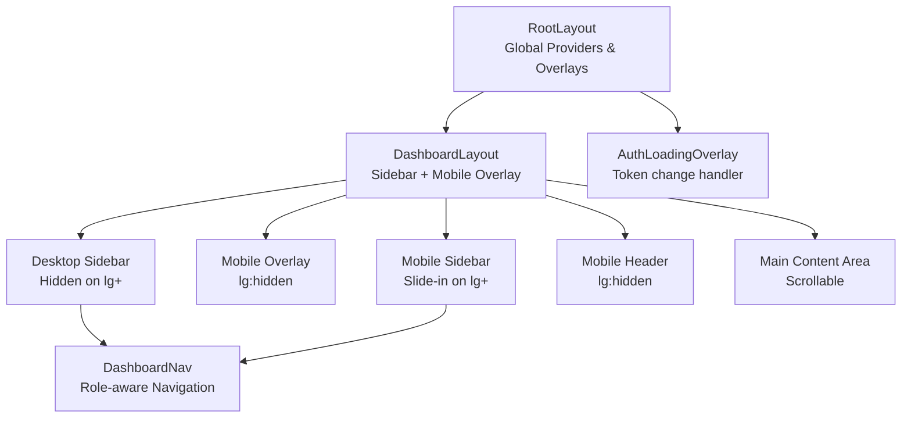
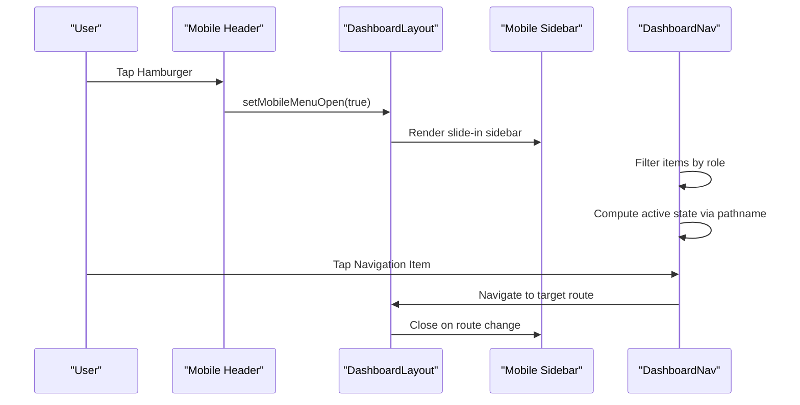
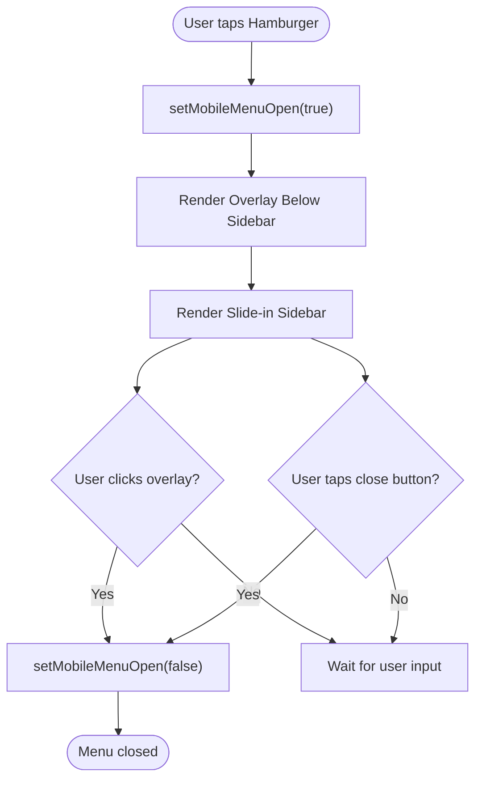
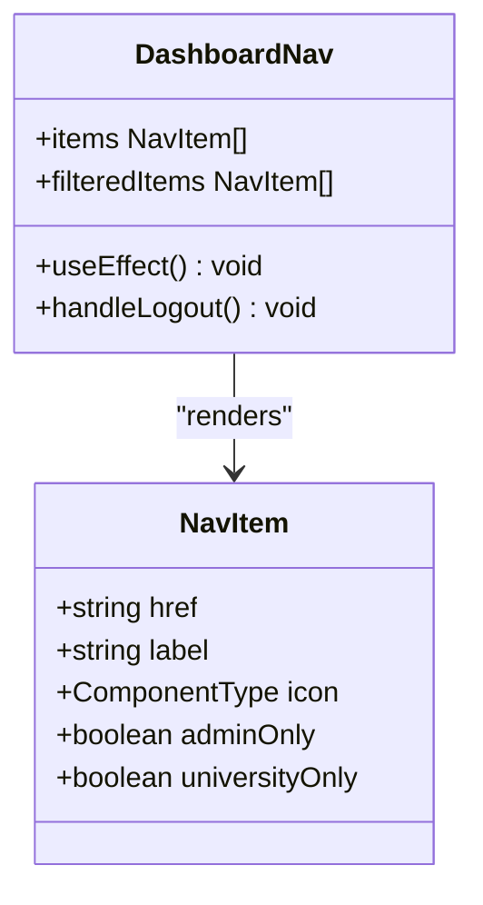
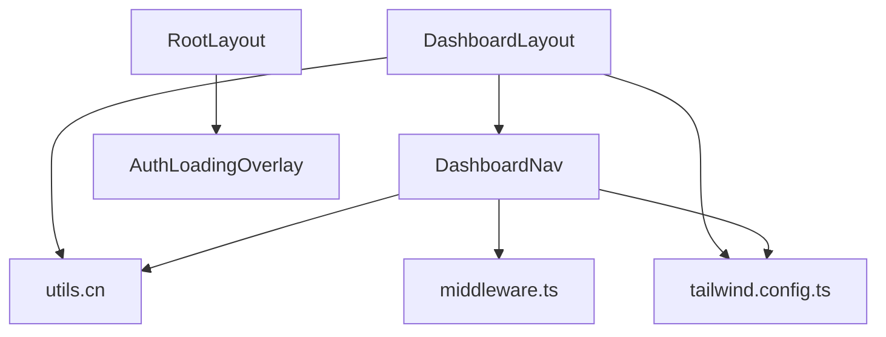

# Dashboard Layout and Navigation

<cite>
**Referenced Files in This Document**
- [dashboard/layout.tsx](file://apps/web/app/dashboard/layout.tsx)
- [dashboard-nav.tsx](file://apps/web/components/layout/dashboard-nav.tsx)
- [layout.tsx](file://apps/web/app/layout.tsx)
- [header.tsx](file://apps/web/components/layout/header.tsx)
- [globals.css](file://apps/web/app/globals.css)
- [tailwind.config.ts](file://apps/web/tailwind.config.ts)
- [utils.ts](file://apps/web/lib/utils.ts)
- [middleware.ts](file://apps/web/middleware.ts)
- [dashboard/page.tsx](file://apps/web/app/dashboard/page.tsx)
- [dashboard/courses/page.tsx](file://apps/web/app/dashboard/courses/page.tsx)
- [dashboard/university/page.tsx](file://apps/web/app/dashboard/university/page.tsx)
- [AuthLoadingOverlay.tsx](file://apps/web/components/layout/AuthLoadingOverlay.tsx)
</cite>

## Table of Contents
1. [Introduction](#introduction)
2. [Project Structure](#project-structure)
3. [Core Components](#core-components)
4. [Architecture Overview](#architecture-overview)
5. [Detailed Component Analysis](#detailed-component-analysis)
6. [Dependency Analysis](#dependency-analysis)
7. [Performance Considerations](#performance-considerations)
8. [Troubleshooting Guide](#troubleshooting-guide)
9. [Conclusion](#conclusion)

## Introduction
This document explains the dashboard layout system and navigation structure for the Next.js application. It covers the responsive sidebar implementation (desktop and mobile variants), the mobile menu overlay and hamburger navigation, the layout hierarchy, navigation component structure, menu item organization, active state management, mobile-first design, touch-friendly interactions, and accessibility considerations. It also provides practical guidance for layout customization, navigation configuration, and responsive behavior patterns.

## Project Structure
The dashboard layout system centers around a client-side layout component that orchestrates a persistent sidebar navigation, a mobile overlay menu, and a main content area. The root layout provides global providers and overlays. Navigation is role-aware and adapts to user permissions.

**Diagram sources**
- [layout.tsx](file://apps/web/app/layout.tsx#L24-L42)
- [dashboard/layout.tsx](file://apps/web/app/dashboard/layout.tsx#L11-L70)
- [dashboard-nav.tsx](file://apps/web/components/layout/dashboard-nav.tsx#L37-L117)
- [AuthLoadingOverlay.tsx](file://apps/web/components/layout/AuthLoadingOverlay.tsx#L6-L36)

**Section sources**
- [layout.tsx](file://apps/web/app/layout.tsx#L24-L42)
- [dashboard/layout.tsx](file://apps/web/app/dashboard/layout.tsx#L11-L70)

## Core Components
- DashboardLayout: Orchestrates desktop sidebar, mobile overlay, mobile sidebar, and main content area. Uses a local state to control mobile menu visibility and Tailwind classes for responsive breakpoints.
- DashboardNav: Renders role-aware navigation items, handles logout, and applies active state styling based on current path.
- RootLayout: Provides global providers (favorites, compare), toast notifications, and the authentication loading overlay.
- Header: Implements a separate site-wide header with mobile menu behavior (distinct from dashboard navigation).
- Utilities: Tailwind configuration and utility functions support responsive design and class merging.

Key implementation patterns:
- Responsive breakpoints: lg determines desktop vs. mobile behavior.
- Active state: Pathname comparison drives active link highlighting.
- Role filtering: Navigation items are filtered based on decoded JWT role.
- Accessibility: Buttons and links include appropriate ARIA attributes and keyboard-friendly interactions.

**Section sources**
- [dashboard/layout.tsx](file://apps/web/app/dashboard/layout.tsx#L11-L70)
- [dashboard-nav.tsx](file://apps/web/components/layout/dashboard-nav.tsx#L37-L117)
- [layout.tsx](file://apps/web/app/layout.tsx#L24-L42)
- [header.tsx](file://apps/web/components/layout/header.tsx#L8-L196)
- [tailwind.config.ts](file://apps/web/tailwind.config.ts#L3-L57)
- [utils.ts](file://apps/web/lib/utils.ts#L8-L10)

## Architecture Overview
The dashboard layout follows a mobile-first responsive design:
- Desktop: Persistent sidebar remains visible (hidden on smaller screens).
- Mobile: Hamburger menu opens a slide-in sidebar overlay with a backdrop and close affordance.
- Main content area scrolls independently and adapts padding at larger breakpoints.
- Navigation items are filtered by role and reflect active state based on the current route.

**Diagram sources**
- [dashboard/layout.tsx](file://apps/web/app/dashboard/layout.tsx#L52-L60)
- [dashboard/layout.tsx](file://apps/web/app/dashboard/layout.tsx#L37-L47)
- [dashboard-nav.tsx](file://apps/web/components/layout/dashboard-nav.tsx#L37-L117)

## Detailed Component Analysis

### DashboardLayout: Responsive Sidebar and Mobile Overlay
Responsibilities:
- Manage mobile menu state.
- Render desktop sidebar (hidden on small screens).
- Render mobile overlay and slide-in sidebar with backdrop.
- Provide mobile header with hamburger and main content area.

Responsive behavior:
- Desktop sidebar: shown when viewport width is lg or wider.
- Mobile overlay: appears below the sidebar when mobile menu is open.
- Mobile sidebar: translates in from the left; backdrop closes the menu.
- Mobile header: shows hamburger and title; triggers opening the mobile menu.

Accessibility and UX:
- Body scroll locking during mobile menu open.
- Clicking the overlay closes the mobile menu.
- Close button inside the mobile sidebar.

Customization tips:
- Adjust sidebar width by modifying the width utility class.
- Change transition timing or easing by editing transform transition classes.
- Modify breakpoint by replacing lg with md/sm if desired.

**Section sources**
- [dashboard/layout.tsx](file://apps/web/app/dashboard/layout.tsx#L11-L70)

#### Mobile Menu Overlay and Hamburger Navigation Flow

**Diagram sources**
- [dashboard/layout.tsx](file://apps/web/app/dashboard/layout.tsx#L28-L47)
- [dashboard/layout.tsx](file://apps/web/app/dashboard/layout.tsx#L52-L60)

### DashboardNav: Role-Aware Navigation and Active States
Responsibilities:
- Decode JWT token to determine user role.
- Filter navigation items based on role (admin-only, university-only, student).
- Render navigation items with icons and labels.
- Apply active state styling based on current pathname.
- Provide logout functionality.

Navigation structure:
- General items: overview, course management, analytics, university management, pending approvals, profile/widget settings.
- Student-specific items: student dashboard and search history.
- Logout and return-to-site actions.

Active state management:
- Active class applied when the current pathname matches the item href.
- Non-active items receive hover styles.

Accessibility:
- Links are keyboard focusable.
- Icons are presentational; ensure screen reader context is handled via surrounding text.

Customization tips:
- Add new items by extending the navItems or studentNavItems arrays.
- Use the adminOnly and universityOnly flags to restrict visibility.
- Customize active state styling by adjusting the conditional classes.

**Section sources**
- [dashboard-nav.tsx](file://apps/web/components/layout/dashboard-nav.tsx#L37-L117)

#### Navigation Component Class Relationships

**Diagram sources**
- [dashboard-nav.tsx](file://apps/web/components/layout/dashboard-nav.tsx#L15-L31)
- [dashboard-nav.tsx](file://apps/web/components/layout/dashboard-nav.tsx#L37-L117)

### RootLayout: Global Providers and Authentication Loading Overlay
Responsibilities:
- Wrap children with favorites and compare providers.
- Render toast notifications and the authentication loading overlay.
- Set global fonts and metadata.

Authentication loading overlay:
- Detects token changes and reloads the page after a short delay.
- Shows a centered overlay while switching accounts.

**Section sources**
- [layout.tsx](file://apps/web/app/layout.tsx#L24-L42)
- [AuthLoadingOverlay.tsx](file://apps/web/components/layout/AuthLoadingOverlay.tsx#L6-L36)

### Header: Site-Wide Header with Mobile Menu
While distinct from the dashboard navigation, the site-wide header demonstrates complementary mobile-first patterns:
- Fixed header with dynamic styling based on scroll and mobile state.
- Mobile menu overlay with body scroll locking.
- Role-aware buttons for login/register or dashboard access.

These patterns inform consistent mobile UX across the application.

**Section sources**
- [header.tsx](file://apps/web/components/layout/header.tsx#L8-L196)

### Middleware: Route-Based Access Control
The middleware enforces role-based access to dashboard routes:
- Redirects unauthorized users to login.
- Restricts STUDENT role to student-specific routes.
- Prevents UNIVERSITY/ADMIN from accessing student routes.
- Handles pending status for university users.
- Redirects rejected users to login.

This ensures the dashboard layout and navigation are only accessible to authorized users.

**Section sources**
- [middleware.ts](file://apps/web/middleware.ts#L25-L102)

## Dependency Analysis
The dashboard layout system relies on:
- Client-side state management for mobile menu visibility.
- Tailwind CSS for responsive breakpoints and styling.
- Next.js routing for active state detection and navigation.
- Utility functions for class merging.
- Middleware for access control.

**Diagram sources**
- [dashboard/layout.tsx](file://apps/web/app/dashboard/layout.tsx#L7-L8)
- [dashboard-nav.tsx](file://apps/web/components/layout/dashboard-nav.tsx#L8-L9)
- [utils.ts](file://apps/web/lib/utils.ts#L8-L10)
- [tailwind.config.ts](file://apps/web/tailwind.config.ts#L3-L57)
- [layout.tsx](file://apps/web/app/layout.tsx#L8-L12)

**Section sources**
- [dashboard/layout.tsx](file://apps/web/app/dashboard/layout.tsx#L7-L8)
- [dashboard-nav.tsx](file://apps/web/components/layout/dashboard-nav.tsx#L8-L9)
- [utils.ts](file://apps/web/lib/utils.ts#L8-L10)
- [tailwind.config.ts](file://apps/web/tailwind.config.ts#L3-L57)
- [layout.tsx](file://apps/web/app/layout.tsx#L8-L12)

## Performance Considerations
- Keep the sidebar lightweight: avoid heavy computations in the navigation component; filter items efficiently.
- Use CSS transforms for mobile sidebar animations (already implemented) for GPU-accelerated transitions.
- Minimize re-renders by memoizing navigation items and avoiding unnecessary state updates.
- Lazy load dashboard content to improve initial render performance.
- Leverage Tailwind’s purge configuration to remove unused styles.

## Troubleshooting Guide
Common issues and resolutions:
- Mobile menu does not close after navigation:
  - Ensure the mobile menu state is reset when navigating programmatically.
  - Verify that the overlay click handler and close button both call the state setter.
- Active state not updating:
  - Confirm that the pathname is correctly compared to the item href.
  - Ensure the navigation component is client-side and receives the updated pathname.
- Role-based items not appearing:
  - Verify the token decoding logic and that the role field exists in the payload.
  - Check that the filtering logic aligns with the intended role flags.
- Body scroll not unlocking on mobile:
  - Ensure cleanup effects reset the body overflow style when the mobile menu closes.
- Authentication loops:
  - Confirm the authentication loading overlay reloads the page after token changes.
  - Verify middleware redirects are not conflicting with client-side navigation.

**Section sources**
- [dashboard/layout.tsx](file://apps/web/app/dashboard/layout.tsx#L28-L47)
- [dashboard-nav.tsx](file://apps/web/components/layout/dashboard-nav.tsx#L37-L117)
- [AuthLoadingOverlay.tsx](file://apps/web/components/layout/AuthLoadingOverlay.tsx#L6-L36)
- [middleware.ts](file://apps/web/middleware.ts#L25-L102)

## Conclusion
The dashboard layout system implements a robust, mobile-first design with a persistent desktop sidebar and a slide-in mobile overlay. Role-aware navigation ensures appropriate menu items per user type, while active state management enhances usability. The system leverages Tailwind’s responsive utilities, Next.js routing, and client-side state to deliver a smooth, accessible experience across devices. By following the customization tips and troubleshooting guidance, teams can extend and maintain the layout effectively.