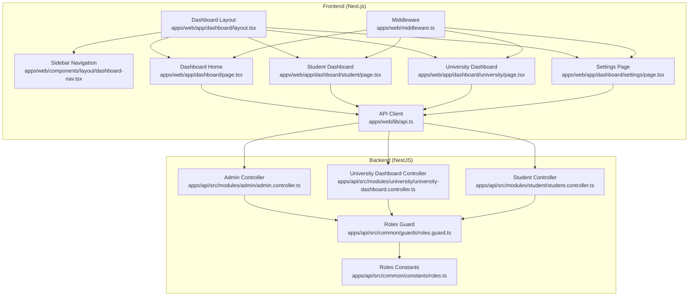
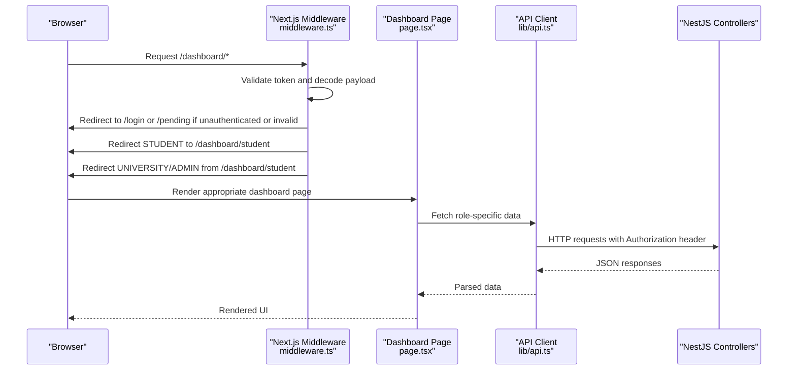
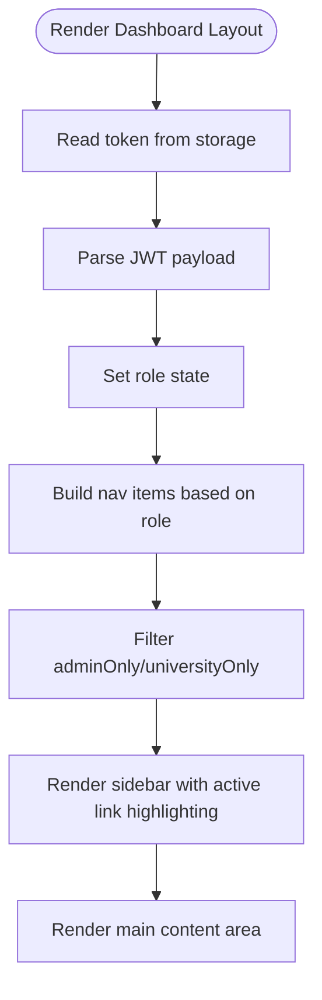
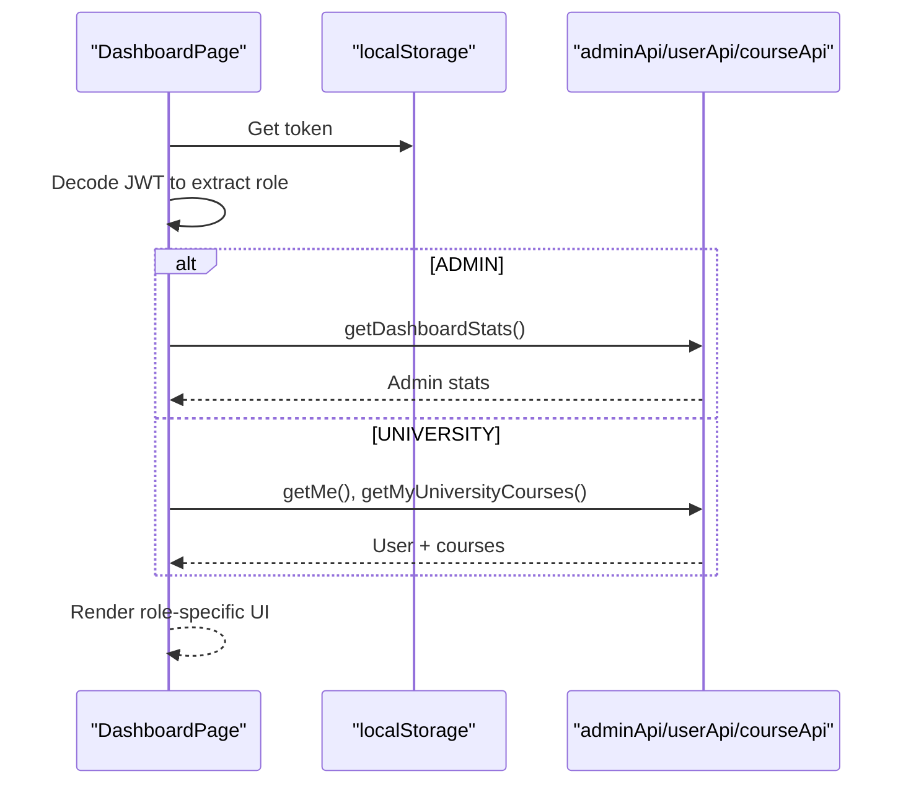
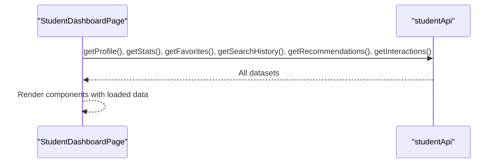
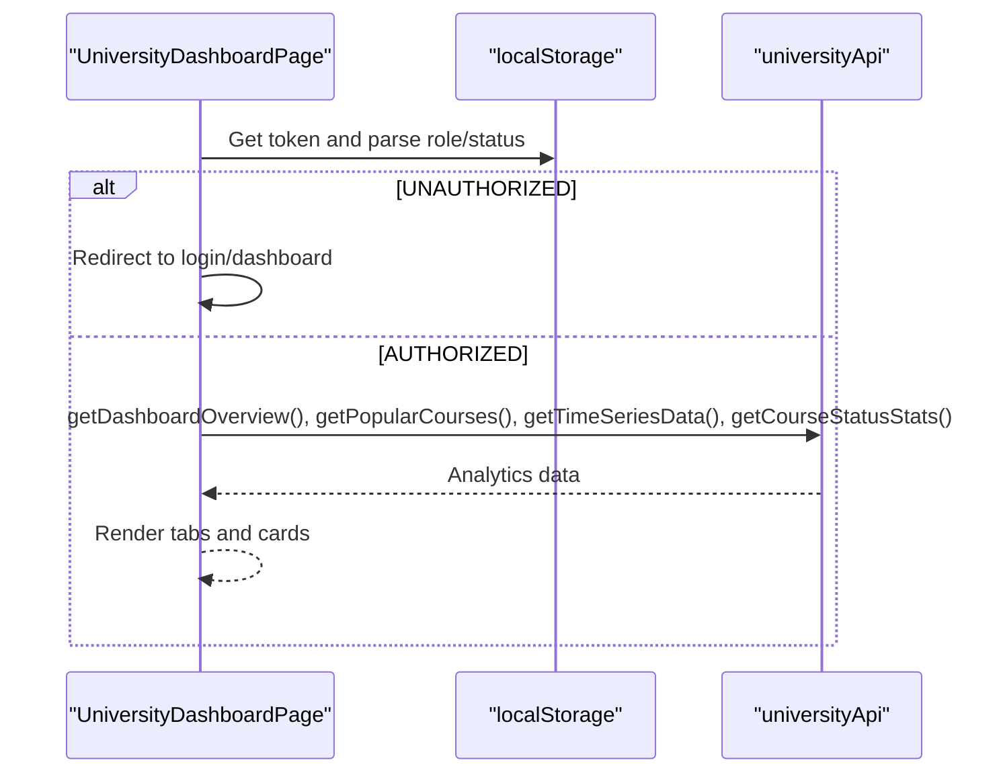
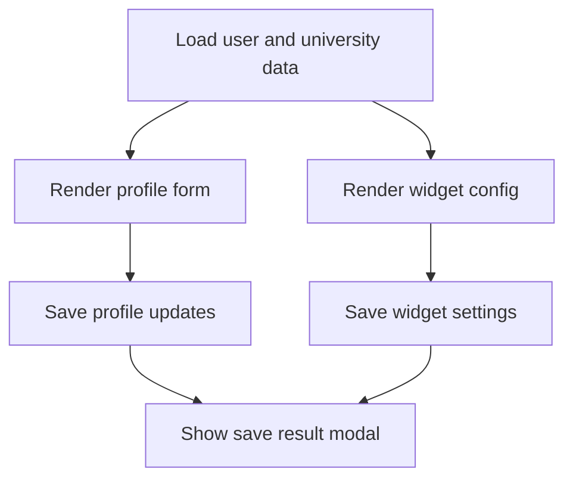
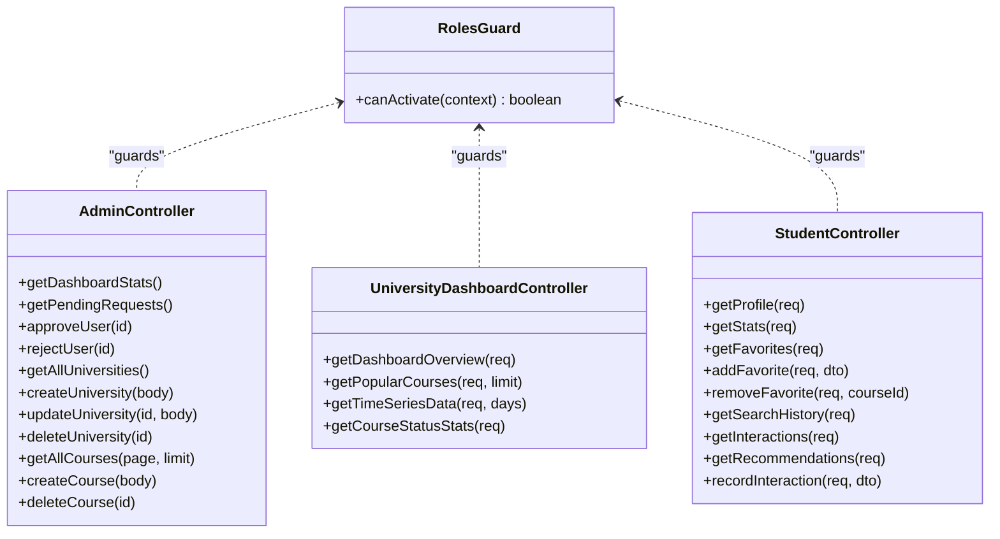
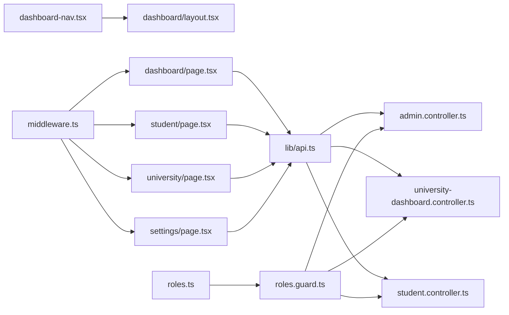

# Dashboard System

<cite>
**Referenced Files in This Document**
- [apps/web/app/dashboard/layout.tsx](file://apps/web/app/dashboard/layout.tsx)
- [apps/web/components/layout/dashboard-nav.tsx](file://apps/web/components/layout/dashboard-nav.tsx)
- [apps/web/app/dashboard/page.tsx](file://apps/web/app/dashboard/page.tsx)
- [apps/web/app/dashboard/student/page.tsx](file://apps/web/app/dashboard/student/page.tsx)
- [apps/web/app/dashboard/university/page.tsx](file://apps/web/app/dashboard/university/page.tsx)
- [apps/web/app/dashboard/settings/page.tsx](file://apps/web/app/dashboard/settings/page.tsx)
- [apps/web/lib/api.ts](file://apps/web/lib/api.ts)
- [apps/web/middleware.ts](file://apps/web/middleware.ts)
- [apps/web/app/dashboard/student/components/PersonalAnalytics.tsx](file://apps/web/app/dashboard/student/components/PersonalAnalytics.tsx)
- [apps/web/app/dashboard/university/components/WidgetSection.tsx](file://apps/web/app/dashboard/university/components/WidgetSection.tsx)
- [apps/api/src/common/constants/roles.ts](file://apps/api/src/common/constants/roles.ts)
- [apps/api/src/common/guards/roles.guard.ts](file://apps/api/src/common/guards/roles.guard.ts)
- [apps/api/src/modules/admin/admin.controller.ts](file://apps/api/src/modules/admin/admin.controller.ts)
- [apps/api/src/modules/university/university-dashboard.controller.ts](file://apps/api/src/modules/university/university-dashboard.controller.ts)
- [apps/api/src/modules/student/student.controller.ts](file://apps/api/src/modules/student/student.controller.ts)
</cite>

## Table of Contents
1. [Introduction](#introduction)
2. [Project Structure](#project-structure)
3. [Core Components](#core-components)
4. [Architecture Overview](#architecture-overview)
5. [Detailed Component Analysis](#detailed-component-analysis)
6. [Dependency Analysis](#dependency-analysis)
7. [Performance Considerations](#performance-considerations)
8. [Troubleshooting Guide](#troubleshooting-guide)
9. [Conclusion](#conclusion)
10. [Appendices](#appendices)

## Introduction
This document describes the multi-role dashboard system that serves three distinct user personas: students, university representatives, and administrators. It explains the dashboard layout structure, navigation patterns, and role-based content rendering. It also documents the student dashboard with personal analytics, recommendations, and favorites management; the university dashboard with course analytics and widget configuration; the admin dashboard and system administration features; and the settings page for profile and widget configuration. Finally, it covers responsive design patterns and user experience considerations across screen sizes.

## Project Structure
The dashboard system is implemented as a Next.js application with a shared dashboard layout and role-aware pages. The frontend communicates with a NestJS backend via typed API clients. Access control is enforced both on the client (middleware) and server (guards and route decorators).

**Diagram sources**
- [apps/web/app/dashboard/layout.tsx](file://apps/web/app/dashboard/layout.tsx#L1-L71)
- [apps/web/components/layout/dashboard-nav.tsx](file://apps/web/components/layout/dashboard-nav.tsx#L1-L118)
- [apps/web/app/dashboard/page.tsx](file://apps/web/app/dashboard/page.tsx#L1-L232)
- [apps/web/app/dashboard/student/page.tsx](file://apps/web/app/dashboard/student/page.tsx#L1-L190)
- [apps/web/app/dashboard/university/page.tsx](file://apps/web/app/dashboard/university/page.tsx#L1-L94)
- [apps/web/app/dashboard/settings/page.tsx](file://apps/web/app/dashboard/settings/page.tsx#L1-L380)
- [apps/web/lib/api.ts](file://apps/web/lib/api.ts#L1-L378)
- [apps/web/middleware.ts](file://apps/web/middleware.ts#L1-L107)
- [apps/api/src/modules/admin/admin.controller.ts](file://apps/api/src/modules/admin/admin.controller.ts#L1-L119)
- [apps/api/src/modules/university/university-dashboard.controller.ts](file://apps/api/src/modules/university/university-dashboard.controller.ts#L1-L81)
- [apps/api/src/modules/student/student.controller.ts](file://apps/api/src/modules/student/student.controller.ts#L1-L101)
- [apps/api/src/common/guards/roles.guard.ts](file://apps/api/src/common/guards/roles.guard.ts#L1-L56)
- [apps/api/src/common/constants/roles.ts](file://apps/api/src/common/constants/roles.ts#L1-L6)

**Section sources**
- [apps/web/app/dashboard/layout.tsx](file://apps/web/app/dashboard/layout.tsx#L1-L71)
- [apps/web/middleware.ts](file://apps/web/middleware.ts#L1-L107)

## Core Components
- Dashboard Layout: Provides a responsive sidebar navigation and scrollable main content area with mobile overlay support.
- Navigation: Role-aware sidebar that renders different menu items depending on the user’s role.
- Dashboard Home: Dynamically renders statistics and quick actions based on the user’s role.
- Student Dashboard: Aggregates personal analytics, recommendations, favorites, search history, viewed courses, and quick actions.
- University Dashboard: Presents analytics cards, popular courses, time series charts, and course health metrics.
- Settings: Manages university profile and widget configuration, including embed code generation and headless API usage.
- API Client: Centralized HTTP client with token injection and standardized error handling.
- Middleware: Enforces role-based routing and redirects unauthorized users appropriately.

**Section sources**
- [apps/web/app/dashboard/layout.tsx](file://apps/web/app/dashboard/layout.tsx#L11-L71)
- [apps/web/components/layout/dashboard-nav.tsx](file://apps/web/components/layout/dashboard-nav.tsx#L37-L118)
- [apps/web/app/dashboard/page.tsx](file://apps/web/app/dashboard/page.tsx#L31-L176)
- [apps/web/app/dashboard/student/page.tsx](file://apps/web/app/dashboard/student/page.tsx#L21-L190)
- [apps/web/app/dashboard/university/page.tsx](file://apps/web/app/dashboard/university/page.tsx#L27-L94)
- [apps/web/app/dashboard/settings/page.tsx](file://apps/web/app/dashboard/settings/page.tsx#L28-L380)
- [apps/web/lib/api.ts](file://apps/web/lib/api.ts#L10-L378)
- [apps/web/middleware.ts](file://apps/web/middleware.ts#L25-L102)

## Architecture Overview
The system enforces role-based access at two layers:
- Client-side middleware ensures only authenticated users can reach dashboard routes and redirects based on role and status.
- Server-side guards and route decorators enforce role permissions for protected endpoints.

**Diagram sources**
- [apps/web/middleware.ts](file://apps/web/middleware.ts#L25-L102)
- [apps/web/app/dashboard/page.tsx](file://apps/web/app/dashboard/page.tsx#L37-L77)
- [apps/web/lib/api.ts](file://apps/web/lib/api.ts#L10-L378)
- [apps/api/src/modules/admin/admin.controller.ts](file://apps/api/src/modules/admin/admin.controller.ts#L23-L119)
- [apps/api/src/modules/university/university-dashboard.controller.ts](file://apps/api/src/modules/university/university-dashboard.controller.ts#L25-L81)
- [apps/api/src/modules/student/student.controller.ts](file://apps/api/src/modules/student/student.controller.ts#L31-L101)

## Detailed Component Analysis

### Dashboard Layout and Navigation
- Responsive sidebar: Desktop uses a fixed sidebar; mobile uses an overlay with a slide-in animation and close button.
- Mobile-first header: Shows a hamburger menu to toggle the sidebar on small screens.
- Scrollable content area: Ensures long dashboards remain usable on smaller devices.
- Navigation filtering: Sidebar items are filtered by role using a dedicated guard and token parsing.

**Diagram sources**
- [apps/web/app/dashboard/layout.tsx](file://apps/web/app/dashboard/layout.tsx#L11-L71)
- [apps/web/components/layout/dashboard-nav.tsx](file://apps/web/components/layout/dashboard-nav.tsx#L37-L118)

**Section sources**
- [apps/web/app/dashboard/layout.tsx](file://apps/web/app/dashboard/layout.tsx#L11-L71)
- [apps/web/components/layout/dashboard-nav.tsx](file://apps/web/components/layout/dashboard-nav.tsx#L37-L118)

### Dashboard Home (Role-Based Rendering)
- Role detection: Parses the JWT token to determine role and status.
- Admin dashboard: Displays global statistics and quick actions tailored to administrators.
- University dashboard: Shows university-specific metrics and quick actions for analytics and course management.
- Loading states: Uses skeleton-like spinners while fetching data.

**Diagram sources**
- [apps/web/app/dashboard/page.tsx](file://apps/web/app/dashboard/page.tsx#L31-L176)
- [apps/web/lib/api.ts](file://apps/web/lib/api.ts#L294-L377)

**Section sources**
- [apps/web/app/dashboard/page.tsx](file://apps/web/app/dashboard/page.tsx#L31-L176)
- [apps/web/lib/api.ts](file://apps/web/lib/api.ts#L294-L377)

### Student Dashboard
- Data orchestration: Loads profile, stats, favorites, search history, recommendations, and interactions concurrently.
- Components:
  - Welcome card: Displays user greeting and summary stats.
  - Quick actions: One-click navigation to related areas.
  - Recommendations section: Curated course suggestions.
  - Favorites table: Manage saved courses.
  - Search history list: Review previous searches.
  - Viewed courses section: Tracks interactions.
  - Personal analytics: City preference and average ECTS interest.
- Error handling: Displays errors with retry option.

**Diagram sources**
- [apps/web/app/dashboard/student/page.tsx](file://apps/web/app/dashboard/student/page.tsx#L21-L190)
- [apps/web/lib/api.ts](file://apps/web/lib/api.ts#L189-L284)

**Section sources**
- [apps/web/app/dashboard/student/page.tsx](file://apps/web/app/dashboard/student/page.tsx#L21-L190)
- [apps/web/app/dashboard/student/components/PersonalAnalytics.tsx](file://apps/web/app/dashboard/student/components/PersonalAnalytics.tsx#L16-L46)
- [apps/web/lib/api.ts](file://apps/web/lib/api.ts#L189-L284)

### University Dashboard
- Role enforcement: Validates role and status before rendering.
- Analytics sections: Overview cards, popular courses, time series charts, and course health metrics.
- Suspense boundaries: Gracefully handles loading states for analytics widgets.
- Tabbed interface: Organizes analytics content for clarity.

**Diagram sources**
- [apps/web/app/dashboard/university/page.tsx](file://apps/web/app/dashboard/university/page.tsx#L27-L94)
- [apps/web/lib/api.ts](file://apps/web/lib/api.ts#L98-L165)

**Section sources**
- [apps/web/app/dashboard/university/page.tsx](file://apps/web/app/dashboard/university/page.tsx#L27-L94)
- [apps/web/lib/api.ts](file://apps/web/lib/api.ts#L98-L165)

### Settings Page (Profile & Widget)
- Profile management: Displays university info and allows updating website, contact email, and logo.
- Widget configuration: Lets universities customize primary color and theme, generates embed code, and exposes a headless API endpoint.
- Verification status: Shows approval state with contextual messaging.
- Modal feedback: Provides confirm/error/success/info notifications.

**Diagram sources**
- [apps/web/app/dashboard/settings/page.tsx](file://apps/web/app/dashboard/settings/page.tsx#L28-L380)
- [apps/web/lib/api.ts](file://apps/web/lib/api.ts#L98-L113)

**Section sources**
- [apps/web/app/dashboard/settings/page.tsx](file://apps/web/app/dashboard/settings/page.tsx#L28-L380)
- [apps/web/lib/api.ts](file://apps/web/lib/api.ts#L98-L113)

### API Layer and Backend Guards
- Frontend API client centralizes HTTP calls, injects Authorization headers, and standardizes error handling.
- Backend controllers enforce role-based access using guards and decorators.
- Roles guard validates JWT user role against required roles per route.

**Diagram sources**
- [apps/api/src/common/guards/roles.guard.ts](file://apps/api/src/common/guards/roles.guard.ts#L20-L56)
- [apps/api/src/modules/admin/admin.controller.ts](file://apps/api/src/modules/admin/admin.controller.ts#L23-L119)
- [apps/api/src/modules/university/university-dashboard.controller.ts](file://apps/api/src/modules/university/university-dashboard.controller.ts#L25-L81)
- [apps/api/src/modules/student/student.controller.ts](file://apps/api/src/modules/student/student.controller.ts#L31-L101)

**Section sources**
- [apps/web/lib/api.ts](file://apps/web/lib/api.ts#L10-L378)
- [apps/api/src/common/guards/roles.guard.ts](file://apps/api/src/common/guards/roles.guard.ts#L20-L56)
- [apps/api/src/modules/admin/admin.controller.ts](file://apps/api/src/modules/admin/admin.controller.ts#L23-L119)
- [apps/api/src/modules/university/university-dashboard.controller.ts](file://apps/api/src/modules/university/university-dashboard.controller.ts#L25-L81)
- [apps/api/src/modules/student/student.controller.ts](file://apps/api/src/modules/student/student.controller.ts#L31-L101)

## Dependency Analysis
- Client-side dependencies:
  - Dashboard layout depends on the navigation component and Tailwind classes for responsiveness.
  - Pages depend on the API client for data fetching and on the middleware for routing protection.
- Server-side dependencies:
  - Controllers depend on services and guards; guards depend on role constants.
- Coupling and cohesion:
  - Strong cohesion within each dashboard page and component.
  - Low coupling via the API client abstraction and centralized guards.

**Diagram sources**
- [apps/web/components/layout/dashboard-nav.tsx](file://apps/web/components/layout/dashboard-nav.tsx#L1-L118)
- [apps/web/app/dashboard/layout.tsx](file://apps/web/app/dashboard/layout.tsx#L1-L71)
- [apps/web/app/dashboard/page.tsx](file://apps/web/app/dashboard/page.tsx#L1-L232)
- [apps/web/app/dashboard/student/page.tsx](file://apps/web/app/dashboard/student/page.tsx#L1-L190)
- [apps/web/app/dashboard/university/page.tsx](file://apps/web/app/dashboard/university/page.tsx#L1-L94)
- [apps/web/app/dashboard/settings/page.tsx](file://apps/web/app/dashboard/settings/page.tsx#L1-L380)
- [apps/web/lib/api.ts](file://apps/web/lib/api.ts#L1-L378)
- [apps/web/middleware.ts](file://apps/web/middleware.ts#L1-L107)
- [apps/api/src/common/guards/roles.guard.ts](file://apps/api/src/common/guards/roles.guard.ts#L1-L56)
- [apps/api/src/modules/admin/admin.controller.ts](file://apps/api/src/modules/admin/admin.controller.ts#L1-L119)
- [apps/api/src/modules/university/university-dashboard.controller.ts](file://apps/api/src/modules/university/university-dashboard.controller.ts#L1-L81)
- [apps/api/src/modules/student/student.controller.ts](file://apps/api/src/modules/student/student.controller.ts#L1-L101)
- [apps/api/src/common/constants/roles.ts](file://apps/api/src/common/constants/roles.ts#L1-L6)

**Section sources**
- [apps/web/lib/api.ts](file://apps/web/lib/api.ts#L10-L378)
- [apps/api/src/common/guards/roles.guard.ts](file://apps/api/src/common/guards/roles.guard.ts#L20-L56)

## Performance Considerations
- Concurrent data fetching: Student dashboard loads multiple datasets in parallel to reduce perceived latency.
- Skeleton placeholders: University dashboard uses Suspense with skeletons to maintain perceived performance during analytics loading.
- Minimal re-renders: Role checks and navigation filtering occur once per session to avoid unnecessary computations.
- Responsive design: Grid layouts adapt to screen size to prevent excessive reflows and maintain readability.

[No sources needed since this section provides general guidance]

## Troubleshooting Guide
- Authentication failures:
  - Verify token presence and validity in local storage and cookies.
  - Confirm middleware redirection to login when token is missing or invalid.
- Role mismatches:
  - Ensure the decoded JWT payload contains the expected role and status.
  - STUDENT users are redirected away from non-student dashboard routes.
- Unauthorized access:
  - Server-side guards will block requests without proper roles; check controller decorators and guards.
- Widget configuration issues:
  - Validate university ID and widget settings; regenerate embed code if parameters change.
- Network errors:
  - Inspect API client error handling and network tab for failed requests.

**Section sources**
- [apps/web/middleware.ts](file://apps/web/middleware.ts#L25-L102)
- [apps/web/lib/api.ts](file://apps/web/lib/api.ts#L10-L378)
- [apps/api/src/common/guards/roles.guard.ts](file://apps/api/src/common/guards/roles.guard.ts#L24-L54)

## Conclusion
The dashboard system provides a cohesive, role-aware experience across three user types. The frontend layout and navigation are responsive and secure, while the backend enforces strict role-based access control. The student dashboard focuses on personal insights and course discovery, the university dashboard emphasizes analytics and widget configuration, and the admin dashboard centralizes oversight and management. The settings page streamlines profile and widget customization, ensuring a smooth integration for universities.

[No sources needed since this section summarizes without analyzing specific files]

## Appendices

### Responsive Design Patterns
- Sidebar visibility: Hidden on small screens, fixed on large screens.
- Grid layouts: Adaptive column counts for cards and tables.
- Skeletons and spinners: Improve perceived performance during data loading.
- Mobile overlay: Slide-in navigation with backdrop click-to-close.

**Section sources**
- [apps/web/app/dashboard/layout.tsx](file://apps/web/app/dashboard/layout.tsx#L19-L71)
- [apps/web/app/dashboard/university/page.tsx](file://apps/web/app/dashboard/university/page.tsx#L68-L94)

### Data Visualization Patterns
- Overview cards: Summarize key metrics with icons and color-coded labels.
- Charts and tables: Time series and popularity metrics rendered in dedicated components.
- Personal analytics: City preference and average ECTS interest presented in compact cards.

**Section sources**
- [apps/web/app/dashboard/page.tsx](file://apps/web/app/dashboard/page.tsx#L178-L232)
- [apps/web/app/dashboard/university/page.tsx](file://apps/web/app/dashboard/university/page.tsx#L68-L94)
- [apps/web/app/dashboard/student/components/PersonalAnalytics.tsx](file://apps/web/app/dashboard/student/components/PersonalAnalytics.tsx#L16-L46)