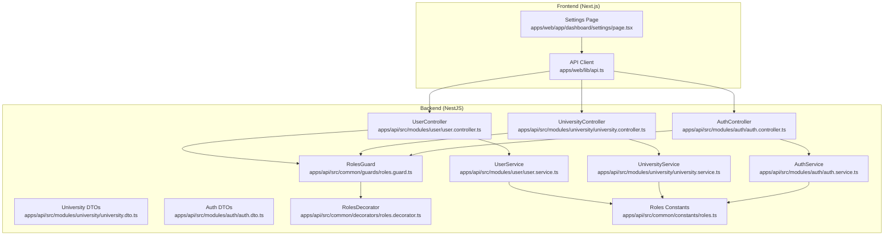
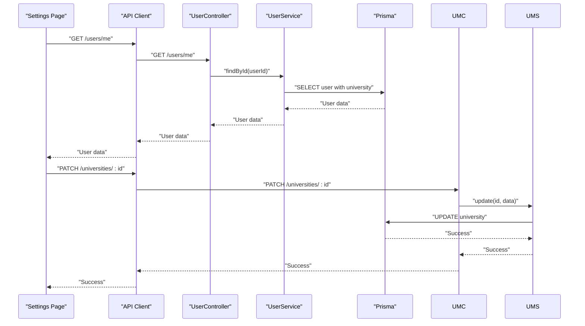
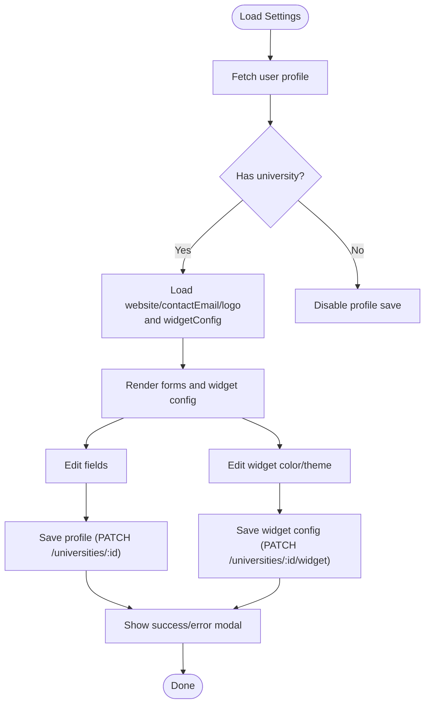
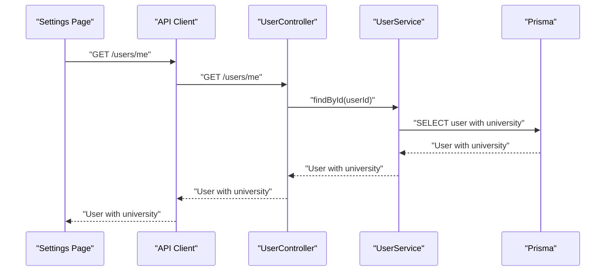
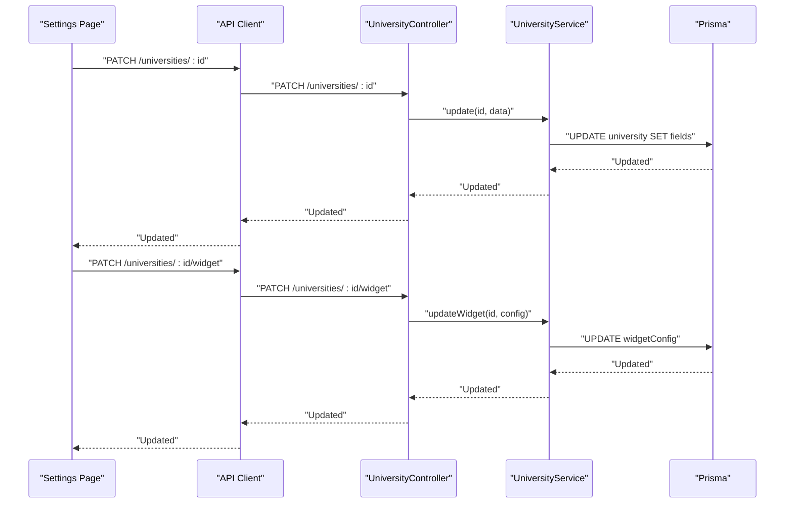
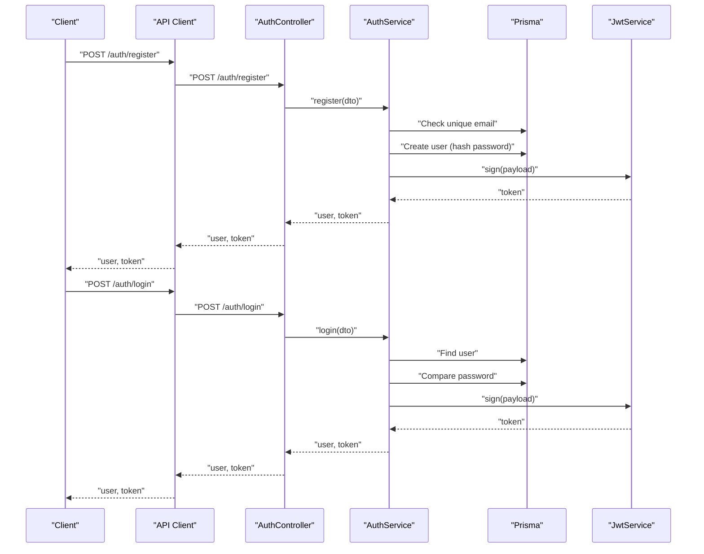
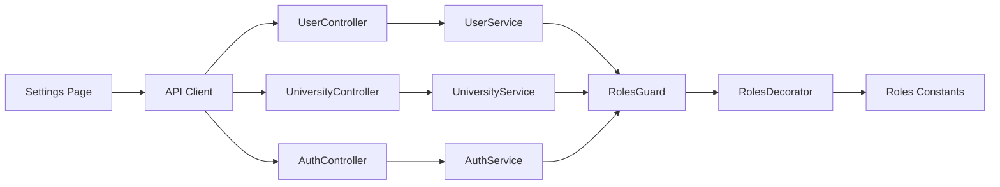

# Settings and Profile Management

<cite>
**Referenced Files in This Document**
- [page.tsx](file://apps/web/app/dashboard/settings/page.tsx)
- [api.ts](file://apps/web/lib/api.ts)
- [user.controller.ts](file://apps/api/src/modules/user/user.controller.ts)
- [user.service.ts](file://apps/api/src/modules/user/user.service.ts)
- [university.controller.ts](file://apps/api/src/modules/university/university.controller.ts)
- [university.service.ts](file://apps/api/src/modules/university/university.service.ts)
- [university.dto.ts](file://apps/api/src/modules/university/university.dto.ts)
- [auth.controller.ts](file://apps/api/src/modules/auth/auth.controller.ts)
- [auth.service.ts](file://apps/api/src/modules/auth/auth.service.ts)
- [auth.dto.ts](file://apps/api/src/modules/auth/auth.dto.ts)
- [roles.guard.ts](file://apps/api/src/common/guards/roles.guard.ts)
- [roles.decorator.ts](file://apps/api/src/common/decorators/roles.decorator.ts)
- [roles.ts](file://apps/api/src/common/constants/roles.ts)
</cite>

## Table of Contents
1. [Introduction](#introduction)
2. [Project Structure](#project-structure)
3. [Core Components](#core-components)
4. [Architecture Overview](#architecture-overview)
5. [Detailed Component Analysis](#detailed-component-analysis)
6. [Dependency Analysis](#dependency-analysis)
7. [Performance Considerations](#performance-considerations)
8. [Troubleshooting Guide](#troubleshooting-guide)
9. [Conclusion](#conclusion)

## Introduction
This document describes the settings and profile management system for the application. It covers the user profile editing interface for updating personal information, managing university profile settings, configuring widget appearance, and integrating with the authentication and authorization subsystem. It also documents form validation patterns, security considerations for sensitive data, and user experience optimizations for profile management workflows. The system supports role-based access for students, university staff, and administrators, and synchronizes profile data across the frontend and backend.

## Project Structure
The settings and profile management spans the Next.js frontend and the NestJS backend:
- Frontend: Next.js page component renders the settings UI, handles user interactions, and communicates with backend APIs via a centralized API client.
- Backend: NestJS modules expose endpoints for user profiles, university profiles, and authentication. Validation is enforced using Zod schemas, and access control is handled by role-based guards.

**Diagram sources**
- [page.tsx](file://apps/web/app/dashboard/settings/page.tsx#L1-L380)
- [api.ts](file://apps/web/lib/api.ts#L1-L378)
- [user.controller.ts](file://apps/api/src/modules/user/user.controller.ts#L1-L40)
- [user.service.ts](file://apps/api/src/modules/user/user.service.ts#L1-L76)
- [university.controller.ts](file://apps/api/src/modules/university/university.controller.ts)
- [university.service.ts](file://apps/api/src/modules/university/university.service.ts)
- [university.dto.ts](file://apps/api/src/modules/university/university.dto.ts#L1-L48)
- [auth.controller.ts](file://apps/api/src/modules/auth/auth.controller.ts#L1-L28)
- [auth.service.ts](file://apps/api/src/modules/auth/auth.service.ts#L1-L205)
- [auth.dto.ts](file://apps/api/src/modules/auth/auth.dto.ts#L1-L46)
- [roles.guard.ts](file://apps/api/src/common/guards/roles.guard.ts#L1-L56)
- [roles.decorator.ts](file://apps/api/src/common/decorators/roles.decorator.ts#L1-L16)
- [roles.ts](file://apps/api/src/common/constants/roles.ts#L1-L6)

**Section sources**
- [page.tsx](file://apps/web/app/dashboard/settings/page.tsx#L1-L380)
- [api.ts](file://apps/web/lib/api.ts#L1-L378)

## Core Components
- Settings Page (Next.js): Renders university profile and widget configuration forms, manages loading states, and displays modal notifications. It fetches current user data and university details, and persists updates to the backend.
- API Client: Centralized HTTP client that injects Authorization headers, handles errors, and exposes typed methods for user, university, course, and admin operations.
- User Module: Provides the authenticated user profile endpoint and admin listing capabilities.
- University Module: Manages university profile updates and widget configuration updates.
- Authentication Module: Handles registration, login, and JWT token generation with role-aware status handling.
- Role-Based Access Control: Guards and decorators enforce role-based permissions across protected endpoints.

**Section sources**
- [page.tsx](file://apps/web/app/dashboard/settings/page.tsx#L28-L135)
- [api.ts](file://apps/web/lib/api.ts#L169-L187)
- [user.controller.ts](file://apps/api/src/modules/user/user.controller.ts#L14-L24)
- [user.service.ts](file://apps/api/src/modules/user/user.service.ts#L15-L42)
- [university.controller.ts](file://apps/api/src/modules/university/university.controller.ts)
- [university.service.ts](file://apps/api/src/modules/university/university.service.ts)
- [auth.controller.ts](file://apps/api/src/modules/auth/auth.controller.ts#L12-L27)
- [auth.service.ts](file://apps/api/src/modules/auth/auth.service.ts#L46-L130)
- [roles.guard.ts](file://apps/api/src/common/guards/roles.guard.ts#L20-L54)
- [roles.decorator.ts](file://apps/api/src/common/decorators/roles.decorator.ts#L6-L15)

## Architecture Overview
The settings and profile management follows a layered architecture:
- Presentation Layer: Next.js page component manages UI state and user interactions.
- Application Layer: API client encapsulates HTTP communication and error handling.
- Domain Layer: Controllers and Services implement business logic for user and university operations.
- Security Layer: Authentication service generates JWT tokens; role guard enforces access control.

**Diagram sources**
- [page.tsx](file://apps/web/app/dashboard/settings/page.tsx#L53-L86)
- [api.ts](file://apps/web/lib/api.ts#L169-L187)
- [user.controller.ts](file://apps/api/src/modules/user/user.controller.ts#L19-L24)
- [user.service.ts](file://apps/api/src/modules/user/user.service.ts#L15-L42)
- [university.controller.ts](file://apps/api/src/modules/university/university.controller.ts)
- [university.service.ts](file://apps/api/src/modules/university/university.service.ts)

## Detailed Component Analysis

### Settings Page (Profile Editing and Widget Configuration)
The settings page provides:
- University profile editing: website, contact email, and logo URL.
- Widget configuration: primary color and theme selection.
- Embed code generation and copy-to-clipboard functionality.
- Verification status display for the university.
- Loading and modal notification states.

Key behaviors:
- Loads current user and university data on mount.
- Updates university profile via PATCH requests.
- Updates widget configuration via dedicated PATCH endpoint.
- Displays success/error/info modal messages.
- Generates embed code using university ID and selected theme/color.

**Diagram sources**
- [page.tsx](file://apps/web/app/dashboard/settings/page.tsx#L53-L135)

**Section sources**
- [page.tsx](file://apps/web/app/dashboard/settings/page.tsx#L28-L135)

### API Client and Endpoints
The API client centralizes HTTP communication:
- Authentication endpoints: register and login.
- User endpoint: get authenticated user profile.
- University endpoints: get/update university, update widget configuration, and dashboard analytics.
- Student endpoints: profile, stats, favorites, search history, interactions, and recommendations.
- Widget endpoint: headless data retrieval.
- Admin endpoints: dashboard statistics, pending requests, manage universities and courses.

Security:
- Injects Authorization header with Bearer token from local storage.
- Parses and surfaces error messages from backend.

**Section sources**
- [api.ts](file://apps/web/lib/api.ts#L10-L36)
- [api.ts](file://apps/web/lib/api.ts#L169-L187)
- [api.ts](file://apps/web/lib/api.ts#L100-L165)
- [api.ts](file://apps/web/lib/api.ts#L286-L290)
- [api.ts](file://apps/web/lib/api.ts#L292-L377)

### User Profile Retrieval
The user controller requires JWT authentication and returns the authenticated user’s profile, including associated university details.

**Diagram sources**
- [user.controller.ts](file://apps/api/src/modules/user/user.controller.ts#L19-L24)
- [user.service.ts](file://apps/api/src/modules/user/user.service.ts#L15-L42)

**Section sources**
- [user.controller.ts](file://apps/api/src/modules/user/user.controller.ts#L14-L24)
- [user.service.ts](file://apps/api/src/modules/user/user.service.ts#L15-L42)

### University Profile and Widget Configuration
University profile updates and widget configuration updates are handled by dedicated endpoints:
- Profile update: PATCH /universities/:id with optional fields (website, contactEmail, logo).
- Widget update: PATCH /universities/:id/widget with primaryColor and theme.

Validation:
- University DTOs define Zod schemas for creation, update, and widget configuration, ensuring data integrity.

**Diagram sources**
- [university.controller.ts](file://apps/api/src/modules/university/university.controller.ts)
- [university.service.ts](file://apps/api/src/modules/university/university.service.ts)
- [university.dto.ts](file://apps/api/src/modules/university/university.dto.ts#L27-L45)

**Section sources**
- [university.dto.ts](file://apps/api/src/modules/university/university.dto.ts#L27-L45)
- [university.controller.ts](file://apps/api/src/modules/university/university.controller.ts)
- [university.service.ts](file://apps/api/src/modules/university/university.service.ts)

### Authentication and Role-Based Access Control
Registration and login:
- Registration validates input using Zod schemas, enforces .edu.tr domain for UNIVERSITY role, sets appropriate user status, hashes passwords, and creates JWT tokens.
- Login validates credentials, checks user status, and issues JWT tokens.

Access control:
- JWT authentication is enforced globally for user endpoints.
- RolesGuard checks requested roles against the JWT payload and rejects unauthorized access.

**Diagram sources**
- [auth.controller.ts](file://apps/api/src/modules/auth/auth.controller.ts#L16-L26)
- [auth.service.ts](file://apps/api/src/modules/auth/auth.service.ts#L46-L130)
- [roles.guard.ts](file://apps/api/src/common/guards/roles.guard.ts#L24-L54)
- [roles.decorator.ts](file://apps/api/src/common/decorators/roles.decorator.ts#L11-L15)

**Section sources**
- [auth.controller.ts](file://apps/api/src/modules/auth/auth.controller.ts#L12-L27)
- [auth.service.ts](file://apps/api/src/modules/auth/auth.service.ts#L46-L170)
- [auth.dto.ts](file://apps/api/src/modules/auth/auth.dto.ts#L9-L30)
- [roles.guard.ts](file://apps/api/src/common/guards/roles.guard.ts#L20-L54)
- [roles.decorator.ts](file://apps/api/src/common/decorators/roles.decorator.ts#L6-L15)
- [roles.ts](file://apps/api/src/common/constants/roles.ts#L1-L6)

### Form Validation Patterns
Validation is enforced on both frontend and backend:
- Frontend: Controlled inputs for URL/email validation and color picker for hex codes.
- Backend: Zod schemas validate request bodies for user registration, login, university creation/update, and widget configuration.

Validation coverage:
- Email format and length for registration/login.
- Password length constraints.
- URL format for website/contactEmail/logo.
- Hex color code pattern for widget primaryColor.
- Enum-based theme selection.

**Section sources**
- [page.tsx](file://apps/web/app/dashboard/settings/page.tsx#L217-L233)
- [page.tsx](file://apps/web/app/dashboard/settings/page.tsx#L322-L334)
- [auth.dto.ts](file://apps/api/src/modules/auth/auth.dto.ts#L9-L30)
- [university.dto.ts](file://apps/api/src/modules/university/university.dto.ts#L9-L45)

### Security Considerations for Sensitive Data
- Token Management: Authorization header is injected automatically by the API client using a Bearer token stored in local storage.
- Authentication: JWT payload includes user identity, role, status, and optional university association.
- Access Control: RolesGuard verifies JWT roles against endpoint requirements; unauthorized access is rejected.
- Data Exposure: User service selects only necessary fields to prevent accidental exposure of sensitive data.

**Section sources**
- [api.ts](file://apps/web/lib/api.ts#L10-L36)
- [auth.service.ts](file://apps/api/src/modules/auth/auth.service.ts#L172-L188)
- [roles.guard.ts](file://apps/api/src/common/guards/roles.guard.ts#L24-L54)
- [user.service.ts](file://apps/api/src/modules/user/user.service.ts#L15-L42)

### User Experience Optimizations
- Loading States: Spinner during initial load and while saving profile/widget configurations.
- Immediate Feedback: Modal notifications for success/error/info states.
- Copy-to-Clipboard: One-click copy of generated embed code with visual feedback.
- Disabled Fields: Non-editable fields (e.g., university name, city) are disabled to avoid confusion.
- Clear Instructions: Step-by-step guide for embedding widgets and headless API usage.

**Section sources**
- [page.tsx](file://apps/web/app/dashboard/settings/page.tsx#L147-L153)
- [page.tsx](file://apps/web/app/dashboard/settings/page.tsx#L237-L245)
- [page.tsx](file://apps/web/app/dashboard/settings/page.tsx#L338-L347)
- [page.tsx](file://apps/web/app/dashboard/settings/page.tsx#L141-L145)
- [page.tsx](file://apps/web/app/dashboard/settings/page.tsx#L203-L211)

### Role-Specific Settings and Access
- Students: Access student-specific features (favorites, recommendations, search history, interactions).
- University Staff: Manage university profile and widget configuration; view dashboard analytics.
- Administrators: Manage users, universities, and courses; review pending requests; access admin dashboard.

Access enforcement:
- RolesGuard ensures endpoints are accessible only to authorized roles.
- User profile includes role and status for UI decisions.

**Section sources**
- [roles.guard.ts](file://apps/api/src/common/guards/roles.guard.ts#L24-L54)
- [user.controller.ts](file://apps/api/src/modules/user/user.controller.ts#L26-L38)
- [user.service.ts](file://apps/api/src/modules/user/user.service.ts#L44-L74)

## Dependency Analysis
The settings and profile management module depends on:
- Frontend: Next.js page component and API client for HTTP communication.
- Backend: User and University modules for profile data, Auth module for JWT and role-aware status, and Prisma for database operations.
- Security: RolesGuard and Roles decorator for access control.

**Diagram sources**
- [page.tsx](file://apps/web/app/dashboard/settings/page.tsx#L1-L380)
- [api.ts](file://apps/web/lib/api.ts#L1-L378)
- [user.controller.ts](file://apps/api/src/modules/user/user.controller.ts#L1-L40)
- [user.service.ts](file://apps/api/src/modules/user/user.service.ts#L1-L76)
- [university.controller.ts](file://apps/api/src/modules/university/university.controller.ts)
- [university.service.ts](file://apps/api/src/modules/university/university.service.ts)
- [auth.controller.ts](file://apps/api/src/modules/auth/auth.controller.ts#L1-L28)
- [auth.service.ts](file://apps/api/src/modules/auth/auth.service.ts#L1-L205)
- [roles.guard.ts](file://apps/api/src/common/guards/roles.guard.ts#L1-L56)
- [roles.decorator.ts](file://apps/api/src/common/decorators/roles.decorator.ts#L1-L16)
- [roles.ts](file://apps/api/src/common/constants/roles.ts#L1-L6)

**Section sources**
- [page.tsx](file://apps/web/app/dashboard/settings/page.tsx#L1-L380)
- [api.ts](file://apps/web/lib/api.ts#L1-L378)
- [user.controller.ts](file://apps/api/src/modules/user/user.controller.ts#L1-L40)
- [university.controller.ts](file://apps/api/src/modules/university/university.controller.ts)
- [auth.controller.ts](file://apps/api/src/modules/auth/auth.controller.ts#L1-L28)
- [roles.guard.ts](file://apps/api/src/common/guards/roles.guard.ts#L1-L56)

## Performance Considerations
- Minimize network requests: Batch related updates when possible.
- Debounce input changes: For frequent updates (e.g., color picker), debounce save operations to reduce backend load.
- Optimize rendering: Keep UI updates focused on changed fields to avoid unnecessary re-renders.
- Caching: Store university data locally after initial load to improve subsequent navigation performance.

## Troubleshooting Guide
Common issues and resolutions:
- Authentication failures: Verify token presence and validity; check login status and role/status constraints.
- Validation errors: Ensure inputs match Zod schemas (email format, URL format, password length, hex color).
- Access denied: Confirm user role and status; UNIVERSITY users awaiting admin approval cannot access certain features.
- Network errors: Inspect API client error handling and confirm backend endpoint availability.

**Section sources**
- [api.ts](file://apps/web/lib/api.ts#L28-L36)
- [auth.service.ts](file://apps/api/src/modules/auth/auth.service.ts#L136-L170)
- [roles.guard.ts](file://apps/api/src/common/guards/roles.guard.ts#L40-L54)

## Conclusion
The settings and profile management system integrates a responsive frontend with robust backend validation and role-based access control. It provides a secure, user-friendly interface for managing university profiles, widget configurations, and user data while maintaining strong security boundaries and clear validation patterns.