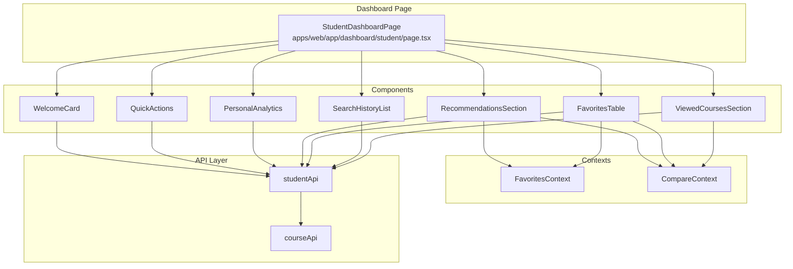
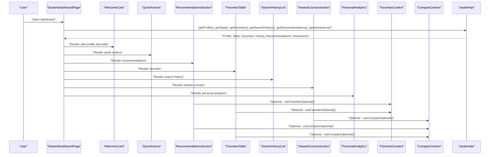
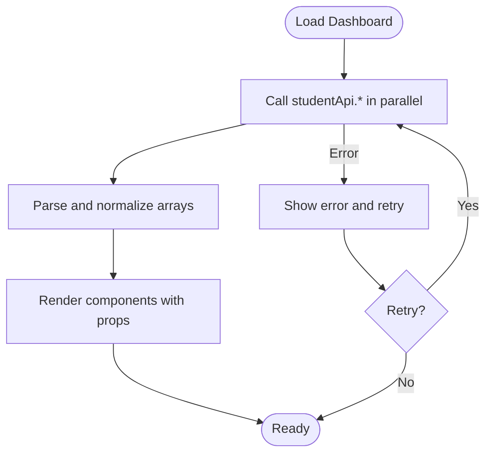
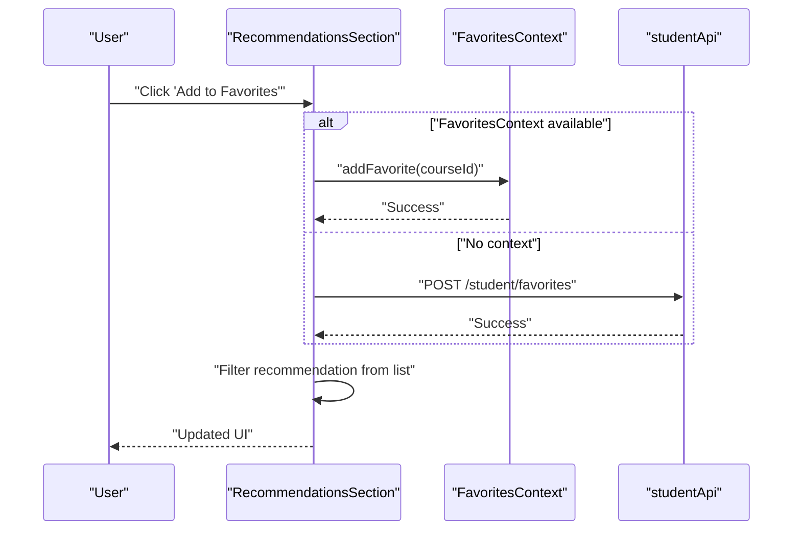
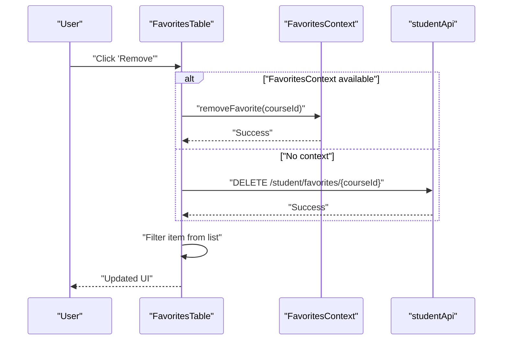
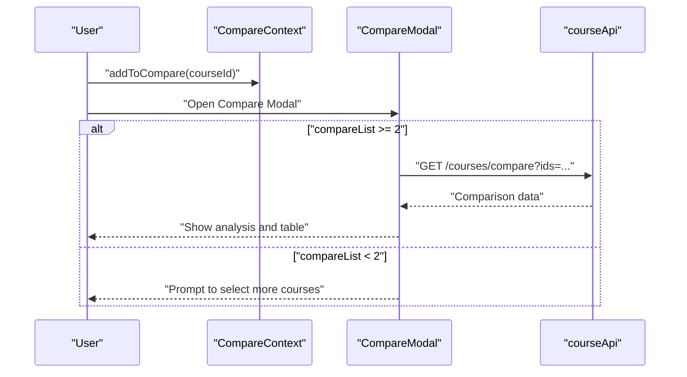
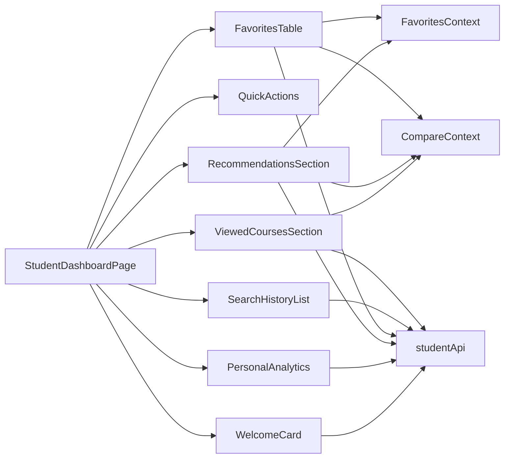

# Student Dashboard

<cite>
**Referenced Files in This Document**
- [page.tsx](file://apps/web/app/dashboard/student/page.tsx)
- [WelcomeCard.tsx](file://apps/web/app/dashboard/student/components/WelcomeCard.tsx)
- [QuickActions.tsx](file://apps/web/app/dashboard/student/components/QuickActions.tsx)
- [PersonalAnalytics.tsx](file://apps/web/app/dashboard/student/components/PersonalAnalytics.tsx)
- [RecommendationsSection.tsx](file://apps/web/app/dashboard/student/components/RecommendationsSection.tsx)
- [FavoritesTable.tsx](file://apps/web/app/dashboard/student/components/FavoritesTable.tsx)
- [SearchHistoryList.tsx](file://apps/web/app/dashboard/student/components/SearchHistoryList.tsx)
- [ViewedCoursesSection.tsx](file://apps/web/app/dashboard/student/components/ViewedCoursesSection.tsx)
- [api.ts](file://apps/web/lib/api.ts)
- [favorites-context.tsx](file://apps/web/contexts/favorites-context.tsx)
- [compare-context.tsx](file://apps/web/contexts/compare-context.tsx)
- [FavoriteButton.tsx](file://apps/web/components/course/FavoriteButton.tsx)
- [TrackCourseView.tsx](file://apps/web/components/course/TrackCourseView.tsx)
- [CompareModal.tsx](file://apps/web/components/compare/CompareModal.tsx)
- [search-history/page.tsx](file://apps/web/app/dashboard/student/search-history/page.tsx)
- [dashboard/layout.tsx](file://apps/web/app/dashboard/layout.tsx)
</cite>

## Table of Contents
1. [Introduction](#introduction)
2. [Project Structure](#project-structure)
3. [Core Components](#core-components)
4. [Architecture Overview](#architecture-overview)
5. [Detailed Component Analysis](#detailed-component-analysis)
6. [Dependency Analysis](#dependency-analysis)
7. [Performance Considerations](#performance-considerations)
8. [Troubleshooting Guide](#troubleshooting-guide)
9. [Conclusion](#conclusion)

## Introduction
This document describes the student dashboard system that presents a personalized learning journey. It includes a welcoming overview, quick actions, AI-powered recommendations, favorites management, search history, viewed courses, and personal analytics. The system emphasizes responsive layouts, interactive elements, and efficient data fetching patterns to optimize the student’s workflow.

## Project Structure
The dashboard is implemented as a Next.js app route with client-side components and shared contexts for state. The main dashboard page orchestrates multiple specialized components and integrates with a centralized API client. Supporting contexts manage favorites and course comparisons across the application.

**Diagram sources**
- [page.tsx](file://apps/web/app/dashboard/student/page.tsx#L21-L189)
- [WelcomeCard.tsx](file://apps/web/app/dashboard/student/components/WelcomeCard.tsx#L40-L64)
- [QuickActions.tsx](file://apps/web/app/dashboard/student/components/QuickActions.tsx#L9-L36)
- [RecommendationsSection.tsx](file://apps/web/app/dashboard/student/components/RecommendationsSection.tsx#L30-L151)
- [FavoritesTable.tsx](file://apps/web/app/dashboard/student/components/FavoritesTable.tsx#L28-L140)
- [SearchHistoryList.tsx](file://apps/web/app/dashboard/student/components/SearchHistoryList.tsx#L49-L129)
- [ViewedCoursesSection.tsx](file://apps/web/app/dashboard/student/components/ViewedCoursesSection.tsx#L28-L97)
- [PersonalAnalytics.tsx](file://apps/web/app/dashboard/student/components/PersonalAnalytics.tsx#L16-L45)
- [favorites-context.tsx](file://apps/web/contexts/favorites-context.tsx#L29-L132)
- [compare-context.tsx](file://apps/web/contexts/compare-context.tsx#L30-L98)
- [api.ts](file://apps/web/lib/api.ts#L191-L284)

**Section sources**
- [page.tsx](file://apps/web/app/dashboard/student/page.tsx#L1-L190)
- [dashboard/layout.tsx](file://apps/web/app/dashboard/layout.tsx#L11-L70)

## Core Components
- WelcomeCard: Displays greeting, profile-derived name, and key statistics (total searches, favorites, interactions, and relative time of last search).
- QuickActions: Provides shortcuts to initiate a new search, jump to favorites, and open the comparison flow.
- PersonalAnalytics: Shows personalized insights such as top searched city and average interest in ECTS credits.
- RecommendationsSection: Presents AI-driven course suggestions with favorite and compare actions.
- FavoritesTable: Manages the user’s favorite courses with inline compare and removal actions.
- SearchHistoryList: Summarizes recent searches with re-run links and filter highlights.
- ViewedCoursesSection: Highlights recently viewed courses with compare toggles.

**Section sources**
- [WelcomeCard.tsx](file://apps/web/app/dashboard/student/components/WelcomeCard.tsx#L40-L74)
- [QuickActions.tsx](file://apps/web/app/dashboard/student/components/QuickActions.tsx#L9-L37)
- [PersonalAnalytics.tsx](file://apps/web/app/dashboard/student/components/PersonalAnalytics.tsx#L16-L46)
- [RecommendationsSection.tsx](file://apps/web/app/dashboard/student/components/RecommendationsSection.tsx#L30-L152)
- [FavoritesTable.tsx](file://apps/web/app/dashboard/student/components/FavoritesTable.tsx#L28-L141)
- [SearchHistoryList.tsx](file://apps/web/app/dashboard/student/components/SearchHistoryList.tsx#L49-L130)
- [ViewedCoursesSection.tsx](file://apps/web/app/dashboard/student/components/ViewedCoursesSection.tsx#L28-L98)

## Architecture Overview
The dashboard composes multiple UI components that share state via React contexts and communicate with backend APIs through a unified client. The main page performs parallel data loads to hydrate the dashboard efficiently.

**Diagram sources**
- [page.tsx](file://apps/web/app/dashboard/student/page.tsx#L33-L59)
- [WelcomeCard.tsx](file://apps/web/app/dashboard/student/components/WelcomeCard.tsx#L40-L64)
- [QuickActions.tsx](file://apps/web/app/dashboard/student/components/QuickActions.tsx#L9-L36)
- [RecommendationsSection.tsx](file://apps/web/app/dashboard/student/components/RecommendationsSection.tsx#L36-L54)
- [FavoritesTable.tsx](file://apps/web/app/dashboard/student/components/FavoritesTable.tsx#L31-L49)
- [ViewedCoursesSection.tsx](file://apps/web/app/dashboard/student/components/ViewedCoursesSection.tsx#L29-L49)
- [PersonalAnalytics.tsx](file://apps/web/app/dashboard/student/components/PersonalAnalytics.tsx#L16-L45)
- [favorites-context.tsx](file://apps/web/contexts/favorites-context.tsx#L134-L145)
- [compare-context.tsx](file://apps/web/contexts/compare-context.tsx#L100-L110)
- [api.ts](file://apps/web/lib/api.ts#L191-L284)

## Detailed Component Analysis

### Dashboard Orchestration and Data Fetching
- Parallel loading: The dashboard page fetches profile, stats, favorites, search history, recommendations, and interactions concurrently to minimize load time.
- Error handling: Displays a friendly error state with retry capability.
- Loading state: Shows a spinner while data is being fetched.
- Composition: Renders child components with typed props derived from API responses.

**Diagram sources**
- [page.tsx](file://apps/web/app/dashboard/student/page.tsx#L33-L59)

**Section sources**
- [page.tsx](file://apps/web/app/dashboard/student/page.tsx#L21-L189)

### WelcomeCard
- Purpose: Friendly greeting and summary stats.
- Relative date formatting: Converts timestamps to human-friendly strings.
- Responsive layout: Grid adapts to small screens.

**Section sources**
- [WelcomeCard.tsx](file://apps/web/app/dashboard/student/components/WelcomeCard.tsx#L23-L38)
- [WelcomeCard.tsx](file://apps/web/app/dashboard/student/components/WelcomeCard.tsx#L40-L74)

### QuickActions
- Purpose: One-click navigation to search, favorites, and comparison.
- Links: Uses Next.js Link for client-side navigation where appropriate.

**Section sources**
- [QuickActions.tsx](file://apps/web/app/dashboard/student/components/QuickActions.tsx#L9-L37)

### PersonalAnalytics
- Purpose: Presents top searched city and average ECTS interest.
- Notes: Includes privacy note indicating data is personal.

**Section sources**
- [PersonalAnalytics.tsx](file://apps/web/app/dashboard/student/components/PersonalAnalytics.tsx#L16-L46)

### RecommendationsSection
- Purpose: AI-powered course suggestions tailored to the user.
- Actions:
  - Add to favorites: Uses FavoritesContext if present, otherwise falls back to studentApi.
  - Compare toggle: Integrates with CompareContext to add/remove items.
- Behavior: Removes recommended course from local list after adding to favorites.

**Diagram sources**
- [RecommendationsSection.tsx](file://apps/web/app/dashboard/student/components/RecommendationsSection.tsx#L39-L54)
- [favorites-context.tsx](file://apps/web/contexts/favorites-context.tsx#L71-L82)
- [api.ts](file://apps/web/lib/api.ts#L226-L235)

**Section sources**
- [RecommendationsSection.tsx](file://apps/web/app/dashboard/student/components/RecommendationsSection.tsx#L30-L152)

### FavoritesTable
- Purpose: Manage and browse favorites with inline actions.
- Actions:
  - Remove favorite: Uses FavoritesContext if present, otherwise falls back to studentApi.
  - Compare toggle: Integrates with CompareContext.
  - Navigate to course detail.
- Behavior: Updates local list after successful removal.

**Diagram sources**
- [FavoritesTable.tsx](file://apps/web/app/dashboard/student/components/FavoritesTable.tsx#L34-L49)
- [favorites-context.tsx](file://apps/web/contexts/favorites-context.tsx#L84-L99)
- [api.ts](file://apps/web/lib/api.ts#L232-L235)

**Section sources**
- [FavoritesTable.tsx](file://apps/web/app/dashboard/student/components/FavoritesTable.tsx#L28-L141)

### SearchHistoryList
- Purpose: Summarizes recent searches with filters and result counts.
- Interactivity:
  - Re-run previous searches by building URLs from stored filters.
  - Link to full history page.
- Behavior: Limits display to top N entries.

**Section sources**
- [SearchHistoryList.tsx](file://apps/web/app/dashboard/student/components/SearchHistoryList.tsx#L49-L130)
- [search-history/page.tsx](file://apps/web/app/dashboard/student/search-history/page.tsx#L36-L122)

### ViewedCoursesSection
- Purpose: Highlights recently viewed courses.
- Interactivity: Compare toggle integrated with CompareContext.
- Behavior: Filters interactions to VIEW events and limits display.

**Section sources**
- [ViewedCoursesSection.tsx](file://apps/web/app/dashboard/student/components/ViewedCoursesSection.tsx#L28-L98)

### Favorites Management Integration
- Global state: FavoritesContext maintains a synchronized set of favorite course IDs across the app.
- Persistence: Fetches favorites on mount and updates on add/remove.
- Optional hooks: Components can use optional hooks to degrade gracefully outside the provider.

**Section sources**
- [favorites-context.tsx](file://apps/web/contexts/favorites-context.tsx#L29-L132)
- [FavoriteButton.tsx](file://apps/web/components/course/FavoriteButton.tsx#L17-L91)

### Course Comparison Workflow
- Local storage: CompareContext persists up to a fixed number of courses across sessions.
- Modal: CompareModal fetches comparative data and renders analysis cards and a feature table.
- Bulk operations: Clear all and remove individual items from the comparison list.

**Diagram sources**
- [compare-context.tsx](file://apps/web/contexts/compare-context.tsx#L58-L82)
- [CompareModal.tsx](file://apps/web/components/compare/CompareModal.tsx#L317-L428)
- [api.ts](file://apps/web/lib/api.ts#L71-L76)

**Section sources**
- [compare-context.tsx](file://apps/web/contexts/compare-context.tsx#L30-L111)
- [CompareModal.tsx](file://apps/web/components/compare/CompareModal.tsx#L317-L428)

### Search History Tracking and Viewed Courses
- Search history: Stored server-side and rendered in a summarized list with re-run links.
- Viewed courses: Derived from interaction logs; filtered to VIEW actions.
- Course view tracking: Tracks VIEW interactions automatically on course detail pages for authenticated students.

**Section sources**
- [SearchHistoryList.tsx](file://apps/web/app/dashboard/student/components/SearchHistoryList.tsx#L49-L130)
- [search-history/page.tsx](file://apps/web/app/dashboard/student/search-history/page.tsx#L36-L122)
- [ViewedCoursesSection.tsx](file://apps/web/app/dashboard/student/components/ViewedCoursesSection.tsx#L28-L98)
- [TrackCourseView.tsx](file://apps/web/components/course/TrackCourseView.tsx#L14-L33)

## Dependency Analysis
- Component coupling:
  - RecommendationsSection and FavoritesTable optionally depend on FavoritesContext and CompareContext.
  - ViewedCoursesSection depends on CompareContext for comparison toggles.
- External dependencies:
  - API client encapsulates base URL, token injection, and error handling.
  - Context providers supply cross-component state without prop drilling.

**Diagram sources**
- [page.tsx](file://apps/web/app/dashboard/student/page.tsx#L103-L186)
- [RecommendationsSection.tsx](file://apps/web/app/dashboard/student/components/RecommendationsSection.tsx#L36-L37)
- [FavoritesTable.tsx](file://apps/web/app/dashboard/student/components/FavoritesTable.tsx#L31-L32)
- [ViewedCoursesSection.tsx](file://apps/web/app/dashboard/student/components/ViewedCoursesSection.tsx#L29-L29)
- [favorites-context.tsx](file://apps/web/contexts/favorites-context.tsx#L134-L145)
- [compare-context.tsx](file://apps/web/contexts/compare-context.tsx#L100-L110)
- [api.ts](file://apps/web/lib/api.ts#L191-L284)

**Section sources**
- [api.ts](file://apps/web/lib/api.ts#L11-L36)
- [favorites-context.tsx](file://apps/web/contexts/favorites-context.tsx#L29-L132)
- [compare-context.tsx](file://apps/web/contexts/compare-context.tsx#L30-L98)

## Performance Considerations
- Parallel data fetching: The dashboard loads multiple datasets concurrently to reduce perceived latency.
- Local state for UI responsiveness: Components maintain local lists for immediate feedback during add/remove operations.
- Context-based caching: FavoritesContext avoids redundant network requests by caching IDs and refetching on demand.
- Minimal re-renders: Optional context hooks prevent unnecessary re-renders when contexts are unavailable.
- Lightweight interactions: Favorite and compare toggles update UI immediately and resolve promises asynchronously.

[No sources needed since this section provides general guidance]

## Troubleshooting Guide
- Dashboard fails to load:
  - Verify API base URL and token presence in local storage.
  - Confirm network connectivity and endpoint availability.
- Recommendations not appearing:
  - Ensure sufficient search and interaction history exists to generate suggestions.
  - Check for client-side errors in console related to context initialization.
- Favorites not updating:
  - Confirm the user is authenticated and has STUDENT role.
  - Verify that FavoritesContext is properly wrapped around components.
- Comparison modal empty:
  - Ensure at least two courses are selected in the compare list.
  - Check browser local storage for persisted compare list.

**Section sources**
- [page.tsx](file://apps/web/app/dashboard/student/page.tsx#L61-L82)
- [api.ts](file://apps/web/lib/api.ts#L11-L36)
- [favorites-context.tsx](file://apps/web/contexts/favorites-context.tsx#L34-L65)
- [compare-context.tsx](file://apps/web/contexts/compare-context.tsx#L38-L56)

## Conclusion
The student dashboard is a cohesive, performance-conscious system that combines personalized content with practical workflows. Its modular component design, shared contexts for state, and robust API client enable a smooth, responsive experience. The integration of recommendations, favorites, search history, viewed courses, and analytics supports informed decision-making and efficient navigation for students.