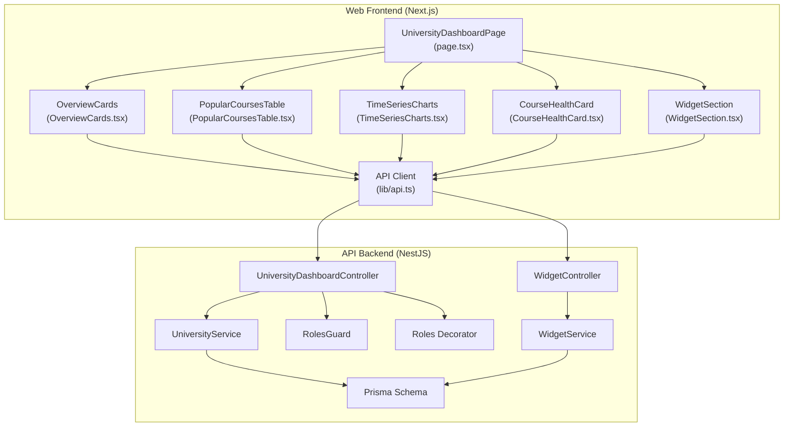
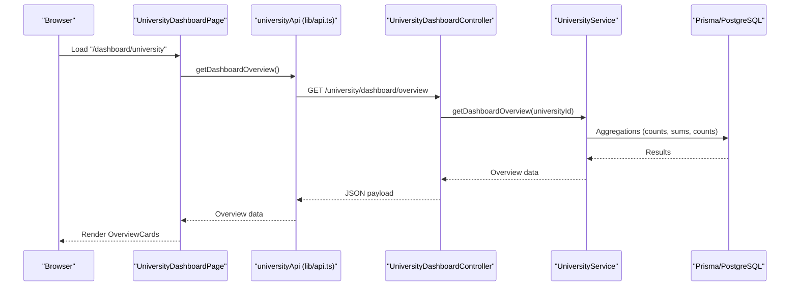
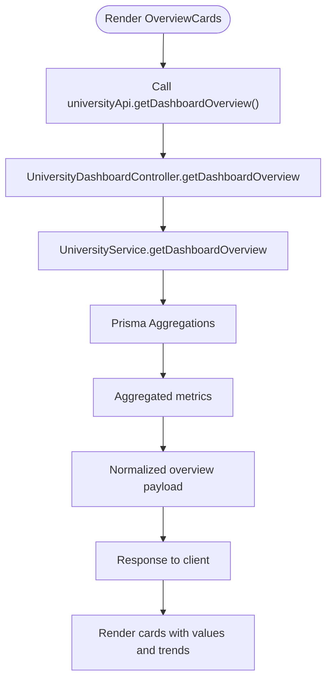
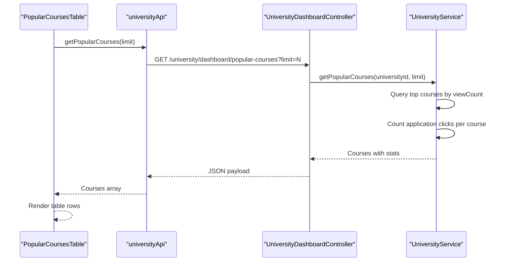
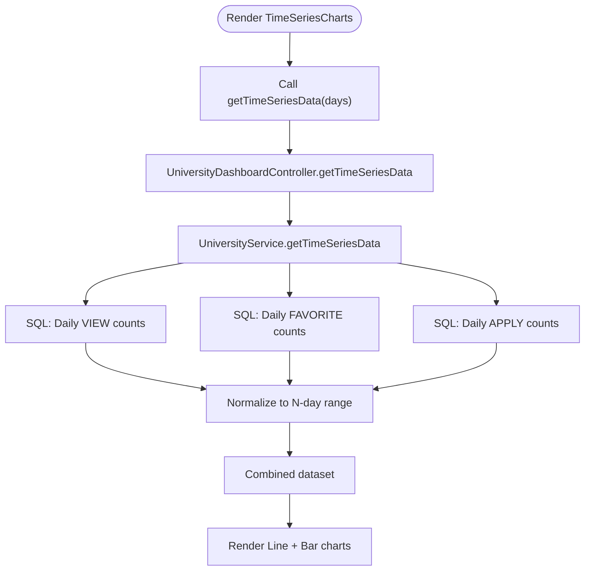
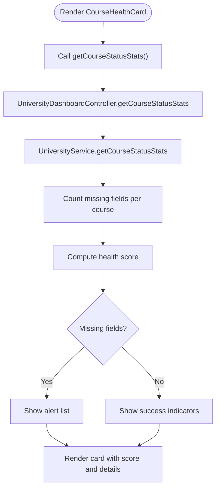
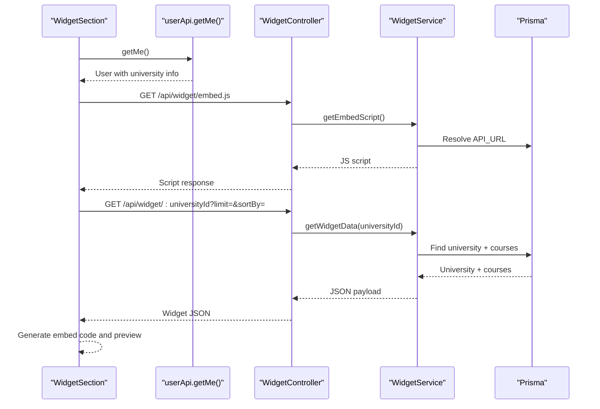
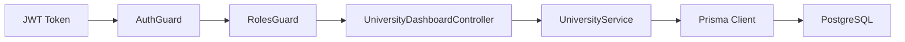

# University Dashboard

<cite>
**Referenced Files in This Document**
- [apps/web/app/dashboard/university/page.tsx](file://apps/web/app/dashboard/university/page.tsx)
- [apps/web/app/dashboard/university/components/OverviewCards.tsx](file://apps/web/app/dashboard/university/components/OverviewCards.tsx)
- [apps/web/app/dashboard/university/components/PopularCoursesTable.tsx](file://apps/web/app/dashboard/university/components/PopularCoursesTable.tsx)
- [apps/web/app/dashboard/university/components/TimeSeriesCharts.tsx](file://apps/web/app/dashboard/university/components/TimeSeriesCharts.tsx)
- [apps/web/app/dashboard/university/components/WidgetSection.tsx](file://apps/web/app/dashboard/university/components/WidgetSection.tsx)
- [apps/web/app/dashboard/university/components/CourseHealthCard.tsx](file://apps/web/app/dashboard/university/components/CourseHealthCard.tsx)
- [apps/web/lib/api.ts](file://apps/web/lib/api.ts)
- [apps/api/src/modules/university/university-dashboard.controller.ts](file://apps/api/src/modules/university/university-dashboard.controller.ts)
- [apps/api/src/modules/university/university.service.ts](file://apps/api/src/modules/university/university.service.ts)
- [apps/api/src/modules/widget/widget.controller.ts](file://apps/api/src/modules/widget/widget.controller.ts)
- [apps/api/src/modules/widget/widget.service.ts](file://apps/api/src/modules/widget/widget.service.ts)
- [apps/api/src/common/guards/roles.guard.ts](file://apps/api/src/common/guards/roles.guard.ts)
- [apps/api/src/common/decorators/roles.decorator.ts](file://apps/api/src/common/decorators/roles.decorator.ts)
- [apps/api/prisma/schema.prisma](file://apps/api/prisma/schema.prisma)
</cite>

## Table of Contents
1. [Introduction](#introduction)
2. [Project Structure](#project-structure)
3. [Core Components](#core-components)
4. [Architecture Overview](#architecture-overview)
5. [Detailed Component Analysis](#detailed-component-analysis)
6. [Dependency Analysis](#dependency-analysis)
7. [Performance Considerations](#performance-considerations)
8. [Troubleshooting Guide](#troubleshooting-guide)
9. [Conclusion](#conclusion)
10. [Appendices](#appendices)

## Introduction
This document describes the University Dashboard system, focusing on the analytics and administrative interface for universities offering summer courses. It covers:
- Overview cards for key metrics and performance indicators
- Popular courses table with ranking, analytics, and management controls
- Time series charts for trend visualization
- Widget section for custom branding, theme configuration, and embedding options
- Course health card showing enrollment trends, completion rates, and performance metrics
- University-specific analytics, course management workflows, and administrative interface patterns
- Data visualization best practices and university branding customization

## Project Structure
The dashboard is implemented as a Next.js app with a NestJS API backend. The frontend components are organized under the university dashboard route and consume typed API clients. The backend exposes protected endpoints secured by JWT and role-based guards, backed by a PostgreSQL schema with multitenancy per university.

**Diagram sources**
- [apps/web/app/dashboard/university/page.tsx](file://apps/web/app/dashboard/university/page.tsx#L27-L93)
- [apps/web/app/dashboard/university/components/OverviewCards.tsx](file://apps/web/app/dashboard/university/components/OverviewCards.tsx#L37-L131)
- [apps/web/app/dashboard/university/components/PopularCoursesTable.tsx](file://apps/web/app/dashboard/university/components/PopularCoursesTable.tsx#L42-L140)
- [apps/web/app/dashboard/university/components/TimeSeriesCharts.tsx](file://apps/web/app/dashboard/university/components/TimeSeriesCharts.tsx#L33-L115)
- [apps/web/app/dashboard/university/components/CourseHealthCard.tsx](file://apps/web/app/dashboard/university/components/CourseHealthCard.tsx#L29-L131)
- [apps/web/app/dashboard/university/components/WidgetSection.tsx](file://apps/web/app/dashboard/university/components/WidgetSection.tsx#L26-L218)
- [apps/web/lib/api.ts](file://apps/web/lib/api.ts#L100-L165)
- [apps/api/src/modules/university/university-dashboard.controller.ts](file://apps/api/src/modules/university/university-dashboard.controller.ts#L25-L80)
- [apps/api/src/modules/university/university.service.ts](file://apps/api/src/modules/university/university.service.ts#L16-L451)
- [apps/api/src/modules/widget/widget.controller.ts](file://apps/api/src/modules/widget/widget.controller.ts#L11-L29)
- [apps/api/src/modules/widget/widget.service.ts](file://apps/api/src/modules/widget/widget.service.ts#L8-L107)
- [apps/api/src/common/guards/roles.guard.ts](file://apps/api/src/common/guards/roles.guard.ts#L21-L54)
- [apps/api/src/common/decorators/roles.decorator.ts](file://apps/api/src/common/decorators/roles.decorator.ts#L15-L16)
- [apps/api/prisma/schema.prisma](file://apps/api/prisma/schema.prisma#L36-L122)

**Section sources**
- [apps/web/app/dashboard/university/page.tsx](file://apps/web/app/dashboard/university/page.tsx#L1-L94)
- [apps/web/lib/api.ts](file://apps/web/lib/api.ts#L1-L378)
- [apps/api/src/modules/university/university-dashboard.controller.ts](file://apps/api/src/modules/university/university-dashboard.controller.ts#L1-L81)
- [apps/api/src/modules/university/university.service.ts](file://apps/api/src/modules/university/university.service.ts#L1-L451)
- [apps/api/src/modules/widget/widget.controller.ts](file://apps/api/src/modules/widget/widget.controller.ts#L1-L30)
- [apps/api/src/modules/widget/widget.service.ts](file://apps/api/src/modules/widget/widget.service.ts#L1-L108)
- [apps/api/prisma/schema.prisma](file://apps/api/prisma/schema.prisma#L1-L183)

## Core Components
- Overview Cards: Displays total courses, new courses in the last month, total views, recent views, favorites, recent favorites, application clicks, and recent application clicks with percentage changes.
- Popular Courses Table: Lists top courses by view count with metadata (ECTS, price, modality), engagement metrics (favorites, application clicks), conversion rate, and navigation to course management.
- Time Series Charts: Renders daily views trend and a dual bar chart comparing favorites and applications over the selected period.
- Course Health Card: Shows a health score based on presence of application URLs and date information, counts for online/onsite offerings, and actionable alerts for missing data.
- Widget Section: Generates embed code and JSON endpoint for external site integration, with configurable limits, sorting, and themes.

**Section sources**
- [apps/web/app/dashboard/university/components/OverviewCards.tsx](file://apps/web/app/dashboard/university/components/OverviewCards.tsx#L23-L131)
- [apps/web/app/dashboard/university/components/PopularCoursesTable.tsx](file://apps/web/app/dashboard/university/components/PopularCoursesTable.tsx#L28-L140)
- [apps/web/app/dashboard/university/components/TimeSeriesCharts.tsx](file://apps/web/app/dashboard/university/components/TimeSeriesCharts.tsx#L27-L115)
- [apps/web/app/dashboard/university/components/CourseHealthCard.tsx](file://apps/web/app/dashboard/university/components/CourseHealthCard.tsx#L18-L131)
- [apps/web/app/dashboard/university/components/WidgetSection.tsx](file://apps/web/app/dashboard/university/components/WidgetSection.tsx#L27-L218)

## Architecture Overview
The dashboard follows a clear separation of concerns:
- Frontend: React components fetch analytics via a typed API client and render visualizations.
- Backend: Protected controllers expose endpoints for dashboard analytics and widget data retrieval.
- Security: JWT authentication with role-based access control ensures only authorized users can access university-specific data.
- Data Access: Prisma ORM queries aggregate and compute metrics efficiently.

**Diagram sources**
- [apps/web/app/dashboard/university/page.tsx](file://apps/web/app/dashboard/university/page.tsx#L27-L93)
- [apps/web/lib/api.ts](file://apps/web/lib/api.ts#L114-L128)
- [apps/api/src/modules/university/university-dashboard.controller.ts](file://apps/api/src/modules/university/university-dashboard.controller.ts#L31-L38)
- [apps/api/src/modules/university/university.service.ts](file://apps/api/src/modules/university/university.service.ts#L163-L278)
- [apps/api/prisma/schema.prisma](file://apps/api/prisma/schema.prisma#L87-L122)

## Detailed Component Analysis

### Overview Cards
Purpose:
- Provide a high-level summary of university course performance and activity.

Key behaviors:
- Fetches aggregated metrics for courses, views, favorites, and application clicks.
- Computes percentage changes between recent and previous periods.
- Renders icons, values, subtitles, and directional indicators.

Data flow:
- Frontend component triggers a fetch to the overview endpoint.
- Backend controller validates the requester’s university association and delegates to the service.
- Service performs aggregations and returns normalized data.

**Diagram sources**
- [apps/web/app/dashboard/university/components/OverviewCards.tsx](file://apps/web/app/dashboard/university/components/OverviewCards.tsx#L37-L47)
- [apps/web/lib/api.ts](file://apps/web/lib/api.ts#L114-L128)
- [apps/api/src/modules/university/university-dashboard.controller.ts](file://apps/api/src/modules/university/university-dashboard.controller.ts#L31-L38)
- [apps/api/src/modules/university/university.service.ts](file://apps/api/src/modules/university/university.service.ts#L163-L278)

**Section sources**
- [apps/web/app/dashboard/university/components/OverviewCards.tsx](file://apps/web/app/dashboard/university/components/OverviewCards.tsx#L23-L131)
- [apps/api/src/modules/university/university.service.ts](file://apps/api/src/modules/university/university.service.ts#L163-L278)

### Popular Courses Table
Purpose:
- Rank courses by popularity and display engagement metrics and management actions.

Key behaviors:
- Fetches top N courses by view count.
- Computes conversion rate per course.
- Provides quick navigation to course management.

**Diagram sources**
- [apps/web/app/dashboard/university/components/PopularCoursesTable.tsx](file://apps/web/app/dashboard/university/components/PopularCoursesTable.tsx#L42-L52)
- [apps/web/lib/api.ts](file://apps/web/lib/api.ts#L130-L145)
- [apps/api/src/modules/university/university-dashboard.controller.ts](file://apps/api/src/modules/university/university-dashboard.controller.ts#L40-L54)
- [apps/api/src/modules/university/university.service.ts](file://apps/api/src/modules/university/university.service.ts#L281-L330)

**Section sources**
- [apps/web/app/dashboard/university/components/PopularCoursesTable.tsx](file://apps/web/app/dashboard/university/components/PopularCoursesTable.tsx#L28-L140)
- [apps/api/src/modules/university/university.service.ts](file://apps/api/src/modules/university/university.service.ts#L281-L330)

### Time Series Charts
Purpose:
- Visualize daily trends for views, favorites, and applications over a configurable period.

Key behaviors:
- Fetches daily counts for the last N days.
- Normalizes data to align missing dates with zero counts.
- Renders a line chart for views and a grouped bar chart for favorites vs applications.

**Diagram sources**
- [apps/web/app/dashboard/university/components/TimeSeriesCharts.tsx](file://apps/web/app/dashboard/university/components/TimeSeriesCharts.tsx#L33-L43)
- [apps/web/lib/api.ts](file://apps/web/lib/api.ts#L147-L152)
- [apps/api/src/modules/university/university-dashboard.controller.ts](file://apps/api/src/modules/university/university-dashboard.controller.ts#L56-L70)
- [apps/api/src/modules/university/university.service.ts](file://apps/api/src/modules/university/university.service.ts#L333-L397)

**Section sources**
- [apps/web/app/dashboard/university/components/TimeSeriesCharts.tsx](file://apps/web/app/dashboard/university/components/TimeSeriesCharts.tsx#L27-L115)
- [apps/api/src/modules/university/university.service.ts](file://apps/api/src/modules/university/university.service.ts#L333-L397)

### Course Health Card
Purpose:
- Assess completeness of course listings and highlight missing information impacting conversions.

Key behaviors:
- Computes counts for application URLs, date information, online/onsite offerings.
- Calculates a health score as a percentage of completeness.
- Emits warnings for missing application URLs or dates.

**Diagram sources**
- [apps/web/app/dashboard/university/components/CourseHealthCard.tsx](file://apps/web/app/dashboard/university/components/CourseHealthCard.tsx#L29-L39)
- [apps/web/lib/api.ts](file://apps/web/lib/api.ts#L154-L164)
- [apps/api/src/modules/university/university-dashboard.controller.ts](file://apps/api/src/modules/university/university-dashboard.controller.ts#L72-L79)
- [apps/api/src/modules/university/university.service.ts](file://apps/api/src/modules/university/university.service.ts#L399-L430)

**Section sources**
- [apps/web/app/dashboard/university/components/CourseHealthCard.tsx](file://apps/web/app/dashboard/university/components/CourseHealthCard.tsx#L18-L131)
- [apps/api/src/modules/university/university.service.ts](file://apps/api/src/modules/university/university.service.ts#L399-L430)

### Widget Section
Purpose:
- Enable universities to embed course listings on external websites with customizable appearance and behavior.

Key behaviors:
- Generates an embed script and a JSON endpoint for a given university identifier.
- Allows configuration of limit, sort order, and theme.
- Produces a ready-to-use embed code snippet.

**Diagram sources**
- [apps/web/app/dashboard/university/components/WidgetSection.tsx](file://apps/web/app/dashboard/university/components/WidgetSection.tsx#L26-L50)
- [apps/web/lib/api.ts](file://apps/web/lib/api.ts#L169-L187)
- [apps/api/src/modules/widget/widget.controller.ts](file://apps/api/src/modules/widget/widget.controller.ts#L15-L28)
- [apps/api/src/modules/widget/widget.service.ts](file://apps/api/src/modules/widget/widget.service.ts#L18-L67)
- [apps/api/prisma/schema.prisma](file://apps/api/prisma/schema.prisma#L36-L58)

**Section sources**
- [apps/web/app/dashboard/university/components/WidgetSection.tsx](file://apps/web/app/dashboard/university/components/WidgetSection.tsx#L27-L218)
- [apps/api/src/modules/widget/widget.controller.ts](file://apps/api/src/modules/widget/widget.controller.ts#L11-L29)
- [apps/api/src/modules/widget/widget.service.ts](file://apps/api/src/modules/widget/widget.service.ts#L1-L108)

## Dependency Analysis
- Authentication and Authorization:
  - Controllers apply JWT guard followed by roles guard to enforce UNIVERSITY role.
  - The roles decorator defines permitted roles for each endpoint.
- Multitenancy:
  - Services require a valid universityId from the JWT payload to scope queries.
  - Prisma schema enforces tenant isolation via foreign keys and indexes.
- Data Access Patterns:
  - Aggregation queries compute counts and ratios efficiently.
  - Raw SQL is used for time series to ensure aligned date ranges.

**Diagram sources**
- [apps/api/src/common/guards/roles.guard.ts](file://apps/api/src/common/guards/roles.guard.ts#L21-L54)
- [apps/api/src/common/decorators/roles.decorator.ts](file://apps/api/src/common/decorators/roles.decorator.ts#L15-L16)
- [apps/api/src/modules/university/university-dashboard.controller.ts](file://apps/api/src/modules/university/university-dashboard.controller.ts#L25-L28)
- [apps/api/src/modules/university/university.service.ts](file://apps/api/src/modules/university/university.service.ts#L16-L21)
- [apps/api/prisma/schema.prisma](file://apps/api/prisma/schema.prisma#L87-L122)

**Section sources**
- [apps/api/src/common/guards/roles.guard.ts](file://apps/api/src/common/guards/roles.guard.ts#L1-L56)
- [apps/api/src/common/decorators/roles.decorator.ts](file://apps/api/src/common/decorators/roles.decorator.ts#L1-L16)
- [apps/api/src/modules/university/university-dashboard.controller.ts](file://apps/api/src/modules/university/university-dashboard.controller.ts#L1-L81)
- [apps/api/src/modules/university/university.service.ts](file://apps/api/src/modules/university/university.service.ts#L1-L451)
- [apps/api/prisma/schema.prisma](file://apps/api/prisma/schema.prisma#L1-L183)

## Performance Considerations
- Efficient aggregations: Use of Prisma aggregation functions reduces round trips and minimizes payload sizes.
- Index utilization: Strategic indexes on frequently queried fields (e.g., universityId, name, code) improve query performance.
- Time series normalization: Preparing a dense date range avoids rendering gaps and simplifies client-side logic.
- Widget caching: Embed script served with cache headers reduces repeated loads.
- Pagination and limits: Popular courses and admin listings support pagination to avoid large payloads.

[No sources needed since this section provides general guidance]

## Troubleshooting Guide
Common issues and resolutions:
- Unauthorized access:
  - Symptom: Redirect to login or forbidden error.
  - Cause: Missing or invalid JWT token, or insufficient role.
  - Resolution: Ensure the user has UNIVERSITY role and a valid session.
- No university association:
  - Symptom: “University not found” errors on analytics endpoints.
  - Cause: JWT payload lacks universityId.
  - Resolution: Verify user account is linked to a university.
- Empty or partial time series:
  - Symptom: Missing dates in charts.
  - Cause: No events recorded for certain days.
  - Resolution: The service normalizes missing dates to zero; confirm event logging.
- Widget not rendering:
  - Symptom: Blank or error message in embedded widget.
  - Cause: Missing university slug or unverified status.
  - Resolution: Confirm university slug and verification status; ensure embed attributes are present.

**Section sources**
- [apps/api/src/modules/university/university-dashboard.controller.ts](file://apps/api/src/modules/university/university-dashboard.controller.ts#L34-L36)
- [apps/api/src/common/guards/roles.guard.ts](file://apps/api/src/common/guards/roles.guard.ts#L40-L50)
- [apps/api/src/modules/university/university.service.ts](file://apps/api/src/modules/university/university.service.ts#L333-L397)
- [apps/api/src/modules/widget/widget.service.ts](file://apps/api/src/modules/widget/widget.service.ts#L48-L54)

## Conclusion
The University Dashboard integrates frontend analytics with secure, role-protected backend endpoints and robust data access patterns. It provides actionable insights through overview metrics, ranked course analytics, trend visualization, and a flexible widget system for external embedding. The multitenant design and indexing strategy ensure scalability and data isolation.

[No sources needed since this section summarizes without analyzing specific files]

## Appendices

### API Endpoints Overview
- University Analytics
  - GET /university/dashboard/overview
  - GET /university/dashboard/popular-courses?limit=N
  - GET /university/dashboard/time-series?days=N
  - GET /university/dashboard/course-stats
- Widget
  - GET /widget/embed.js
  - GET /widget/:universityId

**Section sources**
- [apps/web/lib/api.ts](file://apps/web/lib/api.ts#L114-L164)
- [apps/api/src/modules/university/university-dashboard.controller.ts](file://apps/api/src/modules/university/university-dashboard.controller.ts#L31-L79)
- [apps/api/src/modules/widget/widget.controller.ts](file://apps/api/src/modules/widget/widget.controller.ts#L15-L28)

### Data Model Highlights
- University: tenant with optional widget configuration stored as JSON.
- Course: belongs to a university, tracks view counts and enrollment-related dates.
- UserFavorite and UserInteraction: capture engagement for analytics.

**Section sources**
- [apps/api/prisma/schema.prisma](file://apps/api/prisma/schema.prisma#L36-L122)