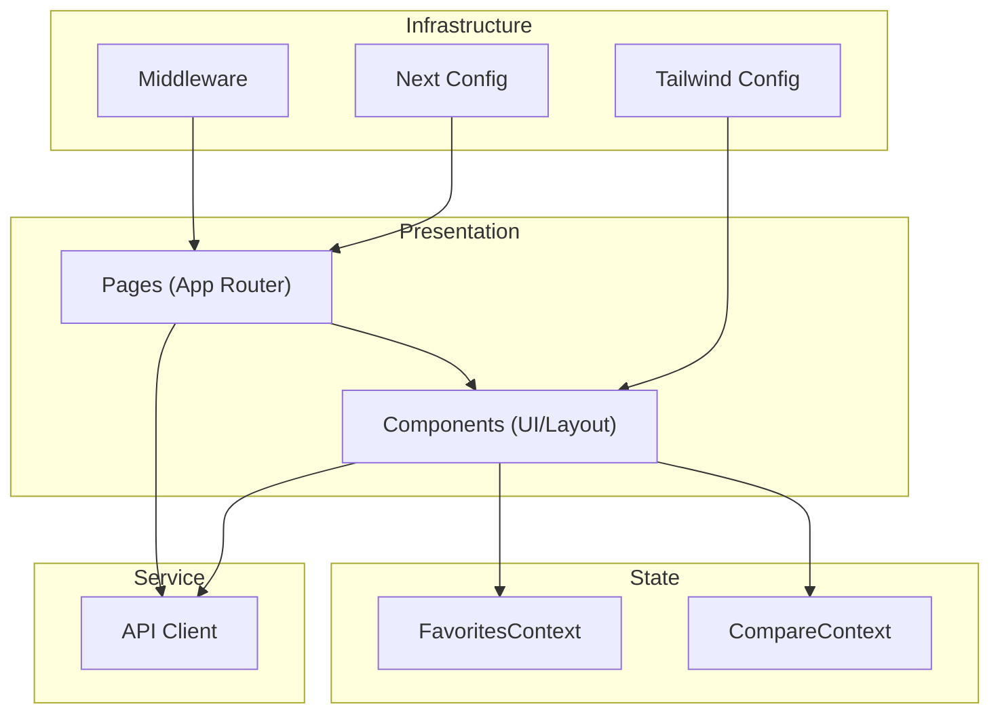
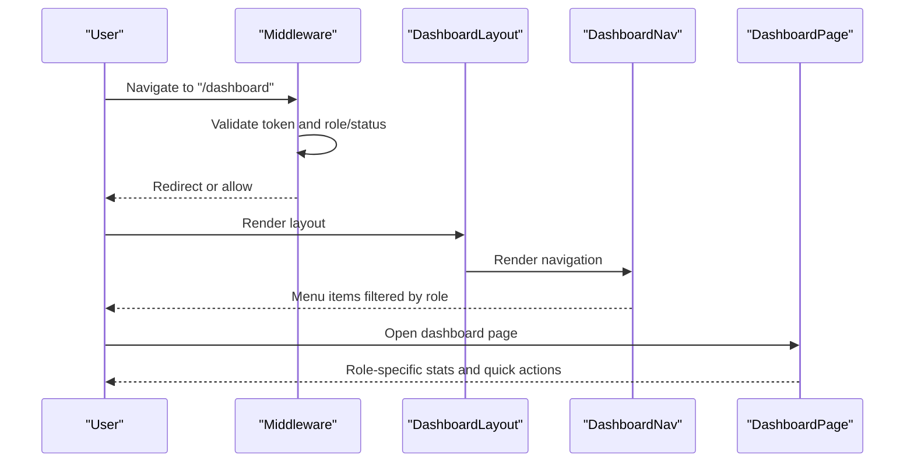
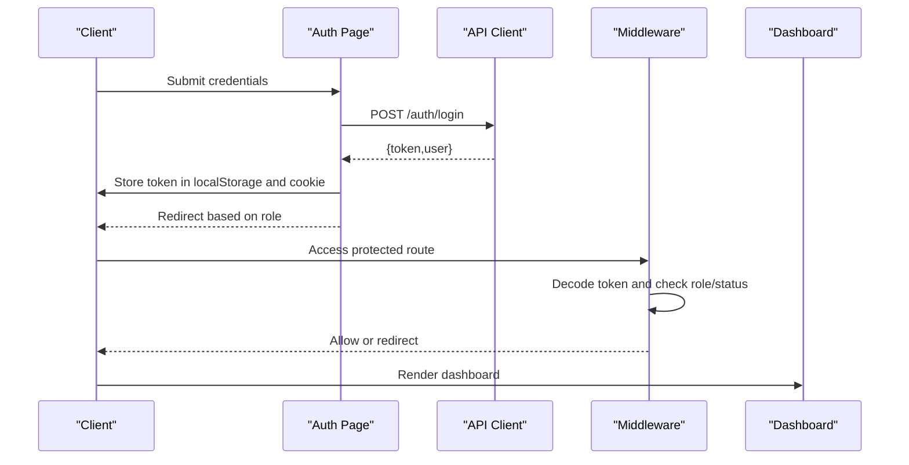
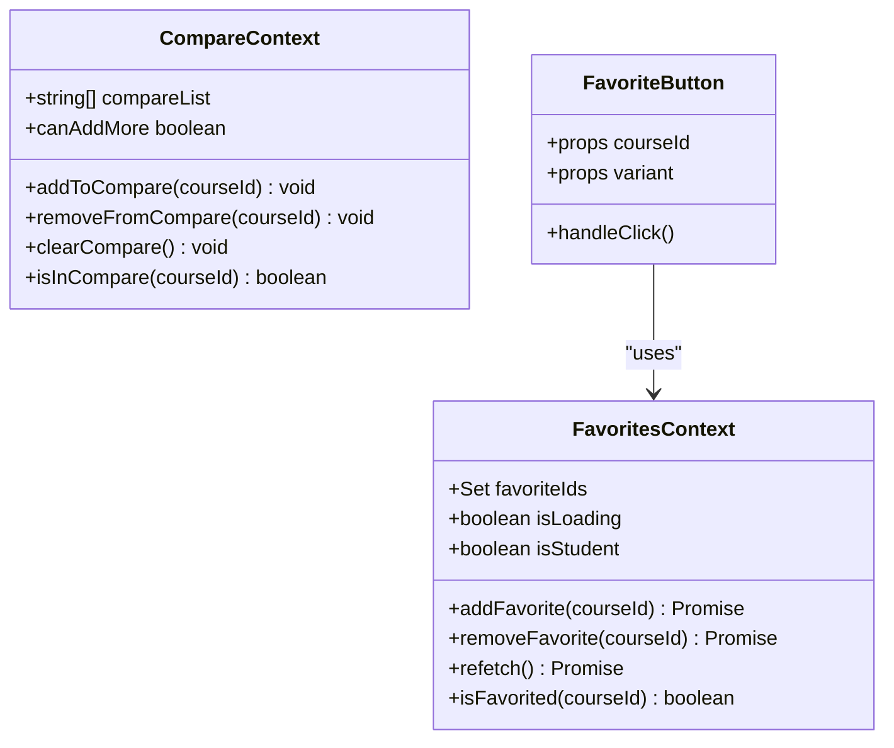
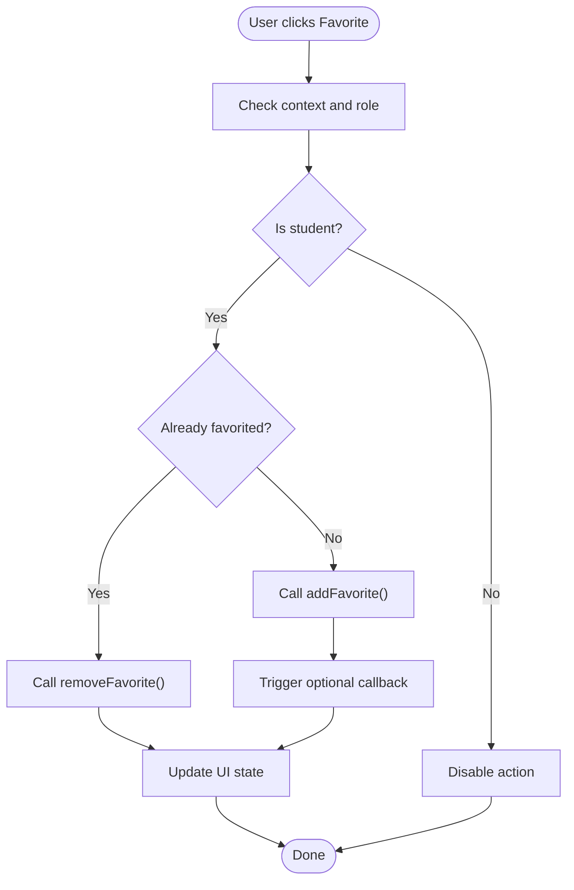
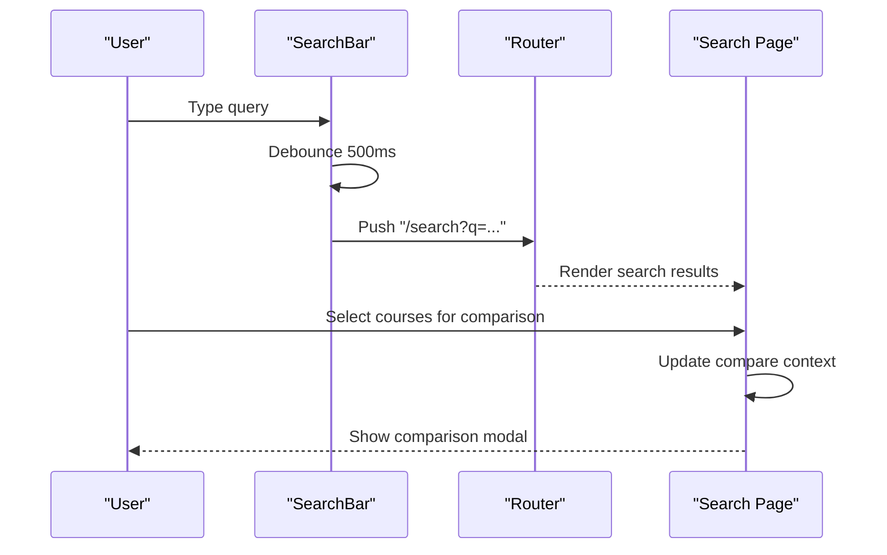
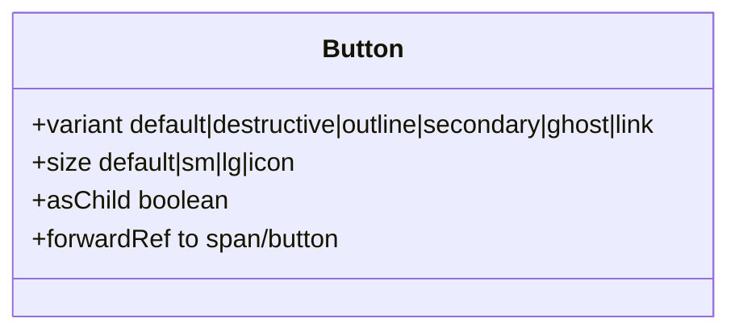
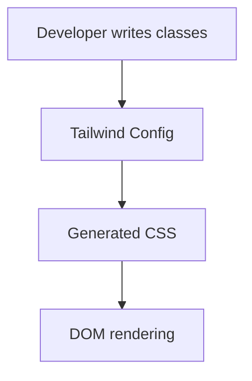
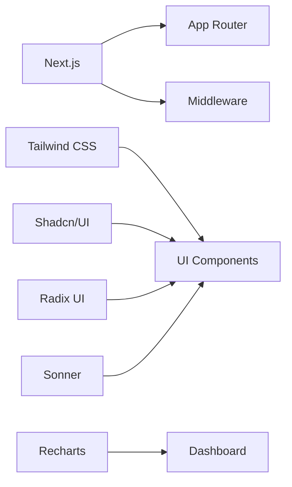

# Frontend Application Documentation

<cite>
**Referenced Files in This Document**
- [package.json](file://apps/web/package.json)
- [next.config.js](file://apps/web/next.config.js)
- [tailwind.config.ts](file://apps/web/tailwind.config.ts)
- [middleware.ts](file://apps/web/middleware.ts)
- [layout.tsx](file://apps/web/app/layout.tsx)
- [utils.ts](file://apps/web/lib/utils.ts)
- [dashboard/layout.tsx](file://apps/web/app/dashboard/layout.tsx)
- [dashboard/page.tsx](file://apps/web/app/dashboard/page.tsx)
- [favorites-context.tsx](file://apps/web/contexts/favorites-context.tsx)
- [compare-context.tsx](file://apps/web/contexts/compare-context.tsx)
- [dashboard-nav.tsx](file://apps/web/components/layout/dashboard-nav.tsx)
- [button.tsx](file://apps/web/components/ui/button.tsx)
- [login/page.tsx](file://apps/web/app/(auth)/login/page.tsx)
- [register/page.tsx](file://apps/web/app/(auth)/register/page.tsx)
- [api.ts](file://apps/web/lib/api.ts)
- [FavoriteButton.tsx](file://apps/web/components/course/FavoriteButton.tsx)
- [search-bar.tsx](file://apps/web/components/layout/search-bar.tsx)
</cite>

## Table of Contents
1. [Introduction](#introduction)
2. [Project Structure](#project-structure)
3. [Core Components](#core-components)
4. [Architecture Overview](#architecture-overview)
5. [Detailed Component Analysis](#detailed-component-analysis)
6. [Dependency Analysis](#dependency-analysis)
7. [Performance Considerations](#performance-considerations)
8. [Troubleshooting Guide](#troubleshooting-guide)
9. [Conclusion](#conclusion)

## Introduction
This document describes the Next.js 14 frontend application for the "Yaz Okulu Var mı?" platform. It covers the App Router structure, page organization, layout system, middleware-based route protection, dashboard system for different user roles (student, university, admin), shared UI component library, state management via React contexts, authentication flow, course interaction components, search interface, comparison features, and the styling system using Tailwind CSS and Shadcn/UI components.

## Project Structure
The frontend is organized under the Next.js App Router with a strict file-system-based routing convention. Key areas:
- Root layout and providers: global providers for favorites and comparison state, toast notifications, and authentication overlay
- Public pages: landing, about, FAQ, course detail, search, and university listing
- Authentication routes: login and register pages
- Dashboard: role-specific dashboards with navigation and content areas
- Shared components: reusable UI elements and layout helpers
- Contexts: centralized state for favorites and comparison lists
- API client: unified HTTP client with token injection and error handling
- Styling: Tailwind CSS with theme customization and Shadcn/UI primitives

```mermaid
graph TB
subgraph "Root"
L["app/layout.tsx"]
M["middleware.ts"]
N["next.config.js"]
T["tailwind.config.ts"]
end
subgraph "Public Pages"
P1["app/page.tsx"]
P2["app/(public)/about/page.tsx"]
P3["app/(public)/faq/page.tsx"]
P4["app/(public)/courses[Id]/page.tsx"]
P5["app/(public)/search/page.tsx"]
P6["app/(public)/universities-for/page.tsx"]
end
subgraph "Auth"
A1["app/(auth)/login/page.tsx"]
A2["app/(auth)/register/page.tsx"]
end
subgraph "Dashboard"
D0["app/dashboard/layout.tsx"]
D1["app/dashboard/page.tsx"]
D2["app/dashboard/courses/page.tsx"]
D3["app/dashboard/universities/page.tsx"]
D4["app/dashboard/university/page.tsx"]
D5["app/dashboard/pending/page.tsx"]
D6["app/dashboard/settings/page.tsx"]
DN["components/layout/dashboard-nav.tsx"]
end
subgraph "Shared Components"
C1["components/ui/button.tsx"]
C2["components/layout/search-bar.tsx"]
C3["components/course/FavoriteButton.tsx"]
C4["components/compare/CompareFloatingButton.tsx"]
C5["components/compare/CompareModal.tsx"]
end
subgraph "State"
F["contexts/favorites-context.tsx"]
X["contexts/compare-context.tsx"]
end
subgraph "API"
API["lib/api.ts"]
U["lib/utils.ts"]
end
L --> F
L --> X
D0 --> DN
D1 --> API
A1 --> API
A2 --> API
C3 --> F
C2 --> API
API --> U
M --> A1
M --> A2
M --> D0
M --> D1
M --> D5
```

**Diagram sources**
- [layout.tsx](file://apps/web/app/layout.tsx#L1-L44)
- [middleware.ts](file://apps/web/middleware.ts#L1-L107)
- [next.config.js](file://apps/web/next.config.js#L1-L26)
- [tailwind.config.ts](file://apps/web/tailwind.config.ts#L1-L60)
- [dashboard/layout.tsx](file://apps/web/app/dashboard/layout.tsx#L1-L71)
- [dashboard/page.tsx](file://apps/web/app/dashboard/page.tsx#L1-L232)
- [dashboard-nav.tsx](file://apps/web/components/layout/dashboard-nav.tsx#L1-L118)
- [button.tsx](file://apps/web/components/ui/button.tsx#L1-L55)
- [search-bar.tsx](file://apps/web/components/layout/search-bar.tsx#L1-L94)
- [FavoriteButton.tsx](file://apps/web/components/course/FavoriteButton.tsx#L1-L92)
- [favorites-context.tsx](file://apps/web/contexts/favorites-context.tsx#L1-L146)
- [compare-context.tsx](file://apps/web/contexts/compare-context.tsx#L1-L111)
- [api.ts](file://apps/web/lib/api.ts#L1-L378)
- [utils.ts](file://apps/web/lib/utils.ts#L1-L11)
- [login/page.tsx](file://apps/web/app/(auth)/login/page.tsx#L1-L135)
- [register/page.tsx](file://apps/web/app/(auth)/register/page.tsx#L1-L239)

**Section sources**
- [package.json](file://apps/web/package.json#L1-L38)
- [next.config.js](file://apps/web/next.config.js#L1-L26)
- [tailwind.config.ts](file://apps/web/tailwind.config.ts#L1-L60)

## Core Components
- Root layout and providers: initializes fonts, global CSS, toast notifications, authentication overlay, and wraps children with favorites and comparison providers
- Dashboard layout: responsive sidebar navigation with mobile overlay, scrollable content area, and role-aware menu
- Shared UI components: Shadcn/UI-styled button with variants and sizes
- State contexts: favorites and comparison lists with persistence and synchronization
- API client: centralized HTTP client with bearer token injection and unified error handling
- Authentication pages: login and registration forms with role-aware redirects and validation
- Search interface: live debounced search bar with hero and compact variants
- Course interaction: favorite button integrated with favorites context

**Section sources**
- [layout.tsx](file://apps/web/app/layout.tsx#L1-L44)
- [dashboard/layout.tsx](file://apps/web/app/dashboard/layout.tsx#L1-L71)
- [button.tsx](file://apps/web/components/ui/button.tsx#L1-L55)
- [favorites-context.tsx](file://apps/web/contexts/favorites-context.tsx#L1-L146)
- [compare-context.tsx](file://apps/web/contexts/compare-context.tsx#L1-L111)
- [api.ts](file://apps/web/lib/api.ts#L1-L378)
- [login/page.tsx](file://apps/web/app/(auth)/login/page.tsx#L1-L135)
- [register/page.tsx](file://apps/web/app/(auth)/register/page.tsx#L1-L239)
- [search-bar.tsx](file://apps/web/components/layout/search-bar.tsx#L1-L94)
- [FavoriteButton.tsx](file://apps/web/components/course/FavoriteButton.tsx#L1-L92)

## Architecture Overview
The application follows a layered architecture:
- Presentation layer: Next.js App Router pages and shared components
- State layer: React contexts for favorites and comparison
- Service layer: API client module encapsulating HTTP requests
- Infrastructure layer: middleware for route protection and configuration



**Diagram sources**
- [layout.tsx](file://apps/web/app/layout.tsx#L1-L44)
- [middleware.ts](file://apps/web/middleware.ts#L1-L107)
- [next.config.js](file://apps/web/next.config.js#L1-L26)
- [tailwind.config.ts](file://apps/web/tailwind.config.ts#L1-L60)
- [favorites-context.tsx](file://apps/web/contexts/favorites-context.tsx#L1-L146)
- [compare-context.tsx](file://apps/web/contexts/compare-context.tsx#L1-L111)
- [api.ts](file://apps/web/lib/api.ts#L1-L378)

## Detailed Component Analysis

### Dashboard System and Navigation
The dashboard system provides role-specific experiences:
- Admin: global statistics, university management, pending requests
- University: overview cards, analytics dashboard, course management
- Student: personal analytics, recommendations, search history, favorites

Navigation is handled by a responsive sidebar that adapts to desktop and mobile, with role-aware visibility of menu items and logout functionality.



**Diagram sources**
- [middleware.ts](file://apps/web/middleware.ts#L25-L102)
- [dashboard/layout.tsx](file://apps/web/app/dashboard/layout.tsx#L1-L71)
- [dashboard-nav.tsx](file://apps/web/components/layout/dashboard-nav.tsx#L1-L118)
- [dashboard/page.tsx](file://apps/web/app/dashboard/page.tsx#L1-L232)

**Section sources**
- [dashboard/layout.tsx](file://apps/web/app/dashboard/layout.tsx#L1-L71)
- [dashboard-nav.tsx](file://apps/web/components/layout/dashboard-nav.tsx#L1-L118)
- [dashboard/page.tsx](file://apps/web/app/dashboard/page.tsx#L1-L232)
- [middleware.ts](file://apps/web/middleware.ts#L25-L102)

### Authentication Flow and Route Protection
Authentication uses JWT tokens stored in localStorage and cookies. The middleware enforces:
- Redirect unauthenticated users to login
- Role-based redirection (student to student dashboard, others to general dashboard)
- Status-based restrictions (PENDING and REJECTED statuses)
- Prevent access to login/register for authenticated users



**Diagram sources**
- [login/page.tsx](file://apps/web/app/(auth)/login/page.tsx#L13-L45)
- [api.ts](file://apps/web/lib/api.ts#L54-L58)
- [middleware.ts](file://apps/web/middleware.ts#L25-L102)
- [dashboard/page.tsx](file://apps/web/app/dashboard/page.tsx#L31-L77)

**Section sources**
- [login/page.tsx](file://apps/web/app/(auth)/login/page.tsx#L1-L135)
- [register/page.tsx](file://apps/web/app/(auth)/register/page.tsx#L1-L239)
- [api.ts](file://apps/web/lib/api.ts#L1-L378)
- [middleware.ts](file://apps/web/middleware.ts#L1-L107)

### State Management with React Contexts
Two contexts manage cross-page state:
- FavoritesContext: maintains a synchronized set of favorite course IDs, integrates with student API, and exposes add/remove/refetch helpers
- CompareContext: manages a persistent list of up to four course IDs in local storage, with add/remove/clear helpers



**Diagram sources**
- [favorites-context.tsx](file://apps/web/contexts/favorites-context.tsx#L17-L25)
- [compare-context.tsx](file://apps/web/contexts/compare-context.tsx#L16-L23)
- [FavoriteButton.tsx](file://apps/web/components/course/FavoriteButton.tsx#L17-L57)

**Section sources**
- [favorites-context.tsx](file://apps/web/contexts/favorites-context.tsx#L1-L146)
- [compare-context.tsx](file://apps/web/contexts/compare-context.tsx#L1-L111)
- [FavoriteButton.tsx](file://apps/web/components/course/FavoriteButton.tsx#L1-L92)

### Course Interaction Components
- FavoriteButton: toggles favorites via FavoritesContext, handles loading states, and respects student role
- Course card and detail pages integrate with FavoriteButton and other interaction utilities
- TrackCourseView and other interaction components record user interactions through the student API



**Diagram sources**
- [FavoriteButton.tsx](file://apps/web/components/course/FavoriteButton.tsx#L39-L57)
- [favorites-context.tsx](file://apps/web/contexts/favorites-context.tsx#L71-L99)

**Section sources**
- [FavoriteButton.tsx](file://apps/web/components/course/FavoriteButton.tsx#L1-L92)
- [favorites-context.tsx](file://apps/web/contexts/favorites-context.tsx#L1-L146)

### Search Interface and Comparison Features
- SearchBar: supports hero and compact variants, live debounced search routing, and focus state management
- Search results page: paginated results with filters and metadata
- Compare features: floating button and modal to manage up to four courses for comparison, persisted in local storage



**Diagram sources**
- [search-bar.tsx](file://apps/web/components/layout/search-bar.tsx#L32-L46)
- [compare-context.tsx](file://apps/web/contexts/compare-context.tsx#L58-L82)

**Section sources**
- [search-bar.tsx](file://apps/web/components/layout/search-bar.tsx#L1-L94)
- [compare-context.tsx](file://apps/web/contexts/compare-context.tsx#L1-L111)

### Shared UI Component Library
Shadcn/UI-inspired components provide consistent styling and behavior:
- Button: variant and size variants with consistent styling and forwardRef support
- Additional components (card, input, label, dialog, etc.) follow similar patterns



**Diagram sources**
- [button.tsx](file://apps/web/components/ui/button.tsx#L8-L32)

**Section sources**
- [button.tsx](file://apps/web/components/ui/button.tsx#L1-L55)

### Styling System: Tailwind CSS and Theme
- Tailwind configuration extends colors, radii, and typography with CSS variables
- Dark mode support via class strategy
- Content paths include app, components, and lib directories
- Utility helper merges Tailwind classes safely



**Diagram sources**
- [tailwind.config.ts](file://apps/web/tailwind.config.ts#L3-L57)
- [utils.ts](file://apps/web/lib/utils.ts#L8-L10)

**Section sources**
- [tailwind.config.ts](file://apps/web/tailwind.config.ts#L1-L60)
- [utils.ts](file://apps/web/lib/utils.ts#L1-L11)

## Dependency Analysis
Key dependencies and integrations:
- Next.js 14 App Router for file-system routing and middleware
- Tailwind CSS for utility-first styling with custom theme
- Shadcn/UI-style components for consistent UI primitives
- Radix UI primitives for accessible components
- Recharts for analytics visualizations in university dashboard
- Sonner for toast notifications



**Diagram sources**
- [package.json](file://apps/web/package.json#L12-L26)
- [tailwind.config.ts](file://apps/web/tailwind.config.ts#L1-L60)
- [button.tsx](file://apps/web/components/ui/button.tsx#L1-L55)
- [dashboard/page.tsx](file://apps/web/app/dashboard/page.tsx#L1-L232)

**Section sources**
- [package.json](file://apps/web/package.json#L1-L38)
- [next.config.js](file://apps/web/next.config.js#L1-L26)

## Performance Considerations
- Client-side hydration: ensure components using window/localStorage are guarded against SSR mismatches
- Debounced search: reduces unnecessary network requests during typing
- Context memoization: use callbacks and useMemo to prevent unnecessary re-renders
- Lazy loading: defer heavy charts until visible
- Image optimization: configure remote patterns in next.config.js for CDN-like behavior

## Troubleshooting Guide
Common issues and resolutions:
- Authentication loops: verify token presence and role/status checks in middleware
- Missing favorites: confirm student role and proper provider wrapping
- Search not updating: ensure query sync and debounce timing
- Toast not appearing: check provider placement in root layout
- Styling inconsistencies: validate Tailwind content paths and CSS variable usage

**Section sources**
- [middleware.ts](file://apps/web/middleware.ts#L25-L102)
- [favorites-context.tsx](file://apps/web/contexts/favorites-context.tsx#L34-L65)
- [search-bar.tsx](file://apps/web/components/layout/search-bar.tsx#L23-L41)
- [layout.tsx](file://apps/web/app/layout.tsx#L32-L39)
- [tailwind.config.ts](file://apps/web/tailwind.config.ts#L5-L9)

## Conclusion
The frontend application leverages Next.js 14’s App Router to deliver a structured, role-aware experience with robust state management, a cohesive UI library, and secure route protection. The modular design enables easy extension for additional features while maintaining consistent UX patterns across student, university, and admin dashboards.