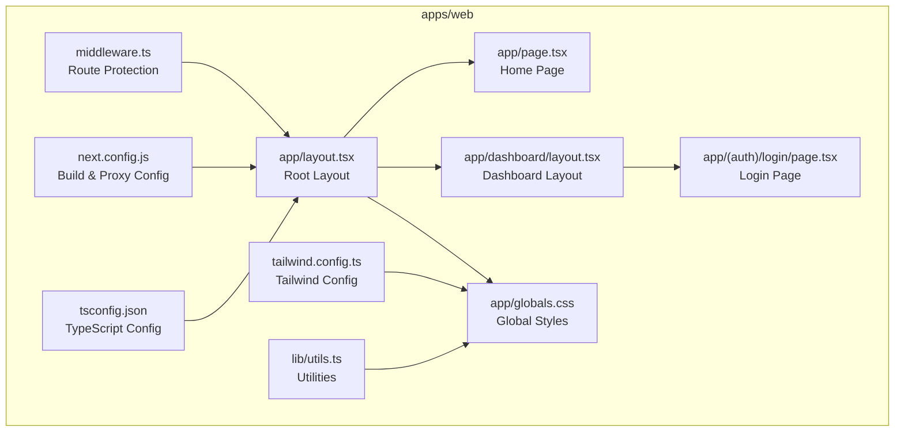
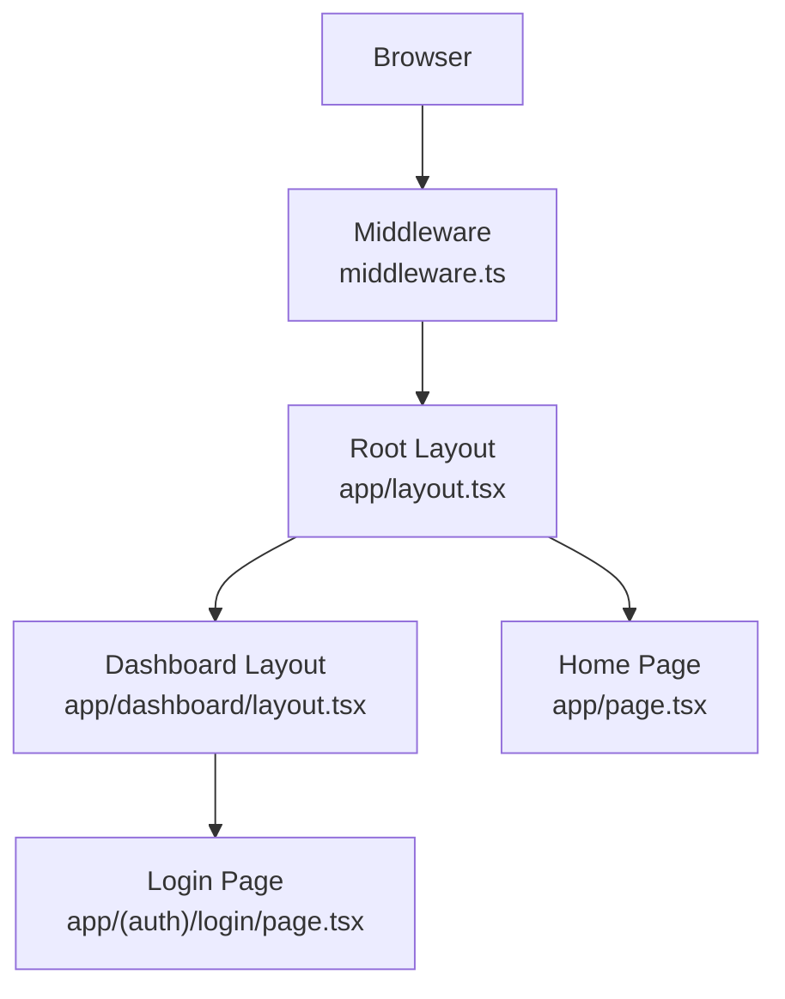
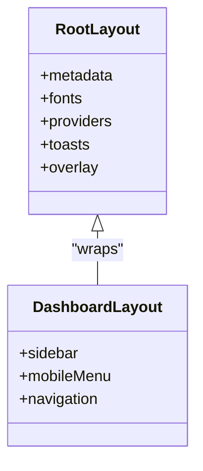
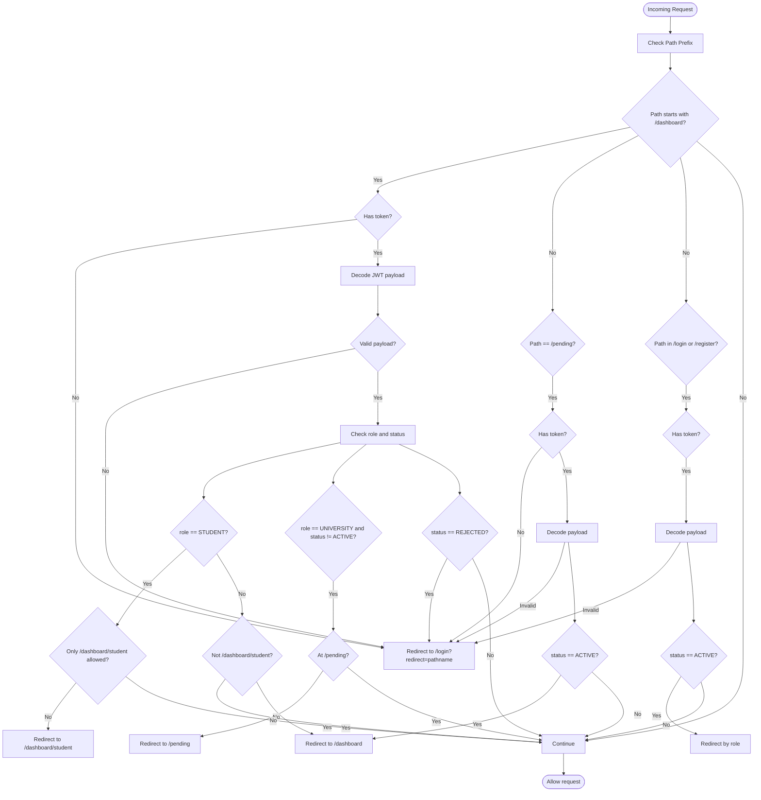
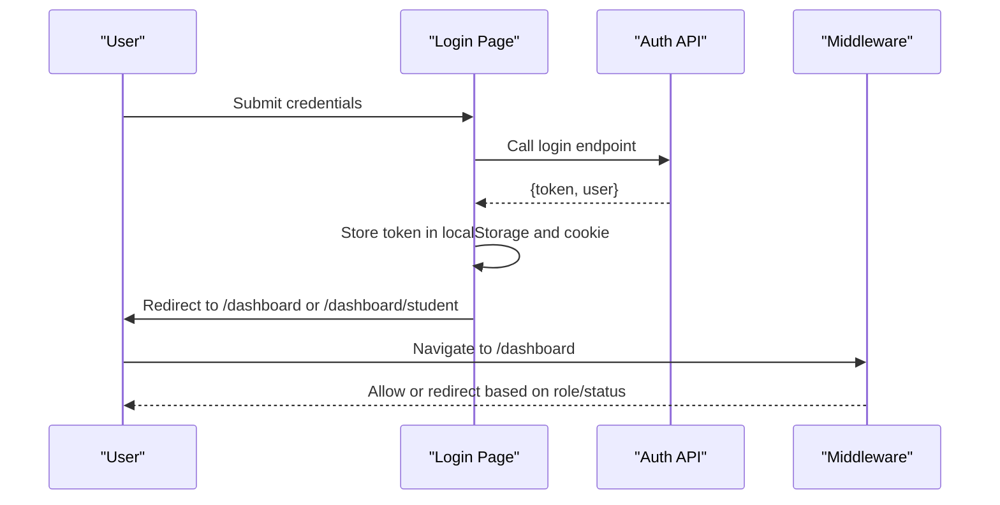
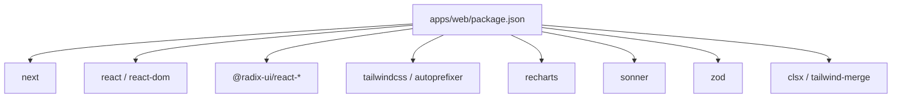

# Next.js Application Structure

<cite>
**Referenced Files in This Document**
- [package.json](file://apps/web/package.json)
- [next.config.js](file://apps/web/next.config.js)
- [middleware.ts](file://apps/web/middleware.ts)
- [layout.tsx](file://apps/web/app/layout.tsx)
- [page.tsx](file://apps/web/app/page.tsx)
- [tailwind.config.ts](file://apps/web/tailwind.config.ts)
- [tsconfig.json](file://apps/web/tsconfig.json)
- [utils.ts](file://apps/web/lib/utils.ts)
- [dashboard/layout.tsx](file://apps/web/app/dashboard/layout.tsx)
- [auth/login/page.tsx](file://apps/web/app/(auth)/login/page.tsx)
- [globals.css](file://apps/web/app/globals.css)
- [next-env.d.ts](file://apps/web/next-env.d.ts)
- [postcss.config.js](file://apps/web/postcss.config.js)
</cite>

## Table of Contents
1. [Introduction](#introduction)
2. [Project Structure](#project-structure)
3. [Core Components](#core-components)
4. [Architecture Overview](#architecture-overview)
5. [Detailed Component Analysis](#detailed-component-analysis)
6. [Dependency Analysis](#dependency-analysis)
7. [Performance Considerations](#performance-considerations)
8. [Troubleshooting Guide](#troubleshooting-guide)
9. [Conclusion](#conclusion)

## Introduction
This document explains the Next.js 14 application structure for the frontend web application. It covers the App Router configuration, file-based routing, page component organization, layout hierarchy, middleware-based route protection, navigation patterns, build configuration, TypeScript setup, development workflow, folder conventions, dynamic routing, SSR/SSG behavior, authentication middleware, role-based access control, redirects, global styles, metadata configuration, and performance optimization strategies.

## Project Structure
The frontend application resides under apps/web and follows Next.js 14 conventions:
- App Router-based file system routing under app/
- Route groups for logical separation of routes such as (auth) and (public)
- Shared layouts under app/*/layout.tsx
- Page components under app/**/page.tsx
- Global styles under app/globals.css
- Middleware for route protection under middleware.ts
- Build-time configuration under next.config.js
- Tailwind CSS configuration under tailwind.config.ts
- TypeScript configuration under tsconfig.json
- Utility helpers under lib/

**Diagram sources**
- [layout.tsx](file://apps/web/app/layout.tsx#L1-L44)
- [page.tsx](file://apps/web/app/page.tsx#L1-L166)
- [dashboard/layout.tsx](file://apps/web/app/dashboard/layout.tsx#L1-L71)
- [auth/login/page.tsx](file://apps/web/app/(auth)/login/page.tsx#L1-L135)
- [globals.css](file://apps/web/app/globals.css#L1-L124)
- [middleware.ts](file://apps/web/middleware.ts#L1-L107)
- [next.config.js](file://apps/web/next.config.js#L1-L26)
- [tailwind.config.ts](file://apps/web/tailwind.config.ts#L1-L60)
- [tsconfig.json](file://apps/web/tsconfig.json#L1-L24)
- [utils.ts](file://apps/web/lib/utils.ts#L1-L11)

**Section sources**
- [package.json](file://apps/web/package.json#L1-L38)
- [next.config.js](file://apps/web/next.config.js#L1-L26)
- [middleware.ts](file://apps/web/middleware.ts#L1-L107)
- [layout.tsx](file://apps/web/app/layout.tsx#L1-L44)
- [page.tsx](file://apps/web/app/page.tsx#L1-L166)
- [dashboard/layout.tsx](file://apps/web/app/dashboard/layout.tsx#L1-L71)
- [auth/login/page.tsx](file://apps/web/app/(auth)/login/page.tsx#L1-L135)
- [globals.css](file://apps/web/app/globals.css#L1-L124)
- [tailwind.config.ts](file://apps/web/tailwind.config.ts#L1-L60)
- [tsconfig.json](file://apps/web/tsconfig.json#L1-L24)
- [utils.ts](file://apps/web/lib/utils.ts#L1-L11)

## Core Components
- Root Layout: Defines global metadata, fonts, providers, toast notifications, and loading overlay.
- Home Page: Marketing-focused landing page with hero section, features, statistics, and call-to-action.
- Dashboard Layout: Client-side layout with responsive sidebar navigation and mobile menu.
- Authentication Pages: Login page with form handling and token storage.
- Middleware: Centralized route protection with role-based access control and redirect logic.
- Build Configuration: Next.js configuration for image optimization, API proxying, and rewrites.
- Styling: Tailwind CSS with custom theme tokens, utilities, and global base styles.
- TypeScript Setup: Strict compiler options, bundler module resolution, and path aliases.

**Section sources**
- [layout.tsx](file://apps/web/app/layout.tsx#L1-L44)
- [page.tsx](file://apps/web/app/page.tsx#L1-L166)
- [dashboard/layout.tsx](file://apps/web/app/dashboard/layout.tsx#L1-L71)
- [auth/login/page.tsx](file://apps/web/app/(auth)/login/page.tsx#L1-L135)
- [middleware.ts](file://apps/web/middleware.ts#L1-L107)
- [next.config.js](file://apps/web/next.config.js#L1-L26)
- [globals.css](file://apps/web/app/globals.css#L1-L124)
- [tailwind.config.ts](file://apps/web/tailwind.config.ts#L1-L60)
- [tsconfig.json](file://apps/web/tsconfig.json#L1-L24)

## Architecture Overview
The application uses Next.js App Router with:
- File-based routing under app/
- Route groups for protected/public areas
- Middleware for server-side route protection
- Client-side pages for interactive flows
- Shared layouts for consistent UI
- Tailwind CSS for styling
- TypeScript for type safety

**Diagram sources**
- [middleware.ts](file://apps/web/middleware.ts#L1-L107)
- [layout.tsx](file://apps/web/app/layout.tsx#L1-L44)
- [dashboard/layout.tsx](file://apps/web/app/dashboard/layout.tsx#L1-L71)
- [page.tsx](file://apps/web/app/page.tsx#L1-L166)
- [auth/login/page.tsx](file://apps/web/app/(auth)/login/page.tsx#L1-L135)

## Detailed Component Analysis

### App Router and File-Based Routing
- Routes are defined by the filesystem under app/. Each folder with a page.tsx becomes a route.
- Route groups (parentheses) such as (auth) and (public) organize related routes without affecting URLs.
- Dynamic routes use square brackets, for example, courses[id] under (public) demonstrates dynamic segment handling.

Key routing conventions observed:
- app/(auth)/login/page.tsx → /login
- app/(auth)/register/page.tsx → /register
- app/(public)/courses[id]/page.tsx → /courses/:id
- app/(public)/faq/page.tsx → /faq
- app/(public)/about/page.tsx → /about
- app/(public)/search/page.tsx → /search
- app/(public)/universities-for/page.tsx → /universities-for
- app/dashboard/** → protected routes under /dashboard

**Section sources**
- [auth/login/page.tsx](file://apps/web/app/(auth)/login/page.tsx#L1-L135)
- [page.tsx](file://apps/web/app/page.tsx#L1-L166)

### Layout Hierarchy
- Root Layout (app/layout.tsx) sets global metadata, fonts, providers, and shared UI elements.
- Dashboard Layout (app/dashboard/layout.tsx) wraps pages under /dashboard with navigation and responsive sidebar.

**Diagram sources**
- [layout.tsx](file://apps/web/app/layout.tsx#L1-L44)
- [dashboard/layout.tsx](file://apps/web/app/dashboard/layout.tsx#L1-L71)

**Section sources**
- [layout.tsx](file://apps/web/app/layout.tsx#L1-L44)
- [dashboard/layout.tsx](file://apps/web/app/dashboard/layout.tsx#L1-L71)

### Middleware Implementation for Route Protection
The middleware enforces:
- Token presence for /dashboard routes
- Role-based access control:
  - STUDENT can only access /dashboard/student
  - UNIVERSITY/ADMIN cannot access /dashboard/student
  - UNIVERSITY users with non-ACTIVE status are redirected to /pending
  - REJECTED users are redirected to /login
- Special handling for /pending and /login/register to prevent authenticated users from accessing

**Diagram sources**
- [middleware.ts](file://apps/web/middleware.ts#L1-L107)

**Section sources**
- [middleware.ts](file://apps/web/middleware.ts#L1-L107)

### Navigation Patterns
- Client-side navigation uses Next.js Link and useRouter for SPA-like transitions.
- Login page handles form submission, stores token in localStorage and cookies, and redirects based on role.
- Dashboard layout includes responsive navigation with mobile menu toggle.

**Diagram sources**
- [auth/login/page.tsx](file://apps/web/app/(auth)/login/page.tsx#L1-L135)
- [middleware.ts](file://apps/web/middleware.ts#L1-L107)

**Section sources**
- [auth/login/page.tsx](file://apps/web/app/(auth)/login/page.tsx#L1-L135)
- [dashboard/layout.tsx](file://apps/web/app/dashboard/layout.tsx#L1-L71)

### Build Configuration and Development Workflow
- Scripts: dev, build, start, lint
- Next.js configuration:
  - Images: remotePatterns for image optimization
  - Rewrites: proxy /api/* to backend base URL
- Environment variables: API_URL and NEXT_PUBLIC_API_URL support runtime configuration
- Development workflow: next dev runs on port 3000; production build/start handled by Next.js

**Section sources**
- [package.json](file://apps/web/package.json#L1-L38)
- [next.config.js](file://apps/web/next.config.js#L1-L26)

### TypeScript Setup
- Strict compiler options, ES2017 target, JSX preserve, module resolution bundler
- Path aliases @/* mapped to project root
- next-env.d.ts included for type declarations

**Section sources**
- [tsconfig.json](file://apps/web/tsconfig.json#L1-L24)
- [next-env.d.ts](file://apps/web/next-env.d.ts#L1-L6)

### Folder Structure Conventions
- app/: Next.js App Router pages and layouts
- components/: UI components and shared layouts
- contexts/: React context providers for state sharing
- lib/: utilities and API clients
- public/: static assets
- middleware.ts: server-side route protection
- next.config.js: build and runtime configuration
- tailwind.config.ts: styling configuration
- tsconfig.json: TypeScript configuration

**Section sources**
- [layout.tsx](file://apps/web/app/layout.tsx#L1-L44)
- [page.tsx](file://apps/web/app/page.tsx#L1-L166)
- [dashboard/layout.tsx](file://apps/web/app/dashboard/layout.tsx#L1-L71)
- [auth/login/page.tsx](file://apps/web/app/(auth)/login/page.tsx#L1-L135)
- [globals.css](file://apps/web/app/globals.css#L1-L124)
- [middleware.ts](file://apps/web/middleware.ts#L1-L107)
- [next.config.js](file://apps/web/next.config.js#L1-L26)
- [tailwind.config.ts](file://apps/web/tailwind.config.ts#L1-L60)
- [tsconfig.json](file://apps/web/tsconfig.json#L1-L24)

### Dynamic Routing Patterns
- Dynamic segments use square brackets, e.g., courses[id], enabling routes like /courses/123
- Page components under dynamic folders receive params via Next.js App Router

**Section sources**
- [page.tsx](file://apps/web/app/page.tsx#L1-L166)

### SSR/SSG Implementation
- Next.js 14 App Router defaults to client-side rendering for pages
- Server-side rendering (SSR) and static site generation (SSG) can be enabled per page using fetch, caching, and server components
- Middleware runs on the server and affects server-rendered responses

**Section sources**
- [middleware.ts](file://apps/web/middleware.ts#L1-L107)

### Authentication, Role-Based Access Control, and Redirect Handling
- Token extraction from cookies
- JWT payload decoding to determine role and status
- Redirects enforced by middleware:
  - STUDENT restricted to /dashboard/student
  - UNIVERSITY/ADMIN cannot access /dashboard/student
  - UNIVERSITY with non-ACTIVE redirected to /pending
  - REJECTED users redirected to /login
  - /login and /register inaccessible to authenticated users

**Section sources**
- [middleware.ts](file://apps/web/middleware.ts#L1-L107)

### Global Styles and Metadata Configuration
- Global CSS via Tailwind layers and custom utilities
- Metadata configured in root layout (title, description, keywords)
- Fonts loaded via next/font/google (Inter, Lexend)
- Utility functions for merging Tailwind classes

**Section sources**
- [globals.css](file://apps/web/app/globals.css#L1-L124)
- [layout.tsx](file://apps/web/app/layout.tsx#L1-L44)
- [utils.ts](file://apps/web/lib/utils.ts#L1-L11)

## Dependency Analysis
The frontend depends on Next.js 14, Radix UI primitives, Tailwind CSS, Recharts, Sonner, and Zod. Build-time dependencies include PostCSS and Tailwind CSS plugins.

**Diagram sources**
- [package.json](file://apps/web/package.json#L1-L38)

**Section sources**
- [package.json](file://apps/web/package.json#L1-L38)

## Performance Considerations
- Use Next.js automatic optimizations: image optimization, static asset handling, and incremental static regeneration where applicable
- Leverage middleware for early redirects to reduce unnecessary work
- Keep client components minimal and lazy-load heavy components
- Utilize Tailwind utilities efficiently to avoid bloating CSS
- Enable production builds and monitor bundle sizes

## Troubleshooting Guide
- API proxy issues: Verify API_URL and NEXT_PUBLIC_API_URL environment variables; confirm rewrite rules in next.config.js
- Authentication problems: Ensure token is stored in both localStorage and cookies; check middleware matcher configuration
- Styling inconsistencies: Confirm Tailwind content paths and ensure postcss.config.js is present
- Type errors: Validate tsconfig.json settings and ensure next-env.d.ts is included

**Section sources**
- [next.config.js](file://apps/web/next.config.js#L1-L26)
- [middleware.ts](file://apps/web/middleware.ts#L1-L107)
- [postcss.config.js](file://apps/web/postcss.config.js#L1-L7)
- [tsconfig.json](file://apps/web/tsconfig.json#L1-L24)

## Conclusion
The Next.js 14 application follows modern conventions with a clear App Router structure, centralized middleware for route protection, robust TypeScript configuration, and a scalable component architecture. The combination of file-based routing, layout hierarchy, and middleware enables secure, maintainable, and performant user experiences across public and protected routes.