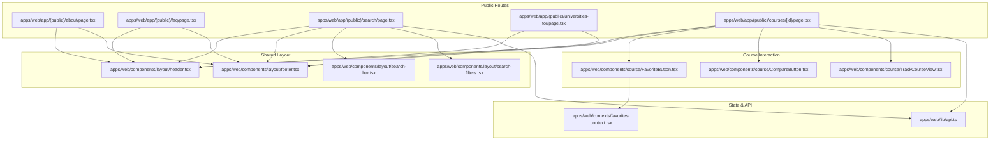
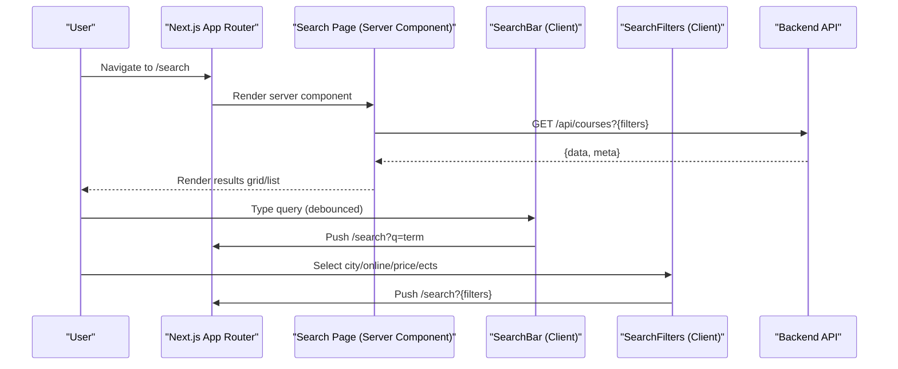
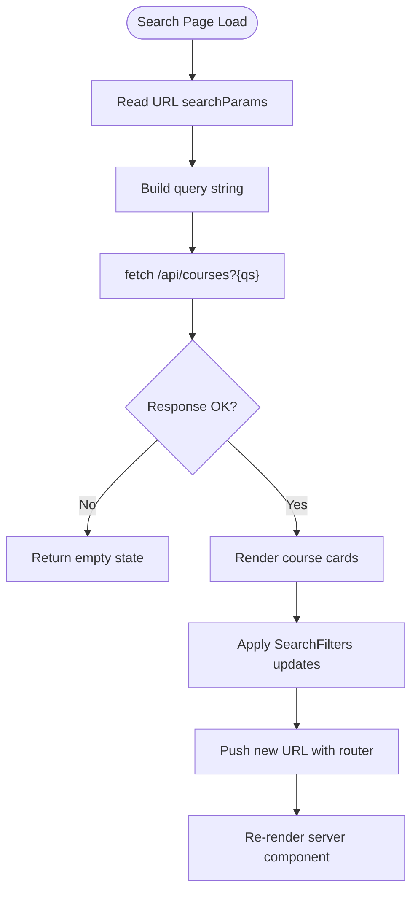
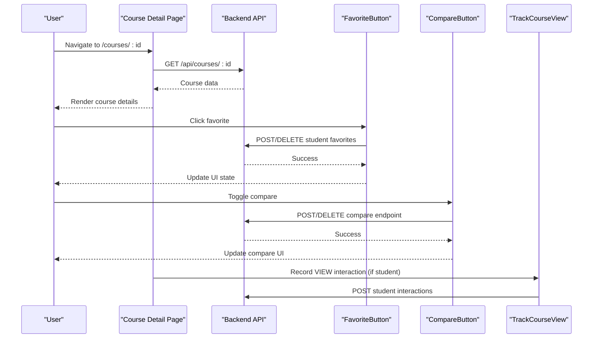
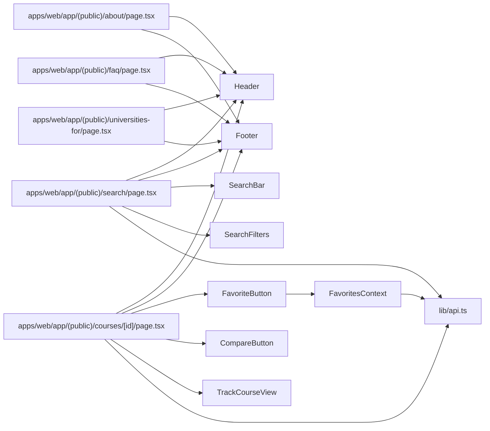

# Public Pages

<cite>
**Referenced Files in This Document**
- [apps/web/app/(public)/about/page.tsx](file://apps/web/app/(public)/about/page.tsx)
- [apps/web/app/(public)/faq/page.tsx](file://apps/web/app/(public)/faq/page.tsx)
- [apps/web/app/(public)/search/page.tsx](file://apps/web/app/(public)/search/page.tsx)
- [apps/web/app/(public)/universities-for/page.tsx](file://apps/web/app/(public)/universities-for/page.tsx)
- [apps/web/app/(public)/courses/[id]/page.tsx](file://apps/web/app/(public)/courses/[id]/page.tsx)
- [apps/web/components/layout/search-filters.tsx](file://apps/web/components/layout/search-filters.tsx)
- [apps/web/components/layout/search-bar.tsx](file://apps/web/components/layout/search-bar.tsx)
- [apps/web/components/layout/header.tsx](file://apps/web/components/layout/header.tsx)
- [apps/web/components/layout/footer.tsx](file://apps/web/components/layout/footer.tsx)
- [apps/web/components/course/FavoriteButton.tsx](file://apps/web/components/course/FavoriteButton.tsx)
- [apps/web/components/course/CompareButton.tsx](file://apps/web/components/course/CompareButton.tsx)
- [apps/web/components/course/TrackCourseView.tsx](file://apps/web/components/course/TrackCourseView.tsx)
- [apps/web/lib/api.ts](file://apps/web/lib/api.ts)
- [apps/web/contexts/favorites-context.tsx](file://apps/web/contexts/favorites-context.tsx)
- [apps/web/app/layout.tsx](file://apps/web/app/layout.tsx)
- [apps/web/app/globals.css](file://apps/web/app/globals.css)
</cite>

## Table of Contents
1. [Introduction](#introduction)
2. [Project Structure](#project-structure)
3. [Core Components](#core-components)
4. [Architecture Overview](#architecture-overview)
5. [Detailed Component Analysis](#detailed-component-analysis)
6. [Dependency Analysis](#dependency-analysis)
7. [Performance Considerations](#performance-considerations)
8. [Troubleshooting Guide](#troubleshooting-guide)
9. [Conclusion](#conclusion)
10. [Appendices](#appendices)

## Introduction
This document explains the public-facing pages and course discovery interface of the platform. It covers:
- About page, FAQ section, and informational content pages
- Course detail page implementation, course data display, and user interactions
- Search interface with filtering, sorting, and result presentation
- Universities-for page and course listing functionality
- SEO optimization, meta tags, and social media integration
- Responsive design patterns, accessibility features, and performance optimization

## Project Structure
The public pages live under the Next.js app directory in the web application. They are structured as route segments grouped by public-facing routes and share common layout components and utilities.

**Diagram sources**
- [apps/web/app/(public)/about/page.tsx](file://apps/web/app/(public)/about/page.tsx#L1-L171)
- [apps/web/app/(public)/faq/page.tsx](file://apps/web/app/(public)/faq/page.tsx#L1-L207)
- [apps/web/app/(public)/search/page.tsx](file://apps/web/app/(public)/search/page.tsx#L1-L237)
- [apps/web/app/(public)/universities-for/page.tsx](file://apps/web/app/(public)/universities-for/page.tsx#L1-L209)
- [apps/web/app/(public)/courses/[id]/page.tsx](file://apps/web/app/(public)/courses/[id]/page.tsx#L1-L285)
- [apps/web/components/layout/header.tsx](file://apps/web/components/layout/header.tsx#L1-L196)
- [apps/web/components/layout/footer.tsx](file://apps/web/components/layout/footer.tsx#L1-L121)
- [apps/web/components/layout/search-bar.tsx](file://apps/web/components/layout/search-bar.tsx#L1-L94)
- [apps/web/components/layout/search-filters.tsx](file://apps/web/components/layout/search-filters.tsx#L1-L248)
- [apps/web/components/course/FavoriteButton.tsx](file://apps/web/components/course/FavoriteButton.tsx#L1-L92)
- [apps/web/components/course/CompareButton.tsx](file://apps/web/components/course/CompareButton.tsx#L1-L45)
- [apps/web/components/course/TrackCourseView.tsx](file://apps/web/components/course/TrackCourseView.tsx#L1-L34)
- [apps/web/contexts/favorites-context.tsx](file://apps/web/contexts/favorites-context.tsx#L1-L146)
- [apps/web/lib/api.ts](file://apps/web/lib/api.ts#L1-L378)

**Section sources**
- [apps/web/app/(public)/about/page.tsx](file://apps/web/app/(public)/about/page.tsx#L1-L171)
- [apps/web/app/(public)/faq/page.tsx](file://apps/web/app/(public)/faq/page.tsx#L1-L207)
- [apps/web/app/(public)/search/page.tsx](file://apps/web/app/(public)/search/page.tsx#L1-L237)
- [apps/web/app/(public)/universities-for/page.tsx](file://apps/web/app/(public)/universities-for/page.tsx#L1-L209)
- [apps/web/app/(public)/courses/[id]/page.tsx](file://apps/web/app/(public)/courses/[id]/page.tsx#L1-L285)

## Core Components
- Public pages:
  - About page: Mission, vision, values, and TÜBİTAK support
  - FAQ page: Accordion-style questions with category and search
  - Search page: Filters, results grid/list, pagination, and actions
  - Universities-for page: Partner landing for universities
  - Course detail page: Rich course info, summary card, tabs, and actions
- Shared layout and utilities:
  - Header and footer with navigation and branding
  - Search bar with debounced live search
  - Search filters with city, online/on-campus, ECTS range, and price range
- User interaction components:
  - Favorite button with centralized favorites state
  - Compare button for adding courses to comparison
  - View tracking for logged-in students

**Section sources**
- [apps/web/app/(public)/about/page.tsx](file://apps/web/app/(public)/about/page.tsx#L1-L171)
- [apps/web/app/(public)/faq/page.tsx](file://apps/web/app/(public)/faq/page.tsx#L1-L207)
- [apps/web/app/(public)/search/page.tsx](file://apps/web/app/(public)/search/page.tsx#L1-L237)
- [apps/web/app/(public)/universities-for/page.tsx](file://apps/web/app/(public)/universities-for/page.tsx#L1-L209)
- [apps/web/app/(public)/courses/[id]/page.tsx](file://apps/web/app/(public)/courses/[id]/page.tsx#L1-L285)
- [apps/web/components/layout/header.tsx](file://apps/web/components/layout/header.tsx#L1-L196)
- [apps/web/components/layout/footer.tsx](file://apps/web/components/layout/footer.tsx#L1-L121)
- [apps/web/components/layout/search-bar.tsx](file://apps/web/components/layout/search-bar.tsx#L1-L94)
- [apps/web/components/layout/search-filters.tsx](file://apps/web/components/layout/search-filters.tsx#L1-L248)
- [apps/web/components/course/FavoriteButton.tsx](file://apps/web/components/course/FavoriteButton.tsx#L1-L92)
- [apps/web/components/course/CompareButton.tsx](file://apps/web/components/course/CompareButton.tsx#L1-L45)
- [apps/web/components/course/TrackCourseView.tsx](file://apps/web/components/course/TrackCourseView.tsx#L1-L34)

## Architecture Overview
The public pages follow a server-side rendering pattern for search results and course details, while interactive UI relies on client-side components and shared providers.

**Diagram sources**
- [apps/web/app/(public)/search/page.tsx](file://apps/web/app/(public)/search/page.tsx#L30-L42)
- [apps/web/components/layout/search-bar.tsx](file://apps/web/components/layout/search-bar.tsx#L31-L41)
- [apps/web/components/layout/search-filters.tsx](file://apps/web/components/layout/search-filters.tsx#L40-L59)
- [apps/web/lib/api.ts](file://apps/web/lib/api.ts#L63-L67)

## Detailed Component Analysis

### About Page
- Purpose: Present project mission, vision, values, and TÜBİTAK support.
- Key features:
  - Hero section with gradient and CTA
  - Mission/vision cards
  - Values grid with icons
  - Dark-themed TÜBİTAK section with CTAs
- Styling: Uses Tailwind utilities and global CSS for gradients and glass effects.

**Section sources**
- [apps/web/app/(public)/about/page.tsx](file://apps/web/app/(public)/about/page.tsx#L1-L171)
- [apps/web/app/globals.css](file://apps/web/app/globals.css#L38-L71)

### FAQ Page
- Purpose: Provide searchable and categorized frequently asked questions.
- Key features:
  - Accordion-style items with expand/collapse
  - Category tabs and live search
  - Contact support CTA
- Behavior: Client-side filtering by category and search term; maintains open item state.

**Section sources**
- [apps/web/app/(public)/faq/page.tsx](file://apps/web/app/(public)/faq/page.tsx#L1-L207)

### Search Page
- Purpose: Discover courses via filters and present results in grid/list view.
- Key features:
  - Server component fetching data from backend
  - Sticky filters sidebar with collapsible desktop and mobile sheet
  - Header controls: breadcrumbs, search bar, sort dropdown, view toggles
  - Results grid with course cards, pricing, metadata, and actions
  - Pagination with URL-driven page parameter
- Data flow: Reads URL searchParams, constructs query string, fetches from API, renders results.

**Diagram sources**
- [apps/web/app/(public)/search/page.tsx](file://apps/web/app/(public)/search/page.tsx#L17-L49)
- [apps/web/components/layout/search-filters.tsx](file://apps/web/components/layout/search-filters.tsx#L40-L59)

**Section sources**
- [apps/web/app/(public)/search/page.tsx](file://apps/web/app/(public)/search/page.tsx#L1-L237)
- [apps/web/components/layout/search-filters.tsx](file://apps/web/components/layout/search-filters.tsx#L1-L248)

### Course Detail Page
- Purpose: Display comprehensive course information and enable actions.
- Key features:
  - Breadcrumbs and tabs
  - Course description and learning outcomes
  - Instructor placeholder section
  - Sticky summary card with pricing, metrics, application link, compare, and favorite
  - View tracking for logged-in students
- Data flow: Fetches single course by ID from backend; handles missing course gracefully.

**Diagram sources**
- [apps/web/app/(public)/courses/[id]/page.tsx](file://apps/web/app/(public)/courses/[id]/page.tsx#L18-L31)
- [apps/web/components/course/FavoriteButton.tsx](file://apps/web/components/course/FavoriteButton.tsx#L39-L57)
- [apps/web/components/course/CompareButton.tsx](file://apps/web/components/course/CompareButton.tsx#L15-L34)
- [apps/web/components/course/TrackCourseView.tsx](file://apps/web/components/course/TrackCourseView.tsx#L14-L30)
- [apps/web/lib/api.ts](file://apps/web/lib/api.ts#L226-L235)

**Section sources**
- [apps/web/app/(public)/courses/[id]/page.tsx](file://apps/web/app/(public)/courses/[id]/page.tsx#L1-L285)
- [apps/web/components/course/FavoriteButton.tsx](file://apps/web/components/course/FavoriteButton.tsx#L1-L92)
- [apps/web/components/course/CompareButton.tsx](file://apps/web/components/course/CompareButton.tsx#L1-L45)
- [apps/web/components/course/TrackCourseView.tsx](file://apps/web/components/course/TrackCourseView.tsx#L1-L34)

### Universities-for Page
- Purpose: Partner landing for universities with benefits, dashboard preview, and CTA.
- Key features:
  - Hero with gradient and CTAs
  - Benefits grid (zero data entry, visibility, analytics)
  - Dashboard preview mockup
  - Dark-themed CTA section

**Section sources**
- [apps/web/app/(public)/universities-for/page.tsx](file://apps/web/app/(public)/universities-for/page.tsx#L1-L209)
- [apps/web/app/globals.css](file://apps/web/app/globals.css#L38-L71)

### Search Filters Component
- Purpose: Provide city, online/on-campus, ECTS range, and price range filters with URL synchronization.
- Key features:
  - Mobile sheet overlay and desktop collapsible panel
  - Debounced live search via URL updates
  - Manual apply for range filters
  - Clear filters action

**Section sources**
- [apps/web/components/layout/search-filters.tsx](file://apps/web/components/layout/search-filters.tsx#L1-L248)

### Search Bar Component
- Purpose: Provide hero and compact search experiences with debounced routing.
- Key features:
  - Two variants: hero and compact
  - Debounce logic to push URL updates after typing
  - Form submission handling

**Section sources**
- [apps/web/components/layout/search-bar.tsx](file://apps/web/components/layout/search-bar.tsx#L1-L94)

### Header and Footer
- Header: Responsive navigation, login/register states, and scroll-aware styling.
- Footer: Multi-column layout with brand, links, and TÜBİTAK badge.

**Section sources**
- [apps/web/components/layout/header.tsx](file://apps/web/components/layout/header.tsx#L1-L196)
- [apps/web/components/layout/footer.tsx](file://apps/web/components/layout/footer.tsx#L1-L121)

### Favorites and Comparison State
- Favorites provider: Centralized state for student favorites synced with backend.
- Compare button: Integrates with compare context to manage selection.

**Section sources**
- [apps/web/contexts/favorites-context.tsx](file://apps/web/contexts/favorites-context.tsx#L1-L146)
- [apps/web/components/course/FavoriteButton.tsx](file://apps/web/components/course/FavoriteButton.tsx#L1-L92)
- [apps/web/components/course/CompareButton.tsx](file://apps/web/components/course/CompareButton.tsx#L1-L45)

## Dependency Analysis
Public pages depend on shared layout components and utilities. The search and detail pages integrate with the API client and state providers.

**Diagram sources**
- [apps/web/app/(public)/about/page.tsx](file://apps/web/app/(public)/about/page.tsx#L1-L171)
- [apps/web/app/(public)/faq/page.tsx](file://apps/web/app/(public)/faq/page.tsx#L1-L207)
- [apps/web/app/(public)/search/page.tsx](file://apps/web/app/(public)/search/page.tsx#L1-L237)
- [apps/web/app/(public)/universities-for/page.tsx](file://apps/web/app/(public)/universities-for/page.tsx#L1-L209)
- [apps/web/app/(public)/courses/[id]/page.tsx](file://apps/web/app/(public)/courses/[id]/page.tsx#L1-L285)
- [apps/web/components/layout/header.tsx](file://apps/web/components/layout/header.tsx#L1-L196)
- [apps/web/components/layout/footer.tsx](file://apps/web/components/layout/footer.tsx#L1-L121)
- [apps/web/components/layout/search-bar.tsx](file://apps/web/components/layout/search-bar.tsx#L1-L94)
- [apps/web/components/layout/search-filters.tsx](file://apps/web/components/layout/search-filters.tsx#L1-L248)
- [apps/web/components/course/FavoriteButton.tsx](file://apps/web/components/course/FavoriteButton.tsx#L1-L92)
- [apps/web/components/course/CompareButton.tsx](file://apps/web/components/course/CompareButton.tsx#L1-L45)
- [apps/web/components/course/TrackCourseView.tsx](file://apps/web/components/course/TrackCourseView.tsx#L1-L34)
- [apps/web/contexts/favorites-context.tsx](file://apps/web/contexts/favorites-context.tsx#L1-L146)
- [apps/web/lib/api.ts](file://apps/web/lib/api.ts#L1-L378)

**Section sources**
- [apps/web/app/(public)/search/page.tsx](file://apps/web/app/(public)/search/page.tsx#L1-L237)
- [apps/web/app/(public)/courses/[id]/page.tsx](file://apps/web/app/(public)/courses/[id]/page.tsx#L1-L285)
- [apps/web/lib/api.ts](file://apps/web/lib/api.ts#L1-L378)
- [apps/web/contexts/favorites-context.tsx](file://apps/web/contexts/favorites-context.tsx#L1-L146)

## Performance Considerations
- Server component rendering for search results reduces client work and improves initial load.
- Debounced search in the search bar minimizes unnecessary network requests.
- Dynamic rendering disabled for search page to ensure fresh data per request.
- Sticky positioning and minimal heavy computations in layout components improve responsiveness.
- Global CSS utilities and Tailwind classes keep styles efficient.

[No sources needed since this section provides general guidance]

## Troubleshooting Guide
- Search results not updating:
  - Verify URL parameters are being passed to the server component and query string is constructed correctly.
  - Confirm API endpoint returns data and meta fields.
- Filters not applying:
  - Ensure router pushes updated URLs and searchParams are read in the server component.
  - Check that filter values sync with URL state.
- Favorites not persisting:
  - Confirm token presence and role check in favorites provider.
  - Verify backend endpoints for add/remove favorites.
- Course detail missing:
  - Ensure fallback UI handles null course gracefully.

**Section sources**
- [apps/web/app/(public)/search/page.tsx](file://apps/web/app/(public)/search/page.tsx#L15-L49)
- [apps/web/components/layout/search-filters.tsx](file://apps/web/components/layout/search-filters.tsx#L40-L59)
- [apps/web/contexts/favorites-context.tsx](file://apps/web/contexts/favorites-context.tsx#L34-L65)

## Conclusion
The public pages implement a cohesive, responsive, and accessible user experience for discovering and interacting with course offerings. The search interface provides powerful filtering and result presentation, while the course detail page centralizes essential information and actions. Shared layout components and state providers ensure consistent behavior across pages, and the architecture supports SEO-friendly rendering and performance optimization.

[No sources needed since this section summarizes without analyzing specific files]

## Appendices

### SEO, Meta Tags, and Social Media Integration
- Root layout defines site-wide metadata including title, description, and keywords.
- Footer includes social links and TÜBİTAK branding for trust signals.
- Consider adding Open Graph and Twitter Card meta tags in the future for richer social sharing.

**Section sources**
- [apps/web/app/layout.tsx](file://apps/web/app/layout.tsx#L17-L22)
- [apps/web/components/layout/footer.tsx](file://apps/web/components/layout/footer.tsx#L28-L49)

### Responsive Design Patterns
- Sticky filters and header adapt to viewport sizes.
- Mobile-first navigation with overlay sheet for filters.
- Flexible grids and typography scales across breakpoints.

**Section sources**
- [apps/web/components/layout/search-filters.tsx](file://apps/web/components/layout/search-filters.tsx#L194-L227)
- [apps/web/components/layout/header.tsx](file://apps/web/components/layout/header.tsx#L121-L133)
- [apps/web/app/globals.css](file://apps/web/app/globals.css#L1-L124)

### Accessibility Features
- Semantic HTML and proper labeling for buttons and inputs.
- Focus management and keyboard navigation support in interactive components.
- Color contrast maintained via Tailwind utilities and dark mode variants.

**Section sources**
- [apps/web/components/course/FavoriteButton.tsx](file://apps/web/components/course/FavoriteButton.tsx#L63-L75)
- [apps/web/components/layout/search-filters.tsx](file://apps/web/components/layout/search-filters.tsx#L107-L118)
- [apps/web/components/layout/header.tsx](file://apps/web/components/layout/header.tsx#L122-L132)