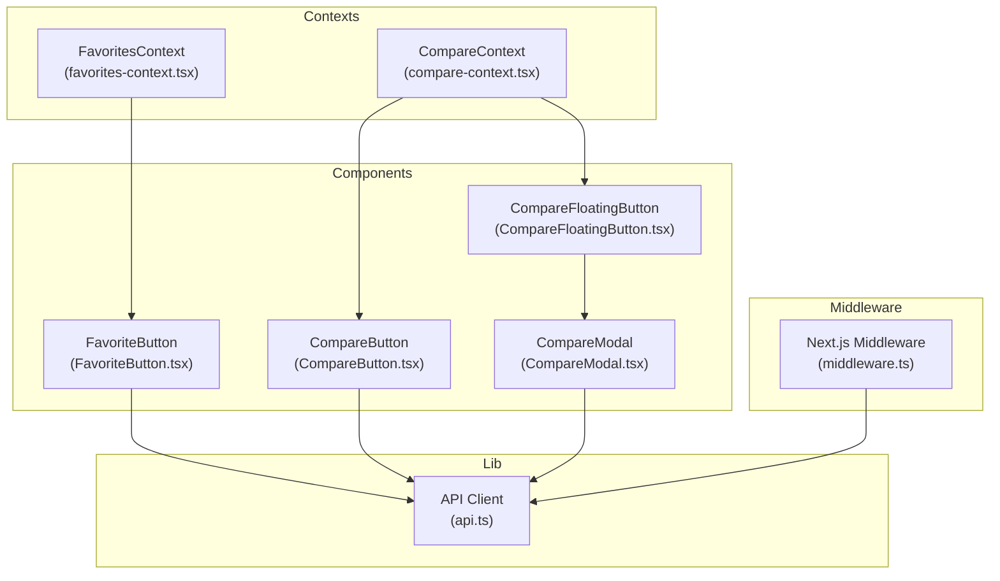
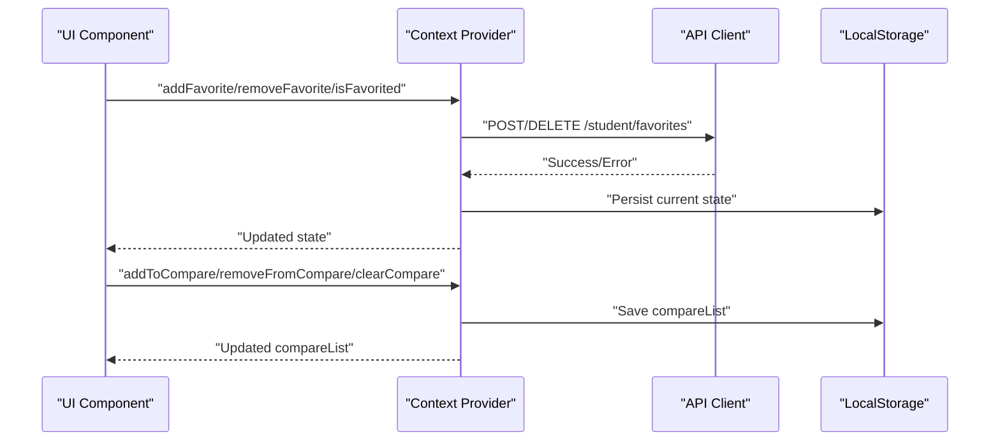
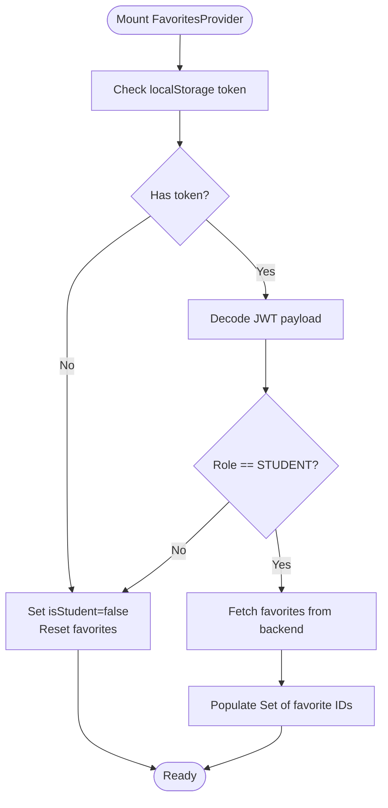
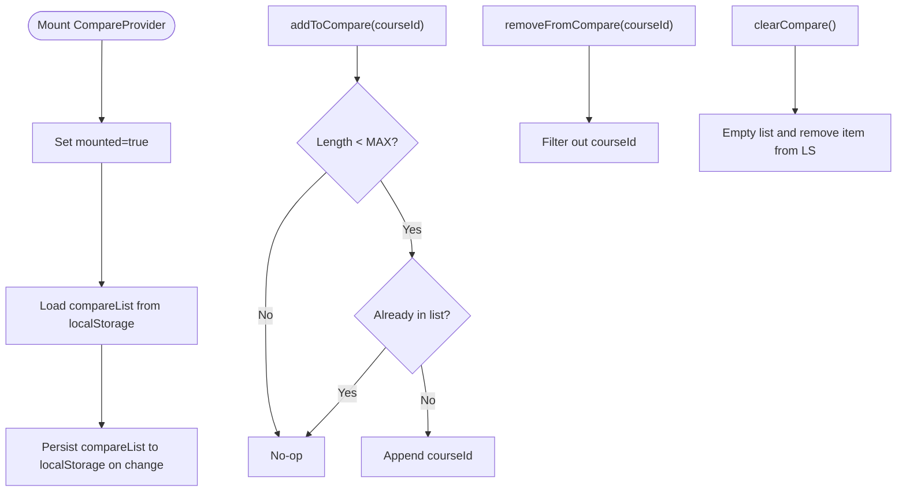
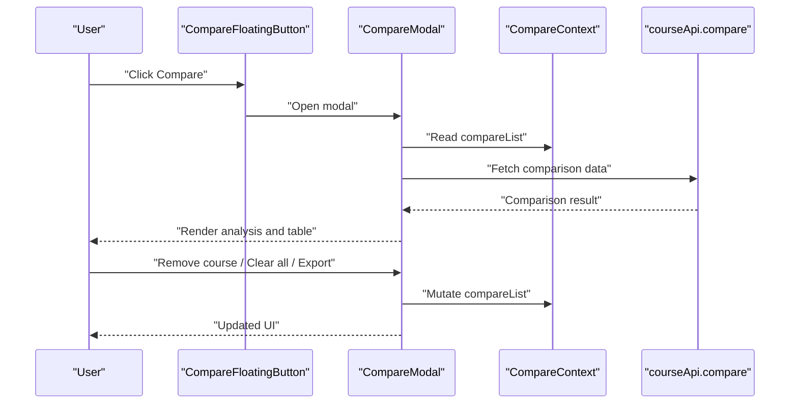
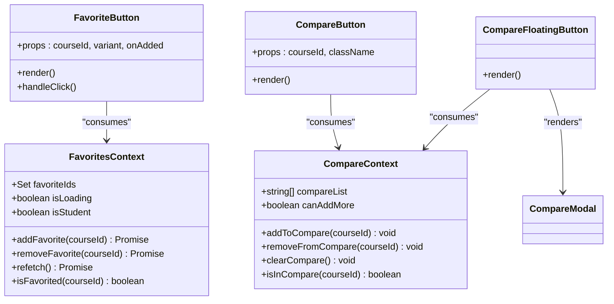
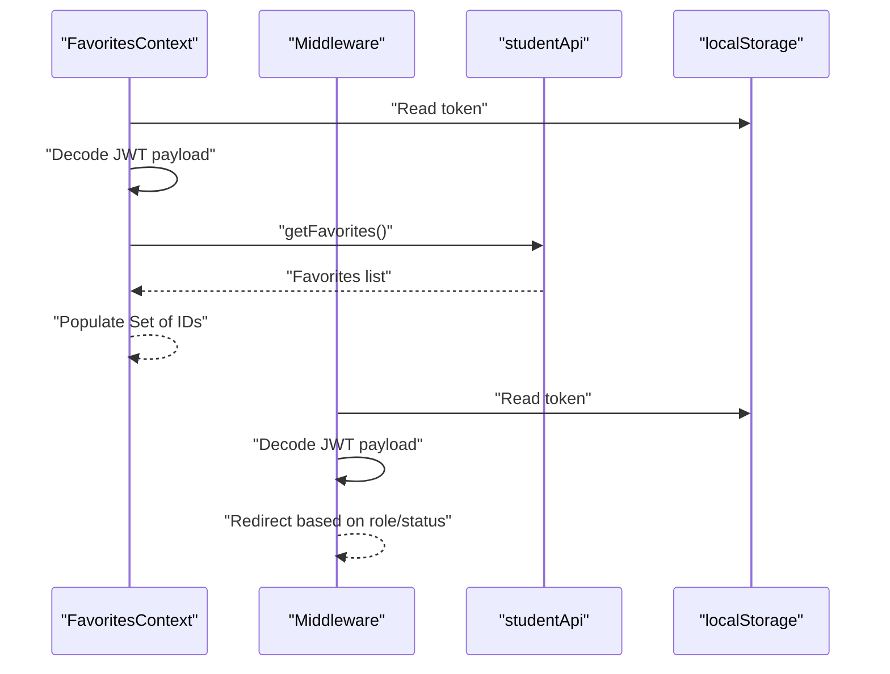
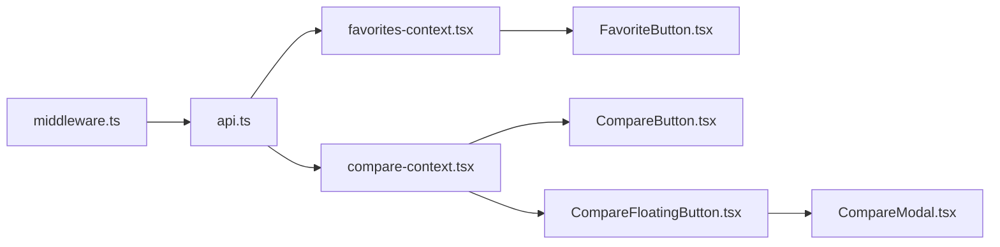

# State Management and Contexts

<cite>
**Referenced Files in This Document**
- [favorites-context.tsx](file://apps/web/contexts/favorites-context.tsx)
- [compare-context.tsx](file://apps/web/contexts/compare-context.tsx)
- [api.ts](file://apps/web/lib/api.ts)
- [FavoriteButton.tsx](file://apps/web/components/course/FavoriteButton.tsx)
- [CompareButton.tsx](file://apps/web/components/course/CompareButton.tsx)
- [CompareModal.tsx](file://apps/web/components/compare/CompareModal.tsx)
- [CompareFloatingButton.tsx](file://apps/web/components/compare/CompareFloatingButton.tsx)
- [middleware.ts](file://apps/web/middleware.ts)
</cite>

## Table of Contents
1. [Introduction](#introduction)
2. [Project Structure](#project-structure)
3. [Core Components](#core-components)
4. [Architecture Overview](#architecture-overview)
5. [Detailed Component Analysis](#detailed-component-analysis)
6. [Dependency Analysis](#dependency-analysis)
7. [Performance Considerations](#performance-considerations)
8. [Troubleshooting Guide](#troubleshooting-guide)
9. [Conclusion](#conclusion)

## Introduction
This document explains the React context-based state management system used to manage user preferences and interactions across the Next.js application. It focuses on three primary contexts:
- Favorites context for managing user course favorites with API synchronization and local storage persistence
- Compare context for course comparison with local storage persistence and UI composition
- Modal system for dialogs around search results, course details, and user actions

It also covers provider/consumer patterns, state update mechanisms, integration with local storage and backend APIs, and performance optimization techniques.

## Project Structure
The state management is implemented via two client-side React contexts located under apps/web/contexts, with supporting UI components and API clients under apps/web/components and apps/web/lib respectively. Providers wrap the application shell so consumers can access shared state anywhere in the tree.

**Diagram sources**
- [favorites-context.tsx](file://apps/web/contexts/favorites-context.tsx#L1-L146)
- [compare-context.tsx](file://apps/web/contexts/compare-context.tsx#L1-L111)
- [FavoriteButton.tsx](file://apps/web/components/course/FavoriteButton.tsx#L1-L92)
- [CompareButton.tsx](file://apps/web/components/course/CompareButton.tsx#L1-L45)
- [CompareFloatingButton.tsx](file://apps/web/components/compare/CompareFloatingButton.tsx#L1-L46)
- [CompareModal.tsx](file://apps/web/components/compare/CompareModal.tsx#L1-L429)
- [api.ts](file://apps/web/lib/api.ts#L1-L378)
- [middleware.ts](file://apps/web/middleware.ts#L1-L107)

**Section sources**
- [favorites-context.tsx](file://apps/web/contexts/favorites-context.tsx#L1-L146)
- [compare-context.tsx](file://apps/web/contexts/compare-context.tsx#L1-L111)
- [api.ts](file://apps/web/lib/api.ts#L1-L378)
- [middleware.ts](file://apps/web/middleware.ts#L1-L107)

## Core Components
- FavoritesContext: Centralized state for user favorites, student role gating, loading states, and API-backed synchronization.
- CompareContext: Centralized state for course comparison list with local storage persistence and add/remove/clear operations.
- API Client: Unified HTTP client that injects tokens and centralizes error handling for all backend interactions.

Key capabilities:
- Favorites: Fetch favorites on mount, mutate favorites via API, and expose helpers to check favorite status.
- Compare: Load/save compare list from/to localStorage, enforce a maximum capacity, and provide mutation helpers.
- API: Provide typed endpoints for auth, courses, universities, students, and widgets.

**Section sources**
- [favorites-context.tsx](file://apps/web/contexts/favorites-context.tsx#L17-L25)
- [compare-context.tsx](file://apps/web/contexts/compare-context.tsx#L16-L23)
- [api.ts](file://apps/web/lib/api.ts#L10-L36)

## Architecture Overview
The system follows a layered pattern:
- UI components consume contexts to read/write state
- Contexts orchestrate data fetching and mutations via the API client
- Local storage persists user preferences across sessions
- Middleware enforces role-based routing and token validation

**Diagram sources**
- [FavoriteButton.tsx](file://apps/web/components/course/FavoriteButton.tsx#L39-L57)
- [favorites-context.tsx](file://apps/web/contexts/favorites-context.tsx#L71-L99)
- [compare-context.tsx](file://apps/web/contexts/compare-context.tsx#L58-L75)
- [api.ts](file://apps/web/lib/api.ts#L226-L235)

## Detailed Component Analysis

### Favorites Context
Purpose:
- Manage user favorites centrally across pages
- Gate functionality by student role
- Synchronize with backend and persist locally

State and methods:
- State: Set of favorite IDs, loading flag, student role flag
- Methods: addFavorite, removeFavorite, refetch, isFavorited
- Persistence: None (no localStorage write in context)
- API integration: studentApi.getFavorites, studentApi.addFavorite, studentApi.removeFavorite

Behavior highlights:
- On mount, reads token from localStorage and decodes role; if not STUDENT, clears state
- Fetches favorites from backend and populates state
- Mutations update state optimistically and call backend APIs
- Exposes optional hook for gradual adoption

**Diagram sources**
- [favorites-context.tsx](file://apps/web/contexts/favorites-context.tsx#L34-L65)

**Section sources**
- [favorites-context.tsx](file://apps/web/contexts/favorites-context.tsx#L29-L132)
- [FavoriteButton.tsx](file://apps/web/components/course/FavoriteButton.tsx#L17-L57)
- [api.ts](file://apps/web/lib/api.ts#L212-L235)

### Compare Context
Purpose:
- Maintain a comparison list with a fixed maximum length
- Persist list to localStorage across sessions
- Provide mutation helpers and capability checks

State and methods:
- State: compareList array, computed canAddMore
- Methods: addToCompare, removeFromCompare, clearCompare, isInCompare

Behavior highlights:
- Hydrates from localStorage on mount and truncates to maximum length
- Persists changes to localStorage after every update
- Enforces maximum capacity and deduplication on add

**Diagram sources**
- [compare-context.tsx](file://apps/web/contexts/compare-context.tsx#L30-L98)

**Section sources**
- [compare-context.tsx](file://apps/web/contexts/compare-context.tsx#L30-L98)
- [CompareButton.tsx](file://apps/web/components/course/CompareButton.tsx#L15-L44)
- [CompareFloatingButton.tsx](file://apps/web/components/compare/CompareFloatingButton.tsx#L13-L45)

### Modal System for Course Comparison
Purpose:
- Present comparison results in a structured modal
- Allow removal per course and bulk clearing
- Provide export to PDF via browser print

Key flows:
- Floating button triggers modal when compareList is non-empty
- Modal fetches comparison data from backend when opened and list length is sufficient
- Renders analysis cards and a comparison table
- Supports removing individual items and clearing all

**Diagram sources**
- [CompareFloatingButton.tsx](file://apps/web/components/compare/CompareFloatingButton.tsx#L13-L45)
- [CompareModal.tsx](file://apps/web/components/compare/CompareModal.tsx#L317-L428)
- [compare-context.tsx](file://apps/web/contexts/compare-context.tsx#L30-L98)
- [api.ts](file://apps/web/lib/api.ts#L71-L76)

**Section sources**
- [CompareModal.tsx](file://apps/web/components/compare/CompareModal.tsx#L317-L428)
- [CompareFloatingButton.tsx](file://apps/web/components/compare/CompareFloatingButton.tsx#L13-L45)

### Consumer Patterns and Composition
- Favorites: FavoriteButton consumes FavoritesContext to toggle favorites and reflect status. It uses an optional hook to avoid strict provider requirements during hydration and disables rendering until mounted.
- Compare: CompareButton consumes CompareContext to reflect membership and enable/disable based on capacity. CompareFloatingButton composes CompareModal to present the comparison results.

**Diagram sources**
- [favorites-context.tsx](file://apps/web/contexts/favorites-context.tsx#L17-L25)
- [compare-context.tsx](file://apps/web/contexts/compare-context.tsx#L16-L23)
- [FavoriteButton.tsx](file://apps/web/components/course/FavoriteButton.tsx#L11-L15)
- [CompareButton.tsx](file://apps/web/components/course/CompareButton.tsx#L10-L13)
- [CompareFloatingButton.tsx](file://apps/web/components/compare/CompareFloatingButton.tsx#L13-L19)

**Section sources**
- [FavoriteButton.tsx](file://apps/web/components/course/FavoriteButton.tsx#L17-L57)
- [CompareButton.tsx](file://apps/web/components/course/CompareButton.tsx#L15-L44)
- [CompareFloatingButton.tsx](file://apps/web/components/compare/CompareFloatingButton.tsx#L13-L45)

### State Update Mechanisms
- Favorites: Optimistic updates followed by backend calls; errors are surfaced via thrown errors for upstream handling.
- Compare: Immediate state updates with localStorage persistence; no optimistic updates to maintain deterministic UI and storage sync.
- Modal: Controlled open/close state; data fetched on demand when modal opens with sufficient items.

**Section sources**
- [favorites-context.tsx](file://apps/web/contexts/favorites-context.tsx#L71-L99)
- [compare-context.tsx](file://apps/web/contexts/compare-context.tsx#L58-L75)
- [CompareModal.tsx](file://apps/web/components/compare/CompareModal.tsx#L317-L345)

### Integration with Local Storage and API
- Favorites: No explicit localStorage writes in context; relies on backend synchronization. Token decoding occurs in both context and middleware to gate access.
- Compare: Uses localStorage getItem/setItem to persist and hydrate the list.
- API Client: Centralized fetch wrapper adds Authorization header when available and parses errors consistently.

**Diagram sources**
- [favorites-context.tsx](file://apps/web/contexts/favorites-context.tsx#L34-L65)
- [middleware.ts](file://apps/web/middleware.ts#L25-L72)
- [api.ts](file://apps/web/lib/api.ts#L212-L224)

**Section sources**
- [favorites-context.tsx](file://apps/web/contexts/favorites-context.tsx#L34-L65)
- [compare-context.tsx](file://apps/web/contexts/compare-context.tsx#L38-L56)
- [api.ts](file://apps/web/lib/api.ts#L10-L36)
- [middleware.ts](file://apps/web/middleware.ts#L25-L72)

## Dependency Analysis
- Contexts depend on the API client for remote synchronization.
- UI components depend on contexts for state and actions.
- Middleware depends on token presence and payload to enforce route-level access control.

**Diagram sources**
- [api.ts](file://apps/web/lib/api.ts#L1-L378)
- [favorites-context.tsx](file://apps/web/contexts/favorites-context.tsx#L1-L146)
- [compare-context.tsx](file://apps/web/contexts/compare-context.tsx#L1-L111)
- [FavoriteButton.tsx](file://apps/web/components/course/FavoriteButton.tsx#L1-L92)
- [CompareButton.tsx](file://apps/web/components/course/CompareButton.tsx#L1-L45)
- [CompareFloatingButton.tsx](file://apps/web/components/compare/CompareFloatingButton.tsx#L1-L46)
- [CompareModal.tsx](file://apps/web/components/compare/CompareModal.tsx#L1-L429)
- [middleware.ts](file://apps/web/middleware.ts#L1-L107)

**Section sources**
- [api.ts](file://apps/web/lib/api.ts#L1-L378)
- [middleware.ts](file://apps/web/middleware.ts#L1-L107)

## Performance Considerations
- Memoization and callbacks: Both contexts use useMemo/useCallback to prevent unnecessary re-renders of consumers.
- Conditional fetching: Favorites fetch runs only once on mount; Compare fetch occurs only when the modal opens and list length is sufficient.
- Local storage: Compare context avoids expensive parsing by guarding with mounted flag and minimal writes.
- UI hydration: FavoriteButton defers rendering until mounted to avoid SSR mismatches.
- Role gating: Middleware prevents unnecessary client-side work for unauthorized routes.

[No sources needed since this section provides general guidance]

## Troubleshooting Guide
Common issues and resolutions:
- Favorites not updating across pages:
  - Verify token presence and role in localStorage; ensure JWT payload decoding succeeds.
  - Confirm API responses for getFavorites/addFavorite/removeFavorite.
- Compare list not persisting:
  - Check localStorage availability and permissions; ensure getItem/setItem are reachable.
  - Confirm maximum capacity and deduplication logic.
- Modal not opening:
  - Ensure compareList has at least two items before opening.
  - Verify courseApi.compare endpoint returns data successfully.
- Middleware redirects:
  - Confirm token cookie exists and payload contains expected role/status.
  - Ensure redirect logic aligns with intended user flow.

**Section sources**
- [favorites-context.tsx](file://apps/web/contexts/favorites-context.tsx#L34-L65)
- [compare-context.tsx](file://apps/web/contexts/compare-context.tsx#L38-L56)
- [CompareModal.tsx](file://apps/web/components/compare/CompareModal.tsx#L317-L345)
- [middleware.ts](file://apps/web/middleware.ts#L25-L72)

## Conclusion
The application’s state management leverages React contexts to provide a cohesive, scalable solution for user preferences and course comparisons. Favorites rely on backend synchronization with role-based gating, while Compare uses local storage for persistence and UI composition. The API client centralizes HTTP concerns, and middleware ensures secure routing. Together, these patterns support maintainability, performance, and a consistent user experience.