# UI Components Library

<cite>
**Referenced Files in This Document**
- [button.tsx](file://apps/web/components/ui/button.tsx)
- [input.tsx](file://apps/web/components/ui/input.tsx)
- [badge.tsx](file://apps/web/components/ui/badge.tsx)
- [card.tsx](file://apps/web/components/ui/card.tsx)
- [dialog.tsx](file://apps/web/components/ui/dialog.tsx)
- [table.tsx](file://apps/web/components/ui/table.tsx)
- [tabs.tsx](file://apps/web/components/ui/tabs.tsx)
- [skeleton.tsx](file://apps/web/components/ui/skeleton.tsx)
- [progress.tsx](file://apps/web/components/ui/progress.tsx)
- [checkbox.tsx](file://apps/web/components/ui/checkbox.tsx)
- [label.tsx](file://apps/web/components/ui/label.tsx)
- [separator.tsx](file://apps/web/components/ui/separator.tsx)
- [utils.ts](file://apps/web/lib/utils.ts)
- [tailwind.config.ts](file://apps/web/tailwind.config.ts)
- [globals.css](file://apps/web/app/globals.css)
</cite>

## Table of Contents
1. [Introduction](#introduction)
2. [Project Structure](#project-structure)
3. [Core Components](#core-components)
4. [Architecture Overview](#architecture-overview)
5. [Detailed Component Analysis](#detailed-component-analysis)
6. [Dependency Analysis](#dependency-analysis)
7. [Performance Considerations](#performance-considerations)
8. [Accessibility Features](#accessibility-features)
9. [Responsive Design Patterns](#responsive-design-patterns)
10. [Component Composition and Inheritance](#component-composition-and-inheritance)
11. [Usage Examples and Integration Guidelines](#usage-examples-and-integration-guidelines)
12. [Troubleshooting Guide](#troubleshooting-guide)
13. [Conclusion](#conclusion)

## Introduction
This document describes the shared UI component library used across the Next.js web application. Built with Shadcn-inspired design principles and Tailwind CSS, the library provides reusable, accessible, and theme-consistent components. It covers component props, variants, customization hooks, composition patterns, and integration guidelines. The components leverage Radix UI primitives for interactive elements, class variance authority (CVA) for variant-driven styling, and a centralized Tailwind configuration for consistent theming.

## Project Structure
The UI components live under the web application’s components directory and are complemented by shared utilities, Tailwind configuration, and global styles.

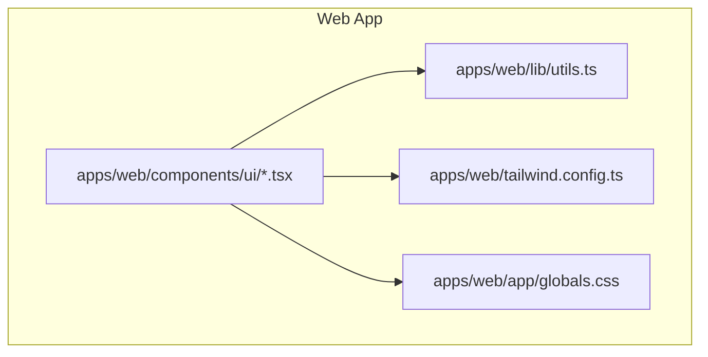

**Diagram sources**
- [button.tsx](file://apps/web/components/ui/button.tsx#L1-L55)
- [utils.ts](file://apps/web/lib/utils.ts#L1-L11)
- [tailwind.config.ts](file://apps/web/tailwind.config.ts#L1-L60)
- [globals.css](file://apps/web/app/globals.css#L1-L124)

**Section sources**
- [button.tsx](file://apps/web/components/ui/button.tsx#L1-L55)
- [input.tsx](file://apps/web/components/ui/input.tsx#L1-L23)
- [badge.tsx](file://apps/web/components/ui/badge.tsx#L1-L36)
- [card.tsx](file://apps/web/components/ui/card.tsx#L1-L79)
- [dialog.tsx](file://apps/web/components/ui/dialog.tsx#L1-L114)
- [table.tsx](file://apps/web/components/ui/table.tsx#L1-L84)
- [tabs.tsx](file://apps/web/components/ui/tabs.tsx#L1-L58)
- [skeleton.tsx](file://apps/web/components/ui/skeleton.tsx#L1-L19)
- [progress.tsx](file://apps/web/components/ui/progress.tsx#L1-L31)
- [checkbox.tsx](file://apps/web/components/ui/checkbox.tsx#L1-L33)
- [label.tsx](file://apps/web/components/ui/label.tsx#L1-L23)
- [separator.tsx](file://apps/web/components/ui/separator.tsx#L1-L26)
- [utils.ts](file://apps/web/lib/utils.ts#L1-L11)
- [tailwind.config.ts](file://apps/web/tailwind.config.ts#L1-L60)
- [globals.css](file://apps/web/app/globals.css#L1-L124)

## Core Components
This section summarizes the primary components, their purpose, and key props/variants.

- Button
  - Purpose: Action trigger with multiple variants and sizes.
  - Variants: default, destructive, outline, secondary, ghost, link.
  - Sizes: default, sm, lg, icon.
  - Props: Inherits button attributes; supports asChild for semantic composition.
  - Reference: [button.tsx](file://apps/web/components/ui/button.tsx#L34-L54)

- Input
  - Purpose: Text input field with focus and disabled states.
  - Props: Inherits input attributes; supports type and className overrides.
  - Reference: [input.tsx](file://apps/web/components/ui/input.tsx#L7-L22)

- Badge
  - Purpose: Label or indicator with variant styling.
  - Variants: default, secondary, destructive, outline.
  - Props: Inherits HTML attributes; variant selection via prop.
  - Reference: [badge.tsx](file://apps/web/components/ui/badge.tsx#L25-L35)

- Card
  - Purpose: Content container with header, title, description, content, and footer slots.
  - Subcomponents: Card, CardHeader, CardTitle, CardDescription, CardContent, CardFooter.
  - Reference: [card.tsx](file://apps/web/components/ui/card.tsx#L7-L78)

- Dialog
  - Purpose: Modal overlay with portal rendering and Radix UI primitives.
  - Subcomponents: Dialog, DialogTrigger, DialogPortal, DialogClose, DialogOverlay, DialogContent, DialogHeader, DialogFooter, DialogTitle, DialogDescription.
  - Reference: [dialog.tsx](file://apps/web/components/ui/dialog.tsx#L10-L113)

- Table
  - Purpose: Scrollable table with structured rows, headers, and cells.
  - Subcomponents: Table, TableHeader, TableBody, TableRow, TableHead, TableCell.
  - Reference: [table.tsx](file://apps/web/components/ui/table.tsx#L7-L83)

- Tabs
  - Purpose: Tabbed navigation with Radix UI primitives.
  - Subcomponents: Tabs, TabsList, TabsTrigger, TabsContent.
  - Reference: [tabs.tsx](file://apps/web/components/ui/tabs.tsx#L10-L57)

- Skeleton
  - Purpose: Loading placeholder with animated pulse effect.
  - Props: Inherits HTML attributes; className override supported.
  - Reference: [skeleton.tsx](file://apps/web/components/ui/skeleton.tsx#L6-L18)

- Progress
  - Purpose: Progress bar with dynamic width based on value.
  - Props: Inherits primitive attributes; value prop controls fill.
  - Reference: [progress.tsx](file://apps/web/components/ui/progress.tsx#L10-L30)

- Checkbox
  - Purpose: Accessible checkbox with indicator.
  - Props: Inherits primitive attributes; checked state handled by Radix.
  - Reference: [checkbox.tsx](file://apps/web/components/ui/checkbox.tsx#L11-L32)

- Label
  - Purpose: Associated text label for form controls.
  - Props: Inherits label attributes; peer-* utilities enable form interactivity.
  - Reference: [label.tsx](file://apps/web/components/ui/label.tsx#L7-L22)

- Separator
  - Purpose: Visual divider with horizontal/vertical orientation.
  - Props: Inherits div attributes; orientation prop toggles direction.
  - Reference: [separator.tsx](file://apps/web/components/ui/separator.tsx#L7-L25)

**Section sources**
- [button.tsx](file://apps/web/components/ui/button.tsx#L1-L55)
- [input.tsx](file://apps/web/components/ui/input.tsx#L1-L23)
- [badge.tsx](file://apps/web/components/ui/badge.tsx#L1-L36)
- [card.tsx](file://apps/web/components/ui/card.tsx#L1-L79)
- [dialog.tsx](file://apps/web/components/ui/dialog.tsx#L1-L114)
- [table.tsx](file://apps/web/components/ui/table.tsx#L1-L84)
- [tabs.tsx](file://apps/web/components/ui/tabs.tsx#L1-L58)
- [skeleton.tsx](file://apps/web/components/ui/skeleton.tsx#L1-L19)
- [progress.tsx](file://apps/web/components/ui/progress.tsx#L1-L31)
- [checkbox.tsx](file://apps/web/components/ui/checkbox.tsx#L1-L33)
- [label.tsx](file://apps/web/components/ui/label.tsx#L1-L23)
- [separator.tsx](file://apps/web/components/ui/separator.tsx#L1-L26)

## Architecture Overview
The UI library follows a modular, variant-driven architecture:
- CVA-based components define variant sets and defaults.
- Shared utility function merges Tailwind classes safely.
- Tailwind configuration centralizes theme tokens and extensions.
- Global CSS defines base layer styles and utility helpers.

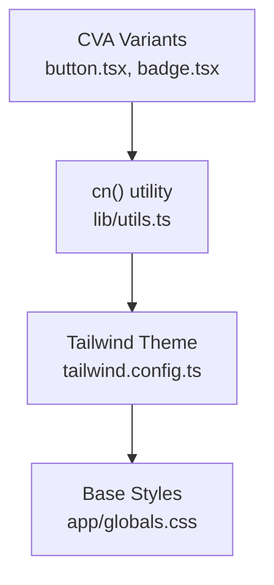

**Diagram sources**
- [button.tsx](file://apps/web/components/ui/button.tsx#L8-L32)
- [badge.tsx](file://apps/web/components/ui/badge.tsx#L8-L23)
- [utils.ts](file://apps/web/lib/utils.ts#L8-L10)
- [tailwind.config.ts](file://apps/web/tailwind.config.ts#L10-L54)
- [globals.css](file://apps/web/app/globals.css#L5-L36)

## Detailed Component Analysis

### Button
- Composition: Uses forwardRef, CVA variants, and className merging.
- Props:
  - variant: Selects preset color/background/text combinations.
  - size: Controls height, padding, and icon sizing.
  - asChild: Renders a span wrapper to compose semantics.
  - Inherits button attributes (onClick, disabled, etc.).
- Variants and sizes:
  - Variants: default, destructive, outline, secondary, ghost, link.
  - Sizes: default, sm, lg, icon.
- Accessibility: Inherits native button behavior; focus-visible ring applied via variants.
- Customization:
  - Add className to augment base styles.
  - Use asChild to render anchor or span for semantic correctness.

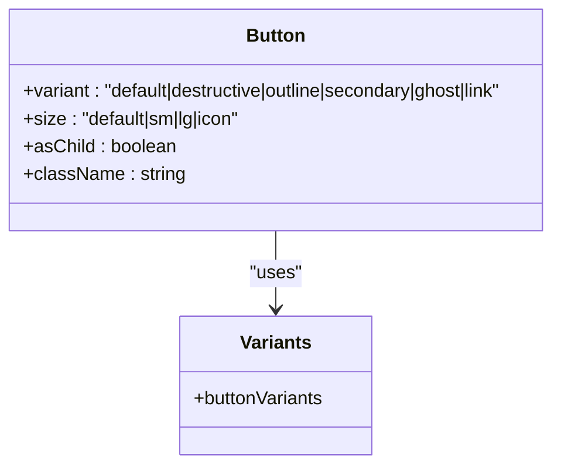

**Diagram sources**
- [button.tsx](file://apps/web/components/ui/button.tsx#L34-L54)

**Section sources**
- [button.tsx](file://apps/web/components/ui/button.tsx#L1-L55)

### Input
- Composition: forwardRef input with focus-visible ring and disabled state styling.
- Props:
  - type: HTML input type.
  - Inherits input attributes (value, onChange, placeholder, etc.).
- Customization:
  - Extend className to adjust padding, borders, and focus styles.
  - Combine with Label for accessible forms.

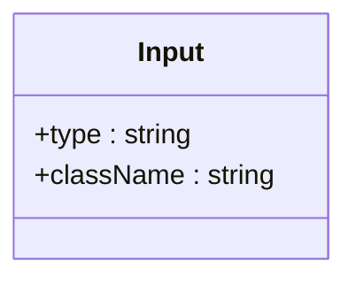

**Diagram sources**
- [input.tsx](file://apps/web/components/ui/input.tsx#L7-L22)

**Section sources**
- [input.tsx](file://apps/web/components/ui/input.tsx#L1-L23)

### Badge
- Composition: Stateless div with CVA variant selection.
- Props:
  - variant: default, secondary, destructive, outline.
- Customization:
  - Add className to override variant styles.

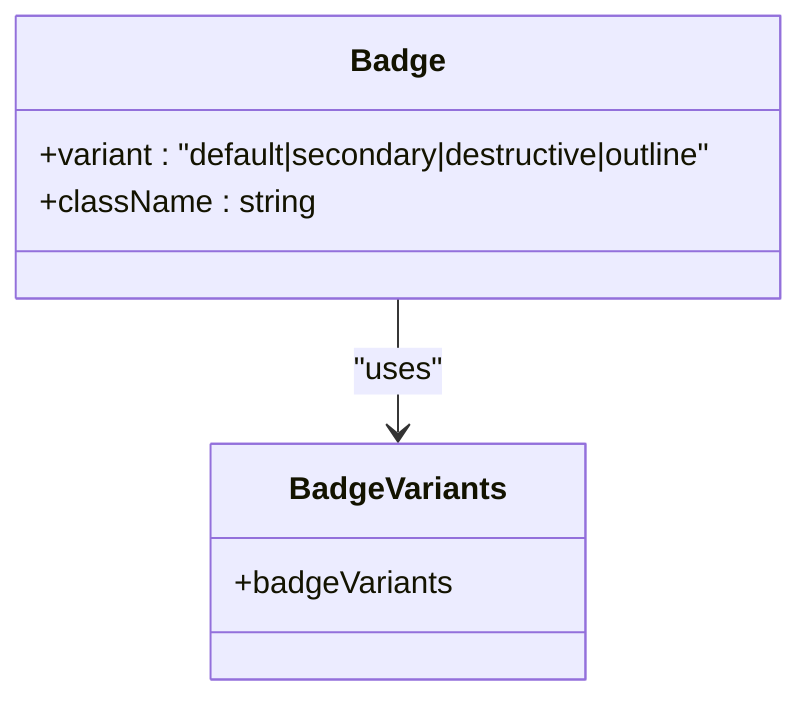

**Diagram sources**
- [badge.tsx](file://apps/web/components/ui/badge.tsx#L25-L35)

**Section sources**
- [badge.tsx](file://apps/web/components/ui/badge.tsx#L1-L36)

### Card
- Composition: Multiple subcomponents for structured content.
- Subcomponents:
  - Card: Outer container with border and shadow.
  - CardHeader: Top area with vertical spacing.
  - CardTitle: Heading element with typography.
  - CardDescription: Muted description text.
  - CardContent: Main content area with top padding reset.
  - CardFooter: Bottom action area with alignment.
- Customization:
  - Override className per slot to adjust spacing and layout.

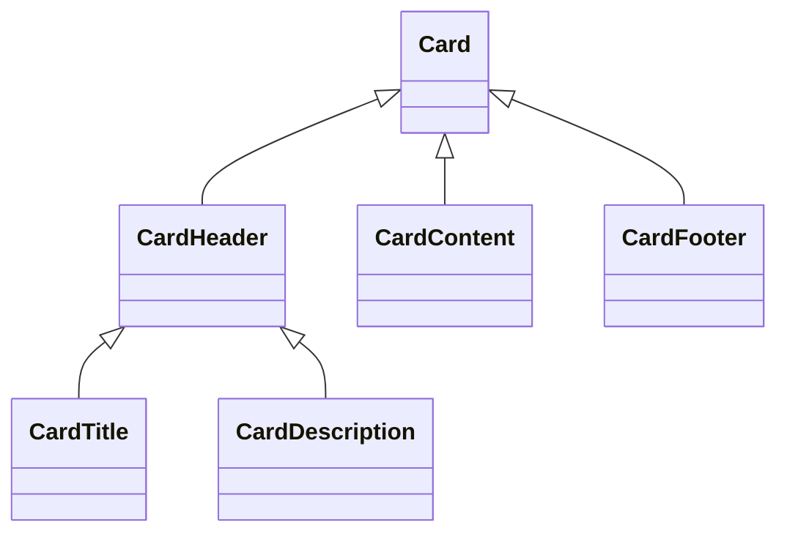

**Diagram sources**
- [card.tsx](file://apps/web/components/ui/card.tsx#L7-L78)

**Section sources**
- [card.tsx](file://apps/web/components/ui/card.tsx#L1-L79)

### Dialog
- Composition: Radix UI primitives with portal rendering for overlays.
- Subcomponents:
  - Root, Trigger, Portal, Close, Overlay, Content, Header, Footer, Title, Description.
- Behavior:
  - Overlay and Content are positioned centrally and rendered via portal.
  - Focus management and keyboard interactions handled by Radix.
- Customization:
  - Adjust className on Content and Overlay to change layout and appearance.

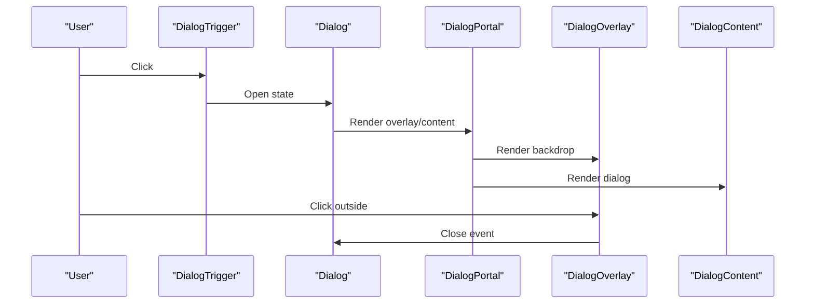

**Diagram sources**
- [dialog.tsx](file://apps/web/components/ui/dialog.tsx#L10-L48)

**Section sources**
- [dialog.tsx](file://apps/web/components/ui/dialog.tsx#L1-L114)

### Table
- Composition: Wrapper div for horizontal scrolling plus table structure.
- Subcomponents:
  - Table, TableHeader, TableBody, TableRow, TableHead, TableCell.
- Behavior:
  - Hover and border styles on rows; last row border removed.
- Customization:
  - Extend className on Table and individual cells/rows for alignment and spacing.

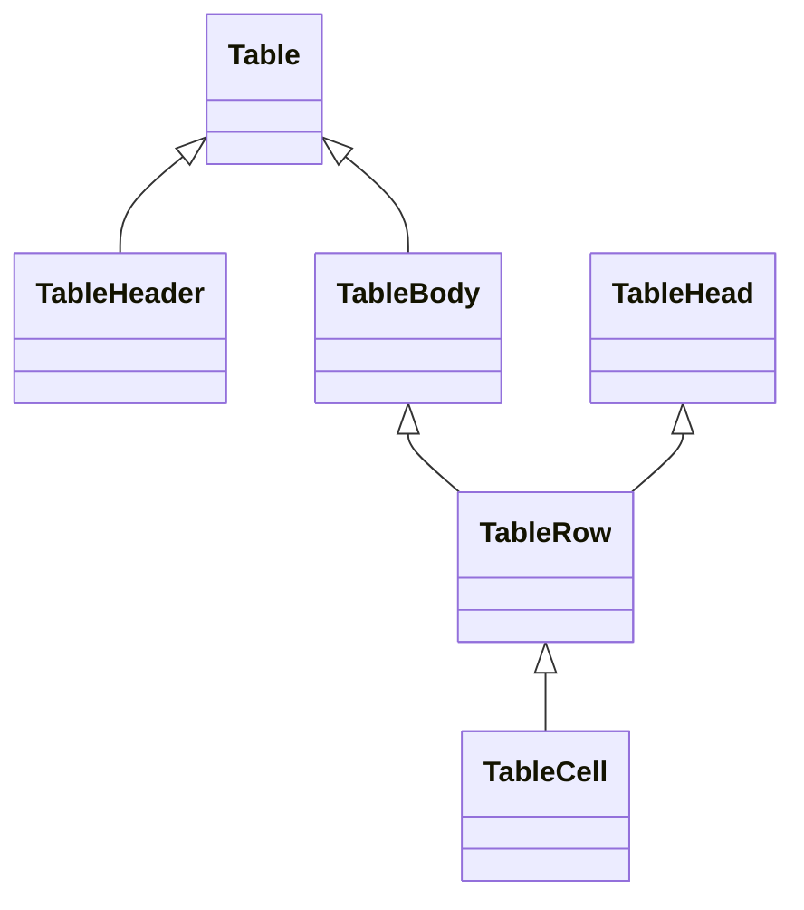

**Diagram sources**
- [table.tsx](file://apps/web/components/ui/table.tsx#L7-L83)

**Section sources**
- [table.tsx](file://apps/web/components/ui/table.tsx#L1-L84)

### Tabs
- Composition: Radix UI Tabs with styled list, triggers, and content areas.
- Subcomponents:
  - Tabs, TabsList, TabsTrigger, TabsContent.
- Behavior:
  - Active state styling via data attributes; focus-visible rings included.
- Customization:
  - Modify TabsList and TabsTrigger className to adjust layout and colors.

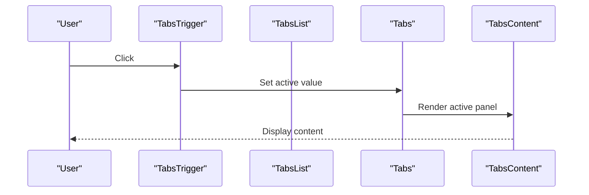

**Diagram sources**
- [tabs.tsx](file://apps/web/components/ui/tabs.tsx#L10-L57)

**Section sources**
- [tabs.tsx](file://apps/web/components/ui/tabs.tsx#L1-L58)

### Skeleton
- Composition: Div with pulse animation and muted background.
- Props:
  - className: Additional classes for shape and size.
- Use cases:
  - Placeholder while fetching data; composes with Card and Table.

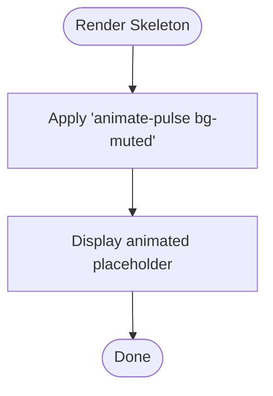

**Diagram sources**
- [skeleton.tsx](file://apps/web/components/ui/skeleton.tsx#L6-L18)

**Section sources**
- [skeleton.tsx](file://apps/web/components/ui/skeleton.tsx#L1-L19)

### Progress
- Composition: Radix UI Progress primitive with indicator translation.
- Props:
  - value: Numeric percentage determining indicator width.
- Behavior:
  - Indicator translates to show completion; controlled via style transform.

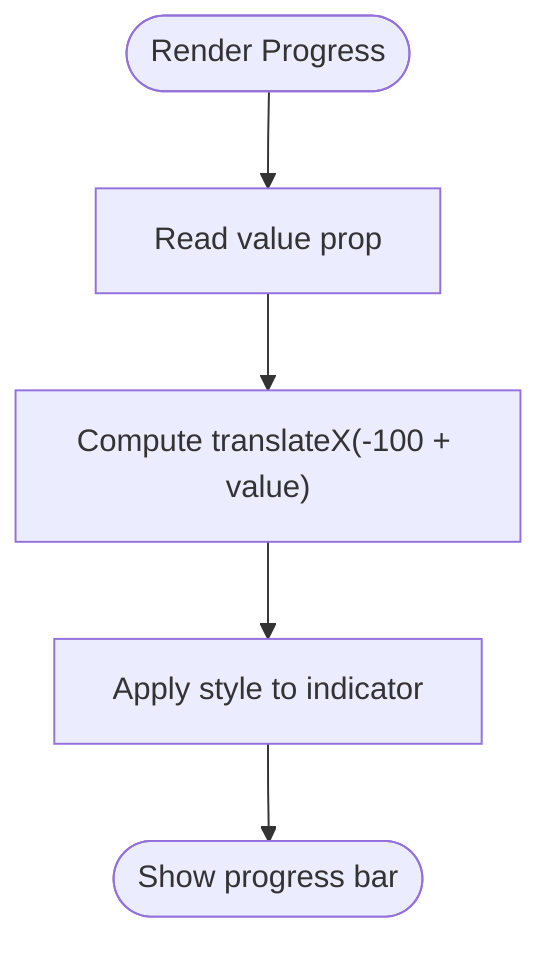

**Diagram sources**
- [progress.tsx](file://apps/web/components/ui/progress.tsx#L13-L26)

**Section sources**
- [progress.tsx](file://apps/web/components/ui/progress.tsx#L1-L31)

### Checkbox
- Composition: Radix UI Checkbox with check indicator.
- Props:
  - Inherits primitive attributes; checked state managed internally.
- Behavior:
  - Focus-visible ring and disabled state styling; indicator renders Check icon.

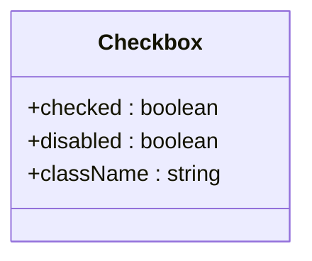

**Diagram sources**
- [checkbox.tsx](file://apps/web/components/ui/checkbox.tsx#L11-L32)

**Section sources**
- [checkbox.tsx](file://apps/web/components/ui/checkbox.tsx#L1-L33)

### Label
- Composition: forwardRef label with peer-* utilities support.
- Props:
  - Inherits label attributes; paired with form controls for accessibility.
- Use with:
  - Input, Checkbox, Radio via “for” and peer selectors.

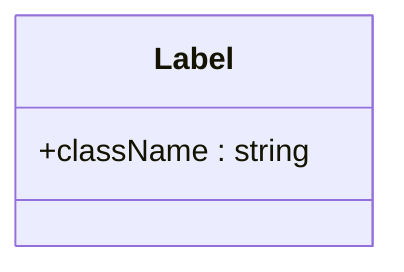

**Diagram sources**
- [label.tsx](file://apps/web/components/ui/label.tsx#L7-L22)

**Section sources**
- [label.tsx](file://apps/web/components/ui/label.tsx#L1-L23)

### Separator
- Composition: forwardRef div with orientation prop.
- Props:
  - orientation: horizontal or vertical.
- Use cases:
  - Divide sections in dialogs, cards, and navigation.

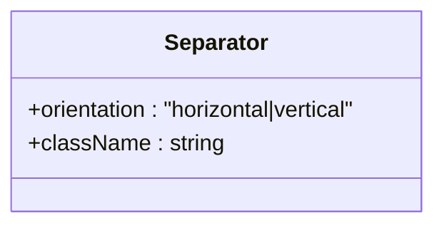

**Diagram sources**
- [separator.tsx](file://apps/web/components/ui/separator.tsx#L7-L25)

**Section sources**
- [separator.tsx](file://apps/web/components/ui/separator.tsx#L1-L26)

## Dependency Analysis
The components share a common dependency chain: CVA variants and className merging via the utility function, which relies on Tailwind’s theme tokens configured in the Tailwind config and base styles in globals.css.

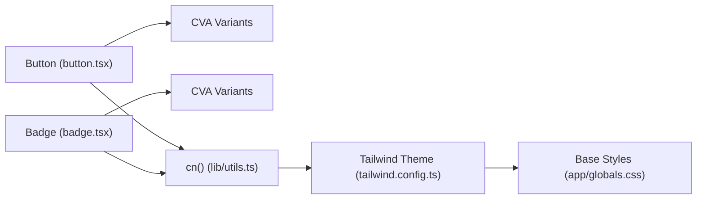

**Diagram sources**
- [button.tsx](file://apps/web/components/ui/button.tsx#L8-L32)
- [badge.tsx](file://apps/web/components/ui/badge.tsx#L8-L23)
- [utils.ts](file://apps/web/lib/utils.ts#L8-L10)
- [tailwind.config.ts](file://apps/web/tailwind.config.ts#L10-L54)
- [globals.css](file://apps/web/app/globals.css#L5-L36)

**Section sources**
- [button.tsx](file://apps/web/components/ui/button.tsx#L1-L55)
- [badge.tsx](file://apps/web/components/ui/badge.tsx#L1-L36)
- [utils.ts](file://apps/web/lib/utils.ts#L1-L11)
- [tailwind.config.ts](file://apps/web/tailwind.config.ts#L1-L60)
- [globals.css](file://apps/web/app/globals.css#L1-L124)

## Performance Considerations
- Prefer minimal className overrides to reduce style churn.
- Use Skeleton and Progress sparingly during heavy computations to avoid layout thrashing.
- Keep Dialog and Tabs content lightweight; defer heavy mounts until activation.
- Reuse shared utilities (cn) to prevent redundant class concatenation.

## Accessibility Features
- Buttons: Native button semantics; focus-visible rings for keyboard navigation.
- Inputs and Labels: Pair Label with Input via htmlFor or peer-* utilities for screen reader compatibility.
- Dialog: Radix UI manages focus trapping and ARIA roles; ensure Titles and Descriptions are present.
- Tabs: Radix handles keyboard navigation and ARIA attributes; keep content panels concise.
- Checkbox: Radix provides accessible state management and keyboard interactions.

## Responsive Design Patterns
- Use Tailwind’s responsive prefixes (sm:, md:, lg:, etc.) on className props to adapt layouts.
- Tables automatically scroll horizontally; ensure sufficient viewport width on mobile.
- Dialog Content centers with max-width constraints; test on small screens for readability.
- Skeleton placeholders adapt to container widths; animate-pulse is device-friendly.

## Component Composition and Inheritance
- Composition patterns:
  - Button asChild enables semantic wrappers (e.g., anchor inside a button).
  - Card subcomponents compose to create consistent content blocks.
  - Dialog uses Portal to render overlay outside DOM hierarchy.
- Inheritance:
  - Components inherit HTML attributes from their underlying elements or Radix primitives.
  - Variants encapsulate style inheritance via CVA, allowing overrides with className.

## Usage Examples and Integration Guidelines
- Button
  - Use variant for intent (default, destructive, outline, secondary, ghost, link).
  - Use size for density (default, sm, lg, icon).
  - Use asChild to wrap links or spans when semantic correctness requires it.
  - Reference: [button.tsx](file://apps/web/components/ui/button.tsx#L34-L54)

- Input
  - Combine with Label for accessible forms.
  - Use className to customize padding and focus ring color.
  - Reference: [input.tsx](file://apps/web/components/ui/input.tsx#L7-L22)

- Badge
  - Use variant to reflect status (default, secondary, destructive, outline).
  - Reference: [badge.tsx](file://apps/web/components/ui/badge.tsx#L25-L35)

- Card
  - Compose CardHeader → CardTitle/Description → CardContent → CardFooter.
  - Reference: [card.tsx](file://apps/web/components/ui/card.tsx#L7-L78)

- Dialog
  - Wrap DialogTrigger around actionable elements; place DialogContent with DialogHeader/Footer and Title/Description.
  - Reference: [dialog.tsx](file://apps/web/components/ui/dialog.tsx#L10-L113)

- Table
  - Use Table with TableHeader/TableBody and TableRow/TableCell for structured data.
  - Reference: [table.tsx](file://apps/web/components/ui/table.tsx#L7-L83)

- Tabs
  - Use TabsList with TabsTrigger for navigation; render content in TabsContent.
  - Reference: [tabs.tsx](file://apps/web/components/ui/tabs.tsx#L10-L57)

- Skeleton
  - Place Skeleton inside containers to indicate loading states.
  - Reference: [skeleton.tsx](file://apps/web/components/ui/skeleton.tsx#L6-L18)

- Progress
  - Pass numeric value to reflect completion; ensure value is within expected bounds.
  - Reference: [progress.tsx](file://apps/web/components/ui/progress.tsx#L10-L30)

- Checkbox
  - Pair with Label for accessible selection; use className to adjust size or colors.
  - Reference: [checkbox.tsx](file://apps/web/components/ui/checkbox.tsx#L11-L32)

- Label
  - Use with Input or Checkbox to improve accessibility.
  - Reference: [label.tsx](file://apps/web/components/ui/label.tsx#L7-L22)

- Separator
  - Use horizontal for section breaks; vertical for sidebars.
  - Reference: [separator.tsx](file://apps/web/components/ui/separator.tsx#L7-L25)

## Troubleshooting Guide
- Variant styles not applying
  - Ensure className order allows overrides; use the utility function to merge classes safely.
  - Verify Tailwind theme tokens are defined and not overridden unexpectedly.
  - References: [utils.ts](file://apps/web/lib/utils.ts#L8-L10), [tailwind.config.ts](file://apps/web/tailwind.config.ts#L10-L54)

- Dialog not closing or focus issues
  - Confirm DialogTrigger and DialogClose are wired correctly.
  - Ensure DialogPortal renders overlay and content.
  - Reference: [dialog.tsx](file://apps/web/components/ui/dialog.tsx#L10-L48)

- Table overflow or scroll issues
  - Table wraps itself in a scrollable container; ensure parent constraints are set.
  - Reference: [table.tsx](file://apps/web/components/ui/table.tsx#L10-L18)

- Skeleton not animating
  - Verify the pulse animation class is present and Tailwind compiles animations.
  - Reference: [skeleton.tsx](file://apps/web/components/ui/skeleton.tsx#L6-L18), [globals.css](file://apps/web/app/globals.css#L87-L89)

- Progress indicator not visible
  - Ensure value prop is a number and within expected range; confirm indicator styles apply.
  - Reference: [progress.tsx](file://apps/web/components/ui/progress.tsx#L13-L26)

- Checkbox focus or checked state issues
  - Confirm Radix Checkbox is mounted client-side and className does not hide indicator.
  - Reference: [checkbox.tsx](file://apps/web/components/ui/checkbox.tsx#L11-L32)

## Conclusion
This UI component library provides a cohesive, theme-aware set of primitives designed for accessibility, responsiveness, and maintainability. By leveraging CVA for variants, Radix UI for interactivity, and Tailwind for styling, the components offer predictable behavior and easy customization. Follow the composition patterns and integration guidelines to ensure consistent UX and performance across the application.