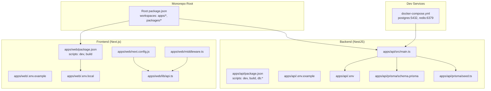
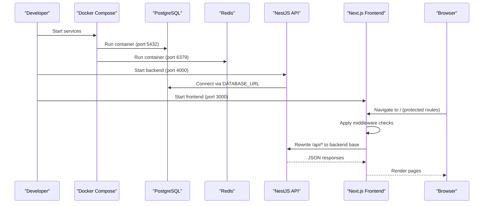
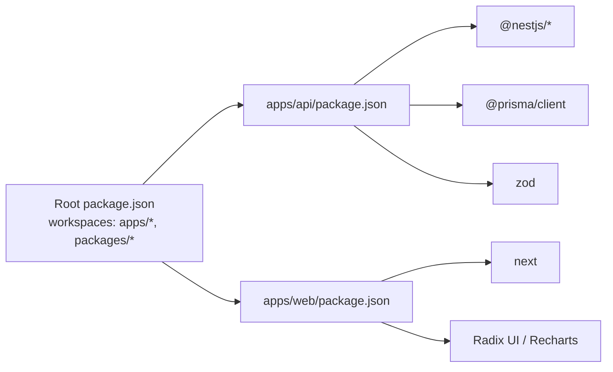

# Getting Started

<cite>
**Referenced Files in This Document**
- [README.md](file://README.md)
- [package.json](file://package.json)
- [docker-compose.yml](file://docker-compose.yml)
- [apps/api/package.json](file://apps/api/package.json)
- [apps/web/package.json](file://apps/web/package.json)
- [apps/api/.env.example](file://apps/api/.env.example)
- [apps/web/.env.example](file://apps/web/.env.example)
- [apps/api/prisma/schema.prisma](file://apps/api/prisma/schema.prisma)
- [apps/api/prisma/seed.ts](file://apps/api/prisma/seed.ts)
- [apps/api/src/main.ts](file://apps/api/src/main.ts)
- [apps/web/next.config.js](file://apps/web/next.config.js)
- [apps/web/middleware.ts](file://apps/web/middleware.ts)
- [apps/web/lib/api.ts](file://apps/web/lib/api.ts)
- [DEPLOYMENT.md](file://DEPLOYMENT.md)
</cite>

## Table of Contents
1. [Introduction](#introduction)
2. [Project Structure](#project-structure)
3. [Core Components](#core-components)
4. [Architecture Overview](#architecture-overview)
5. [Detailed Component Analysis](#detailed-component-analysis)
6. [Dependency Analysis](#dependency-analysis)
7. [Performance Considerations](#performance-considerations)
8. [Troubleshooting Guide](#troubleshooting-guide)
9. [Conclusion](#conclusion)
10. [Appendices](#appendices)

## Introduction
This guide helps you set up and run Yaz Okulu Var Mı? locally from cloning the repository to launching both the backend and frontend applications. It covers prerequisites, environment configuration, database setup with Prisma migrations, and local development server startup. You will also find verification steps, example credentials for testing, and seed data setup.

## Project Structure
The project is a monorepo with two applications:
- Backend: NestJS API under apps/api
- Frontend: Next.js 14 App Router under apps/web
- Shared Prisma schema and seed under apps/api/prisma
- Docker Compose for PostgreSQL and Redis services

**Diagram sources**
- [package.json](file://package.json#L6-L9)
- [apps/api/src/main.ts](file://apps/api/src/main.ts#L1-L34)
- [apps/api/package.json](file://apps/api/package.json#L6-L19)
- [apps/web/package.json](file://apps/web/package.json#L6-L11)
- [apps/api/.env.example](file://apps/api/.env.example#L6-L19)
- [apps/web/.env.example](file://apps/web/.env.example#L6-L12)
- [apps/api/prisma/schema.prisma](file://apps/api/prisma/schema.prisma#L7-L10)
- [apps/api/prisma/seed.ts](file://apps/api/prisma/seed.ts#L1-L117)
- [apps/web/next.config.js](file://apps/web/next.config.js#L14-L22)
- [apps/web/middleware.ts](file://apps/web/middleware.ts#L25-L102)
- [apps/web/lib/api.ts](file://apps/web/lib/api.ts#L7-L8)
- [docker-compose.yml](file://docker-compose.yml#L8-L29)

**Section sources**
- [README.md](file://README.md#L36-L95)
- [package.json](file://package.json#L6-L9)

## Core Components
- Backend API (NestJS)
  - Entry point initializes global prefix, CORS, and listens on configured port.
  - Uses Prisma client and Zod validation pipeline.
- Frontend (Next.js)
  - App Router with protected routes via middleware.
  - API client wraps fetch with token injection and centralized error handling.
  - Rewrites /api/* to backend base URL for seamless requests.
- Database (PostgreSQL)
  - Prisma schema defines enums, relations, and indexes.
  - Seed script creates admin, universities, and courses for local testing.
- Dev Services (Docker)
  - PostgreSQL 16 and Redis containers exposed on standard ports.

**Section sources**
- [apps/api/src/main.ts](file://apps/api/src/main.ts#L10-L31)
- [apps/web/middleware.ts](file://apps/web/middleware.ts#L25-L102)
- [apps/web/lib/api.ts](file://apps/web/lib/api.ts#L10-L36)
- [apps/api/prisma/schema.prisma](file://apps/api/prisma/schema.prisma#L18-L182)
- [apps/api/prisma/seed.ts](file://apps/api/prisma/seed.ts#L11-L107)
- [docker-compose.yml](file://docker-compose.yml#L8-L29)

## Architecture Overview
High-level flow during development:
- Docker Compose starts PostgreSQL and Redis.
- Backend loads environment variables, connects to DB, and serves APIs under /api.
- Frontend proxies /api/* to backend via Next.js rewrites.
- Middleware enforces authentication and role-based routing.

**Diagram sources**
- [docker-compose.yml](file://docker-compose.yml#L8-L29)
- [apps/api/src/main.ts](file://apps/api/src/main.ts#L20-L29)
- [apps/web/next.config.js](file://apps/web/next.config.js#L14-L22)
- [apps/web/middleware.ts](file://apps/web/middleware.ts#L25-L102)

## Detailed Component Analysis

### Prerequisites
- Node.js >= 18
- Docker Desktop
- Git

These are required to run the development environment and services.

**Section sources**
- [README.md](file://README.md#L211-L216)
- [package.json](file://package.json#L20-L22)

### Step-by-Step Installation
1. Clone the repository and enter the project directory.
2. Install monorepo dependencies at the root.
3. Start Docker services for PostgreSQL and Redis.
4. Configure environment variables for backend and frontend.
5. Prepare the database with Prisma client generation, migrations, and seed data.
6. Start backend and frontend servers in separate terminals.
7. Optionally inspect the database with Prisma Studio or pgAdmin.

Verification steps:
- Confirm backend responds at http://localhost:4000/.
- Confirm frontend responds at http://localhost:3000/.
- Verify database connection and seed data via Prisma Studio.

**Section sources**
- [README.md](file://README.md#L217-L282)
- [docker-compose.yml](file://docker-compose.yml#L8-L29)
- [apps/api/.env.example](file://apps/api/.env.example#L6-L19)
- [apps/web/.env.example](file://apps/web/.env.example#L6-L12)
- [apps/api/package.json](file://apps/api/package.json#L11-L16)

### Environment Variables
Backend (.env):
- DATABASE_URL: PostgreSQL connection string matching Docker service.
- JWT_SECRET: Secret key for JWT signing.
- PORT: Backend listening port.
- FRONTEND_URL: Origin for CORS.
- REDIS_URL: Redis connection string (future cache).

Frontend (.env.local):
- NEXT_PUBLIC_API_URL: Publicly accessible backend base URL ending with /api.
- API_URL: Server-side backend base URL without /api suffix.

Root package.json scripts provide convenient commands for dev/build and DB tasks.

**Section sources**
- [apps/api/.env.example](file://apps/api/.env.example#L6-L19)
- [apps/web/.env.example](file://apps/web/.env.example#L6-L12)
- [package.json](file://package.json#L10-L19)

### Database Setup with Prisma Migrations
- Generate Prisma client.
- Run dev migration to apply schema to PostgreSQL.
- Seed development data (admin, universities, courses).

Prisma schema defines:
- Enums for Role and UserStatus.
- Relations between University, User, Course, and audit tables.
- Indexes for performance on common filters and joins.

Seed script creates:
- Admin user with role ADMIN and status ACTIVE.
- Verified universities (Istanbul Tech, METU, Ege).
- Example courses per university.

**Section sources**
- [README.md](file://README.md#L257-L270)
- [apps/api/prisma/schema.prisma](file://apps/api/prisma/schema.prisma#L18-L182)
- [apps/api/prisma/seed.ts](file://apps/api/prisma/seed.ts#L11-L107)

### Local Development Servers
- Backend: Start NestJS in watch mode on port 4000.
- Frontend: Start Next.js on port 3000.

The frontend rewrites /api/* to the backend base URL, enabling clean API calls from the browser.

**Section sources**
- [README.md](file://README.md#L272-L282)
- [apps/api/src/main.ts](file://apps/api/src/main.ts#L14-L29)
- [apps/web/next.config.js](file://apps/web/next.config.js#L14-L22)

### Example Credentials and Seed Data
After seeding, you can log in with:
- Admin: admin@yazokuluvarmi.com / admin123
- University: yetkili@itu.edu.tr / uni12345

Seed data includes:
- Verified universities (Istanbul Tech, METU, Ege).
- Courses per university with pricing, credits, and online/offline modes.

**Section sources**
- [README.md](file://README.md#L296-L307)
- [apps/api/prisma/seed.ts](file://apps/api/prisma/seed.ts#L14-L104)

### Frontend Authentication and Routing
- Middleware decodes JWT from cookie and enforces:
  - Redirect to login if missing token.
  - Role-based redirection (STUDENT vs UNIVERSITY/ADMIN).
  - Pending status handling for UNIVERSITY users.
  - Prevent logged-in users from accessing login/register.
- API client injects Authorization header when token is present.

**Section sources**
- [apps/web/middleware.ts](file://apps/web/middleware.ts#L25-L102)
- [apps/web/lib/api.ts](file://apps/web/lib/api.ts#L10-L36)

## Dependency Analysis
- Root package.json defines workspaces for apps and packages, and convenience scripts for dev/build and DB operations.
- Backend depends on NestJS, Prisma Client, Passport/JWT, and Zod.
- Frontend depends on Next.js, Radix UI, Recharts, and Tailwind-based UI primitives.

**Diagram sources**
- [package.json](file://package.json#L6-L9)
- [apps/api/package.json](file://apps/api/package.json#L20-L54)
- [apps/web/package.json](file://apps/web/package.json#L12-L36)

**Section sources**
- [package.json](file://package.json#L6-L9)
- [apps/api/package.json](file://apps/api/package.json#L20-L54)
- [apps/web/package.json](file://apps/web/package.json#L12-L36)

## Performance Considerations
- PostgreSQL native enums and JSON fields are used for precise data modeling.
- Indexes on frequently filtered columns (city, role, status, name/code, composite) improve query performance.
- Decimal precision for currency ensures accurate financial calculations.
- Debounce and manual apply modes in UI reduce unnecessary backend load.

[No sources needed since this section provides general guidance]

## Troubleshooting Guide
Common setup issues and resolutions:
- Docker services not starting:
  - Ensure Docker Desktop is running and ports 5432/6379 are free.
- Database connection failures:
  - Confirm DATABASE_URL matches Docker service host/port and schema.
- Prisma client or migration errors:
  - Regenerate client and run dev migration in apps/api.
- Seed script errors:
  - Ensure Prisma client is generated and migration is applied before seeding.
- Frontend API 404 or double /api path:
  - Verify NEXT_PUBLIC_API_URL ends with /api and API_URL does not include /api.
- Middleware redirect loops:
  - Check cookies for valid JWT and user status.
- Node/npm version conflicts:
  - Use Node >= 18 as required by engines and scripts.

**Section sources**
- [README.md](file://README.md#L230-L236)
- [README.md](file://README.md#L257-L270)
- [apps/web/next.config.js](file://apps/web/next.config.js#L14-L22)
- [apps/web/middleware.ts](file://apps/web/middleware.ts#L25-L102)
- [DEPLOYMENT.md](file://DEPLOYMENT.md#L189-L258)

## Conclusion
You now have the complete setup to develop and run Yaz Okulu Var Mı? locally. Start Docker services, configure environment variables, prepare the database with Prisma, and launch both backend and frontend servers. Use the provided example credentials to explore the seeded data and verify functionality.

[No sources needed since this section summarizes without analyzing specific files]

## Appendices

### Verification Checklist
- Docker services running:
  - postgres:5432 and redis:6379
- Backend reachable:
  - http://localhost:4000/
- Frontend reachable:
  - http://localhost:3000/
- Database seeded:
  - Admin and sample universities/courses present
- API client works:
  - Auth endpoints return tokens and user data

**Section sources**
- [docker-compose.yml](file://docker-compose.yml#L8-L29)
- [apps/api/src/main.ts](file://apps/api/src/main.ts#L28-L31)
- [apps/web/next.config.js](file://apps/web/next.config.js#L14-L22)
- [apps/api/prisma/seed.ts](file://apps/api/prisma/seed.ts#L11-L107)