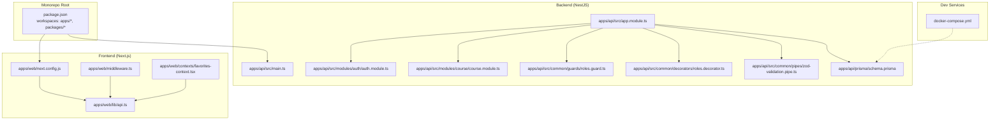
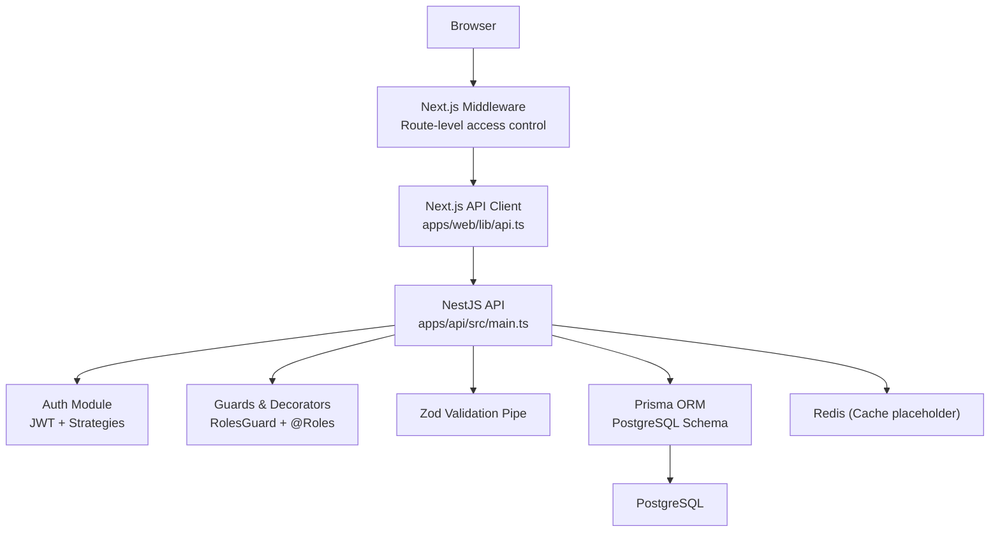
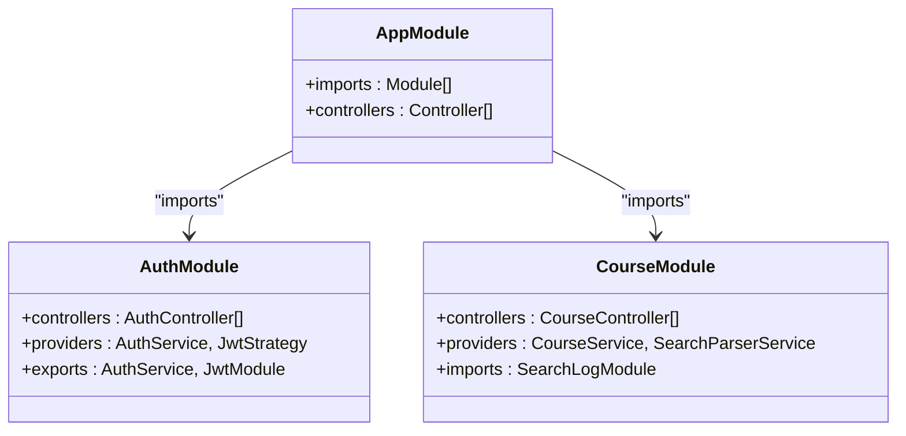
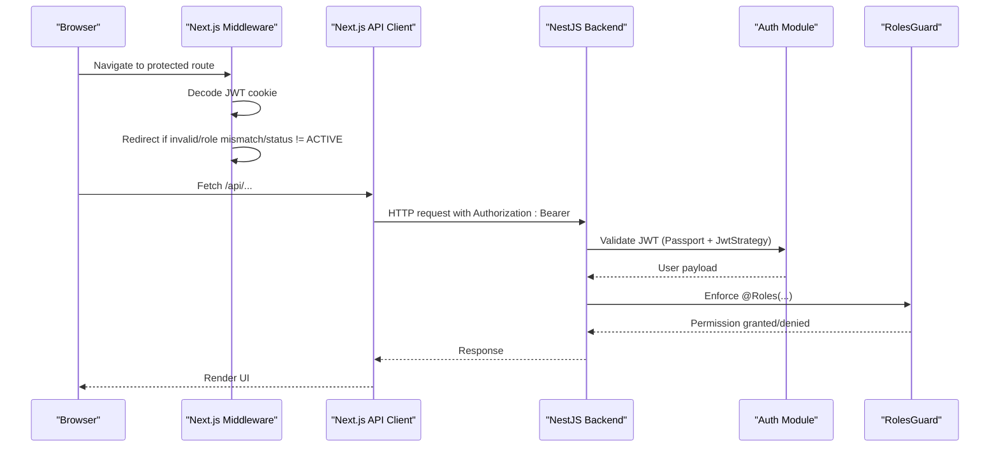
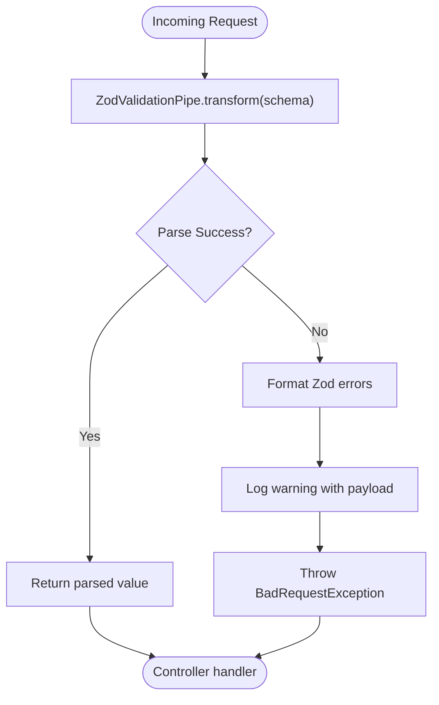
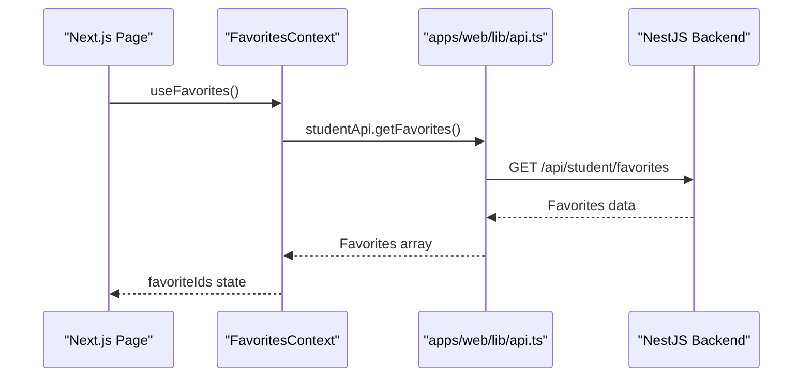
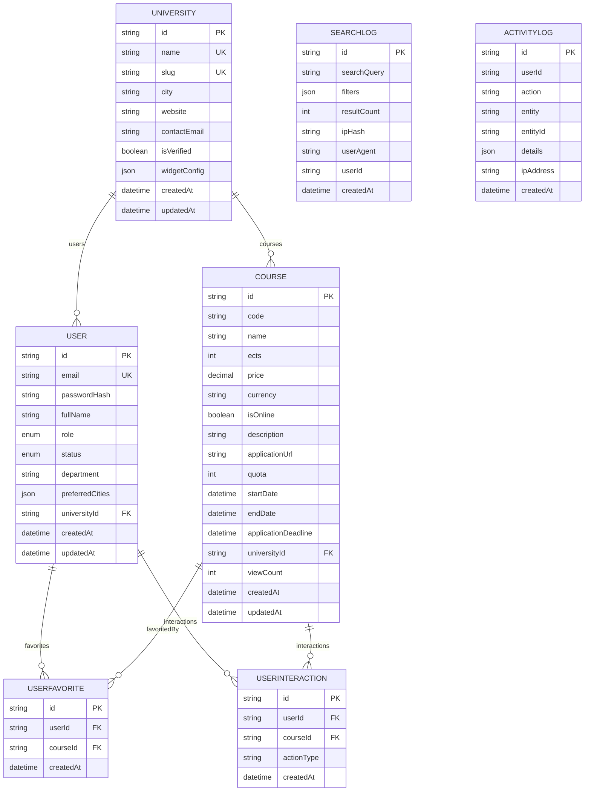
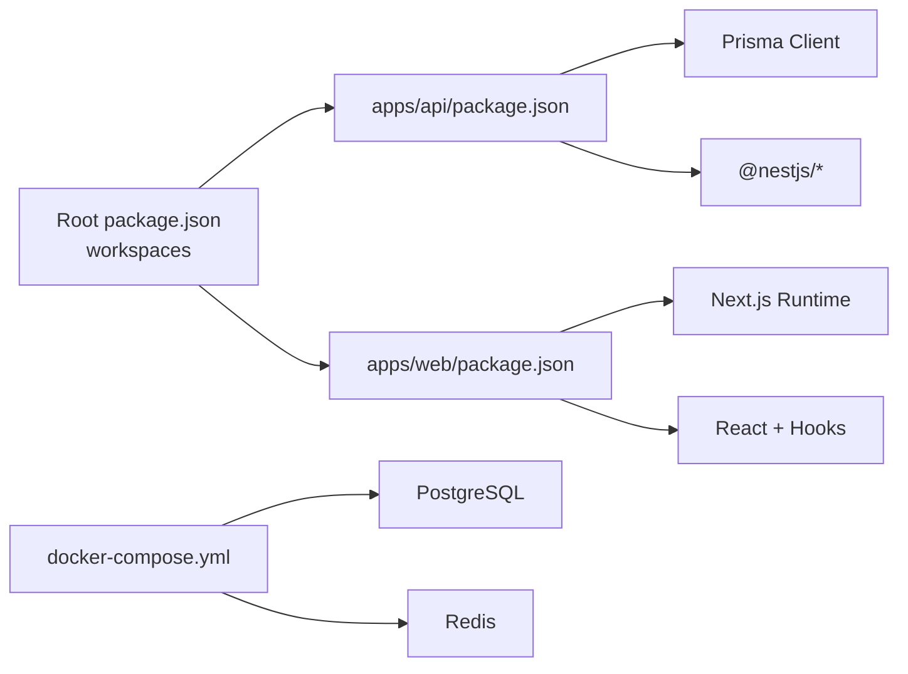

# Architecture Overview

<cite>
**Referenced Files in This Document**
- [README.md](file://README.md)
- [package.json](file://package.json)
- [docker-compose.yml](file://docker-compose.yml)
- [apps/api/src/main.ts](file://apps/api/src/main.ts)
- [apps/api/src/app.module.ts](file://apps/api/src/app.module.ts)
- [apps/api/src/modules/auth/auth.module.ts](file://apps/api/src/modules/auth/auth.module.ts)
- [apps/api/src/modules/course/course.module.ts](file://apps/api/src/modules/course/course.module.ts)
- [apps/api/src/common/guards/roles.guard.ts](file://apps/api/src/common/guards/roles.guard.ts)
- [apps/api/src/common/decorators/roles.decorator.ts](file://apps/api/src/common/decorators/roles.decorator.ts)
- [apps/api/src/common/pipes/zod-validation.pipe.ts](file://apps/api/src/common/pipes/zod-validation.pipe.ts)
- [apps/api/prisma/schema.prisma](file://apps/api/prisma/schema.prisma)
- [apps/web/next.config.js](file://apps/web/next.config.js)
- [apps/web/middleware.ts](file://apps/web/middleware.ts)
- [apps/web/lib/api.ts](file://apps/web/lib/api.ts)
- [apps/web/contexts/favorites-context.tsx](file://apps/web/contexts/favorites-context.tsx)
</cite>

## Table of Contents
1. [Introduction](#introduction)
2. [Project Structure](#project-structure)
3. [Core Components](#core-components)
4. [Architecture Overview](#architecture-overview)
5. [Detailed Component Analysis](#detailed-component-analysis)
6. [Dependency Analysis](#dependency-analysis)
7. [Performance Considerations](#performance-considerations)
8. [Troubleshooting Guide](#troubleshooting-guide)
9. [Conclusion](#conclusion)

## Introduction
This document presents a comprehensive architecture overview of Yaz Okulu Var Mı?, a monorepo platform that connects Turkish universities’ summer course offerings with students. The system consists of:
- A NestJS backend API providing REST endpoints, authentication, authorization, and data persistence via Prisma and PostgreSQL.
- A Next.js 14 frontend application implementing route-based access control, client-side state management, and integration with the backend through a centralized API client.

The architecture emphasizes modular NestJS design, robust security with JWT and RBAC, typed validation with Zod, and a clean separation of concerns between frontend and backend. Docker Compose supports local development with PostgreSQL and Redis.

## Project Structure
The repository follows a monorepo layout managed by npm workspaces:
- Root manages shared scripts and workspace configuration.
- apps/api: NestJS backend with feature modules, guards, pipes, and Prisma schema.
- apps/web: Next.js frontend with pages, components, contexts, and API client.
- docker-compose.yml: Development services for PostgreSQL and Redis.
- packages/types: Shared TypeScript types (not analyzed here).

**Diagram sources**
- [package.json](file://package.json#L6-L18)
- [apps/api/src/main.ts](file://apps/api/src/main.ts#L10-L31)
- [apps/api/src/app.module.ts](file://apps/api/src/app.module.ts#L30-L48)
- [apps/api/src/modules/auth/auth.module.ts](file://apps/api/src/modules/auth/auth.module.ts#L13-L28)
- [apps/api/src/modules/course/course.module.ts](file://apps/api/src/modules/course/course.module.ts#L11-L16)
- [apps/api/src/common/guards/roles.guard.ts](file://apps/api/src/common/guards/roles.guard.ts#L20-L54)
- [apps/api/src/common/decorators/roles.decorator.ts](file://apps/api/src/common/decorators/roles.decorator.ts#L6-L15)
- [apps/api/src/common/pipes/zod-validation.pipe.ts](file://apps/api/src/common/pipes/zod-validation.pipe.ts#L14-L44)
- [apps/api/prisma/schema.prisma](file://apps/api/prisma/schema.prisma#L7-L14)
- [apps/web/next.config.js](file://apps/web/next.config.js#L14-L22)
- [apps/web/middleware.ts](file://apps/web/middleware.ts#L25-L102)
- [apps/web/lib/api.ts](file://apps/web/lib/api.ts#L10-L36)
- [apps/web/contexts/favorites-context.tsx](file://apps/web/contexts/favorites-context.tsx#L29-L131)
- [docker-compose.yml](file://docker-compose.yml#L6-L29)

**Section sources**
- [README.md](file://README.md#L36-L95)
- [package.json](file://package.json#L6-L18)

## Core Components
- Backend entrypoint initializes NestJS, sets global prefix, enables CORS, registers a global exception filter, and listens on the configured port.
- AppModule aggregates feature modules (auth, user, university, course, search-log, widget, admin, student) and exposes a health check endpoint.
- Security stack includes JWT authentication, Passport strategies, a roles guard, and role decorators for RBAC.
- Validation pipeline uses Zod with a custom validation pipe to enforce typed request validation.
- Data access uses Prisma with a PostgreSQL schema supporting enums, JSON fields, and composite indexes.
- Frontend integrates with the backend via a centralized API client, Next.js middleware for route-level access control, and a React context for shared favorites state.

**Section sources**
- [apps/api/src/main.ts](file://apps/api/src/main.ts#L10-L31)
- [apps/api/src/app.module.ts](file://apps/api/src/app.module.ts#L30-L48)
- [apps/api/src/common/guards/roles.guard.ts](file://apps/api/src/common/guards/roles.guard.ts#L20-L54)
- [apps/api/src/common/decorators/roles.decorator.ts](file://apps/api/src/common/decorators/roles.decorator.ts#L6-L15)
- [apps/api/src/common/pipes/zod-validation.pipe.ts](file://apps/api/src/common/pipes/zod-validation.pipe.ts#L14-L44)
- [apps/api/prisma/schema.prisma](file://apps/api/prisma/schema.prisma#L18-L31)
- [apps/web/lib/api.ts](file://apps/web/lib/api.ts#L10-L36)
- [apps/web/middleware.ts](file://apps/web/middleware.ts#L25-L102)
- [apps/web/contexts/favorites-context.tsx](file://apps/web/contexts/favorites-context.tsx#L29-L131)

## Architecture Overview
The system enforces a strict separation of concerns:
- Frontend handles UI, routing, client-side state, and user interactions.
- Backend encapsulates business logic, authentication, authorization, and database operations.
- Communication is REST-based with JWT bearer tokens and CORS-enabled endpoints.
- Development relies on Docker Compose for PostgreSQL and Redis.

**Diagram sources**
- [apps/web/middleware.ts](file://apps/web/middleware.ts#L25-L102)
- [apps/web/lib/api.ts](file://apps/web/lib/api.ts#L10-L36)
- [apps/api/src/main.ts](file://apps/api/src/main.ts#L14-L23)
- [apps/api/src/modules/auth/auth.module.ts](file://apps/api/src/modules/auth/auth.module.ts#L13-L28)
- [apps/api/src/common/guards/roles.guard.ts](file://apps/api/src/common/guards/roles.guard.ts#L20-L54)
- [apps/api/src/common/decorators/roles.decorator.ts](file://apps/api/src/common/decorators/roles.decorator.ts#L6-L15)
- [apps/api/src/common/pipes/zod-validation.pipe.ts](file://apps/api/src/common/pipes/zod-validation.pipe.ts#L14-L44)
- [apps/api/prisma/schema.prisma](file://apps/api/prisma/schema.prisma#L7-L14)
- [docker-compose.yml](file://docker-compose.yml#L8-L29)

## Detailed Component Analysis

### Backend Modular Architecture
The backend is organized into cohesive feature modules under AppModule. Each module encapsulates controllers, services, DTOs, and related utilities. Course module integrates a search parser and depends on the search-log module. Auth module configures JWT asynchronously using environment variables.

**Diagram sources**
- [apps/api/src/app.module.ts](file://apps/api/src/app.module.ts#L30-L48)
- [apps/api/src/modules/auth/auth.module.ts](file://apps/api/src/modules/auth/auth.module.ts#L13-L28)
- [apps/api/src/modules/course/course.module.ts](file://apps/api/src/modules/course/course.module.ts#L11-L16)

**Section sources**
- [apps/api/src/app.module.ts](file://apps/api/src/app.module.ts#L30-L48)
- [apps/api/src/modules/auth/auth.module.ts](file://apps/api/src/modules/auth/auth.module.ts#L13-L28)
- [apps/api/src/modules/course/course.module.ts](file://apps/api/src/modules/course/course.module.ts#L11-L16)

### Authentication and Authorization Flow
The frontend middleware decodes JWT cookies to enforce route-level access control. The backend applies Passport JWT strategy and a roles guard to validate permissions. The roles decorator annotates handlers with required roles.

**Diagram sources**
- [apps/web/middleware.ts](file://apps/web/middleware.ts#L25-L102)
- [apps/web/lib/api.ts](file://apps/web/lib/api.ts#L10-L36)
- [apps/api/src/main.ts](file://apps/api/src/main.ts#L14-L23)
- [apps/api/src/modules/auth/auth.module.ts](file://apps/api/src/modules/auth/auth.module.ts#L13-L28)
- [apps/api/src/common/guards/roles.guard.ts](file://apps/api/src/common/guards/roles.guard.ts#L20-L54)
- [apps/api/src/common/decorators/roles.decorator.ts](file://apps/api/src/common/decorators/roles.decorator.ts#L6-L15)

**Section sources**
- [apps/web/middleware.ts](file://apps/web/middleware.ts#L25-L102)
- [apps/api/src/modules/auth/auth.module.ts](file://apps/api/src/modules/auth/auth.module.ts#L13-L28)
- [apps/api/src/common/guards/roles.guard.ts](file://apps/api/src/common/guards/roles.guard.ts#L20-L54)
- [apps/api/src/common/decorators/roles.decorator.ts](file://apps/api/src/common/decorators/roles.decorator.ts#L6-L15)

### Data Validation Pipeline
Requests are validated using Zod through a custom pipe. The pipe parses incoming data and throws structured errors on validation failure, enabling consistent error handling across endpoints.

**Diagram sources**
- [apps/api/src/common/pipes/zod-validation.pipe.ts](file://apps/api/src/common/pipes/zod-validation.pipe.ts#L14-L44)

**Section sources**
- [apps/api/src/common/pipes/zod-validation.pipe.ts](file://apps/api/src/common/pipes/zod-validation.pipe.ts#L14-L44)

### Frontend Integration Patterns
The frontend uses a centralized API client to communicate with the backend. Next.js rewrites proxy API calls to avoid CORS issues during development. The middleware enforces role-based navigation and redirects unauthorized users appropriately.

**Diagram sources**
- [apps/web/contexts/favorites-context.tsx](file://apps/web/contexts/favorites-context.tsx#L29-L131)
- [apps/web/lib/api.ts](file://apps/web/lib/api.ts#L212-L224)
- [apps/api/src/app.module.ts](file://apps/api/src/app.module.ts#L30-L48)

**Section sources**
- [apps/web/next.config.js](file://apps/web/next.config.js#L14-L22)
- [apps/web/middleware.ts](file://apps/web/middleware.ts#L25-L102)
- [apps/web/lib/api.ts](file://apps/web/lib/api.ts#L10-L36)
- [apps/web/contexts/favorites-context.tsx](file://apps/web/contexts/favorites-context.tsx#L29-L131)

### Data Model Overview
The Prisma schema defines core entities and relationships, including enums for roles and statuses, JSON fields for flexible configurations, and composite indexes for optimized queries. Multitenancy is enforced via relations between users and universities.

**Diagram sources**
- [apps/api/prisma/schema.prisma](file://apps/api/prisma/schema.prisma#L36-L85)
- [apps/api/prisma/schema.prisma](file://apps/api/prisma/schema.prisma#L87-L122)
- [apps/api/prisma/schema.prisma](file://apps/api/prisma/schema.prisma#L124-L154)
- [apps/api/prisma/schema.prisma](file://apps/api/prisma/schema.prisma#L156-L168)
- [apps/api/prisma/schema.prisma](file://apps/api/prisma/schema.prisma#L170-L182)

**Section sources**
- [apps/api/prisma/schema.prisma](file://apps/api/prisma/schema.prisma#L18-L31)

## Dependency Analysis
- Root workspace configuration enables cross-app scripts and builds.
- Backend depends on NestJS modules, Prisma, and environment-driven JWT configuration.
- Frontend depends on Next.js runtime, API client, and middleware for navigation.
- Docker Compose provisions PostgreSQL and Redis for development.

**Diagram sources**
- [package.json](file://package.json#L6-L18)
- [apps/api/src/main.ts](file://apps/api/src/main.ts#L14-L23)
- [apps/web/next.config.js](file://apps/web/next.config.js#L14-L22)
- [docker-compose.yml](file://docker-compose.yml#L8-L29)

**Section sources**
- [package.json](file://package.json#L6-L18)
- [docker-compose.yml](file://docker-compose.yml#L8-L29)

## Performance Considerations
- Database indexes are defined for frequent filters (role, status, city, name/code, composite index) to optimize search and listing queries.
- JSON fields enable flexible configurations while maintaining query performance.
- Pagination is supported for admin endpoints to manage large datasets efficiently.
- Redis is provisioned for caching potential future use (e.g., popular searches).

[No sources needed since this section provides general guidance]

## Troubleshooting Guide
- Health check: Verify the root endpoint returns a successful status to confirm backend availability.
- CORS: Ensure FRONTEND_URL matches the Next.js origin; otherwise, preflight or blocked requests may occur.
- JWT and roles: Confirm tokens are present and decoded correctly; role mismatches trigger redirects or forbidden responses.
- Validation errors: Inspect Zod validation pipe logs for detailed field-level errors.
- Database connectivity: Confirm DATABASE_URL and Prisma migrations are applied; use Prisma Studio or pgAdmin to inspect schema and data.

**Section sources**
- [apps/api/src/app.module.ts](file://apps/api/src/app.module.ts#L17-L28)
- [apps/api/src/main.ts](file://apps/api/src/main.ts#L14-L23)
- [apps/web/middleware.ts](file://apps/web/middleware.ts#L25-L102)
- [apps/api/src/common/pipes/zod-validation.pipe.ts](file://apps/api/src/common/pipes/zod-validation.pipe.ts#L14-L44)
- [apps/api/prisma/schema.prisma](file://apps/api/prisma/schema.prisma#L339-L343)

## Conclusion
Yaz Okulu Var Mı? employs a clean, modular architecture with clear boundaries between frontend and backend. The NestJS backend leverages dependency injection, guards, decorators, and Zod validation to enforce security and data integrity. The Next.js frontend integrates tightly with the backend through a centralized API client and route-level middleware. Docker Compose streamlines development by provisioning essential services. Together, these patterns support scalability, maintainability, and a strong developer experience.