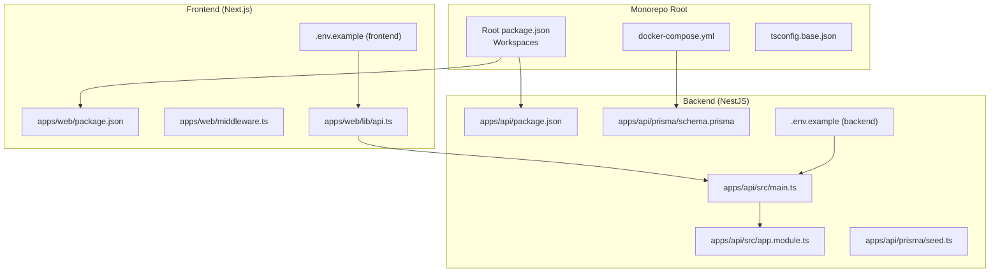
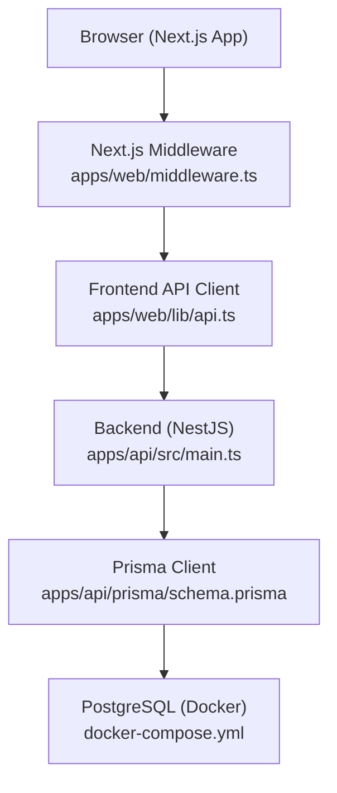
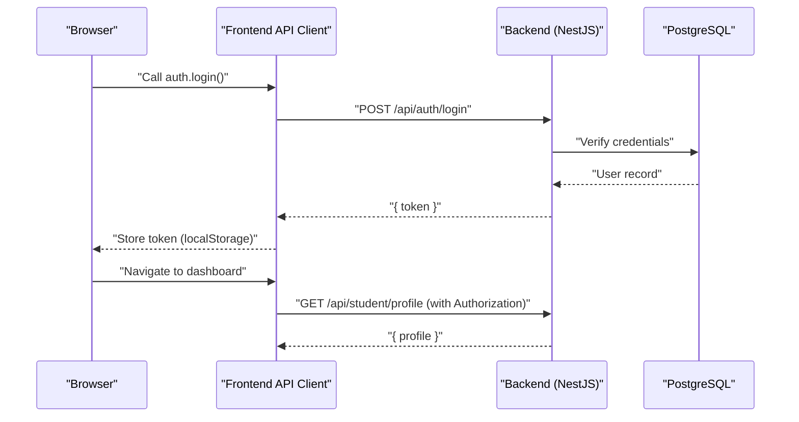
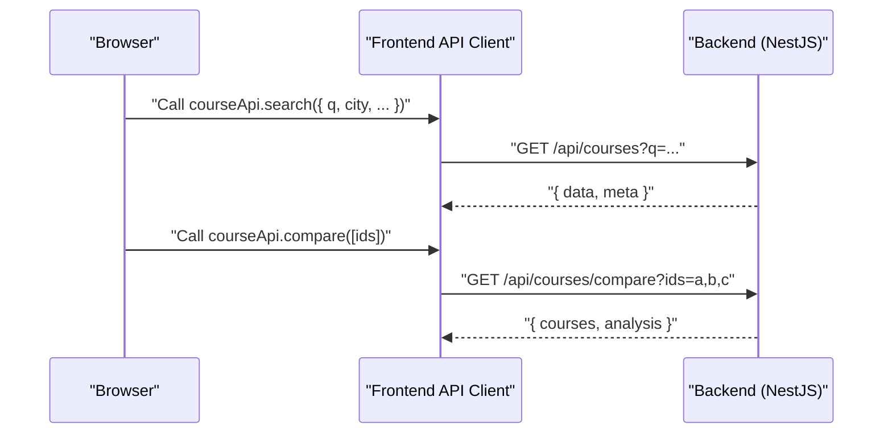
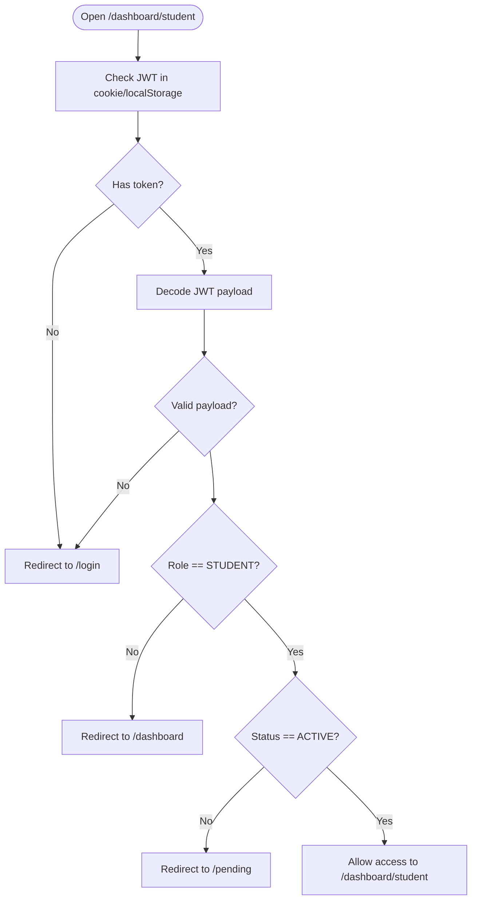
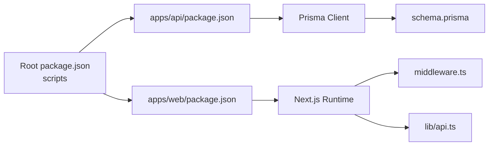

# Getting Started

<cite>
**Referenced Files in This Document**
- [README.md](file://README.md)
- [package.json](file://package.json)
- [docker-compose.yml](file://docker-compose.yml)
- [apps/api/package.json](file://apps/api/package.json)
- [apps/web/package.json](file://apps/web/package.json)
- [apps/api/.env.example](file://apps/api/.env.example)
- [apps/web/.env.example](file://apps/web/.env.example)
- [apps/api/prisma/schema.prisma](file://apps/api/prisma/schema.prisma)
- [apps/api/prisma/seed.ts](file://apps/api/prisma/seed.ts)
- [apps/api/src/main.ts](file://apps/api/src/main.ts)
- [apps/api/src/app.module.ts](file://apps/api/src/app.module.ts)
- [apps/web/middleware.ts](file://apps/web/middleware.ts)
- [apps/web/lib/api.ts](file://apps/web/lib/api.ts)
- [DEPLOYMENT.md](file://DEPLOYMENT.md)
- [tsconfig.base.json](file://tsconfig.base.json)
</cite>

## Table of Contents
1. [Introduction](#introduction)
2. [Project Structure](#project-structure)
3. [Core Components](#core-components)
4. [Architecture Overview](#architecture-overview)
5. [Detailed Component Analysis](#detailed-component-analysis)
6. [Dependency Analysis](#dependency-analysis)
7. [Performance Considerations](#performance-considerations)
8. [Troubleshooting Guide](#troubleshooting-guide)
9. [Conclusion](#conclusion)
10. [Appendices](#appendices)

## Introduction
This guide helps you set up and run Yaz Okulu Var Mı? locally for development. You will configure prerequisites, environment variables, PostgreSQL via Docker, seed the database, and launch both the backend (NestJS) and frontend (Next.js). It also includes quick tests for authentication, course search, and dashboard access, plus troubleshooting tips.

## Project Structure
The project is a monorepo with two applications:
- Backend: NestJS API under apps/api
- Frontend: Next.js 14 App Router under apps/web
- Shared configuration and database schema under the root and apps/api/prisma

**Diagram sources**
- [package.json](file://package.json#L6-L9)
- [docker-compose.yml](file://docker-compose.yml#L6-L34)
- [apps/api/package.json](file://apps/api/package.json#L1-L59)
- [apps/web/package.json](file://apps/web/package.json#L1-L38)
- [apps/api/src/main.ts](file://apps/api/src/main.ts#L10-L34)
- [apps/api/src/app.module.ts](file://apps/api/src/app.module.ts#L30-L49)
- [apps/api/prisma/schema.prisma](file://apps/api/prisma/schema.prisma#L1-L183)
- [apps/api/prisma/seed.ts](file://apps/api/prisma/seed.ts#L1-L117)
- [apps/web/middleware.ts](file://apps/web/middleware.ts#L25-L102)
- [apps/web/lib/api.ts](file://apps/web/lib/api.ts#L1-L378)
- [apps/api/.env.example](file://apps/api/.env.example#L1-L20)
- [apps/web/.env.example](file://apps/web/.env.example#L1-L13)

**Section sources**
- [README.md](file://README.md#L36-L95)
- [package.json](file://package.json#L6-L9)
- [docker-compose.yml](file://docker-compose.yml#L1-L34)

## Core Components
- Backend API (NestJS)
  - Entry point initializes global prefix, CORS, and listens on configured port.
  - Environment variables control database connection, JWT secret, port, and frontend URL.
- Frontend (Next.js)
  - Middleware enforces role-based routing and redirects based on JWT payload and user status.
  - API client wraps fetch with token injection and unified error handling.
- Database (PostgreSQL via Docker)
  - Docker Compose provisions PostgreSQL and Redis.
  - Prisma schema defines models, enums, relations, and indexes.
  - Seed script creates admin, verified universities, and sample courses.

**Section sources**
- [apps/api/src/main.ts](file://apps/api/src/main.ts#L10-L34)
- [apps/web/middleware.ts](file://apps/web/middleware.ts#L25-L102)
- [apps/web/lib/api.ts](file://apps/web/lib/api.ts#L10-L36)
- [docker-compose.yml](file://docker-compose.yml#L6-L34)
- [apps/api/prisma/schema.prisma](file://apps/api/prisma/schema.prisma#L1-L183)
- [apps/api/prisma/seed.ts](file://apps/api/prisma/seed.ts#L11-L117)

## Architecture Overview
High-level flow during development:
- Docker Compose starts PostgreSQL and Redis.
- Backend reads .env, connects to DB via Prisma, exposes /api routes.
- Frontend reads .env.local, calls backend APIs, and enforces route-level access control.

**Diagram sources**
- [apps/web/middleware.ts](file://apps/web/middleware.ts#L25-L102)
- [apps/web/lib/api.ts](file://apps/web/lib/api.ts#L7-L36)
- [apps/api/src/main.ts](file://apps/api/src/main.ts#L14-L29)
- [apps/api/prisma/schema.prisma](file://apps/api/prisma/schema.prisma#L7-L14)
- [docker-compose.yml](file://docker-compose.yml#L8-L19)

## Detailed Component Analysis

### Prerequisites and Setup
- Install prerequisites:
  - Node.js >= 18
  - Docker Desktop
  - Git
- Clone the repository and install root dependencies.
- Start Docker services for PostgreSQL and Redis.

Commands:
- Install dependencies: [package.json](file://package.json#L10-L19)
- Start Docker services: [docker-compose.yml](file://docker-compose.yml#L233-L234)

Environment configuration:
- Backend .env: copy example to .env and adjust values. [apps/api/.env.example](file://apps/api/.env.example#L1-L20)
- Frontend .env.local: copy example to .env.local. [apps/web/.env.example](file://apps/web/.env.example#L1-L13)

Database preparation:
- Generate Prisma client and apply migrations.
- Seed the database with admin, universities, and courses.

Commands:
- Generate Prisma client: [apps/api/package.json](file://apps/api/package.json#L11-L11)
- Apply migrations: [apps/api/package.json](file://apps/api/package.json#L12-L12)
- Seed data: [apps/api/package.json](file://apps/api/package.json#L14-L14) or [apps/api/prisma/seed.ts](file://apps/api/prisma/seed.ts#L1-L117)

Run applications:
- Backend: [apps/api/package.json](file://apps/api/package.json#L8-L8)
- Frontend: [apps/web/package.json](file://apps/web/package.json#L7-L7)

Access:
- Health check: GET /
- Frontend: http://localhost:3000
- Backend: http://localhost:4000/api
- Optional: Prisma Studio at http://localhost:5555

**Section sources**
- [README.md](file://README.md#L209-L293)
- [apps/api/.env.example](file://apps/api/.env.example#L6-L19)
- [apps/web/.env.example](file://apps/web/.env.example#L6-L12)
- [apps/api/package.json](file://apps/api/package.json#L11-L14)
- [apps/api/prisma/seed.ts](file://apps/api/prisma/seed.ts#L11-L117)
- [apps/api/src/main.ts](file://apps/api/src/main.ts#L14-L29)

### Authentication Flow (Quick Start)
This sequence demonstrates logging in and accessing protected routes.

**Diagram sources**
- [apps/web/lib/api.ts](file://apps/web/lib/api.ts#L54-L58)
- [apps/api/src/main.ts](file://apps/api/src/main.ts#L14-L29)
- [apps/api/prisma/schema.prisma](file://apps/api/prisma/schema.prisma#L61-L85)

**Section sources**
- [apps/web/lib/api.ts](file://apps/web/lib/api.ts#L40-L59)
- [apps/web/middleware.ts](file://apps/web/middleware.ts#L32-L72)
- [apps/api/src/main.ts](file://apps/api/src/main.ts#L14-L29)

### Course Search and Comparison (Quick Start)

**Diagram sources**
- [apps/web/lib/api.ts](file://apps/web/lib/api.ts#L63-L96)
- [apps/api/src/main.ts](file://apps/api/src/main.ts#L14-L17)

**Section sources**
- [apps/web/lib/api.ts](file://apps/web/lib/api.ts#L63-L96)

### Dashboard Access (Student)

**Diagram sources**
- [apps/web/middleware.ts](file://apps/web/middleware.ts#L25-L102)

**Section sources**
- [apps/web/middleware.ts](file://apps/web/middleware.ts#L25-L102)

## Dependency Analysis
- Root workspace scripts delegate to apps/api and apps/web.
- Backend depends on NestJS, Prisma, and related packages.
- Frontend depends on Next.js, UI libraries, and shared types.
- Database schema defines enums, relations, and indexes for performance.

**Diagram sources**
- [package.json](file://package.json#L10-L19)
- [apps/api/package.json](file://apps/api/package.json#L20-L54)
- [apps/web/package.json](file://apps/web/package.json#L12-L36)
- [apps/api/prisma/schema.prisma](file://apps/api/prisma/schema.prisma#L1-L183)
- [apps/web/middleware.ts](file://apps/web/middleware.ts#L1-L107)
- [apps/web/lib/api.ts](file://apps/web/lib/api.ts#L1-L378)

**Section sources**
- [package.json](file://package.json#L10-L19)
- [apps/api/package.json](file://apps/api/package.json#L20-L54)
- [apps/web/package.json](file://apps/web/package.json#L12-L36)

## Performance Considerations
- Database indexes are defined in Prisma schema to optimize common queries (by name, code, universityId, filters).
- Use Prisma Studio for local inspection: [apps/api/package.json](file://apps/api/package.json#L16-L16)
- Keep migrations minimal and incremental; avoid unnecessary writes to reduce migration time.

**Section sources**
- [apps/api/prisma/schema.prisma](file://apps/api/prisma/schema.prisma#L116-L122)

## Troubleshooting Guide
Common setup issues and resolutions:
- Missing migration files after cloning
  - Ensure migrations are committed and present in the repo.
  - Reference: [DEPLOYMENT.md](file://DEPLOYMENT.md#L191-L194)
- npm configuration errors related to nvm/npm 10
  - Clean nvm prefix and reset .npmrc; retry installation from root.
  - Reference: [DEPLOYMENT.md](file://DEPLOYMENT.md#L195-L217)
- Missing seed script command
  - Use workspace-aware scripts or run from apps/api.
  - Reference: [DEPLOYMENT.md](file://DEPLOYMENT.md#L246-L248)
- Prisma Decimal type mismatch in seed
  - Updated seed uses number; ensure latest code is pulled.
  - Reference: [DEPLOYMENT.md](file://DEPLOYMENT.md#L250-L252)
- API 404 due to double /api path
  - Verify NEXT_PUBLIC_API_URL ends with /api and server-side API_URL does not include /api.
  - Reference: [DEPLOYMENT.md](file://DEPLOYMENT.md#L254-L257)

Additional local checks:
- Confirm Docker containers are running and ports 5432/6379 are available.
  - Reference: [docker-compose.yml](file://docker-compose.yml#L16-L27)
- Validate environment variables match expectations.
  - Backend: [apps/api/.env.example](file://apps/api/.env.example#L6-L19)
  - Frontend: [apps/web/.env.example](file://apps/web/.env.example#L6-L12)

**Section sources**
- [DEPLOYMENT.md](file://DEPLOYMENT.md#L189-L258)
- [docker-compose.yml](file://docker-compose.yml#L16-L27)
- [apps/api/.env.example](file://apps/api/.env.example#L6-L19)
- [apps/web/.env.example](file://apps/web/.env.example#L6-L12)

## Conclusion
You now have the steps to install prerequisites, start Docker services, configure environment variables, prepare the database with Prisma, seed data, and run both backend and frontend applications. Use the quick-start examples to test authentication, course search, and dashboard access. If issues arise, consult the troubleshooting section for targeted fixes.

## Appendices

### Quick Start Commands Summary
- Install dependencies: [package.json](file://package.json#L10-L19)
- Start Docker: [docker-compose.yml](file://docker-compose.yml#L233-L234)
- Configure .env files:
  - Backend: [apps/api/.env.example](file://apps/api/.env.example#L1-L20)
  - Frontend: [apps/web/.env.example](file://apps/web/.env.example#L1-L13)
- Prepare database:
  - Generate Prisma client: [apps/api/package.json](file://apps/api/package.json#L11-L11)
  - Apply migrations: [apps/api/package.json](file://apps/api/package.json#L12-L12)
  - Seed data: [apps/api/package.json](file://apps/api/package.json#L14-L14)
- Run applications:
  - Backend: [apps/api/package.json](file://apps/api/package.json#L8-L8)
  - Frontend: [apps/web/package.json](file://apps/web/package.json#L7-L7)
- Access:
  - Health check: GET /
  - Frontend: http://localhost:3000
  - Backend: http://localhost:4000/api
  - Prisma Studio: http://localhost:5555

**Section sources**
- [README.md](file://README.md#L209-L293)
- [package.json](file://package.json#L10-L19)
- [apps/api/package.json](file://apps/api/package.json#L8-L16)
- [apps/web/package.json](file://apps/web/package.json#L7-L10)