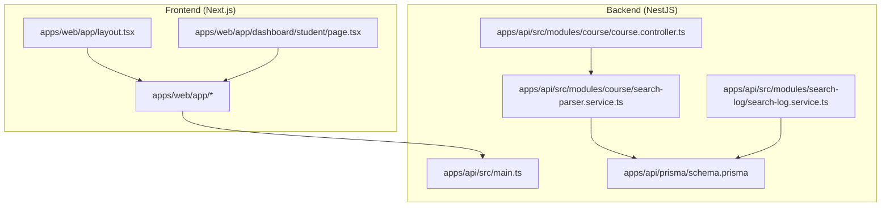
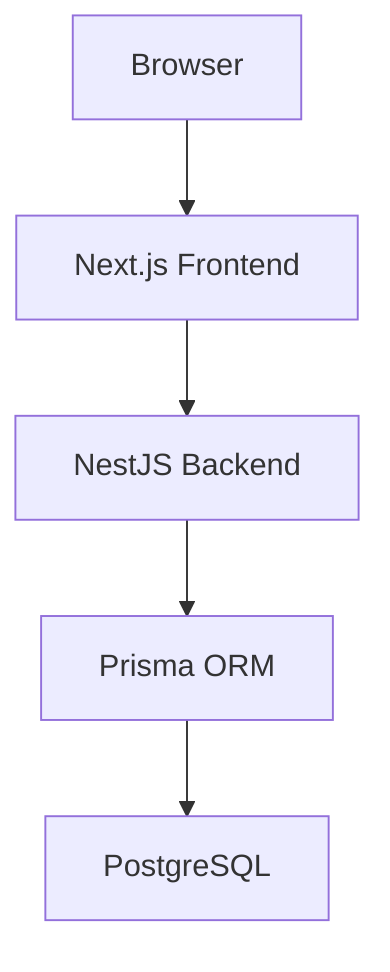
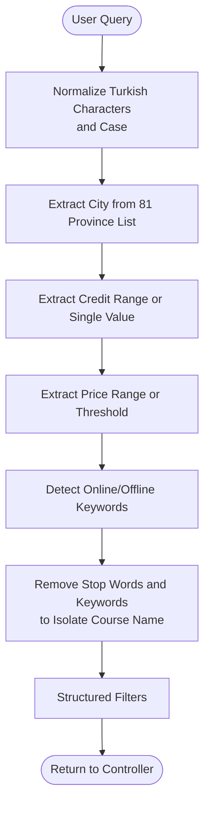
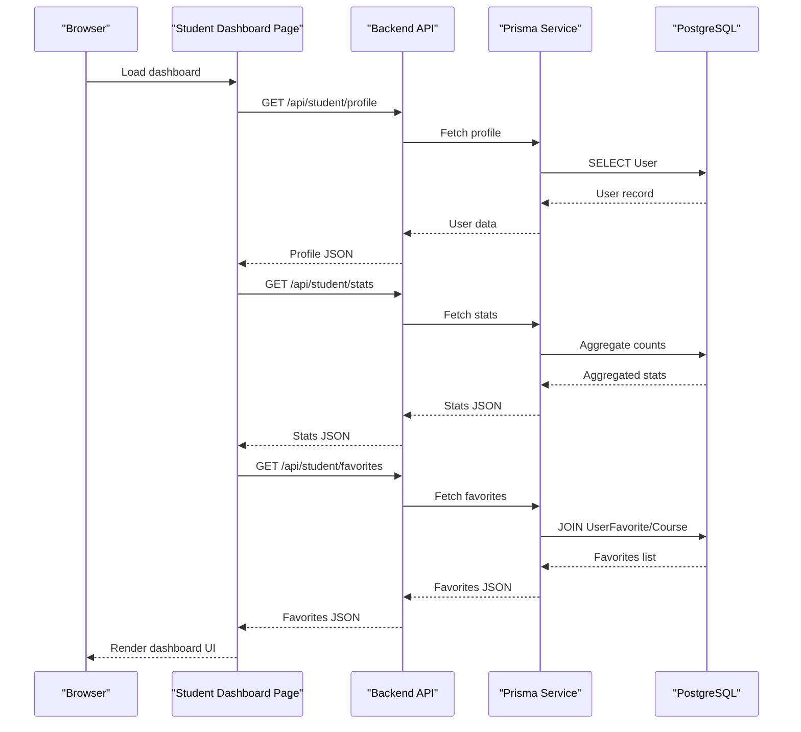
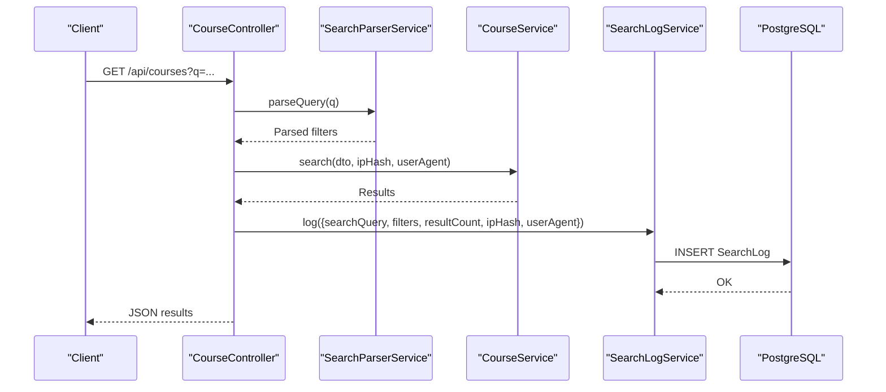
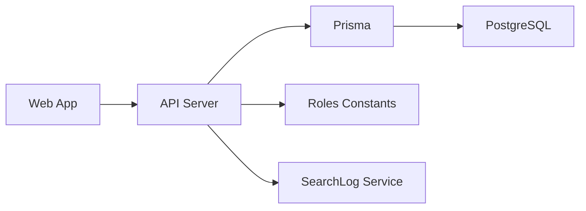

# Introduction

<cite>
**Referenced Files in This Document**
- [README.md](file://README.md)
- [apps/api/src/main.ts](file://apps/api/src/main.ts)
- [apps/api/src/modules/course/search-parser.service.ts](file://apps/api/src/modules/course/search-parser.service.ts)
- [apps/api/src/modules/course/course.controller.ts](file://apps/api/src/modules/course/course.controller.ts)
- [apps/api/prisma/schema.prisma](file://apps/api/prisma/schema.prisma)
- [apps/api/src/modules/search-log/search-log.service.ts](file://apps/api/src/modules/search-log/search-log.service.ts)
- [apps/web/app/layout.tsx](file://apps/web/app/layout.tsx)
- [apps/web/app/page.tsx](file://apps/web/app/page.tsx)
- [apps/web/app/(public)/about/page.tsx](file://apps/web/app/(public)/about/page.tsx)
- [apps/web/app/dashboard/student/page.tsx](file://apps/web/app/dashboard/student/page.tsx)
- [apps/web/app/dashboard/student/components/WelcomeCard.tsx](file://apps/web/app/dashboard/student/components/WelcomeCard.tsx)
- [apps/api/src/common/constants/roles.ts](file://apps/api/src/common/constants/roles.ts)
</cite>

## Table of Contents
1. [Introduction](#introduction)
2. [Project Structure](#project-structure)
3. [Core Components](#core-components)
4. [Architecture Overview](#architecture-overview)
5. [Detailed Component Analysis](#detailed-component-analysis)
6. [Dependency Analysis](#dependency-analysis)
7. [Performance Considerations](#performance-considerations)
8. [Troubleshooting Guide](#troubleshooting-guide)
9. [Conclusion](#conclusion)

## Introduction
Yaz Okulu Var Mı? is a centralized summer school course discovery platform for Turkish universities and students. It consolidates course offerings from across Turkey into a unified experience, solving the problem of fragmented course information by standardizing data and enabling intelligent search powered by a Turkish natural language processing parser. The platform’s mission is to increase educational access and transparency by making it easier for students to discover, compare, and apply to programs while giving universities a modern, self-service way to manage and publish their offerings.

The platform is an academic research project supported by TÜBİTAK, emphasizing rigorous data modeling, privacy-aware logging, and practical usability. It targets three primary audiences:
- Students seeking summer courses with smart filters (location, credits, price, online vs. in-person)
- University staff managing course listings and analytics
- Administrators overseeing verification, statistics, and platform governance

Why this platform was created:
- Turkish universities historically publish course information across disparate websites and formats, making it difficult for students to compare offerings and find suitable programs quickly.
- There is a strong need for a standardized, searchable, and transparent catalog that respects Turkish language nuances and regional specificity.
- Academic research support from TÜBİTAK enables innovation in Turkish NLP for search and long-term impact on higher education accessibility.

The platform’s vision:
- Create a unified map of Turkish university summer courses with real-time updates and robust analytics.
- Empower students with informed decisions through intelligent search, comparison, and personalization.
- Strengthen university visibility and administrative efficiency with a SaaS-style dashboard and widget integrations.

**Section sources**
- [README.md](file://README.md#L1-L398)
- [apps/web/app/(public)/about/page.tsx](file://apps/web/app/(public)/about/page.tsx#L67-L83)
- [apps/web/app/(public)/about/page.tsx](file://apps/web/app/(public)/about/page.tsx#L78-L84)

## Project Structure
The repository follows a monorepo architecture with two major applications:
- Backend (NestJS): API server, database schema, authentication, and business logic
- Frontend (Next.js 14): Landing pages, search experience, dashboards, and widgets

Key characteristics:
- Shared TypeScript configuration and types across packages
- Docker Compose for local development of PostgreSQL and Redis
- Strict request/response validation using Zod
- Role-based access control (RBAC) with JWT authentication
- Comprehensive database schema with enums, JSON fields, and indexes for performance

**Diagram sources**
- [apps/web/app/layout.tsx](file://apps/web/app/layout.tsx#L1-L44)
- [apps/web/app/dashboard/student/page.tsx](file://apps/web/app/dashboard/student/page.tsx#L1-L190)
- [apps/api/src/main.ts](file://apps/api/src/main.ts#L1-L34)
- [apps/api/src/modules/course/course.controller.ts](file://apps/api/src/modules/course/course.controller.ts#L1-L148)
- [apps/api/src/modules/course/search-parser.service.ts](file://apps/api/src/modules/course/search-parser.service.ts#L1-L283)
- [apps/api/prisma/schema.prisma](file://apps/api/prisma/schema.prisma#L1-L183)
- [apps/api/src/modules/search-log/search-log.service.ts](file://apps/api/src/modules/search-log/search-log.service.ts#L1-L116)

**Section sources**
- [README.md](file://README.md#L36-L95)
- [apps/api/src/main.ts](file://apps/api/src/main.ts#L1-L34)
- [apps/web/app/layout.tsx](file://apps/web/app/layout.tsx#L1-L44)

## Core Components
- Centralized course catalog: A standardized database of courses with attributes like name, code, credits (AKTS), price, online/in-person mode, dates, and university association.
- Intelligent search pipeline: Natural language parsing for Turkish queries, converting free-form requests into structured filters (city, credits, price, online/offline).
- Role-based access control: Students, university staff, and administrators with distinct permissions and workflows.
- Analytics and logging: Structured search logs for academic insights and platform monitoring.
- Student dashboard: Personalized views for favorites, recommendations, search history, viewed courses, and analytics.
- University dashboard: Course management, profile settings, and widget configuration for embedding course lists on university websites.
- Admin dashboard: Verification workflows, statistics, and governance controls.

These components collectively address the fragmentation challenge by centralizing data, enriching search with Turkish language understanding, and providing tailored experiences for each stakeholder.

**Section sources**
- [README.md](file://README.md#L9-L19)
- [apps/api/prisma/schema.prisma](file://apps/api/prisma/schema.prisma#L87-L122)
- [apps/api/src/modules/course/search-parser.service.ts](file://apps/api/src/modules/course/search-parser.service.ts#L1-L283)
- [apps/api/src/modules/course/course.controller.ts](file://apps/api/src/modules/course/course.controller.ts#L49-L75)
- [apps/api/src/modules/search-log/search-log.service.ts](file://apps/api/src/modules/search-log/search-log.service.ts#L24-L35)
- [apps/web/app/dashboard/student/page.tsx](file://apps/web/app/dashboard/student/page.tsx#L1-L190)

## Architecture Overview
The system integrates frontend and backend with clear separation of concerns:
- Frontend handles UI, routing, and user interactions, including search, comparisons, and dashboards.
- Backend exposes REST-like endpoints, validates requests, applies filters, and persists analytics.
- Database stores all entities with relational integrity and indexes optimized for common queries.
- Security layers include JWT authentication, role guards, and tenant isolation for university data.

**Diagram sources**
- [apps/web/app/layout.tsx](file://apps/web/app/layout.tsx#L1-L44)
- [apps/api/src/main.ts](file://apps/api/src/main.ts#L1-L34)
- [apps/api/prisma/schema.prisma](file://apps/api/prisma/schema.prisma#L1-L183)

**Section sources**
- [README.md](file://README.md#L22-L33)
- [apps/api/src/main.ts](file://apps/api/src/main.ts#L14-L23)

## Detailed Component Analysis

### Intelligent Turkish Search Pipeline
The search pipeline transforms natural language queries into structured filters, enabling intuitive searches like “Izmir online mathematics” or “6 credits cheap course.” It extracts:
- City (supports all 81 Turkish provinces)
- Credits (AKTS) range or single value
- Price range or thresholds
- Online vs. in-person mode
- Course name keywords

**Diagram sources**
- [apps/api/src/modules/course/search-parser.service.ts](file://apps/api/src/modules/course/search-parser.service.ts#L116-L144)
- [apps/api/src/modules/course/search-parser.service.ts](file://apps/api/src/modules/course/search-parser.service.ts#L164-L174)
- [apps/api/src/modules/course/search-parser.service.ts](file://apps/api/src/modules/course/search-parser.service.ts#L177-L195)
- [apps/api/src/modules/course/search-parser.service.ts](file://apps/api/src/modules/course/search-parser.service.ts#L198-L222)
- [apps/api/src/modules/course/search-parser.service.ts](file://apps/api/src/modules/course/search-parser.service.ts#L225-L236)
- [apps/api/src/modules/course/search-parser.service.ts](file://apps/api/src/modules/course/search-parser.service.ts#L241-L281)

**Section sources**
- [README.md](file://README.md#L16-L16)
- [apps/api/src/modules/course/search-parser.service.ts](file://apps/api/src/modules/course/search-parser.service.ts#L1-L283)
- [apps/api/src/modules/course/course.controller.ts](file://apps/api/src/modules/course/course.controller.ts#L49-L75)

### Student Dashboard Experience
The student dashboard aggregates personal data and actions:
- Welcome card with profile and recent activity metrics
- Quick actions for frequent tasks
- Recommendations based on preferences and history
- Favorites table with quick actions
- Search history and viewed courses
- Personal analytics (top searched city, average credits interest)

**Diagram sources**
- [apps/web/app/dashboard/student/page.tsx](file://apps/web/app/dashboard/student/page.tsx#L33-L59)
- [apps/web/app/dashboard/student/components/WelcomeCard.tsx](file://apps/web/app/dashboard/student/components/WelcomeCard.tsx#L40-L63)
- [apps/api/prisma/schema.prisma](file://apps/api/prisma/schema.prisma#L156-L168)
- [apps/api/prisma/schema.prisma](file://apps/api/prisma/schema.prisma#L170-L182)

**Section sources**
- [apps/web/app/dashboard/student/page.tsx](file://apps/web/app/dashboard/student/page.tsx#L1-L190)
- [apps/web/app/dashboard/student/components/WelcomeCard.tsx](file://apps/web/app/dashboard/student/components/WelcomeCard.tsx#L1-L74)
- [apps/api/prisma/schema.prisma](file://apps/api/prisma/schema.prisma#L156-L182)

### Academic Research Background and Logging
As a TÜBİTAK-supported academic research project, the platform captures structured search logs for statistical analysis and academic reporting. Logs include:
- Original query text
- Applied filters
- Result count
- Anonymized IP hash
- User agent and timestamps

**Diagram sources**
- [apps/api/src/modules/course/course.controller.ts](file://apps/api/src/modules/course/course.controller.ts#L49-L75)
- [apps/api/src/modules/course/search-parser.service.ts](file://apps/api/src/modules/course/search-parser.service.ts#L116-L144)
- [apps/api/src/modules/search-log/search-log.service.ts](file://apps/api/src/modules/search-log/search-log.service.ts#L24-L35)
- [apps/api/prisma/schema.prisma](file://apps/api/prisma/schema.prisma#L124-L138)

**Section sources**
- [README.md](file://README.md#L5-L5)
- [README.md](file://README.md#L15-L15)
- [apps/api/src/modules/search-log/search-log.service.ts](file://apps/api/src/modules/search-log/search-log.service.ts#L1-L116)
- [apps/api/prisma/schema.prisma](file://apps/api/prisma/schema.prisma#L124-L138)

## Dependency Analysis
High-level dependencies:
- Frontend depends on backend APIs for search, course details, and dashboards
- Backend depends on Prisma for database operations and on the Turkish search parser for query enrichment
- Database schema defines entities, relations, and indexes that underpin performance and integrity
- Security and access control are enforced at the controller level with guards and decorators

**Diagram sources**
- [apps/web/app/layout.tsx](file://apps/web/app/layout.tsx#L1-L44)
- [apps/api/src/main.ts](file://apps/api/src/main.ts#L1-L34)
- [apps/api/prisma/schema.prisma](file://apps/api/prisma/schema.prisma#L1-L183)
- [apps/api/src/common/constants/roles.ts](file://apps/api/src/common/constants/roles.ts#L1-L6)
- [apps/api/src/modules/search-log/search-log.service.ts](file://apps/api/src/modules/search-log/search-log.service.ts#L1-L116)

**Section sources**
- [apps/api/src/common/constants/roles.ts](file://apps/api/src/common/constants/roles.ts#L1-L6)
- [apps/api/prisma/schema.prisma](file://apps/api/prisma/schema.prisma#L1-L183)

## Performance Considerations
- Database indexing: Composite indexes on frequently queried columns (name, code, universityId) and specialized indexes (city, online mode) improve search performance.
- Query normalization: Turkish character normalization reduces ambiguity and improves match quality.
- Debounce and manual apply for numeric filters: Reduces unnecessary API calls and balances UX with performance.
- Logging anonymization: SHA-256 hashing of IPs ensures privacy while enabling analytics.

[No sources needed since this section provides general guidance]

## Troubleshooting Guide
Common issues and resolutions:
- CORS errors: Verify FRONTEND_URL environment variable and ensure the backend allows the frontend origin.
- Authentication failures: Confirm JWT token presence and validity; ensure roles guard permits access to protected routes.
- Search not returning expected results: Validate Turkish query keywords and ensure city/province names are spelled consistently with the parser’s supported list.
- Dashboard data missing: Check network requests for student endpoints and confirm user session and permissions.

**Section sources**
- [apps/api/src/main.ts](file://apps/api/src/main.ts#L19-L23)
- [apps/api/src/modules/course/course.controller.ts](file://apps/api/src/modules/course/course.controller.ts#L96-L106)

## Conclusion
Yaz Okulu Var Mı? addresses a real-world challenge in Turkish higher education by centralizing and standardizing summer course information, enriching search with a Turkish NLP parser, and delivering personalized experiences for students and universities. Backed by TÜBİTAK, the platform combines academic rigor with practical engineering to improve access, transparency, and decision-making for all stakeholders. Its modular architecture, robust security model, and thoughtful analytics infrastructure position it to evolve and scale with the needs of Turkish academia.

[No sources needed since this section summarizes without analyzing specific files]