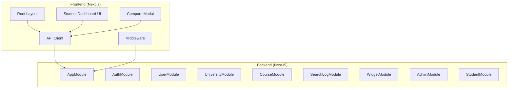
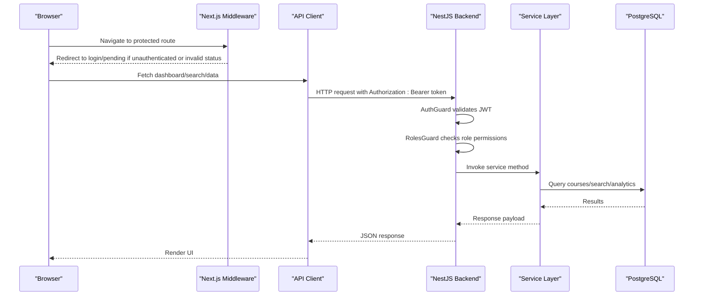
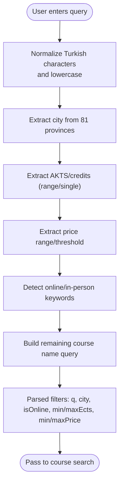
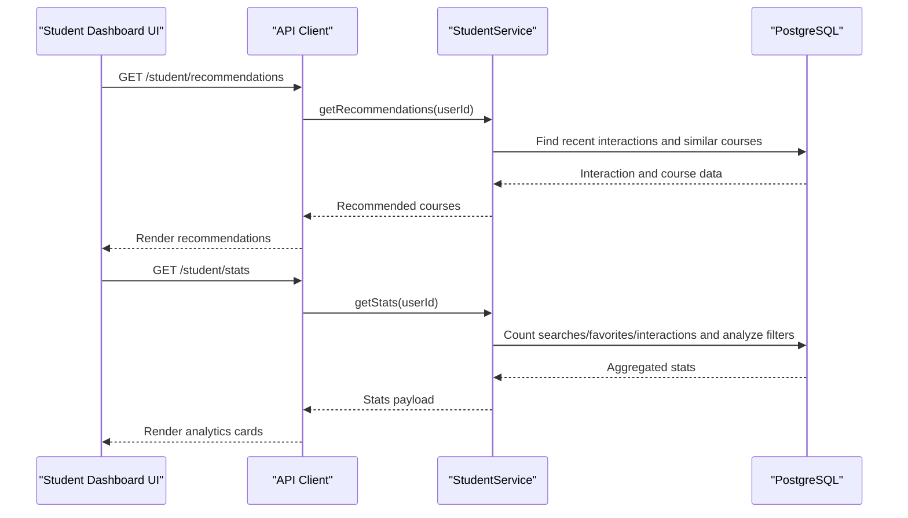
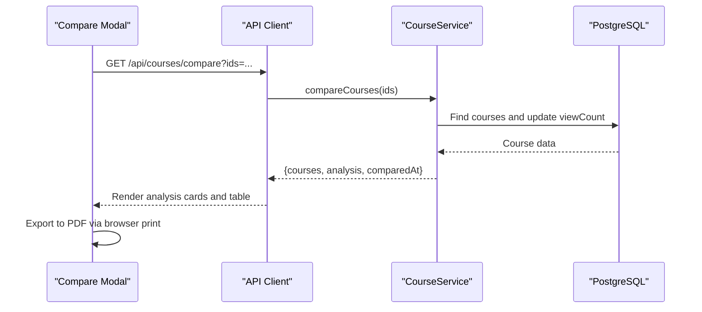
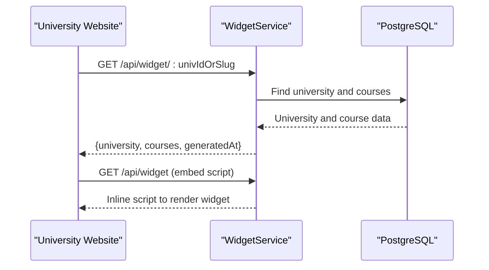
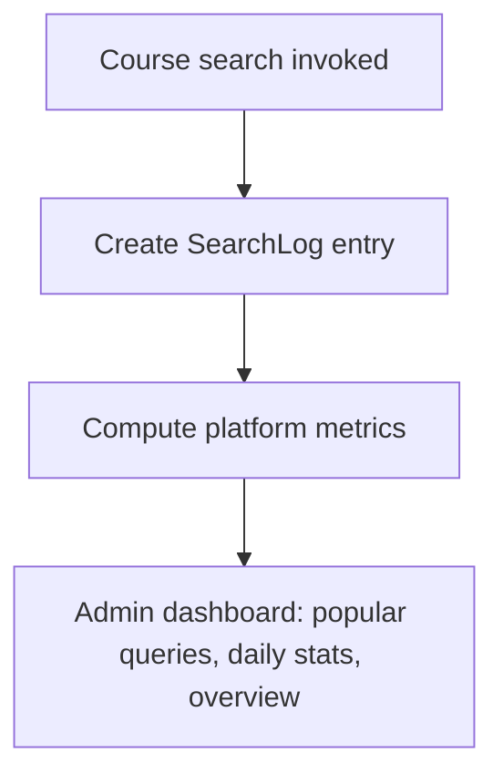
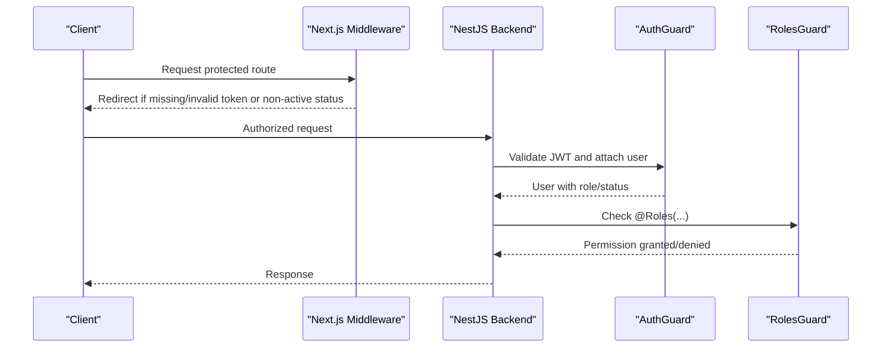
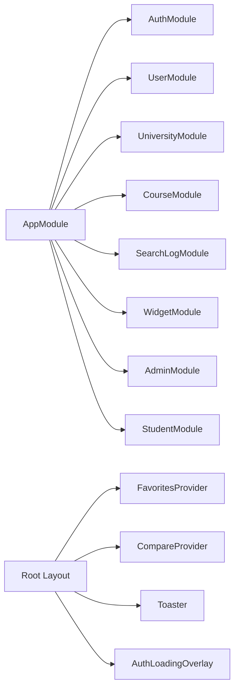

# Key Features

<cite>
**Referenced Files in This Document**
- [README.md](file://README.md)
- [app.module.ts](file://apps/api/src/app.module.ts)
- [layout.tsx](file://apps/web/app/layout.tsx)
- [roles.ts](file://apps/api/src/common/constants/roles.ts)
- [course.service.ts](file://apps/api/src/modules/course/course.service.ts)
- [search-parser.service.ts](file://apps/api/src/modules/course/search-parser.service.ts)
- [search-log.service.ts](file://apps/api/src/modules/search-log/search-log.service.ts)
- [student.service.ts](file://apps/api/src/modules/student/student.service.ts)
- [widget.service.ts](file://apps/api/src/modules/widget/widget.service.ts)
- [roles.guard.ts](file://apps/api/src/common/guards/roles.guard.ts)
- [roles.decorator.ts](file://apps/api/src/common/decorators/roles.decorator.ts)
- [auth.service.ts](file://apps/api/src/modules/auth/auth.service.ts)
- [middleware.ts](file://apps/web/middleware.ts)
- [api.ts](file://apps/web/lib/api.ts)
- [RecommendationsSection.tsx](file://apps/web/app/dashboard/student/components/RecommendationsSection.tsx)
- [PersonalAnalytics.tsx](file://apps/web/app/dashboard/student/components/PersonalAnalytics.tsx)
- [CompareModal.tsx](file://apps/web/components/compare/CompareModal.tsx)
</cite>

## Table of Contents
1. [Introduction](#introduction)
2. [Project Structure](#project-structure)
3. [Core Components](#core-components)
4. [Architecture Overview](#architecture-overview)
5. [Detailed Component Analysis](#detailed-component-analysis)
6. [Dependency Analysis](#dependency-analysis)
7. [Performance Considerations](#performance-considerations)
8. [Troubleshooting Guide](#troubleshooting-guide)
9. [Conclusion](#conclusion)

## Introduction
Yaz Okulu Var Mı? is a centralized platform for Turkey’s summer course discovery, offering intelligent search, personalization, analytics, and enterprise-grade integration. It standardizes university course data, powers smart course filtering with Turkish natural language processing, delivers a personalized student dashboard, enables course comparison, exposes a headless widget API for custom university branding, records academic search logs for research, and enforces role-based access control with JWT authentication. This document focuses on the platform’s key features, their user value, and the technical innovations that make them possible.

## Project Structure
The platform follows a monorepo architecture with a NestJS backend and a Next.js frontend, organized into feature-focused modules and shared UI components.

**Diagram sources**
- [app.module.ts](file://apps/api/src/app.module.ts#L30-L46)
- [layout.tsx](file://apps/web/app/layout.tsx#L24-L42)

**Section sources**
- [README.md](file://README.md#L36-L95)
- [app.module.ts](file://apps/api/src/app.module.ts#L30-L46)
- [layout.tsx](file://apps/web/app/layout.tsx#L24-L42)

## Core Components
- Intelligent course search with Turkish natural language parsing
- Personalized student dashboard with recommendations and analytics
- Course comparison system with analysis and PDF export
- University widget API for custom branding and headless embedding
- Academic logging and analytics for research and insights
- Role-based access control with JWT authentication and middleware enforcement

**Section sources**
- [README.md](file://README.md#L9-L18)
- [search-parser.service.ts](file://apps/api/src/modules/course/search-parser.service.ts#L116-L144)
- [student.service.ts](file://apps/api/src/modules/student/student.service.ts#L223-L290)
- [course.service.ts](file://apps/api/src/modules/course/course.service.ts#L235-L308)
- [widget.service.ts](file://apps/api/src/modules/widget/widget.service.ts#L18-L67)
- [search-log.service.ts](file://apps/api/src/modules/search-log/search-log.service.ts#L25-L114)
- [roles.guard.ts](file://apps/api/src/common/guards/roles.guard.ts#L24-L54)
- [auth.service.ts](file://apps/api/src/modules/auth/auth.service.ts#L46-L130)

## Architecture Overview
The system integrates a frontend middleware layer with a backend protected by JWT and RBAC guards. Data flows through API clients, services, and database queries, while search logs capture academic insights.

**Diagram sources**
- [middleware.ts](file://apps/web/middleware.ts#L25-L101)
- [api.ts](file://apps/web/lib/api.ts#L11-L36)
- [roles.guard.ts](file://apps/api/src/common/guards/roles.guard.ts#L24-L54)
- [auth.service.ts](file://apps/api/src/modules/auth/auth.service.ts#L136-L170)
- [course.service.ts](file://apps/api/src/modules/course/course.service.ts#L31-L133)
- [search-log.service.ts](file://apps/api/src/modules/search-log/search-log.service.ts#L25-L35)

## Detailed Component Analysis

### Smart Course Filtering and Turkish Natural Language Search
- Purpose: Convert natural language queries like “Izmir online mathematics” into structured filters for city, online status, credits, and price.
- Implementation highlights:
  - Normalize Turkish characters and case-insensitively match city names across 81 provinces.
  - Extract credit (AKTS/Kredi) ranges and single values.
  - Parse price ranges and thresholds (under/over a value).
  - Identify online vs. in-person offerings.
  - Strip parsed tokens from the query to form a clean course name filter.
- User value: Students can search in Turkish without learning filters—results are fast and accurate.

**Diagram sources**
- [search-parser.service.ts](file://apps/api/src/modules/course/search-parser.service.ts#L116-L144)
- [search-parser.service.ts](file://apps/api/src/modules/course/search-parser.service.ts#L164-L174)
- [search-parser.service.ts](file://apps/api/src/modules/course/search-parser.service.ts#L177-L195)
- [search-parser.service.ts](file://apps/api/src/modules/course/search-parser.service.ts#L198-L222)
- [search-parser.service.ts](file://apps/api/src/modules/course/search-parser.service.ts#L225-L236)
- [search-parser.service.ts](file://apps/api/src/modules/course/search-parser.service.ts#L241-L281)

**Section sources**
- [search-parser.service.ts](file://apps/api/src/modules/course/search-parser.service.ts#L116-L144)
- [course.service.ts](file://apps/api/src/modules/course/course.service.ts#L31-L133)

### Personalized Student Dashboard with Recommendations and Analytics
- Purpose: Provide students with tailored course suggestions and personal analytics derived from their interactions.
- Implementation highlights:
  - Recommendations engine considers viewed courses’ city and average credits, then retrieves verified courses meeting similar profiles.
  - Analytics compute top searched city and average interest in credits.
  - Favorites, search history, and interactions are stored and surfaced.
- User value: Save time by seeing relevant courses and understanding personal preferences.

**Diagram sources**
- [student.service.ts](file://apps/api/src/modules/student/student.service.ts#L223-L290)
- [student.service.ts](file://apps/api/src/modules/student/student.service.ts#L48-L100)
- [RecommendationsSection.tsx](file://apps/web/app/dashboard/student/components/RecommendationsSection.tsx#L30-L54)
- [PersonalAnalytics.tsx](file://apps/web/app/dashboard/student/components/PersonalAnalytics.tsx#L16-L45)

**Section sources**
- [student.service.ts](file://apps/api/src/modules/student/student.service.ts#L223-L290)
- [student.service.ts](file://apps/api/src/modules/student/student.service.ts#L48-L100)
- [RecommendationsSection.tsx](file://apps/web/app/dashboard/student/components/RecommendationsSection.tsx#L30-L54)
- [PersonalAnalytics.tsx](file://apps/web/app/dashboard/student/components/PersonalAnalytics.tsx#L16-L45)

### Course Comparison System
- Purpose: Allow students to compare 2–4 courses side-by-side with pricing, credits, online/onsite distribution, and export to PDF.
- Implementation highlights:
  - Validates selection bounds and fetches course details with university metadata.
  - Computes statistics (average/minimum/maximum price and credits, online/onsite counts, city/university diversity).
  - Updates view counts for each compared course.
- User value: Make informed decisions by comparing multiple options at once.

**Diagram sources**
- [course.service.ts](file://apps/api/src/modules/course/course.service.ts#L235-L308)
- [CompareModal.tsx](file://apps/web/components/compare/CompareModal.tsx#L317-L356)
- [CompareModal.tsx](file://apps/web/components/compare/CompareModal.tsx#L414-L424)

**Section sources**
- [course.service.ts](file://apps/api/src/modules/course/course.service.ts#L235-L308)
- [CompareModal.tsx](file://apps/web/components/compare/CompareModal.tsx#L317-L356)
- [CompareModal.tsx](file://apps/web/components/compare/CompareModal.tsx#L414-L424)

### University Widget API for Custom Branding
- Purpose: Enable universities to embed their course catalog into their own websites with a headless JSON API and optional auto-generated embed script.
- Implementation highlights:
  - Returns university metadata and verified courses with essential attributes.
  - Supports lookup by university ID or slug.
  - Provides an embed script that dynamically renders course listings with theme-aware styling.
- User value: Universities maintain brand consistency while sharing course data seamlessly.

**Diagram sources**
- [widget.service.ts](file://apps/api/src/modules/widget/widget.service.ts#L18-L67)
- [widget.service.ts](file://apps/api/src/modules/widget/widget.service.ts#L70-L106)

**Section sources**
- [widget.service.ts](file://apps/api/src/modules/widget/widget.service.ts#L18-L67)
- [widget.service.ts](file://apps/api/src/modules/widget/widget.service.ts#L70-L106)

### Academic Logging and Analytics
- Purpose: Capture search queries and filters for academic research and platform insights.
- Implementation highlights:
  - Logs each search with query, applied filters, result count, anonymized IP hash, and user agent.
  - Provides administrative dashboards for popular searches, daily statistics, and overview metrics.
- User value: Enables evidence-based improvements and supports academic publications.

**Diagram sources**
- [course.service.ts](file://apps/api/src/modules/course/course.service.ts#L104-L122)
- [search-log.service.ts](file://apps/api/src/modules/search-log/search-log.service.ts#L25-L35)
- [search-log.service.ts](file://apps/api/src/modules/search-log/search-log.service.ts#L46-L59)
- [search-log.service.ts](file://apps/api/src/modules/search-log/search-log.service.ts#L65-L90)
- [search-log.service.ts](file://apps/api/src/modules/search-log/search-log.service.ts#L93-L114)

**Section sources**
- [course.service.ts](file://apps/api/src/modules/course/course.service.ts#L104-L122)
- [search-log.service.ts](file://apps/api/src/modules/search-log/search-log.service.ts#L25-L35)
- [search-log.service.ts](file://apps/api/src/modules/search-log/search-log.service.ts#L46-L59)
- [search-log.service.ts](file://apps/api/src/modules/search-log/search-log.service.ts#L65-L90)
- [search-log.service.ts](file://apps/api/src/modules/search-log/search-log.service.ts#L93-L114)

### Role-Based Access Control and Authentication
- Purpose: Secure routes and resources using JWT, role checks, and status gating.
- Implementation highlights:
  - Frontend middleware decodes token and redirects unauthorized users or those with non-active statuses.
  - Backend uses AuthGuard and RolesGuard to enforce permissions per endpoint.
  - Decorators define allowed roles per controller/method.
  - Registration enforces .edu.tr for university officials and sets initial status.
- User value: Clear, secure access boundaries tailored to each persona.

**Diagram sources**
- [middleware.ts](file://apps/web/middleware.ts#L25-L101)
- [auth.service.ts](file://apps/api/src/modules/auth/auth.service.ts#L136-L170)
- [roles.guard.ts](file://apps/api/src/common/guards/roles.guard.ts#L24-L54)
- [roles.decorator.ts](file://apps/api/src/common/decorators/roles.decorator.ts#L15-L16)

**Section sources**
- [middleware.ts](file://apps/web/middleware.ts#L25-L101)
- [auth.service.ts](file://apps/api/src/modules/auth/auth.service.ts#L46-L130)
- [roles.guard.ts](file://apps/api/src/common/guards/roles.guard.ts#L24-L54)
- [roles.decorator.ts](file://apps/api/src/common/decorators/roles.decorator.ts#L15-L16)
- [roles.ts](file://apps/api/src/common/constants/roles.ts#L5-L6)

## Dependency Analysis
The backend module composition and frontend providers establish cohesive feature delivery and cross-cutting concerns.

**Diagram sources**
- [app.module.ts](file://apps/api/src/app.module.ts#L30-L46)
- [layout.tsx](file://apps/web/app/layout.tsx#L29-L40)

**Section sources**
- [app.module.ts](file://apps/api/src/app.module.ts#L30-L46)
- [layout.tsx](file://apps/web/app/layout.tsx#L29-L40)

## Performance Considerations
- Pagination and limits: Search enforces a maximum page size to cap resource usage.
- Indexing: Database schema includes indexes on frequently filtered fields (city, role, status, course name/code) to improve query performance.
- Asynchronous operations: Parallel counting and fetching reduce round-trips during search.
- Caching: Redis caching is planned for frequent queries to further optimize load times.

[No sources needed since this section provides general guidance]

## Troubleshooting Guide
- Authentication failures:
  - Verify token presence and validity in cookies/local storage and ensure the backend URL is configured correctly.
  - Confirm user status is ACTIVE for access; PENDING users are redirected to a pending page.
- Authorization errors:
  - Ensure the user’s role matches the endpoint’s required roles.
  - Check that multitenancy rules are respected (e.g., university staff can only manage their own courses).
- Search anomalies:
  - Confirm the query meets parsing expectations (e.g., Turkish province names, numeric ranges).
  - Review search logs for malformed entries and adjust parsing rules if needed.
- Widget rendering:
  - Validate university slug/id and verification status; only verified universities are exposed via the widget API.

**Section sources**
- [middleware.ts](file://apps/web/middleware.ts#L25-L101)
- [auth.service.ts](file://apps/api/src/modules/auth/auth.service.ts#L136-L170)
- [roles.guard.ts](file://apps/api/src/common/guards/roles.guard.ts#L24-L54)
- [course.service.ts](file://apps/api/src/modules/course/course.service.ts#L31-L133)
- [widget.service.ts](file://apps/api/src/modules/widget/widget.service.ts#L18-L67)

## Conclusion
Yaz Okulu Var Mı? combines intelligent Turkish language parsing, robust personalization, and enterprise-ready integrations to deliver a powerful, secure, and insightful platform for students and universities. Its layered architecture, strong access controls, and academic logging support both user-centric experiences and research-grade insights.